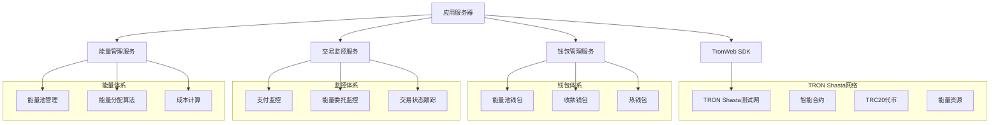

# TRON区块链集成方案 (Shasta测试网)

## 1. TRON网络架构

### 1.1 整体架构



### 1.2 技术栈

- **区块链SDK**: TronWeb@5.3.0
- **网络**: TRON Shasta测试网
- **节点服务**: TronGrid API
- **钱包管理**: 自研钱包服务 + 硬件安全模块
- **交易监控**: WebSocket + 轮询机制
- **能量计算**: 自研算法引擎

## 2. TRON网络配置

### 2.1 网络参数

```javascript
// TRON Shasta测试网配置
const TRON_CONFIG = {
  // 网络配置
  network: {
    name: 'Shasta',
    fullHost: 'https://api.shasta.trongrid.io',
    solidityNode: 'https://api.shasta.trongrid.io',
    eventServer: 'https://api.shasta.trongrid.io',
    privateKey: process.env.TRON_PRIVATE_KEY,
    apiKey: process.env.TRONGRID_API_KEY
  },
  
  // 合约地址
  contracts: {
    // USDT TRC20合约地址 (Shasta测试网)
    USDT: 'TG3XXyExBkPp9nzdajDZsozEu4BkaSJozs',
    // 其他测试代币
    TEST_TOKEN: 'TXYZpUAh2cGS4k9fycKJitaK4Fc4BKBwif'
  },
  
  // 能量参数
  energy: {
    // TRC20转账消耗的能量
    TRC20_TRANSFER_ENERGY: 31895,
    // 能量价格 (sun/energy)
    ENERGY_PRICE: 420,
    // 最小委托时长 (小时)
    MIN_DELEGATE_HOURS: 1,
    // 最大委托时长 (小时)
    MAX_DELEGATE_HOURS: 72
  },
  
  // 费用配置
  fees: {
    // 带宽费用 (sun)
    BANDWIDTH_FEE: 1000,
    // 账户激活费用 (TRX)
    ACCOUNT_ACTIVATION_FEE: 1,
    // 平台手续费率
    PLATFORM_FEE_RATE: 0.05
  }
};
```

### 2.2 TronWeb初始化

```javascript
const TronWeb = require('tronweb');

class TronService {
  constructor() {
    this.tronWeb = new TronWeb({
      fullHost: TRON_CONFIG.network.fullHost,
      headers: {
        'TRON-PRO-API-KEY': TRON_CONFIG.network.apiKey
      },
      privateKey: TRON_CONFIG.network.privateKey
    });
  }
  
  // 验证网络连接
  async validateConnection() {
    try {
      const nodeInfo = await this.tronWeb.trx.getNodeInfo();
      console.log('TRON网络连接成功:', nodeInfo.configNodeInfo.codeVersion);
      return true;
    } catch (error) {
      console.error('TRON网络连接失败:', error);
      return false;
    }
  }
  
  // 获取网络状态
  async getNetworkStatus() {
    const chainParameters = await this.tronWeb.trx.getChainParameters();
    const nodeInfo = await this.tronWeb.trx.getNodeInfo();
    
    return {
      network: 'Shasta',
      blockHeight: nodeInfo.beginSyncNum,
      energyPrice: this.getEnergyPrice(chainParameters),
      bandwidthPrice: this.getBandwidthPrice(chainParameters)
    };
  }
}
```

## 3. 钱包管理系统

### 3.1 钱包架构

```javascript
// 钱包管理服务
class WalletManager {
  constructor() {
    this.energyPools = new Map(); // 能量池钱包
    this.hotWallets = new Map();  // 热钱包
    this.coldWallets = new Map(); // 冷钱包
  }
  
  // 创建新钱包
  async createWallet(type = 'energy_pool') {
    const account = await this.tronWeb.createAccount();
    
    const wallet = {
      address: account.address.base58,
      privateKey: account.privateKey,
      publicKey: account.publicKey,
      type: type,
      created_at: new Date(),
      is_active: true
    };
    
    // 加密存储私钥
    wallet.encrypted_private_key = await this.encryptPrivateKey(wallet.privateKey);
    delete wallet.privateKey;
    
    // 保存到数据库
    await EnergyPool.create(wallet);
    
    return wallet;
  }
  
  // 获取钱包余额
  async getWalletBalance(address) {
    const balance = await this.tronWeb.trx.getBalance(address);
    const account = await this.tronWeb.trx.getAccount(address);
    
    return {
      trx: this.tronWeb.fromSun(balance),
      energy: account.account_resource?.energy_usage_total || 0,
      bandwidth: account.bandwidth || 0,
      frozen_balance: account.frozen?.[0]?.frozen_balance || 0
    };
  }
  
  // 获取账户资源
  async getAccountResources(address) {
    const resources = await this.tronWeb.trx.getAccountResources(address);
    
    return {
      energy: {
        used: resources.EnergyUsed || 0,
        limit: resources.EnergyLimit || 0,
        available: (resources.EnergyLimit || 0) - (resources.EnergyUsed || 0)
      },
      bandwidth: {
        used: resources.NetUsed || 0,
        limit: resources.NetLimit || 0,
        available: (resources.NetLimit || 0) - (resources.NetUsed || 0)
      }
    };
  }
}
```

### 3.2 能量池管理

```javascript
// 能量池管理服务
class EnergyPoolManager {
  constructor() {
    this.pools = new Map();
    this.loadPools();
  }
  
  // 加载能量池
  async loadPools() {
    const pools = await EnergyPool.findAll({
      where: { is_active: true }
    });
    
    for (const pool of pools) {
      this.pools.set(pool.address, {
        ...pool.dataValues,
        privateKey: await this.decryptPrivateKey(pool.encrypted_private_key)
      });
    }
  }
  
  // 选择最优能量池
  async selectOptimalPool(requiredEnergy) {
    let bestPool = null;
    let maxAvailableEnergy = 0;
    
    for (const [address, pool] of this.pools) {
      const resources = await this.getAccountResources(address);
      const availableEnergy = resources.energy.available;
      
      if (availableEnergy >= requiredEnergy && availableEnergy > maxAvailableEnergy) {
        bestPool = pool;
        maxAvailableEnergy = availableEnergy;
      }
    }
    
    return bestPool;
  }
  
  // 委托能量
  async delegateEnergy(fromAddress, toAddress, amount, duration = 1) {
    const pool = this.pools.get(fromAddress);
    if (!pool) {
      throw new Error('能量池不存在');
    }
    
    // 创建TronWeb实例
    const tronWeb = new TronWeb({
      fullHost: TRON_CONFIG.network.fullHost,
      privateKey: pool.privateKey
    });
    
    try {
      // 构建委托交易
      const transaction = await tronWeb.transactionBuilder.delegateResource(
        amount * 1000000, // 转换为sun
        toAddress,
        'ENERGY',
        fromAddress,
        false, // 不锁定
        duration * 3600 // 转换为秒
      );
      
      // 签名交易
      const signedTransaction = await tronWeb.trx.sign(transaction);
      
      // 广播交易
      const result = await tronWeb.trx.sendRawTransaction(signedTransaction);
      
      if (result.result) {
        // 记录委托交易
        await EnergyTransaction.create({
          pool_id: pool.id,
          tx_hash: result.txid,
          from_address: fromAddress,
          to_address: toAddress,
          energy_amount: amount,
          duration_hours: duration,
          status: 'pending'
        });
        
        return {
          success: true,
          txHash: result.txid,
          energyAmount: amount,
          duration: duration
        };
      } else {
        throw new Error('交易广播失败');
      }
    } catch (error) {
      console.error('能量委托失败:', error);
      throw error;
    }
  }
  
  // 取消能量委托
  async undelegateEnergy(fromAddress, toAddress, amount) {
    const pool = this.pools.get(fromAddress);
    if (!pool) {
      throw new Error('能量池不存在');
    }
    
    const tronWeb = new TronWeb({
      fullHost: TRON_CONFIG.network.fullHost,
      privateKey: pool.privateKey
    });
    
    try {
      const transaction = await tronWeb.transactionBuilder.undelegateResource(
        amount * 1000000,
        toAddress,
        'ENERGY',
        fromAddress
      );
      
      const signedTransaction = await tronWeb.trx.sign(transaction);
      const result = await tronWeb.trx.sendRawTransaction(signedTransaction);
      
      return {
        success: result.result,
        txHash: result.txid
      };
    } catch (error) {
      console.error('取消能量委托失败:', error);
      throw error;
    }
  }
}
```

## 4. 交易监控系统

### 4.1 支付监控

```javascript
// 支付监控服务
class PaymentMonitor {
  constructor() {
    this.monitoringAddresses = new Set();
    this.pendingOrders = new Map();
    this.startMonitoring();
  }
  
  // 添加监控地址
  addMonitoringAddress(address, orderId) {
    this.monitoringAddresses.add(address);
    this.pendingOrders.set(address, orderId);
  }
  
  // 开始监控
  startMonitoring() {
    // 每10秒检查一次
    setInterval(async () => {
      await this.checkPayments();
    }, 10000);
  }
  
  // 检查支付
  async checkPayments() {
    for (const address of this.monitoringAddresses) {
      try {
        const transactions = await this.getRecentTransactions(address);
        
        for (const tx of transactions) {
          if (await this.isValidPayment(tx, address)) {
            await this.processPayment(tx, address);
          }
        }
      } catch (error) {
        console.error(`监控地址 ${address} 失败:`, error);
      }
    }
  }
  
  // 获取最近交易
  async getRecentTransactions(address) {
    const response = await this.tronWeb.trx.getTransactionsFromAddress(address, 10);
    return response.filter(tx => {
      // 只关注最近5分钟的交易
      const txTime = tx.raw_data.timestamp;
      const now = Date.now();
      return (now - txTime) < 5 * 60 * 1000;
    });
  }
  
  // 验证支付
  async isValidPayment(transaction, address) {
    // 检查是否是TRC20转账
    if (transaction.raw_data.contract[0].type !== 'TriggerSmartContract') {
      return false;
    }
    
    // 检查合约地址是否是USDT
    const contractAddress = transaction.raw_data.contract[0].parameter.value.contract_address;
    if (contractAddress !== TRON_CONFIG.contracts.USDT) {
      return false;
    }
    
    // 检查接收地址
    const toAddress = this.parseTransferToAddress(transaction);
    if (toAddress !== address) {
      return false;
    }
    
    return true;
  }
  
  // 处理支付
  async processPayment(transaction, address) {
    const orderId = this.pendingOrders.get(address);
    if (!orderId) return;
    
    const amount = this.parseTransferAmount(transaction);
    
    // 更新订单状态
    await Order.update(
      {
        status: 'paid',
        tx_hash: transaction.txID,
        paid_amount: amount,
        paid_at: new Date()
      },
      {
        where: { id: orderId }
      }
    );
    
    // 触发能量委托
    await this.triggerEnergyDelegation(orderId);
    
    // 移除监控
    this.monitoringAddresses.delete(address);
    this.pendingOrders.delete(address);
  }
}
```

### 4.2 交易状态跟踪

```javascript
// 交易状态跟踪服务
class TransactionTracker {
  constructor() {
    this.pendingTransactions = new Map();
    this.startTracking();
  }
  
  // 添加跟踪交易
  addTransaction(txHash, orderId, type = 'energy_delegate') {
    this.pendingTransactions.set(txHash, {
      orderId,
      type,
      startTime: Date.now(),
      retryCount: 0
    });
  }
  
  // 开始跟踪
  startTracking() {
    setInterval(async () => {
      await this.checkTransactionStatus();
    }, 15000); // 每15秒检查一次
  }
  
  // 检查交易状态
  async checkTransactionStatus() {
    for (const [txHash, info] of this.pendingTransactions) {
      try {
        const txInfo = await this.tronWeb.trx.getTransactionInfo(txHash);
        
        if (txInfo.id) {
          // 交易已确认
          if (txInfo.receipt.result === 'SUCCESS') {
            await this.handleTransactionSuccess(txHash, info, txInfo);
          } else {
            await this.handleTransactionFailure(txHash, info, txInfo);
          }
          
          this.pendingTransactions.delete(txHash);
        } else {
          // 交易还在pending状态
          await this.handlePendingTransaction(txHash, info);
        }
      } catch (error) {
        console.error(`跟踪交易 ${txHash} 失败:`, error);
        info.retryCount++;
        
        if (info.retryCount > 10) {
          await this.handleTransactionTimeout(txHash, info);
          this.pendingTransactions.delete(txHash);
        }
      }
    }
  }
  
  // 处理交易成功
  async handleTransactionSuccess(txHash, info, txInfo) {
    if (info.type === 'energy_delegate') {
      await Order.update(
        {
          status: 'completed',
          completed_at: new Date(),
          energy_tx_hash: txHash,
          energy_fee: txInfo.fee || 0
        },
        {
          where: { id: info.orderId }
        }
      );
      
      // 发送完成通知给用户
      await this.notifyOrderCompleted(info.orderId);
    }
  }
  
  // 处理交易失败
  async handleTransactionFailure(txHash, info, txInfo) {
    await Order.update(
      {
        status: 'failed',
        error_message: txInfo.receipt.result,
        failed_at: new Date()
      },
      {
        where: { id: info.orderId }
      }
    );
    
    // 发送失败通知
    await this.notifyOrderFailed(info.orderId, txInfo.receipt.result);
  }
}
```

## 5. 能量计算和定价

### 5.1 能量需求计算

```javascript
// 能量计算服务
class EnergyCalculator {
  // 计算TRC20转账所需能量
  static calculateTRC20Energy(tokenAddress, amount, decimals = 6) {
    // 基础TRC20转账能量消耗
    let baseEnergy = TRON_CONFIG.energy.TRC20_TRANSFER_ENERGY;
    
    // 根据代币类型调整
    if (tokenAddress === TRON_CONFIG.contracts.USDT) {
      baseEnergy = 31895; // USDT实际消耗
    }
    
    // 根据转账金额调整（大额转账可能消耗更多能量）
    const adjustedAmount = amount / Math.pow(10, decimals);
    if (adjustedAmount > 10000) {
      baseEnergy *= 1.1; // 增加10%
    }
    
    return Math.ceil(baseEnergy);
  }
  
  // 计算能量价格
  static calculateEnergyPrice(energyAmount, duration = 1) {
    const basePrice = TRON_CONFIG.energy.ENERGY_PRICE; // sun per energy
    const platformFeeRate = TRON_CONFIG.fees.PLATFORM_FEE_RATE;
    
    // 基础成本
    const baseCost = energyAmount * basePrice;
    
    // 时长调整
    const durationMultiplier = this.getDurationMultiplier(duration);
    
    // 平台费用
    const platformFee = baseCost * platformFeeRate;
    
    // 总价格（sun）
    const totalPriceSun = (baseCost + platformFee) * durationMultiplier;
    
    // 转换为TRX
    const totalPriceTrx = totalPriceSun / 1000000;
    
    return {
      energyAmount,
      duration,
      baseCostSun: baseCost,
      platformFeeSun: platformFee,
      totalPriceSun: Math.ceil(totalPriceSun),
      totalPriceTrx: totalPriceTrx,
      totalPriceUsd: totalPriceTrx * this.getTrxPrice() // 假设有TRX价格接口
    };
  }
  
  // 获取时长倍数
  static getDurationMultiplier(hours) {
    if (hours <= 1) return 1.0;
    if (hours <= 6) return 0.95;
    if (hours <= 24) return 0.9;
    if (hours <= 72) return 0.85;
    return 0.8;
  }
  
  // 获取TRX价格（模拟）
  static getTrxPrice() {
    // 实际应该从价格API获取
    return 0.08; // USD
  }
  
  // 计算套餐推荐
  static recommendPackage(userHistory) {
    // 分析用户历史使用情况
    const avgEnergyUsage = userHistory.reduce((sum, order) => {
      return sum + order.energy_amount;
    }, 0) / userHistory.length;
    
    // 推荐合适的套餐
    if (avgEnergyUsage < 50000) {
      return 'basic'; // 基础套餐
    } else if (avgEnergyUsage < 100000) {
      return 'standard'; // 标准套餐
    } else if (avgEnergyUsage < 200000) {
      return 'premium'; // 高级套餐
    } else {
      return 'enterprise'; // 企业套餐
    }
  }
}
```

### 5.2 管理后台定价配置策略

```javascript
// 价格配置管理服务
class PriceConfigService {
  constructor() {
    this.priceCache = new Map();
    this.loadPriceConfigs();
  }
  
  // 加载价格配置
  async loadPriceConfigs() {
    const configs = await PriceConfig.findAll({
      where: { is_active: true },
      include: [{ model: TelegramBot, as: 'bot' }]
    });
    
    for (const config of configs) {
      this.priceCache.set(config.bot_id, {
        energyFlashRent: config.energy_flash_rent_prices,
        transactionPackages: config.transaction_package_prices,
        effectiveTime: config.effective_time,
        updatedAt: config.updated_at
      });
    }
  }
  
  // 获取机器人价格配置
  async getBotPricing(botId) {
    // 先从缓存获取
    if (this.priceCache.has(botId)) {
      return this.priceCache.get(botId);
    }
    
    // 缓存未命中，从数据库获取
    const config = await PriceConfig.findOne({
      where: { 
        bot_id: botId, 
        is_active: true,
        effective_time: { [Op.lte]: new Date() }
      },
      order: [['effective_time', 'DESC']]
    });
    
    if (!config) {
      // 使用默认价格配置
      return this.getDefaultPricing();
    }
    
    const pricing = {
      energyFlashRent: config.energy_flash_rent_prices,
      transactionPackages: config.transaction_package_prices,
      effectiveTime: config.effective_time,
      updatedAt: config.updated_at
    };
    
    // 更新缓存
    this.priceCache.set(botId, pricing);
    return pricing;
  }
  
  // 获取默认价格配置
  getDefaultPricing() {
    return {
      energyFlashRent: {
        "32000": { price: 1.5, currency: "TRX", duration: "1h" },
        "65000": { price: 2.8, currency: "TRX", duration: "1h" },
        "130000": { price: 5.2, currency: "TRX", duration: "1h" },
        "260000": { price: 9.8, currency: "TRX", duration: "1h" }
      },
      transactionPackages: {
        "10": { price: 8, currency: "TRX", transactions: 10, validity: "30d" },
        "50": { price: 35, currency: "TRX", transactions: 50, validity: "30d" },
        "100": { price: 65, currency: "TRX", transactions: 100, validity: "30d" },
        "500": { price: 300, currency: "TRX", transactions: 500, validity: "30d" }
      },
      effectiveTime: new Date(),
      updatedAt: new Date()
    };
  }
  
  // 更新机器人价格配置
  async updateBotPricing(botId, pricing, adminId) {
    const transaction = await sequelize.transaction();
    
    try {
      // 停用当前配置
      await PriceConfig.update(
        { is_active: false },
        { 
          where: { bot_id: botId, is_active: true },
          transaction 
        }
      );
      
      // 创建新配置
      const newConfig = await PriceConfig.create({
        bot_id: botId,
        energy_flash_rent_prices: pricing.energyFlashRent,
        transaction_package_prices: pricing.transactionPackages,
        effective_time: pricing.effectiveTime || new Date(),
        created_by: adminId,
        is_active: true
      }, { transaction });
      
      // 记录价格历史
      await PriceHistory.create({
        config_id: newConfig.id,
        bot_id: botId,
        old_prices: this.priceCache.get(botId) || null,
        new_prices: pricing,
        changed_by: adminId,
        change_reason: '管理后台配置更新'
      }, { transaction });
      
      await transaction.commit();
      
      // 更新缓存
      this.priceCache.set(botId, {
        energyFlashRent: pricing.energyFlashRent,
        transactionPackages: pricing.transactionPackages,
        effectiveTime: pricing.effectiveTime,
        updatedAt: new Date()
      });
      
      return newConfig;
    } catch (error) {
      await transaction.rollback();
      throw error;
    }
  }
  
  // 应用价格模板
  async applyPriceTemplate(templateId, botIds, adminId) {
    const template = await PriceTemplate.findByPk(templateId);
    if (!template) {
      throw new Error('价格模板不存在');
    }
    
    const results = [];
    for (const botId of botIds) {
      try {
        const result = await this.updateBotPricing(botId, {
          energyFlashRent: template.energy_flash_rent_prices,
          transactionPackages: template.transaction_package_prices,
          effectiveTime: new Date()
        }, adminId);
        results.push({ botId, success: true, config: result });
      } catch (error) {
        results.push({ botId, success: false, error: error.message });
      }
    }
    
    return results;
  }
  
  // 获取价格历史
  async getPriceHistory(botId, limit = 10) {
    return await PriceHistory.findAll({
      where: { bot_id: botId },
      order: [['created_at', 'DESC']],
      limit,
      include: [{
        model: User,
        as: 'changedBy',
        attributes: ['id', 'username', 'role']
      }]
    });
  }
  
  // 计算订单价格
  async calculateOrderPrice(botId, orderType, amount) {
    const pricing = await this.getBotPricing(botId);
    
    if (orderType === 'energy_flash_rent') {
      const energyConfig = pricing.energyFlashRent[amount.toString()];
      if (!energyConfig) {
        throw new Error('不支持的能量数量');
      }
      return {
        price: energyConfig.price,
        currency: energyConfig.currency,
        duration: energyConfig.duration
      };
    } else if (orderType === 'transaction_package') {
      const packageConfig = pricing.transactionPackages[amount.toString()];
      if (!packageConfig) {
        throw new Error('不支持的套餐规格');
      }
      return {
        price: packageConfig.price,
        currency: packageConfig.currency,
        transactions: packageConfig.transactions,
        validity: packageConfig.validity
      };
    }
    
    throw new Error('不支持的订单类型');
  }
}
```

## 6. 安全和风控

### 6.1 安全措施

```javascript
// 安全服务
class SecurityService {
  // 私钥加密
  static async encryptPrivateKey(privateKey) {
    const crypto = require('crypto');
    const algorithm = 'aes-256-gcm';
    const key = crypto.scryptSync(process.env.ENCRYPTION_PASSWORD, 'salt', 32);
    const iv = crypto.randomBytes(16);
    
    const cipher = crypto.createCipher(algorithm, key, iv);
    let encrypted = cipher.update(privateKey, 'utf8', 'hex');
    encrypted += cipher.final('hex');
    
    const authTag = cipher.getAuthTag();
    
    return {
      encrypted,
      iv: iv.toString('hex'),
      authTag: authTag.toString('hex')
    };
  }
  
  // 私钥解密
  static async decryptPrivateKey(encryptedData) {
    const crypto = require('crypto');
    const algorithm = 'aes-256-gcm';
    const key = crypto.scryptSync(process.env.ENCRYPTION_PASSWORD, 'salt', 32);
    
    const decipher = crypto.createDecipher(
      algorithm,
      key,
      Buffer.from(encryptedData.iv, 'hex')
    );
    
    decipher.setAuthTag(Buffer.from(encryptedData.authTag, 'hex'));
    
    let decrypted = decipher.update(encryptedData.encrypted, 'hex', 'utf8');
    decrypted += decipher.final('utf8');
    
    return decrypted;
  }
  
  // 地址验证
  static validateTronAddress(address) {
    try {
      return this.tronWeb.isAddress(address);
    } catch (error) {
      return false;
    }
  }
  
  // 交易金额验证
  static validateTransactionAmount(amount, minAmount = 1, maxAmount = 10000) {
    return amount >= minAmount && amount <= maxAmount;
  }
  
  // 风险评估
  static async assessRisk(userId, amount, targetAddress) {
    let riskScore = 0;
    
    // 检查用户历史
    const userOrders = await Order.findAll({
      where: { user_id: userId },
      order: [['created_at', 'DESC']],
      limit: 10
    });
    
    // 频率风险
    const recentOrders = userOrders.filter(order => {
      const orderTime = new Date(order.created_at);
      const now = new Date();
      return (now - orderTime) < 24 * 60 * 60 * 1000; // 24小时内
    });
    
    if (recentOrders.length > 5) {
      riskScore += 30; // 高频交易风险
    }
    
    // 金额风险
    if (amount > 1000) {
      riskScore += 20; // 大额交易风险
    }
    
    // 地址风险（检查是否在黑名单）
    const isBlacklisted = await this.checkAddressBlacklist(targetAddress);
    if (isBlacklisted) {
      riskScore += 50; // 黑名单地址风险
    }
    
    return {
      score: riskScore,
      level: this.getRiskLevel(riskScore),
      requiresManualReview: riskScore > 60
    };
  }
  
  // 获取风险等级
  static getRiskLevel(score) {
    if (score < 20) return 'low';
    if (score < 50) return 'medium';
    if (score < 80) return 'high';
    return 'critical';
  }
}
```

## 7. 监控和告警

### 7.1 系统监控

```javascript
// 系统监控服务
class SystemMonitor {
  constructor() {
    this.metrics = new Map();
    this.alerts = [];
    this.startMonitoring();
  }
  
  // 开始监控
  startMonitoring() {
    // 每分钟收集指标
    setInterval(async () => {
      await this.collectMetrics();
    }, 60000);
    
    // 每5分钟检查告警
    setInterval(async () => {
      await this.checkAlerts();
    }, 5 * 60000);
  }
  
  // 收集指标
  async collectMetrics() {
    const metrics = {
      timestamp: new Date(),
      
      // 能量池指标
      energyPools: await this.getEnergyPoolMetrics(),
      
      // 交易指标
      transactions: await this.getTransactionMetrics(),
      
      // 系统指标
      system: await this.getSystemMetrics(),
      
      // 网络指标
      network: await this.getNetworkMetrics()
    };
    
    this.metrics.set(metrics.timestamp, metrics);
    
    // 只保留最近24小时的数据
    this.cleanupOldMetrics();
  }
  
  // 获取能量池指标
  async getEnergyPoolMetrics() {
    const pools = await EnergyPool.findAll({ where: { is_active: true } });
    let totalEnergy = 0;
    let availableEnergy = 0;
    let activePoolCount = 0;
    
    for (const pool of pools) {
      try {
        const resources = await this.getAccountResources(pool.address);
        totalEnergy += resources.energy.limit;
        availableEnergy += resources.energy.available;
        activePoolCount++;
      } catch (error) {
        console.error(`获取能量池 ${pool.address} 指标失败:`, error);
      }
    }
    
    return {
      totalPools: pools.length,
      activePools: activePoolCount,
      totalEnergy,
      availableEnergy,
      utilizationRate: totalEnergy > 0 ? (totalEnergy - availableEnergy) / totalEnergy : 0
    };
  }
  
  // 检查告警
  async checkAlerts() {
    const latestMetrics = Array.from(this.metrics.values()).pop();
    if (!latestMetrics) return;
    
    // 能量池使用率告警
    if (latestMetrics.energyPools.utilizationRate > 0.9) {
      await this.sendAlert('HIGH_ENERGY_UTILIZATION', {
        utilizationRate: latestMetrics.energyPools.utilizationRate,
        availableEnergy: latestMetrics.energyPools.availableEnergy
      });
    }
    
    // 交易失败率告警
    if (latestMetrics.transactions.failureRate > 0.1) {
      await this.sendAlert('HIGH_TRANSACTION_FAILURE_RATE', {
        failureRate: latestMetrics.transactions.failureRate,
        failedCount: latestMetrics.transactions.failedCount
      });
    }
    
    // 网络延迟告警
    if (latestMetrics.network.avgResponseTime > 5000) {
      await this.sendAlert('HIGH_NETWORK_LATENCY', {
        avgResponseTime: latestMetrics.network.avgResponseTime
      });
    }
  }
  
  // 发送告警
  async sendAlert(type, data) {
    const alert = {
      type,
      data,
      timestamp: new Date(),
      id: require('crypto').randomUUID()
    };
    
    this.alerts.push(alert);
    
    // 发送到监控系统（如Slack、邮件等）
    await this.notifyAdministrators(alert);
    
    console.error('系统告警:', alert);
  }
}
```

## 8. 部署配置

### 8.1 环境配置

```bash
# .env 配置文件
# TRON网络配置
TRON_NETWORK=shasta
TRON_FULL_HOST=https://api.shasta.trongrid.io
TRONGRID_API_KEY=your_trongrid_api_key_here

# 主钱包配置
MASTER_PRIVATE_KEY=your_master_private_key_here
ENCRYPTION_PASSWORD=your_encryption_password_here

# 合约地址
USDT_CONTRACT_ADDRESS=TG3XXyExBkPp9nzdajDZsozEu4BkaSJozs

# 能量配置
ENERGY_PRICE=420
MIN_ENERGY_AMOUNT=10000
MAX_ENERGY_AMOUNT=1000000

# 监控配置
MONITOR_INTERVAL=60000
ALERT_WEBHOOK_URL=your_alert_webhook_url
```

### 8.2 启动脚本

```javascript
// tron-service.js
const TronService = require('./services/TronService');
const EnergyPoolManager = require('./services/EnergyPoolManager');
const PaymentMonitor = require('./services/PaymentMonitor');
const TransactionTracker = require('./services/TransactionTracker');
const SystemMonitor = require('./services/SystemMonitor');

class TronApplication {
  constructor() {
    this.tronService = new TronService();
    this.energyPoolManager = new EnergyPoolManager();
    this.paymentMonitor = new PaymentMonitor();
    this.transactionTracker = new TransactionTracker();
    this.systemMonitor = new SystemMonitor();
  }
  
  async start() {
    console.log('启动TRON服务...');
    
    // 验证网络连接
    const isConnected = await this.tronService.validateConnection();
    if (!isConnected) {
      throw new Error('TRON网络连接失败');
    }
    
    // 加载能量池
    await this.energyPoolManager.loadPools();
    console.log('能量池加载完成');
    
    // 启动监控服务
    console.log('启动监控服务...');
    
    console.log('TRON服务启动成功');
  }
  
  async stop() {
    console.log('停止TRON服务...');
    // 清理资源
  }
}

// 启动应用
const app = new TronApplication();
app.start().catch(console.error);

// 优雅关闭
process.on('SIGINT', async () => {
  await app.stop();
  process.exit(0);
});
```