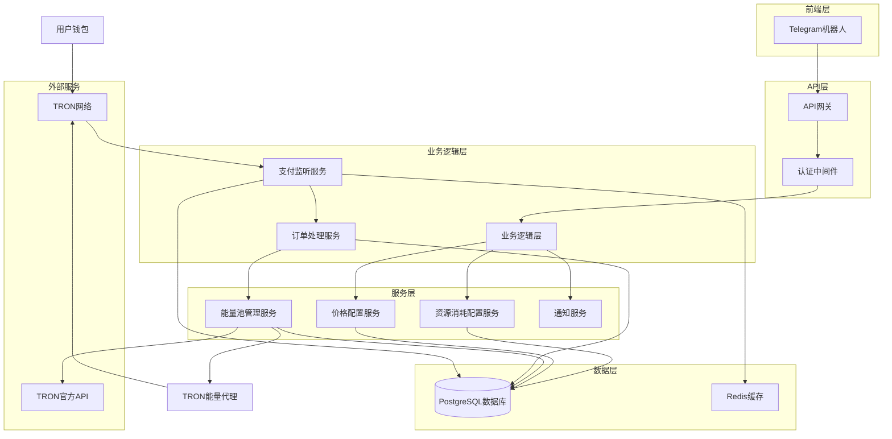
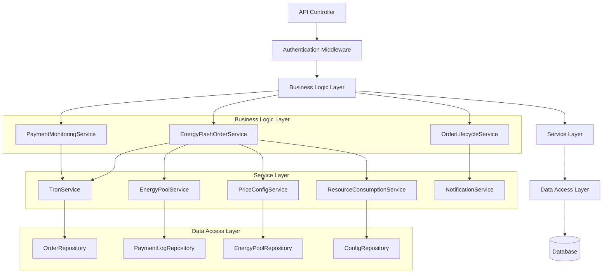
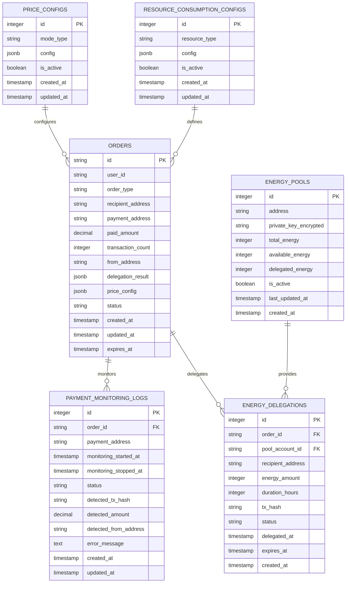

# TRON能量闪租系统技术架构文档

## 1. 架构设计



## 2. 技术描述

* Frontend: Telegram Bot API + Node.js

* Backend: Node.js + Express.js + TypeScript

* Database: PostgreSQL + Redis

* External Services: TRON Network + TRON官方API

## 3. 路由定义

| Route                                   | Purpose              |
| --------------------------------------- | -------------------- |
| /api/energy-flash/create-order          | 创建能量闪租订单，返回支付地址和价格配置 |
| /api/energy-flash/confirm-payment       | 手动确认支付（备用接口）         |
| /api/energy-flash/order-status/:orderId | 查询订单状态和处理进度          |
| /api/energy-flash/cancel-order/:orderId | 取消未支付的订单             |
| /api/payment-monitoring/start           | 开始支付监听（内部接口）         |
| /api/payment-monitoring/stop            | 停止支付监听（内部接口）         |
| /api/payment-monitoring/status          | 查询监听状态（管理接口）         |

## 4. API定义

### 4.1 核心API

#### 创建能量闪租订单

```
POST /api/energy-flash/create-order
```

Request:

| Param Name       | Param Type | isRequired | Description  |
| ---------------- | ---------- | ---------- | ------------ |
| recipientAddress | string     | true       | 接收能量的TRON地址  |
| chatId           | number     | true       | Telegram聊天ID |

Response:

| Param Name          | Param Type | Description |
| ------------------- | ---------- | ----------- |
| success             | boolean    | 请求是否成功      |
| data                | object     | 订单信息        |
| data.orderId        | string     | 订单ID        |
| data.paymentAddress | string     | 支付地址        |
| data.priceConfig    | object     | 价格配置信息      |
| data.expiresAt      | string     | 订单过期时间      |

Example:

```json
{
  "success": true,
  "data": {
    "orderId": "FLASH_1704067200000_abc123def",
    "paymentAddress": "TYourPaymentAddressHere",
    "priceConfig": {
      "single_price": 1.5,
      "max_transactions": 10,
      "expiry_hours": 1
    },
    "expiresAt": "2024-01-01T12:30:00.000Z"
  }
}
```

#### 查询订单状态

```
GET /api/energy-flash/order-status/:orderId
```

Response:

| Param Name            | Param Type | Description |
| --------------------- | ---------- | ----------- |
| success               | boolean    | 请求是否成功      |
| data                  | object     | 订单详细信息      |
| data.orderId          | string     | 订单ID        |
| data.status           | string     | 订单状态        |
| data.paidAmount       | number     | 已支付金额       |
| data.transactionCount | number     | 获得的笔数       |
| data.delegationResult | array      | 能量代理结果      |

Example:

```json
{
  "success": true,
  "data": {
    "orderId": "FLASH_1704067200000_abc123def",
    "status": "completed",
    "paidAmount": 15.0,
    "transactionCount": 10,
    "delegationResult": [
      {
        "transactionIndex": 1,
        "poolAccount": "TPoolAccount1",
        "energyAmount": 15000,
        "txHash": "0x123...",
        "success": true
      }
    ]
  }
}
```

#### 手动确认支付

```
POST /api/energy-flash/confirm-payment
```

Request:

| Param Name | Param Type | isRequired | Description |
| ---------- | ---------- | ---------- | ----------- |
| orderId    | string     | true       | 订单ID        |
| txHash     | string     | true       | 交易哈希        |

Response:

| Param Name | Param Type | Description |
| ---------- | ---------- | ----------- |
| success    | boolean    | 请求是否成功      |
| message    | string     | 处理消息        |

Example:

```json
{
  "success": true,
  "message": "支付确认处理中"
}
```

### 4.2 内部服务API

#### 支付监听服务

```typescript
// PaymentMonitoringService 接口定义
interface PaymentMonitoringParams {
  orderId: string;
  paymentAddress: string;
  expectedAmount?: number;
  timeout?: number;
}

interface PaymentDetectedEvent {
  orderId: string;
  txHash: string;
  amount: number;
  fromAddress: string;
  timestamp: Date;
}
```

#### 能量闪租订单服务

```typescript
// EnergyFlashOrderService 接口定义
interface CreateOrderParams {
  userId: string;
  recipientAddress: string;
  chatId: number;
}

interface ProcessPaymentParams {
  orderId: string;
  txHash: string;
  paidAmount: number;
  fromAddress: string;
}

interface DelegationResult {
  transactionIndex: number;
  poolAccount: string;
  energyAmount: number;
  txHash?: string;
  success: boolean;
  error?: string;
}
```

## 5. 服务架构图



## 6. 数据模型

### 6.1 数据模型定义



### 6.2 数据定义语言

#### 订单表扩展

```sql
-- 扩展现有orders表
ALTER TABLE orders ADD COLUMN IF NOT EXISTS order_type VARCHAR(50) DEFAULT 'standard';
ALTER TABLE orders ADD COLUMN IF NOT EXISTS payment_address VARCHAR(100);
ALTER TABLE orders ADD COLUMN IF NOT EXISTS paid_amount DECIMAL(20, 6);
ALTER TABLE orders ADD COLUMN IF NOT EXISTS transaction_count INTEGER;
ALTER TABLE orders ADD COLUMN IF NOT EXISTS from_address VARCHAR(100);
ALTER TABLE orders ADD COLUMN IF NOT EXISTS delegation_result JSONB;
ALTER TABLE orders ADD COLUMN IF NOT EXISTS price_config JSONB;

-- 添加索引
CREATE INDEX IF NOT EXISTS idx_orders_order_type ON orders(order_type);
CREATE INDEX IF NOT EXISTS idx_orders_payment_address ON orders(payment_address);
CREATE INDEX IF NOT EXISTS idx_orders_from_address ON orders(from_address);
CREATE INDEX IF NOT EXISTS idx_orders_expires_at ON orders(expires_at);
```

#### 支付监听日志表

```sql
-- 创建支付监听记录表
CREATE TABLE IF NOT EXISTS payment_monitoring_logs (
    id SERIAL PRIMARY KEY,
    order_id VARCHAR(100) NOT NULL,
    payment_address VARCHAR(100) NOT NULL,
    monitoring_started_at TIMESTAMP WITH TIME ZONE DEFAULT NOW(),
    monitoring_stopped_at TIMESTAMP WITH TIME ZONE,
    status VARCHAR(50) DEFAULT 'monitoring' CHECK (status IN ('monitoring', 'completed', 'timeout', 'error')),
    detected_tx_hash VARCHAR(100),
    detected_amount DECIMAL(20, 6),
    detected_from_address VARCHAR(100),
    error_message TEXT,
    created_at TIMESTAMP WITH TIME ZONE DEFAULT NOW(),
    updated_at TIMESTAMP WITH TIME ZONE DEFAULT NOW()
);

-- 添加索引
CREATE INDEX idx_payment_monitoring_order_id ON payment_monitoring_logs(order_id);
CREATE INDEX idx_payment_monitoring_address ON payment_monitoring_logs(payment_address);
CREATE INDEX idx_payment_monitoring_status ON payment_monitoring_logs(status);
CREATE INDEX idx_payment_monitoring_started_at ON payment_monitoring_logs(monitoring_started_at DESC);

-- 添加外键约束（逻辑层面）
COMMENT ON COLUMN payment_monitoring_logs.order_id IS 'Foreign key to orders.id';
```

#### 能量代理记录表

```sql
-- 创建能量代理记录表
CREATE TABLE IF NOT EXISTS energy_delegations (
    id SERIAL PRIMARY KEY,
    order_id VARCHAR(100) NOT NULL,
    pool_account_id INTEGER NOT NULL,
    recipient_address VARCHAR(100) NOT NULL,
    energy_amount INTEGER NOT NULL,
    duration_hours INTEGER NOT NULL DEFAULT 1,
    tx_hash VARCHAR(100),
    status VARCHAR(50) DEFAULT 'pending' CHECK (status IN ('pending', 'success', 'failed', 'expired')),
    delegated_at TIMESTAMP WITH TIME ZONE,
    expires_at TIMESTAMP WITH TIME ZONE,
    created_at TIMESTAMP WITH TIME ZONE DEFAULT NOW(),
    updated_at TIMESTAMP WITH TIME ZONE DEFAULT NOW()
);

-- 添加索引
CREATE INDEX idx_energy_delegations_order_id ON energy_delegations(order_id);
CREATE INDEX idx_energy_delegations_pool_account ON energy_delegations(pool_account_id);
CREATE INDEX idx_energy_delegations_recipient ON energy_delegations(recipient_address);
CREATE INDEX idx_energy_delegations_status ON energy_delegations(status);
CREATE INDEX idx_energy_delegations_expires_at ON energy_delegations(expires_at);

-- 添加外键约束（逻辑层面）
COMMENT ON COLUMN energy_delegations.order_id IS 'Foreign key to orders.id';
COMMENT ON COLUMN energy_delegations.pool_account_id IS 'Foreign key to energy_pools.id';
```

#### 初始化数据

```sql
-- 插入能量闪租价格配置
INSERT INTO price_configs (mode_type, config, is_active, created_at, updated_at)
VALUES (
    'energy_flash',
    '{
        "single_price": 1.5,
        "max_transactions": 10,
        "expiry_hours": 1,
        "min_amount": 1.0,
        "description": "能量闪租服务 - 1.5 TRX/笔，最多10笔，1小时时效"
    }',
    true,
    NOW(),
    NOW()
) ON CONFLICT (mode_type) DO UPDATE SET
    config = EXCLUDED.config,
    updated_at = NOW();

-- 插入资源消耗配置（如果不存在）
INSERT INTO resource_consumption_configs (resource_type, config, is_active, created_at, updated_at)
VALUES (
    'energy',
    '{
        "usdt_standard_energy": 15000,
        "trx_transfer_energy": 268,
        "trc20_transfer_energy": 13000,
        "contract_call_energy": 10000,
        "description": "标准能量消耗配置"
    }',
    true,
    NOW(),
    NOW()
) ON CONFLICT (resource_type) DO NOTHING;

-- 创建支付监听状态视图
CREATE OR REPLACE VIEW payment_monitoring_status AS
SELECT 
    pml.order_id,
    pml.payment_address,
    pml.status as monitoring_status,
    pml.monitoring_started_at,
    pml.monitoring_stopped_at,
    pml.detected_amount,
    pml.detected_from_address,
    o.status as order_status,
    o.paid_amount,
    o.transaction_count,
    o.expires_at,
    CASE 
        WHEN o.expires_at < NOW() THEN true 
        ELSE false 
    END as is_expired
FROM payment_monitoring_logs pml
LEFT JOIN orders o ON pml.order_id = o.id
WHERE pml.id IN (
    SELECT MAX(id) 
    FROM payment_monitoring_logs 
    GROUP BY order_id
);

-- 创建能量代理统计视图
CREATE OR REPLACE VIEW energy_delegation_stats AS
SELECT 
    ed.order_id,
    COUNT(*) as total_delegations,
    COUNT(CASE WHEN ed.status = 'success' THEN 1 END) as successful_delegations,
    COUNT(CASE WHEN ed.status = 'failed' THEN 1 END) as failed_delegations,
    SUM(CASE WHEN ed.status = 'success' THEN ed.energy_amount ELSE 0 END) as total_energy_delegated,
    MIN(ed.delegated_at) as first_delegation_at,
    MAX(ed.delegated_at) as last_delegation_at
FROM energy_delegations ed
GROUP BY ed.order_id;
```

#### 数据库权限设置

```sql
-- 为应用用户授权（假设应用用户为 tron_app）
GRANT SELECT, INSERT, UPDATE, DELETE ON payment_monitoring_logs TO tron_app;
GRANT SELECT, INSERT, UPDATE, DELETE ON energy_delegations TO tron_app;
GRANT USAGE, SELECT ON SEQUENCE payment_monitoring_logs_id_seq TO tron_app;
GRANT USAGE, SELECT ON SEQUENCE energy_delegations_id_seq TO tron_app;
GRANT SELECT ON payment_monitoring_status TO tron_app;
GRANT SELECT ON energy_delegation_stats TO tron_app;
```

## 7. 部署配置

### 7.1 环境变量

```bash
# TRON支付监听配置
TRON_PAYMENT_ADDRESS=TYourPaymentAddressHere
PAYMENT_MONITORING_INTERVAL=10000
PAYMENT_TIMEOUT=1800000
MAX_CONCURRENT_MONITORING=100

# 能量闪租配置
ENERGY_FLASH_ENABLED=true
DEFAULT_ENERGY_PER_TRANSACTION=15000
ENERGY_FLASH_DEFAULT_EXPIRY_HOURS=1

# Redis配置（用于缓存和队列）
REDIS_URL=redis://localhost:6379
REDIS_PAYMENT_MONITORING_KEY_PREFIX=payment_monitoring:
REDIS_CACHE_TTL=3600

# 日志配置
LOG_LEVEL=info
LOG_PAYMENT_MONITORING=true
LOG_ENERGY_DELEGATION=true
```

### 7.2 Docker配置

```dockerfile
# 在现有Dockerfile基础上添加
# 安装额外依赖（如果需要）
RUN npm install --production

# 添加健康检查
HEALTHCHECK --interval=30s --timeout=10s --start-period=5s --retries=3 \
  CMD curl -f http://localhost:3001/api/health || exit 1

# 设置环境变量
ENV NODE_ENV=production
ENV ENERGY_FLASH_ENABLED=true
```

### 7.3 监控配置

```yaml
# prometheus.yml 添加监控指标
- job_name: 'tron-energy-rental'
  static_configs:
    - targets: ['localhost:3001']
  metrics_path: '/api/metrics'
  scrape_interval: 30s
```

## 8. 性能优化

### 8.1 缓存策略

* 价格配置缓存（Redis，TTL: 1小时）

* 资源消耗配置缓存（Redis，TTL: 1小时）

* TRON地址验证结果缓存（Redis，TTL: 24小时）

* 能量池状态缓存（Redis，TTL: 5分钟）

### 8.2 数据库优化

* 订单表按时间分区

* 支付监听日志表定期清理（保留30天）

* 能量代理记录表索引优化

* 连接池配置优化

### 8.3 并发控制

* 支付监听任务队列化

* 能量代理操作加锁

* 数据库连接池限制

* API请求频率限制

## 9. 安全措施

### 9.1 数据安全

* 私钥加密存储

* 敏感配置环境变量化

* 数据库访问权限控制

* API接口认证授权

### 9.2 业务安全

* 支付金额验证

* 地址格式验证

* 交易哈希验证

* 重复处理防护

### 9.3 系统安全

* 输入参数验证

* SQL注入防护

* XSS攻击防护

* 请求频率限制

## 10. 监控告警

### 10.1 关键指标

* 支付监听成功率

* 能量代理成功率

* 订单处理时长

* 系统错误率

* 资源使用率

### 10.2 告警规则

* 支付监听失败率 > 5%

* 能量代理失败率 > 3%

* 订单处理时长 > 5分钟

* 系统错误率 > 1%

* 数据库连接数 > 80%

### 10.3 日志规范

```typescript
// 统一日志格式
interface LogEntry {
  timestamp: string;
  level: 'info' | 'warn' | 'error';
  service: string;
  action: string;
  orderId?: string;
  userId?: string;
  data?: any;
  error?: string;
}
```

