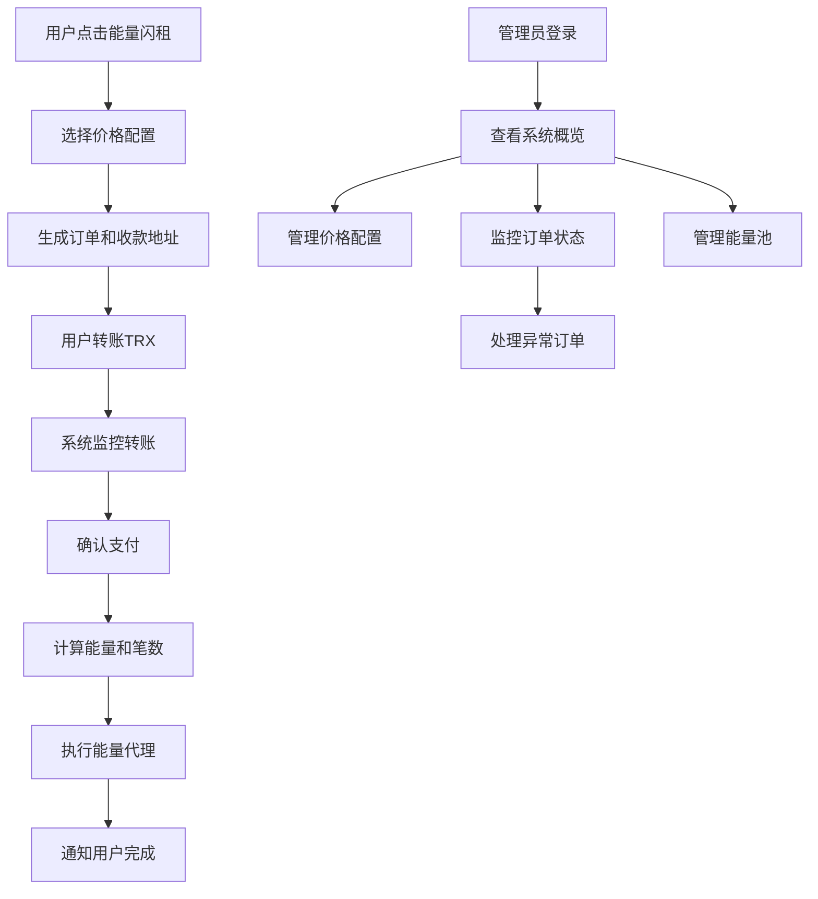

# TRON能量闪租自动化处理系统产品需求文档

## 1. 产品概述

本系统是一个基于TRON区块链的能量闪租自动化处理平台，用户通过Telegram机器人选择能量闪租配置后，系统自动监控用户TRX转账、计算对应笔数、并完成能量代理的全流程自动化处理。

系统解决了传统能量租赁需要人工处理、响应慢、易出错的问题，为用户提供即时、准确、自动化的能量代理服务，大幅提升用户体验和运营效率。

## 2. 核心功能

### 2.1 用户角色

| 角色 | 注册方式 | 核心权限 |
|------|----------|----------|
| 普通用户 | Telegram机器人交互 | 查看价格配置、下单、查询订单状态 |
| 管理员 | 后台系统登录 | 管理价格配置、监控系统状态、查看所有订单 |

### 2.2 功能模块

本系统需求包含以下主要页面：
1. **Telegram机器人界面**：能量闪租配置展示、订单创建、状态查询
2. **管理后台首页**：系统概览、实时监控数据、快速操作入口
3. **订单管理页面**：订单列表、详情查看、状态管理、批量操作
4. **价格配置页面**：价格方案管理、能量单价设置、时效配置
5. **能量池管理页面**：能量池状态、余额监控、分配策略
6. **系统监控页面**：实时监控、性能指标、告警管理

### 2.3 页面详情

| 页面名称 | 模块名称 | 功能描述 |
|----------|----------|----------|
| Telegram机器人界面 | 能量闪租选择 | 展示可用的能量闪租配置，包含价格、时效、能量数量等信息 |
| Telegram机器人界面 | 订单创建 | 生成收款地址、显示支付金额、创建订单记录 |
| Telegram机器人界面 | 支付引导 | 提供支付二维码、复制地址功能、支付说明 |
| Telegram机器人界面 | 状态通知 | 实时推送支付确认、代理进度、完成通知 |
| 管理后台首页 | 数据概览 | 显示今日订单数、成功率、收入统计、系统状态 |
| 管理后台首页 | 实时监控 | 展示当前处理中订单、能量池状态、系统负载 |
| 订单管理页面 | 订单列表 | 分页展示所有订单，支持状态筛选、时间筛选、用户搜索 |
| 订单管理页面 | 订单详情 | 显示订单完整信息、支付记录、代理记录、操作日志 |
| 订单管理页面 | 状态管理 | 手动更新订单状态、重试失败订单、取消订单 |
| 价格配置页面 | 配置列表 | 展示所有价格配置，支持启用/禁用、排序 |
| 价格配置页面 | 配置编辑 | 创建/编辑价格方案，设置单价、时效、最小/最大金额 |
| 能量池管理页面 | 池状态监控 | 显示各能量池余额、使用率、可用状态 |
| 能量池管理页面 | 分配策略 | 配置能量池优先级、负载均衡规则 |
| 系统监控页面 | 性能监控 | 显示系统CPU、内存、网络使用情况 |
| 系统监控页面 | 业务监控 | 监控订单处理时间、成功率、异常统计 |
| 系统监控页面 | 告警管理 | 配置告警规则、查看告警历史、处理告警 |

## 3. 核心流程

### 3.1 用户操作流程

用户通过Telegram机器人点击"能量闪租"按钮，系统展示可用的价格配置选项。用户选择合适的配置后，系统生成专用收款地址和订单。用户使用自己的钱包向指定地址转账TRX，系统自动监控转账并在确认后计算对应笔数，最后从能量池中代理相应能量给用户地址。

### 3.2 管理员操作流程

管理员登录后台系统查看整体运营数据和系统状态。可以管理价格配置、监控订单处理情况、调整能量池分配策略。当出现异常时，管理员可以手动干预订单处理、重试失败操作或调整系统参数。

## 4. 用户界面设计

### 4.1 设计风格

- **主色调**: 深蓝色(#1a365d)和亮蓝色(#3182ce)，体现科技感和专业性
- **辅助色**: 绿色(#38a169)表示成功，红色(#e53e3e)表示错误，橙色(#dd6b20)表示警告
- **按钮样式**: 圆角矩形按钮，具有渐变效果和悬停动画
- **字体**: 中文使用"PingFang SC"，英文使用"Inter"，代码使用"JetBrains Mono"
- **布局风格**: 卡片式设计，顶部导航，响应式布局
- **图标风格**: 使用Lucide图标库，线性风格，保持一致性

### 4.2 页面设计概览

| 页面名称 | 模块名称 | UI元素 |
|----------|----------|--------|
| Telegram机器人界面 | 能量闪租选择 | 内联键盘按钮，每个配置显示价格、时效、推荐标签，使用卡片式布局 |
| Telegram机器人界面 | 订单信息 | 文本消息展示订单号、收款地址、金额，提供复制按钮和支付二维码 |
| Telegram机器人界面 | 状态通知 | 进度条显示处理状态，使用emoji增强可读性，实时更新处理进度 |
| 管理后台首页 | 数据卡片 | 4个统计卡片展示关键指标，使用图表库显示趋势，配色区分不同状态 |
| 管理后台首页 | 实时监控 | 表格展示处理中订单，状态标签使用不同颜色，刷新按钮和自动刷新 |
| 订单管理页面 | 订单列表 | 数据表格，分页组件，筛选器，搜索框，批量操作按钮 |
| 订单管理页面 | 订单详情 | 模态框或侧边栏，标签页展示不同信息，时间轴显示操作历史 |
| 价格配置页面 | 配置表格 | 可编辑表格，拖拽排序，开关组件，操作按钮组 |
| 价格配置页面 | 配置表单 | 表单验证，数字输入框，选择器，预览功能 |
| 能量池管理页面 | 池状态卡片 | 进度条显示使用率，状态指示灯，余额数字动画 |
| 系统监控页面 | 监控图表 | 实时折线图，仪表盘，告警列表，状态指示器 |

### 4.3 响应式设计

系统采用移动优先的响应式设计，主要面向桌面端管理使用，同时兼容平板和手机访问。Telegram机器人界面原生适配移动端，管理后台在小屏幕设备上采用折叠导航和堆叠布局。

## 5. 技术实现要点

### 5.1 实时数据更新
- 使用WebSocket实现订单状态实时推送
- 前端采用轮询机制定期更新关键数据
- 支付监控采用事件驱动架构

### 5.2 用户体验优化
- 支付二维码自动生成和展示
- 一键复制收款地址功能
- 处理进度实时反馈
- 异常情况友好提示

### 5.3 系统可靠性
- 支付监控超时机制
- 代理失败自动重试
- 数据库事务保证一致性
- 完整的操作日志记录

### 5.4 安全性保障
- API接口限流防护
- 支付金额严格校验
- 操作权限细粒度控制
- 敏感数据加密存储

## 6. 验收标准

### 6.1 功能验收
- 用户可以通过Telegram机器人完成完整的能量闪租流程
- 系统能够准确监控TRX转账并自动处理
- 能量代理执行成功率达到95%以上
- 管理后台所有功能正常运行

### 6.2 性能验收
- 支付确认时间不超过5分钟
- 能量代理执行时间不超过30秒
- 系统响应时间不超过2秒
- 并发处理能力支持100个订单/分钟

### 6.3 稳定性验收
- 系统可用性达到99.9%
- 7x24小时稳定运行
- 异常情况自动恢复
- 完整的监控和告警机制