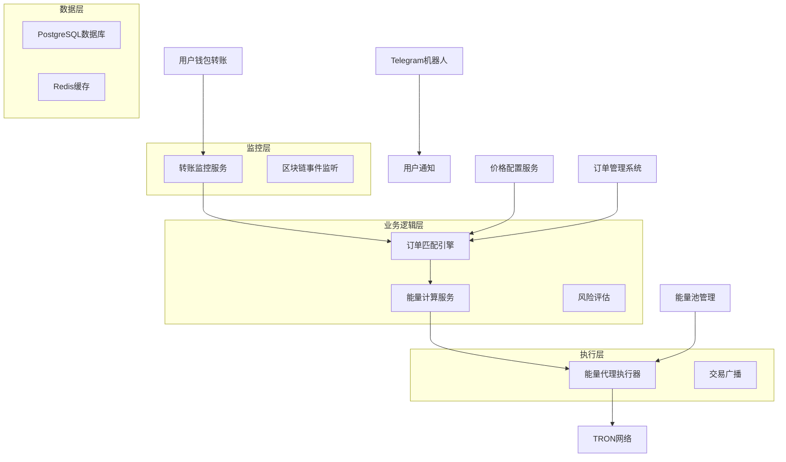
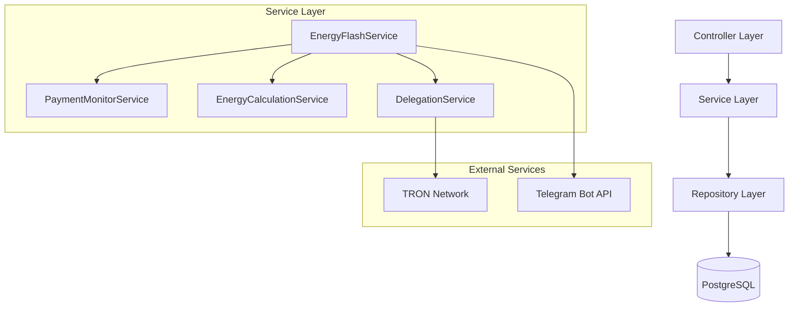
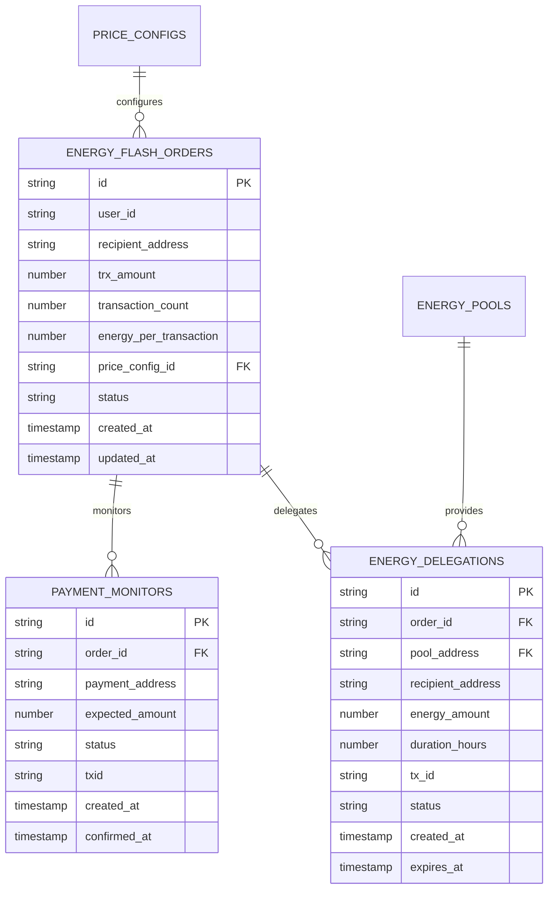

# TRON能量闪租自动化处理系统技术方案

## 1. 架构设计



## 2. 技术描述

- 前端: Vue@3 + TypeScript + Vite
- 后端: Node.js@18 + Express@4 + TypeScript
- 数据库: PostgreSQL@12 (本地数据库)
- 缓存: Redis
- 区块链: TronWeb + TRON官方API
- 消息队列: 内置事件系统

## 3. 路由定义

| 路由 | 用途 |
|------|------|
| /api/energy-flash/monitor | 启动转账监控服务 |
| /api/energy-flash/process | 处理能量闪租订单 |
| /api/energy-flash/calculate | 计算能量和笔数 |
| /api/energy-flash/delegate | 执行能量代理 |
| /api/energy-flash/status | 查询处理状态 |

## 4. 核心API定义

### 4.1 转账监控API

**启动监控**
```
POST /api/energy-flash/monitor
```

请求参数:
| 参数名 | 类型 | 必填 | 描述 |
|--------|------|------|------|
| paymentAddress | string | true | 收款地址 |
| expectedAmount | number | true | 预期金额(TRX) |
| orderId | string | true | 订单ID |
| timeout | number | false | 监控超时时间(秒) |

响应:
| 参数名 | 类型 | 描述 |
|--------|------|------|
| success | boolean | 监控启动状态 |
| monitorId | string | 监控任务ID |

**检查转账**
```
GET /api/energy-flash/check-payment/{address}
```

响应示例:
```json
{
  "success": true,
  "transactions": [
    {
      "txid": "abc123...",
      "amount": 100000000,
      "fromAddress": "TUser...",
      "timestamp": 1640995200,
      "confirmations": 3
    }
  ]
}
```

### 4.2 能量计算API

**计算能量和笔数**
```
POST /api/energy-flash/calculate
```

请求参数:
| 参数名 | 类型 | 必填 | 描述 |
|--------|------|------|------|
| trxAmount | number | true | TRX金额 |
| priceConfigId | string | true | 价格配置ID |
| recipientAddress | string | true | 接收地址 |

响应:
| 参数名 | 类型 | 描述 |
|--------|------|------|
| transactionCount | number | 可执行笔数 |
| energyPerTransaction | number | 每笔消耗能量 |
| totalEnergy | number | 总能量需求 |
| unitPrice | number | 单价(TRX/能量) |

### 4.3 能量代理API

**执行代理**
```
POST /api/energy-flash/delegate
```

请求参数:
| 参数名 | 类型 | 必填 | 描述 |
|--------|------|------|------|
| orderId | string | true | 订单ID |
| recipientAddress | string | true | 接收地址 |
| energyAmount | number | true | 能量数量 |
| durationHours | number | true | 代理时长(小时) |

响应:
| 参数名 | 类型 | 描述 |
|--------|------|------|
| success | boolean | 代理执行状态 |
| txIds | string[] | 交易ID列表 |
| delegationId | string | 代理记录ID |

## 5. 服务架构图



## 6. 数据模型

### 6.1 数据模型定义



### 6.2 数据定义语言

**能量闪租订单表**
```sql
-- 创建能量闪租订单表
CREATE TABLE energy_flash_orders (
    id UUID PRIMARY KEY DEFAULT gen_random_uuid(),
    user_id VARCHAR(255) NOT NULL,
    recipient_address VARCHAR(42) NOT NULL,
    trx_amount BIGINT NOT NULL,
    transaction_count INTEGER NOT NULL,
    energy_per_transaction INTEGER NOT NULL,
    price_config_id VARCHAR(255) NOT NULL,
    status VARCHAR(20) DEFAULT 'pending' CHECK (status IN ('pending', 'paid', 'processing', 'completed', 'failed', 'expired')),
    payment_txid VARCHAR(64),
    created_at TIMESTAMP WITH TIME ZONE DEFAULT NOW(),
    updated_at TIMESTAMP WITH TIME ZONE DEFAULT NOW()
);

-- 创建索引
CREATE INDEX idx_energy_flash_orders_user_id ON energy_flash_orders(user_id);
CREATE INDEX idx_energy_flash_orders_status ON energy_flash_orders(status);
CREATE INDEX idx_energy_flash_orders_created_at ON energy_flash_orders(created_at DESC);
```

**支付监控表**
```sql
-- 创建支付监控表
CREATE TABLE payment_monitors (
    id UUID PRIMARY KEY DEFAULT gen_random_uuid(),
    order_id UUID NOT NULL REFERENCES energy_flash_orders(id),
    payment_address VARCHAR(42) NOT NULL,
    expected_amount BIGINT NOT NULL,
    actual_amount BIGINT,
    status VARCHAR(20) DEFAULT 'monitoring' CHECK (status IN ('monitoring', 'confirmed', 'timeout', 'cancelled')),
    txid VARCHAR(64),
    confirmations INTEGER DEFAULT 0,
    created_at TIMESTAMP WITH TIME ZONE DEFAULT NOW(),
    confirmed_at TIMESTAMP WITH TIME ZONE
);

-- 创建索引
CREATE INDEX idx_payment_monitors_order_id ON payment_monitors(order_id);
CREATE INDEX idx_payment_monitors_payment_address ON payment_monitors(payment_address);
CREATE INDEX idx_payment_monitors_status ON payment_monitors(status);
```

**能量代理记录表**
```sql
-- 创建能量代理记录表
CREATE TABLE energy_delegations (
    id UUID PRIMARY KEY DEFAULT gen_random_uuid(),
    order_id UUID NOT NULL REFERENCES energy_flash_orders(id),
    pool_address VARCHAR(42) NOT NULL,
    recipient_address VARCHAR(42) NOT NULL,
    energy_amount INTEGER NOT NULL,
    duration_hours INTEGER NOT NULL,
    tx_id VARCHAR(64) NOT NULL,
    status VARCHAR(20) DEFAULT 'active' CHECK (status IN ('active', 'expired', 'revoked')),
    created_at TIMESTAMP WITH TIME ZONE DEFAULT NOW(),
    expires_at TIMESTAMP WITH TIME ZONE NOT NULL
);

-- 创建索引
CREATE INDEX idx_energy_delegations_order_id ON energy_delegations(order_id);
CREATE INDEX idx_energy_delegations_recipient ON energy_delegations(recipient_address);
CREATE INDEX idx_energy_delegations_expires_at ON energy_delegations(expires_at);
```

## 7. 核心实施步骤

### 步骤1: 转账监控服务实现

**创建转账监控服务**
```typescript
// api/services/energy-flash/PaymentMonitorService.ts
export class PaymentMonitorService {
  private monitoringTasks: Map<string, NodeJS.Timeout> = new Map();
  
  async startMonitoring(config: {
    orderId: string;
    paymentAddress: string;
    expectedAmount: number;
    timeout?: number;
  }): Promise<string> {
    const monitorId = `monitor_${Date.now()}_${Math.random().toString(36).substr(2, 9)}`;
    
    // 创建监控记录
    await this.createMonitorRecord(config);
    
    // 启动监控任务
    const task = setInterval(async () => {
      await this.checkPayment(config.orderId, config.paymentAddress, config.expectedAmount);
    }, 10000); // 每10秒检查一次
    
    this.monitoringTasks.set(monitorId, task);
    
    // 设置超时
    setTimeout(() => {
      this.stopMonitoring(monitorId);
      this.handleTimeout(config.orderId);
    }, config.timeout || 1800000); // 默认30分钟超时
    
    return monitorId;
  }
  
  private async checkPayment(orderId: string, address: string, expectedAmount: number): Promise<void> {
    try {
      // 获取地址最近交易
      const transactions = await tronService.getTransactionsFromAddress(address, 5, 0);
      
      for (const tx of transactions) {
        if (this.isValidPayment(tx, expectedAmount)) {
          await this.handlePaymentFound(orderId, tx);
          return;
        }
      }
    } catch (error) {
      console.error('Payment check failed:', error);
    }
  }
  
  private isValidPayment(tx: any, expectedAmount: number): boolean {
    if (tx.raw_data?.contract?.[0]?.type !== 'TransferContract') {
      return false;
    }
    
    const amount = tx.raw_data.contract[0].parameter.value.amount;
    // 允许5%的误差范围
    return amount >= expectedAmount * 0.95 && amount <= expectedAmount * 1.05;
  }
}
```

### 步骤2: 能量计算服务实现

**创建能量计算服务**
```typescript
// api/services/energy-flash/EnergyCalculationService.ts
export class EnergyCalculationService {
  async calculateEnergyAndTransactions(config: {
    trxAmount: number;
    priceConfigId: string;
    recipientAddress: string;
  }): Promise<{
    transactionCount: number;
    energyPerTransaction: number;
    totalEnergy: number;
    unitPrice: number;
  }> {
    // 1. 获取价格配置
    const priceConfig = await this.getPriceConfig(config.priceConfigId);
    if (!priceConfig) {
      throw new Error('Price config not found');
    }
    
    // 2. 计算单笔交易能量消耗
    const energyPerTransaction = await this.estimateTransactionEnergy(config.recipientAddress);
    
    // 3. 根据价格配置计算可执行笔数
    const unitPrice = priceConfig.config.unit_price; // TRX per energy
    const totalEnergy = Math.floor(config.trxAmount / unitPrice);
    const transactionCount = Math.floor(totalEnergy / energyPerTransaction);
    
    return {
      transactionCount,
      energyPerTransaction,
      totalEnergy: transactionCount * energyPerTransaction,
      unitPrice
    };
  }
  
  private async estimateTransactionEnergy(address: string): Promise<number> {
    try {
      // 获取地址资源状态
      const accountInfo = await tronService.getAccount(address);
      
      // 基础TRC20转账消耗约28000-32000能量
      // 根据合约复杂度和账户状态调整
      let baseEnergy = 30000;
      
      // 如果是新账户，需要额外能量激活
      if (!accountInfo.success || !accountInfo.data.address) {
        baseEnergy += 25000;
      }
      
      return baseEnergy;
    } catch (error) {
      console.error('Failed to estimate energy:', error);
      return 32000; // 返回保守估计值
    }
  }
}
```

### 步骤3: 自动代理执行器实现

**创建自动代理执行器**
```typescript
// api/services/energy-flash/AutoDelegationService.ts
export class AutoDelegationService {
  async executeAutoDelegation(config: {
    orderId: string;
    recipientAddress: string;
    totalEnergy: number;
    durationHours: number;
  }): Promise<{
    success: boolean;
    delegationIds: string[];
    txIds: string[];
    error?: string;
  }> {
    try {
      // 1. 优化能量池分配
      const allocation = await energyPoolService.optimizeEnergyAllocation(config.totalEnergy);
      if (!allocation.success) {
        return {
          success: false,
          delegationIds: [],
          txIds: [],
          error: 'Failed to allocate energy from pools'
        };
      }
      
      // 2. 执行批量代理
      const delegationResults = await this.executeBatchDelegation({
        allocations: allocation.allocations,
        recipientAddress: config.recipientAddress,
        durationHours: config.durationHours
      });
      
      // 3. 记录代理信息
      const delegationIds = await this.recordDelegations({
        orderId: config.orderId,
        delegationResults,
        durationHours: config.durationHours
      });
      
      return {
        success: true,
        delegationIds,
        txIds: delegationResults.map(r => r.txId)
      };
    } catch (error) {
      console.error('Auto delegation failed:', error);
      return {
        success: false,
        delegationIds: [],
        txIds: [],
        error: error.message
      };
    }
  }
  
  private async executeBatchDelegation(config: {
    allocations: any[];
    recipientAddress: string;
    durationHours: number;
  }): Promise<Array<{ poolAddress: string; energyAmount: number; txId: string }>> {
    const results = [];
    
    for (const allocation of config.allocations) {
      try {
        const result = await tronService.delegateResource({
          ownerAddress: allocation.address,
          receiverAddress: config.recipientAddress,
          balance: allocation.energyAmount,
          resource: 'ENERGY',
          lock: config.durationHours > 0,
          lockPeriod: config.durationHours
        });
        
        if (result.success && result.txid) {
          results.push({
            poolAddress: allocation.address,
            energyAmount: allocation.energyAmount,
            txId: result.txid
          });
        }
      } catch (error) {
        console.error(`Delegation failed for pool ${allocation.address}:`, error);
        throw error;
      }
    }
    
    return results;
  }
}
```

### 步骤4: 主服务集成

**创建能量闪租主服务**
```typescript
// api/services/energy-flash/EnergyFlashService.ts
export class EnergyFlashService {
  private paymentMonitor: PaymentMonitorService;
  private energyCalculator: EnergyCalculationService;
  private autoDelegator: AutoDelegationService;
  
  constructor() {
    this.paymentMonitor = new PaymentMonitorService();
    this.energyCalculator = new EnergyCalculationService();
    this.autoDelegator = new AutoDelegationService();
  }
  
  async processEnergyFlashOrder(config: {
    userId: string;
    recipientAddress: string;
    trxAmount: number;
    priceConfigId: string;
    paymentAddress: string;
  }): Promise<{
    success: boolean;
    orderId?: string;
    monitorId?: string;
    error?: string;
  }> {
    try {
      // 1. 计算能量和笔数
      const calculation = await this.energyCalculator.calculateEnergyAndTransactions({
        trxAmount: config.trxAmount,
        priceConfigId: config.priceConfigId,
        recipientAddress: config.recipientAddress
      });
      
      // 2. 创建订单
      const orderId = await this.createFlashOrder({
        ...config,
        ...calculation
      });
      
      // 3. 启动支付监控
      const monitorId = await this.paymentMonitor.startMonitoring({
        orderId,
        paymentAddress: config.paymentAddress,
        expectedAmount: config.trxAmount
      });
      
      return {
        success: true,
        orderId,
        monitorId
      };
    } catch (error) {
      console.error('Process energy flash order failed:', error);
      return {
        success: false,
        error: error.message
      };
    }
  }
  
  async handlePaymentConfirmed(orderId: string, txid: string, amount: number): Promise<void> {
    try {
      // 1. 更新订单状态
      await this.updateOrderStatus(orderId, 'paid', { payment_txid: txid });
      
      // 2. 获取订单详情
      const order = await this.getOrderById(orderId);
      if (!order) {
        throw new Error('Order not found');
      }
      
      // 3. 执行自动代理
      const delegationResult = await this.autoDelegator.executeAutoDelegation({
        orderId,
        recipientAddress: order.recipient_address,
        totalEnergy: order.transaction_count * order.energy_per_transaction,
        durationHours: this.getDurationFromConfig(order.price_config_id)
      });
      
      if (delegationResult.success) {
        await this.updateOrderStatus(orderId, 'completed');
        await this.notifyUser(order.user_id, 'delegation_completed', {
          orderId,
          transactionCount: order.transaction_count,
          energyAmount: order.transaction_count * order.energy_per_transaction
        });
      } else {
        await this.updateOrderStatus(orderId, 'failed');
        await this.notifyUser(order.user_id, 'delegation_failed', {
          orderId,
          error: delegationResult.error
        });
      }
    } catch (error) {
      console.error('Handle payment confirmed failed:', error);
      await this.updateOrderStatus(orderId, 'failed');
    }
  }
}
```

### 步骤5: API路由实现

**创建API路由**
```typescript
// api/routes/energy-flash.ts
import express from 'express';
import { EnergyFlashService } from '../services/energy-flash/EnergyFlashService';

const router = express.Router();
const energyFlashService = new EnergyFlashService();

// 创建能量闪租订单
router.post('/create', async (req, res) => {
  try {
    const result = await energyFlashService.processEnergyFlashOrder(req.body);
    res.json(result);
  } catch (error) {
    res.status(500).json({ success: false, error: error.message });
  }
});

// 计算能量和笔数
router.post('/calculate', async (req, res) => {
  try {
    const calculation = await energyFlashService.calculateEnergyAndTransactions(req.body);
    res.json({ success: true, data: calculation });
  } catch (error) {
    res.status(500).json({ success: false, error: error.message });
  }
});

// 查询订单状态
router.get('/status/:orderId', async (req, res) => {
  try {
    const order = await energyFlashService.getOrderById(req.params.orderId);
    res.json({ success: true, data: order });
  } catch (error) {
    res.status(500).json({ success: false, error: error.message });
  }
});

export default router;
```

## 8. 关键技术要点

### 8.1 实时监控机制
- **轮询策略**: 每10秒检查一次转账状态
- **超时处理**: 30分钟无支付自动取消订单
- **确认机制**: 至少1个区块确认后处理
- **重复检测**: 防止同一笔转账被重复处理

### 8.2 能量计算算法
- **基础消耗**: TRC20转账基础能量28000-32000
- **账户状态**: 新账户需额外25000能量激活
- **合约复杂度**: 根据目标合约调整能量估算
- **安全边际**: 预留10%的能量缓冲

### 8.3 代理优化策略
- **池选择**: 优先选择能量充足的池
- **负载均衡**: 避免单个池过度使用
- **成本优化**: 选择手续费最低的代理方案
- **时效管理**: 根据配置设置代理时长

### 8.4 错误处理和恢复
- **支付超时**: 自动取消订单并通知用户
- **代理失败**: 记录失败原因并尝试重新分配
- **网络异常**: 实现重试机制和降级策略
- **数据一致性**: 使用事务确保数据完整性

## 9. 部署和监控

### 9.1 部署配置
```bash
# 启动服务
npm run restart

# 检查服务状态
curl -X GET http://localhost:3001/api/energy-flash/health

# 监控日志
tail -f logs/energy-flash.log
```

### 9.2 监控指标
- **订单处理成功率**: 目标 > 95%
- **支付确认时间**: 目标 < 5分钟
- **代理执行时间**: 目标 < 30秒
- **系统可用性**: 目标 > 99.9%

### 9.3 告警配置
- **支付监控异常**: 连续3次检查失败
- **代理执行失败**: 单次失败立即告警
- **能量池不足**: 可用能量 < 阈值
- **系统负载过高**: CPU/内存使用率 > 80%

## 10. 安全考虑

### 10.1 支付安全
- **金额验证**: 严格校验转账金额
- **地址验证**: 确保转账地址正确性
- **重放攻击**: 防止同一笔交易重复处理
- **时间窗口**: 限制支付有效时间

### 10.2 代理安全
- **权限控制**: 确保只有授权地址可执行代理
- **额度限制**: 设置单次代理最大额度
- **频率限制**: 防止恶意频繁代理
- **监控审计**: 记录所有代理操作日志

### 10.3 系统安全
- **API限流**: 防止接口被恶意调用
- **数据加密**: 敏感数据加密存储
- **访问控制**: 实现细粒度权限管理
- **安全审计**: 定期进行安全检查