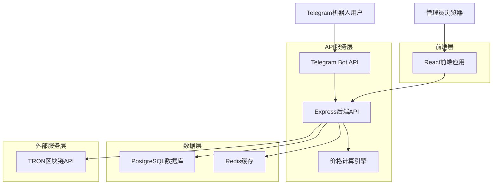
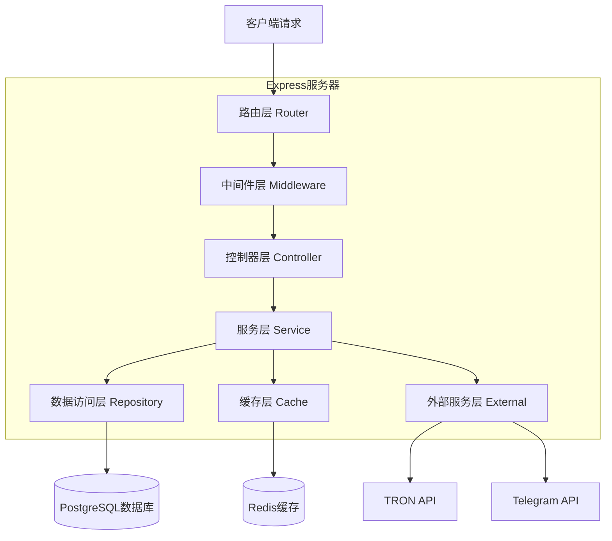
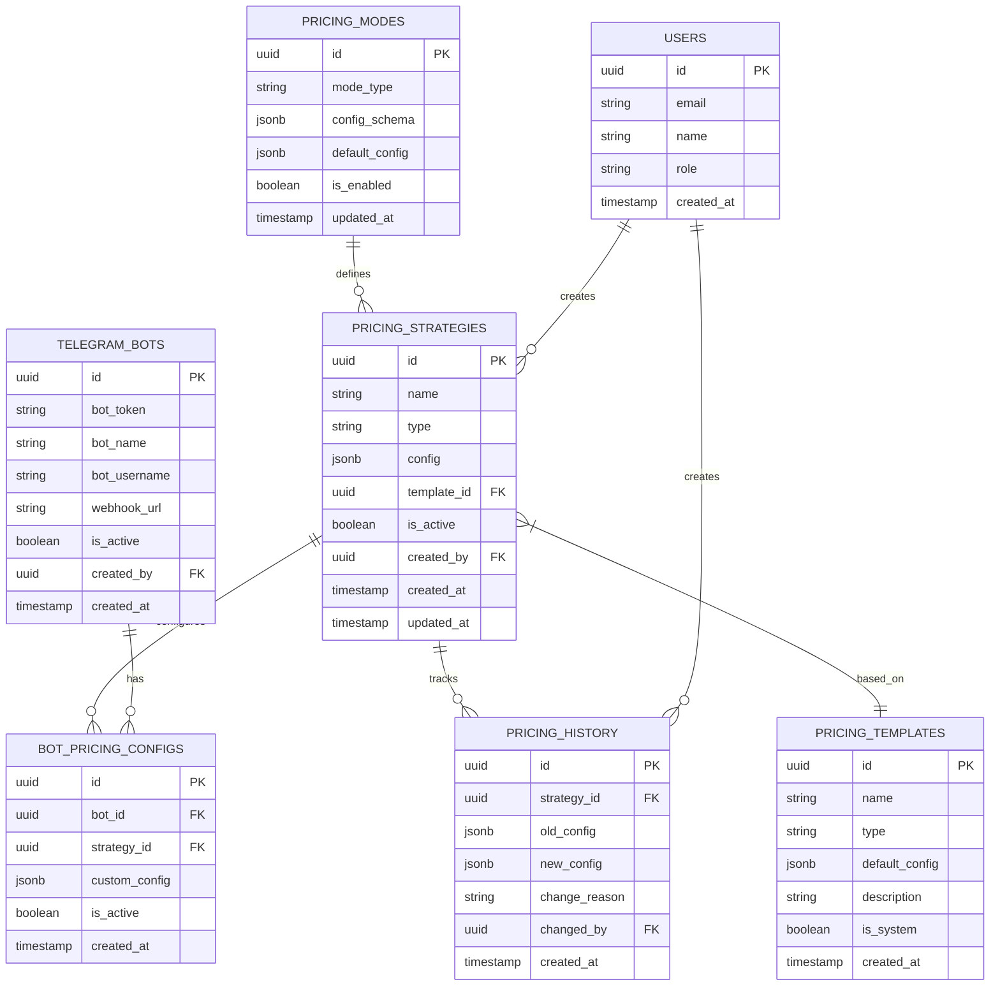

# 价格配置系统技术架构文档

## 1. 架构设计



## 2. 技术描述

* **前端**: React\@18 + TypeScript + Tailwind CSS\@3 + Vite

* **后端**: Express\@4 + TypeScript + Node.js\@18

* **数据库**: PostgreSQL\@14 (主数据库)

* **缓存**: Redis\@6 (缓存和会话存储)

* **区块链**: TRON网络API集成

* **消息队列**: Redis (异步任务处理)

## 3. 路由定义

| 路由                  | 用途                              |
| ------------------- | ------------------------------- |
| /pricing            | 统一价格管理主页面，显示所有价格策略概览            |
| /pricing/strategies | 价格策略管理页面，创建和编辑价格策略              |
| /pricing/templates  | 定价模板管理页面，管理预设模板                 |
| /pricing/modes      | 定价模式配置页面，配置能量闪租和笔数套餐参数          |
| /pricing/bots       | 机器人关联配置页面，管理Telegram机器人与价格策略的关联 |
| /pricing/dashboard  | 价格监控仪表板，实时监控和数据分析               |
| /pricing/history    | 价格变更历史页面，查看所有价格变更记录             |
| /pricing/calculator | 价格计算器页面，实时计算和预览价格               |

## 4. API定义

### 4.1 价格策略管理API

**创建价格策略**

```
POST /api/pricing/strategies
```

请求参数：

| 参数名          | 参数类型   | 是否必填  | 描述                                       |
| ------------ | ------ | ----- | ---------------------------------------- |
| name         | string | true  | 策略名称，最大100字符                             |
| type         | string | true  | 策略类型：energy\_flash, transaction\_package |
| config       | object | true  | 策略配置参数，根据type不同而不同                       |
| template\_id | string | false | 基于的模板ID                                  |
| description  | string | false | 策略描述                                     |

响应参数：

| 参数名     | 参数类型    | 描述      |
| ------- | ------- | ------- |
| success | boolean | 操作状态    |
| data    | object  | 创建的策略信息 |
| message | string  | 操作结果消息  |

请求示例：

```json
{
  "name": "标准能量闪租策略",
  "type": "energy_flash",
  "config": {
    "unit_price": 2.6,
    "max_quantity": 5,
    "expiry_hours": 1,
    "double_energy_for_no_usdt": true,
    "collection_address": "TWdcgk9NEsV1nt5yPrNfSYktbA12345678"
  },
  "description": "标准的能量闪租定价策略"
}
```

**获取价格策略列表**

```
GET /api/pricing/strategies
```

请求参数：

| 参数名        | 参数类型    | 是否必填  | 描述        |
| ---------- | ------- | ----- | --------- |
| page       | number  | false | 页码，默认1    |
| limit      | number  | false | 每页数量，默认20 |
| type       | string  | false | 策略类型筛选    |
| is\_active | boolean | false | 是否激活状态筛选  |

**更新价格策略**

```
PUT /api/pricing/strategies/:id
```

**删除价格策略**

```
DELETE /api/pricing/strategies/:id
```

### 4.2 定价模式配置API

**获取定价模式配置**

```
GET /api/pricing/modes/:mode_type
```

**更新定价模式配置**

```
PUT /api/pricing/modes/:mode_type
```

请求参数：

| 参数名         | 参数类型    | 是否必填  | 描述      |
| ----------- | ------- | ----- | ------- |
| config      | object  | true  | 模式配置参数  |
| is\_enabled | boolean | false | 是否启用该模式 |

### 4.3 机器人关联API

**获取机器人列表**

```
GET /api/pricing/bots
```

**创建机器人**

```
POST /api/pricing/bots
```

请求参数：

| 参数名          | 参数类型   | 是否必填  | 描述               |
| ------------ | ------ | ----- | ---------------- |
| bot\_token   | string | true  | Telegram机器人Token |
| bot\_name    | string | true  | 机器人名称            |
| webhook\_url | string | false | Webhook地址        |

**关联价格策略**

```
POST /api/pricing/bots/:bot_id/strategies
```

请求参数：

| 参数名            | 参数类型   | 是否必填  | 描述      |
| -------------- | ------ | ----- | ------- |
| strategy\_id   | string | true  | 价格策略ID  |
| custom\_config | object | false | 自定义配置覆盖 |

### 4.4 价格计算API

**计算价格**

```
POST /api/pricing/calculate
```

请求参数：

| 参数名           | 参数类型   | 是否必填  | 描述                |
| ------------- | ------ | ----- | ----------------- |
| strategy\_id  | string | true  | 价格策略ID            |
| quantity      | number | true  | 购买数量              |
| user\_address | string | false | 用户地址（用于判断是否有USDT） |
| bot\_id       | string | false | 机器人ID（用于获取专属配置）   |

响应参数：

| 参数名               | 参数类型    | 描述        |
| ----------------- | ------- | --------- |
| total\_price      | number  | 总价格       |
| unit\_price       | number  | 单价        |
| quantity          | number  | 数量        |
| discount\_applied | boolean | 是否应用了折扣   |
| special\_rules    | array   | 应用的特殊规则列表 |

### 4.5 价格历史API

**获取价格变更历史**

```
GET /api/pricing/history
```

**创建价格变更记录**

```
POST /api/pricing/history
```

## 5. 服务器架构图



## 6. 数据模型

### 6.1 数据模型定义



### 6.2 数据定义语言

**价格策略表 (pricing\_strategies)**

```sql
-- 创建价格策略表
CREATE TABLE pricing_strategies (
    id UUID PRIMARY KEY DEFAULT gen_random_uuid(),
    name VARCHAR(100) NOT NULL,
    type VARCHAR(50) NOT NULL CHECK (type IN ('energy_flash', 'transaction_package')),
    config JSONB NOT NULL,
    template_id UUID REFERENCES pricing_templates(id),
    is_active BOOLEAN DEFAULT true,
    created_by UUID REFERENCES users(id),
    created_at TIMESTAMP WITH TIME ZONE DEFAULT NOW(),
    updated_at TIMESTAMP WITH TIME ZONE DEFAULT NOW()
);

-- 创建索引
CREATE INDEX idx_pricing_strategies_type ON pricing_strategies(type);
CREATE INDEX idx_pricing_strategies_active ON pricing_strategies(is_active);
CREATE INDEX idx_pricing_strategies_created_by ON pricing_strategies(created_by);
CREATE INDEX idx_pricing_strategies_template ON pricing_strategies(template_id);

-- 创建更新时间触发器
CREATE OR REPLACE FUNCTION update_updated_at_column()
RETURNS TRIGGER AS $$
BEGIN
    NEW.updated_at = NOW();
    RETURN NEW;
END;
$$ language 'plpgsql';

CREATE TRIGGER update_pricing_strategies_updated_at
    BEFORE UPDATE ON pricing_strategies
    FOR EACH ROW
    EXECUTE FUNCTION update_updated_at_column();
```

**定价模板表 (pricing\_templates)**

```sql
-- 创建定价模板表
CREATE TABLE pricing_templates (
    id UUID PRIMARY KEY DEFAULT gen_random_uuid(),
    name VARCHAR(100) NOT NULL,
    type VARCHAR(50) NOT NULL CHECK (type IN ('energy_flash', 'transaction_package')),
    default_config JSONB NOT NULL,
    description TEXT,
    is_system BOOLEAN DEFAULT false,
    created_at TIMESTAMP WITH TIME ZONE DEFAULT NOW()
);

-- 创建索引
CREATE INDEX idx_pricing_templates_type ON pricing_templates(type);
CREATE INDEX idx_pricing_templates_system ON pricing_templates(is_system);

-- 插入系统默认模板
INSERT INTO pricing_templates (name, type, default_config, description, is_system) VALUES
('标准能量闪租模板', 'energy_flash', '{
  "unit_price": 2.6,
  "max_quantity": 5,
  "expiry_hours": 1,
  "double_energy_for_no_usdt": true,
  "collection_address": "TWdcgk9NEsV1nt5yPrNfSYktbA12345678"
}', '标准的能量闪租定价模板', true),
('标准笔数套餐模板', 'transaction_package', '{
  "packages": [
    {"transactions": 10, "price": 25},
    {"transactions": 50, "price": 120},
    {"transactions": 100, "price": 230}
  ],
  "occupation_fee_hours": 24,
  "occupation_fee_amount": 1,
  "transfer_enabled": true
}', '标准的笔数套餐定价模板', true);
```

**定价模式表 (pricing\_modes)**

```sql
-- 创建定价模式表
CREATE TABLE pricing_modes (
    id UUID PRIMARY KEY DEFAULT gen_random_uuid(),
    mode_type VARCHAR(50) UNIQUE NOT NULL,
    config_schema JSONB NOT NULL,
    default_config JSONB NOT NULL,
    is_enabled BOOLEAN DEFAULT true,
    created_at TIMESTAMP WITH TIME ZONE DEFAULT NOW(),
    updated_at TIMESTAMP WITH TIME ZONE DEFAULT NOW()
);

-- 创建更新时间触发器
CREATE TRIGGER update_pricing_modes_updated_at
    BEFORE UPDATE ON pricing_modes
    FOR EACH ROW
    EXECUTE FUNCTION update_updated_at_column();

-- 插入默认定价模式
INSERT INTO pricing_modes (mode_type, config_schema, default_config) VALUES
('energy_flash', '{
  "type": "object",
  "properties": {
    "unit_price": {"type": "number", "minimum": 0.1, "maximum": 10},
    "max_quantity": {"type": "integer", "minimum": 1, "maximum": 10},
    "expiry_hours": {"type": "integer", "minimum": 1, "maximum": 24},
    "double_energy_for_no_usdt": {"type": "boolean"},
    "collection_address": {"type": "string", "pattern": "^T[A-Za-z1-9]{33}$"}
  },
  "required": ["unit_price", "max_quantity", "expiry_hours"]
}', '{
  "unit_price": 2.6,
  "max_quantity": 5,
  "expiry_hours": 1,
  "double_energy_for_no_usdt": true,
  "collection_address": "TWdcgk9NEsV1nt5yPrNfSYktbA12345678"
}'),
('transaction_package', '{
  "type": "object",
  "properties": {
    "packages": {
      "type": "array",
      "items": {
        "type": "object",
        "properties": {
          "transactions": {"type": "integer", "minimum": 1},
          "price": {"type": "number", "minimum": 0.1}
        },
        "required": ["transactions", "price"]
      }
    },
    "occupation_fee_hours": {"type": "integer", "minimum": 1, "maximum": 168},
    "occupation_fee_amount": {"type": "integer", "minimum": 1, "maximum": 10},
    "transfer_enabled": {"type": "boolean"}
  },
  "required": ["packages", "occupation_fee_hours", "occupation_fee_amount"]
}', '{
  "packages": [
    {"transactions": 10, "price": 25},
    {"transactions": 50, "price": 120},
    {"transactions": 100, "price": 230}
  ],
  "occupation_fee_hours": 24,
  "occupation_fee_amount": 1,
  "transfer_enabled": true
}');
```

**机器人定价配置表 (bot\_pricing\_configs)**

```sql
-- 创建机器人定价配置表
CREATE TABLE bot_pricing_configs (
    id UUID PRIMARY KEY DEFAULT gen_random_uuid(),
    bot_id UUID NOT NULL REFERENCES telegram_bots(id) ON DELETE CASCADE,
    strategy_id UUID NOT NULL REFERENCES pricing_strategies(id) ON DELETE CASCADE,
    custom_config JSONB,
    is_active BOOLEAN DEFAULT true,
    created_at TIMESTAMP WITH TIME ZONE DEFAULT NOW(),
    updated_at TIMESTAMP WITH TIME ZONE DEFAULT NOW(),
    UNIQUE(bot_id, strategy_id)
);

-- 创建索引
CREATE INDEX idx_bot_pricing_configs_bot_id ON bot_pricing_configs(bot_id);
CREATE INDEX idx_bot_pricing_configs_strategy_id ON bot_pricing_configs(strategy_id);
CREATE INDEX idx_bot_pricing_configs_active ON bot_pricing_configs(is_active);

-- 创建更新时间触发器
CREATE TRIGGER update_bot_pricing_configs_updated_at
    BEFORE UPDATE ON bot_pricing_configs
    FOR EACH ROW
    EXECUTE FUNCTION update_updated_at_column();
```

**Telegram机器人表 (telegram\_bots)**

```sql
-- 创建Telegram机器人表
CREATE TABLE telegram_bots (
    id UUID PRIMARY KEY DEFAULT gen_random_uuid(),
    bot_token VARCHAR(255) UNIQUE NOT NULL,
    bot_name VARCHAR(100) NOT NULL,
    bot_username VARCHAR(100),
    webhook_url VARCHAR(500),
    is_active BOOLEAN DEFAULT true,
    created_by UUID REFERENCES users(id),
    created_at TIMESTAMP WITH TIME ZONE DEFAULT NOW(),
    updated_at TIMESTAMP WITH TIME ZONE DEFAULT NOW()
);

-- 创建索引
CREATE INDEX idx_telegram_bots_active ON telegram_bots(is_active);
CREATE INDEX idx_telegram_bots_username ON telegram_bots(bot_username);
CREATE INDEX idx_telegram_bots_created_by ON telegram_bots(created_by);

-- 创建更新时间触发器
CREATE TRIGGER update_telegram_bots_updated_at
    BEFORE UPDATE ON telegram_bots
    FOR EACH ROW
    EXECUTE FUNCTION update_updated_at_column();
```

**价格历史表 (pricing\_history)**

```sql
-- 创建价格历史表
CREATE TABLE pricing_history (
    id UUID PRIMARY KEY DEFAULT gen_random_uuid(),
    strategy_id UUID NOT NULL REFERENCES pricing_strategies(id) ON DELETE CASCADE,
    old_config JSONB,
    new_config JSONB NOT NULL,
    change_reason VARCHAR(255),
    changed_by UUID NOT NULL REFERENCES users(id),
    created_at TIMESTAMP WITH TIME ZONE DEFAULT NOW()
);

-- 创建索引
CREATE INDEX idx_pricing_history_strategy_id ON pricing_history(strategy_id);
CREATE INDEX idx_pricing_history_created_at ON pricing_history(created_at DESC);
CREATE INDEX idx_pricing_history_changed_by ON pricing_history(changed_by);

-- 创建自动记录价格变更的触发器
CREATE OR REPLACE FUNCTION log_pricing_strategy_changes()
RETURNS TRIGGER AS $$
BEGIN
    IF TG_OP = 'UPDATE' AND OLD.config IS DISTINCT FROM NEW.config THEN
        INSERT INTO pricing_history (strategy_id, old_config, new_config, changed_by)
        VALUES (NEW.id, OLD.config, NEW.config, NEW.created_by);
    END IF;
    RETURN NEW;
END;
$$ language 'plpgsql';

CREATE TRIGGER pricing_strategy_change_log
    AFTER UPDATE ON pricing_strategies
    FOR EACH ROW
    EXECUTE FUNCTION log_pricing_strategy_changes();
```

**权限和安全设置**

```sql
-- 为authenticated角色授权
GRANT SELECT, INSERT, UPDATE, DELETE ON pricing_strategies TO authenticated;
GRANT SELECT, INSERT, UPDATE, DELETE ON pricing_templates TO authenticated;
GRANT SELECT, INSERT, UPDATE, DELETE ON pricing_modes TO authenticated;
GRANT SELECT, INSERT, UPDATE, DELETE ON bot_pricing_configs TO authenticated;
GRANT SELECT, INSERT, UPDATE, DELETE ON telegram_bots TO authenticated;
GRANT SELECT, INSERT ON pricing_history TO authenticated;

-- 为anon角色授予只读权限（用于公开价格查询）
GRANT SELECT ON pricing_strategies TO anon;
GRANT SELECT ON pricing_templates TO anon;
GRANT SELECT ON pricing_modes TO anon;

-- 创建行级安全策略（RLS）
ALTER TABLE pricing_strategies ENABLE ROW LEVEL SECURITY;
ALTER TABLE telegram_bots ENABLE ROW LEVEL SECURITY;
ALTER TABLE pricing_history ENABLE ROW LEVEL SECURITY;

-- 只允许用户访问自己创建的策略
CREATE POLICY "Users can view own strategies" ON pricing_strategies
    FOR SELECT USING (created_by = auth.uid());

CREATE POLICY "Users can create strategies" ON pricing_strategies
    FOR INSERT WITH CHECK (created_by = auth.uid());

CREATE POLICY "Users can update own strategies" ON pricing_strategies
    FOR UPDATE USING (created_by = auth.uid());
```

