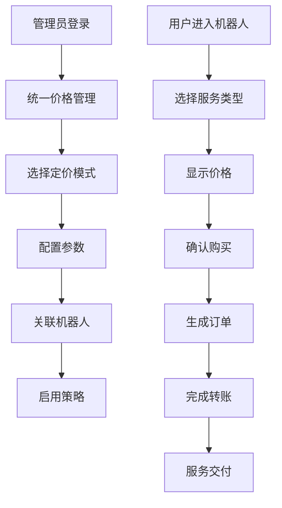
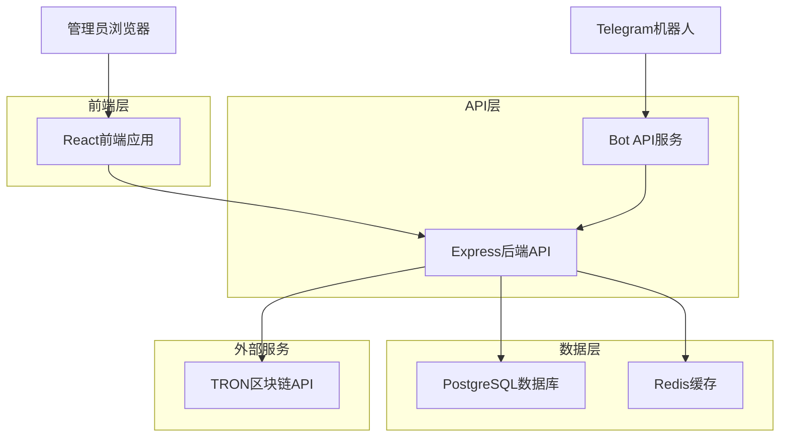
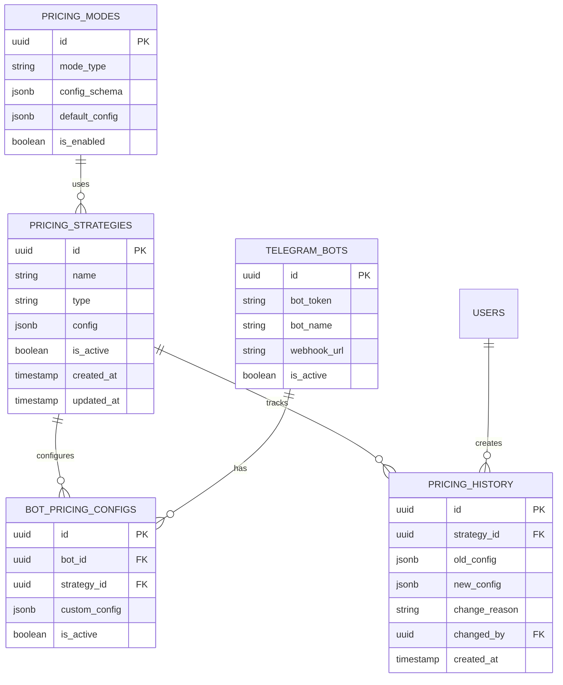

# 价格配置系统重构方案

## 1. 项目概述

本文档旨在重构当前TRON能量租赁系统中存在的三个重复价格配置模块，统一为一个灵活、可扩展的价格管理系统，支持能量闪租和笔数套餐两种核心业务模式。

### 1.1 当前问题分析

**现有架构问题：**

* **价格配置模块**：管理机器人差异化定价和代理商优惠价格

* **能量包管理模块**：定义可购买的能量套餐规格和价格

* **系统设置-定价设置**：配置基础定价参数

**核心问题：**

1. 功能重复，维护成本高
2. 数据分散，缺乏统一管理
3. 业务逻辑耦合，扩展性差
4. 无法灵活支持新的定价模式

### 1.2 业务需求

**两种核心定价模式：**

1. **能量闪租模式**

   * 单笔价格：2.6 TRX = 1笔能量

   * 最大购买：5笔（13 TRX）

   * 时效限制：1小时内转账，否则过期回收

   * 特殊规则：向无U地址转账需双倍能量

   * 收款地址：可配置的专用地址

2. **笔数套餐模式**

   * 无时间限制的长期套餐

   * 24小时不使用扣除1笔占用费

   * 统一扣费：无论对方有U没U都扣除1笔转账

   * 支持转移：可转移笔数到其他地址

   * 代购支持：可为他人购买并指定地址

   * 管理功能：开/关按钮、账单查询

## 2. 核心功能

### 2.1 用户角色

| 角色     | 注册方式       | 核心权限                 |
| ------ | ---------- | -------------------- |
| 系统管理员  | 内部分配       | 全局价格策略配置、模板管理、系统参数设置 |
| 机器人管理员 | 申请审核       | 机器人专属定价配置、套餐管理       |
| 代理商    | 邀请码注册      | 查看专属价格、批量购买          |
| 普通用户   | Telegram授权 | 查看公开价格、购买服务          |

### 2.2 功能模块

本系统包含以下核心页面：

1. **统一价格管理页面**：价格策略配置、模板管理、历史记录
2. **定价模式配置页面**：能量闪租和笔数套餐的参数设置
3. **机器人关联配置页面**：Telegram机器人与定价模式的关联管理
4. **价格监控仪表板**：价格变动监控、使用统计、收益分析

### 2.3 页面详情

| 页面名称    | 模块名称   | 功能描述                     |
| ------- | ------ | ------------------------ |
| 统一价格管理  | 价格策略管理 | 创建、编辑、删除价格策略；支持模板化管理     |
| 统一价格管理  | 定价模板库  | 预设模板管理；标准定价、代理优惠、机器人专属模板 |
| 统一价格管理  | 价格历史记录 | 价格变更历史；变更原因记录；回滚功能       |
| 定价模式配置  | 能量闪租设置 | 单笔价格、最大笔数、时效设置、收款地址配置    |
| 定价模式配置  | 笔数套餐设置 | 套餐规格定义、占用费设置、转移规则配置      |
| 定价模式配置  | 特殊规则管理 | 无U地址双倍能量、24小时占用费等业务规则    |
| 机器人关联配置 | 机器人管理  | Telegram机器人注册、状态管理       |
| 机器人关联配置 | 定价关联   | 机器人与定价模式的绑定关系管理          |
| 机器人关联配置 | 权限控制   | 机器人访问权限、功能开关配置           |
| 价格监控仪表板 | 实时监控   | 价格变动监控、异常告警              |
| 价格监控仪表板 | 统计分析   | 使用量统计、收益分析、趋势预测          |
| 价格监控仪表板 | 报表导出   | 定期报表生成、数据导出功能            |

## 3. 核心流程

### 3.1 管理员配置流程

1. 管理员登录系统 → 进入统一价格管理页面
2. 创建或选择定价模板 → 配置能量闪租/笔数套餐参数
3. 设置特殊业务规则 → 配置收款地址和时效参数
4. 关联Telegram机器人 → 设置机器人访问权限
5. 启用价格策略 → 监控使用情况和收益

### 3.2 用户购买流程

1. 用户进入Telegram机器人 → 选择能量闪租或笔数套餐
2. 系统根据机器人配置显示对应价格 → 用户确认购买
3. 生成订单和收款地址 → 用户完成转账
4. 系统验证转账 → 分配能量或笔数
5. 根据业务规则处理特殊情况 → 完成服务交付



## 4. 用户界面设计

### 4.1 设计风格

* **主色调**：深蓝色(#1e40af)和青色(#0891b2)

* **辅助色**：灰色系(#6b7280, #f3f4f6)和状态色(成功绿#10b981, 警告橙#f59e0b, 错误红#ef4444)

* **按钮样式**：圆角设计，渐变背景，悬停效果

* **字体**：主标题16-20px，正文14px，说明文字12px

* **布局风格**：卡片式布局，顶部导航，左侧菜单

* **图标风格**：线性图标，统一风格，支持主题色

### 4.2 页面设计概览

| 页面名称    | 模块名称   | UI元素                  |
| ------- | ------ | --------------------- |
| 统一价格管理  | 策略列表   | 数据表格、搜索筛选、操作按钮、状态标签   |
| 统一价格管理  | 模板编辑器  | 表单组件、实时预览、验证提示、保存按钮   |
| 定价模式配置  | 参数设置面板 | 数值输入框、开关组件、时间选择器、地址输入 |
| 机器人关联配置 | 关联管理界面 | 拖拽组件、关系图表、权限矩阵、状态指示器  |
| 价格监控仪表板 | 数据可视化  | 图表组件、实时数据、告警通知、导出按钮   |

### 4.3 响应式设计

* **桌面优先**：主要面向管理员使用，优化桌面端体验

* **移动适配**：支持平板和手机访问，关键功能保持可用

* **触控优化**：按钮和交互区域适配触控操作

## 5. 技术架构

### 5.1 架构设计



### 5.2 技术描述

* **前端**: React\@18 + TypeScript + Tailwind CSS + Vite

* **后端**: Express\@4 + TypeScript + PostgreSQL + Redis

* **数据库**: PostgreSQL 14+ (主数据库) + Redis 6+ (缓存)

* **区块链**: TRON网络API集成

### 5.3 路由定义

| 路由                 | 用途        |
| ------------------ | --------- |
| /pricing           | 统一价格管理主页面 |
| /pricing/templates | 定价模板管理    |
| /pricing/modes     | 定价模式配置    |
| /pricing/bots      | 机器人关联配置   |
| /pricing/dashboard | 价格监控仪表板   |
| /pricing/history   | 价格变更历史    |

## 6. API定义

### 6.1 核心API

**价格策略管理**

```
POST /api/pricing/strategies
```

请求参数：

| 参数名      | 参数类型   | 是否必填  | 描述                                       |
| -------- | ------ | ----- | ---------------------------------------- |
| name     | string | true  | 策略名称                                     |
| type     | string | true  | 策略类型：energy\_flash, transaction\_package |
| config   | object | true  | 策略配置参数                                   |
| bot\_ids | array  | false | 关联的机器人ID列表                               |

响应参数：

| 参数名     | 参数类型    | 描述      |
| ------- | ------- | ------- |
| success | boolean | 操作状态    |
| data    | object  | 创建的策略信息 |

**定价模式配置**

```
PUT /api/pricing/modes/:mode_type
```

请求示例：

```json
{
  "energy_flash": {
    "unit_price": 2.6,
    "max_quantity": 5,
    "expiry_hours": 1,
    "double_energy_for_no_usdt": true,
    "collection_address": "TWdcgk9NEsV1nt5yPrNfSYktbA12345678"
  },
  "transaction_package": {
    "packages": [
      {"transactions": 10, "price": 25},
      {"transactions": 50, "price": 120},
      {"transactions": 100, "price": 230}
    ],
    "occupation_fee_hours": 24,
    "occupation_fee_amount": 1,
    "transfer_enabled": true
  }
}
```

## 7. 数据模型

### 7.1 数据模型定义



### 7.2 数据定义语言

**价格策略表 (pricing\_strategies)**

```sql
CREATE TABLE pricing_strategies (
    id UUID PRIMARY KEY DEFAULT gen_random_uuid(),
    name VARCHAR(100) NOT NULL,
    type VARCHAR(50) NOT NULL CHECK (type IN ('energy_flash', 'transaction_package')),
    config JSONB NOT NULL,
    is_active BOOLEAN DEFAULT true,
    created_by UUID REFERENCES users(id),
    created_at TIMESTAMP WITH TIME ZONE DEFAULT NOW(),
    updated_at TIMESTAMP WITH TIME ZONE DEFAULT NOW()
);

CREATE INDEX idx_pricing_strategies_type ON pricing_strategies(type);
CREATE INDEX idx_pricing_strategies_active ON pricing_strategies(is_active);
```

**定价模式表 (pricing\_modes)**

```sql
CREATE TABLE pricing_modes (
    id UUID PRIMARY KEY DEFAULT gen_random_uuid(),
    mode_type VARCHAR(50) UNIQUE NOT NULL,
    config_schema JSONB NOT NULL,
    default_config JSONB NOT NULL,
    is_enabled BOOLEAN DEFAULT true,
    created_at TIMESTAMP WITH TIME ZONE DEFAULT NOW(),
    updated_at TIMESTAMP WITH TIME ZONE DEFAULT NOW()
);

-- 初始化数据
INSERT INTO pricing_modes (mode_type, config_schema, default_config) VALUES
('energy_flash', '{
  "unit_price": {"type": "number", "min": 0.1, "max": 10},
  "max_quantity": {"type": "integer", "min": 1, "max": 10},
  "expiry_hours": {"type": "integer", "min": 1, "max": 24}
}', '{
  "unit_price": 2.6,
  "max_quantity": 5,
  "expiry_hours": 1,
  "double_energy_for_no_usdt": true
}'),
('transaction_package', '{
  "packages": {"type": "array"},
  "occupation_fee_hours": {"type": "integer", "min": 1, "max": 168},
  "occupation_fee_amount": {"type": "integer", "min": 1, "max": 10}
}', '{
  "packages": [{"transactions": 10, "price": 25}],
  "occupation_fee_hours": 24,
  "occupation_fee_amount": 1,
  "transfer_enabled": true
}');
```

**机器人定价配置表 (bot\_pricing\_configs)**

```sql
CREATE TABLE bot_pricing_configs (
    id UUID PRIMARY KEY DEFAULT gen_random_uuid(),
    bot_id UUID NOT NULL REFERENCES telegram_bots(id),
    strategy_id UUID NOT NULL REFERENCES pricing_strategies(id),
    custom_config JSONB,
    is_active BOOLEAN DEFAULT true,
    created_at TIMESTAMP WITH TIME ZONE DEFAULT NOW(),
    updated_at TIMESTAMP WITH TIME ZONE DEFAULT NOW(),
    UNIQUE(bot_id, strategy_id)
);

CREATE INDEX idx_bot_pricing_configs_bot_id ON bot_pricing_configs(bot_id);
CREATE INDEX idx_bot_pricing_configs_strategy_id ON bot_pricing_configs(strategy_id);
```

**Telegram机器人表 (telegram\_bots)**

```sql
CREATE TABLE telegram_bots (
    id UUID PRIMARY KEY DEFAULT gen_random_uuid(),
    bot_token VARCHAR(255) UNIQUE NOT NULL,
    bot_name VARCHAR(100) NOT NULL,
    bot_username VARCHAR(100),
    webhook_url VARCHAR(500),
    is_active BOOLEAN DEFAULT true,
    created_by UUID REFERENCES users(id),
    created_at TIMESTAMP WITH TIME ZONE DEFAULT NOW(),
    updated_at TIMESTAMP WITH TIME ZONE DEFAULT NOW()
);

CREATE INDEX idx_telegram_bots_active ON telegram_bots(is_active);
CREATE INDEX idx_telegram_bots_username ON telegram_bots(bot_username);
```

**价格历史表 (pricing\_history)**

```sql
CREATE TABLE pricing_history (
    id UUID PRIMARY KEY DEFAULT gen_random_uuid(),
    strategy_id UUID NOT NULL REFERENCES pricing_strategies(id),
    old_config JSONB,
    new_config JSONB NOT NULL,
    change_reason VARCHAR(255),
    changed_by UUID NOT NULL REFERENCES users(id),
    created_at TIMESTAMP WITH TIME ZONE DEFAULT NOW()
);

CREATE INDEX idx_pricing_history_strategy_id ON pricing_history(strategy_id);
CREATE INDEX idx_pricing_history_created_at ON pricing_history(created_at DESC);
```

## 8. 实施计划

### 8.1 第一阶段：数据库重构（1-2天）

1. 创建新的价格管理相关数据表
2. 数据迁移脚本开发和测试
3. 现有数据的平滑迁移

### 8.2 第二阶段：后端API开发（3-4天）

1. 价格策略管理API开发
2. 定价模式配置API开发
3. 机器人关联API开发
4. 价格历史和监控API开发

### 8.3 第三阶段：前端界面重构（4-5天）

1. 统一价格管理页面开发
2. 定价模式配置界面开发
3. 机器人关联配置界面开发
4. 价格监控仪表板开发

### 8.4 第四阶段：集成测试和上线（2-3天）

1. 功能集成测试
2. 性能测试和优化
3. 用户验收测试
4. 生产环境部署

### 8.5 风险控制

* **数据备份**：迁移前完整备份现有数据

* **灰度发布**：先在测试环境验证，再逐步推广

* **回滚方案**：保留原有系统，确保可快速回滚

* **监控告警**：实时监控系统状态，及时发现问题

## 9. 预期收益

### 9.1 技术收益

* **代码复用率提升60%**：统一的价格管理逻辑

* **维护成本降低40%**：单一数据源，统一管理界面

* **扩展性提升**：支持新的定价模式快速接入

* **数据一致性**：避免多处配置不同步的问题

### 9.2 业务收益

* **配置效率提升**：一站式价格管理，操作更便捷

* **业务灵活性**：支持复杂的定价策略和业务规则

* **监控能力增强**：实时价格监控和收益分析

* **用户体验优化**：Telegram机器人响应更快，价格更准确

### 9.3 运营收益

* **决策支持**：丰富的数据分析和报表功能

* **风险控制**：价格变更历史追踪，异常告警

* **合规性**：完整的操作日志和审计轨迹

* **可扩展性**：为未来业务发展预留充足空间

