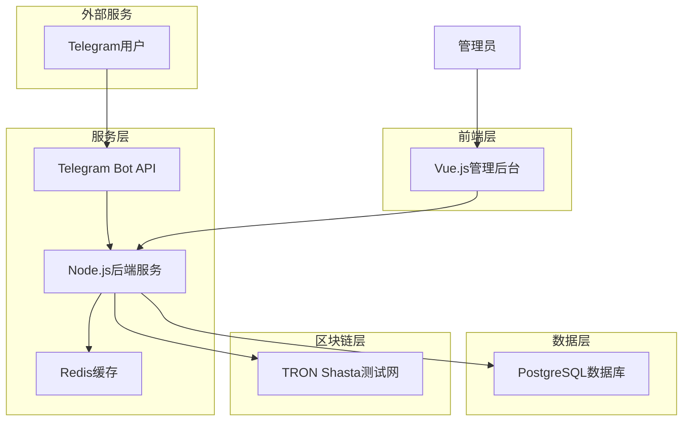
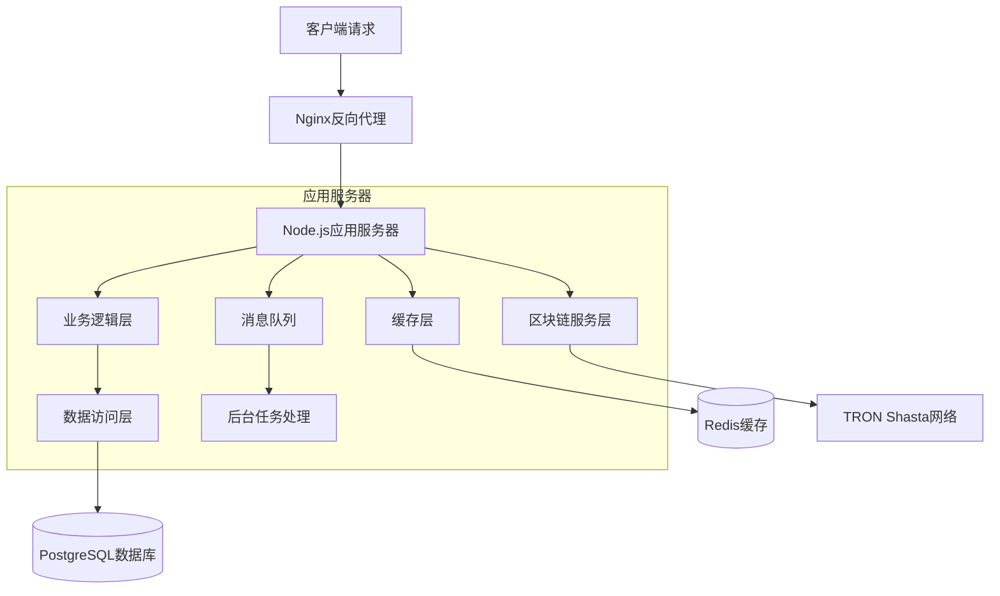

# TRON能量租赁系统技术架构文档

## 1. 架构设计



## 2. 技术描述

- **前端**: Vue.js@3 + Element Plus + Vite + TypeScript
- **后端**: Node.js@18 + Express.js@4 + TypeScript
- **数据库**: PostgreSQL@14 + Prisma ORM
- **缓存**: Redis@7
- **区块链**: TRON Shasta测试网 + TronWeb SDK
- **机器人**: Telegram Bot API + node-telegram-bot-api

## 3. 路由定义

### 3.1 管理后台路由

| 路由 | 用途 |
|------|------|
| /login | 管理员登录页面 |
| /dashboard | 仪表盘，显示系统概况和实时数据 |
| /users | 用户管理页面，查看和管理所有用户 |
| /orders | 订单管理页面，处理订单和异常 |
| /agents | 代理管理页面，审核和管理代理用户 |
| /bots | 机器人管理页面，配置和监控Telegram机器人 |
| /energy-pool | 能量池管理页面，监控库存和供应商 |
| /finance | 财务统计页面，查看收入和成本分析 |
| /settings | 系统设置页面，配置系统参数 |

### 3.2 Telegram机器人交互流程

| 命令/回调 | 用途 |
|-----------|------|
| /start | 启动机器人，显示欢迎页面 |
| energy_rent | 能量闪租功能入口 |
| package_buy | 笔数套餐购买入口 |
| apply_agent | 申请代理功能入口 |
| my_orders | 查看我的订单 |
| help | 帮助和联系方式 |

## 4. API定义

### 4.1 认证相关API

**管理员登录**
```
POST /api/auth/login
```

Request:
| 参数名 | 参数类型 | 是否必需 | 描述 |
|--------|----------|----------|------|
| username | string | true | 管理员用户名 |
| password | string | true | 密码 |

Response:
| 参数名 | 参数类型 | 描述 |
|--------|----------|------|
| success | boolean | 登录是否成功 |
| token | string | JWT访问令牌 |
| user | object | 用户信息 |

### 4.2 用户管理API

**获取用户列表**
```
GET /api/users
```

**获取用户详情**
```
GET /api/users/:id
```

**更新用户状态**
```
PUT /api/users/:id/status
```

### 4.3 订单管理API

**创建能量租赁订单**
```
POST /api/orders/energy
```

Request:
| 参数名 | 参数类型 | 是否必需 | 描述 |
|--------|----------|----------|------|
| userId | string | true | 用户Telegram ID |
| packageId | string | true | 套餐ID |
| targetAddress | string | true | 目标TRON地址 |

**获取订单列表**
```
GET /api/orders
```

**更新订单状态**
```
PUT /api/orders/:id/status
```

### 4.4 代理管理API

**申请代理**
```
POST /api/agents/apply
```

**审核代理申请**
```
PUT /api/agents/:id/approve
```

**获取代理收益**
```
GET /api/agents/:id/earnings
```

### 4.5 机器人管理API

**添加机器人**
```
POST /api/bots
```

Request:
| 参数名 | 参数类型 | 是否必需 | 描述 |
|--------|----------|----------|------|
| name | string | true | 机器人名称 |
| token | string | true | Telegram Bot Token |
| webhook | string | false | Webhook URL |

**获取机器人列表**
```
GET /api/bots
```

**更新机器人状态**
```
PUT /api/bots/:id/status
```

### 4.6 价格配置管理API

**获取机器人价格配置**
```
GET /api/pricing/bots/:botId
```

Response:
| 参数名 | 参数类型 | 描述 |
|--------|----------|------|
| energyFlashRent | object | 能量闪租价格配置 |
| transactionPackages | object | 笔数套餐价格配置 |
| effectiveTime | datetime | 生效时间 |
| updatedAt | datetime | 更新时间 |

**更新机器人价格配置**
```
PUT /api/pricing/bots/:botId
```

Request:
| 参数名 | 参数类型 | 是否必需 | 描述 |
|--------|----------|----------|------|
| energyFlashRent | object | true | 能量闪租价格配置 |
| transactionPackages | object | true | 笔数套餐价格配置 |
| effectiveTime | datetime | false | 生效时间，默认立即生效 |

**获取价格模板列表**
```
GET /api/pricing/templates
```

**创建价格模板**
```
POST /api/pricing/templates
```

Request:
| 参数名 | 参数类型 | 是否必需 | 描述 |
|--------|----------|----------|------|
| name | string | true | 模板名称 |
| description | string | false | 模板描述 |
| energyFlashRent | object | true | 能量闪租价格配置 |
| transactionPackages | object | true | 笔数套餐价格配置 |

**应用价格模板**
```
POST /api/pricing/templates/:templateId/apply
```

Request:
| 参数名 | 参数类型 | 是否必需 | 描述 |
|--------|----------|----------|------|
| botIds | array | true | 要应用的机器人ID列表 |
| effectiveTime | datetime | false | 生效时间，默认立即生效 |

**获取价格历史**
```
GET /api/pricing/bots/:botId/history
```

Query Parameters:
| 参数名 | 参数类型 | 是否必需 | 描述 |
|--------|----------|----------|------|
| limit | number | false | 返回记录数量，默认10 |
| page | number | false | 页码，默认1 |

**计算订单价格**
```
POST /api/pricing/calculate
```

Request:
| 参数名 | 参数类型 | 是否必需 | 描述 |
|--------|----------|----------|------|
| botId | string | true | 机器人ID |
| orderType | string | true | 订单类型：energy_flash_rent 或 transaction_package |
| amount | number | true | 数量（能量数量或套餐规格） |

### 4.7 TRON区块链API

**获取账户信息**
```
GET /api/tron/account/:address
```

**委托能量**
```
POST /api/tron/delegate-energy
```

Request:
| 参数名 | 参数类型 | 是否必需 | 描述 |
|--------|----------|----------|------|
| fromAddress | string | true | 委托方地址 |
| toAddress | string | true | 接收方地址 |
| amount | number | true | 能量数量 |
| duration | number | true | 委托时长(小时) |

**查询交易状态**
```
GET /api/tron/transaction/:txid
```

## 5. 服务器架构图



## 6. 数据模型

### 6.1 数据模型定义

```mermaid
erDiagram
    USERS ||--o{ ORDERS : places
    USERS ||--o{ AGENT_APPLICATIONS : applies
    AGENTS ||--o{ AGENT_EARNINGS : earns
    ENERGY_PACKAGES ||--o{ ORDERS : contains
    BOTS ||--o{ BOT_USERS : serves
    ENERGY_POOLS ||--o{ ENERGY_TRANSACTIONS : provides
    
    USERS {
        string telegram_id PK
        string username
        string first_name
        string last_name
        string role
        timestamp created_at
        timestamp updated_at
    }
    
    ORDERS {
        uuid id PK
        string user_id FK
        string package_id FK
        string target_address
        decimal amount
        string status
        string tx_hash
        timestamp created_at
        timestamp completed_at
    }
    
    ENERGY_PACKAGES {
        uuid id PK
        string name
        integer energy_amount
        decimal price
        integer duration_hours
        boolean is_active
        timestamp created_at
    }
    
    AGENTS {
        uuid id PK
        string user_id FK
        string level
        decimal commission_rate
        string referral_code
        timestamp approved_at
        timestamp created_at
    }
    
    AGENT_APPLICATIONS {
        uuid id PK
        string user_id FK
        string contact_info
        string status
        text reason
        timestamp created_at
        timestamp reviewed_at
    }
    
    AGENT_EARNINGS {
        uuid id PK
        string agent_id FK
        string order_id FK
        decimal amount
        string status
        timestamp created_at
    }
    
    BOTS {
        uuid id PK
        string name
        string token
        string webhook_url
        boolean is_active
        timestamp created_at
        timestamp updated_at
    }
    
    BOT_USERS {
        uuid id PK
        string bot_id FK
        string user_id FK
        timestamp first_interaction
        timestamp last_interaction
    }
    
    ENERGY_POOLS {
        uuid id PK
        string address
        string private_key
        bigint available_energy
        bigint total_energy
        boolean is_active
        timestamp created_at
    }
    
    ENERGY_TRANSACTIONS {
        uuid id PK
        string pool_id FK
        string order_id FK
        string tx_hash
        bigint energy_amount
        string status
        timestamp created_at
    }
    
    PRICE_CONFIGS {
        uuid id PK
        string bot_id FK
        json energy_flash_rent_prices
        json transaction_package_prices
        timestamp effective_time
        string created_by FK
        boolean is_active
        timestamp created_at
    }
    
    PRICE_TEMPLATES {
        uuid id PK
        string name
        string description
        json energy_flash_rent_prices
        json transaction_package_prices
        string created_by FK
        timestamp created_at
    }
    
    PRICE_HISTORY {
        uuid id PK
        string config_id FK
        string bot_id FK
        json old_prices
        json new_prices
        string changed_by FK
        string change_reason
        timestamp created_at
    }
```



### 6.2 数据定义语言

**用户表 (users)**
```sql
-- 创建用户表
CREATE TABLE users (
    telegram_id VARCHAR(50) PRIMARY KEY,
    username VARCHAR(100),
    first_name VARCHAR(100),
    last_name VARCHAR(100),
    role VARCHAR(20) DEFAULT 'user' CHECK (role IN ('user', 'agent', 'admin')),
    is_active BOOLEAN DEFAULT true,
    created_at TIMESTAMP WITH TIME ZONE DEFAULT NOW(),
    updated_at TIMESTAMP WITH TIME ZONE DEFAULT NOW()
);

-- 创建索引
CREATE INDEX idx_users_role ON users(role);
CREATE INDEX idx_users_created_at ON users(created_at DESC);
```

**能量套餐表 (energy_packages)**
```sql
-- 创建能量套餐表
CREATE TABLE energy_packages (
    id UUID PRIMARY KEY DEFAULT gen_random_uuid(),
    name VARCHAR(100) NOT NULL,
    energy_amount BIGINT NOT NULL,
    price DECIMAL(10,2) NOT NULL,
    duration_hours INTEGER NOT NULL,
    is_active BOOLEAN DEFAULT true,
    created_at TIMESTAMP WITH TIME ZONE DEFAULT NOW()
);

-- 初始化数据
INSERT INTO energy_packages (name, energy_amount, price, duration_hours) VALUES
('基础套餐', 32000, 1.5, 1),
('标准套餐', 65000, 2.8, 1),
('高级套餐', 131000, 5.2, 1),
('企业套餐', 262000, 9.8, 1);
```

**订单表 (orders)**
```sql
-- 创建订单表
CREATE TABLE orders (
    id UUID PRIMARY KEY DEFAULT gen_random_uuid(),
    user_id VARCHAR(50) NOT NULL REFERENCES users(telegram_id),
    package_id UUID NOT NULL REFERENCES energy_packages(id),
    target_address VARCHAR(50) NOT NULL,
    amount DECIMAL(10,2) NOT NULL,
    status VARCHAR(20) DEFAULT 'pending' CHECK (status IN ('pending', 'paid', 'processing', 'completed', 'failed', 'cancelled')),
    tx_hash VARCHAR(100),
    created_at TIMESTAMP WITH TIME ZONE DEFAULT NOW(),
    completed_at TIMESTAMP WITH TIME ZONE
);

-- 创建索引
CREATE INDEX idx_orders_user_id ON orders(user_id);
CREATE INDEX idx_orders_status ON orders(status);
CREATE INDEX idx_orders_created_at ON orders(created_at DESC);
```

**代理表 (agents)**
```sql
-- 创建代理表
CREATE TABLE agents (
    id UUID PRIMARY KEY DEFAULT gen_random_uuid(),
    user_id VARCHAR(50) NOT NULL REFERENCES users(telegram_id),
    level VARCHAR(20) DEFAULT 'bronze' CHECK (level IN ('bronze', 'silver', 'gold', 'diamond')),
    commission_rate DECIMAL(5,4) DEFAULT 0.05,
    referral_code VARCHAR(20) UNIQUE NOT NULL,
    approved_at TIMESTAMP WITH TIME ZONE,
    created_at TIMESTAMP WITH TIME ZONE DEFAULT NOW()
);

-- 创建索引
CREATE INDEX idx_agents_user_id ON agents(user_id);
CREATE INDEX idx_agents_referral_code ON agents(referral_code);
```

**机器人表 (bots)**
```sql
-- 创建机器人表
CREATE TABLE bots (
    id UUID PRIMARY KEY DEFAULT gen_random_uuid(),
    name VARCHAR(100) NOT NULL,
    token VARCHAR(200) NOT NULL UNIQUE,
    webhook_url VARCHAR(500),
    is_active BOOLEAN DEFAULT true,
    created_at TIMESTAMP WITH TIME ZONE DEFAULT NOW(),
    updated_at TIMESTAMP WITH TIME ZONE DEFAULT NOW()
);

-- 创建索引
CREATE INDEX idx_bots_is_active ON bots(is_active);
```

**能量池表 (energy_pools)**
```sql
-- 创建能量池表
CREATE TABLE energy_pools (
    id UUID PRIMARY KEY DEFAULT gen_random_uuid(),
    address VARCHAR(50) NOT NULL UNIQUE,
    private_key TEXT NOT NULL, -- 加密存储
    available_energy BIGINT DEFAULT 0,
    total_energy BIGINT DEFAULT 0,
    is_active BOOLEAN DEFAULT true,
    created_at TIMESTAMP WITH TIME ZONE DEFAULT NOW()
);

-- 创建索引
CREATE INDEX idx_energy_pools_address ON energy_pools(address);
CREATE INDEX idx_energy_pools_is_active ON energy_pools(is_active);
```

**价格配置表 (price_configs)**
```sql
-- 创建价格配置表
CREATE TABLE price_configs (
    id UUID PRIMARY KEY DEFAULT gen_random_uuid(),
    bot_id UUID NOT NULL REFERENCES bots(id),
    energy_flash_rent_prices JSONB NOT NULL,
    transaction_package_prices JSONB NOT NULL,
    effective_time TIMESTAMP WITH TIME ZONE DEFAULT NOW(),
    created_by VARCHAR(50) NOT NULL REFERENCES users(telegram_id),
    is_active BOOLEAN DEFAULT true,
    created_at TIMESTAMP WITH TIME ZONE DEFAULT NOW()
);

-- 创建索引
CREATE INDEX idx_price_configs_bot_id ON price_configs(bot_id);
CREATE INDEX idx_price_configs_is_active ON price_configs(is_active);
CREATE INDEX idx_price_configs_effective_time ON price_configs(effective_time DESC);

-- 初始化默认价格配置示例
INSERT INTO price_configs (bot_id, energy_flash_rent_prices, transaction_package_prices, created_by) 
SELECT 
    id,
    '{
        "32000": {"price": 1.5, "currency": "TRX", "duration": "1h"},
        "65000": {"price": 2.8, "currency": "TRX", "duration": "1h"},
        "130000": {"price": 5.2, "currency": "TRX", "duration": "1h"},
        "260000": {"price": 9.8, "currency": "TRX", "duration": "1h"}
    }'::jsonb,
    '{
        "10": {"price": 8, "currency": "TRX", "transactions": 10, "validity": "30d"},
        "50": {"price": 35, "currency": "TRX", "transactions": 50, "validity": "30d"},
        "100": {"price": 65, "currency": "TRX", "transactions": 100, "validity": "30d"},
        "500": {"price": 300, "currency": "TRX", "transactions": 500, "validity": "30d"}
    }'::jsonb,
    'admin'
FROM bots WHERE is_active = true;
```

**价格模板表 (price_templates)**
```sql
-- 创建价格模板表
CREATE TABLE price_templates (
    id UUID PRIMARY KEY DEFAULT gen_random_uuid(),
    name VARCHAR(100) NOT NULL,
    description TEXT,
    energy_flash_rent_prices JSONB NOT NULL,
    transaction_package_prices JSONB NOT NULL,
    created_by VARCHAR(50) NOT NULL REFERENCES users(telegram_id),
    created_at TIMESTAMP WITH TIME ZONE DEFAULT NOW()
);

-- 创建索引
CREATE INDEX idx_price_templates_name ON price_templates(name);
CREATE INDEX idx_price_templates_created_by ON price_templates(created_by);

-- 初始化默认价格模板
INSERT INTO price_templates (name, description, energy_flash_rent_prices, transaction_package_prices, created_by) VALUES
('标准价格模板', '适用于大部分机器人的标准价格配置', 
 '{
    "32000": {"price": 1.5, "currency": "TRX", "duration": "1h"},
    "65000": {"price": 2.8, "currency": "TRX", "duration": "1h"},
    "130000": {"price": 5.2, "currency": "TRX", "duration": "1h"},
    "260000": {"price": 9.8, "currency": "TRX", "duration": "1h"}
 }'::jsonb,
 '{
    "10": {"price": 8, "currency": "TRX", "transactions": 10, "validity": "30d"},
    "50": {"price": 35, "currency": "TRX", "transactions": 50, "validity": "30d"},
    "100": {"price": 65, "currency": "TRX", "transactions": 100, "validity": "30d"},
    "500": {"price": 300, "currency": "TRX", "transactions": 500, "validity": "30d"}
 }'::jsonb,
 'admin'),
('优惠价格模板', '适用于促销活动的优惠价格配置',
 '{
    "32000": {"price": 1.2, "currency": "TRX", "duration": "1h"},
    "65000": {"price": 2.3, "currency": "TRX", "duration": "1h"},
    "130000": {"price": 4.5, "currency": "TRX", "duration": "1h"},
    "260000": {"price": 8.5, "currency": "TRX", "duration": "1h"}
 }'::jsonb,
 '{
    "10": {"price": 7, "currency": "TRX", "transactions": 10, "validity": "30d"},
    "50": {"price": 30, "currency": "TRX", "transactions": 50, "validity": "30d"},
    "100": {"price": 55, "currency": "TRX", "transactions": 100, "validity": "30d"},
    "500": {"price": 250, "currency": "TRX", "transactions": 500, "validity": "30d"}
 }'::jsonb,
 'admin');
```

**价格历史表 (price_history)**
```sql
-- 创建价格历史表
CREATE TABLE price_history (
    id UUID PRIMARY KEY DEFAULT gen_random_uuid(),
    config_id UUID REFERENCES price_configs(id),
    bot_id UUID NOT NULL REFERENCES bots(id),
    old_prices JSONB,
    new_prices JSONB NOT NULL,
    changed_by VARCHAR(50) NOT NULL REFERENCES users(telegram_id),
    change_reason TEXT,
    created_at TIMESTAMP WITH TIME ZONE DEFAULT NOW()
);

-- 创建索引
CREATE INDEX idx_price_history_bot_id ON price_history(bot_id);
CREATE INDEX idx_price_history_config_id ON price_history(config_id);
CREATE INDEX idx_price_history_created_at ON price_history(created_at DESC);
CREATE INDEX idx_price_history_changed_by ON price_history(changed_by);
```