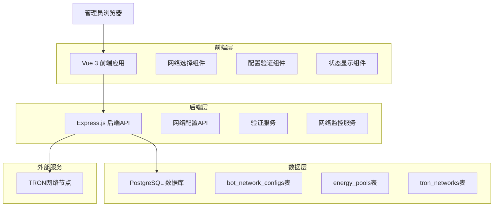
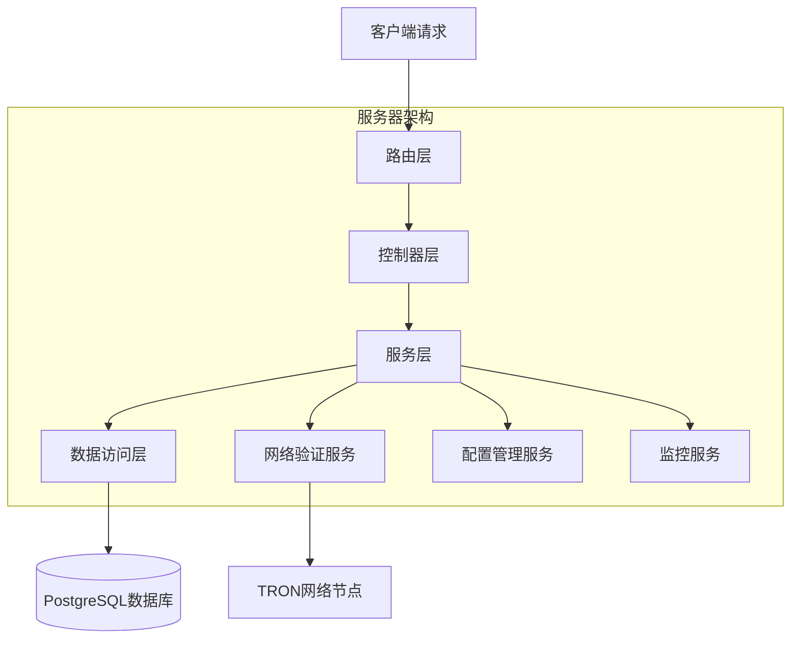
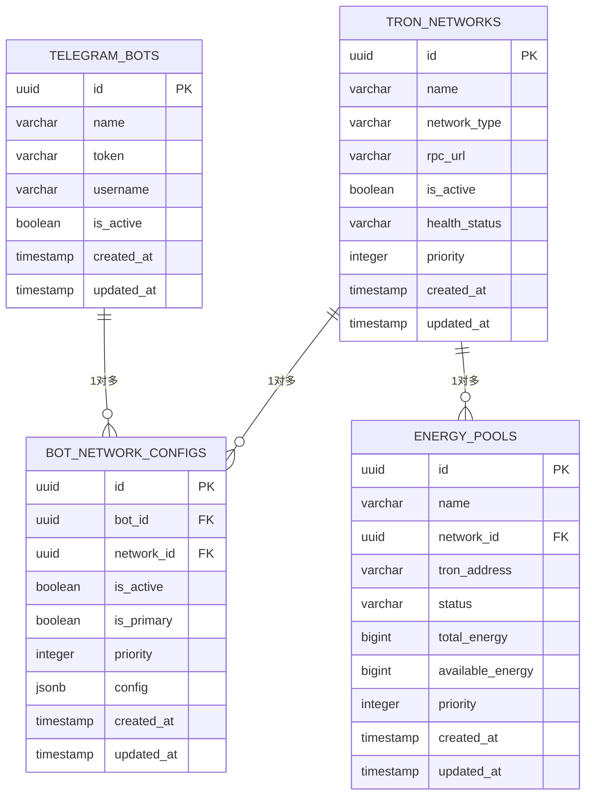

# 机器人和能量池单网络配置技术架构文档

## 1. Architecture design



## 2. Technology Description

- Frontend: Vue@3 + TypeScript + Element Plus + Tailwind CSS + Vite
- Backend: Express@4 + TypeScript + Node.js
- Database: PostgreSQL 14
- Network: TRON网络节点 (Mainnet/Testnet)

## 3. Route definitions

| Route | Purpose |
|-------|----------|
| /bot-management | 机器人管理页面，包含网络配置功能 |
| /bot-management/:id/networks | 机器人网络配置页面，单网络选择和配置 |
| /energy-pool | 能量池管理页面，包含账户网络配置 |
| /energy-pool/network-config | 能量池网络配置页面，批量网络关联 |
| /tron-networks | TRON网络管理页面，网络列表和状态监控 |
| /network-overview | 网络配置概览页面，全局统计和告警 |

## 4. API definitions

### 4.1 Core API

**机器人网络配置相关**

```
GET /api/bots/:id/network
```
获取机器人当前网络配置

Response:
| Param Name | Param Type | Description |
|------------|------------|-------------|
| success | boolean | 请求是否成功 |
| data | object | 网络配置信息 |
| data.network_id | string | 网络ID |
| data.network_name | string | 网络名称 |
| data.network_type | string | 网络类型 |
| data.is_active | boolean | 是否启用 |

```
PUT /api/bots/:id/network
```
设置机器人网络配置（单网络约束）

Request:
| Param Name | Param Type | isRequired | Description |
|------------|------------|------------|-------------|
| network_id | string | true | 要关联的网络ID |
| replace_existing | boolean | false | 是否替换现有配置 |

Response:
| Param Name | Param Type | Description |
|------------|------------|-------------|
| success | boolean | 操作是否成功 |
| message | string | 操作结果信息 |

**能量池网络配置相关**

```
GET /api/energy-pools/:id/network
```
获取能量池账户网络配置

```
PUT /api/energy-pools/:id/network
```
设置能量池账户网络（单网络约束）

Request:
| Param Name | Param Type | isRequired | Description |
|------------|------------|------------|-------------|
| network_id | string | true | 要关联的网络ID |

```
POST /api/energy-pools/batch-network
```
批量设置能量池网络配置

Request:
| Param Name | Param Type | isRequired | Description |
|------------|------------|------------|-------------|
| pool_ids | array | true | 能量池ID数组 |
| network_id | string | true | 目标网络ID |

**网络管理相关**

```
GET /api/networks
```
获取可用TRON网络列表

```
POST /api/networks/:id/test
```
测试网络连通性

```
GET /api/networks/usage-stats
```
获取网络使用统计

Response:
| Param Name | Param Type | Description |
|------------|------------|-------------|
| network_id | string | 网络ID |
| network_name | string | 网络名称 |
| bot_count | number | 关联的机器人数量 |
| pool_count | number | 关联的能量池数量 |
| health_status | string | 网络健康状态 |

## 5. Server architecture diagram



## 6. Data model

### 6.1 Data model definition



### 6.2 Data Definition Language

**约束修改 - 确保单网络配置**

```sql
-- 为机器人添加单网络约束
-- 确保每个机器人只能有一个主要网络
CREATE UNIQUE INDEX IF NOT EXISTS idx_bot_single_primary_network 
    ON bot_network_configs(bot_id) 
    WHERE is_primary = true AND is_active = true;

-- 为能量池添加单网络约束
-- 确保每个能量池只能关联一个网络
ALTER TABLE energy_pools 
    ADD CONSTRAINT chk_energy_pools_single_network 
    CHECK (network_id IS NOT NULL);

-- 创建索引优化查询性能
CREATE INDEX IF NOT EXISTS idx_energy_pools_network_status 
    ON energy_pools(network_id, status);

CREATE INDEX IF NOT EXISTS idx_bot_network_configs_active_primary 
    ON bot_network_configs(bot_id, is_active, is_primary);
```

**业务逻辑函数**

```sql
-- 设置机器人单网络配置
CREATE OR REPLACE FUNCTION set_bot_single_network(
    p_bot_id UUID,
    p_network_id UUID
) RETURNS BOOLEAN AS $$
DECLARE
    v_existing_count INTEGER;
BEGIN
    -- 检查是否已有网络配置
    SELECT COUNT(*) INTO v_existing_count
    FROM bot_network_configs 
    WHERE bot_id = p_bot_id AND is_active = true;
    
    -- 如果已有配置，先禁用
    IF v_existing_count > 0 THEN
        UPDATE bot_network_configs 
        SET is_active = false, is_primary = false, updated_at = NOW()
        WHERE bot_id = p_bot_id;
    END IF;
    
    -- 插入或更新新的网络配置
    INSERT INTO bot_network_configs (
        bot_id, network_id, is_active, is_primary, priority, created_at, updated_at
    ) VALUES (
        p_bot_id, p_network_id, true, true, 1, NOW(), NOW()
    )
    ON CONFLICT (bot_id, network_id) 
    DO UPDATE SET 
        is_active = true,
        is_primary = true,
        priority = 1,
        updated_at = NOW();
    
    RETURN true;
END;
$$ LANGUAGE plpgsql;

-- 设置能量池网络配置
CREATE OR REPLACE FUNCTION set_energy_pool_network(
    p_pool_id UUID,
    p_network_id UUID
) RETURNS BOOLEAN AS $$
BEGIN
    -- 直接更新能量池的网络关联
    UPDATE energy_pools 
    SET 
        network_id = p_network_id,
        updated_at = NOW()
    WHERE id = p_pool_id;
    
    RETURN FOUND;
END;
$$ LANGUAGE plpgsql;

-- 批量设置能量池网络
CREATE OR REPLACE FUNCTION batch_set_energy_pool_network(
    p_pool_ids UUID[],
    p_network_id UUID
) RETURNS INTEGER AS $$
DECLARE
    v_updated_count INTEGER;
BEGIN
    UPDATE energy_pools 
    SET 
        network_id = p_network_id,
        updated_at = NOW()
    WHERE id = ANY(p_pool_ids);
    
    GET DIAGNOSTICS v_updated_count = ROW_COUNT;
    RETURN v_updated_count;
END;
$$ LANGUAGE plpgsql;

-- 获取网络使用统计
CREATE OR REPLACE FUNCTION get_network_usage_stats()
RETURNS TABLE (
    network_id UUID,
    network_name VARCHAR,
    network_type VARCHAR,
    bot_count BIGINT,
    pool_count BIGINT,
    health_status VARCHAR
) AS $$
BEGIN
    RETURN QUERY
    SELECT 
        tn.id,
        tn.name,
        tn.network_type,
        COALESCE(bot_stats.bot_count, 0) as bot_count,
        COALESCE(pool_stats.pool_count, 0) as pool_count,
        tn.health_status
    FROM tron_networks tn
    LEFT JOIN (
        SELECT 
            network_id,
            COUNT(*) as bot_count
        FROM bot_network_configs 
        WHERE is_active = true AND is_primary = true
        GROUP BY network_id
    ) bot_stats ON tn.id = bot_stats.network_id
    LEFT JOIN (
        SELECT 
            network_id,
            COUNT(*) as pool_count
        FROM energy_pools 
        WHERE status = 'active'
        GROUP BY network_id
    ) pool_stats ON tn.id = pool_stats.network_id
    WHERE tn.is_active = true
    ORDER BY tn.priority DESC, tn.name;
END;
$$ LANGUAGE plpgsql;
```

**初始化数据**

```sql
-- 确保现有机器人都有网络配置
INSERT INTO bot_network_configs (bot_id, network_id, is_active, is_primary, priority)
SELECT 
    tb.id,
    (
        SELECT id FROM tron_networks 
        WHERE is_active = true 
        ORDER BY priority DESC, name 
        LIMIT 1
    ),
    true,
    true,
    1
FROM telegram_bots tb
WHERE NOT EXISTS (
    SELECT 1 FROM bot_network_configs bnc 
    WHERE bnc.bot_id = tb.id AND bnc.is_active = true
);

-- 确保现有能量池都有网络关联
UPDATE energy_pools 
SET network_id = (
    SELECT id FROM tron_networks 
    WHERE is_active = true 
    ORDER BY priority DESC, name 
    LIMIT 1
)
WHERE network_id IS NULL;
```