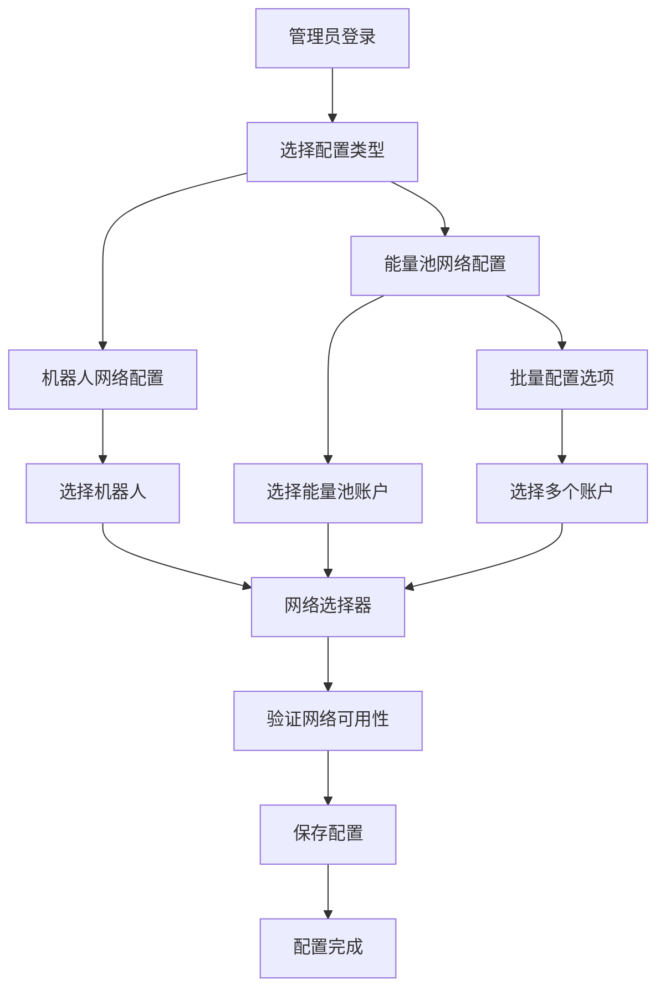

# 机器人和能量池单网络配置需求文档

## 1. Product Overview

本项目旨在为TRON能量租赁系统的机器人配置和能量池账户实现单网络约束功能，确保每个机器人和能量池账户只能关联一个TRON网络，简化配置管理并提高系统稳定性。

该功能将解决当前系统中机器人和能量池可能关联多个网络导致的配置复杂性问题，为管理员提供更清晰、更易管理的网络配置界面。

通过实现单网络约束，系统将具备更好的可维护性和更低的配置错误风险。

## 2. Core Features

### 2.1 User Roles

| Role | Registration Method | Core Permissions |
|------|---------------------|------------------|
| 系统管理员 | 系统内置账户 | 可管理所有机器人和能量池的网络配置，查看所有网络状态 |
| 运营管理员 | 管理员邀请注册 | 可配置机器人和能量池的网络关联，查看网络使用统计 |

### 2.2 Feature Module

我们的单网络配置需求包含以下主要页面：

1. **机器人网络配置页面**：网络选择器、配置验证、状态显示
2. **能量池网络配置页面**：网络关联设置、账户网络管理、批量配置
3. **TRON网络管理页面**：网络列表管理、网络状态监控、网络测试
4. **网络配置概览页面**：全局网络使用统计、配置状态总览、异常告警

### 2.3 Page Details

| Page Name | Module Name | Feature description |
|-----------|-------------|---------------------|
| 机器人网络配置页面 | 网络选择器 | 从TRON网络管理列表中选择单个网络，支持网络搜索和筛选 |
| 机器人网络配置页面 | 配置验证 | 验证所选网络的连通性和可用性，显示网络健康状态 |
| 机器人网络配置页面 | 状态显示 | 显示当前关联网络信息、连接状态、最后同步时间 |
| 能量池网络配置页面 | 网络关联设置 | 为能量池账户选择并关联单个TRON网络 |
| 能量池网络配置页面 | 账户网络管理 | 查看和修改能量池账户的网络关联，支持网络切换 |
| 能量池网络配置页面 | 批量配置 | 批量为多个能量池账户设置相同的网络关联 |
| TRON网络管理页面 | 网络列表管理 | 管理可用的TRON网络列表，包括主网、测试网、私有网络 |
| TRON网络管理页面 | 网络状态监控 | 实时监控网络连接状态、延迟、可用性 |
| TRON网络管理页面 | 网络测试 | 测试网络连通性、RPC响应时间、节点健康状态 |
| 网络配置概览页面 | 全局网络使用统计 | 统计各网络的机器人和能量池使用数量 |
| 网络配置概览页面 | 配置状态总览 | 显示未配置网络的机器人和能量池数量 |
| 网络配置概览页面 | 异常告警 | 显示网络连接异常、配置错误等告警信息 |

## 3. Core Process

### 管理员操作流程

1. **机器人网络配置流程**：管理员进入机器人管理页面 → 选择或创建机器人 → 在网络配置区域选择单个TRON网络 → 系统验证网络可用性 → 保存配置并建立关联

2. **能量池网络配置流程**：管理员进入能量池管理页面 → 选择或创建能量池账户 → 在网络设置中选择单个TRON网络 → 系统检查网络兼容性 → 确认配置并更新关联

3. **批量网络配置流程**：管理员选择多个能量池账户 → 打开批量配置对话框 → 选择目标TRON网络 → 确认批量操作 → 系统逐个更新网络关联

## 4. User Interface Design

### 4.1 Design Style

- **主色调**：蓝色系 (#3B82F6) 作为主色，绿色 (#10B981) 表示成功状态，红色 (#EF4444) 表示错误状态
- **辅助色**：灰色系 (#6B7280, #9CA3AF, #D1D5DB) 用于文本和边框
- **按钮样式**：圆角矩形按钮，主要操作使用实心按钮，次要操作使用边框按钮
- **字体**：系统默认字体，标题使用 16-18px，正文使用 14px，辅助信息使用 12px
- **布局风格**：卡片式布局，清晰的分组和层次结构
- **图标风格**：使用 Lucide 图标库，线性风格，保持一致性

### 4.2 Page Design Overview

| Page Name | Module Name | UI Elements |
|-----------|-------------|-------------|
| 机器人网络配置页面 | 网络选择器 | 下拉选择框，显示网络名称、类型、状态指示器；搜索输入框；网络卡片展示 |
| 机器人网络配置页面 | 配置验证 | 验证按钮，加载动画，状态图标（绿色勾号/红色叉号），错误提示文本 |
| 机器人网络配置页面 | 状态显示 | 信息卡片，网络名称标签，连接状态徽章，时间戳显示 |
| 能量池网络配置页面 | 网络关联设置 | 网络选择下拉框，确认对话框，操作按钮组 |
| 能量池网络配置页面 | 批量配置 | 多选表格，批量操作工具栏，进度条，操作结果提示 |
| TRON网络管理页面 | 网络列表管理 | 数据表格，操作按钮，状态标签，分页组件 |
| 网络配置概览页面 | 统计面板 | 数据卡片，环形图表，趋势图，告警列表 |

### 4.3 Responsiveness

系统采用桌面优先设计，支持平板设备适配。在移动设备上，表格将转换为卡片式布局，操作按钮适当放大以便触摸操作。网络选择器在小屏幕上将使用全屏模态框展示，确保良好的用户体验。