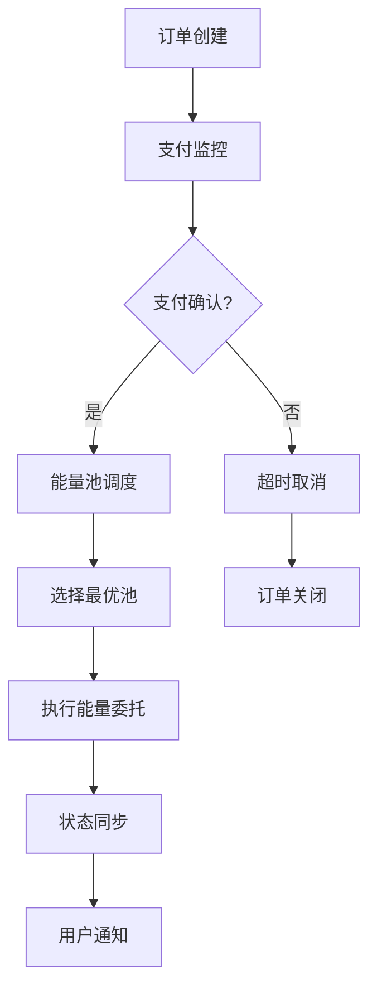
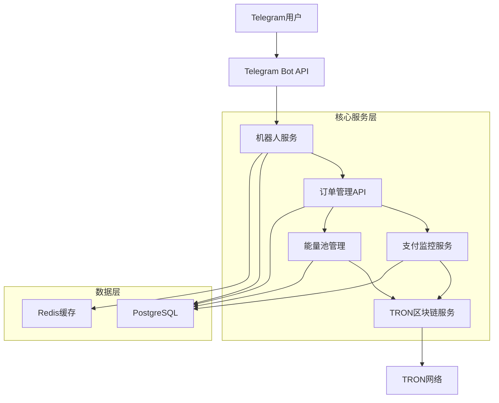

# TRON能量租赁系统 - 核心模块开发需求文档

> **文档类型**: 产品需求文档  
> **创建日期**: 2024-12-19  
> **状态**: 🚨 紧急开发  
> **优先级**: P0 - 最高优先级  

## 1. 产品概述

本文档专门针对TRON能量租赁系统中四个完全缺失的核心模块进行详细需求分析。这些模块是系统能够正常运行的基础，目前完成度为0%，需要立即开发。

**核心缺失模块**:
- Telegram机器人集成 - 用户交互的唯一入口
- TRON区块链集成 - 业务核心功能实现
- 能量池管理系统 - 自动化运营的关键
- 支付与交易处理 - 资金安全和业务闭环

## 2. 核心功能需求

### 2.1 Telegram机器人模块

#### 功能概述
Telegram机器人是用户与系统交互的唯一界面，必须提供完整的能量租赁服务流程。

#### 核心页面和功能
1. **机器人启动页面**: 欢迎消息、用户注册、基础说明
2. **主菜单页面**: 能量包浏览、订单查询、账户管理、帮助支持
3. **能量包选择页面**: 套餐展示、价格对比、规格说明
4. **订单确认页面**: 订单详情、价格计算、支付方式
5. **支付页面**: 支付地址生成、支付状态跟踪
6. **订单状态页面**: 委托进度、完成通知、历史记录
7. **用户中心页面**: 个人信息、余额查询、推荐码

#### 详细功能规格

| 页面名称 | 模块名称 | 功能描述 |
|----------|----------|----------|
| 机器人启动 | 用户注册 | 自动绑定Telegram用户ID，创建系统账户，发送欢迎消息 |
| 机器人启动 | 命令处理 | 处理/start, /help, /menu等基础命令 |
| 主菜单 | 导航菜单 | 内联键盘导航，快速访问各功能模块 |
| 主菜单 | 状态显示 | 显示用户当前订单状态、余额信息 |
| 能量包选择 | 套餐展示 | 动态加载可用能量包，显示价格和规格 |
| 能量包选择 | 价格计算 | 实时计算总价，支持数量选择 |
| 订单确认 | 订单生成 | 创建订单记录，生成唯一订单号 |
| 订单确认 | 地址验证 | 验证用户输入的TRON地址格式 |
| 支付页面 | 支付地址 | 生成专用支付地址，显示二维码 |
| 支付页面 | 状态监控 | 实时监控支付状态，自动确认 |
| 订单状态 | 进度跟踪 | 显示能量委托进度，完成通知 |
| 订单状态 | 历史查询 | 查看历史订单，支持分页浏览 |

### 2.2 TRON区块链集成模块

#### 功能概述
实现与TRON网络的完整集成，支持能量委托、钱包管理、交易监控等核心区块链功能。

#### 核心功能组件
1. **TronWeb SDK集成**: 连接TRON网络，支持主网和测试网切换
2. **钱包管理服务**: 创建和管理多个钱包，私钥安全存储
3. **能量委托功能**: 实现delegateResource合约调用
4. **交易监控系统**: 实时监控交易状态和确认
5. **地址验证工具**: 验证TRON地址格式和有效性

#### 详细功能规格

| 组件名称 | 模块名称 | 功能描述 |
|----------|----------|----------|
| SDK集成 | 网络连接 | 配置Shasta测试网，建立稳定连接，支持连接池 |
| SDK集成 | 错误处理 | 网络异常重试，连接状态监控，自动重连机制 |
| 钱包管理 | 钱包创建 | 生成新钱包，支持HD钱包，私钥AES-256加密 |
| 钱包管理 | 余额查询 | 查询TRX余额、能量、带宽等资源信息 |
| 能量委托 | 委托执行 | 调用delegateResource合约，执行能量委托 |
| 能量委托 | 取消委托 | 实现undelegateResource，管理解冻期 |
| 交易监控 | 状态跟踪 | 监控交易确认状态，记录区块确认数 |
| 交易监控 | 事件监听 | 订阅区块链事件，实时同步状态变化 |

### 2.3 能量池管理系统

#### 功能概述
实现智能化的能量池调度和管理，自动优化成本和效率，减少人工干预。

#### 核心管理功能
1. **能量池监控**: 实时监控各池状态、余额、使用率
2. **自动调度算法**: 根据需求自动选择最优能量池
3. **成本优化**: 最低成本路径选择，利润最大化
4. **库存预警**: 能量不足自动预警和补充
5. **性能分析**: 使用效率分析和优化建议

#### 详细功能规格

| 功能模块 | 子功能 | 功能描述 |
|----------|--------|----------|
| 状态监控 | 实时监控 | 监控各能量池余额、可用量、委托状态 |
| 状态监控 | 健康检查 | 检测异常池，自动隔离和恢复机制 |
| 自动调度 | 负载均衡 | 根据池负载自动分配新订单 |
| 自动调度 | 智能选择 | 基于成本、速度、可靠性选择最优池 |
| 成本优化 | 成本计算 | 实时计算各池成本，选择最低成本方案 |
| 成本优化 | 利润分析 | 分析各池利润率，优化定价策略 |
| 库存管理 | 预警系统 | 能量不足时自动预警，支持多级阈值 |
| 库存管理 | 自动补充 | 预设规则自动补充能量，保证供应 |

### 2.4 支付与交易处理模块

#### 功能概述
实现安全可靠的支付处理系统，支持TRON网络支付监控、订单自动处理、风险控制。

#### 核心支付功能
1. **支付监控服务**: 实时监控TRON转账，自动确认支付
2. **订单自动处理**: 支付成功后自动执行能量委托
3. **风险控制系统**: 防重复支付、超时处理、异常检测
4. **价格计算引擎**: 动态定价、实时汇率、成本计算
5. **通知服务**: 支付状态实时通知用户

#### 详细功能规格

| 功能模块 | 子功能 | 功能描述 |
|----------|--------|----------|
| 支付监控 | 地址监控 | 监控专用支付地址的转账记录 |
| 支付监控 | 自动确认 | 达到确认数后自动确认支付 |
| 订单处理 | 状态机 | 管理订单生命周期，状态流转 |
| 订单处理 | 自动执行 | 支付确认后自动触发能量委托 |
| 风险控制 | 重复检测 | 防止重复支付，幂等性保证 |
| 风险控制 | 超时处理 | 超时订单自动取消，资源释放 |
| 价格计算 | 动态定价 | 根据市场情况动态调整价格 |
| 价格计算 | 成本分析 | 实时计算成本，保证利润率 |

## 3. 核心业务流程

### 3.1 用户购买能量流程

用户通过Telegram机器人完成整个购买流程：

1. 用户发送/start命令启动机器人
2. 系统自动注册用户账户，显示主菜单
3. 用户选择"购买能量"，浏览可用能量包
4. 用户选择合适的能量包和数量
5. 用户输入接收能量的TRON地址
6. 系统生成订单，计算总价，显示支付信息
7. 用户向指定地址转账支付
8. 系统监控到支付后自动确认订单
9. 能量池管理系统自动选择最优池执行委托
10. TRON区块链集成模块执行能量委托
11. 系统通知用户委托完成，提供交易哈希

### 3.2 系统自动化运营流程

系统后台自动化处理所有订单：

## 4. 技术架构设计

### 4.1 整体架构

### 4.2 技术栈选择

- **Telegram机器人**: node-telegram-bot-api + Express.js
- **TRON集成**: TronWeb SDK + TronGrid API
- **能量池管理**: Node.js + Redis + 调度算法
- **支付处理**: 事件驱动架构 + 状态机
- **数据存储**: PostgreSQL + Redis
- **监控**: 自研监控 + 日志系统

## 5. 开发优先级和时间规划

### 5.1 开发优先级

**P0 (最高优先级) - 2周内完成**:
- Telegram机器人基础框架和核心命令
- 用户注册和认证系统
- 基础订单流程

**P0 (最高优先级) - 4周内完成**:
- TRON区块链基础集成
- 钱包管理和能量委托
- 支付监控和确认

**P1 (高优先级) - 6周内完成**:
- 能量池管理系统
- 自动化调度算法
- 完整业务流程打通

**P1 (高优先级) - 8周内完成**:
- 风险控制和异常处理
- 性能优化和监控
- 用户体验优化

### 5.2 里程碑目标

- **第2周**: 机器人可用，用户能够下单
- **第4周**: TRON集成完成，能够执行委托
- **第6周**: 完整业务流程打通，系统基本可用
- **第8周**: 系统自动化运营，可以小规模上线

## 6. 风险评估和应对策略

### 6.1 技术风险

**TRON网络稳定性风险**:
- 风险: Shasta测试网可能不稳定
- 应对: 实现重试机制，准备主网切换方案

**TronWeb API限制风险**:
- 风险: API调用频率限制
- 应对: 实现请求队列，使用多个API端点

### 6.2 业务风险

**资金安全风险**:
- 风险: 支付处理错误导致资金损失
- 应对: 多重确认机制，完善的日志和监控

**用户体验风险**:
- 风险: 机器人响应慢或功能不完整
- 应对: 性能优化，分阶段发布功能

## 7. 成功标准

### 7.1 功能完整性
- ✅ 用户可以通过Telegram机器人完成完整购买流程
- ✅ 系统能够自动执行能量委托
- ✅ 支付监控和确认机制正常工作
- ✅ 能量池管理系统自动化运营

### 7.2 性能指标
- 机器人响应时间 < 3秒
- 支付确认时间 < 5分钟
- 能量委托执行时间 < 10分钟
- 系统可用性 > 99%

### 7.3 安全标准
- 私钥安全存储，AES-256加密
- 支付防重复处理
- 异常情况自动处理
- 完整的操作日志记录

---

**文档维护**: 开发团队  
**更新频率**: 每周更新进度  
**联系方式**: 项目负责人