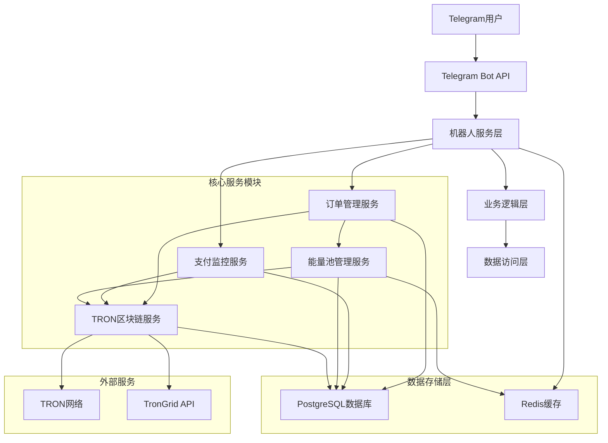
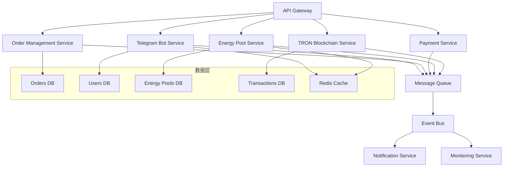
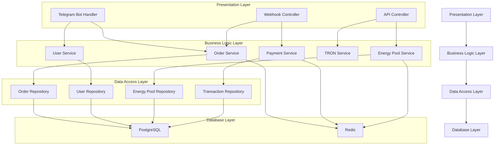
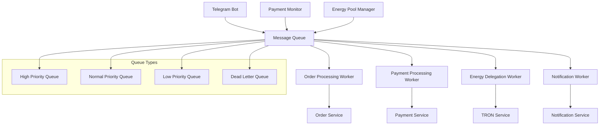

# TRON能量租赁系统 - 核心模块技术架构文档

> **文档类型**: 技术架构文档  
> **创建日期**: 2024-12-19  
> **状态**: 🚨 紧急开发  
> **技术负责人**: 开发团队  

## 1. 架构设计

### 1.1 整体系统架构



### 1.2 微服务架构设计



## 2. 技术栈描述

### 2.1 核心技术栈

- **前端**: 无 (纯Telegram机器人交互)
- **后端**: Node.js + Express.js + TypeScript
- **数据库**: PostgreSQL (主数据库) + Redis (缓存和会话)
- **区块链**: TronWeb SDK + TronGrid API
- **消息队列**: Redis Pub/Sub + Bull Queue
- **监控**: 自研监控系统 + Winston日志

### 2.2 关键依赖包

```json
{
  "dependencies": {
    "express": "^4.18.2",
    "node-telegram-bot-api": "^0.64.0",
    "tronweb": "^5.3.2",
    "pg": "^8.11.3",
    "redis": "^4.6.10",
    "bull": "^4.12.2",
    "winston": "^3.11.0",
    "crypto": "^1.0.1",
    "joi": "^17.11.0",
    "jsonwebtoken": "^9.0.2"
  }
}
```

## 3. 路由定义

### 3.1 Telegram机器人路由

| 路由类型 | 路径/命令 | 功能描述 |
|----------|-----------|----------|
| Webhook | /webhook/telegram | 接收Telegram消息 |
| Command | /start | 机器人启动和用户注册 |
| Command | /menu | 显示主菜单 |
| Command | /help | 帮助信息 |
| Command | /balance | 查询余额 |
| Command | /orders | 订单历史 |
| Callback | energy_package_* | 能量包选择回调 |
| Callback | confirm_order_* | 订单确认回调 |
| Callback | check_payment_* | 支付状态检查 |

### 3.2 内部API路由

| 路由 | 方法 | 功能描述 |
|------|------|----------|
| /api/orders | POST | 创建订单 |
| /api/orders/:id | GET | 获取订单详情 |
| /api/orders/:id/payment | POST | 处理支付 |
| /api/energy-pools | GET | 获取能量池状态 |
| /api/energy-pools/allocate | POST | 分配能量池 |
| /api/tron/delegate | POST | 执行能量委托 |
| /api/tron/balance/:address | GET | 查询地址余额 |
| /api/payments/monitor | POST | 启动支付监控 |

## 4. API定义

### 4.1 Telegram机器人API

#### 用户注册
```typescript
interface TelegramUser {
  id: number;
  username?: string;
  first_name: string;
  last_name?: string;
  language_code?: string;
}

interface UserRegistration {
  telegram_id: number;
  username?: string;
  first_name: string;
  created_at: Date;
}
```

#### 订单创建
```typescript
interface OrderRequest {
  user_id: string;
  energy_package_id: string;
  quantity: number;
  recipient_address: string;
}

interface OrderResponse {
  order_id: string;
  total_amount: number;
  payment_address: string;
  expires_at: Date;
}
```

### 4.2 TRON区块链API

#### 能量委托
```typescript
interface DelegateEnergyRequest {
  from_address: string;
  to_address: string;
  amount: number;
  private_key: string;
}

interface DelegateEnergyResponse {
  transaction_id: string;
  status: 'pending' | 'confirmed' | 'failed';
  block_number?: number;
  energy_delegated: number;
}
```

#### 余额查询
```typescript
interface BalanceQuery {
  address: string;
}

interface BalanceResponse {
  trx_balance: number;
  energy: number;
  bandwidth: number;
  delegated_energy: number;
}
```

### 4.3 能量池管理API

#### 池状态查询
```typescript
interface EnergyPoolStatus {
  pool_id: string;
  name: string;
  total_energy: number;
  available_energy: number;
  reserved_energy: number;
  utilization_rate: number;
  status: 'active' | 'inactive' | 'maintenance';
}
```

#### 能量分配
```typescript
interface EnergyAllocationRequest {
  required_energy: number;
  recipient_address: string;
  priority: 'low' | 'normal' | 'high';
}

interface EnergyAllocationResponse {
  allocated_pools: {
    pool_id: string;
    allocated_energy: number;
    estimated_cost: number;
  }[];
  total_cost: number;
  estimated_completion_time: Date;
}
```

### 4.4 支付监控API

#### 支付监控启动
```typescript
interface PaymentMonitorRequest {
  order_id: string;
  payment_address: string;
  expected_amount: number;
  timeout_minutes: number;
}

interface PaymentMonitorResponse {
  monitor_id: string;
  status: 'monitoring' | 'completed' | 'timeout';
  confirmed_amount?: number;
  transaction_hash?: string;
}
```

## 5. 服务器架构图

### 5.1 服务分层架构



### 5.2 消息队列架构



## 6. 数据模型

### 6.1 数据模型定义

```mermaid
erDiagram
    users ||--o{ orders : places
    users ||--o{ agents : becomes
    users ||--o{ agent_applications : applies
    users ||--o{ bot_users : uses
    orders ||--o{ energy_transactions : generates
    orders ||--o{ agent_earnings : earns
    energy_pools ||--o{ energy_transactions : provides
    energy_packages ||--o{ orders : selected
    bots ||--o{ bot_users : serves
    bots ||--o{ orders : processes
    bots ||--o{ price_configs : configures
    agents ||--o{ agent_earnings : receives
    agents ||--o{ agents : manages
    price_configs ||--o{ price_history : tracks
    price_templates ||--o{ price_configs : templates
    system_configs ||--o{ system_config_history : tracks
    
    users {
        uuid id PK
        bigint telegram_id UK
        varchar username
        varchar email UK
        varchar phone
        varchar role
        varchar status
        varchar tron_address
        numeric balance
        integer total_orders
        numeric total_spent
        bigint total_energy_used
        varchar referral_code UK
        uuid referred_by FK
        varchar login_type
        numeric usdt_balance
        numeric trx_balance
        timestamp created_at
        timestamp updated_at
    }
    
    orders {
        uuid id PK
        uuid user_id FK
        uuid bot_id FK
        uuid package_id FK
        varchar order_number UK
        varchar order_type
        varchar currency
        varchar payment_status
        varchar status
        bigint energy_amount
        integer duration_hours
        numeric price
        numeric original_price
        numeric discount_amount
        numeric final_price
        varchar payment_method
        varchar transaction_id
        varchar tron_tx_hash
        varchar delegate_tx_hash
        varchar target_address
        timestamp expires_at
        timestamp completed_at
        timestamp created_at
        timestamp updated_at
    }
    
    energy_pools {
        uuid id PK
        varchar name
        varchar tron_address UK
        text private_key_encrypted
        bigint total_energy
        bigint available_energy
        bigint delegated_energy
        numeric trx_balance
        varchar status
        integer priority
        numeric cost_per_energy
        bigint max_delegation_amount
        bigint min_delegation_amount
        bigint daily_limit
        bigint used_today
        timestamp last_used_at
        timestamp created_at
        timestamp updated_at
    }
    
    bots {
        uuid id PK
        varchar name
        varchar token UK
        varchar username UK
        text description
        varchar status
        varchar webhook_url
        varchar webhook_secret
        jsonb settings
        jsonb commands
        text welcome_message
        text help_message
        text error_message
        boolean maintenance_mode
        integer rate_limit
        integer max_users
        integer current_users
        bigint total_messages
        timestamp last_message_at
        timestamp created_at
        timestamp updated_at
    }
    
    agents {
        uuid id PK
        uuid user_id FK UK
        varchar agent_code UK
        integer level
        numeric commission_rate
        uuid parent_agent_id FK
        varchar status
        uuid approved_by FK
        timestamp approved_at
        integer total_referrals
        numeric total_earnings
        numeric available_balance
        numeric withdrawn_amount
        timestamp last_settlement_at
        timestamp created_at
        timestamp updated_at
    }
    
    agent_applications {
        uuid id PK
        uuid user_id FK
        varchar application_type
        jsonb business_info
        jsonb contact_info
        text experience
        numeric expected_volume
        varchar status
        uuid reviewed_by FK
        timestamp reviewed_at
        text review_notes
        timestamp created_at
        timestamp updated_at
    }
    
    agent_earnings {
        uuid id PK
        uuid agent_id FK
        uuid order_id FK
        varchar earning_type
        numeric amount
        numeric commission_rate
        numeric base_amount
        varchar currency
        varchar status
        timestamp settled_at
        varchar settlement_tx_id
        timestamp created_at
        timestamp updated_at
    }
    
    bot_users {
        uuid id PK
        uuid user_id FK
        uuid bot_id FK
        bigint telegram_chat_id
        varchar status
        timestamp first_interaction_at
        timestamp last_interaction_at
        integer total_messages
        jsonb preferences
        timestamp created_at
        timestamp updated_at
    }
    
    energy_packages {
        uuid id PK
        varchar name
        text description
        bigint energy_amount
        integer duration_hours
        numeric base_price
        varchar currency
        bigint min_order_amount
        bigint max_order_amount
        boolean is_active
        integer sort_order
        jsonb tags
        timestamp created_at
        timestamp updated_at
    }
    
    energy_transactions {
        uuid id PK
        uuid order_id FK
        uuid pool_id FK
        varchar transaction_type
        varchar from_address
        varchar to_address
        bigint energy_amount
        integer duration_hours
        varchar tx_hash
        bigint block_number
        timestamp block_timestamp
        bigint gas_used
        varchar status
        text error_message
        integer retry_count
        timestamp expires_at
        timestamp created_at
        timestamp updated_at
    }
    
    price_configs {
        uuid id PK
        uuid bot_id FK
        uuid package_id FK
        varchar config_name
        numeric base_price
        numeric markup_percentage
        numeric markup_fixed
        numeric min_price
        numeric max_price
        varchar currency
        boolean is_active
        integer priority
        jsonb conditions
        timestamp created_at
        timestamp updated_at
    }
    
    price_history {
        uuid id PK
        uuid config_id FK
        varchar change_type
        jsonb old_value
        jsonb new_value
        uuid changed_by FK
        text change_reason
        timestamp created_at
    }
    
    price_templates {
        uuid id PK
        varchar name
        text description
        varchar template_type
        jsonb config_data
        boolean is_system
        boolean is_active
        integer usage_count
        uuid created_by FK
        timestamp created_at
        timestamp updated_at
    }
    
    system_configs {
        uuid id PK
        varchar config_key UK
        text config_value
        varchar config_type
        varchar category
        text description
        boolean is_encrypted
        boolean is_public
        text validation_rule
        text default_value
        timestamp created_at
        timestamp updated_at
    }
    
    system_config_history {
        uuid id PK
        uuid config_id FK
        text old_value
        text new_value
        uuid changed_by FK
        text change_reason
        timestamp created_at
    }
    
    schema_migrations {
        varchar version PK
        boolean dirty
    }
```

### 6.2 数据定义语言

#### 用户信息表
```sql
-- 用户信息表
CREATE TABLE users (
    id UUID PRIMARY KEY DEFAULT gen_random_uuid(),
    telegram_id BIGINT UNIQUE,
    username VARCHAR(50),
    email VARCHAR(100) UNIQUE,
    phone VARCHAR(20),
    role VARCHAR(20) NOT NULL DEFAULT 'user',
    status VARCHAR(20) NOT NULL DEFAULT 'active',
    tron_address VARCHAR(50),
    balance NUMERIC(20,8) NOT NULL DEFAULT 0.00000000,
    total_orders INTEGER NOT NULL DEFAULT 0,
    total_spent NUMERIC(20,8) NOT NULL DEFAULT 0.00000000,
    total_energy_used BIGINT DEFAULT 0,
    referral_code VARCHAR(50) UNIQUE,
    referred_by UUID REFERENCES users(id),
    created_at TIMESTAMP WITH TIME ZONE DEFAULT CURRENT_TIMESTAMP,
    updated_at TIMESTAMP WITH TIME ZONE DEFAULT CURRENT_TIMESTAMP,
    password_hash VARCHAR(255),
    login_type VARCHAR(20) DEFAULT 'telegram',
    last_login_at TIMESTAMP,
    password_reset_token VARCHAR(255),
    password_reset_expires TIMESTAMP,
    usdt_balance NUMERIC(20,8) NOT NULL DEFAULT 0.00000000,
    trx_balance NUMERIC(20,8) NOT NULL DEFAULT 0.00000000
);

-- 创建索引
CREATE INDEX idx_users_email ON users(email);
CREATE INDEX idx_users_telegram_id ON users(telegram_id);
CREATE INDEX idx_users_role ON users(role);
CREATE INDEX idx_users_status ON users(status);
CREATE INDEX idx_users_login_type ON users(login_type);
CREATE INDEX idx_users_referral_code ON users(referral_code);
CREATE INDEX idx_users_usdt_balance ON users(usdt_balance);
CREATE INDEX idx_users_trx_balance ON users(trx_balance);
CREATE INDEX idx_users_password_reset_token ON users(password_reset_token) WHERE password_reset_token IS NOT NULL;
```

#### 订单信息表
```sql
-- 订单信息表
CREATE TABLE orders (
    id UUID PRIMARY KEY DEFAULT gen_random_uuid(),
    user_id UUID NOT NULL REFERENCES users(id),
    bot_id UUID REFERENCES bots(id),
    package_id UUID REFERENCES energy_packages(id),
    order_number VARCHAR(50) UNIQUE NOT NULL,
    order_type VARCHAR(20) NOT NULL DEFAULT 'energy_rental',
    currency VARCHAR(10) NOT NULL DEFAULT 'USDT',
    payment_status VARCHAR(20) NOT NULL DEFAULT 'pending',
    status VARCHAR(20) NOT NULL DEFAULT 'pending',
    energy_amount BIGINT NOT NULL,
    duration_hours INTEGER NOT NULL,
    price NUMERIC(20,8) NOT NULL,
    original_price NUMERIC(20,8),
    discount_amount NUMERIC(20,8) DEFAULT 0.00000000,
    final_price NUMERIC(20,8) NOT NULL,
    payment_method VARCHAR(20),
    transaction_id VARCHAR(100),
    tron_tx_hash VARCHAR(100),
    delegate_tx_hash VARCHAR(100),
    target_address VARCHAR(50),
    expires_at TIMESTAMP WITH TIME ZONE,
    completed_at TIMESTAMP WITH TIME ZONE,
    created_at TIMESTAMP WITH TIME ZONE DEFAULT CURRENT_TIMESTAMP,
    updated_at TIMESTAMP WITH TIME ZONE DEFAULT CURRENT_TIMESTAMP,
    
    CONSTRAINT orders_energy_amount_check CHECK (energy_amount > 0),
    CONSTRAINT orders_duration_hours_check CHECK (duration_hours > 0),
    CONSTRAINT orders_price_check CHECK (price >= 0),
    CONSTRAINT orders_final_price_check CHECK (final_price >= 0)
);

-- 创建索引
CREATE INDEX idx_orders_user_id ON orders(user_id);
CREATE INDEX idx_orders_status ON orders(status);
CREATE INDEX idx_orders_payment_status ON orders(payment_status);
CREATE INDEX idx_orders_created_at ON orders(created_at);
CREATE INDEX idx_orders_order_number ON orders(order_number);
CREATE INDEX idx_orders_transaction_id ON orders(transaction_id);
CREATE INDEX idx_orders_tron_tx_hash ON orders(tron_tx_hash);
```

#### 能量池管理表
```sql
-- 能量池管理表
CREATE TABLE energy_pools (
    id UUID PRIMARY KEY DEFAULT gen_random_uuid(),
    name VARCHAR(100) NOT NULL,
    tron_address VARCHAR(50) UNIQUE NOT NULL,
    private_key_encrypted TEXT NOT NULL,
    total_energy BIGINT NOT NULL DEFAULT 0,
    available_energy BIGINT NOT NULL DEFAULT 0,
    delegated_energy BIGINT NOT NULL DEFAULT 0,
    trx_balance NUMERIC(20,8) NOT NULL DEFAULT 0.00000000,
    status VARCHAR(20) NOT NULL DEFAULT 'active',
    priority INTEGER NOT NULL DEFAULT 1,
    cost_per_energy NUMERIC(20,8) NOT NULL DEFAULT 0.00000000,
    max_delegation_amount BIGINT,
    min_delegation_amount BIGINT,
    daily_limit BIGINT,
    used_today BIGINT NOT NULL DEFAULT 0,
    last_used_at TIMESTAMP WITH TIME ZONE,
    created_at TIMESTAMP WITH TIME ZONE DEFAULT CURRENT_TIMESTAMP,
    updated_at TIMESTAMP WITH TIME ZONE DEFAULT CURRENT_TIMESTAMP,
    
    CONSTRAINT energy_pools_total_energy_check CHECK (total_energy >= 0),
    CONSTRAINT energy_pools_available_energy_check CHECK (available_energy >= 0),
    CONSTRAINT energy_pools_delegated_energy_check CHECK (delegated_energy >= 0),
    CONSTRAINT energy_pools_priority_check CHECK (priority > 0)
);

-- 创建索引
CREATE INDEX idx_energy_pools_status ON energy_pools(status);
CREATE INDEX idx_energy_pools_priority ON energy_pools(priority);
CREATE INDEX idx_energy_pools_available_energy ON energy_pools(available_energy);
```

#### 机器人配置表
```sql
-- 机器人配置表
CREATE TABLE bots (
    id UUID PRIMARY KEY DEFAULT gen_random_uuid(),
    name VARCHAR(100) NOT NULL,
    token VARCHAR(200) UNIQUE NOT NULL,
    username VARCHAR(50) UNIQUE NOT NULL,
    description TEXT,
    status VARCHAR(20) NOT NULL DEFAULT 'active',
    webhook_url VARCHAR(500),
    webhook_secret VARCHAR(100),
    settings JSONB DEFAULT '{}',
    commands JSONB DEFAULT '[]',
    welcome_message TEXT,
    help_message TEXT,
    error_message TEXT,
    maintenance_mode BOOLEAN NOT NULL DEFAULT false,
    rate_limit INTEGER NOT NULL DEFAULT 30,
    max_users INTEGER,
    current_users INTEGER NOT NULL DEFAULT 0,
    total_messages BIGINT NOT NULL DEFAULT 0,
    last_message_at TIMESTAMP WITH TIME ZONE,
    created_at TIMESTAMP WITH TIME ZONE DEFAULT CURRENT_TIMESTAMP,
    updated_at TIMESTAMP WITH TIME ZONE DEFAULT CURRENT_TIMESTAMP
);

-- 创建索引
CREATE INDEX idx_bots_status ON bots(status);
CREATE INDEX idx_bots_username ON bots(username);
```

#### 能量交易记录表
```sql
-- 能量交易记录表
CREATE TABLE energy_transactions (
    id UUID PRIMARY KEY DEFAULT gen_random_uuid(),
    order_id UUID NOT NULL REFERENCES orders(id),
    pool_id UUID NOT NULL REFERENCES energy_pools(id),
    transaction_type VARCHAR(20) NOT NULL DEFAULT 'delegate',
    from_address VARCHAR(50) NOT NULL,
    to_address VARCHAR(50) NOT NULL,
    energy_amount BIGINT NOT NULL,
    duration_hours INTEGER NOT NULL,
    tx_hash VARCHAR(100),
    block_number BIGINT,
    block_timestamp TIMESTAMP WITH TIME ZONE,
    gas_used BIGINT,
    status VARCHAR(20) NOT NULL DEFAULT 'pending',
    error_message TEXT,
    retry_count INTEGER NOT NULL DEFAULT 0,
    expires_at TIMESTAMP WITH TIME ZONE,
    created_at TIMESTAMP WITH TIME ZONE DEFAULT CURRENT_TIMESTAMP,
    updated_at TIMESTAMP WITH TIME ZONE DEFAULT CURRENT_TIMESTAMP
);

-- 创建索引
CREATE INDEX idx_energy_transactions_order_id ON energy_transactions(order_id);
CREATE INDEX idx_energy_transactions_pool_id ON energy_transactions(pool_id);
CREATE INDEX idx_energy_transactions_tx_hash ON energy_transactions(tx_hash);
CREATE INDEX idx_energy_transactions_status ON energy_transactions(status);
CREATE INDEX idx_energy_transactions_created_at ON energy_transactions(created_at);
```

#### 系统配置表
```sql
-- 系统配置表
CREATE TABLE system_configs (
    id UUID PRIMARY KEY DEFAULT gen_random_uuid(),
    config_key VARCHAR(100) UNIQUE NOT NULL,
    config_value TEXT,
    config_type VARCHAR(20) NOT NULL DEFAULT 'string',
    category VARCHAR(50) NOT NULL DEFAULT 'general',
    description TEXT,
    is_encrypted BOOLEAN NOT NULL DEFAULT false,
    is_public BOOLEAN NOT NULL DEFAULT false,
    validation_rule TEXT,
    default_value TEXT,
    created_at TIMESTAMP WITH TIME ZONE DEFAULT CURRENT_TIMESTAMP,
    updated_at TIMESTAMP WITH TIME ZONE DEFAULT CURRENT_TIMESTAMP
);

-- 创建索引
CREATE INDEX idx_system_configs_category ON system_configs(category);
CREATE INDEX idx_system_configs_config_type ON system_configs(config_type);
CREATE INDEX idx_system_configs_is_public ON system_configs(is_public);
```

## 7. 关键技术实现

### 7.1 Telegram机器人状态管理

```typescript
// 用户状态管理
class TelegramSessionManager {
  private redis: Redis;
  
  async getUserState(telegramId: number): Promise<UserState> {
    const sessionKey = `telegram:session:${telegramId}`;
    const sessionData = await this.redis.get(sessionKey);
    return sessionData ? JSON.parse(sessionData) : { state: 'idle' };
  }
  
  async updateUserState(telegramId: number, state: UserState): Promise<void> {
    const sessionKey = `telegram:session:${telegramId}`;
    await this.redis.setex(sessionKey, 3600, JSON.stringify(state));
  }
}

// 消息处理路由
class MessageRouter {
  async handleMessage(message: TelegramMessage): Promise<void> {
    const userState = await this.sessionManager.getUserState(message.from.id);
    
    switch (userState.state) {
      case 'idle':
        return this.handleIdleState(message);
      case 'selecting_package':
        return this.handlePackageSelection(message);
      case 'entering_address':
        return this.handleAddressInput(message);
      case 'confirming_order':
        return this.handleOrderConfirmation(message);
      default:
        return this.handleUnknownState(message);
    }
  }
}
```

### 7.2 TRON区块链集成

```typescript
// TronWeb配置和连接管理
class TronService {
  private tronWeb: TronWeb;
  private connectionPool: TronWeb[];
  
  constructor() {
    this.initializeTronWeb();
    this.setupConnectionPool();
  }
  
  private initializeTronWeb(): void {
    this.tronWeb = new TronWeb({
      fullHost: 'https://api.shasta.trongrid.io',
      headers: { 'TRON-PRO-API-KEY': process.env.TRON_API_KEY },
      privateKey: process.env.MASTER_PRIVATE_KEY
    });
  }
  
  async delegateEnergy(params: DelegateEnergyParams): Promise<DelegateResult> {
    try {
      const transaction = await this.tronWeb.transactionBuilder.delegateResource(
        params.amount,
        params.toAddress,
        'ENERGY',
        params.fromAddress
      );
      
      const signedTx = await this.tronWeb.trx.sign(transaction, params.privateKey);
      const result = await this.tronWeb.trx.sendRawTransaction(signedTx);
      
      return {
        transactionId: result.txid,
        status: 'pending',
        energyDelegated: params.amount
      };
    } catch (error) {
      throw new TronServiceError(`能量委托失败: ${error.message}`);
    }
  }
}
```

### 7.3 能量池管理算法

```typescript
// 能量池调度算法
class EnergyPoolScheduler {
  async allocateOptimalPools(requirement: EnergyRequirement): Promise<AllocationResult> {
    const availablePools = await this.getAvailablePools();
    const sortedPools = this.sortPoolsByCostEfficiency(availablePools);
    
    const allocation: PoolAllocation[] = [];
    let remainingEnergy = requirement.energyAmount;
    
    for (const pool of sortedPools) {
      if (remainingEnergy <= 0) break;
      
      const allocatedEnergy = Math.min(remainingEnergy, pool.availableEnergy);
      if (allocatedEnergy > 0) {
        allocation.push({
          poolId: pool.id,
          allocatedEnergy,
          estimatedCost: allocatedEnergy * pool.costPerEnergy
        });
        remainingEnergy -= allocatedEnergy;
      }
    }
    
    if (remainingEnergy > 0) {
      throw new InsufficientEnergyError('可用能量不足');
    }
    
    return {
      allocations: allocation,
      totalCost: allocation.reduce((sum, a) => sum + a.estimatedCost, 0)
    };
  }
  
  private sortPoolsByCostEfficiency(pools: EnergyPool[]): EnergyPool[] {
    return pools.sort((a, b) => {
      // 综合考虑成本、可用性和可靠性
      const scoreA = this.calculatePoolScore(a);
      const scoreB = this.calculatePoolScore(b);
      return scoreB - scoreA; // 降序排列
    });
  }
}
```

### 7.4 支付监控系统

```typescript
// 支付监控服务
class PaymentMonitorService {
  private monitoringJobs = new Map<string, NodeJS.Timeout>();
  
  async startMonitoring(params: PaymentMonitorParams): Promise<void> {
    const monitorId = `payment:${params.orderId}`;
    
    // 启动定时检查
    const intervalId = setInterval(async () => {
      await this.checkPaymentStatus(params);
    }, 30000); // 每30秒检查一次
    
    this.monitoringJobs.set(monitorId, intervalId);
    
    // 设置超时
    setTimeout(() => {
      this.handlePaymentTimeout(params.orderId);
    }, params.timeoutMinutes * 60 * 1000);
  }
  
  private async checkPaymentStatus(params: PaymentMonitorParams): Promise<void> {
    try {
      const transactions = await this.tronService.getAddressTransactions(
        params.paymentAddress
      );
      
      for (const tx of transactions) {
        if (tx.value >= params.expectedAmount && tx.confirmations >= 19) {
          await this.confirmPayment(params.orderId, tx);
          this.stopMonitoring(params.orderId);
          break;
        }
      }
    } catch (error) {
      console.error('支付检查失败:', error);
    }
  }
}
```

## 8. 部署和运维

### 8.1 Docker容器化

```dockerfile
# Dockerfile
FROM node:18-alpine

WORKDIR /app

COPY package*.json ./
RUN npm ci --only=production

COPY . .
RUN npm run build

EXPOSE 3000

CMD ["npm", "start"]
```

### 8.2 环境配置

```yaml
# docker-compose.yml
version: '3.8'

services:
  app:
    build: .
    ports:
      - "3000:3000"
    environment:
      - NODE_ENV=production
      - DATABASE_URL=postgresql://user:pass@db:5432/tron_energy
      - REDIS_URL=redis://redis:6379
      - TELEGRAM_BOT_TOKEN=${TELEGRAM_BOT_TOKEN}
      - TRON_API_KEY=${TRON_API_KEY}
    depends_on:
      - db
      - redis
  
  db:
    image: postgres:15
    environment:
      - POSTGRES_DB=tron_energy
      - POSTGRES_USER=user
      - POSTGRES_PASSWORD=pass
    volumes:
      - postgres_data:/var/lib/postgresql/data
  
  redis:
    image: redis:7-alpine
    volumes:
      - redis_data:/data

volumes:
  postgres_data:
  redis_data:
```

---

**文档维护**: 技术团队  
**更新频率**: 每次架构变更后更新  
**技术支持**: 开发团队负责人