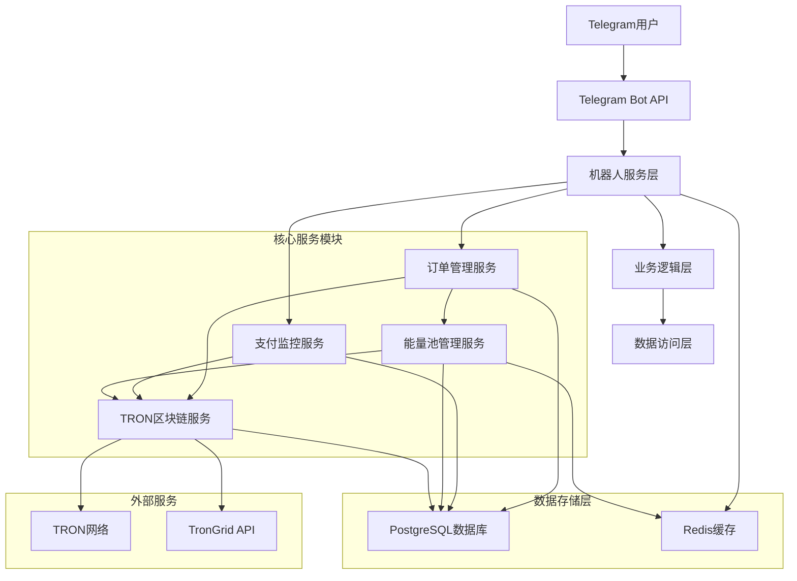
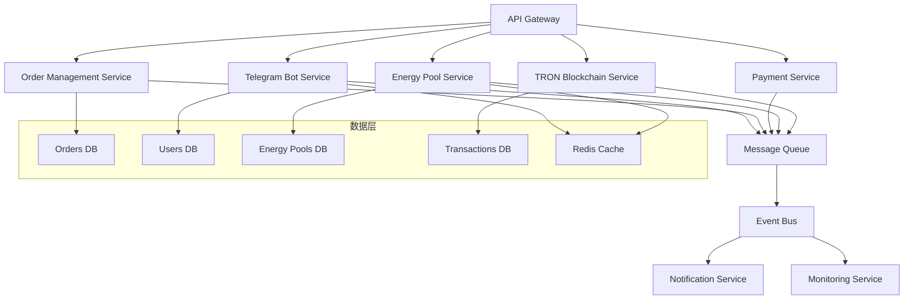
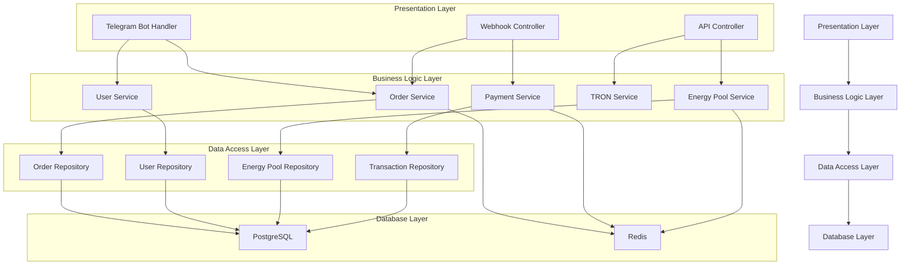
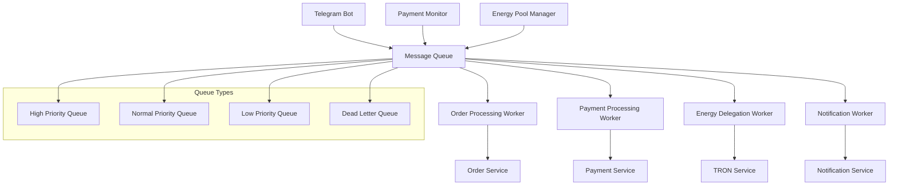
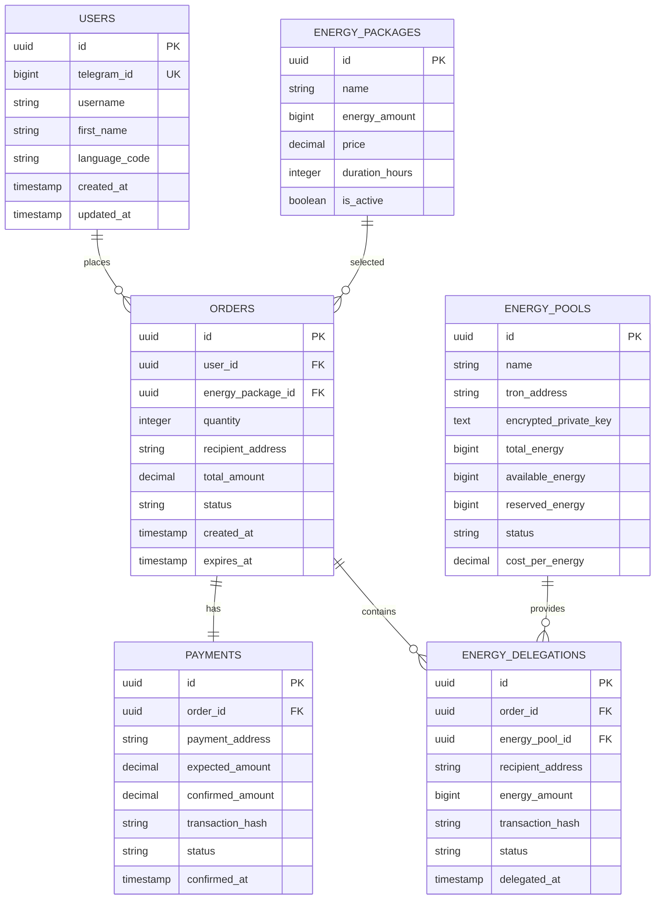

# TRON能量租赁系统 - 核心模块技术架构文档

> **文档类型**: 技术架构文档  
> **创建日期**: 2024-12-19  
> **状态**: 🚨 紧急开发  
> **技术负责人**: 开发团队  

## 1. 架构设计

### 1.1 整体系统架构



### 1.2 微服务架构设计



## 2. 技术栈描述

### 2.1 核心技术栈

- **前端**: 无 (纯Telegram机器人交互)
- **后端**: Node.js + Express.js + TypeScript
- **数据库**: PostgreSQL (主数据库) + Redis (缓存和会话)
- **区块链**: TronWeb SDK + TronGrid API
- **消息队列**: Redis Pub/Sub + Bull Queue
- **监控**: 自研监控系统 + Winston日志

### 2.2 关键依赖包

```json
{
  "dependencies": {
    "express": "^4.18.2",
    "node-telegram-bot-api": "^0.64.0",
    "tronweb": "^5.3.2",
    "pg": "^8.11.3",
    "redis": "^4.6.10",
    "bull": "^4.12.2",
    "winston": "^3.11.0",
    "crypto": "^1.0.1",
    "joi": "^17.11.0",
    "jsonwebtoken": "^9.0.2"
  }
}
```

## 3. 路由定义

### 3.1 Telegram机器人路由

| 路由类型 | 路径/命令 | 功能描述 |
|----------|-----------|----------|
| Webhook | /webhook/telegram | 接收Telegram消息 |
| Command | /start | 机器人启动和用户注册 |
| Command | /menu | 显示主菜单 |
| Command | /help | 帮助信息 |
| Command | /balance | 查询余额 |
| Command | /orders | 订单历史 |
| Callback | energy_package_* | 能量包选择回调 |
| Callback | confirm_order_* | 订单确认回调 |
| Callback | check_payment_* | 支付状态检查 |

### 3.2 内部API路由

| 路由 | 方法 | 功能描述 |
|------|------|----------|
| /api/orders | POST | 创建订单 |
| /api/orders/:id | GET | 获取订单详情 |
| /api/orders/:id/payment | POST | 处理支付 |
| /api/energy-pools | GET | 获取能量池状态 |
| /api/energy-pools/allocate | POST | 分配能量池 |
| /api/tron/delegate | POST | 执行能量委托 |
| /api/tron/balance/:address | GET | 查询地址余额 |
| /api/payments/monitor | POST | 启动支付监控 |

## 4. API定义

### 4.1 Telegram机器人API

#### 用户注册
```typescript
interface TelegramUser {
  id: number;
  username?: string;
  first_name: string;
  last_name?: string;
  language_code?: string;
}

interface UserRegistration {
  telegram_id: number;
  username?: string;
  first_name: string;
  created_at: Date;
}
```

#### 订单创建
```typescript
interface OrderRequest {
  user_id: string;
  energy_package_id: string;
  quantity: number;
  recipient_address: string;
}

interface OrderResponse {
  order_id: string;
  total_amount: number;
  payment_address: string;
  expires_at: Date;
}
```

### 4.2 TRON区块链API

#### 能量委托
```typescript
interface DelegateEnergyRequest {
  from_address: string;
  to_address: string;
  amount: number;
  private_key: string;
}

interface DelegateEnergyResponse {
  transaction_id: string;
  status: 'pending' | 'confirmed' | 'failed';
  block_number?: number;
  energy_delegated: number;
}
```

#### 余额查询
```typescript
interface BalanceQuery {
  address: string;
}

interface BalanceResponse {
  trx_balance: number;
  energy: number;
  bandwidth: number;
  delegated_energy: number;
}
```

### 4.3 能量池管理API

#### 池状态查询
```typescript
interface EnergyPoolStatus {
  pool_id: string;
  name: string;
  total_energy: number;
  available_energy: number;
  reserved_energy: number;
  utilization_rate: number;
  status: 'active' | 'inactive' | 'maintenance';
}
```

#### 能量分配
```typescript
interface EnergyAllocationRequest {
  required_energy: number;
  recipient_address: string;
  priority: 'low' | 'normal' | 'high';
}

interface EnergyAllocationResponse {
  allocated_pools: {
    pool_id: string;
    allocated_energy: number;
    estimated_cost: number;
  }[];
  total_cost: number;
  estimated_completion_time: Date;
}
```

### 4.4 支付监控API

#### 支付监控启动
```typescript
interface PaymentMonitorRequest {
  order_id: string;
  payment_address: string;
  expected_amount: number;
  timeout_minutes: number;
}

interface PaymentMonitorResponse {
  monitor_id: string;
  status: 'monitoring' | 'completed' | 'timeout';
  confirmed_amount?: number;
  transaction_hash?: string;
}
```

## 5. 服务器架构图

### 5.1 服务分层架构



### 5.2 消息队列架构



## 6. 数据模型

### 6.1 数据模型定义



### 6.2 数据定义语言

#### Telegram机器人用户会话表
```sql
-- Telegram机器人用户会话表
CREATE TABLE telegram_sessions (
    id UUID PRIMARY KEY DEFAULT gen_random_uuid(),
    telegram_id BIGINT NOT NULL,
    user_id UUID REFERENCES users(id),
    current_state VARCHAR(50) DEFAULT 'idle',
    session_data JSONB DEFAULT '{}',
    created_at TIMESTAMP WITH TIME ZONE DEFAULT NOW(),
    updated_at TIMESTAMP WITH TIME ZONE DEFAULT NOW(),
    expires_at TIMESTAMP WITH TIME ZONE DEFAULT NOW() + INTERVAL '24 hours'
);

CREATE INDEX idx_telegram_sessions_telegram_id ON telegram_sessions(telegram_id);
CREATE INDEX idx_telegram_sessions_expires_at ON telegram_sessions(expires_at);
```

#### 支付监控表
```sql
-- 支付监控表
CREATE TABLE payment_monitors (
    id UUID PRIMARY KEY DEFAULT gen_random_uuid(),
    order_id UUID NOT NULL REFERENCES orders(id),
    payment_address VARCHAR(34) NOT NULL,
    expected_amount DECIMAL(20,6) NOT NULL,
    monitor_status VARCHAR(20) DEFAULT 'monitoring',
    last_check_at TIMESTAMP WITH TIME ZONE DEFAULT NOW(),
    created_at TIMESTAMP WITH TIME ZONE DEFAULT NOW(),
    timeout_at TIMESTAMP WITH TIME ZONE NOT NULL
);

CREATE INDEX idx_payment_monitors_address ON payment_monitors(payment_address);
CREATE INDEX idx_payment_monitors_status ON payment_monitors(monitor_status);
```

#### 能量池调度日志表
```sql
-- 能量池调度日志表
CREATE TABLE energy_pool_logs (
    id UUID PRIMARY KEY DEFAULT gen_random_uuid(),
    pool_id UUID NOT NULL REFERENCES energy_pools(id),
    action VARCHAR(50) NOT NULL,
    energy_amount BIGINT,
    recipient_address VARCHAR(34),
    transaction_hash VARCHAR(64),
    status VARCHAR(20) NOT NULL,
    error_message TEXT,
    created_at TIMESTAMP WITH TIME ZONE DEFAULT NOW()
);

CREATE INDEX idx_energy_pool_logs_pool_id ON energy_pool_logs(pool_id);
CREATE INDEX idx_energy_pool_logs_created_at ON energy_pool_logs(created_at DESC);
```

#### TRON交易监控表
```sql
-- TRON交易监控表
CREATE TABLE tron_transactions (
    id UUID PRIMARY KEY DEFAULT gen_random_uuid(),
    transaction_hash VARCHAR(64) UNIQUE NOT NULL,
    from_address VARCHAR(34) NOT NULL,
    to_address VARCHAR(34) NOT NULL,
    transaction_type VARCHAR(20) NOT NULL, -- 'transfer', 'delegate', 'undelegate'
    amount DECIMAL(20,6),
    energy_amount BIGINT,
    block_number BIGINT,
    confirmation_count INTEGER DEFAULT 0,
    status VARCHAR(20) DEFAULT 'pending',
    created_at TIMESTAMP WITH TIME ZONE DEFAULT NOW(),
    confirmed_at TIMESTAMP WITH TIME ZONE
);

CREATE INDEX idx_tron_transactions_hash ON tron_transactions(transaction_hash);
CREATE INDEX idx_tron_transactions_status ON tron_transactions(status);
CREATE INDEX idx_tron_transactions_addresses ON tron_transactions(from_address, to_address);
```

#### 系统配置表
```sql
-- 系统配置表
CREATE TABLE system_configs (
    id UUID PRIMARY KEY DEFAULT gen_random_uuid(),
    config_key VARCHAR(100) UNIQUE NOT NULL,
    config_value TEXT NOT NULL,
    config_type VARCHAR(20) DEFAULT 'string', -- 'string', 'number', 'boolean', 'json'
    description TEXT,
    is_encrypted BOOLEAN DEFAULT FALSE,
    created_at TIMESTAMP WITH TIME ZONE DEFAULT NOW(),
    updated_at TIMESTAMP WITH TIME ZONE DEFAULT NOW()
);

-- 初始化系统配置
INSERT INTO system_configs (config_key, config_value, config_type, description) VALUES
('tron.network', 'shasta', 'string', 'TRON网络类型'),
('tron.api_key', '', 'string', 'TronGrid API密钥'),
('telegram.bot_token', '', 'string', 'Telegram机器人Token'),
('payment.confirmation_blocks', '19', 'number', '支付确认所需区块数'),
('energy.min_delegation_amount', '1000', 'number', '最小能量委托数量'),
('pool.health_check_interval', '300', 'number', '能量池健康检查间隔(秒)'),
('order.timeout_minutes', '30', 'number', '订单超时时间(分钟)');
```

## 7. 关键技术实现

### 7.1 Telegram机器人状态管理

```typescript
// 用户状态管理
class TelegramSessionManager {
  private redis: Redis;
  
  async getUserState(telegramId: number): Promise<UserState> {
    const sessionKey = `telegram:session:${telegramId}`;
    const sessionData = await this.redis.get(sessionKey);
    return sessionData ? JSON.parse(sessionData) : { state: 'idle' };
  }
  
  async updateUserState(telegramId: number, state: UserState): Promise<void> {
    const sessionKey = `telegram:session:${telegramId}`;
    await this.redis.setex(sessionKey, 3600, JSON.stringify(state));
  }
}

// 消息处理路由
class MessageRouter {
  async handleMessage(message: TelegramMessage): Promise<void> {
    const userState = await this.sessionManager.getUserState(message.from.id);
    
    switch (userState.state) {
      case 'idle':
        return this.handleIdleState(message);
      case 'selecting_package':
        return this.handlePackageSelection(message);
      case 'entering_address':
        return this.handleAddressInput(message);
      case 'confirming_order':
        return this.handleOrderConfirmation(message);
      default:
        return this.handleUnknownState(message);
    }
  }
}
```

### 7.2 TRON区块链集成

```typescript
// TronWeb配置和连接管理
class TronService {
  private tronWeb: TronWeb;
  private connectionPool: TronWeb[];
  
  constructor() {
    this.initializeTronWeb();
    this.setupConnectionPool();
  }
  
  private initializeTronWeb(): void {
    this.tronWeb = new TronWeb({
      fullHost: 'https://api.shasta.trongrid.io',
      headers: { 'TRON-PRO-API-KEY': process.env.TRON_API_KEY },
      privateKey: process.env.MASTER_PRIVATE_KEY
    });
  }
  
  async delegateEnergy(params: DelegateEnergyParams): Promise<DelegateResult> {
    try {
      const transaction = await this.tronWeb.transactionBuilder.delegateResource(
        params.amount,
        params.toAddress,
        'ENERGY',
        params.fromAddress
      );
      
      const signedTx = await this.tronWeb.trx.sign(transaction, params.privateKey);
      const result = await this.tronWeb.trx.sendRawTransaction(signedTx);
      
      return {
        transactionId: result.txid,
        status: 'pending',
        energyDelegated: params.amount
      };
    } catch (error) {
      throw new TronServiceError(`能量委托失败: ${error.message}`);
    }
  }
}
```

### 7.3 能量池管理算法

```typescript
// 能量池调度算法
class EnergyPoolScheduler {
  async allocateOptimalPools(requirement: EnergyRequirement): Promise<AllocationResult> {
    const availablePools = await this.getAvailablePools();
    const sortedPools = this.sortPoolsByCostEfficiency(availablePools);
    
    const allocation: PoolAllocation[] = [];
    let remainingEnergy = requirement.energyAmount;
    
    for (const pool of sortedPools) {
      if (remainingEnergy <= 0) break;
      
      const allocatedEnergy = Math.min(remainingEnergy, pool.availableEnergy);
      if (allocatedEnergy > 0) {
        allocation.push({
          poolId: pool.id,
          allocatedEnergy,
          estimatedCost: allocatedEnergy * pool.costPerEnergy
        });
        remainingEnergy -= allocatedEnergy;
      }
    }
    
    if (remainingEnergy > 0) {
      throw new InsufficientEnergyError('可用能量不足');
    }
    
    return {
      allocations: allocation,
      totalCost: allocation.reduce((sum, a) => sum + a.estimatedCost, 0)
    };
  }
  
  private sortPoolsByCostEfficiency(pools: EnergyPool[]): EnergyPool[] {
    return pools.sort((a, b) => {
      // 综合考虑成本、可用性和可靠性
      const scoreA = this.calculatePoolScore(a);
      const scoreB = this.calculatePoolScore(b);
      return scoreB - scoreA; // 降序排列
    });
  }
}
```

### 7.4 支付监控系统

```typescript
// 支付监控服务
class PaymentMonitorService {
  private monitoringJobs = new Map<string, NodeJS.Timeout>();
  
  async startMonitoring(params: PaymentMonitorParams): Promise<void> {
    const monitorId = `payment:${params.orderId}`;
    
    // 启动定时检查
    const intervalId = setInterval(async () => {
      await this.checkPaymentStatus(params);
    }, 30000); // 每30秒检查一次
    
    this.monitoringJobs.set(monitorId, intervalId);
    
    // 设置超时
    setTimeout(() => {
      this.handlePaymentTimeout(params.orderId);
    }, params.timeoutMinutes * 60 * 1000);
  }
  
  private async checkPaymentStatus(params: PaymentMonitorParams): Promise<void> {
    try {
      const transactions = await this.tronService.getAddressTransactions(
        params.paymentAddress
      );
      
      for (const tx of transactions) {
        if (tx.value >= params.expectedAmount && tx.confirmations >= 19) {
          await this.confirmPayment(params.orderId, tx);
          this.stopMonitoring(params.orderId);
          break;
        }
      }
    } catch (error) {
      console.error('支付检查失败:', error);
    }
  }
}
```

## 8. 部署和运维

### 8.1 Docker容器化

```dockerfile
# Dockerfile
FROM node:18-alpine

WORKDIR /app

COPY package*.json ./
RUN npm ci --only=production

COPY . .
RUN npm run build

EXPOSE 3000

CMD ["npm", "start"]
```

### 8.2 环境配置

```yaml
# docker-compose.yml
version: '3.8'

services:
  app:
    build: .
    ports:
      - "3000:3000"
    environment:
      - NODE_ENV=production
      - DATABASE_URL=postgresql://user:pass@db:5432/tron_energy
      - REDIS_URL=redis://redis:6379
      - TELEGRAM_BOT_TOKEN=${TELEGRAM_BOT_TOKEN}
      - TRON_API_KEY=${TRON_API_KEY}
    depends_on:
      - db
      - redis
  
  db:
    image: postgres:15
    environment:
      - POSTGRES_DB=tron_energy
      - POSTGRES_USER=user
      - POSTGRES_PASSWORD=pass
    volumes:
      - postgres_data:/var/lib/postgresql/data
  
  redis:
    image: redis:7-alpine
    volumes:
      - redis_data:/data

volumes:
  postgres_data:
  redis_data:
```

---

**文档维护**: 技术团队  
**更新频率**: 每次架构变更后更新  
**技术支持**: 开发团队负责人