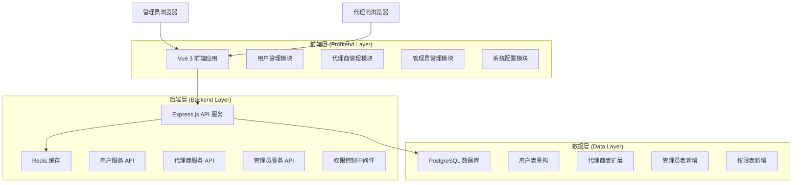
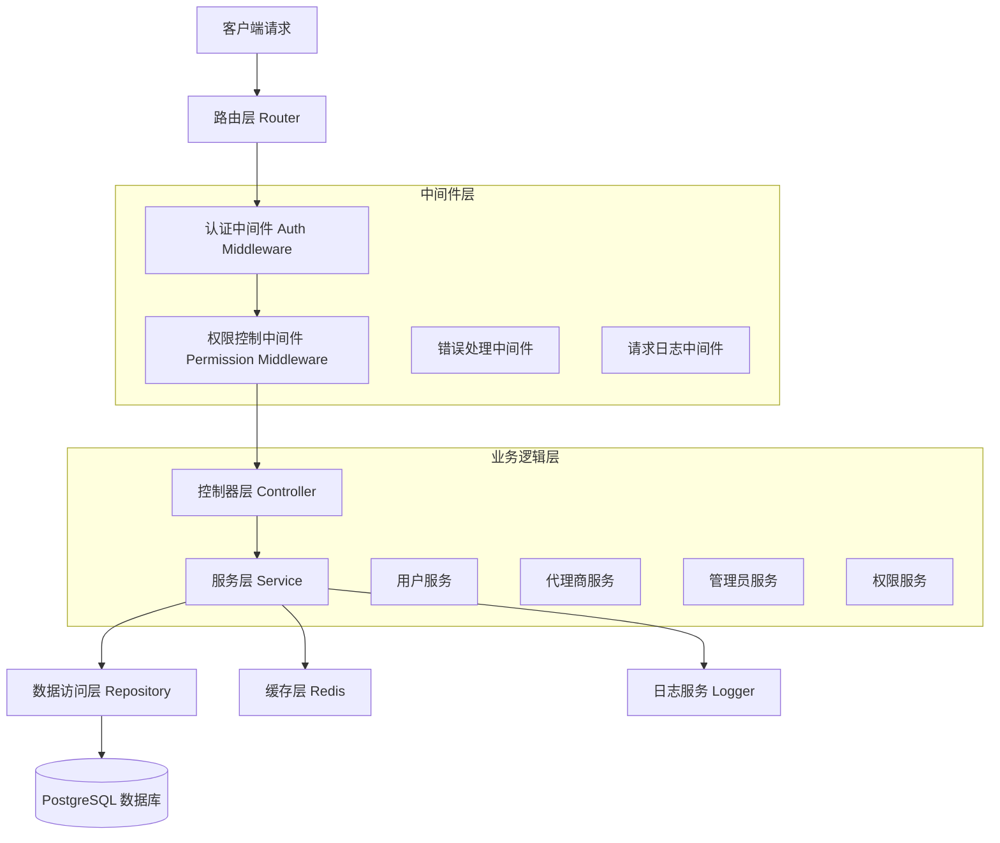
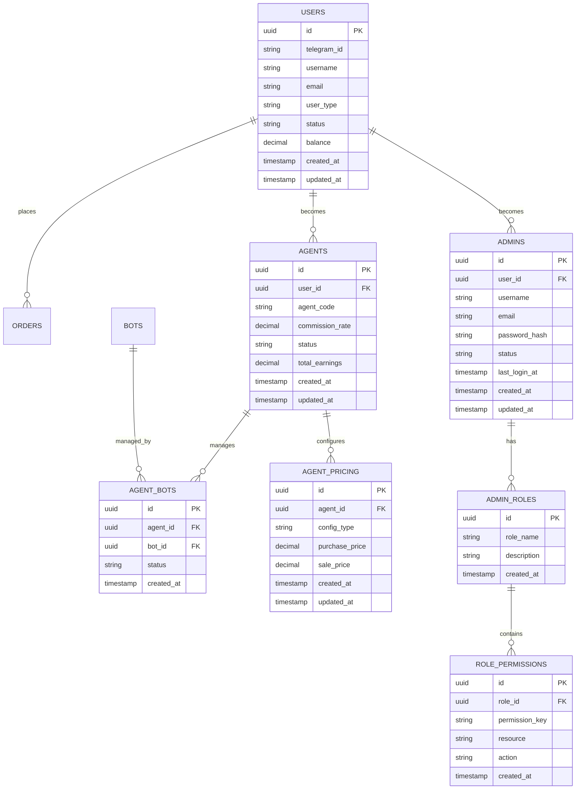

# 用户管理系统重构技术架构文档

## 1. Architecture design



## 2. Technology Description

- Frontend: Vue@3 + TypeScript + Vite + TailwindCSS + Lucide Icons
- Backend: Express@4 + TypeScript + bcryptjs + jsonwebtoken
- Database: PostgreSQL (本地数据库，参考.env配置)
- Cache: Redis (用于会话管理和权限缓存)
- Authentication: JWT Token + Role-based Access Control

## 3. Route definitions

| Route | Purpose |
|-------|----------|
| /users | 用户管理页面，管理普通用户、套餐用户、VIP用户 |
| /agents | 代理商管理页面，管理代理商信息和配置 |
| /admins | 管理员管理页面，管理管理员账户和权限 |
| /system-config | 系统配置页面，全局设置和数据迁移工具 |
| /login | 登录页面，支持管理员和代理商登录 |
| /dashboard | 仪表板页面，根据角色显示不同内容 |

## 4. API definitions

### 4.1 用户管理 API

**获取用户列表**
```
GET /api/users
```

Request:
| Param Name | Param Type | isRequired | Description |
|------------|------------|------------|-------------|
| page | number | false | 页码，默认1 |
| limit | number | false | 每页数量，默认20 |
| status | string | false | 用户状态筛选 |
| user_type | string | false | 用户类型筛选 |
| search | string | false | 搜索关键词 |

Response:
| Param Name | Param Type | Description |
|------------|------------|-------------|
| success | boolean | 请求是否成功 |
| data | object | 用户列表数据 |
| pagination | object | 分页信息 |

**更新用户等级**
```
PUT /api/users/:id/level
```

Request:
| Param Name | Param Type | isRequired | Description |
|------------|------------|------------|-------------|
| user_type | string | true | 新的用户类型 (normal/package/vip) |
| reason | string | false | 变更原因 |

Response:
| Param Name | Param Type | Description |
|------------|------------|-------------|
| success | boolean | 操作是否成功 |
| message | string | 操作结果消息 |

### 4.2 代理商管理 API

**获取代理商列表**
```
GET /api/agents
```

**创建代理商**
```
POST /api/agents
```

Request:
| Param Name | Param Type | isRequired | Description |
|------------|------------|------------|-------------|
| user_id | string | true | 关联的用户ID |
| agent_code | string | true | 代理商代码 |
| commission_rate | number | true | 佣金比例 |
| purchase_price_config | object | true | 采购价格配置 |

**配置代理商机器人关联**
```
PUT /api/agents/:id/bots
```

Request:
| Param Name | Param Type | isRequired | Description |
|------------|------------|------------|-------------|
| bot_ids | array | true | 关联的机器人ID列表 |
| pricing_config | object | true | 价格配置 |

### 4.3 管理员管理 API

**获取管理员列表**
```
GET /api/admins
```

**创建管理员**
```
POST /api/admins
```

Request:
| Param Name | Param Type | isRequired | Description |
|------------|------------|------------|-------------|
| username | string | true | 管理员用户名 |
| email | string | true | 邮箱地址 |
| password | string | true | 密码 |
| role_id | string | true | 角色ID |
| permissions | array | false | 额外权限列表 |

**配置管理员权限**
```
PUT /api/admins/:id/permissions
```

Request:
| Param Name | Param Type | isRequired | Description |
|------------|------------|------------|-------------|
| role_id | string | false | 角色ID |
| permissions | array | true | 权限列表 |

## 5. Server architecture diagram



## 6. Data model

### 6.1 Data model definition



### 6.2 Data Definition Language

**用户表重构 (users)**
```sql
-- 修改用户表，调整role字段为user_type
ALTER TABLE users RENAME COLUMN role TO user_type;

-- 更新用户类型枚举值
ALTER TABLE users ALTER COLUMN user_type TYPE VARCHAR(20);
ALTER TABLE users ADD CONSTRAINT check_user_type 
    CHECK (user_type IN ('normal', 'package', 'vip'));

-- 添加用户等级变更日志表
CREATE TABLE user_level_changes (
    id UUID PRIMARY KEY DEFAULT gen_random_uuid(),
    user_id UUID NOT NULL REFERENCES users(id),
    old_type VARCHAR(20),
    new_type VARCHAR(20) NOT NULL,
    reason TEXT,
    changed_by UUID REFERENCES users(id),
    created_at TIMESTAMP WITH TIME ZONE DEFAULT NOW()
);

COMMENT ON TABLE user_level_changes IS '用户等级变更记录表';
COMMENT ON COLUMN user_level_changes.old_type IS '原用户类型';
COMMENT ON COLUMN user_level_changes.new_type IS '新用户类型';
COMMENT ON COLUMN user_level_changes.reason IS '变更原因';
COMMENT ON COLUMN user_level_changes.changed_by IS '操作人ID';
```

**管理员表新增 (admins)**
```sql
-- 创建管理员表
CREATE TABLE admins (
    id UUID PRIMARY KEY DEFAULT gen_random_uuid(),
    user_id UUID REFERENCES users(id),
    username VARCHAR(50) UNIQUE NOT NULL,
    email VARCHAR(255) UNIQUE NOT NULL,
    password_hash VARCHAR(255) NOT NULL,
    status VARCHAR(20) DEFAULT 'active' CHECK (status IN ('active', 'inactive', 'suspended')),
    last_login_at TIMESTAMP WITH TIME ZONE,
    created_at TIMESTAMP WITH TIME ZONE DEFAULT NOW(),
    updated_at TIMESTAMP WITH TIME ZONE DEFAULT NOW()
);

-- 创建管理员角色表
CREATE TABLE admin_roles (
    id UUID PRIMARY KEY DEFAULT gen_random_uuid(),
    role_name VARCHAR(50) UNIQUE NOT NULL,
    description TEXT,
    is_system_role BOOLEAN DEFAULT FALSE,
    created_at TIMESTAMP WITH TIME ZONE DEFAULT NOW()
);

-- 创建角色权限表
CREATE TABLE role_permissions (
    id UUID PRIMARY KEY DEFAULT gen_random_uuid(),
    role_id UUID NOT NULL REFERENCES admin_roles(id) ON DELETE CASCADE,
    permission_key VARCHAR(100) NOT NULL,
    resource VARCHAR(50) NOT NULL,
    action VARCHAR(20) NOT NULL,
    created_at TIMESTAMP WITH TIME ZONE DEFAULT NOW(),
    UNIQUE(role_id, permission_key)
);

-- 创建管理员角色关联表
CREATE TABLE admin_role_assignments (
    id UUID PRIMARY KEY DEFAULT gen_random_uuid(),
    admin_id UUID NOT NULL REFERENCES admins(id) ON DELETE CASCADE,
    role_id UUID NOT NULL REFERENCES admin_roles(id) ON DELETE CASCADE,
    assigned_by UUID REFERENCES admins(id),
    assigned_at TIMESTAMP WITH TIME ZONE DEFAULT NOW(),
    UNIQUE(admin_id, role_id)
);

-- 插入默认角色
INSERT INTO admin_roles (role_name, description, is_system_role) VALUES
('super_admin', '超级管理员，拥有所有权限', TRUE),
('admin', '普通管理员，拥有基础管理权限', TRUE),
('operator', '操作员，拥有有限的操作权限', TRUE);
```

**代理商表扩展**
```sql
-- 创建代理商机器人关联表
CREATE TABLE agent_bots (
    id UUID PRIMARY KEY DEFAULT gen_random_uuid(),
    agent_id UUID NOT NULL REFERENCES agents(id) ON DELETE CASCADE,
    bot_id UUID NOT NULL REFERENCES bots(id) ON DELETE CASCADE,
    status VARCHAR(20) DEFAULT 'active' CHECK (status IN ('active', 'inactive')),
    created_at TIMESTAMP WITH TIME ZONE DEFAULT NOW(),
    updated_at TIMESTAMP WITH TIME ZONE DEFAULT NOW(),
    UNIQUE(agent_id, bot_id)
);

-- 创建代理商价格配置表
CREATE TABLE agent_pricing_configs (
    id UUID PRIMARY KEY DEFAULT gen_random_uuid(),
    agent_id UUID NOT NULL REFERENCES agents(id) ON DELETE CASCADE,
    config_type VARCHAR(50) NOT NULL,
    purchase_price DECIMAL(20, 6) NOT NULL,
    sale_price DECIMAL(20, 6) NOT NULL,
    min_amount INTEGER,
    max_amount INTEGER,
    is_active BOOLEAN DEFAULT TRUE,
    created_at TIMESTAMP WITH TIME ZONE DEFAULT NOW(),
    updated_at TIMESTAMP WITH TIME ZONE DEFAULT NOW()
);

-- 创建索引
CREATE INDEX idx_agent_bots_agent_id ON agent_bots(agent_id);
CREATE INDEX idx_agent_bots_bot_id ON agent_bots(bot_id);
CREATE INDEX idx_agent_pricing_agent_id ON agent_pricing_configs(agent_id);
CREATE INDEX idx_user_level_changes_user_id ON user_level_changes(user_id);
CREATE INDEX idx_admin_role_assignments_admin_id ON admin_role_assignments(admin_id);
```

**数据迁移脚本**
```sql
-- 迁移现有用户角色数据
UPDATE users SET user_type = 'normal' WHERE user_type = 'user';

-- 将现有代理商用户迁移到新的管理结构
INSERT INTO admins (user_id, username, email, password_hash, status)
SELECT id, username, email, password_hash, status
FROM users 
WHERE user_type = 'agent';

-- 将现有管理员用户迁移到新的管理结构
INSERT INTO admins (user_id, username, email, password_hash, status)
SELECT id, username, email, password_hash, status
FROM users 
WHERE user_type = 'admin';

-- 为迁移的管理员分配默认角色
INSERT INTO admin_role_assignments (admin_id, role_id)
SELECT a.id, r.id
FROM admins a
JOIN users u ON a.user_id = u.id
JOIN admin_roles r ON r.role_name = 'admin'
WHERE u.user_type = 'admin';
```