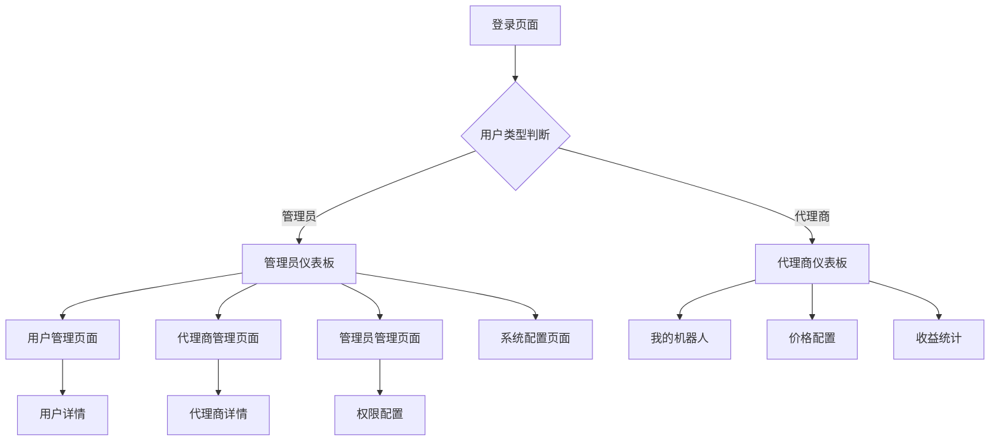

# 用户管理系统重构需求文档

## 1. Product Overview

本项目旨在重构现有的混合用户管理系统，将当前在单一用户管理模块中混合的三种角色（普通用户、代理商、管理员）拆分为三个独立的管理模块，以提升系统的可维护性、功能专业性和用户体验。

重构后的系统将解决当前角色混合导致的功能复杂性问题，为不同类型的用户提供更专业化的管理界面和功能，同时保持数据的一致性和系统的稳定性。

该重构将为平台的长期发展奠定更好的架构基础，支持未来更复杂的业务需求和用户规模扩展。

## 2. Core Features

### 2.1 User Roles

| Role | Registration Method | Core Permissions |
|------|---------------------|------------------|
| 普通用户 | Telegram机器人注册 | 使用机器人服务、查看订单、管理个人信息 |
| 套餐用户 | 通过购买套餐升级 | 普通用户权限 + 套餐特权功能 |
| VIP用户 | 达到VIP条件或购买VIP | 套餐用户权限 + VIP专属功能 |
| 代理商 | 管理员审核通过 | 管理关联机器人、设置价格、查看收益统计 |
| 管理员 | 超级管理员分配 | 管理后台各模块、分配权限、系统配置 |

### 2.2 Feature Module

重构后的系统包含以下主要页面：

1. **用户管理页面**：用户信息管理、用户等级管理、用户统计分析
2. **代理商管理页面**：代理商信息管理、机器人关联配置、价格设置管理
3. **管理员管理页面**：管理员账户管理、角色权限配置、操作日志查看
4. **系统配置页面**：全局设置、数据迁移工具、系统监控面板

### 2.3 Page Details

| Page Name | Module Name | Feature description |
|-----------|-------------|---------------------|
| 用户管理页面 | 用户信息管理 | 查看、编辑、删除用户基本信息，支持批量操作和搜索筛选 |
| 用户管理页面 | 用户等级管理 | 管理普通用户、套餐用户、VIP用户的等级转换和权限配置 |
| 用户管理页面 | 用户统计分析 | 展示用户数量统计、活跃度分析、消费行为数据 |
| 代理商管理页面 | 代理商信息管理 | 管理代理商基本信息、审核状态、业绩统计 |
| 代理商管理页面 | 机器人关联配置 | 配置代理商与Telegram机器人的关联关系和权限 |
| 代理商管理页面 | 价格设置管理 | 设置代理商采购价格和对外销售价格，支持批量配置 |
| 管理员管理页面 | 管理员账户管理 | 创建、编辑、删除管理员账户，管理登录凭证 |
| 管理员管理页面 | 角色权限配置 | 配置不同管理员角色的权限范围和功能访问控制 |
| 管理员管理页面 | 操作日志查看 | 查看管理员操作记录、系统变更日志、安全审计信息 |
| 系统配置页面 | 全局设置 | 配置系统参数、业务规则、通知设置 |
| 系统配置页面 | 数据迁移工具 | 提供数据备份、迁移、回滚功能，确保重构过程安全 |
| 系统配置页面 | 系统监控面板 | 监控系统性能、数据库状态、API调用统计 |

## 3. Core Process

### 3.1 用户管理流程

管理员可以查看所有通过Telegram机器人注册的用户，根据用户的使用情况和购买行为，将用户在普通用户、套餐用户、VIP用户之间进行等级调整。用户等级的变更会影响其在机器人中的功能权限和价格优惠。

### 3.2 代理商管理流程

超级管理员创建代理商账户后，代理商可以关联一个或多个Telegram机器人。系统为代理商分配采购价格，代理商可以设置自己的对外销售价格。代理商通过关联的机器人产生的订单会按照设定的佣金比例获得收益。

### 3.3 管理员管理流程

超级管理员可以创建不同角色的管理员，为其分配特定的权限范围。管理员登录后只能访问被授权的功能模块，所有操作都会被记录到操作日志中，确保系统的安全性和可追溯性。

## 4. User Interface Design

### 4.1 Design Style

- **主色调**：蓝色系（#3B82F6）作为主色，灰色系（#6B7280）作为辅助色
- **按钮样式**：圆角按钮设计，支持悬停和点击状态变化
- **字体**：系统默认字体，标题使用16-24px，正文使用14-16px
- **布局风格**：卡片式布局，顶部导航栏 + 侧边栏的经典后台管理布局
- **图标风格**：使用Lucide图标库，保持简洁统一的视觉风格

### 4.2 Page Design Overview

| Page Name | Module Name | UI Elements |
|-----------|-------------|-------------|
| 用户管理页面 | 用户信息管理 | 表格布局，支持排序和筛选，顶部统计卡片，右侧操作按钮 |
| 用户管理页面 | 用户等级管理 | 标签式等级显示，颜色区分不同等级，支持批量等级调整 |
| 代理商管理页面 | 机器人关联配置 | 下拉选择器关联机器人，开关控件控制状态，配置表单 |
| 代理商管理页面 | 价格设置管理 | 数字输入框设置价格，表格展示价格配置，支持批量导入 |
| 管理员管理页面 | 角色权限配置 | 树形结构展示权限，复选框选择权限，角色标签显示 |
| 系统配置页面 | 数据迁移工具 | 进度条显示迁移状态，日志窗口显示操作记录，确认对话框 |

### 4.3 Responsiveness

系统采用桌面优先的响应式设计，主要面向管理人员使用。在平板设备上保持良好的可用性，支持触摸操作优化，确保在不同屏幕尺寸下的功能完整性。