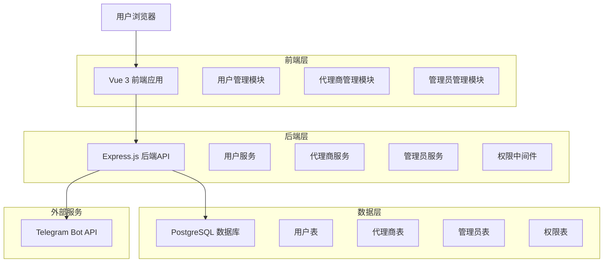
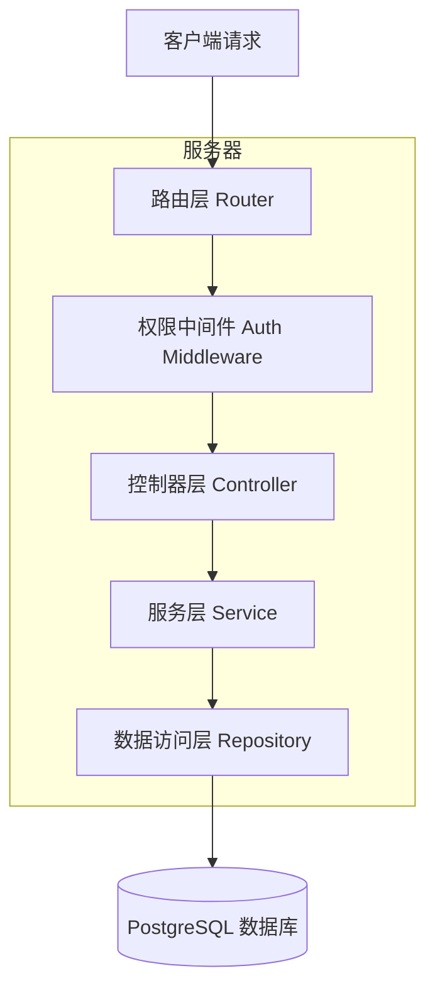
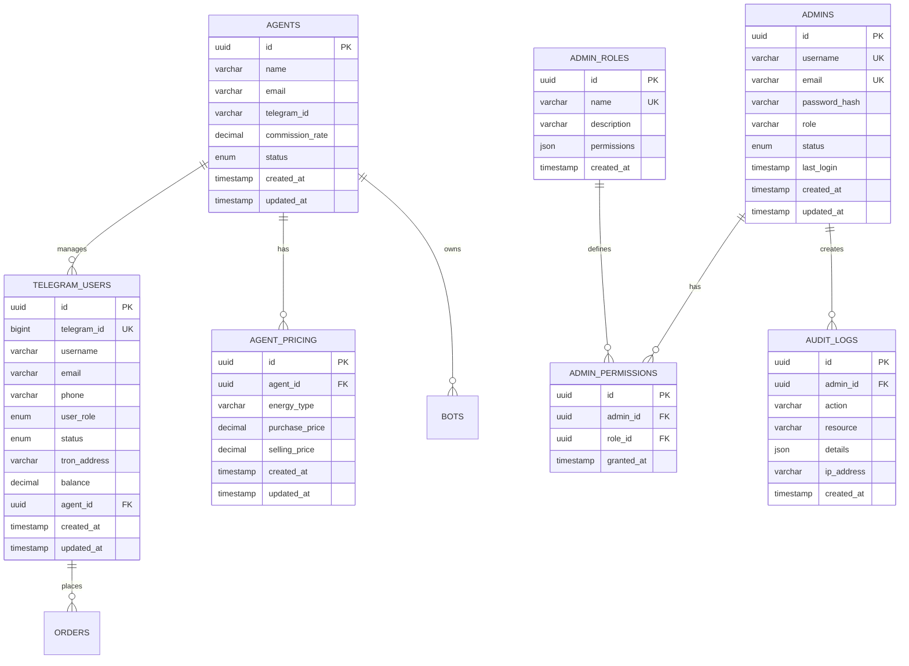

## 1.Architecture design



## 2.Technology Description

- Frontend: Vue@3 + TypeScript + Vite + TailwindCSS + Element Plus
- Backend: Express@4 + TypeScript + bcrypt + jsonwebtoken
- Database: PostgreSQL@14 (现有系统)
- External: Telegram Bot API

## 3.Route definitions

| Route | Purpose |
|-------|---------|
| /users | 用户管理页面，显示Telegram用户列表和统计信息 |
| /agents | 代理商管理页面，管理代理商申请、价格配置和机器人关联 |
| /admins | 管理员管理页面，管理后台管理员和权限配置 |
| /login | 登录页面，支持管理员和代理商登录 |

## 4.API definitions

### 4.1 用户管理 API

**获取用户列表**
```
GET /api/users
```

Query Parameters:
| Param Name | Param Type | isRequired | Description |
|------------|------------|------------|-------------|
| page | number | false | 页码，默认1 |
| limit | number | false | 每页数量，默认20 |
| role | string | false | 用户角色筛选 (normal/package/vip) |
| status | string | false | 用户状态筛选 (active/inactive) |
| search | string | false | 搜索关键词 |

Response:
| Param Name | Param Type | Description |
|------------|------------|-------------|
| users | array | 用户列表 |
| total | number | 总数量 |
| page | number | 当前页码 |
| totalPages | number | 总页数 |

**更新用户角色**
```
PUT /api/users/:id/role
```

Request:
| Param Name | Param Type | isRequired | Description |
|------------|------------|------------|-------------|
| role | string | true | 新角色 (normal/package/vip) |

Response:
| Param Name | Param Type | Description |
|------------|------------|-------------|
| success | boolean | 操作结果 |
| user | object | 更新后的用户信息 |

### 4.2 代理商管理 API

**获取代理商列表**
```
GET /api/agents
```

Response:
| Param Name | Param Type | Description |
|------------|------------|-------------|
| agents | array | 代理商列表 |
| total | number | 总数量 |

**创建代理商**
```
POST /api/agents
```

Request:
| Param Name | Param Type | isRequired | Description |
|------------|------------|------------|-------------|
| name | string | true | 代理商名称 |
| email | string | true | 邮箱地址 |
| telegram_id | string | false | Telegram ID |
| commission_rate | number | true | 佣金比例 |

**设置代理商价格**
```
PUT /api/agents/:id/pricing
```

Request:
| Param Name | Param Type | isRequired | Description |
|------------|------------|------------|-------------|
| purchase_price | number | true | 采购价格 |
| selling_price | number | true | 销售价格 |
| energy_type | string | true | 能量类型 |

### 4.3 管理员管理 API

**获取管理员列表**
```
GET /api/admins
```

Response:
| Param Name | Param Type | Description |
|------------|------------|-------------|
| admins | array | 管理员列表 |
| total | number | 总数量 |

**创建管理员**
```
POST /api/admins
```

Request:
| Param Name | Param Type | isRequired | Description |
|------------|------------|------------|-------------|
| username | string | true | 用户名 |
| email | string | true | 邮箱地址 |
| password | string | true | 密码 |
| role | string | true | 管理员角色 |
| permissions | array | true | 权限列表 |

**更新管理员权限**
```
PUT /api/admins/:id/permissions
```

Request:
| Param Name | Param Type | isRequired | Description |
|------------|------------|------------|-------------|
| permissions | array | true | 新的权限列表 |

## 5.Server architecture diagram



## 6.Data model

### 6.1 Data model definition



### 6.2 Data Definition Language

**Telegram用户表 (telegram_users)**
```sql
-- 修改现有users表，重命名为telegram_users
ALTER TABLE users RENAME TO telegram_users;

-- 修改role字段的约束
ALTER TABLE telegram_users DROP CONSTRAINT IF EXISTS users_role_check;
ALTER TABLE telegram_users ADD CONSTRAINT telegram_users_role_check 
    CHECK (role IN ('normal', 'package', 'vip'));

-- 添加agent_id字段
ALTER TABLE telegram_users ADD COLUMN agent_id UUID REFERENCES agents(id);

-- 添加索引
CREATE INDEX idx_telegram_users_agent_id ON telegram_users(agent_id);
CREATE INDEX idx_telegram_users_role ON telegram_users(role);
CREATE INDEX idx_telegram_users_status ON telegram_users(status);
```

**代理商表 (agents)**
```sql
CREATE TABLE agents (
    id UUID PRIMARY KEY DEFAULT gen_random_uuid(),
    name VARCHAR(100) NOT NULL,
    email VARCHAR(255) UNIQUE NOT NULL,
    telegram_id VARCHAR(50),
    commission_rate DECIMAL(5,4) DEFAULT 0.0000,
    status VARCHAR(20) DEFAULT 'active' CHECK (status IN ('active', 'inactive', 'pending')),
    created_at TIMESTAMP WITH TIME ZONE DEFAULT NOW(),
    updated_at TIMESTAMP WITH TIME ZONE DEFAULT NOW()
);

-- 创建索引
CREATE INDEX idx_agents_status ON agents(status);
CREATE INDEX idx_agents_email ON agents(email);
```

**代理商定价表 (agent_pricing)**
```sql
CREATE TABLE agent_pricing (
    id UUID PRIMARY KEY DEFAULT gen_random_uuid(),
    agent_id UUID NOT NULL REFERENCES agents(id) ON DELETE CASCADE,
    energy_type VARCHAR(50) NOT NULL,
    purchase_price DECIMAL(10,6) NOT NULL,
    selling_price DECIMAL(10,6) NOT NULL,
    created_at TIMESTAMP WITH TIME ZONE DEFAULT NOW(),
    updated_at TIMESTAMP WITH TIME ZONE DEFAULT NOW(),
    UNIQUE(agent_id, energy_type)
);

-- 创建索引
CREATE INDEX idx_agent_pricing_agent_id ON agent_pricing(agent_id);
CREATE INDEX idx_agent_pricing_energy_type ON agent_pricing(energy_type);
```

**管理员表 (admins)**
```sql
CREATE TABLE admins (
    id UUID PRIMARY KEY DEFAULT gen_random_uuid(),
    username VARCHAR(50) UNIQUE NOT NULL,
    email VARCHAR(255) UNIQUE NOT NULL,
    password_hash VARCHAR(255) NOT NULL,
    role VARCHAR(50) DEFAULT 'admin',
    status VARCHAR(20) DEFAULT 'active' CHECK (status IN ('active', 'inactive')),
    last_login TIMESTAMP WITH TIME ZONE,
    created_at TIMESTAMP WITH TIME ZONE DEFAULT NOW(),
    updated_at TIMESTAMP WITH TIME ZONE DEFAULT NOW()
);

-- 创建索引
CREATE INDEX idx_admins_username ON admins(username);
CREATE INDEX idx_admins_email ON admins(email);
CREATE INDEX idx_admins_status ON admins(status);
```

**管理员角色表 (admin_roles)**
```sql
CREATE TABLE admin_roles (
    id UUID PRIMARY KEY DEFAULT gen_random_uuid(),
    name VARCHAR(50) UNIQUE NOT NULL,
    description TEXT,
    permissions JSONB NOT NULL DEFAULT '[]',
    created_at TIMESTAMP WITH TIME ZONE DEFAULT NOW()
);

-- 插入默认角色
INSERT INTO admin_roles (name, description, permissions) VALUES
('super_admin', '超级管理员', '["all"]'),
('admin', '普通管理员', '["users.read", "users.write", "orders.read", "statistics.read"]'),
('operator', '运营管理员', '["users.read", "agents.read", "agents.write", "statistics.read"]'),
('customer_service', '客服管理员', '["users.read", "orders.read", "orders.write"]');
```

**管理员权限表 (admin_permissions)**
```sql
CREATE TABLE admin_permissions (
    id UUID PRIMARY KEY DEFAULT gen_random_uuid(),
    admin_id UUID NOT NULL REFERENCES admins(id) ON DELETE CASCADE,
    role_id UUID NOT NULL REFERENCES admin_roles(id) ON DELETE CASCADE,
    granted_at TIMESTAMP WITH TIME ZONE DEFAULT NOW(),
    UNIQUE(admin_id, role_id)
);

-- 创建索引
CREATE INDEX idx_admin_permissions_admin_id ON admin_permissions(admin_id);
CREATE INDEX idx_admin_permissions_role_id ON admin_permissions(role_id);
```

**审计日志表 (audit_logs)**
```sql
CREATE TABLE audit_logs (
    id UUID PRIMARY KEY DEFAULT gen_random_uuid(),
    admin_id UUID REFERENCES admins(id),
    action VARCHAR(100) NOT NULL,
    resource VARCHAR(100) NOT NULL,
    details JSONB,
    ip_address INET,
    created_at TIMESTAMP WITH TIME ZONE DEFAULT NOW()
);

-- 创建索引
CREATE INDEX idx_audit_logs_admin_id ON audit_logs(admin_id);
CREATE INDEX idx_audit_logs_action ON audit_logs(action);
CREATE INDEX idx_audit_logs_created_at ON audit_logs(created_at DESC);
```

**初始化数据**
```sql
-- 创建默认超级管理员
INSERT INTO admins (username, email, password_hash, role) VALUES
('superadmin', 'admin@tronrental.com', '$2b$10$example_hash', 'super_admin');

-- 为超级管理员分配权限
INSERT INTO admin_permissions (admin_id, role_id)
SELECT a.id, r.id
FROM admins a, admin_roles r
WHERE a.username = 'superadmin' AND r.name = 'super_admin';
```