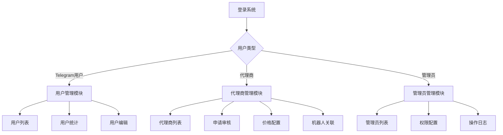

## 1. Product Overview

本项目旨在重构TRON能量租赁系统的用户角色管理架构，将当前混合的用户管理模式分离为三个独立的管理模块：用户管理、代理商管理和管理员管理。通过模块化设计提升系统的可维护性和业务逻辑清晰度。

- 解决当前用户角色混合管理导致的业务逻辑不清晰问题，实现角色职责分离和独立管理
- 为Telegram机器人用户、代理商和后台管理员提供专门的管理界面和功能模块
- 提升系统的扩展性和维护效率，为后续业务发展奠定基础

## 2. Core Features

### 2.1 User Roles

| Role | Registration Method | Core Permissions |
|------|---------------------|------------------|
| 普通用户 | Telegram机器人自动注册 | 使用机器人服务、查看订单、管理余额 |
| 套餐用户 | 购买套餐后自动升级 | 享受套餐优惠、专属客服、优先处理 |
| VIP用户 | 达到条件或手动升级 | 最高优惠、专属服务、高级功能 |
| 代理商 | 管理员审核添加 | 管理下级用户、设置价格、查看收益 |
| 管理员 | 超级管理员添加 | 系统管理、用户管理、数据统计 |

### 2.2 Feature Module

我们的用户角色管理系统重构包含以下主要页面：

1. **用户管理页面**：用户列表、用户统计、用户搜索筛选、用户详情编辑
2. **代理商管理页面**：代理商列表、代理商申请审核、价格配置、机器人关联
3. **管理员管理页面**：管理员列表、权限配置、角色管理、操作日志

### 2.3 Page Details

| Page Name | Module Name | Feature description |
|-----------|-------------|---------------------|
| 用户管理页面 | 用户列表模块 | 显示所有Telegram用户，支持按角色（普通/套餐/VIP）筛选，批量操作用户状态 |
| 用户管理页面 | 用户统计模块 | 展示用户总数、各角色分布、活跃度统计、余额统计等关键指标 |
| 用户管理页面 | 用户搜索筛选模块 | 按用户名、Telegram ID、角色、状态、注册时间等条件搜索和筛选用户 |
| 用户管理页面 | 用户详情编辑模块 | 查看和编辑用户基本信息、余额调整、角色升级、状态管理 |
| 代理商管理页面 | 代理商列表模块 | 显示所有代理商信息，包括关联机器人、收益统计、客户数量等 |
| 代理商管理页面 | 代理商申请审核模块 | 处理代理商申请，审核资质，设置初始权限和佣金比例 |
| 代理商管理页面 | 价格配置模块 | 为代理商设置采购价格和对外销售价格，支持不同能量类型定价 |
| 代理商管理页面 | 机器人关联模块 | 将代理商与特定Telegram机器人关联，实现独立核算和管理 |
| 管理员管理页面 | 管理员列表模块 | 显示所有后台管理员，包括权限级别、最后登录时间、操作统计 |
| 管理员管理页面 | 权限配置模块 | 设置管理员的功能权限，支持细粒度权限控制 |
| 管理员管理页面 | 角色管理模块 | 定义不同管理员角色（超级管理员、运营管理员、客服管理员等） |
| 管理员管理页面 | 操作日志模块 | 记录和查看管理员的重要操作日志，确保系统安全性 |

## 3. Core Process

### 用户管理流程
1. Telegram用户通过机器人自动注册为普通用户
2. 根据消费金额或购买套餐自动升级为套餐用户或VIP用户
3. 管理员可手动调整用户角色和状态
4. 支持批量操作和用户数据导出

### 代理商管理流程
1. 潜在代理商提交申请表单
2. 管理员审核代理商资质和经验
3. 审核通过后创建代理商账户并设置初始配置
4. 代理商关联Telegram机器人并设置价格策略
5. 系统独立核算代理商的收益和客户数据

### 管理员管理流程
1. 超级管理员创建新的管理员账户
2. 分配相应的角色和权限
3. 管理员使用独立的后台登录系统
4. 系统记录所有重要操作的审计日志

## 4. User Interface Design

### 4.1 Design Style

- **主色调**：蓝色系（#3B82F6）作为主色，灰色系（#6B7280）作为辅助色
- **按钮样式**：圆角矩形按钮，支持悬停和点击状态变化
- **字体**：系统默认字体，标题使用16-24px，正文使用14px，辅助信息使用12px
- **布局风格**：卡片式布局，顶部导航栏，左侧菜单分离三个管理模块
- **图标风格**：使用Lucide图标库，简洁现代的线性图标

### 4.2 Page Design Overview

| Page Name | Module Name | UI Elements |
|-----------|-------------|-------------|
| 用户管理页面 | 用户列表模块 | 表格布局，支持排序和分页，行操作按钮，批量选择复选框 |
| 用户管理页面 | 用户统计模块 | 卡片式统计面板，数字突出显示，图表可视化 |
| 用户管理页面 | 搜索筛选模块 | 搜索输入框，下拉选择器，日期范围选择器，重置按钮 |
| 代理商管理页面 | 代理商列表模块 | 网格卡片布局，显示关键信息，快速操作按钮 |
| 代理商管理页面 | 申请审核模块 | 表单布局，申请详情展示，审核操作按钮 |
| 代理商管理页面 | 价格配置模块 | 表单输入，实时预览，保存和重置按钮 |
| 管理员管理页面 | 管理员列表模块 | 简洁表格，权限标签，状态指示器 |
| 管理员管理页面 | 权限配置模块 | 树形权限选择器，权限组管理，保存确认 |
| 管理员管理页面 | 操作日志模块 | 时间线布局，操作类型标签，详情展开 |

### 4.3 Responsiveness

系统采用桌面优先设计，支持平板和移动端自适应。在移动端，表格转换为卡片布局，操作按钮合并为下拉菜单，确保在小屏幕设备上的良好用户体验。