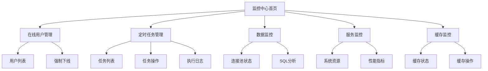

# 监控中心产品需求文档

## 1. Product Overview
监控中心是后台管理系统的核心监控模块，为系统管理员提供全方位的系统运行状态监控和管理功能。
- 解决系统运维监控需求，帮助管理员实时掌握系统运行状态，及时发现和处理系统问题。
- 目标用户为系统管理员和运维人员，提升系统运维效率和稳定性。

## 2. Core Features

### 2.1 User Roles
| Role | Registration Method | Core Permissions |
|------|---------------------|------------------|
| 系统管理员 | 超级管理员分配 | 拥有所有监控功能的查看和操作权限 |
| 运维人员 | 系统管理员分配 | 拥有监控数据查看权限，部分操作权限 |

### 2.2 Feature Module
监控中心包含以下主要页面：
1. **监控中心首页**：监控概览、快速导航、系统状态总览
2. **在线用户管理**：活跃用户列表、用户状态监控、强制退出功能
3. **定时任务管理**：任务列表、任务调度、执行日志、任务操作
4. **数据监控**：数据库连接池状态、SQL性能分析、慢查询监控
5. **服务监控**：系统资源监控、性能指标、告警信息
6. **缓存监控**：缓存状态查看、缓存操作、性能统计

### 2.3 Page Details
| Page Name | Module Name | Feature description |
|-----------|-------------|---------------------|
| 监控中心首页 | 概览面板 | 显示系统整体运行状态，包括在线用户数、任务执行状态、系统资源使用率等关键指标 |
| 监控中心首页 | 快速导航 | 提供到各个监控子模块的快速入口，支持一键跳转 |
| 在线用户管理 | 用户列表 | 实时显示当前在线的后台管理员用户，包括登录时间、IP地址、会话状态等信息 |
| 在线用户管理 | 用户操作 | 支持查看用户详情、强制用户下线、会话管理等操作 |
| 定时任务管理 | 任务列表 | 显示系统中所有定时任务，包括任务名称、执行频率、下次执行时间、状态等 |
| 定时任务管理 | 任务操作 | 支持添加、编辑、删除、启用/禁用定时任务，实时修改任务配置 |
| 定时任务管理 | 执行日志 | 显示任务执行历史记录，包括执行时间、执行结果、错误信息等 |
| 数据监控 | 连接池状态 | 监控数据库连接池的活跃连接数、空闲连接数、最大连接数等指标 |
| 数据监控 | SQL分析 | 提供慢查询分析、SQL执行统计、性能瓶颈识别功能 |
| 服务监控 | 系统资源 | 实时监控CPU使用率、内存使用情况、磁盘空间、网络状态等系统资源 |
| 服务监控 | 性能指标 | 显示系统响应时间、吞吐量、错误率等关键性能指标 |
| 缓存监控 | 缓存状态 | 显示缓存命中率、缓存大小、过期键数量等缓存运行状态 |
| 缓存监控 | 缓存操作 | 支持查看缓存内容、删除指定缓存、清空缓存等操作 |

## 3. Core Process

### 管理员监控流程
1. 管理员登录后台系统
2. 进入监控中心首页，查看系统整体状态
3. 根据需要进入具体监控模块：
   - 查看在线用户情况，必要时强制异常用户下线
   - 管理定时任务，查看执行日志，调整任务配置
   - 监控数据库性能，分析SQL执行情况
   - 查看服务器资源使用情况，识别性能瓶颈
   - 监控缓存状态，进行缓存维护操作
4. 发现异常时进行相应处理操作
5. 查看操作日志，确认处理结果

## 4. User Interface Design

### 4.1 Design Style
- **主色调**：深蓝色 (#1890ff) 作为主色，灰色 (#f0f2f5) 作为背景色
- **按钮样式**：圆角按钮，主要操作使用蓝色，危险操作使用红色 (#ff4d4f)
- **字体**：14px 作为主要字体大小，标题使用 16px-20px
- **布局风格**：卡片式布局，左侧导航 + 右侧内容区域
- **图标风格**：使用 Ant Design 图标库，简洁现代风格

### 4.2 Page Design Overview

| Page Name | Module Name | UI Elements |
|-----------|-------------|-------------|
| 监控中心首页 | 概览面板 | 使用统计卡片展示关键指标，配色为白色背景 + 蓝色数字，支持实时刷新动画 |
| 监控中心首页 | 快速导航 | 网格布局的导航卡片，每个卡片包含图标 + 标题 + 描述，悬停效果 |
| 在线用户管理 | 用户列表 | 表格形式展示，包含头像、用户名、登录时间、IP地址、状态等列，支持搜索和筛选 |
| 在线用户管理 | 用户操作 | 操作按钮组，包含查看详情（蓝色）、强制下线（红色）按钮 |
| 定时任务管理 | 任务列表 | 表格 + 状态标签，运行中显示绿色，已停止显示灰色，异常显示红色 |
| 定时任务管理 | 任务操作 | 顶部操作栏 + 行内操作按钮，支持批量操作 |
| 定时任务管理 | 执行日志 | 时间轴形式展示，成功显示绿色图标，失败显示红色图标 |
| 数据监控 | 连接池状态 | 仪表盘 + 实时图表，使用 ECharts 展示连接数变化趋势 |
| 数据监控 | SQL分析 | 表格 + 代码高亮显示SQL语句，执行时间使用颜色区分性能等级 |
| 服务监控 | 系统资源 | 多个圆形进度条显示CPU、内存、磁盘使用率，配合实时折线图 |
| 服务监控 | 性能指标 | 数字面板 + 趋势图表，关键指标突出显示 |
| 缓存监控 | 缓存状态 | 统计卡片 + 饼图显示缓存分布，命中率使用环形进度条 |
| 缓存监控 | 缓存操作 | 搜索框 + 操作按钮，支持模糊搜索缓存键名 |

### 4.3 Responsiveness
采用响应式设计，支持桌面端优先，在平板设备上自适应布局。监控图表在小屏幕上自动调整尺寸，保持数据可读性。