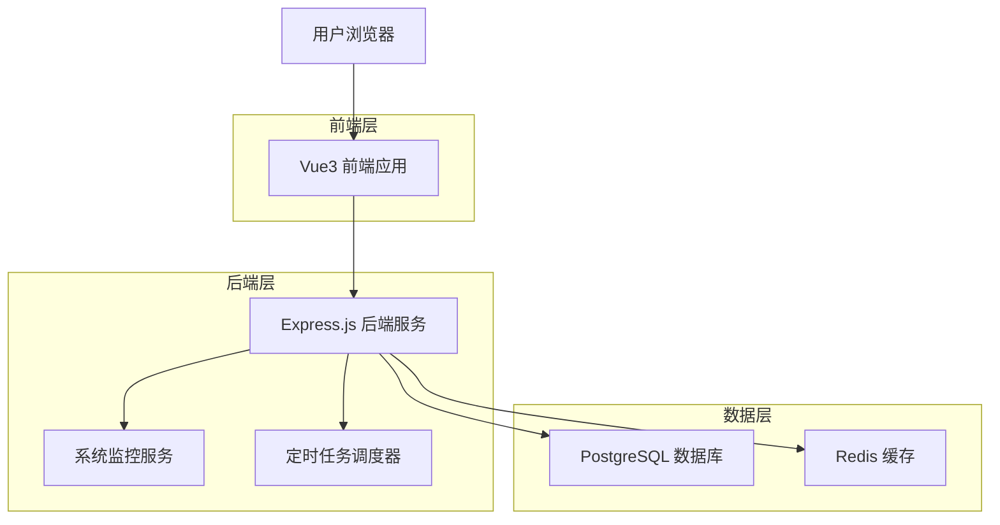
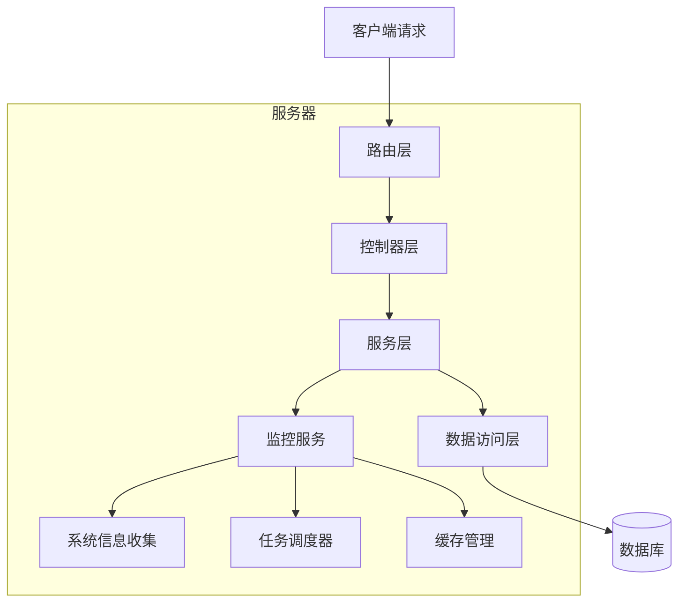
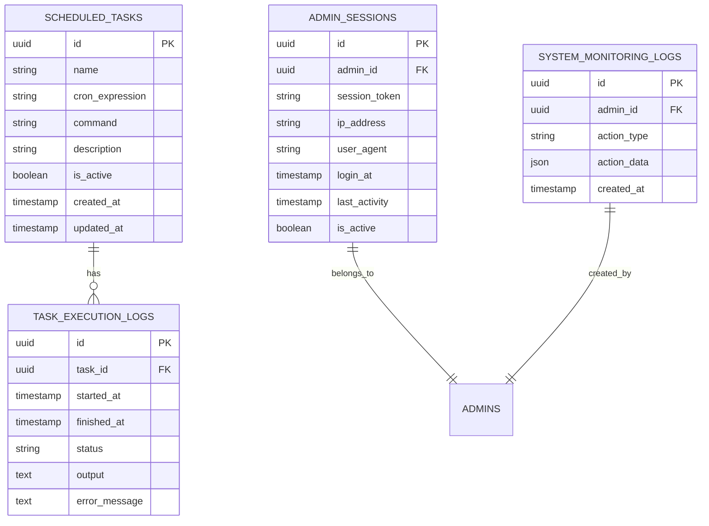

# 监控中心技术架构文档

## 1. Architecture design



## 2. Technology Description

- Frontend: Vue@3 + TypeScript + Ant Design Vue + ECharts + Vite
- Backend: Express@4 + TypeScript + node-cron + systeminformation
- Database: PostgreSQL (现有数据库)
- Cache: Redis (现有缓存)
- Monitoring: systeminformation + pg-pool + ioredis

## 3. Route definitions

| Route | Purpose |
|-------|---------|
| /monitoring | 监控中心首页，显示系统概览和快速导航 |
| /monitoring/online-users | 在线用户管理页面，显示活跃用户列表和操作功能 |
| /monitoring/scheduled-tasks | 定时任务管理页面，任务列表、操作和日志查看 |
| /monitoring/database | 数据监控页面，数据库连接池状态和SQL分析 |
| /monitoring/system | 服务监控页面，系统资源和性能指标监控 |
| /monitoring/cache | 缓存监控页面，缓存状态查看和操作管理 |

## 4. API definitions

### 4.1 Core API

#### 监控概览相关
```
GET /api/monitoring/overview
```

Response:
| Param Name | Param Type | Description |
|------------|------------|-------------|
| onlineUsers | number | 当前在线用户数 |
| activeTasks | number | 活跃定时任务数 |
| systemLoad | object | 系统负载信息 |
| cacheHitRate | number | 缓存命中率 |

Example:
```json
{
  "onlineUsers": 15,
  "activeTasks": 8,
  "systemLoad": {
    "cpu": 45.2,
    "memory": 68.5,
    "disk": 32.1
  },
  "cacheHitRate": 89.5
}
```

#### 在线用户管理
```
GET /api/monitoring/online-users
```

Response:
| Param Name | Param Type | Description |
|------------|------------|-------------|
| users | array | 在线用户列表 |
| total | number | 总用户数 |

```
POST /api/monitoring/online-users/force-logout
```

Request:
| Param Name | Param Type | isRequired | Description |
|------------|------------|------------|-------------|
| userId | string | true | 用户ID |
| reason | string | false | 强制下线原因 |

#### 定时任务管理
```
GET /api/monitoring/scheduled-tasks
```

Response:
| Param Name | Param Type | Description |
|------------|------------|-------------|
| tasks | array | 定时任务列表 |
| total | number | 任务总数 |

```
POST /api/monitoring/scheduled-tasks
```

Request:
| Param Name | Param Type | isRequired | Description |
|------------|------------|------------|-------------|
| name | string | true | 任务名称 |
| cron | string | true | Cron表达式 |
| command | string | true | 执行命令 |
| description | string | false | 任务描述 |

```
PUT /api/monitoring/scheduled-tasks/:id
```

```
DELETE /api/monitoring/scheduled-tasks/:id
```

```
GET /api/monitoring/scheduled-tasks/:id/logs
```

#### 数据监控
```
GET /api/monitoring/database/pool-status
```

Response:
| Param Name | Param Type | Description |
|------------|------------|-------------|
| totalConnections | number | 总连接数 |
| activeConnections | number | 活跃连接数 |
| idleConnections | number | 空闲连接数 |
| waitingClients | number | 等待连接的客户端数 |

```
GET /api/monitoring/database/slow-queries
```

Response:
| Param Name | Param Type | Description |
|------------|------------|-------------|
| queries | array | 慢查询列表 |
| total | number | 慢查询总数 |

#### 服务监控
```
GET /api/monitoring/system/resources
```

Response:
| Param Name | Param Type | Description |
|------------|------------|-------------|
| cpu | object | CPU使用情况 |
| memory | object | 内存使用情况 |
| disk | object | 磁盘使用情况 |
| network | object | 网络状态 |

#### 缓存监控
```
GET /api/monitoring/cache/status
```

Response:
| Param Name | Param Type | Description |
|------------|------------|-------------|
| info | object | Redis信息 |
| keyCount | number | 键总数 |
| memoryUsage | number | 内存使用量 |
| hitRate | number | 命中率 |

```
GET /api/monitoring/cache/keys
```

Query Parameters:
| Param Name | Param Type | isRequired | Description |
|------------|------------|------------|-------------|
| pattern | string | false | 搜索模式 |
| page | number | false | 页码 |
| limit | number | false | 每页数量 |

```
DELETE /api/monitoring/cache/keys/:key
```

```
DELETE /api/monitoring/cache/flush
```

## 5. Server architecture diagram



## 6. Data model

### 6.1 Data model definition



### 6.2 Data Definition Language

#### 定时任务表 (scheduled_tasks)
```sql
-- 创建定时任务表
CREATE TABLE scheduled_tasks (
    id UUID PRIMARY KEY DEFAULT gen_random_uuid(),
    name VARCHAR(255) NOT NULL,
    cron_expression VARCHAR(100) NOT NULL,
    command TEXT NOT NULL,
    description TEXT,
    is_active BOOLEAN DEFAULT true,
    created_at TIMESTAMP WITH TIME ZONE DEFAULT NOW(),
    updated_at TIMESTAMP WITH TIME ZONE DEFAULT NOW()
);

-- 创建索引
CREATE INDEX idx_scheduled_tasks_active ON scheduled_tasks(is_active);
CREATE INDEX idx_scheduled_tasks_name ON scheduled_tasks(name);

-- 初始化数据
INSERT INTO scheduled_tasks (name, cron_expression, command, description) VALUES
('数据库备份', '0 2 * * *', 'npm run backup:database', '每日凌晨2点执行数据库备份'),
('清理过期日志', '0 3 * * 0', 'npm run cleanup:logs', '每周日凌晨3点清理过期日志文件'),
('系统状态检查', '*/5 * * * *', 'npm run health:check', '每5分钟检查系统健康状态');
```

#### 任务执行日志表 (task_execution_logs)
```sql
-- 创建任务执行日志表
CREATE TABLE task_execution_logs (
    id UUID PRIMARY KEY DEFAULT gen_random_uuid(),
    task_id UUID NOT NULL REFERENCES scheduled_tasks(id) ON DELETE CASCADE,
    started_at TIMESTAMP WITH TIME ZONE NOT NULL,
    finished_at TIMESTAMP WITH TIME ZONE,
    status VARCHAR(20) NOT NULL CHECK (status IN ('running', 'success', 'failed', 'timeout')),
    output TEXT,
    error_message TEXT,
    created_at TIMESTAMP WITH TIME ZONE DEFAULT NOW()
);

-- 创建索引
CREATE INDEX idx_task_execution_logs_task_id ON task_execution_logs(task_id);
CREATE INDEX idx_task_execution_logs_status ON task_execution_logs(status);
CREATE INDEX idx_task_execution_logs_started_at ON task_execution_logs(started_at DESC);
```

#### 管理员会话表 (admin_sessions)
```sql
-- 创建管理员会话表
CREATE TABLE admin_sessions (
    id UUID PRIMARY KEY DEFAULT gen_random_uuid(),
    admin_id UUID NOT NULL REFERENCES admins(id) ON DELETE CASCADE,
    session_token VARCHAR(255) NOT NULL UNIQUE,
    ip_address INET NOT NULL,
    user_agent TEXT,
    login_at TIMESTAMP WITH TIME ZONE DEFAULT NOW(),
    last_activity TIMESTAMP WITH TIME ZONE DEFAULT NOW(),
    is_active BOOLEAN DEFAULT true
);

-- 创建索引
CREATE INDEX idx_admin_sessions_admin_id ON admin_sessions(admin_id);
CREATE INDEX idx_admin_sessions_active ON admin_sessions(is_active);
CREATE INDEX idx_admin_sessions_token ON admin_sessions(session_token);
CREATE INDEX idx_admin_sessions_last_activity ON admin_sessions(last_activity DESC);
```

#### 系统监控日志表 (system_monitoring_logs)
```sql
-- 创建系统监控日志表
CREATE TABLE system_monitoring_logs (
    id UUID PRIMARY KEY DEFAULT gen_random_uuid(),
    admin_id UUID REFERENCES admins(id) ON DELETE SET NULL,
    action_type VARCHAR(50) NOT NULL,
    action_data JSONB,
    created_at TIMESTAMP WITH TIME ZONE DEFAULT NOW()
);

-- 创建索引
CREATE INDEX idx_system_monitoring_logs_admin_id ON system_monitoring_logs(admin_id);
CREATE INDEX idx_system_monitoring_logs_action_type ON system_monitoring_logs(action_type);
CREATE INDEX idx_system_monitoring_logs_created_at ON system_monitoring_logs(created_at DESC);

-- 创建GIN索引用于JSONB查询
CREATE INDEX idx_system_monitoring_logs_action_data ON system_monitoring_logs USING GIN (action_data);
```

#### 权限控制
```sql
-- 为监控相关表设置权限
GRANT SELECT, INSERT, UPDATE, DELETE ON scheduled_tasks TO authenticated;
GRANT SELECT, INSERT ON task_execution_logs TO authenticated;
GRANT SELECT, INSERT, UPDATE ON admin_sessions TO authenticated;
GRANT SELECT, INSERT ON system_monitoring_logs TO authenticated;

-- 为匿名用户设置基本权限（如果需要）
GRANT SELECT ON scheduled_tasks TO anon;
GRANT SELECT ON task_execution_logs TO anon;
```