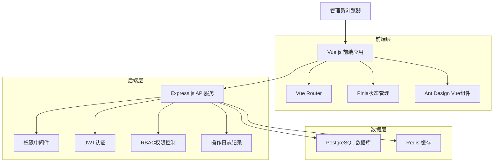
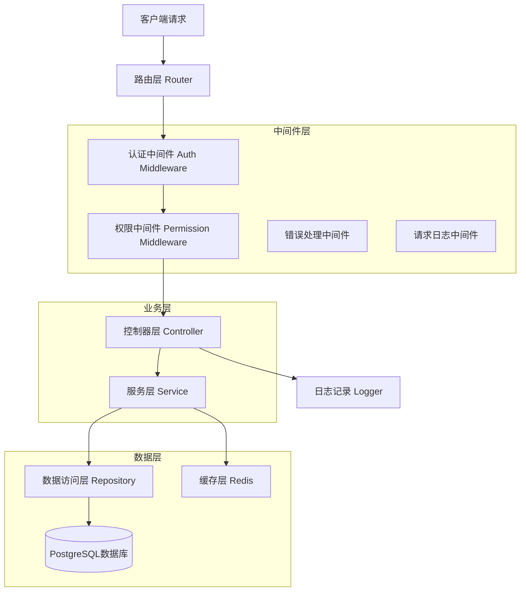
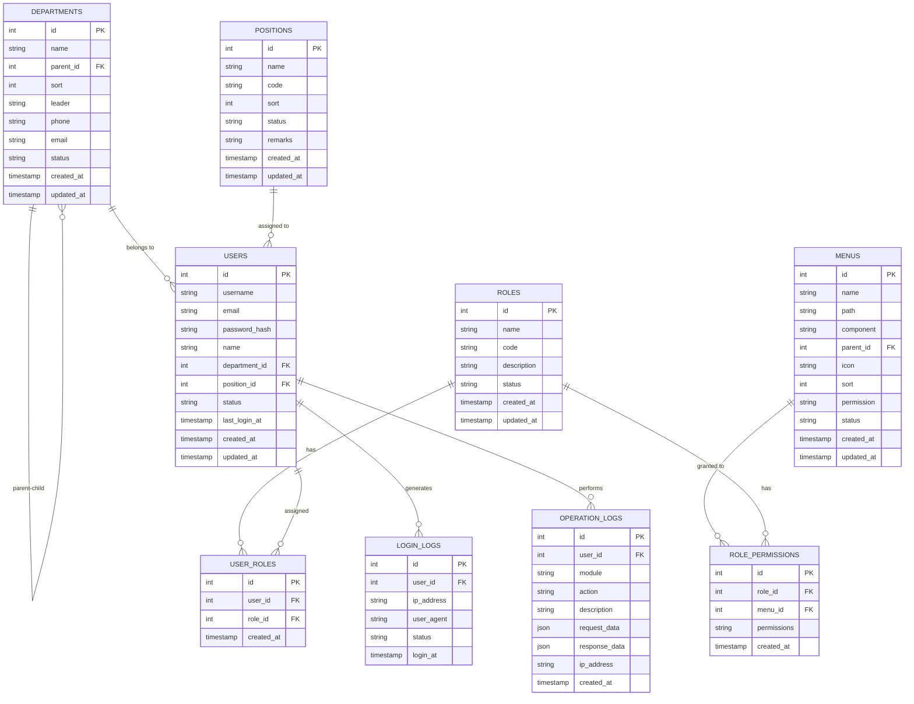

# TRON能量租赁系统 - 管理员RBAC权限管理系统技术架构文档

## 1. 架构设计



## 2. 技术描述

* **前端**: Vue.js\@3 + Ant Design Vue\@4 + TypeScript + Vite

* **后端**: Node.js + Express.js\@4 + TypeScript

* **数据库**: PostgreSQL\@15 (现有数据库)

* **缓存**: Redis\@7 (权限缓存、会话管理)

* **认证**: JWT + bcrypt密码加密

* **权限**: 自研RBAC权限控制中间件

## 3. 路由定义

| 路由                     | 用途                |
| ---------------------- | ----------------- |
| /system                | 系统管理主页面，权限概览和快捷操作 |
| /system/departments    | 部门管理页面，树形结构展示和编辑  |
| /system/roles          | 角色管理页面，角色列表和权限配置  |
| /system/menus          | 菜单管理页面，菜单树形表格和排序  |
| /system/positions      | 岗位管理页面，岗位信息维护     |
| /system/users          | 用户管理页面，管理员用户管理    |
| /system/logs/login     | 登录日志页面，登录记录查询     |
| /system/logs/operation | 操作日志页面，操作记录查询     |

## 4. API定义

### 4.1 核心API

#### 部门管理相关

```
GET /api/system/departments
```

获取部门树形结构

Response:

| 参数名      | 参数类型   | 描述                   |
| -------- | ------ | -------------------- |
| id       | number | 部门ID                 |
| name     | string | 部门名称                 |
| parentId | number | 上级部门ID               |
| sort     | number | 显示排序                 |
| leader   | string | 负责人                  |
| phone    | string | 联系电话                 |
| email    | string | 邮箱                   |
| status   | string | 部门状态：normal/disabled |
| children | array  | 子部门列表                |

```
POST /api/system/departments
```

新增部门

Request:

| 参数名      | 参数类型   | 必填    | 描述            |
| -------- | ------ | ----- | ------------- |
| name     | string | true  | 部门名称          |
| parentId | number | false | 上级部门ID        |
| sort     | number | false | 显示排序          |
| leader   | string | false | 负责人           |
| phone    | string | false | 联系电话          |
| email    | string | false | 邮箱            |
| status   | string | false | 部门状态，默认normal |

#### 角色管理相关

```
GET /api/system/roles
```

获取角色列表

```
POST /api/system/roles
```

新增角色

```
PUT /api/system/roles/:id/permissions
```

配置角色权限

Request:

| 参数名         | 参数类型  | 必填   | 描述       |
| ----------- | ----- | ---- | -------- |
| menuIds     | array | true | 菜单权限ID数组 |
| permissions | array | true | 操作权限数组   |

#### 用户管理相关

```
GET /api/system/users
```

获取管理员用户列表

```
POST /api/system/users
```

新增管理员用户

Request:

| 参数名          | 参数类型   | 必填    | 描述     |
| ------------ | ------ | ----- | ------ |
| username     | string | true  | 用户名    |
| email        | string | true  | 邮箱     |
| password     | string | true  | 密码     |
| name         | string | true  | 姓名     |
| departmentId | number | false | 所属部门ID |
| positionId   | number | false | 岗位ID   |
| roleIds      | array  | true  | 角色ID数组 |

#### 日志管理相关

```
GET /api/system/logs/login
```

获取登录日志

```
GET /api/system/logs/operation
```

获取操作日志

## 5. 服务器架构图



## 6. 数据模型

### 6.1 数据模型定义



### 6.2 数据定义语言

#### 部门表 (departments)

```sql
-- 创建部门表
CREATE TABLE departments (
    id SERIAL PRIMARY KEY,
    name VARCHAR(100) NOT NULL COMMENT '部门名称',
    parent_id INTEGER REFERENCES departments(id) ON DELETE SET NULL COMMENT '上级部门ID',
    sort INTEGER DEFAULT 0 COMMENT '显示排序',
    leader VARCHAR(50) COMMENT '负责人',
    phone VARCHAR(20) COMMENT '联系电话',
    email VARCHAR(100) COMMENT '邮箱',
    status VARCHAR(20) DEFAULT 'normal' CHECK (status IN ('normal', 'disabled')) COMMENT '部门状态',
    created_at TIMESTAMP WITH TIME ZONE DEFAULT NOW(),
    updated_at TIMESTAMP WITH TIME ZONE DEFAULT NOW()
);

-- 创建索引
CREATE INDEX idx_departments_parent_id ON departments(parent_id);
CREATE INDEX idx_departments_status ON departments(status);
```

#### 岗位表 (positions)

```sql
-- 创建岗位表
CREATE TABLE positions (
    id SERIAL PRIMARY KEY,
    name VARCHAR(100) NOT NULL COMMENT '岗位名称',
    code VARCHAR(50) UNIQUE NOT NULL COMMENT '岗位编码',
    sort INTEGER DEFAULT 0 COMMENT '显示顺序',
    status VARCHAR(20) DEFAULT 'normal' CHECK (status IN ('normal', 'disabled')) COMMENT '岗位状态',
    remarks TEXT COMMENT '备注',
    created_at TIMESTAMP WITH TIME ZONE DEFAULT NOW(),
    updated_at TIMESTAMP WITH TIME ZONE DEFAULT NOW()
);

-- 创建索引
CREATE INDEX idx_positions_code ON positions(code);
CREATE INDEX idx_positions_status ON positions(status);
```

#### 角色表 (roles)

```sql
-- 创建角色表
CREATE TABLE roles (
    id SERIAL PRIMARY KEY,
    name VARCHAR(100) NOT NULL COMMENT '角色名称',
    code VARCHAR(50) UNIQUE NOT NULL COMMENT '角色编码',
    description TEXT COMMENT '角色描述',
    status VARCHAR(20) DEFAULT 'normal' CHECK (status IN ('normal', 'disabled')) COMMENT '角色状态',
    created_at TIMESTAMP WITH TIME ZONE DEFAULT NOW(),
    updated_at TIMESTAMP WITH TIME ZONE DEFAULT NOW()
);

-- 创建索引
CREATE INDEX idx_roles_code ON roles(code);
CREATE INDEX idx_roles_status ON roles(status);
```

#### 菜单表 (menus)

```sql
-- 创建菜单表
CREATE TABLE menus (
    id SERIAL PRIMARY KEY,
    name VARCHAR(100) NOT NULL COMMENT '菜单名称',
    path VARCHAR(200) COMMENT '菜单路径',
    component VARCHAR(200) COMMENT '组件路径',
    parent_id INTEGER REFERENCES menus(id) ON DELETE CASCADE COMMENT '父菜单ID',
    icon VARCHAR(100) COMMENT '菜单图标',
    sort INTEGER DEFAULT 0 COMMENT '显示排序',
    permission VARCHAR(200) COMMENT '权限标识',
    status VARCHAR(20) DEFAULT 'normal' CHECK (status IN ('normal', 'disabled')) COMMENT '菜单状态',
    created_at TIMESTAMP WITH TIME ZONE DEFAULT NOW(),
    updated_at TIMESTAMP WITH TIME ZONE DEFAULT NOW()
);

-- 创建索引
CREATE INDEX idx_menus_parent_id ON menus(parent_id);
CREATE INDEX idx_menus_permission ON menus(permission);
CREATE INDEX idx_menus_status ON menus(status);
```

#### 用户角色关联表 (user\_roles)

```sql
-- 创建用户角色关联表
CREATE TABLE user_roles (
    id SERIAL PRIMARY KEY,
    user_id INTEGER NOT NULL REFERENCES admins(id) ON DELETE CASCADE COMMENT '用户ID',
    role_id INTEGER NOT NULL REFERENCES roles(id) ON DELETE CASCADE COMMENT '角色ID',
    created_at TIMESTAMP WITH TIME ZONE DEFAULT NOW(),
    UNIQUE(user_id, role_id)
);

-- 创建索引
CREATE INDEX idx_user_roles_user_id ON user_roles(user_id);
CREATE INDEX idx_user_roles_role_id ON user_roles(role_id);
```

#### 角色权限关联表 (role\_permissions)

```sql
-- 创建角色权限关联表
CREATE TABLE role_permissions (
    id SERIAL PRIMARY KEY,
    role_id INTEGER NOT NULL REFERENCES roles(id) ON DELETE CASCADE COMMENT '角色ID',
    menu_id INTEGER NOT NULL REFERENCES menus(id) ON DELETE CASCADE COMMENT '菜单ID',
    permissions TEXT COMMENT '操作权限：view,create,update,delete',
    created_at TIMESTAMP WITH TIME ZONE DEFAULT NOW(),
    UNIQUE(role_id, menu_id)
);

-- 创建索引
CREATE INDEX idx_role_permissions_role_id ON role_permissions(role_id);
CREATE INDEX idx_role_permissions_menu_id ON role_permissions(menu_id);
```

#### 登录日志表 (login\_logs)

```sql
-- 创建登录日志表
CREATE TABLE login_logs (
    id SERIAL PRIMARY KEY,
    user_id INTEGER REFERENCES admins(id) ON DELETE SET NULL COMMENT '用户ID',
    ip_address INET COMMENT 'IP地址',
    user_agent TEXT COMMENT '用户代理',
    status VARCHAR(20) DEFAULT 'success' CHECK (status IN ('success', 'failed')) COMMENT '登录状态',
    login_at TIMESTAMP WITH TIME ZONE DEFAULT NOW() COMMENT '登录时间'
);

-- 创建索引
CREATE INDEX idx_login_logs_user_id ON login_logs(user_id);
CREATE INDEX idx_login_logs_login_at ON login_logs(login_at DESC);
CREATE INDEX idx_login_logs_ip_address ON login_logs(ip_address);
```

#### 操作日志表 (operation\_logs)

```sql
-- 创建操作日志表
CREATE TABLE operation_logs (
    id SERIAL PRIMARY KEY,
    user_id INTEGER REFERENCES admins(id) ON DELETE SET NULL COMMENT '用户ID',
    module VARCHAR(100) NOT NULL COMMENT '操作模块',
    action VARCHAR(100) NOT NULL COMMENT '操作动作',
    description TEXT COMMENT '操作描述',
    request_data JSONB COMMENT '请求数据',
    response_data JSONB COMMENT '响应数据',
    ip_address INET COMMENT 'IP地址',
    created_at TIMESTAMP WITH TIME ZONE DEFAULT NOW() COMMENT '操作时间'
);

-- 创建索引
CREATE INDEX idx_operation_logs_user_id ON operation_logs(user_id);
CREATE INDEX idx_operation_logs_module ON operation_logs(module);
CREATE INDEX idx_operation_logs_created_at ON operation_logs(created_at DESC);
CREATE INDEX idx_operation_logs_ip_address ON operation_logs(ip_address);
```

#### 修改现有管理员表 (admins)

```sql
-- 为现有管理员表添加新字段
ALTER TABLE admins ADD COLUMN IF NOT EXISTS department_id INTEGER REFERENCES departments(id) ON DELETE SET NULL COMMENT '所属部门ID';
ALTER TABLE admins ADD COLUMN IF NOT EXISTS position_id INTEGER REFERENCES positions(id) ON DELETE SET NULL COMMENT '岗位ID';
ALTER TABLE admins ADD COLUMN IF NOT EXISTS last_login_at TIMESTAMP WITH TIME ZONE COMMENT '最后登录时间';

-- 创建索引
CREATE INDEX IF NOT EXISTS idx_admins_department_id ON admins(department_id);
CREATE INDEX IF NOT EXISTS idx_admins_position_id ON admins(position_id);
```

#### 初始化数据

```sql
-- 初始化根部门
INSERT INTO departments (name, parent_id, sort, leader, status) VALUES 
('总公司', NULL, 1, '系统管理员', 'normal');

-- 初始化默认角色
INSERT INTO roles (name, code, description, status) VALUES 
('超级管理员', 'super_admin', '拥有所有系统权限', 'normal'),
('系统管理员', 'system_admin', '系统管理权限', 'normal'),
('部门管理员', 'dept_admin', '部门管理权限', 'normal');

-- 初始化系统菜单
INSERT INTO menus (name, path, component, parent_id, icon, sort, permission, status) VALUES 
('系统管理', '/system', 'Layout', NULL, 'setting', 1, 'system', 'normal'),
('部门管理', '/system/departments', 'system/departments/index', 1, 'apartment', 1, 'system:dept', 'normal'),
('角色管理', '/system/roles', 'system/roles/index', 1, 'team', 2, 'system:role', 'normal'),
('菜单管理', '/system/menus', 'system/menus/index', 1, 'menu', 3, 'system:menu', 'normal'),
('岗位管理', '/system/positions', 'system/positions/index', 1, 'contacts', 4, 'system:position', 'normal'),
('用户管理', '/system/users', 'system/users/index', 1, 'user', 5, 'system:user', 'normal'),
('日志管理', '/system/logs', 'Layout', 1, 'file-text', 6, 'system:log', 'normal'),
('登录日志', '/system/logs/login', 'system/logs/login/index', 7, 'login', 1, 'system:log:login', 'normal'),
('操作日志', '/system/logs/operation', 'system/logs/operation/index', 7, 'audit', 2, 'system:log:operation', 'normal');
```

