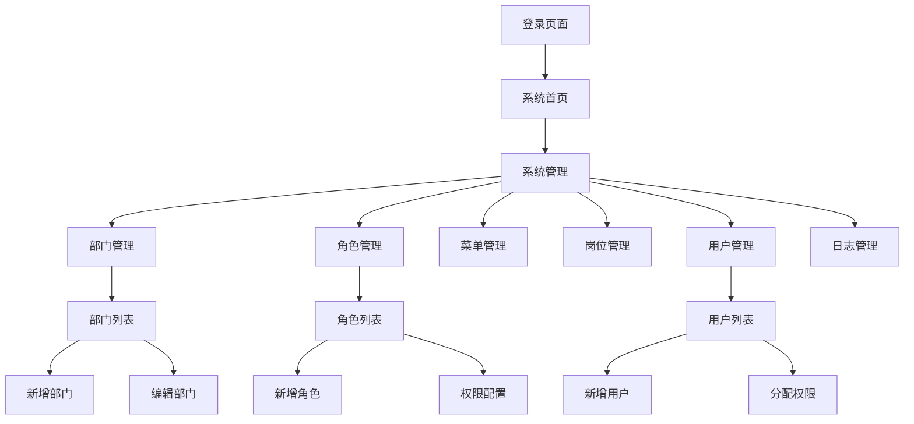

# TRON能量租赁系统 - 管理员RBAC权限管理系统需求文档

## 1. 产品概述

本文档旨在重构现有的管理员管理系统，构建一套完整的基于角色的访问控制（RBAC）权限管理体系。系统将提供部门管理、角色管理、菜单管理、岗位管理、用户管理和日志管理等核心功能，实现细粒度的权限控制和组织架构管理。

该系统将替代现有简单的管理员管理功能，为TRON能量租赁平台提供企业级的权限管理解决方案，支持多层级组织架构和灵活的权限分配机制。

## 2. 核心功能

### 2.1 用户角色

| 角色 | 注册方法 | 核心权限 |
|------|----------|----------|
| 超级管理员 | 系统初始化创建 | 拥有所有系统权限，可管理所有模块 |
| 系统管理员 | 超级管理员创建 | 可管理用户、角色、部门等基础数据 |
| 部门管理员 | 系统管理员创建 | 可管理所属部门的用户和数据 |
| 普通管理员 | 部门管理员创建 | 根据分配角色拥有对应权限 |

### 2.2 功能模块

系统管理一级菜单下包含以下六个核心二级菜单：

1. **部门管理**：组织架构管理，支持树形结构的部门层级关系
2. **角色管理**：角色定义和菜单权限配置
3. **菜单管理**：系统菜单的CRUD操作和排序管理
4. **岗位管理**：岗位信息维护和状态管理
5. **用户管理**：管理员用户的创建和权限分配
6. **日志管理**：登录日志和操作日志的查询和分析

### 2.3 页面详情

| 页面名称 | 模块名称 | 功能描述 |
|----------|----------|----------|
| 部门管理页面 | 部门列表 | 展示树形部门结构，支持展开/折叠操作 |
| 部门管理页面 | 部门表单 | 新增/编辑部门信息：上级部门、部门名称、显示排序、负责人、联系电话、邮箱、部门状态 |
| 部门管理页面 | 部门操作 | 启用/停用部门，删除部门（检查是否有下级部门和用户） |
| 角色管理页面 | 角色列表 | 显示所有角色信息，支持搜索和筛选 |
| 角色管理页面 | 角色表单 | 新增/编辑角色：角色名称、角色编码、角色描述、状态 |
| 角色管理页面 | 权限配置 | 为角色分配菜单权限，支持树形菜单选择 |
| 菜单管理页面 | 菜单列表 | 展示树形菜单结构，支持拖拽排序 |
| 菜单管理页面 | 菜单表单 | 新增/编辑菜单：菜单名称、菜单路径、图标、排序、状态、权限标识 |
| 菜单管理页面 | 菜单操作 | 启用/停用菜单，删除菜单（检查是否有子菜单） |
| 岗位管理页面 | 岗位列表 | 显示所有岗位信息，支持搜索和排序 |
| 岗位管理页面 | 岗位表单 | 新增/编辑岗位：岗位名称、岗位编码、显示顺序、岗位状态、备注 |
| 岗位管理页面 | 岗位操作 | 启用/停用岗位，删除岗位（检查是否有关联用户） |
| 用户管理页面 | 用户列表 | 显示管理员用户列表，支持多条件筛选 |
| 用户管理页面 | 用户表单 | 新增/编辑用户：基本信息、所属部门、岗位、角色分配 |
| 用户管理页面 | 用户操作 | 重置密码、启用/停用用户、角色变更 |
| 日志管理页面 | 登录日志 | 查看用户登录记录：登录时间、IP地址、设备信息、登录状态 |
| 日志管理页面 | 操作日志 | 查看用户操作记录：操作时间、操作人、操作模块、操作内容、操作结果 |
| 日志管理页面 | 日志分析 | 提供日志统计图表和异常行为分析 |

## 3. 核心流程

### 3.1 管理员用户操作流程

1. **登录系统** → 验证身份 → 获取用户权限 → 进入系统首页
2. **部门管理** → 查看部门树 → 新增/编辑部门 → 设置部门负责人 → 保存部门信息
3. **角色管理** → 查看角色列表 → 创建新角色 → 配置菜单权限 → 保存角色配置
4. **用户管理** → 查看用户列表 → 新增管理员 → 分配部门岗位 → 分配角色权限 → 保存用户信息
5. **权限验证** → 用户访问功能 → 检查角色权限 → 允许/拒绝访问 → 记录操作日志

### 3.2 权限控制流程

1. **用户登录** → 获取用户角色 → 加载角色权限 → 生成权限菜单
2. **功能访问** → 检查权限标识 → 验证用户权限 → 允许/拒绝操作
3. **数据权限** → 检查部门权限 → 过滤可见数据 → 返回授权数据

## 4. 用户界面设计

### 4.1 设计风格

- **主色调**：#1890ff（蓝色）、#52c41a（绿色）
- **辅助色**：#f0f0f0（浅灰）、#ffffff（白色）
- **按钮样式**：圆角按钮，支持主要、次要、危险等类型
- **字体**：系统默认字体，标题16px，正文14px，说明文字12px
- **布局风格**：左侧导航 + 右侧内容区域，卡片式布局
- **图标风格**：使用Ant Design图标库，简洁现代

### 4.2 页面设计概览

| 页面名称 | 模块名称 | UI元素 |
|----------|----------|--------|
| 部门管理页面 | 部门树形结构 | 使用Tree组件，支持展开/折叠，节点显示部门名称和状态标识 |
| 部门管理页面 | 部门表单 | Modal弹窗形式，包含级联选择器（上级部门）、输入框、数字输入框、开关组件 |
| 角色管理页面 | 角色列表 | Table组件，包含搜索框、状态筛选、操作按钮 |
| 角色管理页面 | 权限配置 | Tree组件，支持父子关联选择，半选状态显示 |
| 菜单管理页面 | 菜单树形表格 | TreeTable组件，支持拖拽排序，内联编辑 |
| 用户管理页面 | 用户表单 | 分步表单，基本信息 → 组织信息 → 权限分配 |
| 日志管理页面 | 日志查询 | 高级搜索表单，时间范围选择器，条件筛选 |
| 日志管理页面 | 日志列表 | 分页表格，支持导出功能，详情查看 |

### 4.3 响应式设计

系统采用桌面优先设计，支持1920px、1440px、1024px等主流分辨率。在小屏幕设备上，侧边栏可折叠，表格支持横向滚动，表单采用垂直布局优化显示效果。