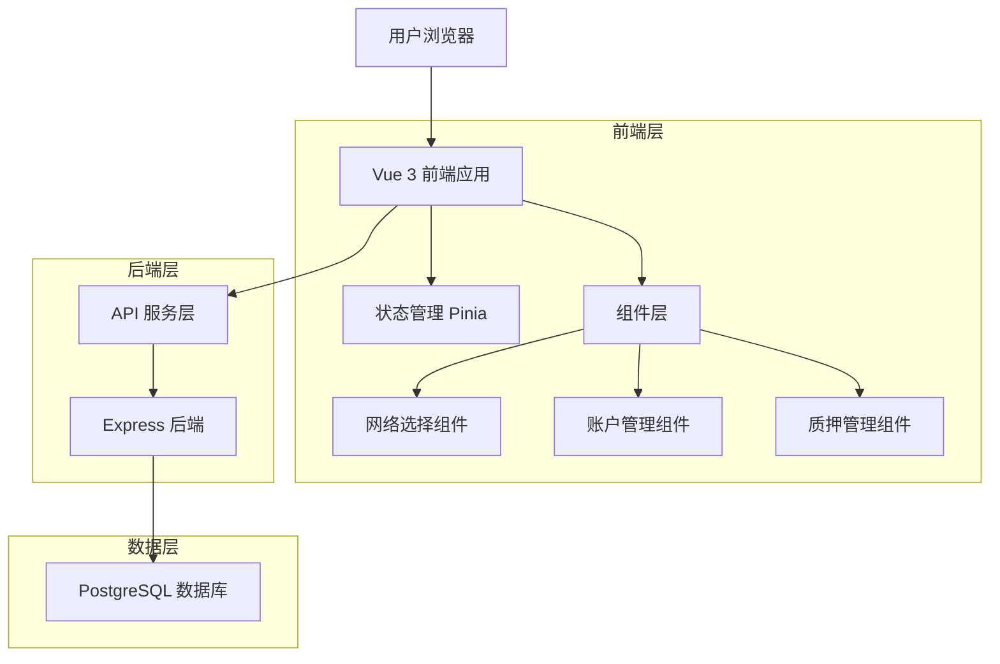
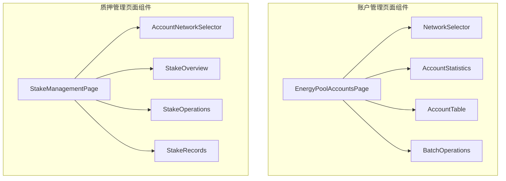
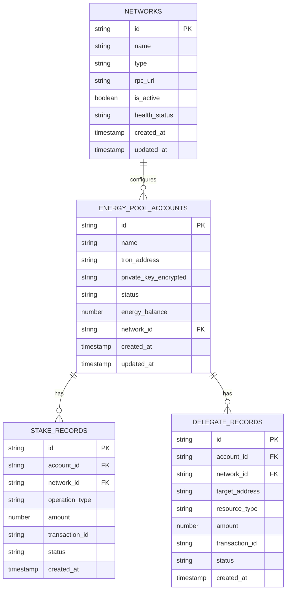

# 能量池管理优化技术架构文档

## 1. 架构设计



## 2. 技术描述

* 前端：Vue 3 + TypeScript + Vite + Tailwind CSS + Pinia

* 后端：Express.js + TypeScript + PostgreSQL

* 状态管理：Pinia stores

* UI组件：自定义组件 + Lucide图标

## 3. 路由定义

| 路由                    | 用途                   |
| --------------------- | -------------------- |
| /energy-pool/accounts | 能量池账户管理页面，包含统一网络选择功能 |
| /energy-pool/stake    | 质押管理页面，包含账户和网络选择器    |

## 4. API定义

### 4.1 核心API

**获取网络列表**

```
GET /api/networks
```

响应：

| 参数名            | 参数类型    | 描述   |
| -------------- | ------- | ---- |
| id             | string  | 网络ID |
| name           | string  | 网络名称 |
| type           | string  | 网络类型 |
| is\_active     | boolean | 是否激活 |
| health\_status | string  | 健康状态 |

**获取指定网络的账户列表**

```
GET /api/energy-pool/accounts?network_id={networkId}
```

请求参数：

| 参数名         | 参数类型   | 是否必需  | 描述             |
| ----------- | ------ | ----- | -------------- |
| network\_id | string | false | 网络ID，为空时返回所有账户 |

响应：

| 参数名             | 参数类型   | 描述     |
| --------------- | ------ | ------ |
| id              | string | 账户ID   |
| name            | string | 账户名称   |
| tron\_address   | string | TRON地址 |
| status          | string | 账户状态   |
| energy\_balance | number | 能量余额   |

**获取质押概览**

```
GET /api/stake/overview?account_id={accountId}&network_id={networkId}
```

请求参数：

| 参数名         | 参数类型   | 是否必需 | 描述   |
| ----------- | ------ | ---- | ---- |
| account\_id | string | true | 账户ID |
| network\_id | string | true | 网络ID |

响应：

| 参数名             | 参数类型   | 描述     |
| --------------- | ------ | ------ |
| totalStakedTrx  | number | 总质押TRX |
| unlockingTrx    | number | 解锁中TRX |
| withdrawableTrx | number | 可提取TRX |
| stakedEnergy    | number | 质押获得能量 |

## 5. 前端组件架构

### 5.1 组件层次结构



### 5.2 状态管理设计

**网络状态管理 (useNetworkStore)**

```typescript
interface NetworkState {
  networks: Network[]
  selectedNetworkId: string | null
  loading: boolean
  error: string | null
}

interface NetworkActions {
  fetchNetworks(): Promise<void>
  selectNetwork(networkId: string): void
  clearSelection(): void
}
```

**账户状态管理 (useAccountStore)**

```typescript
interface AccountState {
  accounts: Account[]
  selectedAccountId: string | null
  loading: boolean
  statistics: AccountStatistics | null
}

interface AccountActions {
  fetchAccounts(networkId?: string): Promise<void>
  selectAccount(accountId: string): void
  fetchStatistics(networkId: string): Promise<void>
}
```

**质押状态管理 (useStakeStore)**

```typescript
interface StakeState {
  overview: StakeOverview | null
  records: StakeRecord[]
  loading: boolean
}

interface StakeActions {
  fetchOverview(accountId: string, networkId: string): Promise<void>
  fetchRecords(accountId: string, networkId: string): Promise<void>
  performStake(params: StakeParams): Promise<void>
}
```

## 6. 数据模型

### 6.1 数据模型定义



### 6.2 数据定义语言

**网络配置表优化**

```sql
-- 确保网络表有健康状态字段
ALTER TABLE networks ADD COLUMN IF NOT EXISTS health_status VARCHAR(20) DEFAULT 'unknown';
CREATE INDEX IF NOT EXISTS idx_networks_active ON networks(is_active);
CREATE INDEX IF NOT EXISTS idx_networks_health ON networks(health_status);
```

**能量池账户表优化**

```sql
-- 移除单个账户的网络配置，改为关联网络表
ALTER TABLE energy_pool_accounts ADD COLUMN IF NOT EXISTS network_id UUID REFERENCES networks(id);
CREATE INDEX IF NOT EXISTS idx_energy_pool_accounts_network ON energy_pool_accounts(network_id);
CREATE INDEX IF NOT EXISTS idx_energy_pool_accounts_status ON energy_pool_accounts(status);
```

**质押记录表**

```sql
-- 创建质押记录表
CREATE TABLE IF NOT EXISTS stake_records (
    id UUID PRIMARY KEY DEFAULT gen_random_uuid(),
    account_id UUID NOT NULL REFERENCES energy_pool_accounts(id),
    network_id UUID NOT NULL REFERENCES networks(id),
    operation_type VARCHAR(20) NOT NULL CHECK (operation_type IN ('stake', 'unstake', 'delegate', 'withdraw')),
    amount BIGINT NOT NULL,
    transaction_id VARCHAR(100),
    status VARCHAR(20) DEFAULT 'pending' CHECK (status IN ('pending', 'success', 'failed')),
    created_at TIMESTAMP WITH TIME ZONE DEFAULT NOW(),
    updated_at TIMESTAMP WITH TIME ZONE DEFAULT NOW()
);

CREATE INDEX idx_stake_records_account ON stake_records(account_id);
CREATE INDEX idx_stake_records_network ON stake_records(network_id);
CREATE INDEX idx_stake_records_created_at ON stake_records(created_at DESC);
```

## 7. 实现优先级

### 7.1 第一阶段：基础架构

1. 创建网络选择组件
2. 修改账户管理页面，添加统一网络选择
3. 移除单个账户的网络配置功能
4. 优化数据统计逻辑

### 7.2 第二阶段：质押管理优化

1. 创建账户和网络选择器组件
2. 修改质押管理页面入口逻辑
3. 实现基于选择的数据加载
4. 优化用户交互体验

### 7.3 第三阶段：性能优化

1. 实现数据缓存策略
2. 添加加载状态和错误处理
3. 优化API调用频率
4. 完善响应式设计

## 8. 测试策略

### 8.1 单元测试

* 组件渲染测试

* 状态管理逻辑测试

* API调用测试

### 8.2 集成测试

* 页面流程测试

* 数据联动测试

* 错误场景测试

### 8.3 用户体验测试

* 响应式布局测试

* 交互流程测试

* 性能基准测试

