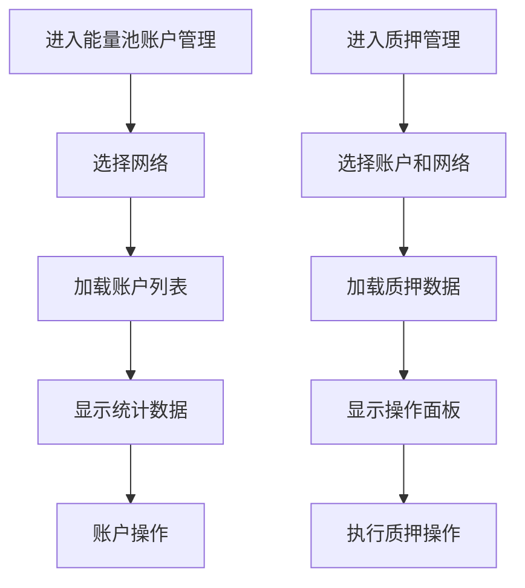

# 能量池管理系统优化需求文档

## 1. 产品概述

本文档针对TRON能量租赁系统中能量池管理模块的用户体验优化需求，主要解决当前系统中网络配置分散、统计困难以及操作流程不够直观的问题。

优化目标：提升管理效率，改善数据统计准确性，优化用户操作体验。

## 2. 核心功能

### 2.1 用户角色

| 角色    | 权限范围 | 核心功能                 |
| ----- | ---- | -------------------- |
| 超级管理员 | 全部功能 | 可管理所有能量池账户、网络配置和质押操作 |
| 管理员   | 受限功能 | 可查看和操作指定范围内的能量池资源    |

### 2.2 功能模块

本次优化涉及以下核心页面：

1. **能量池账户管理页面**：统一网络选择，账户列表展示，批量操作功能
2. **质押管理页面**：账户和网络选择器，质押操作面板，记录查看

### 2.3 页面详情

| 页面名称    | 模块名称  | 功能描述                             |
| ------- | ----- | -------------------------------- |
| 能量池账户管理 | 网络选择器 | 页面顶部提供统一的网络选择下拉框，影响整个页面的数据展示和统计  |
| 能量池账户管理 | 账户列表  | 根据选择的网络过滤显示对应的账户信息，移除单个账户的网络配置功能 |
| 能量池账户管理 | 统计面板  | 基于选定网络的统一统计数据，包括总能量、活跃账户数等关键指标   |
| 质押管理    | 选择面板  | 进入页面时显示账户选择器和网络选择器，必须选择后才能进行后续操作 |
| 质押管理    | 操作面板  | 基于选定账户和网络的质押、解质押、委托等操作功能         |
| 质押管理    | 数据展示  | 显示选定账户在指定网络上的质押概览和历史记录           |

## 3. 核心流程

### 3.1 能量池账户管理流程

用户进入能量池账户管理页面 → 选择目标网络 → 系统加载该网络下的所有账户 → 显示统计数据和账户列表 → 用户可进行批量操作或单个账户操作（不包括网络配置）

### 3.2 质押管理流程

用户进入质押管理页面 → 显示账户和网络选择界面 → 用户选择目标账户和网络 → 系统加载对应的质押数据 → 显示质押概览和操作面板 → 用户可进行质押相关操作

## 4. 用户界面设计

### 4.1 设计风格

* **主色调**：蓝色系（#3B82F6）和灰色系（#6B7280）

* **按钮样式**：圆角矩形，悬停效果，禁用状态区分

* **字体**：系统默认字体，标题16px，正文14px，辅助文字12px

* **布局风格**：卡片式布局，顶部导航，左侧筛选面板

* **图标风格**：线性图标，统一使用Lucide图标库

### 4.2 页面设计概览

| 页面名称    | 模块名称  | UI元素                             |
| ------- | ----- | -------------------------------- |
| 能量池账户管理 | 网络选择器 | 页面顶部固定位置，下拉选择框，带搜索功能，显示网络状态指示器   |
| 能量池账户管理 | 统计卡片  | 网格布局，显示总账户数、活跃账户、总能量等关键指标，带图标和数值 |
| 能量池账户管理 | 账户表格  | 响应式表格，包含复选框、账户信息、状态、操作按钮，移除网络配置列 |
| 质押管理    | 选择面板  | 页面中央卡片，包含账户下拉框和网络下拉框，带确认按钮       |
| 质押管理    | 质押概览  | 网格布局的统计卡片，显示质押金额、收益、状态等信息        |
| 质押管理    | 操作按钮组 | 水平排列的操作按钮，包含质押、解质押、委托、提取等功能      |

### 4.3 响应式设计

采用移动端优先的响应式设计，在小屏幕设备上选择器和操作面板会调整为垂直布局，确保良好的触控体验。

## 5. 技术实现要点

### 5.1 状态管理优化

* 网络选择状态需要在页面级别管理，影响所有子组件的数据加载

* 质押管理页面需要实现账户和网络的联动选择逻辑

* 优化数据缓存策略，避免频繁的API调用

### 5.2 用户体验改进

* 添加加载状态指示器，提升用户等待体验

* 实现选择器的搜索和过滤功能

* 添加操作确认对话框，防止误操作

* 优化错误提示和空状态展示

### 5.3 数据统计优化

* 基于统一网络选择实现准确的数据统计

* 支持实时数据更新和自动刷新

* 提供数据导出功能，便于进一步分析

