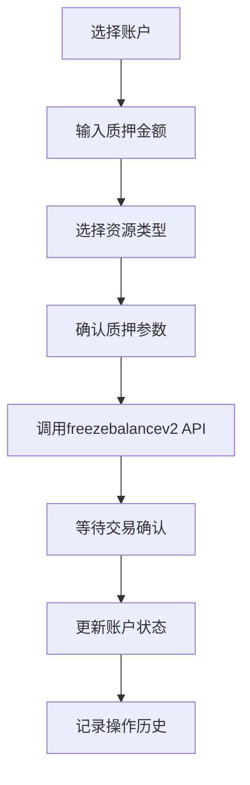
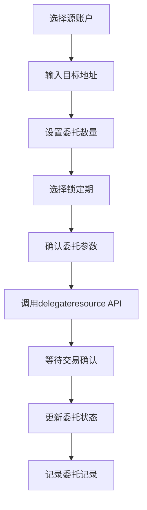
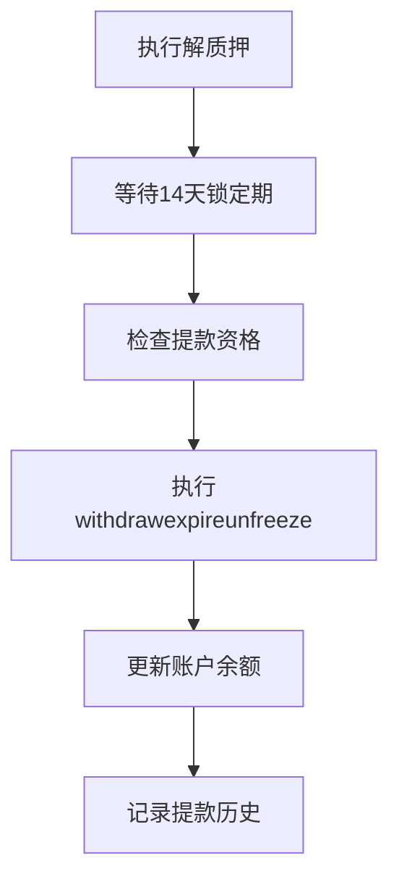

# 能量池质押管理功能需求文档

## 1. 产品概述

本功能旨在为现有能量池管理系统增加TRON质押2.0功能，允许管理员对已添加的能量池账户进行质押、解质押、委托资源、取消委托等操作，以优化能量资源配置和成本控制。

该功能将帮助平台更好地管理TRX资产，通过质押获取能量资源，并可灵活地将资源委托给其他地址，提高资源利用效率和收益。

## 2. 核心功能

### 2.1 用户角色

| 角色     | 权限说明   | 核心权限                    |
| ------ | ------ | ----------------------- |
| 系统管理员  | 完全管理权限 | 可执行所有质押操作、查看所有数据、配置系统参数 |
| 能量池管理员 | 操作权限   | 可执行质押/解质押/委托操作、查看账户状态   |

### 2.2 功能模块

本功能将在现有能量池管理页面基础上，新增质押管理二级菜单，包含以下核心页面：

1. **质押管理主页**：质押概览、账户质押状态、快速操作入口
2. **质押操作页面**：执行质押/解质押操作、设置质押参数
3. **委托管理页面**：资源委托、取消委托、委托状态查看
4. **解质押管理页面**：查看解质押记录、执行提款操作
5. **质押历史页面**：所有质押相关操作的历史记录

### 2.3 页面详情

| 页面名称    | 模块名称   | 功能描述                                      |
| ------- | ------ | ----------------------------------------- |
| 质押管理主页  | 概览面板   | 显示总质押金额、总获得能量、总委托资源等统计信息                  |
| 质押管理主页  | 账户状态列表 | 展示各账户的质押状态、可用TRX、已质押TRX、获得的能量/带宽          |
| 质押管理主页  | 快速操作   | 提供批量质押、批量解质押等快速操作按钮                       |
| 质押操作页面  | 质押表单   | 选择账户、输入质押金额、选择资源类型(ENERGY/BANDWIDTH)、确认质押 |
| 质押操作页面  | 解质押表单  | 选择账户、输入解质押金额、选择资源类型、确认解质押                 |
| 质押操作页面  | 操作确认   | 显示交易详情、Gas费用预估、确认执行                       |
| 委托管理页面  | 委托表单   | 选择源账户、输入目标地址、设置委托数量、选择锁定期                 |
| 委托管理页面  | 委托列表   | 显示所有委托记录、状态、到期时间、操作按钮                     |
| 委托管理页面  | 取消委托   | 选择委托记录、确认取消委托操作                           |
| 解质押管理页面 | 待提款列表  | 显示已解质押但未提款的记录、剩余等待时间                      |
| 解质押管理页面 | 提款操作   | 执行withdrawexpireunfreeze操作、批量提款           |
| 质押历史页面  | 操作记录   | 显示所有质押相关操作的详细历史、支持筛选和搜索                   |
| 质押历史页面  | 交易详情   | 查看具体交易的区块链信息、状态、Gas费用等                    |

## 3. 核心流程

### 3.1 质押流程

### 3.2 委托流程

### 3.3 解质押提款流程

## 4. 用户界面设计

### 4.1 设计风格

* **主色调**：沿用现有系统的蓝色主题 (#1890ff)，辅助色为绿色 (#52c41a) 表示成功状态

* **按钮样式**：圆角按钮，主要操作使用实心按钮，次要操作使用边框按钮

* **字体**：系统默认字体，标题使用16px，正文使用14px，说明文字使用12px

* **布局风格**：卡片式布局，顶部导航 + 侧边菜单，响应式设计

* **图标风格**：使用Ant Design图标库，统一视觉风格

### 4.2 页面设计概览

| 页面名称    | 模块名称  | UI元素                     |
| ------- | ----- | ------------------------ |
| 质押管理主页  | 概览面板  | 统计卡片、环形进度图、趋势图表，使用蓝色渐变背景 |
| 质押管理主页  | 账户列表  | 表格布局、状态标签、操作按钮，支持排序和筛选   |
| 质押操作页面  | 操作表单  | 分步表单、输入验证、实时预览，使用卡片容器    |
| 委托管理页面  | 委托表单  | 地址输入框、数量滑块、时间选择器，表单验证提示  |
| 解质押管理页面 | 待提款列表 | 时间倒计时、进度条、批量操作复选框        |
| 质押历史页面  | 历史记录  | 时间轴布局、状态图标、详情抽屉，支持分页加载   |

### 4.3 响应式设计

* **桌面优先**：主要针对管理后台使用，优化桌面端体验

* **移动适配**：支持平板和手机访问，侧边菜单折叠，表格横向滚动

* **触控优化**：按钮和链接区域不小于44px，支持触控操作

