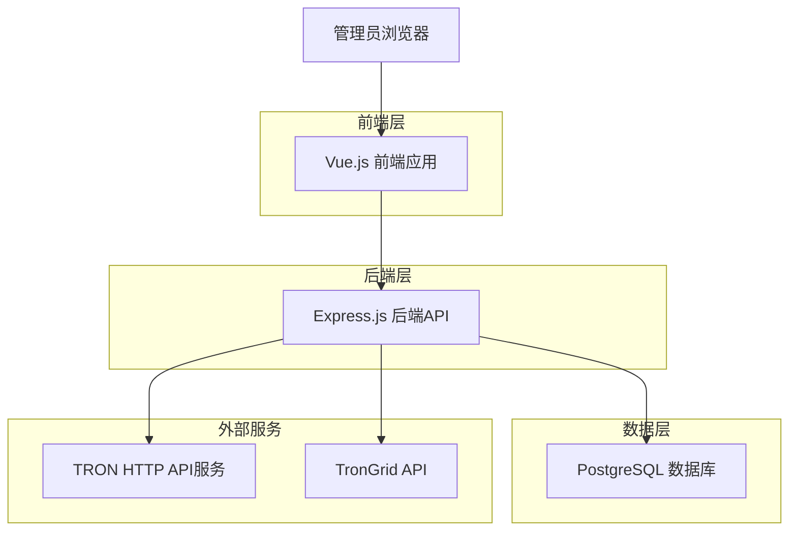
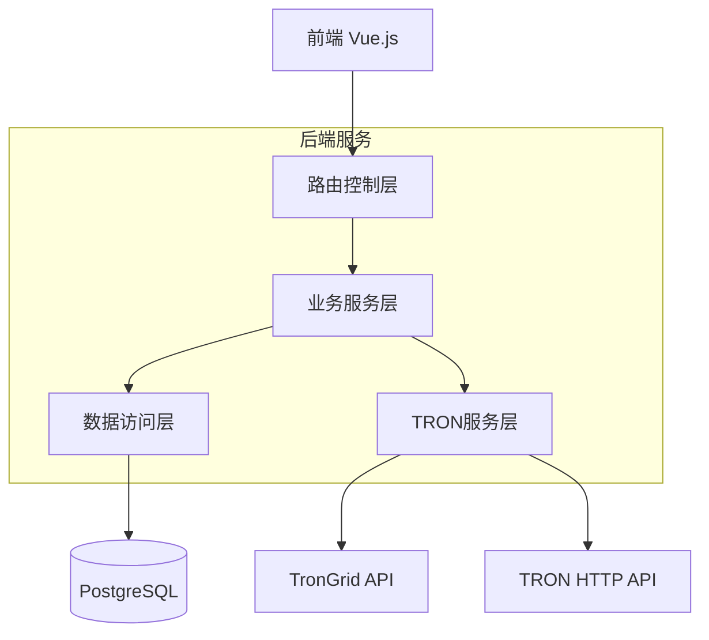
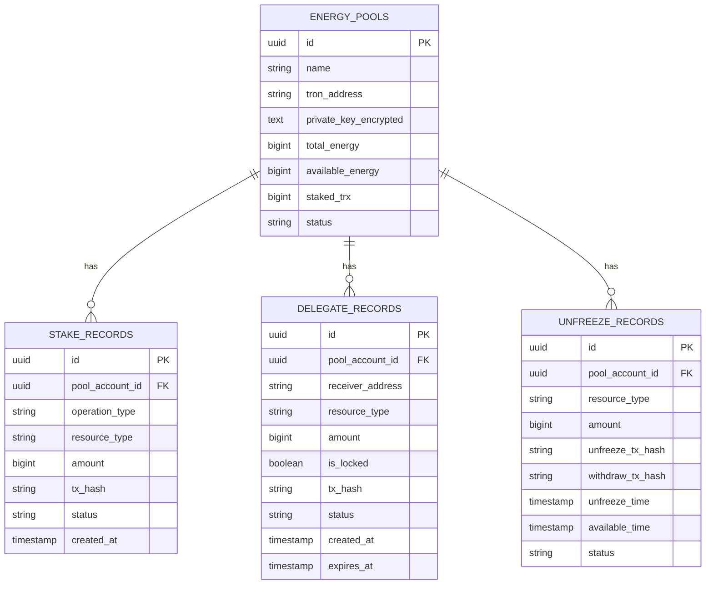

# 能量池质押管理技术架构文档

## 1. 架构设计



## 2. 技术描述

* **前端**: Vue.js\@3 + Ant Design Vue + TypeScript + Vite

* **后端**: Express.js\@4 + TypeScript + Node.js

* **数据库**: PostgreSQL (现有本地数据库)

* **区块链交互**: TRON HTTP API + TronGrid API

* **网络配置**: Nile 测试网

## 3. 路由定义

| 路由                            | 用途                 |
| ----------------------------- | ------------------ |
| /energy-pool/stake            | 质押管理主页，显示质押概览和账户状态 |
| /energy-pool/stake/operations | 质押操作页面，执行质押/解质押操作  |
| /energy-pool/stake/delegate   | 委托管理页面，管理资源委托      |
| /energy-pool/stake/withdraw   | 解质押管理页面，处理提款操作     |
| /energy-pool/stake/history    | 质押历史页面，查看操作记录      |

## 4. API定义

### 4.1 质押管理API

**获取质押概览信息**

```
GET /api/energy-pool/stake/overview
```

Response:

| 参数名            | 参数类型   | 描述        |
| -------------- | ------ | --------- |
| totalStaked    | string | 总质押TRX数量  |
| totalEnergy    | string | 总获得能量     |
| totalBandwidth | string | 总获得带宽     |
| totalDelegated | string | 总委托资源     |
| accountCount   | number | 参与质押的账户数量 |

**执行质押操作**

```
POST /api/energy-pool/stake/freeze
```

Request:

| 参数名       | 参数类型   | 是否必需 | 描述                       |
| --------- | ------ | ---- | ------------------------ |
| accountId | string | true | 能量池账户ID                  |
| amount    | string | true | 质押TRX数量(单位: sun)         |
| resource  | string | true | 资源类型: ENERGY 或 BANDWIDTH |

Response:

| 参数名     | 参数类型    | 描述     |
| ------- | ------- | ------ |
| success | boolean | 操作是否成功 |
| txHash  | string  | 交易哈希   |
| message | string  | 操作结果消息 |

**执行解质押操作**

```
POST /api/energy-pool/stake/unfreeze
```

Request:

| 参数名       | 参数类型   | 是否必需 | 描述                       |
| --------- | ------ | ---- | ------------------------ |
| accountId | string | true | 能量池账户ID                  |
| amount    | string | true | 解质押TRX数量(单位: sun)        |
| resource  | string | true | 资源类型: ENERGY 或 BANDWIDTH |

**委托资源**

```
POST /api/energy-pool/stake/delegate
```

Request:

| 参数名             | 参数类型    | 是否必需  | 描述                       |
| --------------- | ------- | ----- | ------------------------ |
| accountId       | string  | true  | 源账户ID                    |
| receiverAddress | string  | true  | 接收方TRON地址                |
| amount          | string  | true  | 委托数量(单位: sun)            |
| resource        | string  | true  | 资源类型: ENERGY 或 BANDWIDTH |
| lock            | boolean | false | 是否锁定委托(默认false)          |

**取消委托**

```
POST /api/energy-pool/stake/undelegate
```

Request:

| 参数名             | 参数类型   | 是否必需 | 描述                       |
| --------------- | ------ | ---- | ------------------------ |
| accountId       | string | true | 源账户ID                    |
| receiverAddress | string | true | 接收方TRON地址                |
| amount          | string | true | 取消委托数量(单位: sun)          |
| resource        | string | true | 资源类型: ENERGY 或 BANDWIDTH |

**提取解质押资金**

```
POST /api/energy-pool/stake/withdraw
```

Request:

| 参数名       | 参数类型   | 是否必需 | 描述   |
| --------- | ------ | ---- | ---- |
| accountId | string | true | 账户ID |

Response:

| 参数名             | 参数类型    | 描述       |
| --------------- | ------- | -------- |
| success         | boolean | 操作是否成功   |
| txHash          | string  | 交易哈希     |
| withdrawnAmount | string  | 提取的TRX数量 |

**获取质押历史**

```
GET /api/energy-pool/stake/history
```

Query Parameters:

| 参数名       | 参数类型   | 是否必需  | 描述         |
| --------- | ------ | ----- | ---------- |
| accountId | string | false | 筛选特定账户     |
| operation | string | false | 操作类型筛选     |
| page      | number | false | 页码(默认1)    |
| limit     | number | false | 每页数量(默认20) |

## 5. 服务架构图



## 6. 数据模型

### 6.1 数据模型定义



### 6.2 数据定义语言

**质押记录表 (stake\_records)**

```sql
-- 创建质押记录表
CREATE TABLE stake_records (
    id UUID PRIMARY KEY DEFAULT gen_random_uuid(),
    pool_account_id UUID NOT NULL REFERENCES energy_pools(id),
    operation_type VARCHAR(20) NOT NULL CHECK (operation_type IN ('freeze', 'unfreeze')),
    resource_type VARCHAR(20) NOT NULL CHECK (resource_type IN ('ENERGY', 'BANDWIDTH')),
    amount BIGINT NOT NULL CHECK (amount > 0),
    tx_hash VARCHAR(64) NOT NULL,
    status VARCHAR(20) DEFAULT 'pending' CHECK (status IN ('pending', 'confirmed', 'failed')),
    block_number BIGINT,
    gas_used BIGINT,
    created_at TIMESTAMP WITH TIME ZONE DEFAULT NOW(),
    updated_at TIMESTAMP WITH TIME ZONE DEFAULT NOW()
);

-- 创建索引
CREATE INDEX idx_stake_records_pool_account_id ON stake_records(pool_account_id);
CREATE INDEX idx_stake_records_created_at ON stake_records(created_at DESC);
CREATE INDEX idx_stake_records_tx_hash ON stake_records(tx_hash);
```

**委托记录表 (delegate\_records)**

```sql
-- 创建委托记录表
CREATE TABLE delegate_records (
    id UUID PRIMARY KEY DEFAULT gen_random_uuid(),
    pool_account_id UUID NOT NULL REFERENCES energy_pools(id),
    receiver_address VARCHAR(34) NOT NULL,
    operation_type VARCHAR(20) NOT NULL CHECK (operation_type IN ('delegate', 'undelegate')),
    resource_type VARCHAR(20) NOT NULL CHECK (resource_type IN ('ENERGY', 'BANDWIDTH')),
    amount BIGINT NOT NULL CHECK (amount > 0),
    is_locked BOOLEAN DEFAULT false,
    tx_hash VARCHAR(64) NOT NULL,
    status VARCHAR(20) DEFAULT 'pending' CHECK (status IN ('pending', 'confirmed', 'failed')),
    block_number BIGINT,
    gas_used BIGINT,
    created_at TIMESTAMP WITH TIME ZONE DEFAULT NOW(),
    updated_at TIMESTAMP WITH TIME ZONE DEFAULT NOW(),
    expires_at TIMESTAMP WITH TIME ZONE
);

-- 创建索引
CREATE INDEX idx_delegate_records_pool_account_id ON delegate_records(pool_account_id);
CREATE INDEX idx_delegate_records_receiver_address ON delegate_records(receiver_address);
CREATE INDEX idx_delegate_records_created_at ON delegate_records(created_at DESC);
```

**解质押记录表 (unfreeze\_records)**

```sql
-- 创建解质押记录表
CREATE TABLE unfreeze_records (
    id UUID PRIMARY KEY DEFAULT gen_random_uuid(),
    pool_account_id UUID NOT NULL REFERENCES energy_pools(id),
    resource_type VARCHAR(20) NOT NULL CHECK (resource_type IN ('ENERGY', 'BANDWIDTH')),
    amount BIGINT NOT NULL CHECK (amount > 0),
    unfreeze_tx_hash VARCHAR(64) NOT NULL,
    withdraw_tx_hash VARCHAR(64),
    unfreeze_time TIMESTAMP WITH TIME ZONE NOT NULL,
    available_time TIMESTAMP WITH TIME ZONE NOT NULL,
    status VARCHAR(20) DEFAULT 'unfrozen' CHECK (status IN ('unfrozen', 'withdrawn', 'failed')),
    created_at TIMESTAMP WITH TIME ZONE DEFAULT NOW(),
    updated_at TIMESTAMP WITH TIME ZONE DEFAULT NOW()
);

-- 创建索引
CREATE INDEX idx_unfreeze_records_pool_account_id ON unfreeze_records(pool_account_id);
CREATE INDEX idx_unfreeze_records_available_time ON unfreeze_records(available_time);
CREATE INDEX idx_unfreeze_records_status ON unfreeze_records(status);
```

**扩展能量池表字段**

```sql
-- 为energy_pools表添加质押相关字段
ALTER TABLE energy_pools ADD COLUMN IF NOT EXISTS staked_trx_energy BIGINT DEFAULT 0;
ALTER TABLE energy_pools ADD COLUMN IF NOT EXISTS staked_trx_bandwidth BIGINT DEFAULT 0;
ALTER TABLE energy_pools ADD COLUMN IF NOT EXISTS delegated_energy BIGINT DEFAULT 0;
ALTER TABLE energy_pools ADD COLUMN IF NOT EXISTS delegated_bandwidth BIGINT DEFAULT 0;

-- 添加字段注释
COMMENT ON COLUMN energy_pools.staked_trx_energy IS '质押用于获取能量的TRX数量';
COMMENT ON COLUMN energy_pools.staked_trx_bandwidth IS '质押用于获取带宽的TRX数量';
COMMENT ON COLUMN energy_pools.delegated_energy IS '已委托出去的能量数量';
COMMENT ON COLUMN energy_pools.delegated_bandwidth IS '已委托出去的带宽数量';
```

