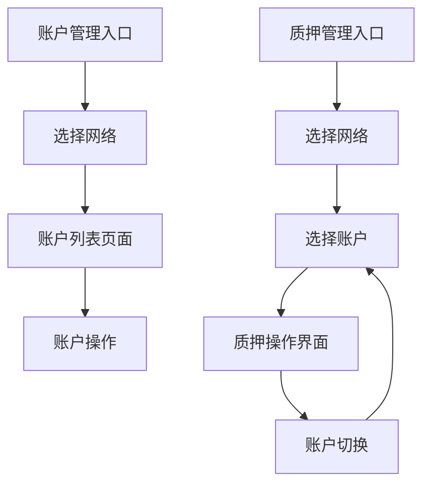

# 账户管理和质押管理页面优化需求文档

## 1. 产品概述

本项目旨在优化TRON能量租赁系统中的账户管理和质押管理功能，提升用户操作体验和管理效率。通过简化操作流程，用户可以更便捷地管理TRON网络账户和执行质押操作。

该优化将显著提升管理员的工作效率，减少操作步骤，提供更直观的界面交互体验。

## 2. 核心功能

### 2.1 用户角色

| 角色 | 访问方式 | 核心权限 |
|------|----------|----------|
| 超级管理员 | 系统内置账户登录 | 可访问所有功能，包括账户管理和质押管理 |
| 普通管理员 | 邀请码注册登录 | 可访问账户管理和质押管理功能 |

### 2.2 功能模块

本次优化涉及以下核心页面：

1. **账户管理页面**：网络选择、账户列表展示、账户增删改查操作
2. **质押管理页面**：网络选择、账户选择、质押操作界面、账户切换功能

### 2.3 页面详情

| 页面名称 | 模块名称 | 功能描述 |
|----------|----------|----------|
| 账户管理页面 | 网络选择器 | 选择TRON网络，支持主网、测试网等多种网络类型 |
| 账户管理页面 | 账户列表 | 显示选定网络下的所有账户，包括账户名称、地址、状态、余额等信息 |
| 账户管理页面 | 账户操作 | 支持添加新账户、编辑账户信息、删除账户、启用/禁用账户等操作 |
| 质押管理页面 | 网络账户选择器 | 先选择网络，再选择该网络下的具体账户进行质押操作 |
| 质押管理页面 | 账户选择界面 | 当未选择账户时显示的账户选择引导界面 |
| 质押管理页面 | 质押操作界面 | 显示质押概览、质押记录、执行质押/解质押操作 |
| 质押管理页面 | 账户切换功能 | 支持在质押界面快速切换不同账户 |

## 3. 核心流程

### 账户管理流程
用户进入账户管理页面 → 选择目标网络 → 查看该网络下的账户列表 → 执行账户增删改查操作

### 质押管理流程
用户进入质押管理页面 → 选择目标网络 → 选择具体账户 → 查看质押概览和执行质押操作 → 可切换其他账户继续操作

## 4. 用户界面设计

### 4.1 设计风格
- **主色调**：蓝色系（#3B82F6）作为主色，绿色（#10B981）作为成功状态色
- **按钮样式**：圆角矩形按钮，支持悬停效果
- **字体**：系统默认字体，标题使用16-24px，正文使用14px
- **布局风格**：卡片式布局，顶部导航栏设计
- **图标风格**：使用Lucide图标库，简洁现代风格

### 4.2 页面设计概览

| 页面名称 | 模块名称 | UI元素 |
|----------|----------|--------|
| 账户管理页面 | 网络选择器 | 下拉选择框，显示网络名称、状态指示器、网络图标 |
| 账户管理页面 | 账户列表 | 表格布局，包含复选框、账户信息、操作按钮，支持分页和搜索 |
| 质押管理页面 | 网络账户选择器 | 两级选择器，先选网络后选账户，带有确认按钮 |
| 质押管理页面 | 质押概览 | 卡片式统计信息展示，包含图标和数值 |

### 4.3 响应式设计

采用移动端优先的响应式设计，支持桌面端和移动端访问，确保在不同屏幕尺寸下的良好用户体验。