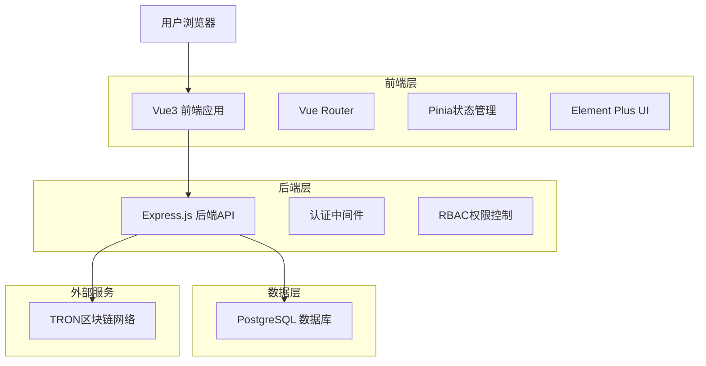
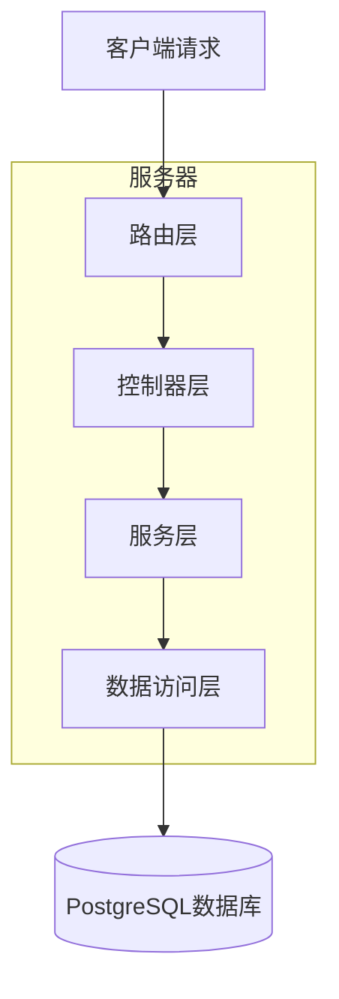
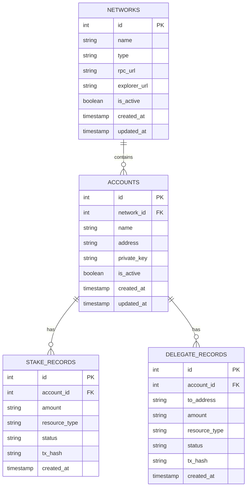

# 账户管理和质押管理页面技术架构文档

## 1. 架构设计



## 2. 技术描述

* 前端：Vue\@3 + TypeScript + Element Plus + Tailwind CSS + Vite

* 后端：Express\@4 + TypeScript + JWT认证

* 数据库：PostgreSQL（本地数据库）

* 区块链：TRON网络集成

## 3. 路由定义

| 路由                               | 用途                  |
| -------------------------------- | ------------------- |
| /config/energy-pools             | 账户管理页面，显示选定网络下的账户列表 |
| /energy-pool                     | 能量池管理入口，网络选择页面      |
| /energy-pool/:networkId/accounts | 特定网络的账户管理页面         |
| /energy-pool/:networkId/stake    | 特定网络的质押管理页面         |
| /config/networks                 | TRON网络配置管理页面        |

## 4. API定义

### 4.1 核心API

**网络管理相关**

```
GET /api/networks
```

请求参数：无

响应：

| 参数名称          | 参数类型    | 描述   |
| ------------- | ------- | ---- |
| success       | boolean | 请求状态 |
| data          | object  | 响应数据 |
| data.networks | array   | 网络列表 |

示例响应：

```json
{
  "success": true,
  "data": {
    "networks": [
      {
        "id": 1,
        "name": "TRON主网",
        "type": "mainnet",
        "rpc_url": "https://api.trongrid.io",
        "is_active": true
      }
    ]
  }
}
```

**账户管理相关**

```
GET /api/accounts
```

请求参数：

| 参数名称        | 参数类型   | 是否必需  | 描述   |
| ----------- | ------ | ----- | ---- |
| network\_id | number | true  | 网络ID |
| page        | number | false | 页码   |
| limit       | number | false | 每页数量 |

响应：

| 参数名称    | 参数类型    | 描述     |
| ------- | ------- | ------ |
| success | boolean | 请求状态   |
| data    | object  | 账户列表数据 |

**质押操作相关**

```
POST /api/stake/delegate
```

请求参数：

| 参数名称           | 参数类型   | 是否必需 | 描述                     |
| -------------- | ------ | ---- | ---------------------- |
| account\_id    | number | true | 账户ID                   |
| amount         | string | true | 质押金额（TRX）              |
| resource\_type | string | true | 资源类型（ENERGY/BANDWIDTH） |

响应：

| 参数名称    | 参数类型    | 描述   |
| ------- | ------- | ---- |
| success | boolean | 操作状态 |
| data    | object  | 交易信息 |

## 5. 服务器架构图



## 6. 数据模型

### 6.1 数据模型定义



### 6.2 数据定义语言

**网络表 (networks)**

```sql
-- 网络表已存在，无需创建
-- 包含字段：id, name, type, rpc_url, explorer_url, is_active, created_at, updated_at

-- 创建索引
CREATE INDEX IF NOT EXISTS idx_networks_is_active ON networks(is_active);
CREATE INDEX IF NOT EXISTS idx_networks_type ON networks(type);
```

**账户表 (accounts)**

```sql
-- 账户表已存在，无需创建
-- 包含字段：id, network_id, name, address, private_key, is_active, created_at, updated_at

-- 创建索引
CREATE INDEX IF NOT EXISTS idx_accounts_network_id ON accounts(network_id);
CREATE INDEX IF NOT EXISTS idx_accounts_is_active ON accounts(is_active);
CREATE INDEX IF NOT EXISTS idx_accounts_address ON accounts(address);
```

**质押记录表 (stake\_records)**

```sql
-- 质押记录表已存在，无需创建
-- 包含字段：id, account_id, amount, resource_type, status, tx_hash, created_at

-- 创建索引
CREATE INDEX IF NOT EXISTS idx_stake_records_account_id ON stake_records(account_id);
CREATE INDEX IF NOT EXISTS idx_stake_records_status ON stake_records(status);
CREATE INDEX IF NOT EXISTS idx_stake_records_created_at ON stake_records(created_at DESC);
```

**委托记录表 (delegate\_records)**

```sql
-- 委托记录表已存在，无需创建
-- 包含字段：id, account_id, to_address, amount, resource_type, status, tx_hash, created_at

-- 创建索引
CREATE INDEX IF NOT EXISTS idx_delegate_records_account_id ON delegate_records(account_id);
CREATE INDEX IF NOT EXISTS idx_delegate_records_status ON delegate_records(status);
CREATE INDEX IF NOT EXISTS idx_delegate_records_created_at ON delegate_records(created_at DESC);
```

