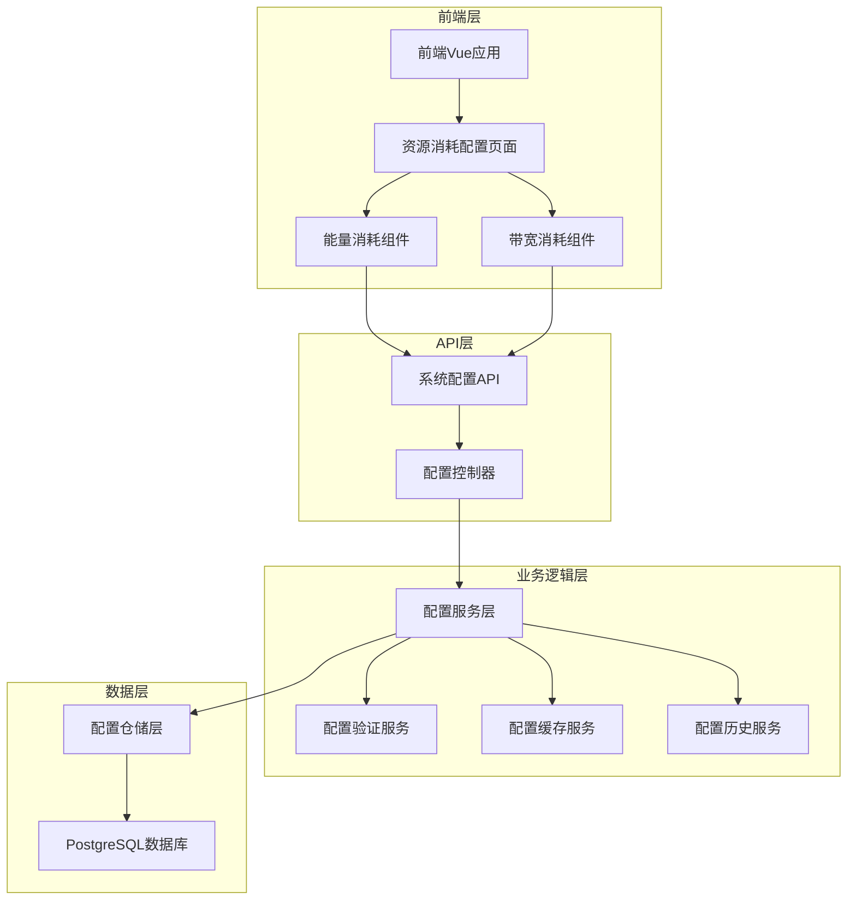

# TRON能量租赁系统 - 资源消耗配置技术实施方案

## 1. 现状分析

### 1.1 现有架构概述

**前端架构**
- 基于Vue 3 + TypeScript + Element Plus构建
- 采用组合式API和响应式数据管理
- 页面路径：`/src/pages/Config/ResourceConsumption/`
- 主要组件：
  - `index.vue` - 主页面容器，包含标签页导航
  - `EnergyConsumption/index.vue` - 能量消耗配置组件
  - `BandwidthConsumption/index.vue` - 带宽消耗配置组件
  - `types/resource-consumption.types.ts` - 类型定义

**后端架构**
- 基于Express.js + TypeScript构建
- 现有系统配置管理架构：
  - 控制器层：`api/routes/system-configs/controllers/`
  - 服务层：`api/routes/system-configs/services/`
  - 数据访问层：`api/routes/system-configs/services/systemConfigsRepository.ts`
  - 类型定义：`api/routes/system-configs/types/`

**数据库设计**
- PostgreSQL数据库
- 现有`system_configs`表支持动态配置管理
- 支持配置分类、版本控制、变更历史记录

### 1.2 现有功能特性

**能量消耗配置**
- USDT-TRC20转账能量消耗配置
- 安全缓冲百分比设置
- 最大能量上限控制
- 预设值管理（保守/标准/激进）
- 实时成本计算器
- 智能优化建议

**带宽消耗配置**
- 多种转账类型带宽配置（TRX/TRC10/TRC20）
- 账户创建带宽消耗设置
- 安全缓冲和上限控制
- 预设值管理
- 带宽成本计算器

### 1.3 待完善功能

**前端层面**
- 缺少数据持久化（目前为TODO状态）
- 缺少实时数据获取
- 缺少表单验证和错误处理
- 缺少配置历史记录查看

**后端层面**
- 需要创建资源消耗配置专用API接口
- 需要集成到现有系统配置管理架构
- 需要添加配置验证规则
- 需要实现配置变更审计

## 2. 技术架构设计

### 2.1 整体架构图



### 2.2 技术栈选择

**前端技术栈**
- Vue 3.x + Composition API
- TypeScript 5.x
- Element Plus UI组件库
- Vite构建工具
- Pinia状态管理（如需要）

**后端技术栈**
- Node.js + Express.js
- TypeScript 5.x
- PostgreSQL数据库
- 现有系统配置管理架构

**开发工具**
- ESLint + Prettier代码规范
- Vitest单元测试
- 现有项目构建流程

### 2.3 模块划分

**前端模块**
1. **配置管理模块** - 统一的配置CRUD操作
2. **能量配置模块** - 能量消耗相关配置
3. **带宽配置模块** - 带宽消耗相关配置
4. **计算器模块** - 成本计算和预估
5. **优化建议模块** - 智能配置建议
6. **历史记录模块** - 配置变更历史

**后端模块**
1. **资源配置控制器** - HTTP请求处理
2. **资源配置服务** - 业务逻辑处理
3. **配置验证服务** - 配置规则验证
4. **配置缓存服务** - 配置缓存管理
5. **配置历史服务** - 变更记录管理

## 3. 数据库设计

### 3.1 表结构设计

**利用现有system_configs表**
```sql
-- 现有表结构（无需修改）
CREATE TABLE system_configs (
    id UUID PRIMARY KEY DEFAULT gen_random_uuid(),
    config_key VARCHAR(255) UNIQUE NOT NULL,
    config_value TEXT NOT NULL,
    config_type VARCHAR(50) DEFAULT 'string',
    category VARCHAR(100) DEFAULT 'general',
    description TEXT,
    is_encrypted BOOLEAN DEFAULT FALSE,
    is_active BOOLEAN DEFAULT TRUE,
    created_at TIMESTAMP WITH TIME ZONE DEFAULT NOW(),
    updated_at TIMESTAMP WITH TIME ZONE DEFAULT NOW(),
    created_by UUID,
    updated_by UUID
);
```

**新增配置历史表（如不存在）**
```sql
CREATE TABLE IF NOT EXISTS system_config_history (
    id UUID PRIMARY KEY DEFAULT gen_random_uuid(),
    config_id UUID NOT NULL,
    config_key VARCHAR(255) NOT NULL,
    old_value TEXT,
    new_value TEXT NOT NULL,
    change_reason TEXT,
    operation_type VARCHAR(20) NOT NULL, -- 'create', 'update', 'delete'
    created_at TIMESTAMP WITH TIME ZONE DEFAULT NOW(),
    created_by UUID,
    FOREIGN KEY (config_id) REFERENCES system_configs(id)
);
```

### 3.2 配置项定义

**能量消耗配置项**
```sql
-- 能量消耗相关配置
INSERT INTO system_configs (config_key, config_value, config_type, category, description) VALUES
('resource.energy.usdt_standard_energy', '15000', 'number', 'resource_consumption', 'USDT转账标准能量消耗'),
('resource.energy.usdt_buffer_percentage', '20', 'number', 'resource_consumption', '能量消耗安全缓冲百分比'),
('resource.energy.usdt_max_energy', '30000', 'number', 'resource_consumption', '最大能量消耗上限'),
('resource.energy.energy_price_trx_ratio', '0.00021', 'number', 'resource_consumption', '能量-TRX兑换比例'),
('resource.energy.auto_optimize', 'true', 'boolean', 'resource_consumption', '自动优化开关'),
('resource.energy.preset_values', '[{"name":"保守","value":32000},{"name":"标准","value":15000},{"name":"激进","value":13000}]', 'json', 'resource_consumption', '能量消耗预设值');
```

**带宽消耗配置项**
```sql
-- 带宽消耗相关配置
INSERT INTO system_configs (config_key, config_value, config_type, category, description) VALUES
('resource.bandwidth.trx_transfer_bandwidth', '268', 'number', 'resource_consumption', 'TRX转账带宽消耗'),
('resource.bandwidth.trc10_transfer_bandwidth', '345', 'number', 'resource_consumption', 'TRC10转账带宽消耗'),
('resource.bandwidth.trc20_transfer_bandwidth', '345', 'number', 'resource_consumption', 'TRC20转账带宽消耗'),
('resource.bandwidth.account_create_bandwidth', '1000', 'number', 'resource_consumption', '账户创建带宽消耗'),
('resource.bandwidth.buffer_percentage', '15', 'number', 'resource_consumption', '带宽消耗安全缓冲百分比'),
('resource.bandwidth.max_bandwidth_limit', '5000', 'number', 'resource_consumption', '最大带宽消耗上限'),
('resource.bandwidth.preset_values', '[{"name":"保守","value":500},{"name":"标准","value":345},{"name":"激进","value":268}]', 'json', 'resource_consumption', '带宽消耗预设值');
```

### 3.3 索引优化

```sql
-- 为资源消耗配置添加专用索引
CREATE INDEX IF NOT EXISTS idx_system_configs_resource_category 
ON system_configs(category) WHERE category = 'resource_consumption';

CREATE INDEX IF NOT EXISTS idx_system_configs_resource_key 
ON system_configs(config_key) WHERE config_key LIKE 'resource.%';

CREATE INDEX IF NOT EXISTS idx_config_history_config_key 
ON system_config_history(config_key, created_at DESC);
```

## 4. API接口设计

### 4.1 RESTful API设计

**基础路径**: `/api/system-configs/resource-consumption`

#### 4.1.1 获取资源消耗配置

```typescript
// GET /api/system-configs/resource-consumption
// 获取所有资源消耗配置

interface ResourceConsumptionConfigResponse {
  success: boolean;
  data: {
    energy: EnergyConfig;
    bandwidth: BandwidthConfig;
  };
  message: string;
  timestamp: string;
}
```

#### 4.1.2 更新能量消耗配置

```typescript
// PUT /api/system-configs/resource-consumption/energy
// 更新能量消耗配置

interface UpdateEnergyConfigRequest {
  usdt_standard_energy?: number;
  usdt_buffer_percentage?: number;
  usdt_max_energy?: number;
  energy_price_trx_ratio?: number;
  auto_optimize?: boolean;
  preset_values?: PresetValue[];
  change_reason?: string;
}

interface UpdateConfigResponse {
  success: boolean;
  data: EnergyConfig;
  message: string;
  timestamp: string;
}
```

#### 4.1.3 更新带宽消耗配置

```typescript
// PUT /api/system-configs/resource-consumption/bandwidth
// 更新带宽消耗配置

interface UpdateBandwidthConfigRequest {
  trx_transfer_bandwidth?: number;
  trc10_transfer_bandwidth?: number;
  trc20_transfer_bandwidth?: number;
  account_create_bandwidth?: number;
  buffer_percentage?: number;
  max_bandwidth_limit?: number;
  preset_values?: PresetValue[];
  change_reason?: string;
}
```

#### 4.1.4 批量更新配置

```typescript
// PUT /api/system-configs/resource-consumption/batch
// 批量更新资源消耗配置

interface BatchUpdateResourceConfigRequest {
  energy?: Partial<EnergyConfig>;
  bandwidth?: Partial<BandwidthConfig>;
  change_reason?: string;
}
```

#### 4.1.5 获取配置历史

```typescript
// GET /api/system-configs/resource-consumption/history
// 获取配置变更历史

interface ConfigHistoryQuery {
  config_type?: 'energy' | 'bandwidth';
  limit?: number;
  offset?: number;
  start_date?: string;
  end_date?: string;
}

interface ConfigHistoryResponse {
  success: boolean;
  data: {
    records: ConfigHistory[];
    total: number;
    page: number;
    limit: number;
  };
  message: string;
}
```

#### 4.1.6 配置验证

```typescript
// POST /api/system-configs/resource-consumption/validate
// 验证配置参数

interface ValidateConfigRequest {
  config_type: 'energy' | 'bandwidth';
  config_data: Record<string, any>;
}

interface ValidateConfigResponse {
  success: boolean;
  data: {
    is_valid: boolean;
    errors: ValidationError[];
    warnings: ValidationWarning[];
  };
  message: string;
}
```

### 4.2 API实现示例

**控制器实现**
```typescript
// api/routes/system-configs/controllers/resourceConsumptionController.ts

import { Request, Response } from 'express';
import { resourceConsumptionService } from '../services/resourceConsumptionService';
import { ApiResponse } from '../../../types/api';

export class ResourceConsumptionController {
  /**
   * 获取资源消耗配置
   */
  async getResourceConsumptionConfig(req: Request, res: Response) {
    try {
      const config = await resourceConsumptionService.getResourceConsumptionConfig();
      
      const response: ApiResponse<any> = {
        success: true,
        data: config,
        message: '获取资源消耗配置成功',
        timestamp: new Date().toISOString()
      };
      
      res.json(response);
    } catch (error) {
      console.error('获取资源消耗配置失败:', error);
      res.status(500).json({
        success: false,
        message: '获取资源消耗配置失败',
        error: error.message
      });
    }
  }

  /**
   * 更新能量消耗配置
   */
  async updateEnergyConfig(req: Request, res: Response) {
    try {
      const userId = req.user?.id;
      const updateData = req.body;
      
      const updatedConfig = await resourceConsumptionService.updateEnergyConfig(
        updateData,
        userId
      );
      
      const response: ApiResponse<any> = {
        success: true,
        data: updatedConfig,
        message: '能量消耗配置更新成功',
        timestamp: new Date().toISOString()
      };
      
      res.json(response);
    } catch (error) {
      console.error('更新能量消耗配置失败:', error);
      res.status(500).json({
        success: false,
        message: '更新能量消耗配置失败',
        error: error.message
      });
    }
  }

  /**
   * 更新带宽消耗配置
   */
  async updateBandwidthConfig(req: Request, res: Response) {
    try {
      const userId = req.user?.id;
      const updateData = req.body;
      
      const updatedConfig = await resourceConsumptionService.updateBandwidthConfig(
        updateData,
        userId
      );
      
      const response: ApiResponse<any> = {
        success: true,
        data: updatedConfig,
        message: '带宽消耗配置更新成功',
        timestamp: new Date().toISOString()
      };
      
      res.json(response);
    } catch (error) {
      console.error('更新带宽消耗配置失败:', error);
      res.status(500).json({
        success: false,
        message: '更新带宽消耗配置失败',
        error: error.message
      });
    }
  }
}
```

## 5. 前端实现方案

### 5.1 组件架构优化

**目录结构**
```
src/pages/Config/ResourceConsumption/
├── index.vue                          # 主页面容器
├── components/
│   ├── EnergyConsumption/
│   │   ├── index.vue                  # 能量消耗配置组件
│   │   ├── EnergyCalculator.vue       # 能量成本计算器
│   │   ├── EnergyPresets.vue          # 能量预设管理
│   │   └── EnergyOptimization.vue     # 优化建议组件
│   ├── BandwidthConsumption/
│   │   ├── index.vue                  # 带宽消耗配置组件
│   │   ├── BandwidthCalculator.vue    # 带宽成本计算器
│   │   ├── BandwidthPresets.vue       # 带宽预设管理
│   │   └── BandwidthOptimization.vue  # 优化建议组件
│   ├── ConfigHistory/
│   │   ├── HistoryList.vue            # 配置历史列表
│   │   ├── HistoryDetail.vue          # 历史详情
│   │   └── HistoryFilter.vue          # 历史筛选
│   └── Common/
│       ├── ConfigForm.vue             # 通用配置表单
│       ├── ValidationMessage.vue      # 验证消息组件
│       └── LoadingState.vue           # 加载状态组件
├── composables/
│   ├── useResourceConfig.ts           # 资源配置管理
│   ├── useConfigValidation.ts         # 配置验证
│   ├── useConfigHistory.ts            # 配置历史
│   ├── useCostCalculator.ts           # 成本计算
│   └── useOptimizationSuggestions.ts  # 优化建议
├── services/
│   ├── resourceConsumptionAPI.ts      # API服务
│   └── configValidation.ts            # 前端验证规则
└── types/
    ├── resource-consumption.types.ts   # 类型定义
    ├── api.types.ts                   # API类型
    └── validation.types.ts            # 验证类型
```

### 5.2 状态管理方案

**使用Composables进行状态管理**

```typescript
// composables/useResourceConfig.ts

import { ref, reactive, computed } from 'vue';
import { ElMessage } from 'element-plus';
import { resourceConsumptionAPI } from '../services/resourceConsumptionAPI';
import type { EnergyConfig, BandwidthConfig } from '../types/resource-consumption.types';

export function useResourceConfig() {
  // 响应式状态
  const loading = ref(false);
  const saving = ref(false);
  const error = ref<string | null>(null);
  
  // 配置数据
  const energyConfig = reactive<EnergyConfig>({
    usdt_standard_energy: 15000,
    usdt_buffer_percentage: 20,
    usdt_max_energy: 30000,
    energy_price_trx_ratio: 0.00021,
    auto_optimize: true,
    preset_values: []
  });
  
  const bandwidthConfig = reactive<BandwidthConfig>({
    trx_transfer_bandwidth: 268,
    trc10_transfer_bandwidth: 345,
    trc20_transfer_bandwidth: 345,
    account_create_bandwidth: 1000,
    buffer_percentage: 15,
    max_bandwidth_limit: 5000,
    preset_values: []
  });
  
  // 计算属性
  const hasUnsavedChanges = computed(() => {
    // 检查是否有未保存的更改
    return false; // 实现逻辑
  });
  
  // 方法
  const loadConfig = async () => {
    loading.value = true;
    error.value = null;
    
    try {
      const response = await resourceConsumptionAPI.getResourceConsumptionConfig();
      
      if (response.success) {
        Object.assign(energyConfig, response.data.energy);
        Object.assign(bandwidthConfig, response.data.bandwidth);
      } else {
        throw new Error(response.message);
      }
    } catch (err) {
      error.value = err.message;
      ElMessage.error('加载配置失败: ' + err.message);
    } finally {
      loading.value = false;
    }
  };
  
  const updateEnergyConfig = async (updates: Partial<EnergyConfig>, changeReason?: string) => {
    saving.value = true;
    
    try {
      const response = await resourceConsumptionAPI.updateEnergyConfig({
        ...updates,
        change_reason: changeReason
      });
      
      if (response.success) {
        Object.assign(energyConfig, response.data);
        ElMessage.success('能量配置更新成功');
      } else {
        throw new Error(response.message);
      }
    } catch (err) {
      ElMessage.error('更新能量配置失败: ' + err.message);
      throw err;
    } finally {
      saving.value = false;
    }
  };
  
  const updateBandwidthConfig = async (updates: Partial<BandwidthConfig>, changeReason?: string) => {
    saving.value = true;
    
    try {
      const response = await resourceConsumptionAPI.updateBandwidthConfig({
        ...updates,
        change_reason: changeReason
      });
      
      if (response.success) {
        Object.assign(bandwidthConfig, response.data);
        ElMessage.success('带宽配置更新成功');
      } else {
        throw new Error(response.message);
      }
    } catch (err) {
      ElMessage.error('更新带宽配置失败: ' + err.message);
      throw err;
    } finally {
      saving.value = false;
    }
  };
  
  const resetConfig = async () => {
    await loadConfig();
  };
  
  return {
    // 状态
    loading,
    saving,
    error,
    energyConfig,
    bandwidthConfig,
    hasUnsavedChanges,
    
    // 方法
    loadConfig,
    updateEnergyConfig,
    updateBandwidthConfig,
    resetConfig
  };
}
```

### 5.3 表单验证方案

```typescript
// composables/useConfigValidation.ts

import { computed } from 'vue';
import type { EnergyConfig, BandwidthConfig } from '../types/resource-consumption.types';

export function useConfigValidation() {
  // 能量配置验证规则
  const energyValidationRules = {
    usdt_standard_energy: [
      { required: true, message: '请输入标准能量消耗', trigger: 'blur' },
      { type: 'number', min: 10000, max: 50000, message: '能量消耗范围：10,000 - 50,000', trigger: 'blur' }
    ],
    usdt_buffer_percentage: [
      { required: true, message: '请输入缓冲百分比', trigger: 'blur' },
      { type: 'number', min: 0, max: 100, message: '缓冲百分比范围：0% - 100%', trigger: 'blur' }
    ],
    usdt_max_energy: [
      { required: true, message: '请输入最大能量上限', trigger: 'blur' },
      { type: 'number', min: 20000, max: 100000, message: '最大能量范围：20,000 - 100,000', trigger: 'blur' }
    ],
    energy_price_trx_ratio: [
      { required: true, message: '请输入能量-TRX兑换比例', trigger: 'blur' },
      { type: 'number', min: 0.0001, max: 0.01, message: '兑换比例范围：0.0001 - 0.01', trigger: 'blur' }
    ]
  };
  
  // 带宽配置验证规则
  const bandwidthValidationRules = {
    trx_transfer_bandwidth: [
      { required: true, message: '请输入TRX转账带宽', trigger: 'blur' },
      { type: 'number', min: 200, max: 1000, message: 'TRX转账带宽范围：200 - 1000 bytes', trigger: 'blur' }
    ],
    trc10_transfer_bandwidth: [
      { required: true, message: '请输入TRC10转账带宽', trigger: 'blur' },
      { type: 'number', min: 250, max: 1000, message: 'TRC10转账带宽范围：250 - 1000 bytes', trigger: 'blur' }
    ],
    trc20_transfer_bandwidth: [
      { required: true, message: '请输入TRC20转账带宽', trigger: 'blur' },
      { type: 'number', min: 250, max: 1000, message: 'TRC20转账带宽范围：250 - 1000 bytes', trigger: 'blur' }
    ],
    account_create_bandwidth: [
      { required: true, message: '请输入账户创建带宽', trigger: 'blur' },
      { type: 'number', min: 500, max: 2000, message: '账户创建带宽范围：500 - 2000 bytes', trigger: 'blur' }
    ],
    buffer_percentage: [
      { required: true, message: '请输入缓冲百分比', trigger: 'blur' },
      { type: 'number', min: 0, max: 50, message: '缓冲百分比范围：0% - 50%', trigger: 'blur' }
    ],
    max_bandwidth_limit: [
      { required: true, message: '请输入最大带宽上限', trigger: 'blur' },
      { type: 'number', min: 1000, max: 10000, message: '最大带宽范围：1000 - 10000 bytes', trigger: 'blur' }
    ]
  };
  
  // 自定义验证函数
  const validateEnergyConfig = (config: EnergyConfig): { valid: boolean; errors: string[] } => {
    const errors: string[] = [];
    
    // 检查最大能量是否大于标准能量
    if (config.usdt_max_energy <= config.usdt_standard_energy) {
      errors.push('最大能量上限必须大于标准能量消耗');
    }
    
    // 检查缓冲百分比的合理性
    if (config.usdt_buffer_percentage < 10) {
      errors.push('建议设置至少10%的安全缓冲');
    }
    
    return {
      valid: errors.length === 0,
      errors
    };
  };
  
  const validateBandwidthConfig = (config: BandwidthConfig): { valid: boolean; errors: string[] } => {
    const errors: string[] = [];
    
    // 检查最大带宽是否合理
    const maxTransferBandwidth = Math.max(
      config.trx_transfer_bandwidth,
      config.trc10_transfer_bandwidth,
      config.trc20_transfer_bandwidth
    );
    
    if (config.max_bandwidth_limit <= maxTransferBandwidth) {
      errors.push('最大带宽上限应大于所有转账类型的带宽消耗');
    }
    
    // 检查缓冲百分比
    if (config.buffer_percentage < 5) {
      errors.push('建议设置至少5%的安全缓冲');
    }
    
    return {
      valid: errors.length === 0,
      errors
    };
  };
  
  return {
    energyValidationRules,
    bandwidthValidationRules,
    validateEnergyConfig,
    validateBandwidthConfig
  };
}
```

### 5.4 API服务层

```typescript
// services/resourceConsumptionAPI.ts

import { apiClient } from '../../../services/api/core/apiClient';
import type { ApiResponse } from '../../../services/api/core/types';
import type {
  EnergyConfig,
  BandwidthConfig,
  ConfigHistory,
  UpdateEnergyConfigRequest,
  UpdateBandwidthConfigRequest,
  BatchUpdateResourceConfigRequest,
  ConfigHistoryQuery,
  ValidateConfigRequest
} from '../types/resource-consumption.types';

export const resourceConsumptionAPI = {
  /**
   * 获取资源消耗配置
   */
  getResourceConsumptionConfig: () =>
    apiClient.get<ApiResponse<{ energy: EnergyConfig; bandwidth: BandwidthConfig }>>(
      '/api/system-configs/resource-consumption'
    ),
  
  /**
   * 更新能量消耗配置
   */
  updateEnergyConfig: (data: UpdateEnergyConfigRequest) =>
    apiClient.put<ApiResponse<EnergyConfig>>(
      '/api/system-configs/resource-consumption/energy',
      data
    ),
  
  /**
   * 更新带宽消耗配置
   */
  updateBandwidthConfig: (data: UpdateBandwidthConfigRequest) =>
    apiClient.put<ApiResponse<BandwidthConfig>>(
      '/api/system-configs/resource-consumption/bandwidth',
      data
    ),
  
  /**
   * 批量更新配置
   */
  batchUpdateConfig: (data: BatchUpdateResourceConfigRequest) =>
    apiClient.put<ApiResponse<{ energy: EnergyConfig; bandwidth: BandwidthConfig }>>(
      '/api/system-configs/resource-consumption/batch',
      data
    ),
  
  /**
   * 获取配置历史
   */
  getConfigHistory: (params: ConfigHistoryQuery) =>
    apiClient.get<ApiResponse<{ records: ConfigHistory[]; total: number; page: number; limit: number }>>(
      '/api/system-configs/resource-consumption/history',
      { params }
    ),
  
  /**
   * 验证配置
   */
  validateConfig: (data: ValidateConfigRequest) =>
    apiClient.post<ApiResponse<{ is_valid: boolean; errors: any[]; warnings: any[] }>>(
      '/api/system-configs/resource-consumption/validate',
      data
    ),
  
  /**
   * 重置配置到默认值
   */
  resetToDefaults: (configType: 'energy' | 'bandwidth' | 'all') =>
    apiClient.post<ApiResponse<{ energy: EnergyConfig; bandwidth: BandwidthConfig }>>(
      '/api/system-configs/resource-consumption/reset',
      { config_type: configType }
    )
};
```

## 6. 集成方案

### 6.1 与现有系统配置管理集成

**利用现有架构**
1. **复用现有system_configs表** - 无需创建新表，使用category='resource_consumption'进行分类
2. **扩展现有API路由** - 在`/api/system-configs/`下添加资源消耗专用路由
3. **复用配置管理服务** - 扩展现有systemConfigsService，添加资源消耗专用方法
4. **复用权限控制** - 使用现有的身份验证和权限中间件
5. **复用缓存机制** - 利用现有的配置缓存服务

**集成步骤**

1. **扩展路由定义**
```typescript
// api/routes/system-configs/index.ts

// 添加资源消耗配置路由
router.get('/resource-consumption', 
  authenticateToken,
  checkPermission('system_config_read'),
  resourceConsumptionController.getResourceConsumptionConfig
);

router.put('/resource-consumption/energy',
  authenticateToken,
  checkPermission('system_config_write'),
  validateResourceConfig,
  resourceConsumptionController.updateEnergyConfig
);

router.put('/resource-consumption/bandwidth',
  authenticateToken,
  checkPermission('system_config_write'),
  validateResourceConfig,
  resourceConsumptionController.updateBandwidthConfig
);
```

2. **扩展服务层**
```typescript
// api/routes/system-configs/services/resourceConsumptionService.ts

import { systemConfigsRepository } from './systemConfigsRepository';
import type { EnergyConfig, BandwidthConfig } from '../types/resourceConsumption.types';

export class ResourceConsumptionService {
  /**
   * 获取资源消耗配置
   */
  async getResourceConsumptionConfig() {
    const configs = await systemConfigsRepository.getConfigsByCategory('resource_consumption');
    
    return {
      energy: this.parseEnergyConfig(configs),
      bandwidth: this.parseBandwidthConfig(configs)
    };
  }
  
  /**
   * 更新能量配置
   */
  async updateEnergyConfig(updates: Partial<EnergyConfig>, userId: string) {
    const configUpdates = this.buildEnergyConfigUpdates(updates);
    
    await systemConfigsRepository.batchUpdateConfigs(configUpdates, userId);
    
    return this.getEnergyConfig();
  }
  
  private parseEnergyConfig(configs: SystemConfig[]): EnergyConfig {
    // 解析能量配置逻辑
  }
  
  private parseBandwidthConfig(configs: SystemConfig[]): BandwidthConfig {
    // 解析带宽配置逻辑
  }
  
  private buildEnergyConfigUpdates(updates: Partial<EnergyConfig>) {
    // 构建配置更新数据
  }
}
```

### 6.2 前端集成方案

**路由集成**
```typescript
// src/router/index.ts

{
  path: '/config/resource-consumption',
  name: 'ResourceConsumption',
  component: () => import('../pages/Config/ResourceConsumption/index.vue'),
  meta: {
    title: '资源消耗配置',
    requiresAuth: true,
    permissions: ['system_config_read']
  }
}
```

**菜单集成**
```typescript
// 在系统配置菜单下添加资源消耗配置项
{
  id: 'resource-consumption',
  title: '资源消耗配置',
  icon: 'Settings',
  path: '/config/resource-consumption',
  permissions: ['system_config_read']
}
```

### 6.3 权限控制集成

**权限定义**
```sql
-- 添加资源消耗配置相关权限
INSERT INTO permissions (permission_key, permission_name, description, category) VALUES
('resource_config_read', '查看资源消耗配置', '允许查看能量和带宽消耗配置', 'system'),
('resource_config_write', '修改资源消耗配置', '允许修改能量和带宽消耗配置', 'system'),
('resource_config_history', '查看配置历史', '允许查看资源消耗配置变更历史', 'system');
```

**角色权限分配**
```sql
-- 为管理员角色分配权限
INSERT INTO role_permissions (role_id, permission_id)
SELECT r.id, p.id
FROM roles r, permissions p
WHERE r.role_key = 'admin' 
AND p.permission_key IN ('resource_config_read', 'resource_config_write', 'resource_config_history');
```

## 7. 测试方案

### 7.1 单元测试

**后端单元测试**
```typescript
// tests/unit/services/resourceConsumptionService.test.ts

import { describe, it, expect, beforeEach, vi } from 'vitest';
import { ResourceConsumptionService } from '../../../api/routes/system-configs/services/resourceConsumptionService';

describe('ResourceConsumptionService', () => {
  let service: ResourceConsumptionService;
  
  beforeEach(() => {
    service = new ResourceConsumptionService();
  });
  
  describe('getResourceConsumptionConfig', () => {
    it('应该返回完整的资源消耗配置', async () => {
      const config = await service.getResourceConsumptionConfig();
      
      expect(config).toHaveProperty('energy');
      expect(config).toHaveProperty('bandwidth');
      expect(config.energy).toHaveProperty('usdt_standard_energy');
      expect(config.bandwidth).toHaveProperty('trx_transfer_bandwidth');
    });
  });
  
  describe('updateEnergyConfig', () => {
    it('应该成功更新能量配置', async () => {
      const updates = {
        usdt_standard_energy: 16000,
        usdt_buffer_percentage: 25
      };
      
      const result = await service.updateEnergyConfig(updates, 'test-user-id');
      
      expect(result.usdt_standard_energy).toBe(16000);
      expect(result.usdt_buffer_percentage).toBe(25);
    });
    
    it('应该验证配置参数的有效性', async () => {
      const invalidUpdates = {
        usdt_standard_energy: -1000 // 无效值
      };
      
      await expect(service.updateEnergyConfig(invalidUpdates, 'test-user-id'))
        .rejects.toThrow('能量消耗值无效');
    });
  });
});
```

**前端单元测试**
```typescript
// tests/unit/composables/useResourceConfig.test.ts

import { describe, it, expect, beforeEach, vi } from 'vitest';
import { useResourceConfig } from '../../../src/pages/Config/ResourceConsumption/composables/useResourceConfig';

// Mock API
vi.mock('../../../src/pages/Config/ResourceConsumption/services/resourceConsumptionAPI', () => ({
  resourceConsumptionAPI: {
    getResourceConsumptionConfig: vi.fn(),
    updateEnergyConfig: vi.fn(),
    updateBandwidthConfig: vi.fn()
  }
}));

describe('useResourceConfig', () => {
  let composable: ReturnType<typeof useResourceConfig>;
  
  beforeEach(() => {
    composable = useResourceConfig();
  });
  
  it('应该初始化默认配置', () => {
    expect(composable.energyConfig.usdt_standard_energy).toBe(15000);
    expect(composable.bandwidthConfig.trx_transfer_bandwidth).toBe(268);
  });
  
  it('应该正确加载配置', async () => {
    const mockConfig = {
      energy: { usdt_standard_energy: 16000 },
      bandwidth: { trx_transfer_bandwidth: 300 }
    };
    
    // Mock API response
    vi.mocked(resourceConsumptionAPI.getResourceConsumptionConfig)
      .mockResolvedValue({ success: true, data: mockConfig });
    
    await composable.loadConfig();
    
    expect(composable.energyConfig.usdt_standard_energy).toBe(16000);
    expect(composable.bandwidthConfig.trx_transfer_bandwidth).toBe(300);
  });
});
```

### 7.2 集成测试

**API集成测试**
```typescript
// tests/integration/resourceConsumption.test.ts

import request from 'supertest';
import { app } from '../../api/app';
import { describe, it, expect, beforeAll, afterAll } from 'vitest';

describe('Resource Consumption API', () => {
  let authToken: string;
  
  beforeAll(async () => {
    // 获取认证token
    const loginResponse = await request(app)
      .post('/api/auth/login')
      .send({
        email: 'admin@test.com',
        password: 'password123'
      });
    
    authToken = loginResponse.body.data.token;
  });
  
  describe('GET /api/system-configs/resource-consumption', () => {
    it('应该返回资源消耗配置', async () => {
      const response = await request(app)
        .get('/api/system-configs/resource-consumption')
        .set('Authorization', `Bearer ${authToken}`);
      
      expect(response.status).toBe(200);
      expect(response.body.success).toBe(true);
      expect(response.body.data).toHaveProperty('energy');
      expect(response.body.data).toHaveProperty('bandwidth');
    });
  });
  
  describe('PUT /api/system-configs/resource-consumption/energy', () => {
    it('应该成功更新能量配置', async () => {
      const updateData = {
        usdt_standard_energy: 16000,
        usdt_buffer_percentage: 25,
        change_reason: '测试更新'
      };
      
      const response = await request(app)
        .put('/api/system-configs/resource-consumption/energy')
        .set('Authorization', `Bearer ${authToken}`)
        .send(updateData);
      
      expect(response.status).toBe(200);
      expect(response.body.success).toBe(true);
      expect(response.body.data.usdt_standard_energy).toBe(16000);
    });
    
    it('应该拒绝无效的配置值', async () => {
      const invalidData = {
        usdt_standard_energy: -1000 // 无效值
      };
      
      const response = await request(app)
        .put('/api/system-configs/resource-consumption/energy')
        .set('Authorization', `Bearer ${authToken}`)
        .send(invalidData);
      
      expect(response.status).toBe(400);
      expect(response.body.success).toBe(false);
    });
  });
});
```

### 7.3 端到端测试

**E2E测试场景**
```typescript
// tests/e2e/resourceConsumption.spec.ts

import { test, expect } from '@playwright/test';

test.describe('资源消耗配置页面', () => {
  test.beforeEach(async ({ page }) => {
    // 登录
    await page.goto('/login');
    await page.fill('[data-testid="email"]', 'admin@test.com');
    await page.fill('[data-testid="password"]', 'password123');
    await page.click('[data-testid="login-button"]');
    
    // 导航到资源消耗配置页面
    await page.goto('/config/resource-consumption');
  });
  
  test('应该显示能量消耗配置表单', async ({ page }) => {
    await expect(page.locator('[data-testid="energy-tab"]')).toBeVisible();
    await page.click('[data-testid="energy-tab"]');
    
    await expect(page.locator('[data-testid="usdt-standard-energy"]')).toBeVisible();
    await expect(page.locator('[data-testid="usdt-buffer-percentage"]')).toBeVisible();
    await expect(page.locator('[data-testid="usdt-max-energy"]')).toBeVisible();
  });
  
  test('应该能够更新能量配置', async ({ page }) => {
    await page.click('[data-testid="energy-tab"]');
    
    // 修改标准能量消耗
    await page.fill('[data-testid="usdt-standard-energy"]', '16000');
    
    // 保存配置
    await page.click('[data-testid="save-energy-config"]');
    
    // 验证成功消息
    await expect(page.locator('.el-message--success')).toBeVisible();
    
    // 刷新页面验证配置已保存
    await page.reload();
    await expect(page.locator('[data-testid="usdt-standard-energy"]')).toHaveValue('16000');
  });
  
  test('应该显示带宽消耗配置表单', async ({ page }) => {
    await page.click('[data-testid="bandwidth-tab"]');
    
    await expect(page.locator('[data-testid="trx-transfer-bandwidth"]')).toBeVisible();
    await expect(page.locator('[data-testid="trc10-transfer-bandwidth"]')).toBeVisible();
    await expect(page.locator('[data-testid="trc20-transfer-bandwidth"]')).toBeVisible();
  });
  
  test('应该显示成本计算器', async ({ page }) => {
    await page.click('[data-testid="energy-tab"]');
    
    await expect(page.locator('[data-testid="energy-calculator"]')).toBeVisible();
    await expect(page.locator('[data-testid="calculated-energy"]')).toBeVisible();
    await expect(page.locator('[data-testid="calculated-trx-cost"]')).toBeVisible();
    await expect(page.locator('[data-testid="calculated-usd-cost"]')).toBeVisible();
  });
  
  test('应该显示优化建议', async ({ page }) => {
    await page.click('[data-testid="energy-tab"]');
    
    await expect(page.locator('[data-testid="optimization-suggestions"]')).toBeVisible();
    
    // 设置一个会触发警告的值
    await page.fill('[data-testid="usdt-buffer-percentage"]', '5');
    
    // 应该显示缓冲不足的警告
    await expect(page.locator('[data-testid="buffer-too-low-warning"]')).toBeVisible();
  });
});
```

### 7.4 性能测试

**API性能测试**
```typescript
// tests/performance/resourceConsumption.perf.ts

import { describe, it, expect } from 'vitest';
import { performance } from 'perf_hooks';
import request from 'supertest';
import { app } from '../../api/app';

describe('Resource Consumption API Performance', () => {
  let authToken: string;
  
  beforeAll(async () => {
    // 获取认证token
    const loginResponse = await request(app)
      .post('/api/auth/login')
      .send({ email: 'admin@test.com', password: 'password123' });
    authToken = loginResponse.body.data.token;
  });
  
  it('获取配置API应该在200ms内响应', async () => {
    const startTime = performance.now();
    
    const response = await request(app)
      .get('/api/system-configs/resource-consumption')
      .set('Authorization', `Bearer ${authToken}`);
    
    const endTime = performance.now();
    const responseTime = endTime - startTime;
    
    expect(response.status).toBe(200);
    expect(responseTime).toBeLessThan(200); // 200ms内响应
  });
  
  it('更新配置API应该在500ms内响应', async () => {
    const updateData = {
      usdt_standard_energy: 15000,
      change_reason: '性能测试'
    };
    
    const startTime = performance.now();
    
    const response = await request(app)
      .put('/api/system-configs/resource-consumption/energy')
      .set('Authorization', `Bearer ${authToken}`)
      .send(updateData);
    
    const endTime = performance.now();
    const responseTime = endTime - startTime;
    
    expect(response.status).toBe(200);
    expect(responseTime).toBeLessThan(500); // 500ms内响应
  });
  
  it('并发请求处理能力测试', async () => {
    const concurrentRequests = 10;
    const promises = [];
    
    for (let i = 0; i < concurrentRequests; i++) {
      promises.push(
        request(app)
          .get('/api/system-configs/resource-consumption')
          .set('Authorization', `Bearer ${authToken}`)
      );
    }
    
    const startTime = performance.now();
    const responses = await Promise.all(promises);
    const endTime = performance.now();
    
    const totalTime = endTime - startTime;
    const avgResponseTime = totalTime / concurrentRequests;
    
    // 所有请求都应该成功
    responses.forEach(response => {
      expect(response.status).toBe(200);
    });
    
    // 平均响应时间应该在合理范围内
    expect(avgResponseTime).toBeLessThan(300);
  });
});
```

## 8. 部署方案

### 8.1 数据库迁移

**迁移脚本**
```sql
-- migrations/008_add_resource_consumption_configs.sql

-- 添加资源消耗配置项
INSERT INTO system_configs (config_key, config_value, config_type, category, description, is_active) VALUES
-- 能量消耗配置
('resource.energy.usdt_standard_energy', '15000', 'number', 'resource_consumption', 'USDT转账标准能量消耗', true),
('resource.energy.usdt_buffer_percentage', '20', 'number', 'resource_consumption', '能量消耗安全缓冲百分比', true),
('resource.energy.usdt_max_energy', '30000', 'number', 'resource_consumption', '最大能量消耗上限', true),
('resource.energy.energy_price_trx_ratio', '0.00021', 'number', 'resource_consumption', '能量-TRX兑换比例', true),
('resource.energy.auto_optimize', 'true', 'boolean', 'resource_consumption', '自动优化开关', true),
('resource.energy.preset_values', '[{"name":"保守","value":32000},{"name":"标准","value":15000},{"name":"激进","value":13000}]', 'json', 'resource_consumption', '能量消耗预设值', true),

-- 带宽消耗配置
('resource.bandwidth.trx_transfer_bandwidth', '268', 'number', 'resource_consumption', 'TRX转账带宽消耗', true),
('resource.bandwidth.trc10_transfer_bandwidth', '345', 'number', 'resource_consumption', 'TRC10转账带宽消耗', true),
('resource.bandwidth.trc20_transfer_bandwidth', '345', 'number', 'resource_consumption', 'TRC20转账带宽消耗', true),
('resource.bandwidth.account_create_bandwidth', '1000', 'number', 'resource_consumption', '账户创建带宽消耗', true),
('resource.bandwidth.buffer_percentage', '15', 'number', 'resource_consumption', '带宽消耗安全缓冲百分比', true),
('resource.bandwidth.max_bandwidth_limit', '5000', 'number', 'resource_consumption', '最大带宽消耗上限', true),
('resource.bandwidth.preset_values', '[{"name":"保守","value":500},{"name":"标准","value":345},{"name":"激进","value":268}]', 'json', 'resource_consumption', '带宽消耗预设值', true);

-- 添加索引
CREATE INDEX IF NOT EXISTS idx_system_configs_resource_category 
ON system_configs(category) WHERE category = 'resource_consumption';

CREATE INDEX IF NOT EXISTS idx_system_configs_resource_key 
ON system_configs(config_key) WHERE config_key LIKE 'resource.%';

-- 添加权限
INSERT INTO permissions (permission_key, permission_name, description, category) VALUES
('resource_config_read', '查看资源消耗配置', '允许查看能量和带宽消耗配置', 'system'),
('resource_config_write', '修改资源消耗配置', '允许修改能量和带宽消耗配置', 'system'),
('resource_config_history', '查看配置历史', '允许查看资源消耗配置变更历史', 'system')
ON CONFLICT (permission_key) DO NOTHING;

-- 为管理员角色分配权限
INSERT INTO role_permissions (role_id, permission_id)
SELECT r.id, p.id
FROM roles r, permissions p
WHERE r.role_key = 'admin' 
AND p.permission_key IN ('resource_config_read', 'resource_config_write', 'resource_config_history')
ON CONFLICT (role_id, permission_id) DO NOTHING;
```

**迁移执行脚本**
```bash
#!/bin/bash
# scripts/deploy/migrate-resource-consumption.sh

set -e

echo "=== 资源消耗配置迁移开始 ==="

# 备份数据库
echo "1. 备份数据库..."
./scripts/database/backup-database.sh

# 执行迁移
echo "2. 执行数据库迁移..."
psql $DATABASE_URL -f migrations/008_add_resource_consumption_configs.sql

# 验证迁移
echo "3. 验证迁移结果..."
psql $DATABASE_URL -c "SELECT COUNT(*) as resource_configs FROM system_configs WHERE category = 'resource_consumption';"
psql $DATABASE_URL -c "SELECT COUNT(*) as resource_permissions FROM permissions WHERE permission_key LIKE 'resource_config_%';"

echo "=== 资源消耗配置迁移完成 ==="
```

### 8.2 代码部署

**部署检查清单**
```bash
#!/bin/bash
# scripts/deploy/deploy-resource-consumption.sh

set -e

echo "=== 资源消耗配置功能部署 ==="

# 1. 代码质量检查
echo "1. 执行代码质量检查..."
npm run lint
npm run type-check
npm run test:unit

# 2. 构建前端
echo "2. 构建前端应用..."
npm run build

# 3. 数据库迁移
echo "3. 执行数据库迁移..."
./scripts/deploy/migrate-resource-consumption.sh

# 4. 重启服务
echo "4. 重启应用服务..."
npm run restart

# 5. 健康检查
echo "5. 执行健康检查..."
sleep 10
curl -f http://localhost:3001/api/health || exit 1
curl -f http://localhost:5173/ || exit 1

# 6. API功能测试
echo "6. 测试资源消耗配置API..."
# 获取认证token
TOKEN=$(curl -s -X POST http://localhost:3001/api/auth/login \
  -H "Content-Type: application/json" \
  -d '{"email":"admin@tronrental.com","password":"admin123456"}' | \
  jq -r '.data.token')

# 测试获取配置API
curl -f -H "Authorization: Bearer $TOKEN" \
  http://localhost:3001/api/system-configs/resource-consumption || exit 1

echo "=== 部署完成 ==="
```

### 8.3 环境配置

**开发环境配置**
```bash
# .env.development

# 资源消耗配置相关环境变量
RESOURCE_CONFIG_CACHE_TTL=300
RESOURCE_CONFIG_VALIDATION_ENABLED=true
RESOURCE_CONFIG_HISTORY_RETENTION_DAYS=90
RESOURCE_CONFIG_AUTO_BACKUP=true

# TRON网络配置
TRON_NETWORK=shasta
TRON_API_KEY=your_tron_api_key
TRON_ENERGY_PRICE_UPDATE_INTERVAL=300000
```

**生产环境配置**
```bash
# .env.production

# 资源消耗配置相关环境变量
RESOURCE_CONFIG_CACHE_TTL=600
RESOURCE_CONFIG_VALIDATION_ENABLED=true
RESOURCE_CONFIG_HISTORY_RETENTION_DAYS=365
RESOURCE_CONFIG_AUTO_BACKUP=true
RESOURCE_CONFIG_CHANGE_NOTIFICATION=true

# TRON网络配置
TRON_NETWORK=mainnet
TRON_API_KEY=your_production_tron_api_key
TRON_ENERGY_PRICE_UPDATE_INTERVAL=60000
```

### 8.4 监控和日志

**日志配置**
```typescript
// api/middleware/resourceConfigLogger.ts

import { Request, Response, NextFunction } from 'express';
import { logger } from '../utils/logger';

export const resourceConfigLogger = (req: Request, res: Response, next: NextFunction) => {
  const startTime = Date.now();
  
  res.on('finish', () => {
    const duration = Date.now() - startTime;
    const logData = {
      method: req.method,
      url: req.url,
      statusCode: res.statusCode,
      duration,
      userId: req.user?.id,
      userAgent: req.get('User-Agent'),
      ip: req.ip
    };
    
    if (req.url.includes('/resource-consumption')) {
      logger.info('Resource consumption config API call', logData);
      
      // 记录配置变更
      if (req.method === 'PUT' && res.statusCode === 200) {
        logger.info('Resource consumption config updated', {
          ...logData,
          configType: req.url.includes('/energy') ? 'energy' : 'bandwidth',
          changes: req.body
        });
      }
    }
  });
  
  next();
};
```

**性能监控**
```typescript
// api/middleware/performanceMonitor.ts

import { Request, Response, NextFunction } from 'express';
import { performance } from 'perf_hooks';
import { logger } from '../utils/logger';

export const performanceMonitor = (req: Request, res: Response, next: NextFunction) => {
  const startTime = performance.now();
  
  res.on('finish', () => {
    const endTime = performance.now();
    const duration = endTime - startTime;
    
    // 记录慢查询
    if (duration > 1000) { // 超过1秒
      logger.warn('Slow API response detected', {
        method: req.method,
        url: req.url,
        duration: Math.round(duration),
        statusCode: res.statusCode
      });
    }
    
    // 记录资源消耗配置API性能
    if (req.url.includes('/resource-consumption')) {
      logger.info('Resource consumption API performance', {
        method: req.method,
        url: req.url,
        duration: Math.round(duration),
        statusCode: res.statusCode
      });
    }
  });
  
  next();
};
```

### 8.5 回滚方案

**数据库回滚脚本**
```sql
-- migrations/rollback/008_rollback_resource_consumption_configs.sql

-- 删除资源消耗配置项
DELETE FROM system_configs WHERE category = 'resource_consumption';

-- 删除相关权限
DELETE FROM role_permissions WHERE permission_id IN (
  SELECT id FROM permissions WHERE permission_key LIKE 'resource_config_%'
);

DELETE FROM permissions WHERE permission_key LIKE 'resource_config_%';

-- 删除索引
DROP INDEX IF EXISTS idx_system_configs_resource_category;
DROP INDEX IF EXISTS idx_system_configs_resource_key;
```

**代码回滚脚本**
```bash
#!/bin/bash
# scripts/deploy/rollback-resource-consumption.sh

set -e

echo "=== 资源消耗配置功能回滚 ==="

# 1. 备份当前数据库
echo "1. 备份当前数据库..."
./scripts/database/backup-database.sh

# 2. 执行数据库回滚
echo "2. 执行数据库回滚..."
psql $DATABASE_URL -f migrations/rollback/008_rollback_resource_consumption_configs.sql

# 3. 回滚代码（通过Git）
echo "3. 回滚代码到上一个版本..."
# git checkout previous-stable-commit

# 4. 重新构建和部署
echo "4. 重新构建应用..."
npm install
npm run build

# 5. 重启服务
echo "5. 重启应用服务..."
npm run restart

# 6. 验证回滚
echo "6. 验证回滚结果..."
sleep 10
curl -f http://localhost:3001/api/health || exit 1

echo "=== 回滚完成 ==="
```

## 总结

本技术实施方案基于TRON能量租赁系统的现有架构，为能量消耗配置和带宽消耗配置两个页面提供了完整的技术实现路径。方案的核心特点包括：

### 主要优势

1. **充分利用现有架构** - 复用现有的系统配置管理架构，减少开发成本和维护复杂度
2. **渐进式集成** - 采用非破坏性的集成方式，确保系统稳定性
3. **完整的测试覆盖** - 包含单元测试、集成测试、E2E测试和性能测试
4. **可扩展设计** - 支持未来添加更多资源类型的配置
5. **完善的监控** - 包含日志记录、性能监控和错误追踪

### 实施建议

1. **分阶段实施** - 建议先实现后端API，再完善前端功能，最后添加高级特性
2. **充分测试** - 在每个阶段都要进行充分的测试，确保功能正确性
3. **监控部署** - 部署后要密切监控系统性能和错误日志
4. **用户培训** - 为系统管理员提供配置管理的培训和文档

### 风险控制

1. **数据备份** - 所有数据库变更前都要进行备份
2. **回滚准备** - 准备完整的回滚方案和脚本
3. **渐进发布** - 可考虑先在测试环境验证，再逐步发布到生产环境
4. **监控告警** - 设置关键指标的监控告警，及时发现问题

通过本方案的实施，将为TRON能量租赁系统提供强大而灵活的资源消耗配置管理能力，提升系统的可配置性和运营效率。