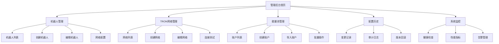

# 配置管理迁移产品需求文档

## 1. 产品概述

本项目旨在将TRON能量租赁系统中的Telegram机器人配置和TRON网络配置从环境变量文件迁移到管理后台，实现动态配置管理和多实例支持。

通过管理后台界面，管理员可以方便地添加、修改和管理多个Telegram机器人和TRON网络环境，支持主网、Shasta测试网和Nile测试网的灵活切换，提升系统的可维护性和扩展性。

该功能将显著提升运营效率，降低配置错误风险，并为后续的多租户和多区域部署奠定基础。

## 2. 核心功能

### 2.1 用户角色

| 角色 | 注册方法 | 核心权限 |
|------|----------|----------|
| 超级管理员 | 系统预设账户 | 拥有所有配置管理权限，包括创建、修改、删除机器人和网络配置 |
| 配置管理员 | 超级管理员邀请 | 可以管理机器人配置和网络配置，但不能删除关键配置 |
| 运维人员 | 管理员邀请 | 可以查看配置状态、执行健康检查和同步操作 |

### 2.2 功能模块

本配置管理系统包含以下主要页面：

1. **机器人管理页面**：机器人列表展示、机器人创建编辑、网络关联配置、状态监控
2. **TRON网络管理页面**：网络配置列表、网络参数设置、连接测试、合约地址管理
3. **能量池管理页面**：能量池账户列表、账户导入创建、余额同步、批量操作
4. **配置历史页面**：配置变更记录、操作审计、版本回滚
5. **系统监控页面**：健康状态检查、性能指标、告警管理

### 2.3 页面详情

| 页面名称 | 模块名称 | 功能描述 |
|----------|----------|----------|
| 机器人管理页面 | 机器人列表 | 展示所有机器人卡片，包含状态、统计信息、关联网络等信息 |
| 机器人管理页面 | 机器人表单 | 创建和编辑机器人配置，包含基本信息、Webhook配置、网络关联、安全设置 |
| 机器人管理页面 | 网络配置 | 管理机器人与TRON网络的关联关系，设置主要网络和能量池分配 |
| 机器人管理页面 | 状态监控 | 实时显示机器人健康状态、连接测试、用户活跃度统计 |
| TRON网络管理页面 | 网络列表 | 展示所有TRON网络配置，包含主网和测试网信息 |
| TRON网络管理页面 | 网络表单 | 创建和编辑网络配置，设置节点地址、API密钥、合约地址等 |
| TRON网络管理页面 | 连接测试 | 测试网络连接状态，验证节点可用性和API密钥有效性 |
| TRON网络管理页面 | 合约管理 | 管理各网络下的智能合约地址，支持USDT、USDC等代币合约 |
| 能量池管理页面 | 账户列表 | 展示所有能量池账户，包含余额信息、网络归属、状态等 |
| 能量池管理页面 | 账户表单 | 创建新账户或导入现有账户，设置账户名称、私钥、网络等 |
| 能量池管理页面 | 余额同步 | 同步账户余额信息，包含TRX余额、能量、带宽等资源 |
| 能量池管理页面 | 批量操作 | 支持批量启用、停用、同步等操作，提升管理效率 |
| 配置历史页面 | 变更记录 | 显示所有配置变更历史，包含操作人、时间、变更内容等 |
| 配置历史页面 | 审计日志 | 详细的操作审计信息，支持按时间、操作人、表名等筛选 |
| 配置历史页面 | 版本回滚 | 支持将配置回滚到历史版本，确保系统稳定性 |
| 系统监控页面 | 健康检查 | 检查数据库连接、缓存状态、机器人健康等系统状态 |
| 系统监控页面 | 性能指标 | 展示配置加载时间、缓存命中率、API响应时间等指标 |
| 系统监控页面 | 告警管理 | 配置和管理系统告警规则，及时发现和处理异常 |

## 3. 核心流程

### 3.1 管理员操作流程

管理员登录系统后，可以通过导航菜单访问各个配置管理模块。在机器人管理中，管理员可以查看现有机器人列表，点击"添加机器人"创建新的机器人配置，填写机器人名称、Token、Webhook配置等信息，并选择关联的TRON网络和能量池。在TRON网络管理中，管理员可以添加新的网络配置，设置节点地址、API密钥等参数，并测试连接状态。在能量池管理中，管理员可以导入现有账户或创建新账户，设置账户参数并进行余额同步。

### 3.2 配置变更流程

当管理员修改任何配置时，系统会自动记录变更历史，包含变更前后的值、操作人、操作时间等信息。配置变更后，系统会清除相关缓存并通知相关服务重新加载配置。对于关键配置的变更，系统会发送告警通知，确保运维人员及时了解变更情况。

### 3.3 故障处理流程

当系统检测到配置异常或服务故障时，运维人员可以通过系统监控页面查看详细的错误信息和健康状态。如果需要回滚配置，可以在配置历史页面选择目标版本进行回滚操作。系统会自动验证回滚操作的安全性，并记录回滚日志。

## 4. 用户界面设计

### 4.1 设计风格

- **主色调**：#409EFF（Element Plus 主蓝色）、#67C23A（成功绿色）
- **辅助色**：#E6A23C（警告橙色）、#F56C6C（危险红色）、#909399（信息灰色）
- **按钮样式**：圆角按钮，支持不同尺寸（large、default、small）
- **字体**：系统默认字体栈，主要文字14px，标题16-20px，小字12px
- **布局风格**：卡片式布局，左侧导航栏，顶部面包屑导航
- **图标风格**：Element Plus 内置图标，简洁现代风格

### 4.2 页面设计概览

| 页面名称 | 模块名称 | UI元素 |
|----------|----------|--------|
| 机器人管理页面 | 机器人列表 | 卡片式布局，每个机器人一张卡片，包含头像、名称、状态标签、统计数据、操作按钮。使用栅格系统响应式布局，支持筛选和搜索 |
| 机器人管理页面 | 机器人表单 | 分步骤表单，包含基本信息、Webhook配置、网络关联、安全设置四个步骤。使用Element Plus表单组件，支持实时验证 |
| TRON网络管理页面 | 网络列表 | 表格布局，显示网络名称、类型、状态、统计信息等。支持行内编辑和批量操作，使用不同颜色标识主网和测试网 |
| TRON网络管理页面 | 网络表单 | 单页表单，包含网络基本信息、节点配置、合约地址等。使用折叠面板组织内容，支持配置模板 |
| 能量池管理页面 | 账户列表 | 表格布局，显示账户信息、余额、状态等。支持余额实时刷新，使用进度条显示能量使用情况 |
| 能量池管理页面 | 账户表单 | 标签页布局，分为创建新账户和导入现有账户两个标签。支持私钥安全输入和地址验证 |
| 配置历史页面 | 变更记录 | 时间线布局，按时间倒序显示配置变更。支持展开查看详细变更内容，使用不同颜色标识操作类型 |
| 系统监控页面 | 健康检查 | 仪表盘布局，使用卡片和图表展示系统状态。支持实时刷新，使用红绿灯颜色标识健康状态 |

### 4.3 响应式设计

系统采用桌面优先的响应式设计，主要针对管理员在PC端的使用场景。在平板设备上，侧边栏会自动折叠，主要内容区域自适应宽度。在移动设备上，导航栏会转换为顶部菜单，表格会转换为卡片式布局，确保在小屏幕上的可用性。所有交互元素都支持触摸操作，按钮和链接的点击区域不小于44px。

## 5. 技术要求

### 5.1 前端技术栈

- **框架**：Vue.js 3.x + Composition API
- **UI组件库**：Element Plus
- **状态管理**：Pinia
- **路由管理**：Vue Router 4.x
- **HTTP客户端**：Axios
- **构建工具**：Vite
- **类型检查**：TypeScript
- **代码规范**：ESLint + Prettier

### 5.2 后端技术栈

- **运行环境**：Node.js 18.x
- **Web框架**：Express.js 4.x
- **数据库**：PostgreSQL 14.x
- **ORM框架**：Sequelize
- **缓存**：Redis 7.x
- **身份认证**：JWT
- **API文档**：Swagger/OpenAPI
- **日志记录**：Winston

### 5.3 安全要求

- **数据加密**：敏感信息使用AES-256-GCM加密存储
- **传输安全**：所有API接口使用HTTPS
- **身份验证**：JWT Token + 刷新Token机制
- **权限控制**：基于角色的访问控制（RBAC）
- **审计日志**：记录所有配置变更和敏感操作
- **输入验证**：前后端双重数据验证
- **SQL注入防护**：使用参数化查询
- **XSS防护**：输出内容转义和CSP策略

### 5.4 性能要求

- **页面加载时间**：首屏加载时间不超过2秒
- **API响应时间**：95%的API请求响应时间不超过500ms
- **并发支持**：支持至少100个并发用户
- **缓存策略**：配置数据缓存5-10分钟，静态资源缓存1小时
- **数据库性能**：查询响应时间不超过100ms
- **内存使用**：单个页面内存占用不超过100MB

## 6. 验收标准

### 6.1 功能验收

- [ ] 能够成功创建、编辑、删除Telegram机器人配置
- [ ] 能够成功创建、编辑、删除TRON网络配置
- [ ] 能够成功创建、导入、管理能量池账户
- [ ] 机器人与网络关联配置正常工作
- [ ] 配置变更能够实时生效，无需重启服务
- [ ] 配置历史记录完整，支持版本回滚
- [ ] 系统监控功能正常，能够准确反映系统状态
- [ ] 权限控制有效，不同角色只能访问授权功能

### 6.2 性能验收

- [ ] 页面加载时间符合要求
- [ ] API响应时间符合要求
- [ ] 并发用户数符合要求
- [ ] 内存使用量在合理范围内
- [ ] 数据库查询性能符合要求

### 6.3 安全验收

- [ ] 敏感信息加密存储
- [ ] 身份认证和权限控制有效
- [ ] 审计日志记录完整
- [ ] 输入验证和输出转义正确
- [ ] 无SQL注入和XSS漏洞
- [ ] HTTPS传输加密正常

### 6.4 兼容性验收

- [ ] 支持Chrome、Firefox、Safari、Edge等主流浏览器
- [ ] 在不同屏幕尺寸下显示正常
- [ ] 移动设备上的触摸操作正常
- [ ] 与现有系统集成无冲突

## 7. 项目里程碑

### 7.1 第一阶段：数据库设计和后端API（2周）

- 完成数据库表结构设计
- 实现配置管理相关API接口
- 完成数据迁移脚本
- 实现配置缓存和通知机制

### 7.2 第二阶段：前端界面开发（3周）

- 完成机器人管理界面
- 完成TRON网络管理界面
- 完成能量池管理界面
- 实现配置表单和验证逻辑

### 7.3 第三阶段：系统集成和测试（2周）

- 完成前后端集成
- 实现配置历史和监控功能
- 进行功能测试和性能测试
- 完成安全测试和漏洞扫描

### 7.4 第四阶段：部署和上线（1周）

- 完成生产环境部署
- 执行数据迁移
- 进行用户培训
- 监控系统稳定性

## 8. 风险评估

### 8.1 技术风险

- **数据迁移风险**：现有配置数据迁移可能出现数据丢失或格式错误
- **性能风险**：大量配置数据可能影响系统性能
- **兼容性风险**：新系统与现有服务的集成可能出现兼容性问题

### 8.2 业务风险

- **服务中断风险**：配置迁移过程中可能导致服务暂时中断
- **用户体验风险**：新界面可能需要用户适应期
- **数据安全风险**：敏感配置信息的安全性需要特别关注

### 8.3 风险缓解措施

- 制定详细的数据迁移计划和回滚方案
- 进行充分的测试，包括功能测试、性能测试、安全测试
- 采用灰度发布策略，逐步切换到新系统
- 提供详细的用户手册和培训
- 建立完善的监控和告警机制
- 制定应急响应预案