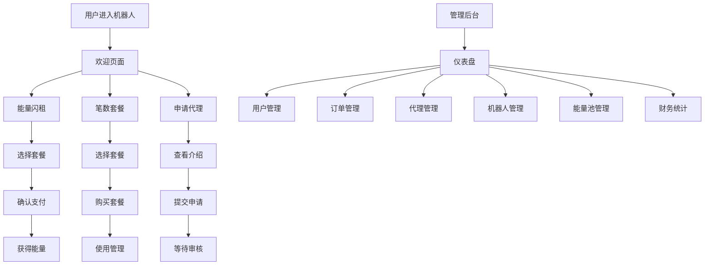

## 1. 产品概述

基于Telegram机器人的TRON能量租赁服务系统，为用户提供便捷的TRON网络能量租赁服务，支持多机器人管理和统一能量池调度。

系统解决TRON网络用户在进行TRC20代币转账时能量不足的问题，通过自动化的能量租赁服务降低用户交易成本，同时为平台提供稳定的收益来源。

目标市场价值：服务于日均数万笔TRON网络交易的用户群体，预计可覆盖90%以上的能量租赁需求场景。

## 2. 核心功能

### 2.1 用户角色

| 角色   | 注册方式         | 核心权限            |
| ---- | ------------ | --------------- |
| 普通用户 | Telegram直接使用 | 能量租赁、套餐购买、查看订单  |
| 代理用户 | 申请审核通过       | 推广返佣、下级管理、收益查看  |
| 管理员  | 系统分配         | 全系统管理、数据统计、配置修改 |

### 2.2 功能模块

我们的TRON能量租赁系统包含以下主要页面：

1. **欢迎页面**：机器人介绍、主菜单导航、品牌展示
2. **能量闪租页面**：套餐选择、价格展示、充值确认、转账信息
3. **笔数套餐页面**：套餐对比、购买流程、使用记录管理
4. **申请代理页面**：代理介绍、收益展示、申请流程引导
5. **管理后台**：用户管理、订单管理、代理管理、机器人管理、能量池管理、财务统计

### 2.3 页面详情

| 页面名称   | 模块名称  | 功能描述                    |
| ------ | ----- | ----------------------- |
| 欢迎页面   | 机器人介绍 | 展示服务介绍、使用指南、联系方式        |
| 欢迎页面   | 主菜单   | 提供快速导航按钮，包含所有核心功能入口     |
| 欢迎页面   | 品牌信息  | 显示平台Logo、口号、信任标识        |
| 能量闪租页面 | 套餐选择  | 展示不同能量数量的租赁套餐，包含价格、时长信息 |
| 能量闪租页面 | 充值确认  | 生成订单、显示转账地址、二维码支付       |
| 能量闪租页面 | 价格卡片  | 动态显示当前能量价格、优惠信息、推荐套餐    |
| 笔数套餐页面 | 套餐购买  | 提供按交易笔数计费的套餐选择和购买       |
| 笔数套餐页面 | 使用管理  | 查看已购套餐、剩余次数、使用历史        |
| 笔数套餐页面 | 套餐对比  | 对比不同套餐的性价比、适用场景         |
| 申请代理页面 | 代理介绍  | 说明代理政策、收益模式、申请条件        |
| 申请代理页面 | 申请流程  | 引导用户完成代理申请、资料提交         |
| 申请代理页面 | 收益展示  | 展示代理收益计算、提现方式           |
| 管理后台   | 用户管理  | 用户信息查看、状态管理、权限设置        |
| 管理后台   | 订单管理  | 订单查询、状态跟踪、异常处理          |
| 管理后台   | 代理管理  | 代理审核、等级管理、佣金设置          |
| 管理后台   | 机器人管理 | 多机器人配置、权限分配、性能监控        |
| 管理后台   | 能量池管理 | 库存监控、供应商管理、成本分析         |
| 管理后台   | 财务统计  | 收入统计、成本分析、利润报表          |

## 3. 核心流程

### 普通用户流程

用户通过Telegram进入机器人 → 选择能量闪租或笔数套餐 → 选择合适的套餐 → 确认订单并支付 → 系统自动分配能量 → 完成交易

### 代理用户流程

用户申请代理 → 管理员审核通过 → 获得推广链接 → 推广用户使用服务 → 获得佣金收益 → 申请提现

### 管理员流程

登录管理后台 → 查看系统概况 → 处理用户申请和异常订单 → 管理能量池库存 → 分析财务数据 → 优化系统配置

## 4. 用户界面设计

### 4.1 设计风格

#### Telegram机器人端

Telegram机器人端主要按照官方接口规范进行配置，重点关注消息模板和菜单的设置，确保与Telegram平台的原生体验保持一致。

#### 管理后台（响应式网页端）

采用现代化暗色主题的响应式设计，具体规范如下：

* **主色调**：深黑色(#0a0a0a)作为主背景色，亮绿色(#00ff88)作为强调色和交互元素色

* **辅助色调**：深灰色(#1a1a1a)作为卡片背景，中灰色(#2a2a2a)作为边框色，浅绿色(#4ade80)作为次要强调色

* **按钮风格**：现代化圆角按钮，主要按钮使用绿色渐变(#00ff88到#4ade80)，支持发光悬停效果和流畅动画反馈

* **字体**：现代无衬线字体(Inter/SF Pro Display)，标题使用18-24px加粗，正文使用14-16px，代码字体使用JetBrains Mono

* **布局风格**：暗色左侧导航栏配绿色激活状态 + 深色主内容区域，采用现代化卡片式布局，支持微妙阴影和边框发光效果

* **图标风格**：使用现代化线性图标，支持绿色主题适配，激活状态带有绿色发光效果

### 4.2 页面设计概览

| 页面名称   | 模块名称  | UI元素                          |
| ------ | ----- | ----------------------------- |
| 欢迎页面   | 机器人介绍 | 品牌Logo、渐变背景、卡片布局、动画效果         |
| 欢迎页面   | 主菜单   | Inline Keyboard按钮组、图标+文字、网格布局 |
| 能量闪租页面 | 套餐选择  | 价格卡片、推荐标签、对比表格、立即购买按钮         |
| 能量闪租页面 | 充值确认  | 二维码展示、倒计时器、复制按钮、支付状态          |
| 笔数套餐页面 | 套餐对比  | 表格对比、高亮推荐、性价比标签、购买引导          |
| 申请代理页面 | 收益展示  | 收益计算器、图表展示、案例说明、申请表单          |
| 管理后台   | 仪表盘   | 数据卡片、图表组件、快捷操作、实时更新           |
| 管理后台   | 数据表格  | 分页表格、筛选搜索、批量操作、导出功能           |

