# TRON网络TRX质押机制详细文档

## 目录
1. [质押机制概述](#质押机制概述)
2. [质押操作流程](#质押操作流程)
3. [资源类型详解](#资源类型详解)
4. [代理资源机制](#代理资源机制)
5. [解质押机制](#解质押机制)
6. [投票权与奖励](#投票权与奖励)
7. [经济模型分析](#经济模型分析)
8. [实际应用场景](#实际应用场景)
9. [注意事项与风险](#注意事项与风险)
10. [API接口说明](#api接口说明)

---

## 质押机制概述

### 基本概念
在TRON网络中，用户可以通过**质押（冻结）TRX**来获取网络资源和治理权限。质押机制是TRON网络资源分配和治理参与的核心机制。

### 质押收益
- **网络资源**：带宽（Bandwidth）或能量（Energy）
- **投票权**：TRON Power（TP），1 TRX = 1 TP
- **投票奖励**：参与超级代表选举获得的奖励

### 质押特点
- **立即生效**：质押完成后立即获得资源和投票权
- **锁定期**：解质押需要14天等待期
- **灵活性**：可以代理资源给其他账户
- **可撤销**：随时可以发起解质押操作

---

## 质押操作流程

### 质押流程图

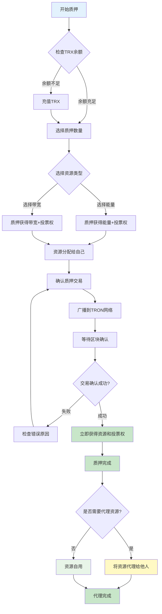

### 1. 质押前准备
```
前提条件：
- 拥有足够的TRX余额
- 账户已激活
- 选择合适的资源类型
```

### 2. 质押操作步骤
```
步骤1：选择质押数量
步骤2：选择资源类型（带宽 或 能量）
步骤3：确认质押交易（资源只能分配给自己）
步骤4：等待区块确认
步骤5：质押完成后可代理资源给他人
```

### 3. 质押结果验证
```
验证内容：
- 资源数量是否正确增加
- 投票权是否对应增加
- TRX余额是否正确减少
```

---

## 资源类型详解

### 资源类型对比图

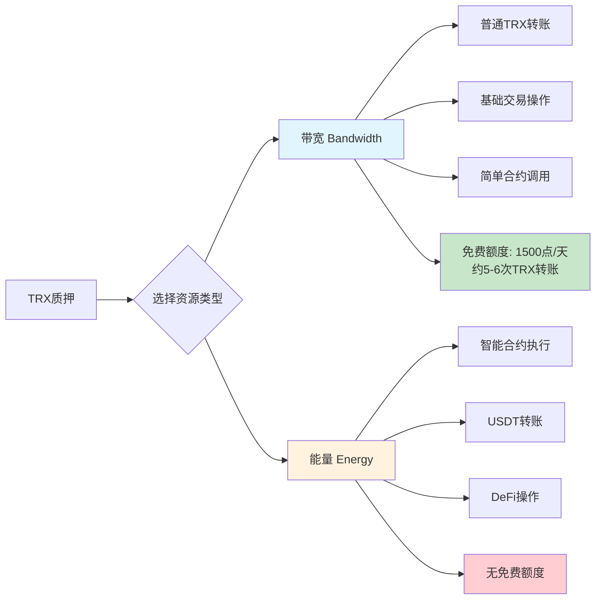

### 带宽消耗对比图

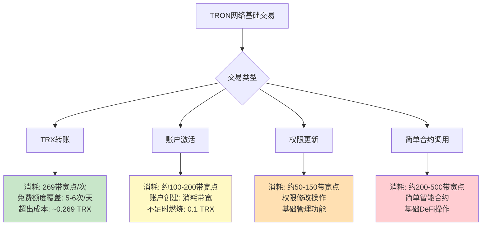

### 能量消耗对比图

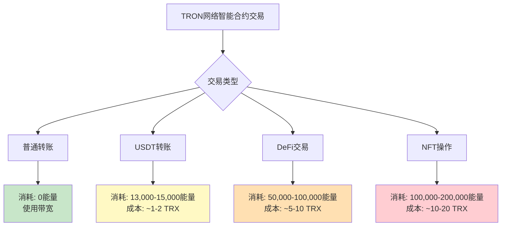

### 带宽 vs 能量消耗对比表

| 交易类型 | 带宽消耗 | 能量消耗 | 免费额度 | 超出成本 |
|---------|---------|---------|----------|----------|
| **TRX转账** | ✅ 269点/次 | ❌ 0 | ✅ 1500点/天 | ~0.269 TRX |
| **账户激活** | ✅ 100-200点 | ❌ 0 | ✅ 1500点/天 | ~0.1 TRX |
| **权限更新** | ✅ 50-150点 | ❌ 0 | ✅ 1500点/天 | ~0.05-0.15 TRX |
| **USDT转账** | ✅ 少量 | ✅ 13,000-15,000点 | ❌ 无免费能量 | ~1-2 TRX |
| **DeFi交易** | ✅ 少量 | ✅ 50,000-100,000点 | ❌ 无免费能量 | ~5-10 TRX |
| **NFT操作** | ✅ 少量 | ✅ 100,000-200,000点 | ❌ 无免费能量 | ~10-20 TRX |

### 资源使用策略建议

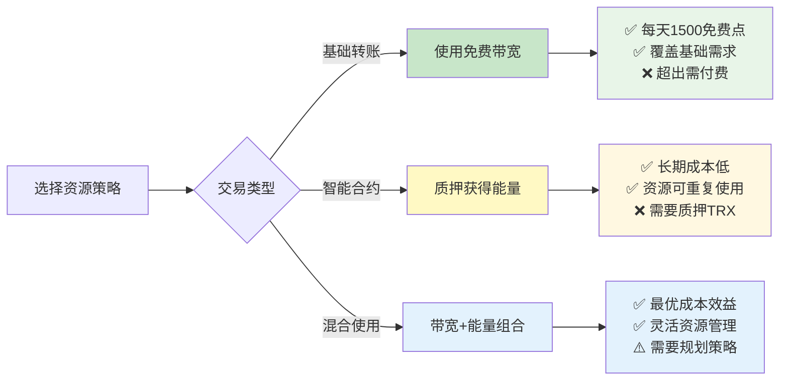

### 带宽（Bandwidth）

#### 免费额度详解
```
官方免费带宽额度：
✅ 每个账户每天获得1500免费带宽点
✅ 每24小时自动重置
✅ 无需质押即可使用
✅ 覆盖基础TRX转账需求

实际使用情况：
- TRX转账：约269带宽点/次
- 1500点可覆盖：约5-6次TRX转账
- 超出免费额度：需要质押或燃烧TRX
```

#### 用途
- **普通TRX转账**：账户间TRX转移
- **基础交易操作**：激活账户、更新账户权限等
- **简单智能合约调用**：消耗较少的合约操作

#### 消耗特点
- **免费额度**：每个账户每天有1500带宽的免费额度
- **消耗计算**：基于交易字节大小计算（当前费率：1字节 = 1带宽点）
- **恢复机制**：每24小时重置到满额
- **实际覆盖**：1500点可覆盖约5-6次TRX转账（每次约269点）

#### 获取比例
```
质押获取带宽的具体比例：
- 1 TRX ≈ 获取带宽数量（动态变化）
- 受全网质押总量影响
- 通常1 TRX可获得数千个带宽点
```

#### 带宽消耗优先级
```
官方消耗顺序：
1. 质押获得的带宽点
2. 免费带宽点（1500/天）
3. 燃烧TRX获得带宽点

重要说明：
- 质押带宽优先消耗
- 免费额度作为备用
- 超出免费额度才燃烧TRX
```

### 能量（Energy）

#### 用途
- **智能合约执行**：DeFi协议交互、NFT操作
- **USDT转账**：TRC20代币转账
- **复杂合约调用**：需要大量计算的操作

#### 消耗特点
- **无免费额度**：没有免费的能量额度
- **消耗计算**：基于合约执行的计算复杂度
- **恢复机制**：每24小时重置到满额

#### 典型消耗量
```
常见操作的能量消耗：
- USDT转账：约13,000-15,000能量
- Uniswap交易：约50,000-100,000能量
- NFT铸造：约100,000-200,000能量
- 简单合约调用：约10,000-30,000能量
```

#### 获取比例
```
质押获取能量的具体比例：
- 1 TRX ≈ 获取能量数量（动态变化）
- 受全网质押总量影响
- 主网：通常1 TRX可获得10-15个能量
- 测试网：比例可能更高
```

---

## 代理资源机制

### ⚠️ 重要概念澄清

#### 质押 ≠ 代理
```
质押操作：
✅ 只能质押给自己
✅ 质押后资源归自己使用
✅ 获得投票权

代理操作：
✅ 质押完成后才能代理
✅ 将已获得的资源代理给他人
✅ 代理后资源归他人使用
❌ 投票权不可代理
```

#### 正确的操作顺序
```
1. 质押TRX给自己 → 获得资源和投票权
2. 使用资源或代理给他人
3. 代理后资源归接收方使用
4. 可以随时取消代理（考虑时间锁）
```

### 代理机制架构图

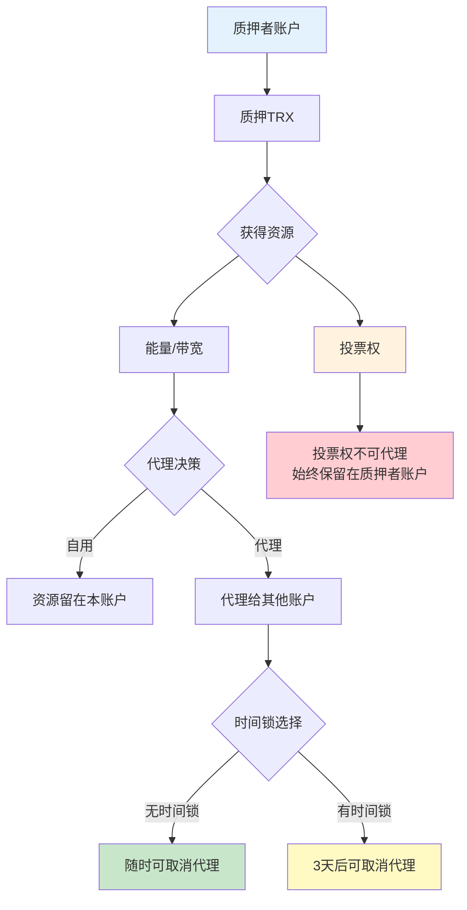

### 代理资源流程图

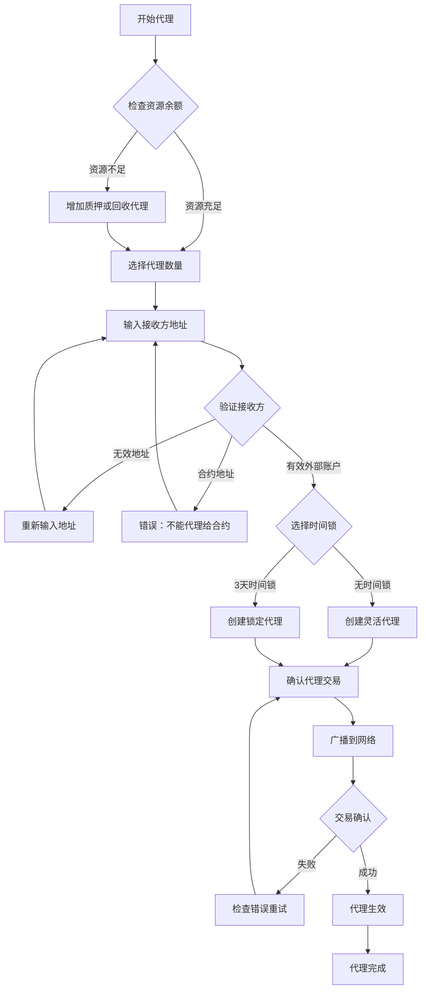

### 质押与代理的正确流程

#### 第一步：质押给自己
```
质押操作：
- 质押TRX到自己账户
- 获得能量/带宽资源
- 获得投票权
- 资源只能分配给自己
```

#### 第二步：代理给他人
```
代理操作：
- 将已获得的资源代理给其他账户
- 代理后资源归接收方使用
- 投票权仍保留在质押者账户
- 可以随时取消代理（考虑时间锁）
```

### 代理规则

#### 可代理资源对比表

| 资源类型 | 是否可代理 | 代理后归属 | 备注 |
|---------|-----------|----------|------|
| 🔋 **能量** | ✅ 可以 | 接收方账户 | 最常用的代理类型 |
| 📶 **带宽** | ✅ 可以 | 接收方账户 | 适合普通转账需求 |
| 🗳️ **投票权** | ❌ 不可以 | 质押者账户 | 始终保留在原账户 |

#### 代理对象限制
- ✅ **已激活的外部账户**：可以接收代理
- ❌ **智能合约地址**：不能接收代理
- ❌ **未激活账户**：不能接收代理

### 时间锁机制对比

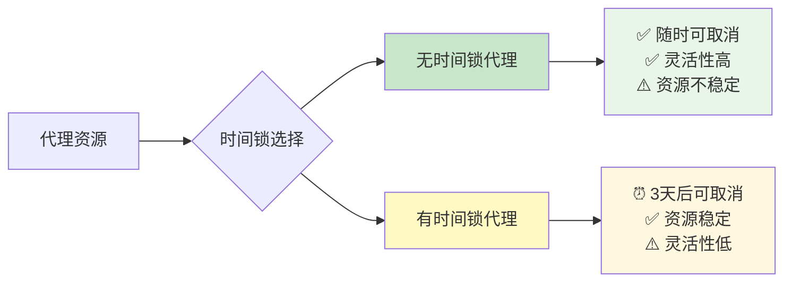

#### 无时间锁代理
```
特点：
- 随时可以取消代理
- 灵活性高
- 适合短期资源借用
```

#### 有时间锁代理
```
特点：
- 需要等待3天才能取消代理
- 重复代理会重置3天等待期
- 适合长期稳定的资源分配
```

### 代理操作流程
```
代理资源：
1. 选择要代理的资源类型和数量
2. 指定接收代理的账户地址
3. 选择是否启用时间锁
4. 确认代理交易

取消代理：
1. 选择要取消的代理记录
2. 检查时间锁状态
3. 确认取消代理交易
4. 等待资源回收
```

### 🔄 取消代理后的能量回收机制

#### **重要：取消代理的完整流程**

##### **代理资源的状态变化**
```
代理期间：
✅ 资源归接收方使用
✅ 接收方消耗能量/带宽
✅ 质押者保留投票权
✅ 质押者获得投票奖励

取消代理后：
✅ 资源立即返回质押者账户
✅ 质押者可以重新使用资源
✅ 代理关系完全解除
✅ 接收方无法继续使用
```

#### **能量回收的实际情况**

##### **如果代理用户用完了能量**
```
情况分析：
❌ 能量已经被消耗完毕
❌ 无法回收已消耗的能量
✅ 但可以回收剩余的能量
✅ 资源池会重新计算

具体说明：
- 已消耗的能量：无法回收（已经使用）
- 未消耗的能量：立即返回质押者
- 资源总量：等于质押TRX对应的资源量
- 回收效果：恢复到质押时的资源状态
```

##### **能量回收的优先级**
```
回收优先级：
1. 质押获得的能量：优先回收
2. 免费带宽：每天1500点自动重置
3. 代理资源：按比例回收

重要说明：
- 已消耗的资源无法回收
- 只能回收当前可用的资源
- 资源总量由质押TRX数量决定
```

#### **具体回收示例**

##### **场景1：代理用户完全用完能量**
```
初始状态：
质押1000 TRX → 获得14000能量/天
代理给用户A：14000能量

用户A使用情况：
- 消耗了14000能量
- 能量池已空

取消代理后：
✅ 能量池立即恢复
✅ 每天重新获得14000能量
✅ 用户A无法继续使用
❌ 已消耗的能量无法回收
```

##### **场景2：代理用户部分使用能量**
```
初始状态：
质押1000 TRX → 获得14000能量/天
代理给用户A：14000能量

用户A使用情况：
- 消耗了8000能量
- 剩余6000能量

取消代理后：
✅ 立即回收6000能量
✅ 每天重新获得14000能量
✅ 用户A无法继续使用
❌ 已消耗的8000能量无法回收
```

#### **时间锁对回收的影响**

##### **无时间锁代理**
```
取消机制：
✅ 随时可以取消代理
✅ 资源立即返回
✅ 无等待期
✅ 灵活性最高
```

##### **有时间锁代理**
```
取消机制：
⏰ 需要等待3天时间锁到期
⏰ 3天内无法取消代理
⏰ 到期后可以立即取消
⚠️ 重复代理会重置3天等待期
```

#### **资源回收的详细机制**

##### **资源池重新计算**
```
取消代理后：
1. 系统重新计算可用资源
2. 资源池恢复到质押状态
3. 每天24小时自动恢复
4. 质押者可以重新使用或代理

资源分配：
- 质押获得的资源：完全恢复
- 免费资源：按规则分配
- 代理关系：完全解除
```

##### **接收方状态变化**
```
接收方影响：
❌ 立即失去代理的资源
❌ 无法继续使用这些资源
❌ 需要自己的资源或重新获得代理
⚠️ 正在进行的交易可能失败
```

#### **取消代理的时机选择**

##### **什么情况下适合取消代理**

###### **立即取消的情况**
```
✅ 接收方不再需要资源
✅ 想要自己使用资源
✅ 需要代理给其他用户
✅ 准备解质押
✅ 无时间锁的代理
```

###### **等待时间锁的情况**
```
⏰ 代理设置了3天时间锁
⏰ 需要等待时间锁到期
⏰ 期间无法取消代理
⏰ 接收方可以继续使用
```

##### **取消代理的最佳实践**
```
操作建议：
1. 评估接收方的资源需求
2. 选择合适的取消时机
3. 考虑时间锁的影响
4. 准备替代资源方案
5. 监控资源使用情况
```

#### **取消代理的注意事项**

##### **重要提醒**
```
注意事项：
⚠️ 已消耗的资源无法回收
⚠️ 接收方可能正在使用资源
⚠️ 突然取消可能影响用户体验
⚠️ 时间锁期间无法取消
⚠️ 需要重新规划资源分配
```

##### **风险控制**
```
风险控制：
✅ 提前通知接收方
✅ 选择合适的取消时机
✅ 准备替代资源方案
✅ 监控资源使用状态
✅ 避免影响重要操作
```

---

## 解质押机制

### 解质押完整流程图

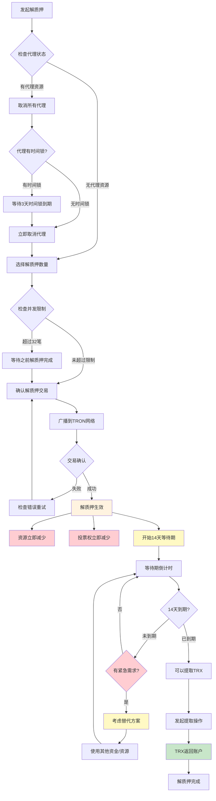

### 解质押时间轴

```mermaid
gantt
    title 解质押时间轴（以100 TRX为例）
    dateFormat  X
    axisFormat %d天
    
    section 准备阶段
    取消代理（如有）    :done, prepare, 0, 3
    
    section 解质押阶段
    发起解质押        :done, unfreeze, 3, 4
    资源立即减少      :done, resource, 4, 4
    投票权立即减少    :done, vote, 4, 4
    
    section 等待期
    14天锁定期       :active, waiting, 4, 18
    
    section 提取阶段
    可以提取TRX      :withdraw, 18, 19
    完成提取         :done, complete, 19, 19
```

### 解质押流程

#### 1. 发起解质押
```
操作步骤：
- 选择要解质押的TRX数量
- 确认解质押交易
- 等待区块确认
```

#### 2. 等待期规则
```
等待时间：14天（固定）
等待期间：
- TRX被锁定，无法使用
- 相应资源立即减少
- 投票权立即减少
```

#### 3. 提取TRX
```
提取条件：
- 等待期满14天
- 发起提取操作
- 支付少量手续费
```

### 解质押限制

#### 代理资源限制流程图

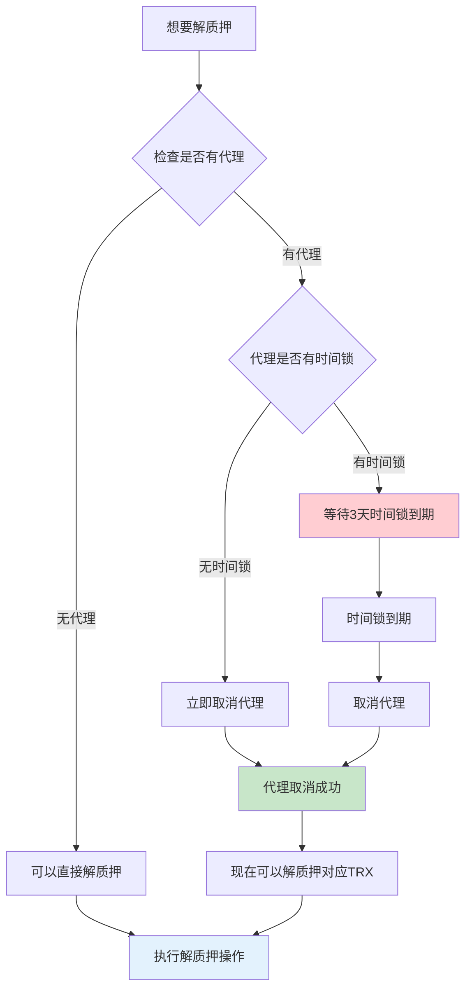

#### 代理资源限制
```
已代理资源无法解质押：
- 必须先取消代理
- 等待代理取消确认
- 然后才能解质押对应的TRX
```

#### 并发限制
```
同时解质押限制：
- 最多可同时进行32笔解质押操作
- 超过限制需要等待之前的解质押完成
```

### 14天等待期详解

#### 等待期机制说明
```
等待期特点：
- 固定14天，无法缩短
- 这是TRON网络的硬性规定
- 目的是防止恶意质押攻击
- 确保网络稳定性
```

#### 等待期内的状态
```
等待期间：
✅ 可以发起新的解质押操作
✅ 可以查看解质押进度
❌ 无法提前提取TRX
❌ 无法取消解质押操作
❌ 无法使用被锁定的TRX
```

### 提前解质押的可能性

#### ❌ 官方渠道无法提前
```
重要说明：
- TRON官方不支持提前解质押
- 14天等待期是网络协议层面的硬性规定
- 无法通过任何官方渠道绕过
- 这是为了维护网络安全性
```

#### 🔄 替代解决方案

##### 1. 资源代理优化
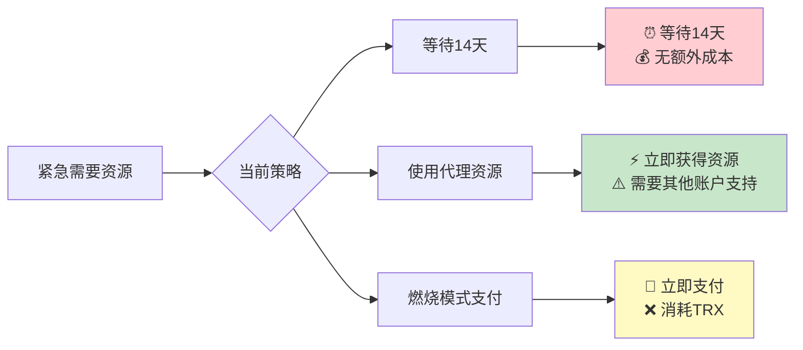

##### 2. 分批质押策略
```
分批质押优势：
- 避免一次性锁定大量资金
- 可以根据需求逐步解质押
- 保持资金流动性
- 降低风险集中度

建议策略：
质押1000 TRX → 分10次，每次100 TRX
解质押时 → 每3-4天发起一次
结果 → 从第14天开始，每天都有TRX可用
```

##### 3. 第三方平台服务
```
第三方服务（需谨慎选择）：
- 资源租赁平台
- 质押池服务
- 流动性提供者

注意事项：
⚠️ 评估平台安全性
⚠️ 了解服务费用
⚠️ 确认是否合规
⚠️ 避免资金损失风险
```

### 解质押代价与影响分析

#### ⚠️ 解质押的完整代价

虽然可以随时发起解质押操作，但确实有重要的代价和影响：

##### 1. **立即失去资源**
```
解质押生效后：
❌ 能量/带宽立即减少
❌ 投票权立即减少
❌ 无法继续使用这些资源
```

##### 2. **14天资金锁定**
```
重要代价：
⏰ 必须等待14天才能取回TRX
💰 资金完全无法使用
🔒 无法转账、交易或重新质押
```

##### 3. **失去投票奖励**
```
投票权影响：
❌ 解质押后投票权立即消失
❌ 无法继续获得投票奖励
❌ 失去网络治理参与权
```

#### 🔍 解质押的完整代价分析

##### **资源损失（立即生效）**
```
质押100 TRX获得1400能量：
解质押后 → 能量立即变为0
结果 → 无法进行USDT转账等操作
影响 → 需要重新质押或燃烧TRX支付
```

##### **投票权损失（立即生效）**
```
质押100 TRX获得100投票权：
解质押后 → 投票权立即变为0
结果 → 无法参与超级代表投票
影响 → 失去投票奖励收益
```

##### **流动性损失（14天）**
```
资金锁定期间：
❌ 无法应对市场机会
❌ 无法进行紧急交易
❌ 错过可能的投资机会
```

#### 🎯 解质押的替代方案

##### **1. 资源代理（推荐）**
```
优势：
✅ 保持质押状态
✅ 资源给他人使用
✅ 保留投票权
✅ 随时可取消代理
```

##### **2. 分批质押策略**
```
策略：
质押1000 TRX → 分10次，每次100 TRX
解质押时 → 每3-4天发起一次
结果 → 从第14天开始，每天都有TRX可用
```

##### **3. 燃烧模式支付**
```
适用场景：
✅ 偶尔使用
✅ 资金流动性要求高
✅ 不想锁定资金
```

#### 📊 解质押决策建议

##### **什么情况下适合解质押？**
```
✅ 长期不使用TRON网络
✅ 需要大量资金应对紧急情况
✅ 对TRX价格看跌，想要止损
✅ 找到了更好的投资机会
```

##### **什么情况下不适合解质押？**
```
❌ 只是暂时不需要资源
❌ 想要保持投票奖励
❌ 资金需求不紧急
❌ 计划继续使用TRON网络
```

#### 💰 解质押成本效益分析

##### **成本计算**
```
解质押100 TRX的成本：
1. 立即失去1400能量/天
2. 失去100投票权
3. 14天资金锁定
4. 重新质押的手续费
```

##### **收益分析**
```
解质押的收益：
1. 14天后取回TRX
2. 资金流动性恢复
3. 可能的投资机会
```

#### 📋 解质押最佳实践

##### **操作前准备**
```
检查清单：
□ 确认解质押数量
□ 检查是否有代理资源
□ 评估14天等待期影响
□ 准备替代资金方案
□ 了解网络当前状态
```

##### **操作中注意**
```
操作要点：
- 仔细核对地址和数量
- 确保有足够手续费
- 记录交易哈希
- 监控交易状态
- 保存操作记录
```

##### **操作后管理**
```
后续管理：
- 设置提醒（14天后提取）
- 监控解质押进度
- 准备提取操作
- 评估下次质押策略
- 总结经验教训
```

### 解质押操作要求

#### 基本要求
```
账户要求：
✅ 账户必须已激活
✅ 有足够的TRX进行质押
✅ 账户未被冻结或限制

技术要求：
✅ 正确的API调用格式
✅ 足够的带宽/能量支付手续费
✅ 网络连接稳定
```

#### 参数要求
```
必需参数：
- owner_address: 质押者地址（hex格式）
- unfreeze_balance: 解质押数量（sun单位）
- resource: 资源类型（"ENERGY" 或 "BANDWIDTH"）

可选参数：
- permission_id: 权限ID（多签账户）
- visible: 是否返回可见格式地址
```

#### 数量限制
```
解质押数量限制：
✅ 不能超过已质押的数量
✅ 不能超过账户余额
✅ 不能超过网络参数限制

并发限制：
✅ 最多32笔同时解质押
✅ 超过限制需要等待
✅ 建议分批操作
```

### 解质押最佳实践

#### 操作前准备
```
检查清单：
□ 确认解质押数量
□ 检查是否有代理资源
□ 评估14天等待期影响
□ 准备替代资金方案
□ 了解网络当前状态
```

#### 操作中注意
```
操作要点：
- 仔细核对地址和数量
- 确保有足够手续费
- 记录交易哈希
- 监控交易状态
- 保存操作记录
```

#### 操作后管理
```
后续管理：
- 设置提醒（14天后提取）
- 监控解质押进度
- 准备提取操作
- 评估下次质押策略
- 总结经验教训
```

---

## 投票权与奖励

### 🎯 投票权的作用和价值

#### 为什么需要投票权（TP）？

##### **质押机制的双重收益**
```
质押TRX = 获得资源 + 获得投票权

质押100 TRX的结果：
✅ 立即获得1400能量/天（资源）
✅ 同时获得100投票权（TP）
✅ 两个收益是同时产生的
✅ 不是二选一，而是双重收益
```

##### **投票权的核心作用**
```
1. 参与网络治理：
   ✅ 选举超级代表（SR）
   ✅ 参与网络参数决策
   ✅ 影响TRON生态发展方向
   ✅ 获得治理参与权

2. 获得投票奖励：
   💰 区块生产奖励分成
   💰 超级代表佣金返还
   💰 网络治理参与奖励
   💰 被动收入来源

3. 影响网络决策：
   📊 投票权重决定影响力
   🏛️ 参与网络升级决策
   ⚙️ 影响协议参数调整
   🚀 塑造TRON未来方向
```

#### 如果没有投票权会怎样？

##### **场景对比分析**

###### **只有资源，没有投票权**
```
结果：
❌ 质押者只关心自己的资源使用
❌ 不关心网络发展
❌ 无法参与重要决策
❌ 网络可能停滞不前
❌ 质押者缺乏长期投资动力
```

###### **资源 + 投票权（当前机制）**
```
结果：
✅ 质押者关心资源使用
✅ 同时关心网络发展
✅ 积极参与治理决策
✅ 网络持续创新发展
✅ 质押者获得双重收益
```

#### 投票权的实际价值

##### **投票奖励计算示例**
```
假设质押1000 TRX：
投票权：1000 TP
年化收益率：通常3-7%
年投票奖励：30-70 TRX
月投票奖励：约2.5-5.8 TRX

对比分析：
质押1000 TRX获得14000能量/天
每天节省费用：约1-2 TRX
月节省费用：30-60 TRX
月投票奖励：4.2 TRX

总收益：节省费用 + 投票奖励
```

##### **治理参与价值**
```
参与价值：
✅ 影响网络发展方向
✅ 参与协议升级决策
✅ 获得社区话语权
✅ 长期投资价值提升
✅ 成为网络建设者
```

### 投票权机制

#### 投票权获得
```
投票权比例：1 TRX = 1 TP（TRON Power）
投票权特点：
- 与质押TRX数量1:1对应
- 不可转让或代理
- 可以分散投票给多个候选人
```

#### 投票规则
```
投票对象：超级代表（SR）和超级代表候选人
投票分配：可以将投票权分配给多个候选人
投票更新：可以随时修改投票分配
投票有效期：持续有效，直到修改或解质押
```

### 🏛️ 超级代表选举机制

#### 什么是超级代表（SR）？
```
超级代表：
- TRON网络的27个核心节点
- 负责生产区块和验证交易
- 通过投票选举产生
- 每6小时重新计算排名
```

#### 投票策略建议

##### **投票策略对比**

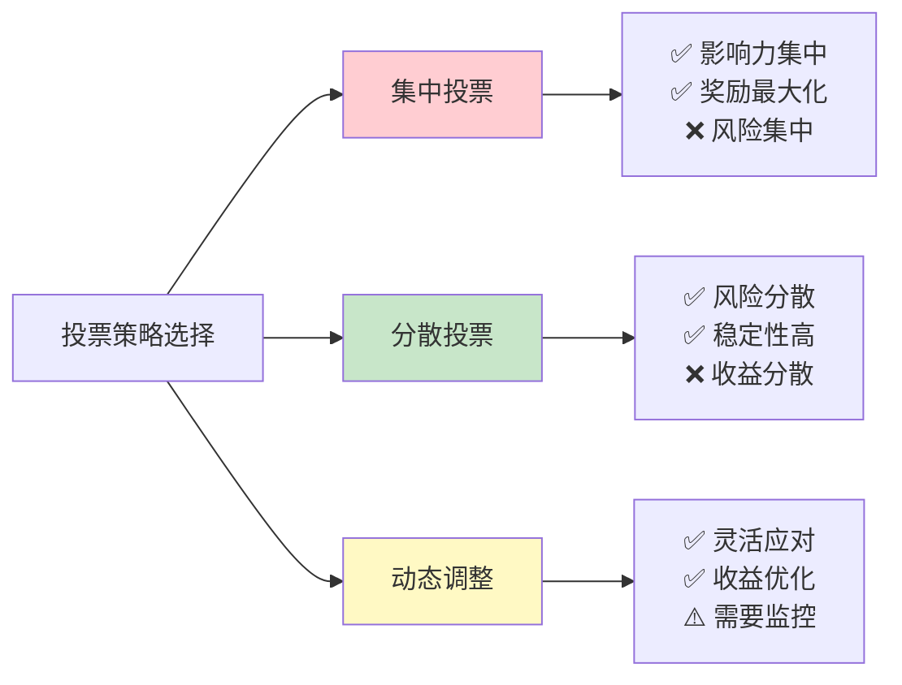

##### **推荐投票策略**
```
新手用户：
- 选择排名靠前的SR
- 分散投票给3-5个SR
- 关注SR的佣金比例

经验用户：
- 分析SR的历史表现
- 动态调整投票分配
- 关注网络治理提案

专业用户：
- 深入研究SR技术实力
- 参与治理提案讨论
- 优化投票收益策略
```

#### 如何选择超级代表

##### **选择标准**
```
技术实力：
✅ 节点稳定性
✅ 技术更新频率
✅ 社区贡献度
✅ 安全记录

收益表现：
✅ 佣金分成比例
✅ 历史奖励记录
✅ 投票权重排名
✅ 长期表现稳定性

治理参与：
✅ 提案参与度
✅ 社区活跃度
✅ 生态贡献
✅ 透明度
```

##### **热门超级代表类型**
```
技术型SR：
- 专注于技术发展
- 提供稳定节点服务
- 佣金比例相对较低

生态型SR：
- 推动DApp发展
- 提供开发者支持
- 佣金比例中等

商业型SR：
- 注重商业合作
- 提供企业服务
- 佣金比例较高
```

### 投票奖励机制

#### 奖励来源
```
奖励构成：
- 区块生产奖励分成
- 投票奖励分配
- 超级代表佣金返还
```

#### 奖励计算
```
奖励因素：
- 投票数量
- 被投票SR的排名和表现
- SR的奖励分配比例
- 网络整体参与度
```

#### 奖励领取
```
领取方式：
- 自动分配到账户
- 定期结算（通常每6小时）
- 无需手动操作
```

### 💰 投票奖励详细收益构成

#### 1. **区块生产奖励分成**

##### **每个区块的奖励分配**
```
TRON网络每个区块奖励：
✅ 总奖励：27 TRX/区块
✅ 超级代表（SR）获得：20 TRX
✅ 投票者获得：7 TRX
✅ 区块生成速度：约3秒一个

计算示例：
- 质押1000 TRX = 1000投票权
- 假设投票给排名前10的SR
- 每个区块可能获得：0.01-0.05 TRX
- 每天约28800个区块
- 日收益：约0.3-1.4 TRX
```

##### **奖励分配机制**
```
奖励分配流程：
1. SR生产区块获得20 TRX
2. SR按佣金比例返还给投票者
3. 投票者按投票权重分配7 TRX
4. 每6小时结算一次
5. 自动分配到投票者账户
```

#### 2. **超级代表佣金返还**

##### **佣金比例对比**
```
不同SR的佣金比例：
技术型SR：通常20-30%
生态型SR：通常30-50%
商业型SR：通常50-80%

实际收益示例：
质押1000 TRX给佣金50%的SR：
- 年化收益率：约5-7%
- 年收益：50-70 TRX
- 月收益：约4-6 TRX
```

##### **佣金返还计算**
```
佣金返还公式：
个人收益 = 质押TRX数量 × SR佣金比例 × 网络奖励系数

具体计算：
质押1000 TRX，SR佣金50%：
- 年收益 = 1000 × 50% × 0.1 = 50 TRX
- 月收益 = 50 ÷ 12 = 4.17 TRX
- 日收益 = 4.17 ÷ 30 = 0.14 TRX
```

#### 3. **网络治理参与奖励**

##### **治理提案奖励**
```
参与治理的额外收益：
✅ 提案投票奖励：参与重要决策
✅ 网络升级奖励：协议升级参与
✅ 生态发展奖励：推动DApp发展
✅ 社区贡献奖励：活跃社区成员

奖励形式：
- 直接TRX奖励
- 特殊代币空投
- 治理代币分配
- 生态项目优先权
```

#### 4. **实际收益计算示例**

##### **不同质押规模的收益对比**

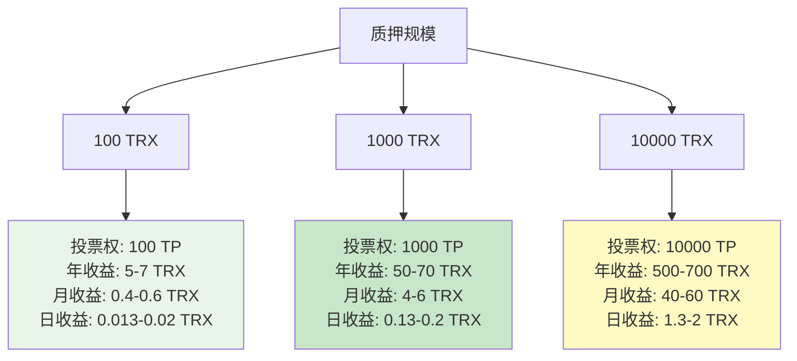

##### **年化收益率分析**
```
投票奖励年化收益率：
- 最低收益率：约3%
- 平均收益率：约5%
- 最高收益率：约7%
- 复利效应：收益可重新质押

对比其他投资：
- 银行存款：1-3%
- 国债：2-4%
- 股票基金：5-15%
- TRON投票：3-7%
- 加密货币：波动较大
```

#### 5. **影响投票奖励的因素**

##### **主要影响因素**

###### **SR排名和表现**
```
排名影响：
- 前27名SR：获得区块生产权
- 排名越高：奖励越多
- 表现稳定：收益更稳定
- 技术实力：影响长期收益
```

###### **网络整体参与度**
```
参与度影响：
- 质押总量增加：单位TRX收益下降
- 投票竞争激烈：需要选择优质SR
- 网络发展：长期收益增长
- 生态繁荣：更多奖励来源
```

###### **市场环境变化**
```
市场影响：
- TRX价格波动：影响收益价值
- 网络参数调整：可能影响奖励
- 竞争网络：影响TRON吸引力
- 监管环境：影响长期发展
```

#### 6. **最大化投票奖励的策略**

##### **策略建议**

###### **选择优质SR**
```
选择标准：
✅ 排名稳定在前27名
✅ 佣金比例合理（30-60%）
✅ 技术实力强
✅ 社区贡献大
✅ 透明度高
```

###### **分散投票策略**
```
分散投票：
- 投票给3-5个SR
- 避免过度集中
- 降低单点风险
- 获得稳定收益
```

###### **动态调整策略**
```
动态调整：
- 定期评估SR表现
- 关注网络变化
- 优化投票分配
- 把握市场机会
```

#### 7. **投票奖励的长期价值**

##### **复利效应**
```
复利增长：
- 收益可以重新质押
- 投票权持续增加
- 收益呈指数增长
- 长期价值显著
```

##### **网络发展红利**
```
发展红利：
- TRON生态持续扩张
- 更多DApp和用户
- 网络价值提升
- 投票权价值增长
```

### 📊 投票权价值计算

#### 投资回报率分析
```
投票权价值：
质押1000 TRX = 1000 TP
年化收益：3-7%
年收益：30-70 TRX
投资回报：3-7%

对比其他投资：
- 银行存款：1-3%
- 国债：2-4%
- 股票基金：5-15%
- TRON投票：3-7%
```

#### 长期价值
```
长期收益：
- 复利效应：收益可以重新质押
- 网络增长：TRON生态发展带来价值提升
- 治理参与：影响网络发展方向
- 社区地位：成为网络治理参与者
```

### ⚠️ 投票权注意事项

#### 风险提示
```
市场风险：
- TRX价格波动影响投票权价值
- 网络参数调整可能影响收益
- 超级代表表现变化影响奖励

操作风险：
- 投票操作需要手续费
- 频繁调整投票增加成本
- 需要持续监控SR表现
```

### 🔒 质押的永久性说明

#### **重要：质押不会自动解质押！**

##### **质押的永久性特点**
```
质押机制特点：
✅ 质押后永久有效
✅ 不会自动解质押
✅ 不会过期失效
✅ 不会自动释放TRX
✅ 需要手动发起解质押
```

##### **为什么质押是永久的？**
```
设计原理：
1. 网络稳定性：确保资源分配稳定
2. 治理参与：保持投票权持续有效
3. 长期激励：鼓励长期网络参与
4. 防止滥用：避免恶意质押攻击
5. 经济模型：建立可持续的资源分配机制
```

##### **质押的三种状态**
```
状态说明：
1. 质押状态：TRX被锁定，获得资源和投票权
2. 代理状态：资源代理给他人，投票权保留
3. 解质押状态：发起解质押，等待14天后提取

重要：只有手动发起解质押，才会进入解质押状态
```

#### **质押的自动机制**

##### **自动恢复的资源**
```
资源自动恢复：
✅ 能量/带宽：每24小时自动恢复到满额
✅ 免费带宽：每天1500点自动重置
✅ 投票权：持续有效，无需刷新
✅ 投票奖励：每6小时自动结算

不会自动变化：
❌ 质押的TRX数量：保持不变
❌ 质押状态：不会自动解除
❌ 投票分配：不会自动调整
❌ 代理关系：不会自动取消
```

##### **需要手动操作的事项**
```
手动操作项目：
✅ 发起质押：选择数量和资源类型
✅ 发起解质押：选择解质押数量
✅ 代理资源：选择代理对象和数量
✅ 取消代理：选择要取消的代理
✅ 调整投票：重新分配投票权
✅ 提取TRX：解质押14天后提取
```

#### 最佳实践
```
投票建议：
1. 选择稳定可靠的SR
2. 分散投票降低风险
3. 定期评估投票策略
4. 关注网络治理动态
5. 保持长期投资视角
```

---

## 经济模型分析

### 质押模式对比分析图

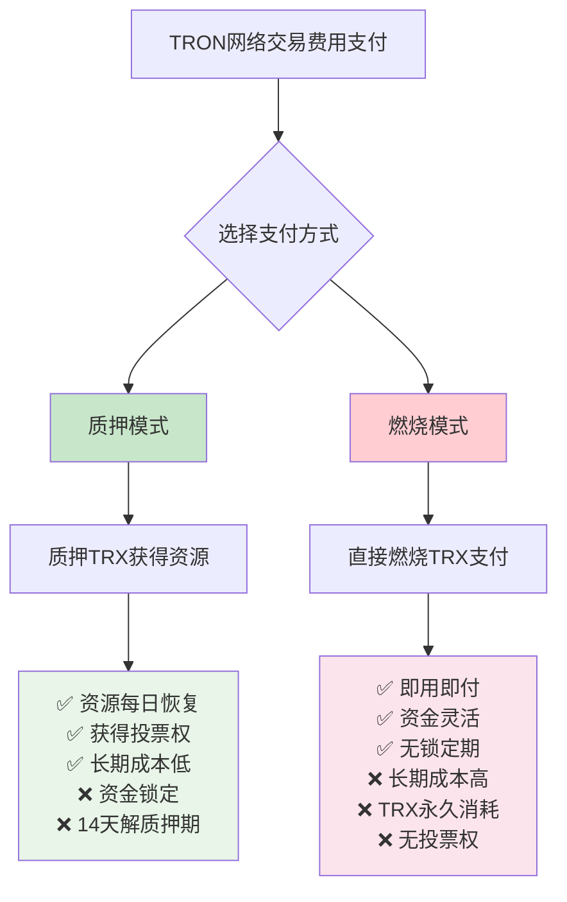

### 成本效益对比图

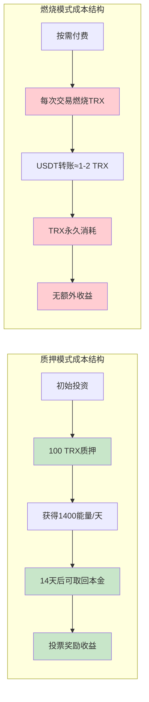

### 投资回报率计算图

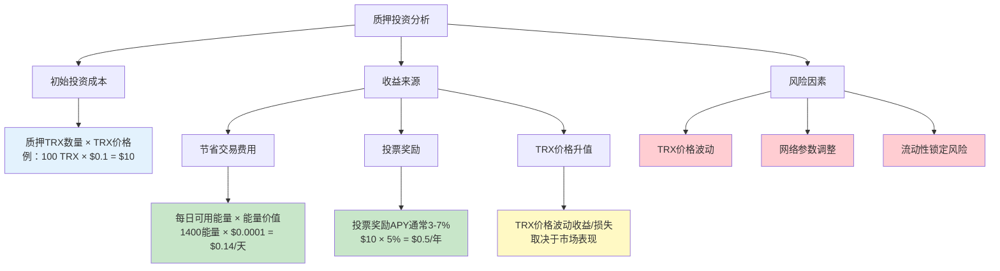

### 成本效益分析

#### 质押模式 vs 燃烧模式
```
质押模式：
优势：
- 资源可重复使用（每24小时恢复）
- 获得投票权和奖励
- 长期成本较低

劣势：
- 需要锁定TRX（流动性风险）
- 14天解质押等待期
- 需要提前规划资源需求

燃烧模式：
优势：
- 即用即付，灵活性高
- 无需锁定资金
- 适合偶尔使用

劣势：
- 长期成本较高
- 无投票权和奖励
- TRX永久消耗
```

### 资源价值计算

#### 能量价值评估
```
计算公式：
能量成本 = 质押TRX数量 × TRX价格 ÷ 获得能量数量 ÷ 365天

示例计算（假设数据）：
- 质押100 TRX获得1,400能量
- TRX价格0.1美元
- 年化能量成本 = 100 × 0.1 ÷ 1,400 ÷ 365 ≈ 0.0000196美元/能量/天
```

#### 投资回报率
```
收益来源：
1. 节省的交易手续费
2. 投票奖励收益
3. TRX价格升值收益

风险因素：
1. TRX价格波动风险
2. 网络参数调整风险
3. 流动性风险（14天锁定）
```

---

## 实际应用场景

### 用户类型与策略矩阵

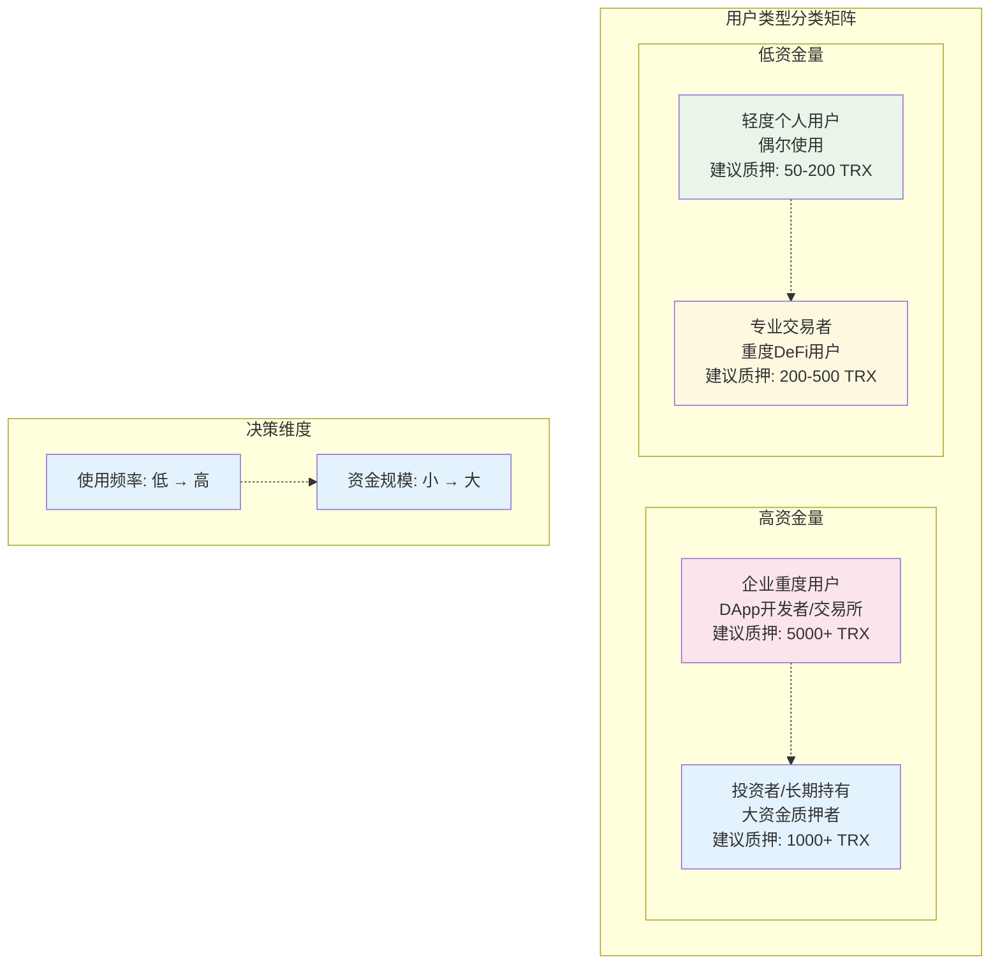

### 用户策略选择流程图

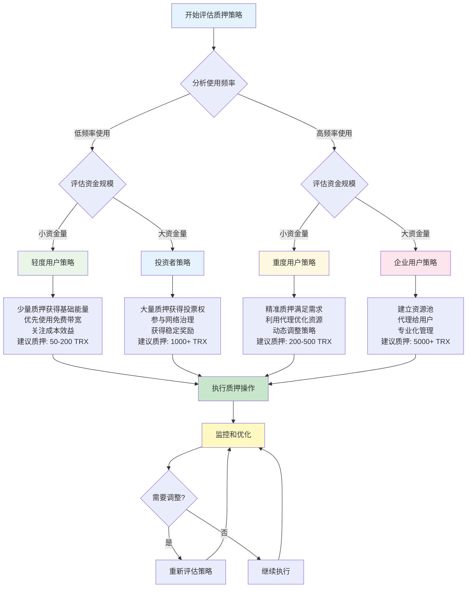

### 个人用户场景

#### 轻度使用者
```
特征：偶尔转账，少量DeFi操作
建议：
- 质押少量TRX获得基础能量
- 重点关注带宽需求
- 利用免费带宽额度
```

#### 重度使用者
```
特征：频繁DeFi操作，大量智能合约交互
建议：
- 质押大量TRX获得充足能量
- 考虑代理机制优化资源分配
- 积极参与投票获得额外收益
```

### 企业用户场景

#### DApp开发者资源管理流程

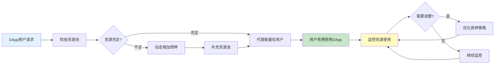

#### DApp开发者
```
需求：为用户提供良好的交易体验
策略：
- 质押大量TRX获得能量池
- 通过代理为用户提供免费交易
- 建立资源管理和监控系统
```

#### 交易所/钱包
```
需求：处理大量用户交易
策略：
- 建立分层资源管理体系
- 动态调整质押策略
- 优化资源利用效率
```

### 投资者场景

#### 投资策略对比图

```mermaid
graph LR
    A[投资策略选择] --> B[长期持有策略]
    A --> C[套利交易策略]
    
    B --> B1["质押大量TRX<br/>获得稳定投票奖励<br/>参与网络治理<br/>长期价值投资"]
    
    C --> C1["关注资源价格波动<br/>动态调整质押比例<br/>利用代理进行租赁<br/>短期套利机会"]
    
    B1 --> B2["风险：低<br/>收益：稳定<br/>流动性：低"]
    C1 --> C2["风险：中高<br/>收益：波动<br/>流动性：中"]
    
    style B fill:#c8e6c9
    style C fill:#fff9c4
    style B2 fill:#e8f5e8
    style C2 fill:#fff8e1
```

#### 长期持有者
```
策略：
- 质押获得投票权
- 参与网络治理
- 获得稳定的投票奖励
```

#### 套利交易者
```
策略：
- 关注资源价格波动
- 在不同时期调整质押策略
- 利用代理机制进行资源租赁
```

---

## 注意事项与风险

### 操作注意事项

#### 质押前检查
```
检查清单：
□ 确认质押数量和资源类型
□ 验证接收账户地址
□ 了解当前网络资源获取比例
□ 评估未来资源需求
□ 确保保留足够的流动资金
```

#### 代理资源注意
```
注意事项：
- 确认代理对象的可信度
- 理解时间锁的影响
- 监控代理资源的使用情况
- 及时调整代理策略
```

#### 解质押规划
```
规划要点：
- 提前14天规划资金需求
- 考虑市场波动对解质押时机的影响
- 分批解质押降低风险
- 保持必要的资源储备
```

### 风险评估

#### 技术风险
```
风险类型：
- 网络参数调整风险
- 智能合约漏洞风险
- 系统升级影响风险

应对措施：
- 关注官方公告
- 分散质押策略
- 保持技术更新
```

#### 市场风险
```
风险类型：
- TRX价格波动风险
- 资源需求变化风险
- 竞争网络影响风险

应对措施：
- 合理控制质押比例
- 动态调整策略
- 多元化投资组合
```

#### 流动性风险
```
风险描述：
- 14天解质押等待期
- 资金无法及时变现
- 错过市场机会

应对措施：
- 保持合理的资金配置
- 分批质押和解质押
- 建立应急资金池
```

---

## API接口说明

### 质押相关接口

#### 质押TRX
```http
POST /wallet/freezebalancev2
Content-Type: application/json

{
  "owner_address": "TL5afFHPzESaGrvG8JKAwrNx6drbDZf9it",
  "frozen_balance": 100000000,
  "resource": "ENERGY"
}

参数说明：
- owner_address: 质押者地址（hex格式）
- frozen_balance: 质押数量（sun单位，1 TRX = 1,000,000 sun）
- resource: 资源类型（"ENERGY" 或 "BANDWIDTH"）
```

#### 解质押TRX
```http
POST /wallet/unfreezebalancev2
Content-Type: application/json

{
  "owner_address": "TL5afFHPzESaGrvG8JKAwrNx6drbDZf9it",
  "unfreeze_balance": 100000000,
  "resource": "ENERGY"
}

参数说明：
- owner_address: 解质押者地址
- unfreeze_balance: 解质押数量
- resource: 资源类型
```

### 代理相关接口

#### 代理资源
```http
POST /wallet/delegateresource
Content-Type: application/json

{
  "owner_address": "TL5afFHPzESaGrvG8JKAwrNx6drbDZf9it",
  "receiver_address": "TTargetAddress...",
  "balance": 50000000,
  "resource": "ENERGY",
  "lock": true
}

参数说明：
- owner_address: 代理者地址
- receiver_address: 接收者地址
- balance: 代理的TRX数量对应的资源
- resource: 资源类型
- lock: 是否启用时间锁
```

#### 取消代理
```http
POST /wallet/undelegateresource
Content-Type: application/json

{
  "owner_address": "TL5afFHPzESaGrvG8JKAwrNx6drbDZf9it",
  "receiver_address": "TTargetAddress...",
  "balance": 50000000,
  "resource": "ENERGY"
}
```

### 查询相关接口

#### 查询账户资源
```http
POST /wallet/getaccountresource
Content-Type: application/json

{
  "address": "TL5afFHPzESaGrvG8JKAwrNx6drbDZf9it"
}

返回示例：
{
  "freeNetUsed": 557,
  "freeNetLimit": 1500,
  "NetUsed": 0,
  "NetLimit": 0,
  "EnergyUsed": 0,
  "EnergyLimit": 1408,
  "TotalNetLimit": 43200000000,
  "TotalNetWeight": 84593524300,
  "TotalEnergyLimit": 90000000000,
  "TotalEnergyWeight": 13369736648
}
```

#### 查询质押信息
```http
POST /wallet/getdelegatedresourcev2
Content-Type: application/json

{
  "fromAddress": "TL5afFHPzESaGrvG8JKAwrNx6drbDZf9it",
  "toAddress": "TTargetAddress..."
}
```

---

## TRON质押生态全景图

### 完整生态架构图

```mermaid
graph TB
    subgraph "用户层"
        A1[个人用户]
        A2[企业用户]
        A3[DApp开发者]
        A4[投资者]
    end
    
    subgraph "质押层"
        B1[TRX质押]
        B2[资源获取]
        B3[投票权获得]
    end
    
    subgraph "资源层"
        C1[能量 Energy]
        C2[带宽 Bandwidth]
        C3[投票权 TP]
    end
    
    subgraph "应用层"
        D1[智能合约执行]
        D2[普通交易]
        D3[超级代表投票]
        D4[资源代理]
    end
    
    subgraph "收益层"
        E1[节省手续费]
        E2[投票奖励]
        E3[TRX价格升值]
    end
    
    subgraph "治理层"
        F1[超级代表选举]
        F2[网络参数治理]
        F3[生态发展决策]
    end
    
    A1 --> B1
    A2 --> B1
    A3 --> B1
    A4 --> B1
    
    B1 --> B2
    B1 --> B3
    
    B2 --> C1
    B2 --> C2
    B3 --> C3
    
    C1 --> D1
    C2 --> D2
    C3 --> D3
    C1 --> D4
    C2 --> D4
    
    D1 --> E1
    D2 --> E1
    D3 --> E2
    B1 --> E3
    
    D3 --> F1
    F1 --> F2
    F2 --> F3
    
    style A1 fill:#e3f2fd
    style A2 fill:#e8f5e8
    style A3 fill:#fff8e1
    style A4 fill:#fce4ec
    style B1 fill:#f3e5f5
    style E1 fill:#c8e6c9
    style E2 fill:#c8e6c9
    style E3 fill:#fff9c4
```

### 质押决策流程图

```mermaid
flowchart TD
    Start[开始考虑质押] --> A{评估个人情况}
    
    A --> B[分析资金状况]
    A --> C[评估使用需求]
    A --> D[考虑风险承受能力]
    
    B --> E{可用资金充足?}
    C --> F{使用频率高?}
    D --> G{风险承受能力强?}
    
    E -->|是| H[可以考虑质押]
    E -->|否| I[暂时不质押，使用燃烧模式]
    
    F -->|是| J[质押获得资源更划算]
    F -->|否| K[按需付费可能更合适]
    
    G -->|是| L[可以接受14天锁定期]
    G -->|否| M[选择灵活的燃烧模式]
    
    H --> N{综合评估}
    J --> N
    L --> N
    
    N --> O[制定质押策略]
    O --> P[选择资源类型]
    O --> Q[确定质押数量]
    O --> R[选择是否代理]
    
    P --> S[执行质押]
    Q --> S
    R --> S
    
    S --> T[监控和调整]
    T --> U{需要调整?}
    U -->|是| V[修改策略]
    U -->|否| W[继续执行]
    V --> T
    W --> T
    
    I --> End1[使用燃烧模式]
    K --> End1
    M --> End1
    
    style Start fill:#e3f2fd
    style S fill:#c8e6c9
    style T fill:#fff9c4
    style End1 fill:#ffcdd2
```

## 总结

TRON的质押机制是一个复杂而完善的系统，它不仅解决了网络资源分配问题，还提供了治理参与和收益获取的机会。通过合理理解和运用这套机制，用户可以：

1. **优化交易成本**：通过质押获得免费的网络资源
2. **参与网络治理**：通过投票权参与超级代表选举
3. **获得投资收益**：通过投票奖励获得被动收入
4. **灵活资源管理**：通过代理机制实现资源的灵活分配

### 关键要点回顾

```mermaid
mindmap
  root((TRON质押机制))
    质押收益
      立即获得资源
      获得投票权
      投票奖励收益
      节省交易费用
    
    资源类型
      能量
        智能合约执行
        USDT转账
        无免费额度
      带宽
        普通TRX转账
        基础操作
        1500免费额度/天
    
    操作流程
      质押TRX
      选择资源类型
      设置接收账户
      立即生效
    
    代理机制
      资源可代理
      投票权不可代理
      时间锁选择
      灵活管理
    
    解质押
      14天等待期
      资源立即减少
      必须先取消代理
      最多32笔并发
    
    风险控制
      流动性风险
      价格波动风险
      网络参数风险
      合理规划
```

在实际应用中，建议用户根据自己的使用场景和风险承受能力，制定合适的质押策略，并持续关注网络参数变化和市场动态，适时调整策略以获得最佳收益。

---

## 常见问题解答（FAQ）

### 解质押相关问题

#### Q1: 14天等待期可以缩短吗？
**A:** 不可以。14天等待期是TRON网络的硬性规定，无法通过任何官方渠道缩短。这是为了：
- 防止恶意质押攻击
- 维护网络稳定性
- 确保质押机制的公平性

#### Q2: 解质押期间TRX可以提前使用吗？
**A:** 不可以。解质押期间：
- TRX被完全锁定
- 无法转账或交易
- 无法用于新的质押
- 只能等待14天期满

#### Q3: 解质押操作可以取消吗？
**A:** 不可以。一旦发起解质押：
- 操作无法撤销
- 必须等待14天
- 无法加速或取消
- 建议谨慎操作

#### Q4: 有代理资源时如何解质押？
**A:** 必须先取消代理：
1. 检查代理是否有时间锁
2. 无时间锁：立即取消
3. 有时间锁：等待3天
4. 取消代理后才能解质押

#### Q5: 分批质押有什么好处？
**A:** 分批质押的优势：
- 避免资金一次性锁定
- 可以根据需求逐步解质押
- 保持资金流动性
- 降低风险集中度

#### Q6: 解质押失败怎么办？
**A:** 常见原因和解决方案：
- **余额不足**：检查质押数量
- **代理未取消**：先取消所有代理
- **并发超限**：等待之前的解质押完成
- **网络问题**：重试或更换节点

#### Q7: 如何监控解质押进度？
**A:** 可以通过以下方式：
- TronScan区块链浏览器
- TronLink钱包
- TRON API接口
- 第三方监控工具

#### Q8: 解质押后资源会立即减少吗？
**A:** 是的，解质押生效后：
- 能量/带宽立即减少
- 投票权立即减少
- 但TRX需要14天后才能提取

### 质押策略相关问题

#### Q9: 质押多少TRX比较合适？
**A:** 建议根据以下因素决定：
- **使用频率**：高频用户质押更多
- **资金规模**：避免过度集中
- **风险承受能力**：考虑14天锁定期
- **收益目标**：平衡投票奖励和流动性

#### Q10: 质押能量还是带宽？
**A:** 根据使用场景选择：
- **能量**：智能合约、USDT转账、DeFi操作
- **带宽**：普通TRX转账、基础操作
- **混合**：根据实际需求平衡配置

#### Q11: 代理资源给他人安全吗？
**A:** 代理资源相对安全，但需注意：
- **必须先质押给自己**：不能直接质押给他人
- **质押完成后才能代理**：需要先获得资源
- 只能代理给外部账户，不能给合约
- 可以选择时间锁增加稳定性
- 代理的资源不影响投票权
- 可以随时取消代理（考虑时间锁）

#### Q12: 质押期间TRX价格下跌怎么办？
**A:** 质押期间TRX价格风险：
- 质押的TRX数量不变
- 但价值可能下降
- 无法在下跌时及时止损
- 建议评估市场风险后再质押

#### Q13: 可以直接质押TRX给他人账户吗？
**A:** 不可以。质押操作的正确流程是：
- **第一步**：质押TRX给自己，获得资源和投票权
- **第二步**：将已获得的资源代理给他人使用
- **重要**：质押时接收地址只能是质押者本人
- **代理**：质押完成后才能将资源代理给他人

#### Q14: 解质押有什么代价？
**A:** 解质押的代价包括：
- **立即损失**：资源和投票权立即消失
- **时间成本**：14天资金锁定
- **机会成本**：错过投票奖励和网络使用
- **重新成本**：重新质押需要时间和手续费

#### Q15: 解质押后资源会立即减少吗？
**A:** 是的，解质押生效后：
- 能量/带宽立即减少
- 投票权立即减少
- 但TRX需要14天后才能提取

#### Q16: 如何降低解质押的代价？
**A:** 可以通过以下方式降低代价：
- **资源代理**：保持质押状态，资源给他人使用
- **分批质押**：避免一次性锁定大量资金
- **燃烧模式**：偶尔使用时直接支付费用
- **合理规划**：提前14天规划资金需求

#### Q17: 投票权有什么用？
**A:** 投票权（TP）的作用包括：
- **参与网络治理**：选举超级代表，参与网络决策
- **获得投票奖励**：区块奖励分成，佣金返还
- **影响网络发展**：参与协议升级，影响生态方向
- **长期投资价值**：随着网络发展价值提升

#### Q18: 质押TRX后投票权是自动获得的吗？
**A:** 是的，质押TRX后：
- **自动获得投票权**：1 TRX = 1 TP
- **无需额外操作**：投票权与资源同时获得
- **可以立即使用**：可以马上参与投票
- **持续有效**：直到解质押或修改投票

#### Q19: 如何选择超级代表进行投票？
**A:** 选择超级代表建议考虑：
- **技术实力**：节点稳定性，安全记录
- **收益表现**：佣金比例，历史奖励
- **治理参与**：提案参与度，社区贡献
- **个人策略**：集中投票vs分散投票

#### Q20: 质押会自动解质押吗？
**A:** 不会！质押的重要特点：
- **永久有效**：质押后不会自动解质押
- **不会过期**：质押状态持续有效
- **手动操作**：只有手动发起才会解质押
- **自动恢复**：只有资源（能量/带宽）会每24小时自动恢复

#### Q21: 投票奖励多久结算一次？
**A:** 投票奖励的结算机制：
- **结算频率**：每6小时自动结算一次
- **分配方式**：自动分配到投票者账户
- **无需操作**：完全自动化，无需手动领取
- **实时更新**：可以随时查看收益状态

#### Q22: 质押的TRX数量会变化吗？
**A:** 质押的TRX数量不会自动变化：
- **质押数量**：一旦质押，数量保持不变
- **资源获取**：能量/带宽会每24小时恢复
- **投票权**：持续有效，无需刷新
- **只有手动**：发起解质押才会减少质押数量

#### Q23: 取消代理后所有的能量会回收吗？
**A:** 取消代理后的能量回收情况：
- **已消耗的能量**：无法回收（已经使用完毕）
- **未消耗的能量**：立即返回质押者账户
- **资源池恢复**：恢复到质押时的完整状态
- **每天重置**：能量每24小时自动恢复到满额

#### Q24: 如果代理用户用完了能量，取消代理会怎样？
**A:** 如果代理用户用完了能量：
- **无法回收已消耗的能量**：已经使用的资源无法回收
- **但资源池会立即恢复**：每天重新获得完整的能量
- **代理关系完全解除**：接收方无法继续使用
- **质押者重新获得控制权**：可以自己使用或代理给他人

#### Q25: 取消代理需要多长时间生效？
**A:** 取消代理的生效时间取决于时间锁设置：
- **无时间锁**：立即生效，资源立即返回
- **有时间锁**：需要等待3天时间锁到期
- **重复代理**：会重置3天等待期
- **生效后**：资源立即返回质押者账户

---

**文档版本**：v1.0  
**最后更新**：2025年1月  
**参考资料**：TRON官方文档、TronGrid API文档  
**适用网络**：TRON主网、Shasta测试网
