# Telegram Bot API 官方方法使用文档

## 📋 文档概述

本文档整理了 [Telegram Bot API 官方文档](https://core.telegram.org/bots/api) 中所有方法，并标注了在 TRON 能量租赁项目中的使用场景和优先级。

## 🎯 项目特点

- **业务类型**: TRON 能量租赁服务
- **主要功能**: 能量套餐购买、订单管理、支付处理、用户管理
- **交互模式**: 内联键盘 + 命令式交互
- **用户类型**: 普通用户、管理员

---

## 🔄 Telegram Bot 交互流程图

### 1. 用户发起交互流程

```mermaid
graph TD
    A[用户打开 Telegram Bot] --> B{首次访问?}
    B -->|是| C[发送 /start 命令]
    B -->|否| D[显示菜单按钮]
    
    C --> E[机器人获取用户信息]
    E --> F[注册/更新用户数据]
    F --> G[显示欢迎消息 + 主菜单]
    
    D --> H[用户点击菜单按钮]
    H --> I[触发 callback_query 事件]
    I --> J[机器人处理回调]
    J --> K[发送响应消息/图片]
```



### 2. 菜单交互详细流程

```mermaid
sequenceDiagram
    participant U as 用户
    participant T as Telegram
    participant B as Bot服务器
    participant D as 数据库
    
    U->>T: 点击菜单按钮/内联键盘
    T->>B: 发送 callback_query 事件
    
    Note over B: 解析回调数据
    B->>B: 提取 user_id, chat_id, callback_data
    
    B->>D: 查询用户信息
    D-->>B: 返回用户数据
    
    Note over B: 业务逻辑处理
    B->>B: 根据 callback_data 执行对应操作
    
    B->>T: answerCallbackQuery (确认点击)
    B->>T: sendPhoto/sendMessage (发送响应)
    T->>U: 显示图片/消息
```



### 3. 用户信息获取机制

```mermaid
graph LR
    A[Telegram 事件] --> B[提取用户信息]
    
    B --> C[message.from]
    B --> D[callback_query.from]
    B --> E[inline_query.from]
    
    C --> F[User Object]
    D --> F
    E --> F
    
    F --> G[user_id: 数字ID]
    F --> H[username: @用户名]
    F --> I[first_name: 名字]
    F --> J[last_name: 姓氏]
    F --> K[language_code: 语言]
    F --> L[is_bot: 是否机器人]
```



---

## 🔥 高优先级方法（项目核心功能）

### 🤖 基础 Bot 管理

| 方法 | 状态 | 使用场景 | 项目中的应用 |
|------|------|----------|-------------|
| `getMe` | ✅ 已使用 | 获取机器人基本信息 | 机器人启动时验证身份，状态检查 |
| `getUpdates` | ✅ 已使用 | 轮询模式接收消息 | 当前使用轮询模式接收用户消息 |
| `setWebhook` | ✅ 已使用 | 设置 Webhook URL | 生产环境建议使用 Webhook 模式 |
| `deleteWebhook` | ✅ 已使用 | 删除 Webhook | 模式切换时清理 Webhook |
| `getWebhookInfo` | ✅ 已使用 | 获取 Webhook 状态 | 检查 Webhook 配置是否正确 |

**代码示例：**
```typescript
// 项目中的使用方式
const botInfo = await telegramBotService.getBotInfo();
await telegramBotService.setWebhook('https://your-domain.com/api/telegram/webhook');
```

## 🛠️ 技术实现详解

### 1. 用户信息获取与存储

```typescript
// 从不同事件类型中提取用户信息
class TelegramUserHandler {
  
  // 从消息事件获取用户
  extractUserFromMessage(update: Update): TelegramUser | null {
    if (update.message?.from) {
      return this.normalizeUser(update.message.from);
    }
    return null;
  }
  
  // 从回调查询获取用户
  extractUserFromCallback(update: Update): TelegramUser | null {
    if (update.callback_query?.from) {
      return this.normalizeUser(update.callback_query.from);
    }
    return null;
  }
  
  // 从内联查询获取用户
  extractUserFromInlineQuery(update: Update): TelegramUser | null {
    if (update.inline_query?.from) {
      return this.normalizeUser(update.inline_query.from);
    }
    return null;
  }
  
  // 标准化用户信息
  private normalizeUser(telegramUser: any): TelegramUser {
    return {
      telegram_id: telegramUser.id,
      username: telegramUser.username || null,
      first_name: telegramUser.first_name || '',
      last_name: telegramUser.last_name || '',
      language_code: telegramUser.language_code || 'en',
      is_bot: telegramUser.is_bot || false,
      created_at: new Date(),
      updated_at: new Date()
    };
  }
  
  // 获取或创建用户
  async getOrCreateUser(telegramUser: any): Promise<User> {
    const normalizedUser = this.normalizeUser(telegramUser);
    
    // 先尝试查找现有用户
    let user = await db.users.findByTelegramId(normalizedUser.telegram_id);
    
    if (!user) {
      // 创建新用户
      user = await db.users.create({
        ...normalizedUser,
        role: 'user',
        status: 'active'
      });
    } else {
      // 更新用户信息
      user = await db.users.update(user.id, {
        username: normalizedUser.username,
        first_name: normalizedUser.first_name,
        last_name: normalizedUser.last_name,
        language_code: normalizedUser.language_code,
        updated_at: new Date()
      });
    }
    
    return user;
  }
}
```

### 2. 菜单交互完整实现

```typescript
class TelegramMenuHandler {
  
  // 处理菜单回调
  async handleMenuCallback(callbackQuery: any): Promise<void> {
    const user = await this.userHandler.getOrCreateUser(callbackQuery.from);
    const chatId = callbackQuery.message.chat.id;
    const callbackData = callbackQuery.data;
    
    try {
      // 1. 立即确认回调（避免加载圈）
      await this.bot.answerCallbackQuery(callbackQuery.id, {
        text: '处理中...'
      });
      
      // 2. 解析回调数据
      const action = this.parseCallbackData(callbackData);
      
      // 3. 根据动作类型处理
      switch (action.type) {
        case 'energy_package':
          await this.handleEnergyPackageSelection(chatId, user, action.data);
          break;
        case 'payment_confirm':
          await this.handlePaymentConfirmation(chatId, user, action.data);
          break;
        case 'order_status':
          await this.handleOrderStatusInquiry(chatId, user, action.data);
          break;
        default:
          await this.sendErrorMessage(chatId, '未知的操作类型');
      }
      
    } catch (error) {
      console.error('菜单回调处理错误:', error);
      await this.sendErrorMessage(chatId, '操作失败，请稍后重试');
    }
  }
  
  // 解析回调数据
  private parseCallbackData(data: string): {type: string, data: any} {
    const parts = data.split(':');
    return {
      type: parts[0],
      data: parts.slice(1).join(':')
    };
  }
  
  // 处理能量套餐选择
  async handleEnergyPackageSelection(chatId: number, user: User, packageId: string): Promise<void> {
    const package = await this.priceConfigService.getEnergyPackage(packageId);
    
    if (!package) {
      await this.sendErrorMessage(chatId, '套餐不存在');
      return;
    }
    
    // 发送套餐详情图片
    const packageImage = await this.generatePackageImage(package);
    
    await this.bot.sendPhoto(chatId, packageImage, {
      caption: `🔋 **${package.name}**
      
⚡ 能量数量: ${package.energy.toLocaleString()} Energy
💰 价格: ${package.price} TRX
⏰ 有效期: ${package.duration} 小时
📋 描述: ${package.description}`,
      parse_mode: 'Markdown',
      reply_markup: {
        inline_keyboard: [
          [
            { text: '✅ 确认购买', callback_data: `confirm_purchase:${package.id}` },
            { text: '❌ 取消', callback_data: 'cancel_purchase' }
          ],
          [
            { text: '🔙 返回套餐列表', callback_data: 'back_to_packages' }
          ]
        ]
      }
    });
  }
  
  // 生成套餐图片
  private async generatePackageImage(package: any): Promise<Buffer> {
    // 这里可以使用 Canvas 或调用图片生成服务
    // 简化示例，实际项目中可能需要更复杂的图片生成逻辑
    return Buffer.from(''); // 占位符
  }
}
```

### 3. 图片发送流程详解

```mermaid
graph TD
    A[用户点击菜单] --> B[解析回调数据]
    B --> C[获取用户信息]
    C --> D[查询业务数据]
    D --> E{需要生成图片?}
    
    E -->|是| F[生成动态图片]
    E -->|否| G[使用静态图片]
    
    F --> H[图片处理完成]
    G --> H
    
    H --> I[发送 answerCallbackQuery]
    I --> J[发送 sendPhoto]
    J --> K[附加说明文字 caption]
    K --> L[添加内联键盘]
    L --> M[发送完成]
```



### 💬 消息发送与管理

| 方法 | 状态 | 使用场景 | 项目中的应用 |
|------|------|----------|-------------|
| `sendMessage` | ✅ 已使用 | 发送文本消息 | 欢迎消息、订单确认、错误提示 |
| `sendPhoto` | ✅ 已使用 | 发送图片 | 支付二维码、教程图片 |
| `sendDocument` | ✅ 已使用 | 发送文档 | 交易凭证、使用手册 |
| `editMessageText` | ✅ 已使用 | 编辑消息文本 | 更新订单状态、动态内容 |
| `editMessageReplyMarkup` | 🔄 建议使用 | 编辑键盘 | 更新内联键盘状态 |
| `deleteMessage` | ✅ 已使用 | 删除消息 | 清理过期消息、敏感信息 |
| `copyMessage` | 🆕 可考虑 | 复制消息 | 转发重要通知 |
| `forwardMessage` | 🆕 可考虑 | 转发消息 | 客服支持场景 |

## 🔔 通知系统详解 - 机器人主动推送通知

### 📋 通知类型分类

在 TRON 能量租赁项目中，机器人需要主动向用户发送各种类型的通知：

| 通知类型 | 触发时机 | 发送方法 | 优先级 | 示例场景 |
|----------|----------|----------|--------|----------|
| **实时交易通知** | 支付确认、能量到账 | `sendMessage` + `sendPhoto` | 🔥 高 | 支付成功、委托完成 |
| **订单状态通知** | 订单状态变更 | `sendMessage` + `editMessageText` | 🔥 高 | 处理中、已完成、失败 |
| **价格变动通知** | 套餐价格调整 | `sendMessage` | 🔄 中 | 价格上涨、促销活动 |
| **系统维护通知** | 系统升级、故障 | `sendMessage` | ⚠️ 高 | 维护公告、故障恢复 |
| **营销推广通知** | 活动推广、新功能 | `sendPhoto` + `sendMessage` | 🆕 低 | 新套餐上线、优惠活动 |
| **安全警告通知** | 异常操作、风险提示 | `sendMessage` | ⚠️ 高 | 异常登录、风险交易 |
| **定期摘要通知** | 定时统计推送 | `sendPhoto` + `sendDocument` | 📊 中 | 日报、月报、年度总结 |

### 🎯 核心通知发送方法

#### 1. 实时交易通知系统

```typescript
class TransactionNotificationService {
  
  // 支付成功通知
  async sendPaymentSuccessNotification(userId: number, orderInfo: OrderInfo): Promise<void> {
    const chatId = await this.getUserChatId(userId);
    
    // 生成交易成功图片
    const successImage = await this.generateTransactionSuccessImage(orderInfo);
    
    await this.bot.sendPhoto(chatId, successImage, {
      caption: `✅ **支付成功通知**
      
🎉 恭喜！您的订单已支付成功
📋 订单号: \`${orderInfo.orderId}\`
💰 支付金额: ${orderInfo.amount} TRX
⚡ 能量数量: ${orderInfo.energy.toLocaleString()} Energy
⏰ 支付时间: ${new Date().toLocaleString()}

🔄 系统正在为您处理能量委托，预计3-5分钟内完成
🔔 委托完成后会立即通知您`,
      parse_mode: 'Markdown',
      reply_markup: {
        inline_keyboard: [
          [
            { text: '📊 查看订单详情', callback_data: `order_details:${orderInfo.orderId}` },
            { text: '🔍 区块链查询', url: `https://tronscan.org/#/transaction/${orderInfo.txHash}` }
          ],
          [
            { text: '🔋 继续购买', callback_data: 'energy_packages' }
          ]
        ]
      }
    });
    
    // 记录通知发送日志
    await this.logNotification(userId, 'payment_success', orderInfo.orderId);
  }
  
  // 能量委托完成通知
  async sendEnergyDelegationCompleteNotification(userId: number, delegationInfo: DelegationInfo): Promise<void> {
    const chatId = await this.getUserChatId(userId);
    
    await this.bot.sendMessage(chatId, `🎉 **能量委托完成**

✅ 您的能量已成功委托到账！

📋 订单信息:
• 订单号: \`${delegationInfo.orderId}\`
• 委托地址: \`${delegationInfo.toAddress}\`
• 能量数量: ${delegationInfo.energy.toLocaleString()} Energy
• 有效期: ${delegationInfo.duration} 小时

🔗 委托交易: \`${delegationInfo.delegationTxHash}\`
⏰ 完成时间: ${new Date().toLocaleString()}

🎯 现在您可以使用这些能量进行智能合约交互了！`, {
      parse_mode: 'Markdown',
      reply_markup: {
        inline_keyboard: [
          [
            { text: '🔍 查看委托交易', url: `https://tronscan.org/#/transaction/${delegationInfo.delegationTxHash}` }
          ],
          [
            { text: '📊 我的能量', callback_data: 'my_energy' },
            { text: '⭐ 评价服务', callback_data: `rate_service:${delegationInfo.orderId}` }
          ]
        ]
      }
    });
  }
  
  // 支付失败通知
  async sendPaymentFailedNotification(userId: number, orderInfo: OrderInfo, reason: string): Promise<void> {
    const chatId = await this.getUserChatId(userId);
    
    await this.bot.sendMessage(chatId, `❌ **支付失败通知**

😞 很抱歉，您的订单支付未成功

📋 订单信息:
• 订单号: \`${orderInfo.orderId}\`
• 订单金额: ${orderInfo.amount} TRX
• 失败原因: ${reason}
• 失败时间: ${new Date().toLocaleString()}

💡 **解决方案:**
1. 检查钱包余额是否充足
2. 确认网络连接正常
3. 验证转账金额和地址

🔄 您可以重新尝试支付或联系客服获取帮助`, {
      parse_mode: 'Markdown',
      reply_markup: {
        inline_keyboard: [
          [
            { text: '🔄 重新支付', callback_data: `retry_payment:${orderInfo.orderId}` }
          ],
          [
            { text: '💬 联系客服', callback_data: 'contact_support' },
            { text: '❓ 支付帮助', callback_data: 'payment_help' }
          ]
        ]
      }
    });
  }
}
```

#### 2. 订单状态更新通知

```typescript
class OrderStatusNotificationService {
  
  // 订单状态变更通知
  async sendOrderStatusUpdateNotification(
    userId: number, 
    orderId: string, 
    oldStatus: string, 
    newStatus: string,
    messageId?: number
  ): Promise<void> {
    const chatId = await this.getUserChatId(userId);
    const statusInfo = this.getStatusInfo(newStatus);
    
    const notificationText = `🔄 **订单状态更新**

📋 订单号: \`${orderId}\`
📊 状态变更: ${this.getStatusEmoji(oldStatus)} ${oldStatus} → ${statusInfo.emoji} ${statusInfo.text}
⏰ 更新时间: ${new Date().toLocaleString()}

${statusInfo.description}`;
    
    if (messageId) {
      // 编辑现有消息
      try {
        await this.bot.editMessageText(notificationText, {
          chat_id: chatId,
          message_id: messageId,
          parse_mode: 'Markdown',
          reply_markup: this.getStatusKeyboard(orderId, newStatus)
        });
      } catch (error) {
        // 如果编辑失败，发送新消息
        await this.sendNewStatusMessage(chatId, notificationText, orderId, newStatus);
      }
    } else {
      // 发送新消息
      await this.sendNewStatusMessage(chatId, notificationText, orderId, newStatus);
    }
  }
  
  private getStatusInfo(status: string): {emoji: string, text: string, description: string} {
    const statusMap = {
      'pending': {
        emoji: '⏳',
        text: '等待处理',
        description: '订单已创建，等待系统处理'
      },
      'payment_pending': {
        emoji: '💰',
        text: '等待支付',
        description: '请完成支付以继续处理订单'
      },
      'processing': {
        emoji: '🔄',
        text: '处理中',
        description: '订单正在处理，请稍等片刻'
      },
      'delegating': {
        emoji: '⚡',
        text: '能量委托中',
        description: '正在将能量委托到您的地址'
      },
      'completed': {
        emoji: '✅',
        text: '已完成',
        description: '订单已成功完成，能量已到账'
      },
      'failed': {
        emoji: '❌',
        text: '处理失败',
        description: '订单处理失败，请联系客服'
      },
      'cancelled': {
        emoji: '🚫',
        text: '已取消',
        description: '订单已被取消'
      }
    };
    
    return statusMap[status] || {
      emoji: '❓',
      text: '未知状态',
      description: '订单状态异常，请联系客服'
    };
  }
}
```

#### 3. 系统公告与营销通知

```typescript
class SystemNotificationService {
  
  // 批量发送系统公告
  async sendSystemAnnouncement(
    announcement: SystemAnnouncement,
    userFilter?: (user: User) => boolean
  ): Promise<void> {
    const users = await this.userService.getAllActiveUsers();
    const targetUsers = userFilter ? users.filter(userFilter) : users;
    
    console.log(`📢 开始发送系统公告给 ${targetUsers.length} 位用户`);
    
    const batchSize = 30; // 每批发送30个，避免速率限制
    const delay = 1100; // 每批间隔1.1秒
    
    for (let i = 0; i < targetUsers.length; i += batchSize) {
      const batch = targetUsers.slice(i, i + batchSize);
      
      await Promise.allSettled(
        batch.map(async (user) => {
          try {
            await this.sendAnnouncementToUser(user, announcement);
            await this.delay(35); // 用户间间隔35ms
          } catch (error) {
            console.error(`发送公告给用户 ${user.id} 失败:`, error);
          }
        })
      );
      
      // 批次间延迟
      if (i + batchSize < targetUsers.length) {
        await this.delay(delay);
        console.log(`📈 已发送 ${Math.min(i + batchSize, targetUsers.length)}/${targetUsers.length} 条通知`);
      }
    }
    
    console.log(`✅ 系统公告发送完成`);
  }
  
  // 发送个人公告
  async sendAnnouncementToUser(user: User, announcement: SystemAnnouncement): Promise<void> {
    const chatId = user.telegram_chat_id;
    
    if (announcement.type === 'image_announcement' && announcement.image_url) {
      await this.bot.sendPhoto(chatId, announcement.image_url, {
        caption: `📢 **${announcement.title}**

${announcement.content}

⏰ 发布时间: ${announcement.created_at.toLocaleString()}
${announcement.urgent ? '🚨 **紧急通知**' : ''}`,
        parse_mode: 'Markdown',
        reply_markup: announcement.action_button ? {
          inline_keyboard: [[
            {
              text: announcement.action_button.text,
              callback_data: announcement.action_button.callback_data,
              url: announcement.action_button.url
            }
          ]]
        } : undefined
      });
    } else {
      await this.bot.sendMessage(chatId, `📢 **${announcement.title}**

${announcement.content}

⏰ 发布时间: ${announcement.created_at.toLocaleString()}
${announcement.urgent ? '\n🚨 **紧急通知**' : ''}`, {
        parse_mode: 'Markdown',
        reply_markup: announcement.action_button ? {
          inline_keyboard: [[
            {
              text: announcement.action_button.text,
              callback_data: announcement.action_button.callback_data,
              url: announcement.action_button.url
            }
          ]]
        } : undefined
      });
    }
    
    // 记录发送状态
    await this.announcementService.markAsSent(announcement.id, user.id);
  }
  
  // 价格变动通知
  async sendPriceChangeNotification(priceChange: PriceChangeInfo): Promise<void> {
    const affectedUsers = await this.userService.getUsersWithPackageInterest(priceChange.package_id);
    
    for (const user of affectedUsers) {
      const chatId = user.telegram_chat_id;
      const changeText = priceChange.price_increase ? '📈 价格上涨' : '📉 价格下降';
      const emoji = priceChange.price_increase ? '⬆️' : '⬇️';
      
      await this.bot.sendMessage(chatId, `💰 **${changeText}通知**

🔋 套餐: ${priceChange.package_name}
${emoji} 价格变动: ${priceChange.old_price} TRX → ${priceChange.new_price} TRX
📊 变动幅度: ${priceChange.change_percentage}%
⏰ 生效时间: ${priceChange.effective_time.toLocaleString()}

${priceChange.price_increase 
  ? '💡 建议尽快购买，价格可能继续上涨' 
  : '🎉 现在是购买的好时机！'}`, {
        parse_mode: 'Markdown',
        reply_markup: {
          inline_keyboard: [
            [
              { text: '🔋 立即购买', callback_data: `buy_package:${priceChange.package_id}` }
            ],
            [
              { text: '🔔 取消价格提醒', callback_data: `unsubscribe_price:${priceChange.package_id}` }
            ]
          ]
        }
      });
      
      await this.delay(50); // 用户间延迟50ms
    }
  }
}
```

### 🔧 通知管理与优化

#### 1. 智能通知频率控制

```typescript
class NotificationFrequencyManager {
  private userNotificationLog = new Map<number, NotificationLog[]>();
  
  // 检查是否可以发送通知
  async canSendNotification(
    userId: number, 
    notificationType: string,
    priority: 'high' | 'medium' | 'low' = 'medium'
  ): Promise<boolean> {
    const userLogs = this.userNotificationLog.get(userId) || [];
    const now = Date.now();
    const oneHour = 60 * 60 * 1000;
    const recentLogs = userLogs.filter(log => now - log.timestamp < oneHour);
    
    // 高优先级通知不受限制
    if (priority === 'high') {
      return true;
    }
    
    // 检查同类型通知频率
    const sameTypeRecent = recentLogs.filter(log => log.type === notificationType);
    if (sameTypeRecent.length >= this.getMaxNotificationsPerHour(notificationType)) {
      console.log(`⚠️ 用户 ${userId} 的 ${notificationType} 通知已达频率限制`);
      return false;
    }
    
    // 检查总通知频率
    if (recentLogs.length >= 10) { // 每小时最多10条通知
      console.log(`⚠️ 用户 ${userId} 通知总量已达限制`);
      return false;
    }
    
    return true;
  }
  
  // 记录通知发送
  async recordNotification(userId: number, notificationType: string): Promise<void> {
    const userLogs = this.userNotificationLog.get(userId) || [];
    userLogs.push({
      type: notificationType,
      timestamp: Date.now()
    });
    
    // 只保留最近24小时的记录
    const oneDayAgo = Date.now() - 24 * 60 * 60 * 1000;
    const filteredLogs = userLogs.filter(log => log.timestamp > oneDayAgo);
    
    this.userNotificationLog.set(userId, filteredLogs);
  }
  
  private getMaxNotificationsPerHour(type: string): number {
    const limits = {
      'transaction': 5,
      'order_status': 3,
      'price_change': 2,
      'marketing': 1,
      'system': 3
    };
    return limits[type] || 2;
  }
}
```

#### 2. 个性化通知设置

```typescript
class PersonalizedNotificationService {
  
  // 根据用户偏好发送通知
  async sendPersonalizedNotification(
    userId: number,
    baseNotification: BaseNotification
  ): Promise<void> {
    const userPrefs = await this.getUserNotificationPreferences(userId);
    
    // 检查用户是否启用此类型通知
    if (!userPrefs.enabled_types.includes(baseNotification.type)) {
      console.log(`用户 ${userId} 已禁用 ${baseNotification.type} 类型通知`);
      return;
    }
    
    // 检查静默时间
    if (this.isInQuietHours(userPrefs.quiet_hours)) {
      await this.scheduleNotificationForLater(userId, baseNotification);
      return;
    }
    
    // 根据用户语言调整内容
    const localizedContent = await this.localizeNotification(
      baseNotification, 
      userPrefs.language
    );
    
    // 根据用户偏好选择发送方式
    if (userPrefs.prefer_images && localizedContent.image_url) {
      await this.sendImageNotification(userId, localizedContent);
    } else {
      await this.sendTextNotification(userId, localizedContent);
    }
    
    // 记录发送
    await this.recordNotification(userId, baseNotification.type);
  }
  
  // 批量通知的智能调度
  async scheduleBatchNotification(
    notification: SystemAnnouncement,
    targetUsers: User[]
  ): Promise<void> {
    const timeZoneGroups = this.groupUsersByTimeZone(targetUsers);
    
    for (const [timeZone, users] of timeZoneGroups) {
      const optimalTime = this.calculateOptimalSendTime(timeZone);
      
      if (this.isOptimalTimeNow(optimalTime)) {
        await this.sendToUsersInTimeZone(notification, users);
      } else {
        await this.scheduleForOptimalTime(notification, users, optimalTime);
      }
    }
  }
  
  private calculateOptimalSendTime(timeZone: string): Date {
    // 根据时区计算最佳发送时间（例如当地时间上午10点）
    const now = new Date();
    const optimalHour = 10; // 上午10点
    const targetTime = new Date(now);
    targetTime.setHours(optimalHour, 0, 0, 0);
    
    // 调整时区
    const offset = this.getTimeZoneOffset(timeZone);
    targetTime.setHours(targetTime.getHours() - offset);
    
    // 如果时间已过，调整到明天
    if (targetTime < now) {
      targetTime.setDate(targetTime.getDate() + 1);
    }
    
    return targetTime;
  }
}
```

### 📊 通知效果监控

```typescript
class NotificationAnalyticsService {
  
  // 通知发送统计
  async getNotificationStats(timeRange: TimeRange): Promise<NotificationStats> {
    const stats = await this.db.query(`
      SELECT 
        notification_type,
        COUNT(*) as sent_count,
        COUNT(CASE WHEN opened = true THEN 1 END) as opened_count,
        COUNT(CASE WHEN clicked = true THEN 1 END) as clicked_count,
        AVG(CASE WHEN opened = true THEN open_time_seconds END) as avg_open_time
      FROM notification_logs 
      WHERE created_at BETWEEN ? AND ?
      GROUP BY notification_type
    `, [timeRange.start, timeRange.end]);
    
    return {
      total_sent: stats.reduce((sum, s) => sum + s.sent_count, 0),
      open_rate: this.calculateOpenRate(stats),
      click_rate: this.calculateClickRate(stats),
      type_breakdown: stats
    };
  }
  
  // 生成通知效果报告
  async generateNotificationReport(chatId: number): Promise<void> {
    const stats = await this.getNotificationStats({
      start: new Date(Date.now() - 7 * 24 * 60 * 60 * 1000), // 最近7天
      end: new Date()
    });
    
    const reportImage = await this.generateStatsImage(stats);
    
    await this.bot.sendPhoto(chatId, reportImage, {
      caption: `📊 **通知系统周报**

📈 总发送量: ${stats.total_sent.toLocaleString()}
👁️ 打开率: ${(stats.open_rate * 100).toFixed(1)}%
🖱️ 点击率: ${(stats.click_rate * 100).toFixed(1)}%

📋 **各类型表现:**
${stats.type_breakdown.map(s => 
  `• ${s.notification_type}: ${s.sent_count} 条 (${((s.opened_count/s.sent_count)*100).toFixed(1)}% 打开率)`
).join('\n')}

⏰ 生成时间: ${new Date().toLocaleString()}`,
      parse_mode: 'Markdown'
    });
  }
}
```

### ⚡ 实时通知最佳实践

#### 1. 通知发送策略

| 通知类型 | 发送时机 | 重试策略 | 用户体验考虑 |
|----------|----------|----------|-------------|
| **交易通知** | 立即发送 | 3次重试，指数退避 | 包含操作按钮，支持快速响应 |
| **状态更新** | 状态变更时 | 编辑现有消息优先 | 避免消息堆积，保持界面简洁 |
| **营销通知** | 用户活跃时段 | 单次发送 | 提供取消订阅选项 |
| **系统公告** | 分时段发送 | 根据优先级重试 | 支持多语言，考虑时区差异 |

#### 2. 错误处理与容错

```typescript
class RobustNotificationSender {
  
  async sendNotificationWithRetry(
    userId: number,
    notification: NotificationData,
    maxRetries: number = 3
  ): Promise<boolean> {
    let lastError: Error;
    
    for (let attempt = 1; attempt <= maxRetries; attempt++) {
      try {
        await this.sendNotification(userId, notification);
        return true;
      } catch (error: any) {
        lastError = error;
        
        // 分析错误类型
        if (this.isPermanentError(error)) {
          console.log(`🚫 用户 ${userId} 永久性错误，停止重试:`, error.message);
          await this.markUserAsInactive(userId);
          return false;
        }
        
        if (this.isRateLimitError(error)) {
          const retryAfter = this.extractRetryAfter(error) || Math.pow(2, attempt);
          console.log(`⏱️ 速率限制，等待 ${retryAfter} 秒后重试...`);
          await this.delay(retryAfter * 1000);
          continue;
        }
        
        // 指数退避
        if (attempt < maxRetries) {
          const delay = Math.pow(2, attempt) * 1000;
          console.log(`🔄 第 ${attempt} 次重试失败，等待 ${delay}ms 后重试...`);
          await this.delay(delay);
        }
      }
    }
    
    console.error(`❌ 通知发送最终失败:`, lastError);
    return false;
  }
  
  private isPermanentError(error: any): boolean {
    const permanentErrorCodes = [
      403, // 用户阻止了机器人
      400  // Bad Request (无效的chat_id等)
    ];
    
    return permanentErrorCodes.includes(error.response?.body?.error_code);
  }
}
```

### 🚀 通知系统实施指南

#### 第一阶段：基础通知功能（立即实施）

```typescript
// 1. 基础通知服务初始化
class BasicNotificationService {
  constructor(private bot: TelegramBot) {}
  
  async sendTransactionNotification(userId: number, type: 'success' | 'failed', orderInfo: any) {
    const chatId = await this.getUserChatId(userId);
    
    if (type === 'success') {
      await this.bot.sendMessage(chatId, `✅ 支付成功！
      
📋 订单号: ${orderInfo.orderId}
💰 金额: ${orderInfo.amount} TRX
⚡ 能量: ${orderInfo.energy} Energy
⏰ 时间: ${new Date().toLocaleString()}`);
    } else {
      await this.bot.sendMessage(chatId, `❌ 支付失败
      
📋 订单号: ${orderInfo.orderId}
💰 金额: ${orderInfo.amount} TRX
❗ 原因: ${orderInfo.failureReason}`);
    }
  }
}
```

#### 第二阶段：智能通知管理（近期添加）

```typescript
// 2. 通知调度器
class NotificationScheduler {
  private queue: NotificationQueue[] = [];
  
  async scheduleNotification(
    userId: number,
    notification: NotificationData,
    sendTime?: Date
  ): Promise<void> {
    this.queue.push({
      userId,
      notification,
      sendTime: sendTime || new Date(),
      attempts: 0,
      maxAttempts: 3
    });
    
    this.processQueue();
  }
  
  private async processQueue(): Promise<void> {
    const now = new Date();
    const readyToSend = this.queue.filter(item => item.sendTime <= now);
    
    for (const item of readyToSend) {
      try {
        await this.sendNotification(item);
        this.removeFromQueue(item);
      } catch (error) {
        await this.handleNotificationError(item, error);
      }
    }
  }
}
```

#### 第三阶段：高级通知特性（长期规划）

```typescript
// 3. 个性化通知引擎
class AdvancedNotificationEngine {
  
  async sendSmartNotification(userId: number, event: SystemEvent): Promise<void> {
    const userPrefs = await this.getUserPreferences(userId);
    const notification = await this.generatePersonalizedNotification(event, userPrefs);
    
    // A/B测试
    const variant = await this.getNotificationVariant(userId, event.type);
    const finalNotification = await this.applyVariant(notification, variant);
    
    // 智能时机选择
    const optimalTime = await this.calculateOptimalSendTime(userId);
    
    if (this.shouldSendNow(optimalTime)) {
      await this.sendImmediately(userId, finalNotification);
    } else {
      await this.scheduleForOptimalTime(userId, finalNotification, optimalTime);
    }
    
    // 效果追踪
    await this.trackNotificationPerformance(userId, finalNotification);
  }
}
```

### 📋 通知模板系统

#### 预定义通知模板

```typescript
class NotificationTemplates {
  
  // 交易相关模板
  static readonly PAYMENT_SUCCESS = {
    emoji: '✅',
    title: '支付成功',
    template: `🎉 恭喜！您的订单已支付成功

📋 订单号: {{orderId}}
💰 支付金额: {{amount}} TRX
⚡ 能量数量: {{energy}} Energy
⏰ 支付时间: {{timestamp}}

🔄 系统正在处理能量委托，预计3-5分钟内完成`,
    buttons: [
      { text: '📊 查看详情', action: 'view_order' },
      { text: '🔋 继续购买', action: 'browse_packages' }
    ]
  };
  
  static readonly DELEGATION_COMPLETE = {
    emoji: '🎉',
    title: '能量委托完成',
    template: `✅ 您的能量已成功委托到账！

📋 订单信息:
• 订单号: {{orderId}}
• 委托地址: {{toAddress}}
• 能量数量: {{energy}} Energy
• 有效期: {{duration}} 小时

🔗 委托交易: {{txHash}}
⏰ 完成时间: {{timestamp}}`,
    buttons: [
      { text: '🔍 查看交易', action: 'view_transaction', url: true },
      { text: '⭐ 评价服务', action: 'rate_service' }
    ]
  };
  
  // 系统通知模板
  static readonly SYSTEM_MAINTENANCE = {
    emoji: '🔧',
    title: '系统维护通知',
    template: `🔧 **系统维护通知**

📅 维护时间: {{maintenanceTime}}
⏱️ 预计时长: {{duration}}
🎯 维护内容: {{description}}

⚠️ 维护期间以下功能将暂停：
{{affectedFeatures}}

💡 建议您在维护开始前完成重要操作`,
    urgent: true
  };
  
  // 营销推广模板
  static readonly PROMOTION_ALERT = {
    emoji: '🎁',
    title: '限时优惠',
    template: `🎁 **限时特惠活动**

🔥 {{packageName}} 限时{{discount}}折！
💰 原价: {{originalPrice}} TRX
✨ 现价: {{discountedPrice}} TRX
💸 节省: {{savings}} TRX

⏰ 活动截止: {{endTime}}
📦 限量: 仅剩{{stock}}份`,
    buttons: [
      { text: '🛒 立即抢购', action: 'buy_promotion' },
      { text: '🔔 提醒我', action: 'set_reminder' }
    ]
  };
}
```

### 🎯 业务场景通知实现

#### 1. 完整的订单生命周期通知

```typescript
class OrderLifecycleNotifications {
  
  async handleOrderCreated(order: Order): Promise<void> {
    await this.sendNotification(order.user_id, {
      type: 'order_created',
      template: `📝 **订单已创建**
      
📋 订单号: ${order.id}
🔋 套餐: ${order.package_name}
💰 金额: ${order.amount} TRX
⏰ 创建时间: ${order.created_at}

💡 请在15分钟内完成支付，超时订单将自动取消`,
      buttons: [
        { text: '💰 立即支付', callback_data: `pay:${order.id}` },
        { text: '❌ 取消订单', callback_data: `cancel:${order.id}` }
      ]
    });
  }
  
  async handlePaymentReceived(order: Order, transaction: Transaction): Promise<void> {
    await this.sendNotification(order.user_id, {
      type: 'payment_received',
      template: `💰 **收到您的付款**
      
✅ 已确认收到您的支付
📋 订单号: ${order.id}
🔗 交易哈希: ${transaction.hash}
⏰ 确认时间: ${transaction.confirmed_at}

🔄 正在处理能量委托，请稍等...`,
      buttons: [
        { text: '🔍 查看交易', url: `https://tronscan.org/#/transaction/${transaction.hash}` }
      ]
    });
  }
  
  async handleDelegationComplete(order: Order, delegation: Delegation): Promise<void> {
    await this.sendNotification(order.user_id, {
      type: 'delegation_complete',
      template: NotificationTemplates.DELEGATION_COMPLETE.template,
      data: {
        orderId: order.id,
        toAddress: delegation.to_address,
        energy: delegation.energy.toLocaleString(),
        duration: delegation.duration,
        txHash: delegation.transaction_hash,
        timestamp: new Date().toLocaleString()
      },
      buttons: NotificationTemplates.DELEGATION_COMPLETE.buttons
    });
  }
}
```

#### 2. 价格监控通知系统

```typescript
class PriceMonitoringNotifications {
  
  async monitorPriceChanges(): Promise<void> {
    const packages = await this.priceService.getAllPackages();
    
    for (const pkg of packages) {
      const priceHistory = await this.priceService.getPriceHistory(pkg.id);
      const priceChange = this.calculatePriceChange(priceHistory);
      
      if (priceChange.significant) {
        await this.notifyPriceChange(pkg, priceChange);
      }
    }
  }
  
  async notifyPriceChange(package: EnergyPackage, change: PriceChange): Promise<void> {
    const subscribers = await this.getPackageSubscribers(package.id);
    
    const notification = {
      type: 'price_change',
      template: `💰 **价格${change.direction === 'up' ? '上涨' : '下降'}提醒**
      
🔋 套餐: ${package.name}
${change.direction === 'up' ? '📈' : '📉'} 价格变动: ${change.oldPrice} → ${change.newPrice} TRX
📊 变动幅度: ${change.percentage}%
⏰ 更新时间: ${new Date().toLocaleString()}

${change.direction === 'up' 
  ? '💡 价格上涨，建议尽快购买' 
  : '🎉 价格下降，现在是购买好时机！'}`
    };
    
    for (const subscriber of subscribers) {
      await this.sendNotification(subscriber.user_id, notification);
      await this.delay(100); // 避免速率限制
    }
  }
}
```

### 📱 多渠道通知支持

```typescript
class MultiChannelNotificationService {
  
  async sendCrossChannelNotification(
    userId: number,
    notification: NotificationData,
    channels: NotificationChannel[] = ['telegram']
  ): Promise<void> {
    
    const results = await Promise.allSettled(
      channels.map(async (channel) => {
        switch (channel) {
          case 'telegram':
            return await this.sendTelegramNotification(userId, notification);
          case 'email':
            return await this.sendEmailNotification(userId, notification);
          case 'sms':
            return await this.sendSMSNotification(userId, notification);
          case 'webhook':
            return await this.sendWebhookNotification(userId, notification);
          default:
            throw new Error(`未支持的通知渠道: ${channel}`);
        }
      })
    );
    
    // 记录发送结果
    await this.logNotificationResults(userId, notification, results);
  }
  
  // Telegram 作为主渠道
  private async sendTelegramNotification(
    userId: number,
    notification: NotificationData
  ): Promise<void> {
    const chatId = await this.getUserChatId(userId);
    
    if (notification.image_url) {
      await this.bot.sendPhoto(chatId, notification.image_url, {
        caption: notification.template,
        parse_mode: 'Markdown',
        reply_markup: notification.buttons ? {
          inline_keyboard: this.formatButtons(notification.buttons)
        } : undefined
      });
    } else {
      await this.bot.sendMessage(chatId, notification.template, {
        parse_mode: 'Markdown',
        reply_markup: notification.buttons ? {
          inline_keyboard: this.formatButtons(notification.buttons)
        } : undefined
      });
    }
  }
}
```

**代码示例：**
```typescript
// 发送能量套餐信息
await this.sendMessage(chatId, `⚡ 能量套餐确认
📦 套餐: ${packageName}
💰 价格: ${price} TRX
⏰ 有效期: 24小时`, {
  reply_markup: confirmationKeyboard
});

// 编辑订单状态
await this.editMessageText(`✅ 订单已完成
订单号: ${orderId}
状态: 能量已到账`, {
  chat_id: chatId,
  message_id: messageId
});
```

### 📸 sendPhoto 方法详解 - 菜单触发图片消息

`sendPhoto` 是通过菜单触发发送图片消息的核心方法，支持多种图片来源和丰富的配置选项。

#### 📋 方法签名
```typescript
sendPhoto(
  chatId: number | string,
  photo: string | Buffer | ReadStream,
  options?: {
    caption?: string;
    parse_mode?: 'Markdown' | 'HTML' | 'MarkdownV2';
    caption_entities?: MessageEntity[];
    has_spoiler?: boolean;
    disable_notification?: boolean;
    protect_content?: boolean;
    reply_to_message_id?: number;
    allow_sending_without_reply?: boolean;
    reply_markup?: InlineKeyboardMarkup | ReplyKeyboardMarkup | ReplyKeyboardRemove | ForceReply;
  }
): Promise<Message>
```

#### 🎯 TRON 能量租赁项目中的具体应用

```typescript
class EnergyPackagePhotoService {
  
  // 1. 发送能量套餐详情图片（动态生成）
  async sendPackageDetailsPhoto(chatId: number, packageInfo: EnergyPackage): Promise<void> {
    // 生成包含套餐信息的图片
    const packageImage = await this.generatePackageImage(packageInfo);
    
    await this.bot.sendPhoto(chatId, packageImage, {
      caption: `🔋 **${packageInfo.name}**
      
⚡ 能量数量: ${packageInfo.energy.toLocaleString()} Energy
💰 价格: ${packageInfo.price} TRX  
⏰ 有效期: ${packageInfo.duration} 小时
📊 剩余库存: ${packageInfo.stock} 份
🎯 推荐用途: ${packageInfo.recommended_use}`,
      parse_mode: 'Markdown',
      reply_markup: {
        inline_keyboard: [
          [
            { text: '💰 立即购买', callback_data: `buy:${packageInfo.id}` },
            { text: '❤️ 加入收藏', callback_data: `favorite:${packageInfo.id}` }
          ],
          [
            { text: '📊 查看详细信息', callback_data: `details:${packageInfo.id}` }
          ],
          [
            { text: '🔙 返回套餐列表', callback_data: 'back_to_packages' }
          ]
        ]
      }
    });
  }
  
  // 2. 发送支付二维码
  async sendPaymentQR(chatId: number, orderId: string, amount: number): Promise<void> {
    const qrCodeBuffer = await this.generatePaymentQR(orderId, amount);
    
    await this.bot.sendPhoto(chatId, qrCodeBuffer, {
      caption: `💳 **请扫码支付**
      
📋 订单号: ${orderId}
💰 支付金额: ${amount} TRX
⏰ 有效期: 15分钟
      
⚠️ 请确保支付金额准确无误`,
      parse_mode: 'Markdown',
      reply_markup: {
        inline_keyboard: [
          [
            { text: '✅ 已完成支付', callback_data: `payment_confirm:${orderId}` }
          ],
          [
            { text: '🔄 刷新二维码', callback_data: `refresh_qr:${orderId}` },
            { text: '❌ 取消订单', callback_data: `cancel_order:${orderId}` }
          ]
        ]
      }
    });
  }
  
  // 3. 发送交易成功截图
  async sendTransactionProof(chatId: number, transactionHash: string): Promise<void> {
    const proofImage = await this.generateTransactionProof(transactionHash);
    
    await this.bot.sendPhoto(chatId, proofImage, {
      caption: `✅ **交易成功确认**
      
🔗 交易哈希: \`${transactionHash}\`
⏰ 确认时间: ${new Date().toLocaleString()}
🌐 区块链: TRON Network
      
🎉 能量已成功委托到您的地址！`,
      parse_mode: 'Markdown',
      reply_markup: {
        inline_keyboard: [
          [
            { text: '🔍 查看区块链详情', url: `https://tronscan.org/#/transaction/${transactionHash}` }
          ],
          [
            { text: '📋 查看我的订单', callback_data: 'my_orders' },
            { text: '🔋 继续购买', callback_data: 'energy_packages' }
          ]
        ]
      }
    });
  }
  
  // 4. 发送教程图片（静态资源）
  async sendTutorialImage(chatId: number, tutorialType: string): Promise<void> {
    const imagePath = `./assets/tutorials/${tutorialType}.png`;
    
    await this.bot.sendPhoto(chatId, imagePath, {
      caption: `📖 **使用教程 - ${this.getTutorialTitle(tutorialType)}**
      
🎯 按照图片中的步骤操作，如有疑问请联系客服
      
💡 提示: 可以保存此图片以便随时查看`,
      reply_markup: {
        inline_keyboard: [
          [
            { text: '▶️ 下一步', callback_data: `tutorial_next:${tutorialType}` }
          ],
          [
            { text: '🔙 返回教程列表', callback_data: 'tutorial_list' },
            { text: '👨‍💼 联系客服', callback_data: 'contact_support' }
          ]
        ]
      }
    });
  }
  
  // 辅助方法：生成套餐图片
  private async generatePackageImage(packageInfo: EnergyPackage): Promise<Buffer> {
    // 使用 Canvas 生成动态图片
    const { createCanvas, loadImage, registerFont } = require('canvas');
    
    const canvas = createCanvas(800, 600);
    const ctx = canvas.getContext('2d');
    
    // 背景渐变
    const gradient = ctx.createLinearGradient(0, 0, 0, 600);
    gradient.addColorStop(0, '#667eea');
    gradient.addColorStop(1, '#764ba2');
    ctx.fillStyle = gradient;
    ctx.fillRect(0, 0, 800, 600);
    
    // 添加文字信息
    ctx.fillStyle = '#ffffff';
    ctx.font = 'bold 48px Arial';
    ctx.textAlign = 'center';
    ctx.fillText(packageInfo.name, 400, 100);
    
    ctx.font = '36px Arial';
    ctx.fillText(`⚡ ${packageInfo.energy.toLocaleString()} Energy`, 400, 200);
    ctx.fillText(`💰 ${packageInfo.price} TRX`, 400, 280);
    ctx.fillText(`⏰ ${packageInfo.duration} 小时有效`, 400, 360);
    
    // 添加装饰元素
    ctx.strokeStyle = '#ffffff';
    ctx.lineWidth = 3;
    ctx.strokeRect(50, 50, 700, 500);
    
    return canvas.toBuffer('image/png');
  }
  
  // 辅助方法：生成支付二维码
  private async generatePaymentQR(orderId: string, amount: number): Promise<Buffer> {
    const QRCode = require('qrcode');
    const { createCanvas } = require('canvas');
    
    // 生成支付链接或地址
    const paymentData = {
      orderId,
      amount,
      address: process.env.TRON_PAYMENT_ADDRESS,
      memo: `ENERGY_ORDER_${orderId}`
    };
    
    // 生成二维码
    const qrBuffer = await QRCode.toBuffer(JSON.stringify(paymentData), {
      width: 300,
      margin: 2,
      color: {
        dark: '#000000',
        light: '#FFFFFF'
      }
    });
    
    return qrBuffer;
  }
  
  // 辅助方法：生成交易证明图片
  private async generateTransactionProof(transactionHash: string): Promise<Buffer> {
    const { createCanvas } = require('canvas');
    
    const canvas = createCanvas(600, 400);
    const ctx = canvas.getContext('2d');
    
    // 成功背景
    ctx.fillStyle = '#4CAF50';
    ctx.fillRect(0, 0, 600, 400);
    
    // 标题
    ctx.fillStyle = '#ffffff';
    ctx.font = 'bold 36px Arial';
    ctx.textAlign = 'center';
    ctx.fillText('✅ 交易成功', 300, 80);
    
    // 交易哈希
    ctx.font = '16px Monaco, monospace';
    ctx.fillText('交易哈希:', 300, 150);
    ctx.fillText(transactionHash.slice(0, 20) + '...', 300, 180);
    ctx.fillText('...' + transactionHash.slice(-20), 300, 200);
    
    // 时间戳
    ctx.font = '18px Arial';
    ctx.fillText(`确认时间: ${new Date().toLocaleString()}`, 300, 250);
    
    return canvas.toBuffer('image/png');
  }
}
```

#### 🔧 图片处理最佳实践

```typescript
class TelegramPhotoOptimizer {
  
  // 图片大小优化
  async optimizeImage(imageBuffer: Buffer): Promise<Buffer> {
    const sharp = require('sharp');
    
    return await sharp(imageBuffer)
      .resize(800, 600, { 
        fit: 'inside',
        withoutEnlargement: true 
      })
      .jpeg({ 
        quality: 85,
        progressive: true 
      })
      .toBuffer();
  }
  
  // 添加水印
  async addWatermark(imageBuffer: Buffer, watermarkText: string): Promise<Buffer> {
    const sharp = require('sharp');
    
    const watermarkSvg = `
      <svg width="800" height="600">
        <text x="700" y="580" font-family="Arial" font-size="16" fill="rgba(255,255,255,0.7)" text-anchor="end">
          ${watermarkText}
        </text>
      </svg>
    `;
    
    return await sharp(imageBuffer)
      .composite([{ 
        input: Buffer.from(watermarkSvg), 
        top: 0, 
        left: 0 
      }])
      .toBuffer();
  }
  
  // 图片格式转换
  async convertToWebP(imageBuffer: Buffer): Promise<Buffer> {
    const sharp = require('sharp');
    
    return await sharp(imageBuffer)
      .webp({ quality: 80 })
      .toBuffer();
  }
}
```

#### ⚠️ 错误处理和重试机制

```typescript
class RobustPhotoSender {
  
  async sendPhotoWithRetry(
    chatId: number, 
    photo: any, 
    options: any, 
    maxRetries: number = 3
  ): Promise<any> {
    let lastError: Error;
    
    for (let attempt = 1; attempt <= maxRetries; attempt++) {
      try {
        return await this.bot.sendPhoto(chatId, photo, options);
      } catch (error: any) {
        lastError = error;
        console.error(`发送图片失败 (尝试 ${attempt}/${maxRetries}):`, error.message);
        
        // 特定错误处理
        if (error.code === 'ETELEGRAM') {
          const telegramError = error.response?.body;
          
          switch (telegramError?.error_code) {
            case 400:
              if (telegramError.description?.includes('photo_invalid_dimensions')) {
                // 图片尺寸问题，尝试压缩
                if (Buffer.isBuffer(photo)) {
                  photo = await this.optimizeImage(photo);
                  continue;
                }
              }
              break;
              
            case 413:
              // 文件太大，压缩后重试
              if (Buffer.isBuffer(photo)) {
                photo = await this.compressImage(photo);
                continue;
              }
              break;
              
            case 429:
              // 速率限制，等待后重试
              const retryAfter = telegramError.parameters?.retry_after || 1;
              console.log(`速率限制，等待 ${retryAfter} 秒后重试...`);
              await this.sleep(retryAfter * 1000);
              continue;
              
            case 403:
              // 用户阻止了机器人
              console.log('用户已阻止机器人，停止发送');
              throw new Error('USER_BLOCKED_BOT');
          }
        }
        
        // 指数退避
        if (attempt < maxRetries) {
          const delay = Math.pow(2, attempt) * 1000;
          console.log(`等待 ${delay}ms 后重试...`);
          await this.sleep(delay);
        }
      }
    }
    
    throw lastError;
  }
  
  private async compressImage(imageBuffer: Buffer): Promise<Buffer> {
    const sharp = require('sharp');
    return await sharp(imageBuffer)
      .resize(400, 300, { fit: 'inside' })
      .jpeg({ quality: 60 })
      .toBuffer();
  }
  
  private sleep(ms: number): Promise<void> {
    return new Promise(resolve => setTimeout(resolve, ms));
  }
}
```

### ⌨️ 回调与交互

| 方法 | 状态 | 使用场景 | 项目中的应用 |
|------|------|----------|-------------|
| `answerCallbackQuery` | ✅ 已使用 | 响应内联键盘点击 | 套餐选择、订单确认、菜单导航 |
| `answerInlineQuery` | 🔄 建议使用 | 响应内联查询 | 快速搜索能量套餐 |

**代码示例：**
```typescript
// 处理套餐选择回调
await this.answerCallbackQuery(callbackQuery.id, {
  text: '✅ 已选择套餐，请确认订单信息'
});
```

#### 🔄 完整的菜单交互工作流程

```mermaid
graph TB
    A[用户点击菜单按钮] --> B[Telegram 发送 callback_query]
    B --> C[Bot 接收回调事件]
    C --> D[提取用户信息]
    D --> E[解析 callback_data]
    E --> F{确定操作类型}
    
    F -->|能量套餐| G[查询套餐信息]
    F -->|支付确认| H[验证订单状态]
    F -->|订单查询| I[获取订单列表]
    F -->|设置操作| J[处理设置更新]
    
    G --> K[生成套餐图片]
    H --> L[生成支付二维码]
    I --> M[生成订单列表]
    J --> N[更新用户配置]
    
    K --> O[发送 answerCallbackQuery]
    L --> O
    M --> O
    N --> O
    
    O --> P[发送 sendPhoto 或 sendMessage]
    P --> Q[添加新的内联键盘]
    Q --> R[用户看到响应]
    R --> A
```



### 🎛️ 高级菜单配置实例

#### 1. 动态套餐菜单生成

```typescript
class DynamicEnergyPackageMenu {
  
  async generatePackageKeyboard(userId: number): Promise<InlineKeyboardMarkup> {
    // 获取用户等级和可用套餐
    const user = await this.userService.getUser(userId);
    const packages = await this.priceConfigService.getAvailablePackages(user.level);
    
    const keyboard: InlineKeyboardButton[][] = [];
    
    // 按价格分组套餐（每行2个）
    for (let i = 0; i < packages.length; i += 2) {
      const row: InlineKeyboardButton[] = [];
      
      // 第一个套餐
      const package1 = packages[i];
      row.push({
        text: `🔋 ${package1.name} - ${package1.price} TRX`,
        callback_data: `package:${package1.id}`
      });
      
      // 第二个套餐（如果存在）
      if (packages[i + 1]) {
        const package2 = packages[i + 1];
        row.push({
          text: `🔋 ${package2.name} - ${package2.price} TRX`,
          callback_data: `package:${package2.id}`
        });
      }
      
      keyboard.push(row);
    }
    
    // 添加用户等级专享套餐
    if (user.level === 'vip') {
      keyboard.push([
        { text: '👑 VIP 专享套餐', callback_data: 'vip_packages' }
      ]);
    }
    
    // 添加功能按钮
    keyboard.push([
      { text: '📊 我的订单', callback_data: 'my_orders' },
      { text: '💰 充值余额', callback_data: 'recharge' }
    ]);
    
    keyboard.push([
      { text: '🔙 返回主菜单', callback_data: 'main_menu' }
    ]);
    
    return { inline_keyboard: keyboard };
  }
  
  // 根据用户操作历史推荐套餐
  async generateRecommendedPackages(userId: number): Promise<InlineKeyboardMarkup> {
    const orderHistory = await this.orderService.getUserOrderHistory(userId);
    const mostUsedPackages = this.analyzePackagePreferences(orderHistory);
    
    const keyboard: InlineKeyboardButton[][] = [
      [{ text: '🔥 为您推荐', callback_data: 'recommended' }]
    ];
    
    mostUsedPackages.slice(0, 4).forEach(pkg => {
      keyboard.push([{
        text: `⭐ ${pkg.name} (常用) - ${pkg.price} TRX`,
        callback_data: `package:${pkg.id}`
      }]);
    });
    
    keyboard.push([
      { text: '📋 查看全部套餐', callback_data: 'all_packages' }
    ]);
    
    return { inline_keyboard: keyboard };
  }
}
```

#### 2. 性能优化和监控

```typescript
class TelegramBotPerformanceMonitor {
  
  // 响应时间监控
  async monitorResponseTime(operation: string, fn: Function): Promise<any> {
    const startTime = Date.now();
    
    try {
      const result = await fn();
      const responseTime = Date.now() - startTime;
      
      // 记录性能指标
      console.log(`Telegram 操作 ${operation} 耗时: ${responseTime}ms`);
      
      // 如果响应时间过长，发出警告
      if (responseTime > 5000) {
        console.warn(`⚠️ Telegram 操作响应时间过长: ${operation} - ${responseTime}ms`);
      }
      
      return result;
    } catch (error) {
      console.error(`Telegram 操作失败: ${operation}`, error);
      throw error;
    }
  }
  
  // 图片发送成功率统计
  private photoSendStats = {
    success: 0,
    failed: 0,
    totalSize: 0
  };
  
  async trackPhotoSend(chatId: number, photo: any, options: any): Promise<any> {
    try {
      const result = await this.monitorResponseTime('sendPhoto', async () => {
        return await this.bot.sendPhoto(chatId, photo, options);
      });
      
      this.photoSendStats.success++;
      
      if (Buffer.isBuffer(photo)) {
        this.photoSendStats.totalSize += photo.length;
      }
      
      return result;
    } catch (error) {
      this.photoSendStats.failed++;
      throw error;
    }
  }
  
  // 获取统计信息
  getStats() {
    const total = this.photoSendStats.success + this.photoSendStats.failed;
    const successRate = total > 0 ? (this.photoSendStats.success / total * 100).toFixed(2) : 0;
    const avgSize = this.photoSendStats.success > 0 ? 
      Math.round(this.photoSendStats.totalSize / this.photoSendStats.success / 1024) : 0;
    
    return {
      总发送次数: total,
      成功次数: this.photoSendStats.success,
      失败次数: this.photoSendStats.failed,
      成功率: `${successRate}%`,
      平均图片大小: `${avgSize}KB`
    };
  }
}
```

### 📊 完整实施指南

#### 🎯 第一阶段：基础图片发送功能

```typescript
// 1. 安装必要依赖
npm install canvas qrcode sharp

// 2. 基础 sendPhoto 实现
class BasicPhotoSender {
  async sendPackagePhoto(chatId: number, packageData: any) {
    await this.bot.sendPhoto(chatId, './assets/package-template.png', {
      caption: `🔋 ${packageData.name}\n💰 ${packageData.price} TRX`,
      reply_markup: {
        inline_keyboard: [
          [{ text: '立即购买', callback_data: `buy:${packageData.id}` }]
        ]
      }
    });
  }
}
```

#### 🔧 第二阶段：动态图片生成

```typescript
// 3. 动态图片生成
class DynamicImageGenerator {
  async generateEnergyPackageImage(packageData: EnergyPackage): Promise<Buffer> {
    const { createCanvas } = require('canvas');
    const canvas = createCanvas(800, 600);
    const ctx = canvas.getContext('2d');
    
    // 实现图片生成逻辑...
    return canvas.toBuffer('image/png');
  }
}
```

#### ⚡ 第三阶段：性能优化

```typescript
// 4. 添加缓存和优化
class OptimizedPhotoService {
  private imageCache = new Map<string, Buffer>();
  
  async getCachedOrGenerate(key: string, generator: () => Promise<Buffer>): Promise<Buffer> {
    if (this.imageCache.has(key)) {
      return this.imageCache.get(key)!;
    }
    
    const image = await generator();
    this.imageCache.set(key, image);
    return image;
  }
}
```

### 🚀 部署建议

#### 环境配置
```bash
# 设置环境变量
export TELEGRAM_BOT_TOKEN="your_bot_token"
export TRON_PAYMENT_ADDRESS="your_tron_address"

# 安装字体（用于 Canvas）
apt-get install fonts-noto-cjk
```

#### 监控和日志
```typescript
// 设置详细的操作日志
console.log(`📸 发送图片到用户 ${chatId}, 大小: ${photo.length} bytes`);
console.log(`⌨️ 处理回调: ${callbackData} from 用户 ${userId}`);
console.log(`✅ 操作完成，耗时: ${responseTime}ms`);
```

### 🎮 命令管理

| 方法 | 状态 | 使用场景 | 项目中的应用 |
|------|------|----------|-------------|
| `setMyCommands` | ✅ 已使用 | 设置机器人命令菜单 | 设置 /start, /menu, /help 等命令 |
| `getMyCommands` | ✅ 已使用 | 获取当前命令 | 同步检查命令配置 |
| `deleteMyCommands` | 🔄 建议使用 | 删除命令 | 维护时清理命令 |
| `setMyName` | ✅ 已使用 | 设置机器人名称 | 品牌化机器人名称 |
| `getMyName` | ✅ 已使用 | 获取机器人名称 | 同步检查名称 |
| `setMyDescription` | ✅ 已使用 | 设置机器人描述 | 介绍能量租赁服务 |
| `getMyDescription` | ✅ 已使用 | 获取机器人描述 | 同步检查描述 |

### ⌨️ 键盘与菜单管理

| 方法 | 状态 | 使用场景 | 项目中的应用 |
|------|------|----------|-------------|
| `setChatMenuButton` | 🆕 **强烈建议** | 设置聊天菜单按钮 | **自定义主菜单按钮，替代内联键盘** |
| `getChatMenuButton` | 🆕 **强烈建议** | 获取聊天菜单按钮 | **检查菜单按钮配置** |
| `setMyDefaultAdministratorRights` | 🔄 建议使用 | 设置默认管理员权限 | 群组管理权限设置 |
| `getMyDefaultAdministratorRights` | 🔄 建议使用 | 获取默认管理员权限 | 权限配置检查 |
| `setMyShortDescription` | 🔄 建议使用 | 设置机器人简短描述 | 简介显示 |
| `getMyShortDescription` | 🔄 建议使用 | 获取机器人简短描述 | 简介同步检查 |

---

## 🎹 键盘类型详解与TRON能量租赁项目应用

### 📱 三大键盘类型完整对比

| 键盘类型 | 显示位置 | 持久性 | 交互方式 | 适用场景 | TRON项目应用 |
|----------|----------|--------|----------|----------|-------------|
| **ReplyKeyboard** | 输入框下方 | 持久显示 | 替代文本输入 | 主要导航、快速操作 | 主菜单、快捷功能 |
| **InlineKeyboard** | 消息内部 | 与消息绑定 | 按钮点击回调 | 具体选择、确认操作 | 套餐选择、支付确认 |
| **MenuButton** | 菜单按钮区域 | 始终存在 | 命令或WebApp | 核心功能入口 | 能量商城入口 |

### 🔄 ReplyKeyboard（回复键盘）详解

ReplyKeyboard是显示在用户输入框上方的持久性键盘，用户点击按钮时会自动发送对应的文本消息。

#### 🎯 TRON能量租赁项目中的应用场景

```mermaid
graph TD
    A[用户启动Bot] --> B[显示ReplyKeyboard主菜单]
    B --> C[🔋 能量套餐]
    B --> D[📋 我的订单]
    B --> E[💰 账户余额]
    B --> F[⚙️ 设置]
    B --> G[❓ 帮助支持]
    
    C --> C1[发送文本: 能量套餐]
    D --> D1[发送文本: 我的订单]
    E --> E1[发送文本: 账户余额]
    F --> F1[发送文本: 设置]
    G --> G1[发送文本: 帮助支持]
```



#### 💻 完整代码实现

```typescript
class TronEnergyReplyKeyboard {
  
  // 主菜单ReplyKeyboard
  getMainMenuKeyboard(): ReplyKeyboardMarkup {
    return {
      keyboard: [
        [
          { text: '🔋 能量套餐' },
          { text: '📋 我的订单' }
        ],
        [
          { text: '💰 账户余额' },
          { text: '⚙️ 设置' }
        ],
        [
          { text: '❓ 帮助支持' },
          { text: '📊 使用统计' }
        ]
      ],
      resize_keyboard: true,
      one_time_keyboard: false,
      input_field_placeholder: '选择功能或输入命令...'
    };
  }
  
  // VIP用户专属键盘
  getVipUserKeyboard(): ReplyKeyboardMarkup {
    return {
      keyboard: [
        [
          { text: '🔋 能量套餐' },
          { text: '👑 VIP专享' }
        ],
        [
          { text: '📋 我的订单' },
          { text: '💎 VIP折扣' }
        ],
        [
          { text: '💰 账户余额' },
          { text: '🎁 专享福利' }
        ],
        [
          { text: '⚙️ 设置' },
          { text: '❓ VIP客服' }
        ]
      ],
      resize_keyboard: true,
      one_time_keyboard: false,
      input_field_placeholder: '尊贵的VIP用户，请选择服务...'
    };
  }
  
  // 管理员键盘
  getAdminKeyboard(): ReplyKeyboardMarkup {
    return {
      keyboard: [
        [
          { text: '📊 数据面板' },
          { text: '👥 用户管理' }
        ],
        [
          { text: '💰 财务统计' },
          { text: '🔧 系统设置' }
        ],
        [
          { text: '📈 运营分析' },
          { text: '🚨 异常监控' }
        ],
        [
          { text: '🔙 切换用户模式' }
        ]
      ],
      resize_keyboard: true,
      one_time_keyboard: false,
      input_field_placeholder: '管理员面板 - 选择操作...'
    };
  }
  
  // 处理ReplyKeyboard文本消息
  async handleReplyKeyboardMessage(message: any): Promise<void> {
    const chatId = message.chat.id;
    const text = message.text;
    const user = await this.userService.getUser(message.from.id);
    
    switch (text) {
      case '🔋 能量套餐':
        await this.showEnergyPackagesWithInlineKeyboard(chatId, user);
        break;
        
      case '📋 我的订单':
        await this.showUserOrders(chatId, user);
        break;
        
      case '💰 账户余额':
        await this.showAccountBalance(chatId, user);
        break;
        
      case '⚙️ 设置':
        await this.showSettingsMenu(chatId, user);
        break;
        
      case '❓ 帮助支持':
        await this.showHelpMenu(chatId);
        break;
        
      case '👑 VIP专享':
        if (user.level === 'vip') {
          await this.showVipExclusivePackages(chatId, user);
        } else {
          await this.showVipUpgradeInfo(chatId);
        }
        break;
        
      default:
        await this.handleUnknownMessage(chatId, text);
    }
  }
  
  // 发送能量套餐（结合InlineKeyboard）
  async showEnergyPackagesWithInlineKeyboard(chatId: number, user: any): Promise<void> {
    const packages = await this.priceConfigService.getAvailablePackages(user.level);
    
    // 生成套餐概览图片
    const packageOverviewImage = await this.generatePackageOverviewImage(packages);
    
    // 生成InlineKeyboard
    const inlineKeyboard = this.generatePackageInlineKeyboard(packages);
    
    await this.bot.sendPhoto(chatId, packageOverviewImage, {
      caption: `🔋 **TRON能量套餐一览**
      
🎯 为您精选了 ${packages.length} 个能量套餐
💎 用户等级: ${this.getUserLevelText(user.level)}
⚡ 请选择合适的套餐:`,
      parse_mode: 'Markdown',
      reply_markup: inlineKeyboard
    });
  }
}
```

#### 🎨 ReplyKeyboard设计最佳实践

```typescript
class ReplyKeyboardDesignGuide {
  
  // 根据用户状态动态调整键盘
  getDynamicKeyboard(user: any): ReplyKeyboardMarkup {
    const baseButtons = [
      [{ text: '🔋 能量套餐' }, { text: '📋 我的订单' }]
    ];
    
    // 根据用户等级添加按钮
    if (user.level === 'vip') {
      baseButtons.push([
        { text: '👑 VIP专享' },
        { text: '💎 专属客服' }
      ]);
    }
    
    // 根据未完成订单状态
    const pendingOrders = user.pendingOrdersCount || 0;
    if (pendingOrders > 0) {
      baseButtons.push([
        { text: `🔄 待处理订单(${pendingOrders})` }
      ]);
    }
    
    // 根据余额状态
    if (user.balance && user.balance < 10) {
      baseButtons.push([
        { text: '💰 余额不足，点击充值' }
      ]);
    }
    
    // 通用功能按钮
    baseButtons.push([
      { text: '⚙️ 设置' },
      { text: '❓ 帮助' }
    ]);
    
    return {
      keyboard: baseButtons,
      resize_keyboard: true,
      one_time_keyboard: false,
      input_field_placeholder: this.getPlaceholderText(user)
    };
  }
  
  // 获取动态占位符文本
  private getPlaceholderText(user: any): string {
    const hour = new Date().getHours();
    let greeting = '';
    
    if (hour < 6) greeting = '🌙 深夜好';
    else if (hour < 12) greeting = '🌅 早上好';
    else if (hour < 18) greeting = '☀️ 下午好';
    else greeting = '🌆 晚上好';
    
    return `${greeting}，${user.first_name || '用户'}！选择服务或输入命令...`;
  }
}
```

### 🔘 InlineKeyboard（内嵌键盘）详解

InlineKeyboard是嵌入在消息内部的按钮，用户点击时会触发callback_query事件，不会在聊天中产生新消息。

#### 🎯 TRON能量租赁项目中的InlineKeyboard应用

```mermaid
graph TD
    A[用户选择能量套餐] --> B[显示套餐详情 + InlineKeyboard]
    B --> C[💰 立即购买]
    B --> D[📊 查看详情]
    B --> E[❤️ 加入收藏]
    B --> F[🔄 刷新价格]
    B --> G[🔙 返回列表]
    
    C --> C1[callback_query: buy:package_id]
    D --> D1[callback_query: details:package_id]
    E --> E1[callback_query: favorite:package_id]
    F --> F1[callback_query: refresh:package_id]
    G --> G1[callback_query: back_to_list]
```



#### 💻 完整InlineKeyboard实现

```typescript
class TronEnergyInlineKeyboard {
  
  // 能量套餐选择键盘
  generatePackageInlineKeyboard(packages: EnergyPackage[]): InlineKeyboardMarkup {
    const keyboard: InlineKeyboardButton[][] = [];
    
    // 每行显示2个套餐
    for (let i = 0; i < packages.length; i += 2) {
      const row: InlineKeyboardButton[] = [];
      
      // 第一个套餐
      const pkg1 = packages[i];
      row.push({
        text: `⚡ ${pkg1.energy.toLocaleString()} Energy - ${pkg1.price} TRX`,
        callback_data: `package:${pkg1.id}`
      });
      
      // 第二个套餐（如果存在）
      if (packages[i + 1]) {
        const pkg2 = packages[i + 1];
        row.push({
          text: `⚡ ${pkg2.energy.toLocaleString()} Energy - ${pkg2.price} TRX`,
          callback_data: `package:${pkg2.id}`
        });
      }
      
      keyboard.push(row);
    }
    
    // 添加功能按钮
    keyboard.push([
      { text: '🔄 刷新套餐', callback_data: 'refresh_packages' },
      { text: '💡 使用教程', callback_data: 'tutorial' }
    ]);
    
    return { inline_keyboard: keyboard };
  }
  
  // 套餐详情操作键盘
  generatePackageDetailsKeyboard(packageId: string, userFavorites: string[]): InlineKeyboardMarkup {
    const isFavorited = userFavorites.includes(packageId);
    
    return {
      inline_keyboard: [
        [
          { text: '💰 立即购买', callback_data: `buy:${packageId}` },
          { text: '🛒 加入购物车', callback_data: `cart:${packageId}` }
        ],
        [
          { 
            text: isFavorited ? '💖 已收藏' : '🤍 收藏', 
            callback_data: `favorite:${packageId}` 
          },
          { text: '📊 价格走势', callback_data: `price_trend:${packageId}` }
        ],
        [
          { text: '📋 套餐对比', callback_data: `compare:${packageId}` },
          { text: '💬 用户评价', callback_data: `reviews:${packageId}` }
        ],
        [
          { text: '🔙 返回套餐列表', callback_data: 'back_to_packages' }
        ]
      ]
    };
  }
  
  // 支付确认键盘
  generatePaymentConfirmKeyboard(orderId: string, amount: number): InlineKeyboardMarkup {
    return {
      inline_keyboard: [
        [
          { text: '✅ 确认支付', callback_data: `confirm_payment:${orderId}` }
        ],
        [
          { text: '💳 选择支付方式', callback_data: `payment_method:${orderId}` }
        ],
        [
          { text: '🔄 修改数量', callback_data: `modify_quantity:${orderId}` },
          { text: '🏷️ 使用优惠券', callback_data: `coupon:${orderId}` }
        ],
        [
          { text: '❌ 取消订单', callback_data: `cancel_order:${orderId}` }
        ]
      ]
    };
  }
  
  // 订单状态追踪键盘
  generateOrderTrackingKeyboard(orderId: string, status: string): InlineKeyboardMarkup {
    const baseButtons: InlineKeyboardButton[][] = [
      [
        { text: '🔄 刷新状态', callback_data: `refresh_order:${orderId}` },
        { text: '📋 订单详情', callback_data: `order_details:${orderId}` }
      ]
    ];
    
    // 根据订单状态添加不同操作
    switch (status) {
      case 'pending_payment':
        baseButtons.unshift([
          { text: '💰 去支付', callback_data: `pay_order:${orderId}` }
        ]);
        break;
        
      case 'processing':
        baseButtons.push([
          { text: '📞 联系客服', callback_data: `contact_support:${orderId}` }
        ]);
        break;
        
      case 'completed':
        baseButtons.push([
          { text: '⭐ 评价服务', callback_data: `rate_service:${orderId}` },
          { text: '🔄 再次购买', callback_data: `rebuy:${orderId}` }
        ]);
        break;
        
      case 'failed':
        baseButtons.push([
          { text: '🔄 重试支付', callback_data: `retry_payment:${orderId}` },
          { text: '📞 联系客服', callback_data: `contact_support:${orderId}` }
        ]);
        break;
    }
    
    baseButtons.push([
      { text: '🔙 返回订单列表', callback_data: 'my_orders' }
    ]);
    
    return { inline_keyboard: baseButtons };
  }
  
  // 分页键盘生成器
  generatePaginationKeyboard(
    currentPage: number, 
    totalPages: number, 
    baseCallback: string
  ): InlineKeyboardMarkup {
    const keyboard: InlineKeyboardButton[][] = [];
    
    // 页码导航
    const pageRow: InlineKeyboardButton[] = [];
    
    // 上一页
    if (currentPage > 1) {
      pageRow.push({
        text: '⬅️ 上一页',
        callback_data: `${baseCallback}:${currentPage - 1}`
      });
    }
    
    // 当前页信息
    pageRow.push({
      text: `${currentPage}/${totalPages}`,
      callback_data: 'current_page'
    });
    
    // 下一页
    if (currentPage < totalPages) {
      pageRow.push({
        text: '下一页 ➡️',
        callback_data: `${baseCallback}:${currentPage + 1}`
      });
    }
    
    keyboard.push(pageRow);
    
    // 快速跳转（如果页数较多）
    if (totalPages > 5) {
      const jumpRow: InlineKeyboardButton[] = [];
      
      if (currentPage > 3) {
        jumpRow.push({
          text: '⏮️ 首页',
          callback_data: `${baseCallback}:1`
        });
      }
      
      if (currentPage < totalPages - 2) {
        jumpRow.push({
          text: '⏭️ 末页',
          callback_data: `${baseCallback}:${totalPages}`
        });
      }
      
      if (jumpRow.length > 0) {
        keyboard.push(jumpRow);
      }
    }
    
    return { inline_keyboard: keyboard };
  }
}
```

### 🔄 键盘类型选择策略

#### 🎯 决策树：何时使用哪种键盘？

```mermaid
graph TD
    A[需要添加交互功能] --> B{是否是主要导航？}
    
    B -->|是| C{用户需要经常访问？}
    B -->|否| D{是否与特定消息相关？}
    
    C -->|是| E[使用 ReplyKeyboard]
    C -->|否| F[使用 MenuButton]
    
    D -->|是| G[使用 InlineKeyboard]
    D -->|否| H{是否是复杂功能？}
    
    H -->|是| I[使用 WebApp]
    H -->|否| J[使用命令]
    
    E --> E1[持久显示<br/>快速访问<br/>主要功能]
    F --> F1[固定入口<br/>品牌展示<br/>核心服务]
    G --> G1[上下文相关<br/>临时操作<br/>具体选择]
    I --> I1[复杂界面<br/>丰富交互<br/>完整功能]
    J --> J1[简单命令<br/>快速执行<br/>专业用户]
```



#### 📊 TRON能量租赁项目键盘使用策略

| 功能场景 | 推荐键盘类型 | 理由 | 具体实现 |
|----------|-------------|------|----------|
| **主要导航** | ReplyKeyboard | 用户经常需要访问，持久显示提升效率 | 能量套餐、我的订单、账户余额 |
| **套餐选择** | InlineKeyboard | 与套餐列表消息直接关联，避免界面混乱 | 套餐详情、立即购买、收藏 |
| **支付流程** | InlineKeyboard | 支付操作需要与订单信息绑定显示 | 确认支付、选择支付方式、取消 |
| **设置配置** | InlineKeyboard | 设置选项多样，需要上下文展示 | 通知设置、语言切换、隐私设置 |
| **管理功能** | WebApp + MenuButton | 复杂的管理界面，需要丰富的交互 | 数据面板、用户管理、系统设置 |
| **快速操作** | ReplyKeyboard | 高频使用的功能，需要快速访问 | 余额查询、最近订单、客服联系 |

### 🎨 键盘设计用户体验优化

#### 1. 响应式键盘布局

```typescript
class ResponsiveKeyboardLayout {
  
  // 根据设备类型调整键盘布局
  getOptimizedKeyboard(deviceType: 'mobile' | 'desktop', keyboardType: 'reply' | 'inline'): any {
    const isMobile = deviceType === 'mobile';
    
    if (keyboardType === 'reply') {
      return {
        keyboard: isMobile ? this.getMobileReplyLayout() : this.getDesktopReplyLayout(),
        resize_keyboard: true,
        one_time_keyboard: false
      };
    } else {
      return {
        inline_keyboard: isMobile ? this.getMobileInlineLayout() : this.getDesktopInlineLayout()
      };
    }
  }
  
  private getMobileReplyLayout(): KeyboardButton[][] {
    // 移动端：较大的按钮，每行较少按钮
    return [
      [{ text: '🔋 能量套餐' }],
      [{ text: '📋 我的订单' }],
      [{ text: '💰 账户余额' }],
      [{ text: '⚙️ 设置' }, { text: '❓ 帮助' }]
    ];
  }
  
  private getDesktopReplyLayout(): KeyboardButton[][] {
    // 桌面端：可以放置更多按钮
    return [
      [{ text: '🔋 能量套餐' }, { text: '📋 我的订单' }, { text: '💰 账户余额' }],
      [{ text: '📊 使用统计' }, { text: '⚙️ 设置' }, { text: '❓ 帮助支持' }]
    ];
  }
}
```

#### 2. 智能键盘状态管理

```typescript
class SmartKeyboardManager {
  private keyboardStates = new Map<number, KeyboardState>();
  
  // 记录用户键盘状态
  async updateKeyboardState(userId: number, action: string, context: any): Promise<void> {
    const currentState = this.keyboardStates.get(userId) || {
      lastAction: null,
      context: {},
      timestamp: Date.now()
    };
    
    currentState.lastAction = action;
    currentState.context = { ...currentState.context, ...context };
    currentState.timestamp = Date.now();
    
    this.keyboardStates.set(userId, currentState);
  }
  
  // 根据状态生成上下文相关的键盘
  async getContextAwareKeyboard(userId: number): Promise<any> {
    const state = this.keyboardStates.get(userId);
    
    if (!state) {
      return this.getDefaultKeyboard();
    }
    
    // 根据用户最近的操作调整键盘
    switch (state.lastAction) {
      case 'viewing_packages':
        return this.getPackageFocusedKeyboard();
      case 'checking_orders':
        return this.getOrderFocusedKeyboard();
      case 'payment_process':
        return this.getPaymentFocusedKeyboard();
      default:
        return this.getDefaultKeyboard();
    }
  }
  
  // 包含快捷操作的套餐浏览键盘
  private getPackageFocusedKeyboard(): ReplyKeyboardMarkup {
    return {
      keyboard: [
        [{ text: '🔥 热门套餐' }, { text: '💎 VIP专享' }],
        [{ text: '🔋 能量套餐' }, { text: '📋 我的订单' }],
        [{ text: '💰 账户余额' }, { text: '⚙️ 设置' }]
      ],
      resize_keyboard: true,
      one_time_keyboard: false,
      input_field_placeholder: '浏览套餐中，选择操作...'
    };
  }
}
```

#### 3. 键盘国际化支持

```typescript
class InternationalKeyboard {
  private translations = {
    'zh': {
      energy_packages: '🔋 能量套餐',
      my_orders: '📋 我的订单',
      account_balance: '💰 账户余额',
      settings: '⚙️ 设置',
      help: '❓ 帮助支持'
    },
    'en': {
      energy_packages: '🔋 Energy Packages',
      my_orders: '📋 My Orders',
      account_balance: '💰 Account Balance',
      settings: '⚙️ Settings',
      help: '❓ Help & Support'
    },
    'ja': {
      energy_packages: '🔋 エネルギーパッケージ',
      my_orders: '📋 注文履歴',
      account_balance: '💰 残高確認',
      settings: '⚙️ 設定',
      help: '❓ ヘルプ・サポート'
    }
  };
  
  getLocalizedKeyboard(languageCode: string): ReplyKeyboardMarkup {
    const lang = this.translations[languageCode] || this.translations['en'];
    
    return {
      keyboard: [
        [{ text: lang.energy_packages }, { text: lang.my_orders }],
        [{ text: lang.account_balance }, { text: lang.settings }],
        [{ text: lang.help }]
      ],
      resize_keyboard: true,
      one_time_keyboard: false
    };
  }
}
```

**代码示例：**
```typescript
// 设置机器人命令菜单
await this.setMyCommands([
  { command: 'start', description: '启动机器人' },
  { command: 'menu', description: '显示主菜单' },
  { command: 'balance', description: '查询余额' },
  { command: 'orders', description: '查看订单' },
  { command: 'help', description: '获取帮助' }
]);

// 设置聊天菜单按钮 - 重要的键盘功能
await this.bot.setChatMenuButton({
  chat_id: chatId, // 可选，不指定则应用到所有聊天
  menu_button: {
    type: 'commands',  // 显示命令菜单
    text: '🔋 能量租赁'  // 自定义按钮文本
  }
});

// 或者设置 Web App 按钮
await this.bot.setChatMenuButton({
  menu_button: {
    type: 'web_app',
    text: '🚀 打开能量商城',
    web_app: {
      url: 'https://your-domain.com/energy-shop'
    }
  }
});

// 设置默认键盘（替代内联键盘的好方案）
await this.bot.setChatMenuButton({
  menu_button: {
    type: 'default'  // 使用默认的 "Menu" 按钮
  }
});
```

---

## 🔸 中优先级方法（增强功能）

### 📁 文件处理

| 方法 | 状态 | 使用场景 | 项目中的应用 |
|------|------|----------|-------------|
| `getFile` | 🔄 建议使用 | 获取文件信息 | 处理用户上传的支付凭证 |
| `sendVideo` | 🆕 可考虑 | 发送视频 | 使用教程、产品介绍 |
| `sendAudio` | 🆕 可考虑 | 发送音频 | 语音通知、客服消息 |
| `sendAnimation` | 🆕 可考虑 | 发送动画 | 加载动画、成功动画 |
| `sendSticker` | 🆕 可考虑 | 发送贴纸 | 增加互动趣味性 |
| `sendVoice` | 🆕 可考虑 | 发送语音 | 个性化客服回复 |

### 📍 位置服务

| 方法 | 状态 | 使用场景 | 项目中的应用 |
|------|------|----------|-------------|
| `sendLocation` | 🆕 可考虑 | 发送位置信息 | 服务区域说明 |
| `sendVenue` | 🆕 可考虑 | 发送场所信息 | 线下服务网点 |
| `editMessageLiveLocation` | 🆕 可考虑 | 编辑实时位置 | 动态服务状态 |
| `stopMessageLiveLocation` | 🆕 可考虑 | 停止实时位置 | 结束位置分享 |

### 👥 用户管理

| 方法 | 状态 | 使用场景 | 项目中的应用 |
|------|------|----------|-------------|
| `sendContact` | 🆕 可考虑 | 发送联系人 | 客服联系方式 |
| `getUserProfilePhotos` | 🔄 建议使用 | 获取用户头像 | 用户档案完善 |

---

## 🔹 低优先级方法（特殊场景）

### 🎲 娱乐功能

| 方法 | 状态 | 使用场景 | 项目中的应用 |
|------|------|----------|-------------|
| `sendDice` | 🆕 可考虑 | 发送骰子 | 活动抽奖、娱乐互动 |
| `sendGame` | 🆕 可考虑 | 发送游戏 | 积分小游戏 |
| `setGameScore` | 🆕 可考虑 | 设置游戏分数 | 积分系统 |
| `getGameHighScores` | 🆕 可考虑 | 获取游戏排行 | 用户排行榜 |

### 📊 投票功能

| 方法 | 状态 | 使用场景 | 项目中的应用 |
|------|------|----------|-------------|
| `sendPoll` | 🔄 建议使用 | 发送投票 | 用户满意度调查、功能需求投票 |
| `stopPoll` | 🔄 建议使用 | 停止投票 | 结束投票活动 |

**使用示例：**
```typescript
// 发送用户满意度调查
await this.bot.sendPoll(chatId, '对我们的服务满意吗？', [
  '非常满意 😊',
  '满意 🙂', 
  '一般 😐',
  '不满意 😞'
], {
  is_anonymous: false,
  type: 'regular'
});
```

### 💰 支付功能

| 方法 | 状态 | 使用场景 | 项目中的应用 |
|------|------|----------|-------------|
| `sendInvoice` | 🆕 **强烈建议** | 发送发票 | **TRON 支付集成，官方支付方式** |
| `createInvoiceLink` | 🆕 **强烈建议** | 创建发票链接 | **生成支付链接** |
| `answerShippingQuery` | 🆕 可考虑 | 回答运输查询 | 虚拟商品无需运输 |
| `answerPreCheckoutQuery` | 🆕 **强烈建议** | 回答预结账查询 | **支付前验证** |

**重要：支付功能实现示例**
```typescript
// 发送能量套餐发票
await this.bot.sendInvoice(chatId, {
  title: '🔋 TRON 能量套餐',
  description: `${packageName} - ${energy.toLocaleString()} Energy`,
  payload: `energy_package_${packageId}`,
  provider_token: process.env.PAYMENT_PROVIDER_TOKEN,
  currency: 'TRX',
  prices: [{
    label: packageName,
    amount: Math.round(price * 100) // 以最小单位计算
  }]
});

// 预结账验证
this.bot.on('pre_checkout_query', async (query) => {
  await this.bot.answerPreCheckoutQuery(query.id, true);
});
```

---

## 🏢 企业功能（Business API）

### 商业账户管理

| 方法 | 状态 | 使用场景 | 项目中的应用 |
|------|------|----------|-------------|
| `readBusinessMessage` | 🆕 高级功能 | 标记消息已读 | 企业客服管理 |
| `deleteBusinessMessages` | 🆕 高级功能 | 删除商业消息 | 消息管理 |
| `setBusinessAccountName` | 🆕 高级功能 | 设置企业账户名 | 品牌管理 |
| `postStory` | 🆕 高级功能 | 发布故事 | 营销推广 |

---

## 🎨 贴纸管理

| 方法 | 状态 | 使用场景 | 项目中的应用 |
|------|------|----------|-------------|
| `getStickerSet` | 🆕 可考虑 | 获取贴纸包 | 自定义品牌贴纸 |
| `createNewStickerSet` | 🆕 可考虑 | 创建贴纸包 | TRON 主题贴纸 |
| `addStickerToSet` | 🆕 可考虑 | 添加贴纸 | 扩展贴纸包 |

---

## 🏛️ 群组管理功能

### 聊天管理

| 方法 | 状态 | 使用场景 | 项目中的应用 |
|------|------|----------|-------------|
| `getChat` | 🔄 建议使用 | 获取聊天信息 | 群组服务、客服群管理 |
| `getChatAdministrators` | 🔄 建议使用 | 获取管理员列表 | 权限验证 |
| `getChatMember` | 🔄 建议使用 | 获取成员信息 | 用户权限检查 |
| `getChatMemberCount` | 🆕 可考虑 | 获取成员数量 | 群组统计 |

### 群组设置

| 方法 | 状态 | 使用场景 | 项目中的应用 |
|------|------|----------|-------------|
| `setChatTitle` | 🆕 可考虑 | 设置群组标题 | 动态群组名称 |
| `setChatDescription` | 🆕 可考虑 | 设置群组描述 | 服务说明更新 |
| `setChatPhoto` | 🆕 可考虑 | 设置群组头像 | 品牌形象 |
| `pinChatMessage` | 🔄 建议使用 | 置顶消息 | 重要公告置顶 |
| `unpinChatMessage` | 🔄 建议使用 | 取消置顶 | 消息管理 |

### 成员管理

| 方法 | 状态 | 使用场景 | 项目中的应用 |
|------|------|----------|-------------|
| `banChatMember` | 🔄 建议使用 | 封禁成员 | 违规用户处理 |
| `unbanChatMember` | 🔄 建议使用 | 解封成员 | 用户申诉处理 |
| `restrictChatMember` | 🔄 建议使用 | 限制成员 | 临时限制功能 |
| `promoteChatMember` | 🆕 可考虑 | 提升管理员 | 权限管理 |

---

## 🆕 最新功能（Bot API 9.x）

### 清单功能（Checklist）

| 方法 | 状态 | 使用场景 | 项目中的应用 |
|------|------|----------|-------------|
| `sendChecklist` | 🆕 **强烈推荐** | 发送清单 | **订单处理流程清单** |
| `editMessageChecklist` | 🆕 **强烈推荐** | 编辑清单 | **动态更新订单状态** |

**清单功能使用示例：**
```typescript
// 发送订单处理清单
await this.bot.sendChecklist(chatId, {
  checklist: {
    tasks: [
      { text: '📝 订单已创建', done: true },
      { text: '💰 等待支付确认', done: false },
      { text: '⚡ 能量委托中', done: false },
      { text: '✅ 委托完成', done: false }
    ]
  }
});
```

### 礼品功能

| 方法 | 状态 | 使用场景 | 项目中的应用 |
|------|------|----------|-------------|
| `giftPremiumSubscription` | 🆕 可考虑 | 赠送 Premium | 用户激励计划 |
| `convertGiftToStars` | 🆕 可考虑 | 礼品转星币 | 积分系统 |

---

## 📈 实施建议与优先级

### 🎯 通知系统完整实施路线图

#### 🚀 第一阶段：基础通知框架（立即实施 - 1-2周）

| 功能模块 | 实施内容 | API方法 | 优先级 | 预期效果 |
|----------|----------|---------|--------|----------|
| **基础通知服务** | 交易状态通知、订单更新 | `sendMessage`, `sendPhoto` | 🔥 高 | 提升用户体验，减少客服压力 |
| **模板化通知** | 预定义消息模板 | `sendMessage` + 模板系统 | 🔥 高 | 统一通知格式，提高开发效率 |
| **错误处理机制** | 重试逻辑、失败记录 | 基础错误处理 | 🔥 高 | 确保通知送达率 |

```typescript
// 立即可实施的基础通知代码
class BasicNotificationSystem {
  async notifyPaymentSuccess(userId: number, orderInfo: any) {
    await this.bot.sendMessage(chatId, `✅ 支付成功！
订单号: ${orderInfo.orderId}
金额: ${orderInfo.amount} TRX`);
  }
}
```

#### ⚡ 第二阶段：智能通知管理（2-4周）

| 功能模块 | 实施内容 | 技术要点 | 预期收益 |
|----------|----------|----------|----------|
| **频率控制** | 防止通知轰炸用户 | 本地缓存 + 时间窗口 | 提升用户满意度 |
| **批量发送** | 系统公告、营销通知 | 队列处理 + 速率限制 | 支持运营推广 |
| **状态追踪** | 发送成功率统计 | 数据库日志 | 优化通知策略 |

#### 🎨 第三阶段：个性化通知（1-2个月）

| 高级特性 | 技术实现 | 业务价值 |
|----------|----------|----------|
| **用户偏好设置** | 通知开关、静默时间 | 个性化体验 |
| **智能时机选择** | 用户活跃时间分析 | 提高打开率 |
| **A/B测试框架** | 通知效果对比 | 优化转化率 |

### 📊 通知系统核心指标监控

```typescript
// 关键指标定义
interface NotificationMetrics {
  sendRate: number;        // 发送成功率
  openRate: number;        // 打开率
  clickRate: number;       // 点击率
  responseTime: number;    // 响应时间
  userSatisfaction: number; // 用户满意度
}
```

### 🎯 通知系统ROI评估

| 投入成本 | 开发时间 | 预期收益 | ROI |
|----------|----------|----------|-----|
| **基础通知** | 1-2周 | 客服工作量减少50% | 300% |
| **智能管理** | 2-4周 | 用户留存提升20% | 200% |
| **个性化推送** | 1-2月 | 转化率提升30% | 150% |

---

### 📈 API功能实施建议与优先级

### 第一阶段（立即实施）
1. ✅ **通知系统基础**: `sendMessage`, `sendPhoto` - **核心业务通知**
2. ✅ **键盘菜单功能**: `setChatMenuButton`, `getChatMenuButton` - **用户体验核心**
3. ✅ **支付功能**: `sendInvoice`, `answerPreCheckoutQuery`
4. ✅ **清单功能**: `sendChecklist`, `editMessageChecklist`
5. ✅ **投票功能**: `sendPoll` - 用户反馈收集
6. ✅ **消息编辑**: `editMessageReplyMarkup` - 动态键盘

### 第二阶段（近期考虑）
1. 🔄 **智能通知管理**: 频率控制、批量发送、效果追踪
2. 🔄 **内联查询**: `answerInlineQuery` - 快速搜索
3. 🔄 **文件处理**: `getFile` - 支付凭证
4. 🔄 **群组管理**: 基础群组功能

### 第三阶段（长期规划）
1. 🆕 **个性化通知引擎**: A/B测试、智能推送
2. 🆕 **商业功能**: Business API 集成
3. 🆕 **多媒体**: 视频教程、贴纸系统
4. 🆕 **高级功能**: 游戏积分、位置服务

---

## 🛠️ 技术实现要点

### 1. 错误处理
```typescript
try {
  await this.bot.sendMessage(chatId, message);
} catch (error) {
  if (error.code === 'ETELEGRAM') {
    // 处理 Telegram API 特定错误
    console.error('Telegram API 错误:', error.response.body);
  }
}
```

### 2. 速率限制
- 普通消息：30 条/秒
- 群组消息：20 条/分钟
- 付费广播：1000 条/秒（消耗 Stars）

### 3. 消息大小限制
- 文本消息：4096 字符
- 图片：最大 10MB
- 文档：最大 50MB

### 4. 安全考虑
- 验证 Webhook 签名
- 过滤用户输入
- 限制文件上传类型

---

## ⌨️ 键盘设置功能详解

### 为什么键盘设置很重要？
1. **用户体验**: 提供比内联键盘更稳定的菜单
2. **品牌化**: 自定义菜单按钮文本，强化品牌印象
3. **功能集成**: 可直接集成 Web App，提供完整的交互体验
4. **减少混乱**: 避免聊天界面被过多的内联键盘消息污染

### 键盘类型对比

| 键盘类型 | 使用场景 | 优势 | 劣势 |
|----------|----------|------|------|
| **内联键盘** | 临时选择、确认操作 | 灵活、上下文相关 | 聊天记录混乱、按钮可能失效 |
| **菜单按钮** | 主要导航、常用功能 | 始终可用、界面简洁 | 功能相对固定 |
| **命令菜单** | 快速命令访问 | 标准化、易发现 | 需要用户学习命令 |

### 在 TRON 能量租赁项目中的应用

```typescript
// 推荐的键盘设置策略
class TelegramBotKeyboardManager {
  
  // 设置主菜单按钮（推荐使用）
  async setupMainMenuButton() {
    await this.bot.setChatMenuButton({
      menu_button: {
        type: 'commands',
        text: '🔋 能量租赁菜单'
      }
    });
  }
  
  // 设置 Web App 集成（高级功能）
  async setupWebAppButton() {
    await this.bot.setChatMenuButton({
      menu_button: {
        type: 'web_app',
        text: '🚀 能量商城',
        web_app: {
          url: 'https://your-domain.com/telegram-webapp'
        }
      }
    });
  }
  
  // 为不同用户类型设置不同菜单
  async setupUserSpecificMenu(chatId: number, userRole: string) {
    if (userRole === 'admin') {
      await this.bot.setChatMenuButton({
        chat_id: chatId,
        menu_button: {
          type: 'web_app',
          text: '🔧 管理面板',
          web_app: { url: 'https://your-domain.com/admin' }
        }
      });
    } else {
      await this.bot.setChatMenuButton({
        chat_id: chatId,
        menu_button: {
          type: 'commands',
          text: '🔋 能量服务'
        }
      });
    }
  }
}
```

### 最佳实践建议

1. **组合使用**: 菜单按钮作为主导航，内联键盘处理具体操作
2. **用户分级**: 为不同用户类型设置不同的菜单按钮
3. **Web App 集成**: 复杂功能通过 Web App 实现，简单功能用命令处理
4. **状态同步**: 定期检查和同步菜单按钮配置

---

## 📞 相关链接

- [Telegram Bot API 官方文档](https://core.telegram.org/bots/api)
- [Bot 开发指南](https://core.telegram.org/bots)
- [支付功能文档](https://core.telegram.org/bots/payments)
- [Webhook 设置指南](https://core.telegram.org/bots/webhooks)

---

*最后更新: 2025-01-28*
*项目: TRON 能量租赁系统*
