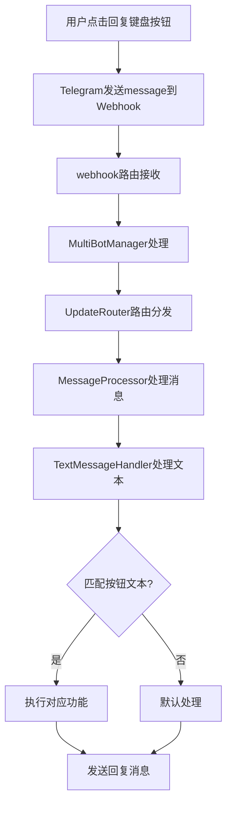
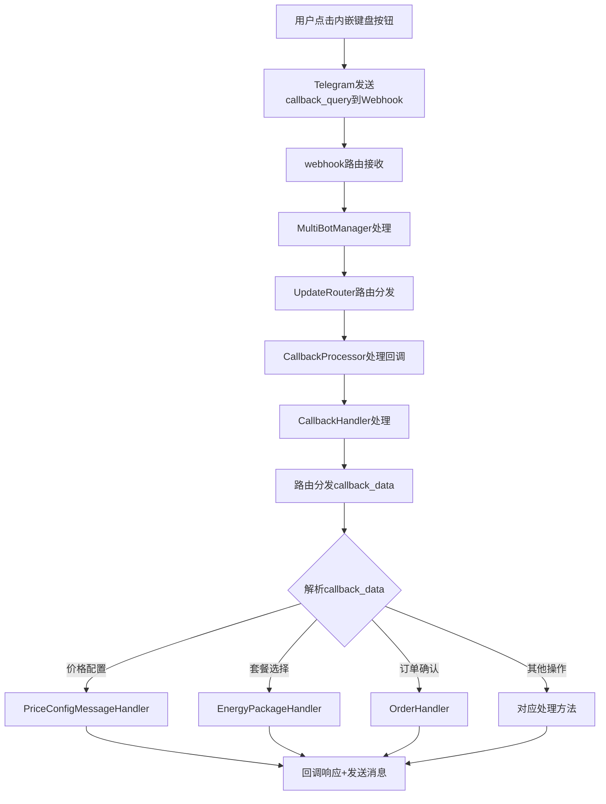
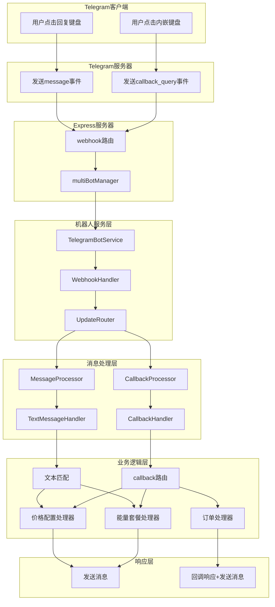
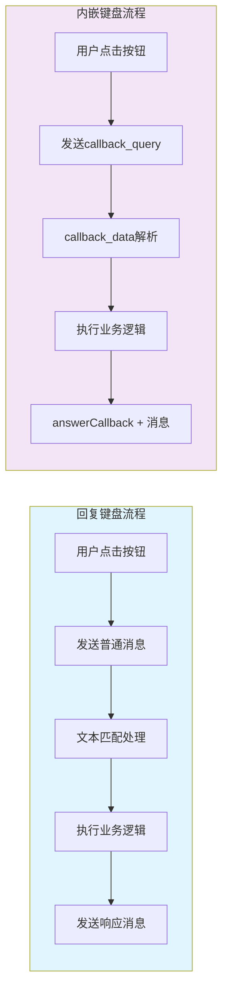
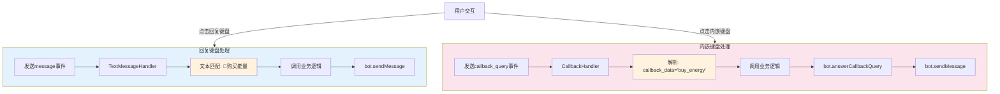

# Telegram 机器人键盘类型对比文档 - Webhook 模式下的区别

## 📋 概述

本文档详细说明了 Telegram 机器人在 Webhook 模式下处理回复键盘（Reply Keyboard）和内嵌键盘（Inline Keyboard）的区别，包括处理流程、路由机制和回调处理。

## 🎯 键盘类型基本对比

### 1. 回复键盘 (Reply Keyboard)

```typescript
interface ReplyKeyboard {
  keyboard: KeyboardButton[][];
  resize_keyboard?: boolean;
  one_time_keyboard?: boolean;
  selective?: boolean;
}
```

**特点：**
- 🔹 显示在用户输入框底部
- 🔹 点击后发送普通文本消息
- 🔹 不产生 `callback_query` 事件
- 🔹 消息作为用户输入处理
- 🔹 可以自动调整大小、一次性使用
- 🔹 支持特殊功能：联系人、位置分享

### 2. 内嵌键盘 (Inline Keyboard)

```typescript
interface InlineKeyboard {
  inline_keyboard: InlineKeyboardButton[][];
}

interface InlineKeyboardButton {
  text: string;
  callback_data?: string;
  url?: string;
  web_app?: WebAppInfo;
}
```

**特点：**
- 🔹 显示在消息下方
- 🔹 点击后产生 `callback_query` 事件
- 🔹 不占用输入框空间
- 🔹 支持回调数据、URL 链接、Web App
- 🔹 可以修改原消息

## 🚀 Webhook 模式下的处理流程

### 回复键盘处理流程



### 内嵌键盘处理流程



## 🔄 在项目中的具体实现

### 1. Webhook 接收端点

**路径**: `api/routes/telegram.ts`

```typescript
// 多机器人 Webhook 路由
router.post('/webhook/:botUsername', async (req, res) => {
  const { botUsername } = req.params;
  const update = req.body;
  
  // 快速响应避免超时
  res.status(200).json({ ok: true });
  
  // 异步处理消息
  setImmediate(async () => {
    const botInstance = multiBotManager.getBotInstanceByUsername(botUsername);
    await botInstance.service.processWebhookUpdate(update);
  });
});
```

### 2. 更新分发路由

**路径**: `api/services/telegram-bot/processor/UpdateRouter.ts`

```typescript
async route(update: any): Promise<MessageProcessResult> {
  // 处理普通消息（回复键盘点击）
  if (update.message) {
    return await this.messageProcessor.processMessage(update.message);
  }

  // 处理回调查询（内嵌键盘点击）
  if (update.callback_query) {
    return await this.callbackProcessor.processCallbackQuery(update.callback_query);
  }
}
```

### 3. 回复键盘处理

**路径**: `api/services/telegram-bot/keyboards/builders/ReplyKeyboardBuilder.ts`

```typescript
// 构建主菜单回复键盘
static buildMainMenuKeyboard(): TelegramBot.ReplyKeyboardMarkup {
  return {
    keyboard: [
      [{ text: '🔋 购买能量' }, { text: '📋 我的订单' }],
      [{ text: '💰 账户余额' }, { text: '❓ 帮助支持' }],
      [{ text: '🔄 刷新菜单' }]
    ],
    resize_keyboard: true,
    one_time_keyboard: false
  };
}
```

**处理器**: `api/services/telegram-bot/processor/handlers/TextMessageHandler.ts`

```typescript
// 文本消息处理（回复键盘点击产生的消息）
async processMessage(message: TelegramBot.Message): Promise<void> {
  const text = message.text;
  
  switch (text) {
    case '🔋 购买能量':
      await this.handleBuyEnergy(chatId);
      break;
    case '📋 我的订单':
      await this.handleMyOrders(chatId);
      break;
    // ... 其他按钮处理
  }
}
```

### 4. 内嵌键盘处理

**路径**: `api/services/telegram-bot/keyboards/builders/InlineKeyboardBuilder.ts`

```typescript
// 构建主菜单内嵌键盘
static buildMainMenuKeyboard(): InlineKeyboard {
  return {
    inline_keyboard: [
      [
        { text: '🔋 购买能量', callback_data: 'buy_energy' },
        { text: '📋 我的订单', callback_data: 'my_orders' }
      ],
      [
        { text: '💰 账户余额', callback_data: 'check_balance' },
        { text: '❓ 帮助支持', callback_data: 'help_support' }
      ]
    ]
  };
}
```

**处理器**: `api/services/telegram-bot/callbacks/CallbackHandler.ts`

```typescript
// 回调查询处理（内嵌键盘点击）
async routeCallback(chatId: number, data: string, callbackQuery: TelegramBot.CallbackQuery): Promise<void> {
  // 首先响应回调查询
  await this.safeAnswerCallbackQuery(callbackQuery.id);
  
  // 根据 callback_data 路由到对应处理方法
  switch (data) {
    case 'buy_energy':
      await this.handleBuyEnergyCallback(chatId);
      break;
    case 'my_orders':
      await this.handleMyOrdersCallback(chatId);
      break;
    // ... 其他回调处理
  }
}
```

## 📊 主要区别总结

| 特性 | 回复键盘 (Reply Keyboard) | 内嵌键盘 (Inline Keyboard) |
|------|---------------------------|----------------------------|
| **显示位置** | 输入框底部 | 消息下方 |
| **事件类型** | `message` | `callback_query` |
| **数据传递** | 按钮文本作为消息内容 | `callback_data` 字段 |
| **处理路由** | `TextMessageHandler` | `CallbackHandler` |
| **响应要求** | 发送新消息 | `answerCallbackQuery` + 可选消息 |
| **持久性** | 一直显示（除非 one_time） | 随消息存在 |
| **用户体验** | 占用输入区域 | 不影响输入 |
| **功能扩展** | 联系人、位置等特殊功能 | URL、Web App、动态更新 |

## 🔧 Webhook 模式的关键配置

### 1. Webhook 设置

```typescript
// 设置 Webhook URL
const webhookOptions: TelegramBot.SetWebHookOptions = {
  max_connections: 40,
  allowed_updates: ['message', 'callback_query'] // 同时接收两种类型
};

await bot.setWebHook(webhookUrl, webhookOptions);
```

### 2. 更新处理优先级

在 `UpdateRouter` 中，两种类型的更新都会被处理：

```typescript
// 处理顺序：
// 1. message (回复键盘点击产生)
// 2. callback_query (内嵌键盘点击产生)
// 3. 其他类型更新
```

## ⚡ 性能和响应考虑

### 回复键盘
- ✅ 处理简单，直接文本匹配
- ✅ 用户熟悉，类似普通聊天
- ❌ 占用输入区域
- ❌ 按钮文本可能被用户手动输入

### 内嵌键盘
- ✅ 不占用输入空间
- ✅ 支持更复杂的交互
- ✅ 可以动态更新
- ❌ 需要 `answerCallbackQuery` 响应
- ❌ 超时限制（必须在一定时间内响应）

## 🚨 Webhook 模式下的注意事项

### 1. 响应超时
- Telegram 对 webhook 响应有 30 秒超时限制
- 项目中采用快速响应 + 异步处理模式：

```typescript
// 快速响应
res.status(200).json({ ok: true });

// 异步处理
setImmediate(async () => {
  await processUpdate(update);
});
```

### 2. 回调查询响应
- 内嵌键盘点击后必须调用 `answerCallbackQuery`
- 即使不显示通知也需要调用（防止客户端显示加载状态）

```typescript
// 必须响应，即使是空响应
await bot.answerCallbackQuery(callbackQuery.id);
```

### 3. 错误处理
- 两种键盘类型都需要完善的错误处理
- 项目中采用安全方法包装：

```typescript
private async safeSendMessage(chatId: number, text: string): Promise<boolean> {
  try {
    await this.bot.sendMessage(chatId, text);
    return true;
  } catch (error) {
    console.error('Failed to send message:', error);
    return false;
  }
}
```

## 📝 最佳实践建议

### 1. 选择适合的键盘类型
- **回复键盘**：适用于主菜单、简单选择
- **内嵌键盘**：适用于确认对话框、分页、动态操作

### 2. 组合使用
项目中同时使用两种键盘类型，根据场景选择：

```typescript
// 主菜单使用回复键盘（持久显示）
const replyKeyboard = ReplyKeyboardBuilder.buildMainMenuKeyboard();

// 操作确认使用内嵌键盘（临时显示）
const inlineKeyboard = InlineKeyboardBuilder.buildConfirmCancelKeyboard(
  'confirm_action',
  'cancel_action'
);
```

### 3. 状态管理
- 内嵌键盘的状态通过 `callback_data` 传递
- 回复键盘的状态可能需要额外的用户状态管理

---

## 🏗️ 系统架构图

### 完整的处理架构



### 数据流对比

#### 两种键盘类型处理对比图



#### 回复键盘数据流
```
用户点击 "🔋 购买能量" 按钮
    ↓
Telegram 发送: {
  message: {
    text: "🔋 购买能量",
    from: { id: 12345 },
    chat: { id: 67890 }
  }
}
    ↓
TextMessageHandler 匹配文本
    ↓
执行对应的业务逻辑
    ↓
发送新消息给用户
```

#### 内嵌键盘数据流
```
用户点击内嵌按钮
    ↓
Telegram 发送: {
  callback_query: {
    id: "callback_123",
    data: "buy_energy",
    from: { id: 12345 },
    message: { chat: { id: 67890 } }
  }
}
    ↓
CallbackHandler 解析 callback_data
    ↓
answerCallbackQuery(callback_id)
    ↓
执行对应的业务逻辑
    ↓
发送新消息或更新原消息
```

## 🔍 项目中的具体文件映射

### 核心文件结构
```
api/
├── routes/
│   └── telegram.ts                          # Webhook 入口路由
├── services/telegram-bot/
│   ├── callbacks/
│   │   └── CallbackHandler.ts               # 内嵌键盘回调处理
│   ├── handlers/
│   │   ├── WebhookHandler.ts                # Webhook 事件处理
│   │   └── TextMessageHandler.ts            # 回复键盘文本处理
│   ├── keyboards/builders/
│   │   ├── ReplyKeyboardBuilder.ts          # 回复键盘构建器
│   │   └── InlineKeyboardBuilder.ts         # 内嵌键盘构建器
│   └── processor/
│       ├── UpdateRouter.ts                  # 更新分发路由
│       ├── MessageProcessor.ts              # 消息处理器
│       └── CallbackProcessor.ts             # 回调处理器
```

### 处理流程中的关键节点

| 节点 | 回复键盘路径 | 内嵌键盘路径 |
|------|-------------|-------------|
| **入口** | `/webhook/:botUsername` | `/webhook/:botUsername` |
| **事件识别** | `update.message` | `update.callback_query` |
| **路由分发** | `UpdateRouter → MessageProcessor` | `UpdateRouter → CallbackProcessor` |
| **具体处理** | `TextMessageHandler` | `CallbackHandler` |
| **业务逻辑** | 文本匹配 → 功能调用 | callback_data 解析 → 功能调用 |
| **响应方式** | `sendMessage` | `answerCallbackQuery + sendMessage` |

## 🔍 Webhook事件对比图



## 📋 代码示例对比

### 发送回复键盘消息
```typescript
// 发送带回复键盘的消息
const replyKeyboard = ReplyKeyboardBuilder.buildMainMenuKeyboard();
await bot.sendMessage(chatId, '请选择功能:', {
  reply_markup: replyKeyboard
});

// 处理用户点击后的文本消息
// 在 TextMessageHandler 中
switch (message.text) {
  case '🔋 购买能量':
    await this.handleBuyEnergy(chatId);
    break;
  // ...
}
```

### 发送内嵌键盘消息
```typescript
// 发送带内嵌键盘的消息
const inlineKeyboard = InlineKeyboardBuilder.buildMainMenuKeyboard();
await bot.sendMessage(chatId, '请选择功能:', {
  reply_markup: inlineKeyboard
});

// 处理用户点击后的回调查询
// 在 CallbackHandler 中
async handleCallbackQuery(callbackQuery: TelegramBot.CallbackQuery) {
  // 必须先响应回调查询
  await bot.answerCallbackQuery(callbackQuery.id);
  
  // 然后处理具体逻辑
  switch (callbackQuery.data) {
    case 'buy_energy':
      await this.handleBuyEnergyCallback(chatId);
      break;
    // ...
  }
}
```

### Webhook 消息差异

**回复键盘点击产生的 Webhook 消息：**
```json
{
  "update_id": 123456,
  "message": {
    "message_id": 789,
    "from": {
      "id": 12345,
      "is_bot": false,
      "first_name": "User"
    },
    "chat": {
      "id": 12345,
      "type": "private"
    },
    "date": 1632123456,
    "text": "🔋 购买能量"
  }
}
```

**内嵌键盘点击产生的 Webhook 消息：**
```json
{
  "update_id": 123457,
  "callback_query": {
    "id": "callback_query_id",
    "from": {
      "id": 12345,
      "is_bot": false,
      "first_name": "User"
    },
    "message": {
      "message_id": 789,
      "chat": {
        "id": 12345,
        "type": "private"
      },
      "date": 1632123456,
      "text": "请选择功能:",
      "reply_markup": {
        "inline_keyboard": [...]
      }
    },
    "data": "buy_energy"
  }
}
```

## 💡 开发建议和注意事项

### 1. 调试技巧

**查看 Webhook 日志：**
```bash
# 实时查看 webhook 处理日志
tail -f logs/app-$(date +%Y-%m-%d).log | grep -E "(webhook|callback|message)"
```

**测试回调处理：**
```bash
# 模拟 callback_query 请求
curl -X POST http://localhost:3001/api/telegram/webhook/your_bot_username \
  -H "Content-Type: application/json" \
  -d '{
    "update_id": 123,
    "callback_query": {
      "id": "test_callback",
      "data": "buy_energy",
      "from": {"id": 12345},
      "message": {"chat": {"id": 67890}}
    }
  }'
```

### 2. 常见问题排查

**回复键盘不响应：**
- 检查 `TextMessageHandler` 中的文本匹配逻辑
- 确认按钮文本与处理代码中的字符串完全一致

**内嵌键盘超时：**
- 确认 `answerCallbackQuery` 被正确调用
- 检查 callback_data 是否在 `CallbackHandler.routeCallback` 中有对应处理

**Webhook 不工作：**
- 验证 webhook URL 设置：`GET /api/telegram/webhook-info`
- 检查服务器是否能接收外部请求
- 确认机器人 token 和配置正确

### 3. 性能优化建议

**回复键盘优化：**
- 使用 `one_time_keyboard: true` 减少界面占用
- 合理设计按钮文本，避免歧义

**内嵌键盘优化：**
- callback_data 保持简短，减少传输数据量
- 合理设计 callback_data 命名规则，便于路由处理
- 及时调用 `answerCallbackQuery` 提升用户体验

---

*本文档基于项目 `/Volumes/wwx/dev/TronResourceDev/tron-energy-rental` 的实际代码结构编写，涵盖了 Webhook 模式下两种键盘类型的完整处理流程。*
