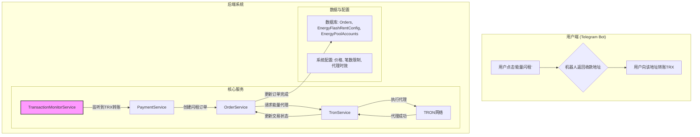
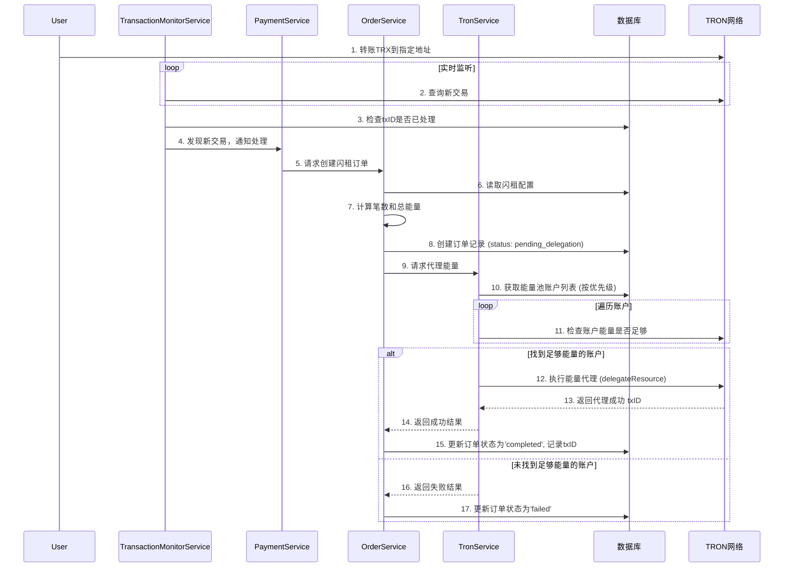

# 能量闪租功能详细设计文档

---

## 1. 功能概述

“能量闪租”功能允许用户通过向系统指定的TRON地址直接转账TRX，快速、自动地租赁能量。系统将实时监听该地址的收款情况，并根据收到的TRX数量，结合预设的能量价格和笔数限制，自动为付款地址代理相应数量和时效的能量。

**核心流程**:

1.  **用户支付**: 用户从Telegram机器人获取能量闪租的收款地址，并向该地址转账TRX。
2.  **交易监听**: 系统后端服务实时监听指定收款地址上的所有TRC-10 (TRX) 转账交易。
3.  **订单匹配与计算**:
    *   一旦监听到新的有效收款，系统立即创建一个内部订单。
    *   根据收到的TRX金额和后台配置的“单笔能量闪租价格”，计算用户应获得的“笔数”。
    *   笔数计算需遵循后台设置的“最大笔数”限制。
4.  **能量代理**:
    *   系统根据计算出的总能量需求（笔数 * 单笔能量值），从能量池中选择一个有足够能量且优先级最高的账户。
    *   执行能量代理操作，将能量代理给付款方的TRON地址。
    *   代理的有效期根据“能量闪租”配置决定（例如，1小时、24小时或永久）。
5.  **订单完成**: 能量代理成功后，更新内部订单状态为“已完成”，并记录相关交易信息。

---

## 2. 系统架构与模块设计

新功能将无缝集成到现有系统中，主要涉及对 `TronService`、`OrderService` 和 `PaymentService` 的扩展，并引入一个新的后台服务 `TransactionMonitorService`。



### 2.1. 新增模块: `TransactionMonitorService`

-   **职责**: 持续监听一个或多个指定的收款地址，捕获所有传入的TRX交易，并识别其所属网络。
-   **技术实现**:
    -   利用 `tronweb.getEventResult` 或轮询 `tronweb.getTransactionsToAddress` API。考虑到实时性，推荐使用基于事件的监听（如果节点支持）或高频率轮询（例如，每3-5秒一次）。
    -   服务启动时，从数据库加载需要监听的地址列表，**每个地址都应关联一个 `network_id`**。
    -   当监听到交易时，将交易及关联的 `network_id` 传递给 `PaymentService`。
    -   为防止重复处理，需要记录已处理的交易ID (`txID`) 到Redis或数据库中。

### 2.2. 模块扩展: `PaymentService`

-   **新增方法**: `handleFlashRentPayment(transaction, networkId)`
    -   **输入**: `TransactionMonitorService` 捕获到的交易对象和对应的 `networkId`。
    -   **逻辑**:
        1.  验证交易有效性（例如，确认数、状态）。
        2.  提取付款方地址 (`from_address`) 和TRX金额 (`amount`)。
        3.  调用 `OrderService.createFlashRentOrder`，并传入付款地址、金额以及 `networkId`。

### 2.3. 模块扩展: `OrderService`

-   **新增方法**: `createFlashRentOrder(fromAddress, trxAmount, networkId)`
    -   **逻辑**:
        1.  **根据 `networkId`** 从 `price_configs` 表中读取 `mode_type = 'energy_flash'` 的配置（单价、最大笔数等）。
        2.  计算笔数: `Math.min(Math.floor(trxAmount / pricePerUnit), maxUnits)`。
        3.  计算总能量: `units * energyPerUnit`。
        4.  在 `orders` 表中创建一条新记录，包含付款地址、TRX金额、计算出的笔数、总能量、状态（`pending_delegation`）、以及 `network_id` 等信息。
        5.  调用 `TronService.delegateEnergyForFlashRent`，并传入 `networkId`。

### 2.4. 模块扩展: `TronService`

-   **新增方法**: `delegateEnergyForFlashRent(toAddress, totalEnergy, durationHours, networkId)`
    -   **逻辑**:
        1.  **选择能量池账户**:
            -   **根据 `networkId`** 按 `priority` 降序从 `energy_pools` 表中查询所有可用账户。
            -   依次检查每个账户的可用能量 (`tronweb.getAccountResources`) 是否满足 `totalEnergy` 需求。
            -   选择第一个满足条件的账户作为 `ownerAddress`。
            -   如果所有账户能量都不足，记录错误并更新订单状态为 `failed`。
        2.  **执行代理**:
            -   调用 `tronweb.transactionBuilder.freezeBalanceV2` 或 `delegateResource` 方法。
            -   根据 `durationHours` 设置 `lock` 和 `lock_period` 参数。如果 `durationHours` 为0或null，则为永久代理。
            -   签名并广播交易。
        3.  **结果处理**:
            -   代理成功后，返回 `txID`。
            -   代理失败，则抛出异常。
    -   **更新 `OrderService`**: 代理成功后，`OrderService` 将订单状态更新为 `completed`，并保存代理交易的 `txID`。

---

## 3. 数据库设计

主要依赖现有表结构，可能需要对 `orders` 表进行微调，并确保相关配置表存在。

### 3.1. `orders` 表

建议新增以下字段以支持闪租业务：

-   `network_id` (INTEGER): 新增字段，关联到 `tron_networks` 表，用于区分订单所属的TRON网络（如主网、Nile测试网）。
-   `order_type` (VARCHAR): 增加新类型 `'FLASH_RENT'`。
-   `payment_trx_amount` (DECIMAL): 记录用户支付的TRX金额。
-   `calculated_units` (INTEGER): 记录计算出的笔数。
-   `delegated_energy_amount` (BIGINT): 记录代理的总能量。
-   `delegation_tx_id` (VARCHAR): 记录能量代理交易的哈希。

### 3.2. `price_configs` 表

根据数据库检查，能量闪租的配置存储在 `price_configs` 表中。为了支持为不同的TRON网络（如主网、Nile测试网）提供独立的闪租配置，需要对现有表结构进行调整。

**核心问题**: 当前 `price_configs` 表对 `mode_type` 字段有唯一约束，导致无法为每个网络创建一条 `mode_type = 'energy_flash'` 的记录。

**解决方案**:

1.  **移除唯一约束**: 删除 `mode_type` 字段的唯一约束。
2.  **新增网络ID字段**: 在表中直接添加 `network_id` 字段，并将其作为外键关联到 `tron_networks` 表。
3.  **创建复合唯一索引**: 创建一个基于 `(mode_type, network_id)` 的复合唯一索引，确保每个网络只能有一条特定模式的配置。

**调整后的表结构建议**:

-   `id` (PK)
-   `mode_type` (VARCHAR): 模式类型，例如 `'energy_flash'`。
-   `network_id` (INTEGER): **新增字段**，关联到 `tron_networks.id`，用于区分网络。
-   `config` (JSONB): 存储具体配置。
-   ... (其他字段)

**`config` 字段 (JSONB) 结构**:

-   `payment_address` (VARCHAR): 用于接收用户付款的TRON地址。
-   `price_per_unit_trx` (DECIMAL): 单笔闪租的TRX价格。
-   `max_units_per_order` (INTEGER): 单次购买的最大笔数。
-   `energy_per_unit` (BIGINT): 每笔对应的能量值。
-   `delegation_duration_hours` (INTEGER): 能量代理的时效（小时）。`0` 或 `null` 代表永久。

**数据库迁移脚本 (示例)**:
```sql
-- 1. 移除旧的唯一约束 (约束名称需要根据实际情况确认)
ALTER TABLE price_configs DROP CONSTRAINT price_configs_mode_type_key;

-- 2. 新增 network_id 字段并设置默认值 (例如，默认指向主网)
ALTER TABLE price_configs ADD COLUMN network_id INTEGER;
UPDATE price_configs SET network_id = (SELECT id FROM tron_networks WHERE name = 'Mainnet') WHERE mode_type = 'energy_flash';
ALTER TABLE price_configs ALTER COLUMN network_id SET NOT NULL;

-- 3. 添加外键约束
ALTER TABLE price_configs ADD CONSTRAINT fk_tron_networks FOREIGN KEY (network_id) REFERENCES tron_networks(id);

-- 4. 创建复合唯一索引
CREATE UNIQUE INDEX idx_price_configs_mode_type_network_id ON price_configs (mode_type, network_id);

-- 5. (可选) 将原config字段中的network_id移除
-- 此步骤需要编写脚本完成，具体取决于数据量和复杂度
```

---

## 4. 详细工作流程 (时序图)



---

## 5. API 变更

此功能主要由后端服务驱动，几乎没有对外的API变更。但可能需要为后台管理界面提供以下API：

-   `GET /api/system/flash-rent-config`: 获取当前的能量闪租配置。
-   `PUT /api/system/flash-rent-config`: 更新能量闪租配置。

---

## 6. 错误处理机制

-   **能量池不足**: `TronService` 在遍历所有能量池账户后若无足够能量，应记录详细日志，并将订单标记为 `failed`，状态原因为 `INSUFFICIENT_POOL_ENERGY`。可考虑后续实现通知机制，提醒管理员补充能量。
-   **TRON交易失败**: 在能量代理过程中，任何TRON网络层面的失败（如广播失败、节点错误）都应被捕获。`TronService` 应重试2-3次，若仍然失败，则将订单标记为 `failed`，并记录详细的错误信息。
-   **重复交易处理**: `TransactionMonitorService` 必须严格使用Redis或数据库来记录已处理的 `txID`，防止因网络延迟或服务重启导致重复处理同一笔支付。
-   **无效支付**: 对于金额过小（无法兑换至少1笔）的支付，可以将其记录为“无效支付”或直接忽略。

---

## 7. 前端UI变更

为了让后台管理功能与多网络架构保持一致，前端相关页面也需要进行适配。

### 7.1. 价格配置页面 (`/price-config`)

-   **增加网络选择器与当前网络显示**:
    -   **网络选择**: 在页面的主要操作区域（如表格上方），添加一个网络选择下拉菜单，用于在不同的TRON网络之间切换。该下拉菜单的数据应从 `/api/tron/networks` 接口获取，展示所有已配置的网络。
    -   **当前网络显示**: 仿照“能量池管理-账户管理”页面，在页面标题或表格的显著位置，清晰地展示当前所选网络的名称（例如：“价格配置 - 主网”），以便用户明确当前的操作上下文。
-   **数据筛选**: 
    -   页面加载时，默认选中一个网络（例如主网），并仅请求和显示该网络下的价格配置 (`mode_type = 'energy_flash'`)。
    -   当用户在下拉菜单中选择另一个网络时，页面应立即使用新的 `network_id` 作为筛选条件，向后端重新请求数据并刷新表格。
-   **新增/编辑操作**:
    -   在打开“新增”或“编辑”配置的弹窗时，表单需要将当前选中的 `network_id` 作为隐藏字段或只读字段包含在内。
    -   提交保存时，`network_id` 必须作为参数一同发送给后端API，以确保配置与正确的网络关联。

---

请您审核此设计文档。如果确认无误，我将开始着手代码实现。