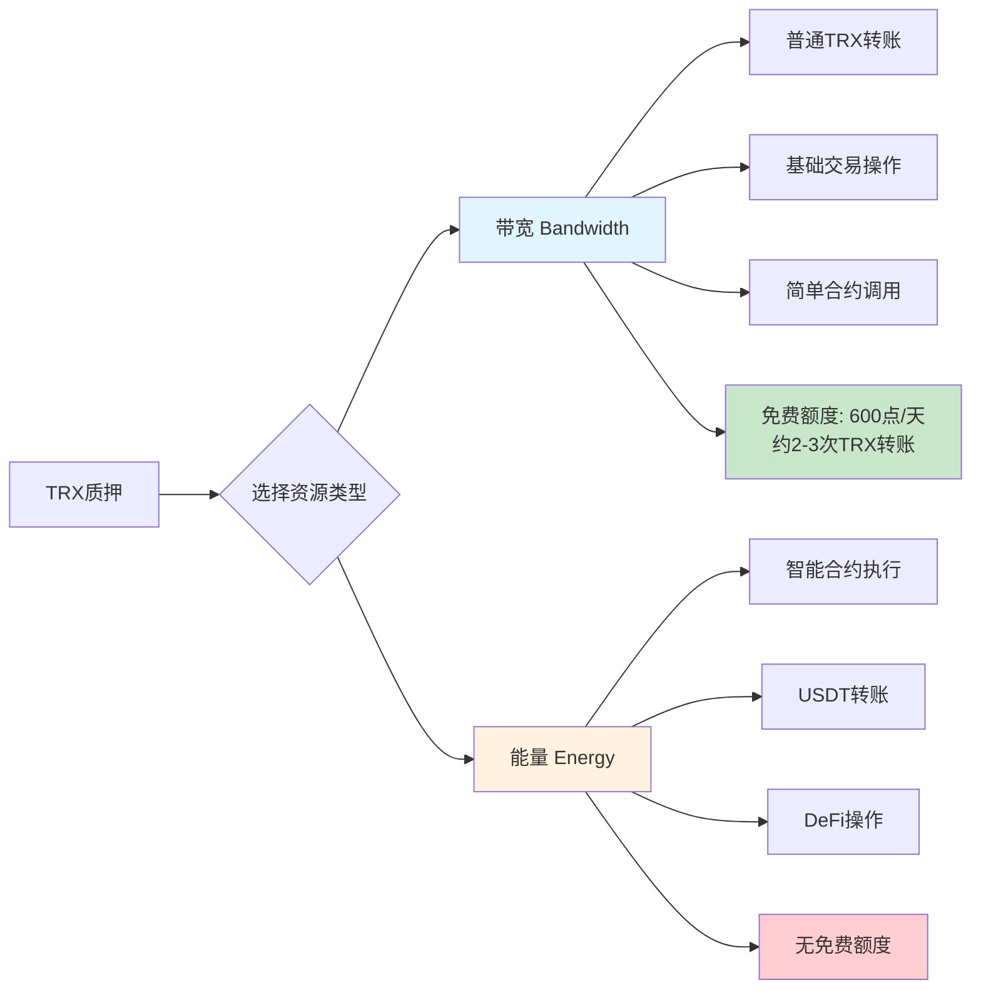
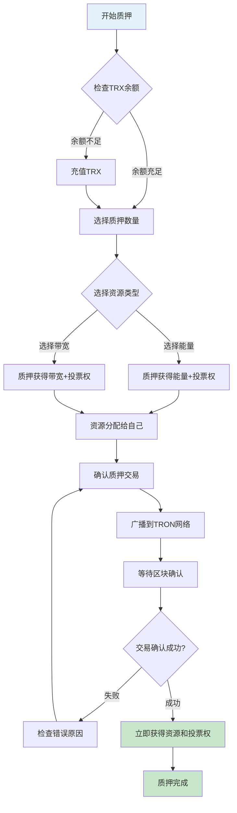
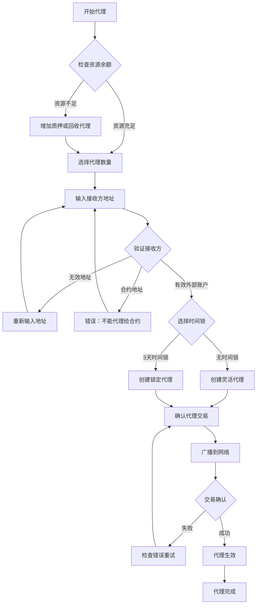
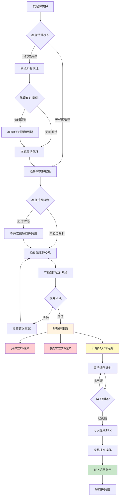

# TRON网络TRX质押机制详细文档

**基于TRON官方Stake 2.0文档整理**

## 官方文档参考
- [TRON官方质押文档](https://developers.tron.network/docs/staking-on-tron-network)
- [FreezeBalanceV2 API](https://developers.tron.network/reference/freezebalancev2-1)
- [UnfreezeBalanceV2 API](https://developers.tron.network/reference/unfreezebalancev2-1)
- [Stake 2.0 Solidity API](https://developers.tron.network/docs/stake-2-0-solidity-api)

## 目录
1. [质押机制概述](#质押机制概述)
2. [资源类型详解](#资源类型详解)
3. [质押与代理操作流程](#质押与代理操作流程)
4. [解质押机制](#解质押机制)
5. [投票权与奖励机制](#投票权与奖励机制)
6. [经济模型分析](#经济模型分析)
7. [实际应用场景](#实际应用场景)
8. [注意事项与风险](#注意事项与风险)
9. [API接口说明](#api接口说明)
10. [常见问题解答](#常见问题解答)

---

## 质押机制概述

### 基本概念
在TRON网络中，用户可以通过**质押（Stake）TRX**来获取网络资源和治理权限。质押机制是TRON网络资源分配和治理参与的核心机制。

**官方Stake 2.0说明：**
- **质押（Stake）**：官方术语，指将TRX锁定以获取资源
- **解质押（Unstake）**：官方术语，指解除TRX锁定状态
- **Stake 2.0**：TRON最新的质押机制版本

### 质押收益
- **网络资源**：带宽（Bandwidth）或能量（Energy）
- **投票权**：TRON Power（TP），1 TRX = 1 TP
- **投票奖励**：参与超级代表选举获得的奖励

### 质押特点
- **立即生效**：质押完成后立即获得资源和投票权
- **永久有效**：质押不会自动解质押，需要手动操作
- **锁定期**：解质押需要14天等待期
- **灵活性**：可以代理资源给其他账户
- **可撤销**：随时可以发起解质押操作

---

## 资源类型详解

### 资源类型对比图



### 带宽 vs 能量消耗对比表

**⚠️ 重要澄清：USDT转账主要消耗带宽，不是能量！**

| 交易类型 | 带宽消耗 | 能量消耗 | 免费额度 | 超出成本 |
|---------|---------|---------|----------|----------|
| **TRX转账** | ✅ 269点/次 | ❌ 0 | ✅ 600点/天 | ~0.269 TRX |
| **USDT转账** | ✅ 269点/次 | ❌ 0 | ✅ 600点/天 | ~0.269 TRX |
| **账户激活** | ✅ 100-200点 | ❌ 0 | ✅ 600点/天 | ~0.1 TRX |
| **权限更新** | ✅ 50-150点 | ❌ 0 | ✅ 600点/天 | ~0.05-0.15 TRX |
| **DeFi交易** | ✅ 少量 | ✅ 50,000-100,000点 | ❌ 无免费能量 | ~5-10 TRX |
| **NFT操作** | ✅ 少量 | ✅ 100,000-200,000点 | ❌ 无免费能量 | ~10-20 TRX |

### 带宽（Bandwidth）

#### ⚠️ 重要澄清：USDT转账消耗带宽

**常见误解澄清：**
```
❌ 错误认知：USDT转账消耗大量能量
✅ 实际情况：USDT转账主要消耗带宽，与TRX转账相同

USDT转账的真实机制：
✅ 消耗资源：约269带宽点/次
✅ 免费额度：每天600点免费带宽
✅ 覆盖能力：每天可免费转账2-3次USDT
✅ 超出成本：约0.269 TRX/次
```

**为什么会有这种误解？**
1. **历史原因**：早期某些文档描述不准确
2. **概念混淆**：将复杂DeFi操作与简单代币转账混淆
3. **第三方错误**：很多非官方文档没有及时更新

#### 免费额度详解
```
官方免费带宽额度：
✅ 每个账户每天获得600免费带宽点
✅ 每24小时自动重置
✅ 无需质押即可使用
✅ 覆盖基础TRX转账需求

实际使用情况：
- TRX转账：约269带宽点/次
- 600点可覆盖：约2-3次TRX转账
- 超出免费额度：需要质押或燃烧TRX
```

#### 用途
- **普通TRX转账**：账户间TRX转移
- **TRC20代币转账**：USDT、USDC等代币转账
- **基础交易操作**：激活账户、更新账户权限等
- **简单智能合约调用**：消耗较少的合约操作

#### 地址激活机制
```
官方地址激活规则：
✅ 新创建的TRON地址需要激活才能使用
✅ 激活方式：接收任意数量的TRX转账
✅ 激活费用：向未激活地址转账时，转账人额外支付1 TRX
✅ 激活后：地址永久可用，无需再次激活
✅ 激活费用：不归接收方所有，为网络激活费用

激活费用示例：
- 向未激活地址转账100 TRX
- 转账人实际支付：101 TRX（100 TRX + 1 TRX激活费）
- 接收方实际收到：100 TRX
- 激活费用：1 TRX（网络收取）
```

#### 消耗特点
- **免费额度**：每个账户每天有600带宽的免费额度
- **消耗计算**：基于交易字节大小计算（当前费率：1字节 = 1带宽点）
- **恢复机制**：每24小时重置到满额
- **实际覆盖**：600点可覆盖约2-3次TRX转账（每次约269点）

#### 获取比例
```
官方质押获取带宽比例：
- 全网每天总共提供43,200,000,000个带宽点
- 用户根据质押TRX数量按比例共享这些带宽点
- 计算公式：用户带宽点 = (用户质押TRX数量 / 全网质押TRX总量) × 43,200,000,000
- 实际比例动态变化，受全网质押情况影响
- 具体比例可通过API查询：/wallet/getaccountresource
- 参考官方API：/wallet/getbandwidthprices
```

### 能量（Energy）

#### 用途
- **智能合约执行**：DeFi协议交互、NFT操作
- **复杂合约调用**：需要大量计算的操作
- **高级DeFi操作**：流动性挖矿、复杂交易等

#### 消耗特点
- **无免费额度**：没有免费的能量额度
- **消耗计算**：基于合约执行的计算复杂度
- **恢复机制**：每24小时重置到满额

#### 典型消耗量
```
常见操作的能量消耗：
- 简单合约调用：约10,000-30,000能量
- Uniswap交易：约50,000-100,000能量
- NFT铸造：约100,000-200,000能量
- 复杂DeFi操作：约200,000-500,000能量
```

#### 获取比例
```
官方质押获取能量比例：
- 全网每天总共提供90,000,000,000个能量点
- 用户根据质押TRX数量按比例共享这些能量点
- 计算公式：用户能量点 = (用户质押TRX数量 / 全网质押TRX总量) × 90,000,000,000
- 实际比例动态变化，受全网质押情况影响
- 具体比例可通过API查询：/wallet/getaccountresource
- 参考官方API：/wallet/getenergyprices
- 实际比例会根据网络状态实时变化
```

---

## 质押与代理操作流程

### ⚠️ 重要概念澄清

#### 质押 ≠ 代理
```
质押操作：
✅ 只能质押给自己
✅ 质押后资源归自己使用
✅ 获得投票权

代理操作：
✅ 质押完成后才能代理
✅ 将已获得的资源代理给他人
✅ 代理后资源归他人使用
❌ 投票权不可代理
```

#### 正确的操作顺序
```
1. 质押TRX给自己 → 获得资源和投票权
2. 使用资源或代理给他人
3. 代理后资源归接收方使用
4. 可以随时取消代理（考虑时间锁）
```

### 质押操作流程



### 代理操作流程



### 代理规则

#### 可代理资源对比表

| 资源类型 | 是否可代理 | 代理后归属 | 备注 |
|---------|-----------|----------|------|
| 🔋 **能量** | ✅ 可以 | 接收方账户 | 最常用的代理类型 |
| 📶 **带宽** | ✅ 可以 | 接收方账户 | 适合普通转账需求 |
| 🗳️ **投票权** | ❌ 不可以 | 质押者账户 | 始终保留在原账户 |

#### 代理对象限制
- ✅ **已激活的外部账户**：可以接收代理
- ❌ **智能合约地址**：不能接收代理
- ❌ **未激活账户**：不能接收代理

#### 代理数量限制
- ✅ **可以代理给多个账户**：一个质押者可以同时代理给多个不同账户
- ✅ **代理关系独立**：每个代理关系都是独立的，互不影响
- ✅ **独立时间锁**：每个代理可以独立设置时间锁
- ⚠️ **总量限制**：总代理量不能超过质押TRX对应的资源量
- ⚠️ **重复代理**：对同一账户重复代理会重置3天等待期

#### 接收代理限制
- ✅ **可以接收多个代理**：一个账户可以同时接收来自多个不同账户的代理
- ✅ **资源累积**：所有代理的资源会累积到接收方账户
- ✅ **独立管理**：每个代理关系都是独立的，代理者可以独立取消
- ✅ **独立时间锁**：每个代理关系的时间锁是独立的
- ⚠️ **使用上限**：接收方不能使用超过所有代理资源总和的数量

### 时间锁机制

#### 无时间锁代理
```
特点：
- 随时可以取消代理
- 灵活性高
- 适合短期资源借用
```

#### 有时间锁代理
```
特点：
- 需要等待3天才能取消代理
- 重复代理会重置3天等待期
- 适合长期稳定的资源分配

重复代理机制：
- ✅ 可以多次代理给同一账户
- ⚠️ 每次重复代理都会重置3天等待期
- ⚠️ 重复代理会累积资源总量
- ⚠️ 需要等待最新的3天等待期到期才能取消
```

### 取消代理机制

#### 取消代理后的资源回收
```
取消代理后：
✅ 资源立即返回质押者账户
✅ 质押者可以重新使用资源
✅ 代理关系完全解除
✅ 接收方无法继续使用

重要说明：
- 已消耗的资源无法回收（已经使用）
- 未消耗的资源立即返回质押者
- 每天24:00自动恢复到质押时的资源总量
- 虽然已消耗的资源无法回收，但每天会重新获得完整资源
```

#### 时间锁对取消的影响
```
无时间锁代理：
✅ 随时可以取消代理
✅ 资源立即返回
✅ 无等待期

有时间锁代理：
⏰ 需要等待3天时间锁到期
⏰ 3天内无法取消代理
⏰ 到期后可以立即取消
⚠️ 重复代理会重置3天等待期
```

---

## 解质押机制

### 解质押流程



### 解质押规则

#### 等待期规则
```
等待时间：14天（固定）
等待期间：
- TRX被锁定，无法使用
- 相应资源立即减少
- 投票权立即减少
```

#### 解质押限制
```
已代理资源无法解质押：
- 必须先取消代理
- 等待代理取消确认
- 然后才能解质押对应的TRX

并发限制：
- 最多可同时进行32笔解质押操作
- 超过限制需要等待之前的解质押完成
```

### 解质押代价与影响

#### 解质押的代价
```
解质押生效后：
❌ 能量/带宽立即减少
❌ 投票权立即减少
❌ 无法继续使用这些资源
⏰ 必须等待14天才能取回TRX
💰 资金完全无法使用
🔒 无法转账、交易或重新质押
```

#### 替代解决方案
```
1. 资源代理（推荐）：
✅ 保持质押状态
✅ 资源给他人使用
✅ 保留投票权
✅ 随时可取消代理

2. 分批质押策略：
质押1000 TRX → 分10次，每次100 TRX
解质押时 → 每3-4天发起一次
结果 → 从第14天开始，每天都有TRX可用

3. 燃烧模式支付：
✅ 偶尔使用
✅ 资金流动性要求高
✅ 不想锁定资金
```

---

## 投票权与奖励机制

### 投票权的作用和价值

#### 质押机制的双重收益
```
质押TRX = 获得资源 + 获得投票权

质押100 TRX的结果：
✅ 立即获得能量/天（资源，具体数量取决于全网质押情况）
✅ 同时获得100投票权（TP）
✅ 两个收益是同时产生的
✅ 不是二选一，而是双重收益
```

#### 投票权的核心作用
```
1. 参与网络治理：
   ✅ 选举超级代表（SR）
   ✅ 参与网络参数决策
   ✅ 影响TRON生态发展方向
   ✅ 获得治理参与权

2. 获得投票奖励：
   💰 区块生产奖励分成
   💰 超级代表佣金返还
   💰 网络治理参与奖励
   💰 被动收入来源

3. 影响网络决策：
   📊 投票权重决定影响力
   🏛️ 参与网络升级决策
   ⚙️ 影响协议参数调整
   🚀 塑造TRON未来方向
```

#### 投票权的实际价值
```
假设质押1000 TRX：
投票权：1000 TP
年化收益率：通常3-7%
年投票奖励：30-70 TRX
月投票奖励：约2.5-5.8 TRX

对比分析：
质押1000 TRX获得能量/天（具体数量取决于全网质押情况）
每天节省费用：约1-2 TRX
月节省费用：30-60 TRX
月投票奖励：4.2 TRX

总收益：节省费用 + 投票奖励
```

### 投票权机制

#### 投票权获得
```
投票权比例：1 TRX = 1 TP（TRON Power）
投票权特点：
- 与质押TRX数量1:1对应
- 不可转让或代理
- 可以分散投票给多个候选人
```

#### TP与能量的区别
```
TP（投票权）特点：
✅ 质押后立即获得
✅ 持续有效，不会消耗
✅ 不会每天重置
✅ 只有解质押才会减少

能量特点：
✅ 质押后立即获得
✅ 使用后会消耗
✅ 每天自动恢复到满额
✅ 持续循环使用
```

#### 投票规则
```
投票对象：超级代表（SR）和超级代表候选人
投票分配：可以将投票权分配给多个候选人
投票更新：可以随时修改投票分配
投票有效期：持续有效，直到修改或解质押
```

### 🏛️ 超级代表选举机制

#### 什么是超级代表（SR）？
```
超级代表：
- TRON网络的27个核心节点
- 负责生产区块和验证交易
- 通过投票选举产生
- 每6小时重新计算排名
```

#### 投票策略建议
```
新手用户：
- 选择排名靠前的SR
- 分散投票给3-5个SR
- 关注SR的佣金比例

经验用户：
- 分析SR的历史表现
- 动态调整投票分配
- 关注网络治理提案

专业用户：
- 深入研究SR技术实力
- 参与治理提案讨论
- 优化投票收益策略
```

#### 选择超级代表的标准
```
技术实力：
✅ 节点稳定性
✅ 技术更新频率
✅ 社区贡献度
✅ 安全记录

收益表现：
✅ 佣金分成比例
✅ 历史奖励记录
✅ 投票权重排名
✅ 长期表现稳定性

治理参与：
✅ 提案参与度
✅ 社区活跃度
✅ 生态贡献
✅ 透明度
```

### 投票奖励机制

#### 奖励来源
```
奖励构成：
- 区块生产奖励分成
- 投票奖励分配
- 超级代表佣金返还
```

#### 奖励计算
```
奖励因素：
- 投票数量
- 被投票SR的排名和表现
- SR的奖励分配比例
- 网络整体参与度
```

#### 奖励领取
```
领取方式：
- 自动分配到账户
- 定期结算（通常每6小时）
- 无需手动操作
```

### "待领取奖励"的真实机制

#### 重要澄清
```
实际机制：
✅ 奖励已经自动分配到账户
✅ TRX余额已经增加
✅ "待领取"是钱包的显示机制
✅ 点击领取只是确认操作

官方机制：
✅ 奖励确实每6小时自动分配
✅ TRX余额自动增加
✅ 无需手动操作
✅ 系统自动处理
```

### 投票奖励收益构成

#### 奖励来源
```
奖励构成：
- 区块生产奖励分成
- 投票奖励分配
- 超级代表佣金返还
```

#### 收益计算示例
```
假设质押1000 TRX：
投票权：1000 TP
年化收益率：通常3-7%
年投票奖励：30-70 TRX
月投票奖励：约2.5-5.8 TRX

对比分析：
质押1000 TRX获得能量/天（具体数量取决于全网质押情况）
每天节省费用：约1-2 TRX
月节省费用：30-60 TRX
月投票奖励：4.2 TRX

总收益：节省费用 + 投票奖励
```

### 质押与投票的关系

#### 可以只质押不投票吗？
```
质押后的选择：
✅ 质押TRX获得资源和投票权
✅ 可以选择不投票（投票权闲置）
✅ 可以选择投票给SR
✅ 可以选择分散投票给多个SR

重要说明：
- 质押和投票是两个独立的行为
- 质押是必须的（获得资源）
- 投票是可选的（参与治理）
```

#### 投票是否会扣TRX？
```
投票机制说明：
✅ 投票不消耗质押的TRX
✅ 投票权来自质押的TRX
✅ 1 TRX = 1 投票权（TP）
✅ 投票后TRX数量不变
✅ 可以随时修改投票分配

重要：投票本身不扣TRX，只是消耗少量手续费
```

### 质押的永久性说明

#### 质押不会自动解质押
```
质押机制特点：
✅ 质押后永久有效
✅ 不会自动解质押
✅ 不会过期失效
✅ 不会自动释放TRX
✅ 需要手动发起解质押
```

#### 自动恢复的资源
```
资源自动恢复：
✅ 能量/带宽：每24小时自动恢复到满额
✅ 免费带宽：每天600点自动重置
✅ 投票权：持续有效，无需刷新
✅ 投票奖励：每6小时自动结算

不会自动变化：
❌ 质押的TRX数量：保持不变
❌ 质押状态：不会自动解除
❌ 投票分配：不会自动调整
❌ 代理关系：不会自动取消
```

### 能量和带宽的每日重置机制

#### 每日自动重置机制
```
✅ 权威确认：能量和带宽每天都会自动重置！
✅ 重置时间：每天24:00（UTC时间）
✅ 重置方式：完全恢复到质押时的资源总量
✅ 持续循环：每天都有新的资源可用
```

#### 具体重置示例
```
质押1000 TRX获得14090能量：

第1天：14090能量 → 使用5000 → 剩余9090
第2天：自动恢复到14090能量 → 使用8000 → 剩余6090  
第3天：自动恢复到14090能量 → 使用14090 → 剩余0
第4天：自动恢复到14090能量 → 继续使用...

持续循环，每天都有新的能量！
```

---

## 经济模型分析

### 成本效益分析

#### 质押模式 vs 燃烧模式
```
质押模式：
优势：
- 资源可重复使用（每24小时恢复）
- 获得投票权和奖励
- 长期成本较低

劣势：
- 需要锁定TRX（流动性风险）
- 14天解质押等待期
- 需要提前规划资源需求

燃烧模式：
优势：
- 即用即付，灵活性高
- 无需锁定资金
- 适合偶尔使用

劣势：
- 长期成本较高
- 无投票权和奖励
- TRX永久消耗
```

### 燃烧TRX机制

#### 燃烧TRX的特点
```
✅ 即时获取：燃烧TRX后立即获得资源
✅ 无时效性：获得的资源不会过期
✅ 立即消耗：资源在交易中立即使用
✅ 无存储性：无法保存到下次使用
```

#### 三种获取方式对比

| 获取方式 | 时效性 | 存储性 | 成本 | 适用场景 |
|---------|--------|--------|------|----------|
| **质押TRX** | 每天重置 | 可存储 | 低 | 长期使用 |
| **租赁资源** | 有租期限制 | 可存储 | 中等 | 短期使用 |
| **燃烧TRX** | 即时使用 | 不可存储 | 高 | 紧急使用 |

#### 成本对比分析

```
燃烧TRX成本（基于当前网络参数）：
- USDT转账：约13.85 TRX
- 复杂智能合约：20-50 TRX
- 每次交易都需要重新燃烧
- 高频交易成本极高

替代方案成本：
- 质押1000 TRX：每天14090能量，成本分摊
- 租赁能量：65,000能量约7 TRX，可重复使用
- 燃烧TRX：每次13.85 TRX，用完即消失
```

#### 使用建议

```
适合燃烧TRX的情况：
✅ 紧急交易：需要立即执行
✅ 偶尔使用：不经常使用网络
✅ 小额交易：单次成本可接受
✅ 测试用途：临时测试功能

不适合燃烧TRX的情况：
❌ 高频交易：成本会迅速累积
❌ 大量操作：智能合约交互
❌ 长期使用：质押更经济
❌ 批量操作：租赁更划算
```

### 资源价值计算

#### 能量价值评估
```
计算公式：
能量成本 = 质押TRX数量 × TRX价格 ÷ 获得能量数量 ÷ 365天

示例计算（假设数据）：
- 质押100 TRX获得1,400能量
- TRX价格0.1美元
- 年化能量成本 = 100 × 0.1 ÷ 1,400 ÷ 365 ≈ 0.0000196美元/能量/天
```

#### 投资回报率
```
收益来源：
1. 节省的交易手续费
2. 投票奖励收益
3. TRX价格升值收益

风险因素：
1. TRX价格波动风险
2. 网络参数调整风险
3. 流动性风险（14天锁定）
```

---

## 实际应用场景

### 用户类型与策略

### 个人用户场景

#### 轻度使用者
```
特征：偶尔转账，少量DeFi操作
建议：
- 质押少量TRX获得基础能量
- 重点关注带宽需求
- 利用免费带宽额度
```

#### 重度使用者
```
特征：频繁DeFi操作，大量智能合约交互
建议：
- 质押大量TRX获得充足能量
- 考虑代理机制优化资源分配
- 积极参与投票获得额外收益
```

### 企业用户场景


#### DApp开发者
```
需求：为用户提供良好的交易体验
策略：
- 质押大量TRX获得能量池
- 通过代理为用户提供免费交易
- 建立资源管理和监控系统
```

#### 交易所/钱包
```
需求：处理大量用户交易
策略：
- 建立分层资源管理体系
- 动态调整质押策略
- 优化资源利用效率
```

### 投资者场景


#### 长期持有者
```
策略：
- 质押获得投票权
- 参与网络治理
- 获得稳定的投票奖励
```

#### 套利交易者
```
策略：
- 关注资源价格波动
- 在不同时期调整质押策略
- 利用代理机制进行资源租赁
```

---

## 注意事项与风险

### 操作注意事项

#### 质押前检查
```
检查清单：
□ 确认质押数量和资源类型
□ 验证接收账户地址
□ 了解当前网络资源获取比例
□ 评估未来资源需求
□ 确保保留足够的流动资金
```

#### 代理资源注意
```
注意事项：
- 确认代理对象的可信度
- 理解时间锁的影响
- 监控代理资源的使用情况
- 及时调整代理策略
```

#### 解质押规划
```
规划要点：
- 提前14天规划资金需求
- 考虑市场波动对解质押时机的影响
- 分批解质押降低风险
- 保持必要的资源储备
```

### 风险评估

#### 技术风险
```
风险类型：
- 网络参数调整风险
- 智能合约漏洞风险
- 系统升级影响风险

应对措施：
- 关注官方公告
- 分散质押策略
- 保持技术更新
```

#### 市场风险
```
风险类型：
- TRX价格波动风险
- 资源需求变化风险
- 竞争网络影响风险

应对措施：
- 合理控制质押比例
- 动态调整策略
- 多元化投资组合
```

#### 流动性风险
```
风险描述：
- 14天解质押等待期
- 资金无法及时变现
- 错过市场机会

应对措施：
- 保持合理的资金配置
- 分批质押和解质押
- 建立应急资金池
```

---

## API接口说明

**基于TRON官方Stake 2.0 API文档**

### 质押相关接口

#### 质押TRX (Stake 2.0)
```http
POST /wallet/freezebalancev2
Content-Type: application/json

{
  "owner_address": "TL5afFHPzESaGrvG8JKAwrNx6drbDZf9it",
  "frozen_balance": 100000000,
  "resource": "ENERGY"
}

参数说明：
- owner_address: 质押者地址（hex格式）
- frozen_balance: 质押数量（sun单位，1 TRX = 1,000,000 sun）
- resource: 资源类型（"ENERGY" 或 "BANDWIDTH"）

官方文档：https://developers.tron.network/reference/freezebalancev2-1
```

#### 解质押TRX (Stake 2.0)
```http
POST /wallet/unfreezebalancev2
Content-Type: application/json

{
  "owner_address": "TL5afFHPzESaGrvG8JKAwrNx6drbDZf9it",
  "unfreeze_balance": 100000000,
  "resource": "ENERGY"
}

参数说明：
- owner_address: 解质押者地址
- unfreeze_balance: 解质押数量
- resource: 资源类型

官方文档：https://developers.tron.network/reference/unfreezebalancev2-1
```

### 代理相关接口

#### 代理资源
```http
POST /wallet/delegateresource
Content-Type: application/json

{
  "owner_address": "TL5afFHPzESaGrvG8JKAwrNx6drbDZf9it",
  "receiver_address": "TTargetAddress...",
  "balance": 50000000,
  "resource": "ENERGY",
  "lock": true
}

参数说明：
- owner_address: 代理者地址
- receiver_address: 接收者地址
- balance: 代理的TRX数量对应的资源
- resource: 资源类型（"ENERGY" 或 "BANDWIDTH"）
- lock: 是否启用时间锁（true/false）
```

#### 取消代理
```http
POST /wallet/undelegateresource
Content-Type: application/json

{
  "owner_address": "TL5afFHPzESaGrvG8JKAwrNx6drbDZf9it",
  "receiver_address": "TTargetAddress...",
  "balance": 50000000,
  "resource": "ENERGY"
}
```

### 查询相关接口

#### 查询账户资源
```http
POST /wallet/getaccountresource
Content-Type: application/json

{
  "address": "TL5afFHPzESaGrvG8JKAwrNx6drbDZf9it"
}

返回示例：
{
  "freeNetUsed": 557,
  "freeNetLimit": 600,
  "NetUsed": 0,
  "NetLimit": 0,
  "EnergyUsed": 0,
  "EnergyLimit": 1408,
  "TotalNetLimit": 43200000000,
  "TotalNetWeight": 84593524300,
  "TotalEnergyLimit": 90000000000,
  "TotalEnergyWeight": 13369736648
}
```

#### 查询质押信息
```http
POST /wallet/getdelegatedresourcev2
Content-Type: application/json

{
  "fromAddress": "TL5afFHPzESaGrvG8JKAwrNx6drbDZf9it",
  "toAddress": "TTargetAddress..."
}
```

### Stake 2.0 专用接口

#### 取消所有解质押操作
```http
POST /wallet/cancelallunfreezev2
Content-Type: application/json

{
  "owner_address": "TL5afFHPzESaGrvG8JKAwrNx6drbDZf9it"
}
```

#### 查询可提取的解质押金额
```http
POST /wallet/getcanwithdrawunfreezeamount
Content-Type: application/json

{
  "owner_address": "TL5afFHPzESaGrvG8JKAwrNx6drbDZf9it"
}
```

#### 查询剩余解质押次数
```http
POST /wallet/getavailableunfreezecount
Content-Type: application/json

{
  "owner_address": "TL5afFHPzESaGrvG8JKAwrNx6drbDZf9it"
}
```

#### 提取到期的解质押资金
```http
POST /wallet/withdrawexpireunfreeze
Content-Type: application/json

{
  "owner_address": "TL5afFHPzESaGrvG8JKAwrNx6drbDZf9it"
}
```

#### 查询可代理的最大资源量
```http
POST /wallet/getcandelegatedmaxsize
Content-Type: application/json

{
  "owner_address": "TL5afFHPzESaGrvG8JKAwrNx6drbDZf9it",
  "type": "ENERGY"
}
```

---

## 总结

TRON的质押机制是一个复杂而完善的系统，它不仅解决了网络资源分配问题，还提供了治理参与和收益获取的机会。通过合理理解和运用这套机制，用户可以：

1. **优化交易成本**：通过质押获得免费的网络资源
2. **参与网络治理**：通过投票权参与超级代表选举
3. **获得投资收益**：通过投票奖励获得被动收入
4. **灵活资源管理**：通过代理机制实现资源的灵活分配

### 关键要点回顾

**质押收益：**
- 立即获得资源和投票权
- 投票奖励收益和节省交易费用

**资源类型：**
- 能量：智能合约执行，无免费额度
- 带宽：普通TRX转账，600免费额度/天

**操作流程：**
- 质押TRX → 选择资源类型 → 立即生效

**代理机制：**
- 资源可代理，投票权不可代理
- 时间锁选择，灵活管理

**解质押：**
- 14天等待期，资源立即减少
- 必须先取消代理，最多32笔并发

**风险控制：**
- 流动性风险、价格波动风险、网络参数风险
- 需要合理规划

在实际应用中，建议用户根据自己的使用场景和风险承受能力，制定合适的质押策略，并持续关注网络参数变化和市场动态，适时调整策略以获得最佳收益。

---

## 常见问题解答（FAQ）

### 解质押相关问题

#### Q1: 14天等待期可以缩短吗？
**A:** 不可以。14天等待期是TRON网络的硬性规定，无法通过任何官方渠道缩短。这是为了：
- 防止恶意质押攻击
- 维护网络稳定性
- 确保质押机制的公平性

#### Q2: 解质押期间TRX可以提前使用吗？
**A:** 不可以。解质押期间：
- TRX被完全锁定
- 无法转账或交易
- 无法用于新的质押
- 只能等待14天期满

#### Q3: 解质押操作可以取消吗？
**A:** 不可以。一旦发起解质押：
- 操作无法撤销
- 必须等待14天
- 无法加速或取消
- 建议谨慎操作

#### Q4: 有代理资源时如何解质押？
**A:** 必须先取消代理：
1. 检查代理是否有时间锁
2. 无时间锁：立即取消
3. 有时间锁：等待3天
4. 取消代理后才能解质押

#### Q5: 分批质押有什么好处？
**A:** 分批质押的优势：
- 避免资金一次性锁定
- 可以根据需求逐步解质押
- 保持资金流动性
- 降低风险集中度

#### Q6: 解质押失败怎么办？
**A:** 常见原因和解决方案：
- **余额不足**：检查质押数量
- **代理未取消**：先取消所有代理
- **并发超限**：等待之前的解质押完成
- **网络问题**：重试或更换节点

#### Q7: 如何监控解质押进度？
**A:** 可以通过以下方式：
- TronScan区块链浏览器
- TronLink钱包
- TRON API接口
- 第三方监控工具

#### Q8: 解质押后资源会立即减少吗？
**A:** 是的，解质押生效后：
- 能量/带宽立即减少
- 投票权立即减少
- 但TRX需要14天后才能提取

### 质押策略相关问题

#### Q9: 质押多少TRX比较合适？
**A:** 建议根据以下因素决定：
- **使用频率**：高频用户质押更多
- **资金规模**：避免过度集中
- **风险承受能力**：考虑14天锁定期
- **收益目标**：平衡投票奖励和流动性

#### Q10: 质押能量还是带宽？
**A:** 根据使用场景选择：
- **能量**：智能合约、USDT转账、DeFi操作
- **带宽**：普通TRX转账、基础操作
- **混合**：根据实际需求平衡配置

#### Q11: 代理资源给他人安全吗？
**A:** 代理资源相对安全，但需注意：
- **必须先质押给自己**：不能直接质押给他人
- **质押完成后才能代理**：需要先获得资源
- 只能代理给外部账户，不能给合约
- 可以选择时间锁增加稳定性
- 代理的资源不影响投票权
- 可以随时取消代理（考虑时间锁）

#### Q12: 质押期间TRX价格下跌怎么办？
**A:** 质押期间TRX价格风险：
- 质押的TRX数量不变
- 但价值可能下降
- 无法在下跌时及时止损
- 建议评估市场风险后再质押

#### Q13: 可以直接质押TRX给他人账户吗？
**A:** 不可以。质押操作的正确流程是：
- **第一步**：质押TRX给自己，获得资源和投票权
- **第二步**：将已获得的资源代理给他人使用
- **重要**：质押时接收地址只能是质押者本人
- **代理**：质押完成后才能将资源代理给他人

#### Q14: 解质押有什么代价？
**A:** 解质押的代价包括：
- **立即损失**：资源和投票权立即消失
- **时间成本**：14天资金锁定
- **机会成本**：错过投票奖励和网络使用
- **重新成本**：重新质押需要时间和手续费


#### Q16: 如何降低解质押的代价？
**A:** 可以通过以下方式降低代价：
- **资源代理**：保持质押状态，资源给他人使用
- **分批质押**：避免一次性锁定大量资金
- **燃烧模式**：偶尔使用时直接支付费用
- **合理规划**：提前14天规划资金需求

#### Q17: 投票权有什么用？
**A:** 投票权（TP）的作用包括：
- **参与网络治理**：选举超级代表，参与网络决策
- **获得投票奖励**：区块奖励分成，佣金返还
- **影响网络发展**：参与协议升级，影响生态方向
- **长期投资价值**：随着网络发展价值提升

#### Q18: 质押TRX后投票权是自动获得的吗？
**A:** 是的，质押TRX后：
- **自动获得投票权**：1 TRX = 1 TP
- **无需额外操作**：投票权与资源同时获得
- **可以立即使用**：可以马上参与投票
- **持续有效**：直到解质押或修改投票

#### Q19: 如何选择超级代表进行投票？
**A:** 选择超级代表建议考虑：
- **技术实力**：节点稳定性，安全记录
- **收益表现**：佣金比例，历史奖励
- **治理参与**：提案参与度，社区贡献
- **个人策略**：集中投票vs分散投票

#### Q20: 质押会自动解质押吗？
**A:** 不会！质押的重要特点：
- **永久有效**：质押后不会自动解质押
- **不会过期**：质押状态持续有效
- **手动操作**：只有手动发起才会解质押
- **自动恢复**：只有资源（能量/带宽）会每24小时自动恢复

#### Q21: 投票奖励多久结算一次？
**A:** 投票奖励的结算机制：
- **结算频率**：每6小时自动结算一次
- **分配方式**：自动分配到投票者账户
- **无需操作**：完全自动化，无需手动领取
- **实时更新**：可以随时查看收益状态

#### Q22: 质押的TRX数量会变化吗？
**A:** 质押的TRX数量不会自动变化：
- **质押数量**：一旦质押，数量保持不变
- **资源获取**：能量/带宽会每24小时恢复
- **投票权**：持续有效，无需刷新
- **只有手动**：发起解质押才会减少质押数量

#### Q23: 取消代理后所有的能量会回收吗？
**A:** 取消代理后的能量回收情况：
- **已消耗的能量**：无法回收（已经使用完毕）
- **未消耗的能量**：立即返回质押者账户
- **资源池恢复**：恢复到质押时的资源总量
- **每天重置**：能量每24小时自动恢复到满额

#### Q24: 如果代理用户用完了能量，取消代理会怎样？
**A:** 如果代理用户用完了能量：
- **无法回收已消耗的能量**：已经使用的资源无法回收
- **但资源池会每天恢复到总量**：每天24:00重新获得完整的能量
- **代理关系完全解除**：接收方无法继续使用
- **质押者重新获得控制权**：可以自己使用或代理给他人

#### Q25: 取消代理需要多长时间生效？
**A:** 取消代理的生效时间取决于时间锁设置：
- **无时间锁**：立即生效，资源立即返回
- **有时间锁**：需要等待3天时间锁到期
- **重复代理**：会重置3天等待期
- **生效后**：资源立即返回质押者账户

#### Q26: 可以只质押不投票吗？
**A:** 完全可以！质押与投票是两个独立的行为：
- **质押是必须的**：获得能量/带宽资源
- **投票是可选的**：可以选择不参与投票
- **不投票的影响**：无法获得投票奖励，无法参与治理
- **资源使用**：质押获得的资源正常使用，不受影响

#### Q27: 投票会扣除质押的TRX吗？
**A:** 不会！投票机制说明：
- **投票本身**：不消耗质押的TRX
- **投票权**：完全来自质押的TRX（1 TRX = 1 TP）
- **扣除的TRX**：是网络资源费用，不是投票费用
- **官方说明**：燃烧的TRX与投票权或质押数量无关

#### Q28: 什么情况下建议投票？
**A:** 建议投票的情况包括：
- **长期持有者**：质押1000+ TRX，关注长期收益
- **高频用户**：经常使用网络，希望降低成本
- **投资理财**：寻求稳定收益，愿意承担风险
- **治理参与**：关注网络发展，愿意参与决策

#### Q29: 如何避免投票时的TRX扣除？
**A:** 避免TRX扣除的方法：
- **确保资源充足**：质押足够的TRX获得带宽
- **利用免费额度**：每天600点免费带宽
- **监控资源状态**：避免在资源不足时投票
- **资源优先级**：质押带宽 → 免费带宽 → 燃烧TRX

#### Q30: 为什么钱包显示"待领取奖励"？
**A:** "待领取奖励"的真实机制：
- **奖励已自动到账**：TRX余额已经增加
- **"领取"只是确认**：不是真正的领取操作
- **钱包显示优化**：提供更好的用户体验
- **官方机制正确**：每6小时自动分配

#### Q31: 投票奖励多久到账？
**A:** 投票奖励的时间机制：
- **结算周期**：每6小时自动结算一次
- **自动分配**：奖励直接增加到TRX余额
- **无需操作**：系统自动处理，无需手动领取
- **钱包显示**：显示"待领取"状态，点击确认即可

#### Q32: 如何验证投票奖励是否真的到账？
**A:** 验证投票奖励的方法：
- **查看TRX余额**：对比投票前后的余额变化
- **检查交易记录**：在TronScan查看奖励分配交易
- **对比显示数据**：确认"待领取奖励"与余额增加一致
- **调用官方API**：验证数据准确性

### 资源重置机制相关问题

#### Q33: 质押后能量和带宽每天都会重置吗？
**A:** 是的！这是TRON网络的核心机制：
- **每日重置**：每24小时自动恢复到质押时的资源总量
- **重置时间**：每天24:00（UTC时间）
- **完全恢复**：恢复到质押时的资源总量
- **持续循环**：每天都有新的资源可用

#### Q34: 能量用完后需要重新质押吗？
**A:** 不需要！能量机制说明：
- **自动恢复**：每天24:00自动恢复到满额
- **无需操作**：系统自动完成，无需用户干预
- **持续使用**：可以每天使用，每天恢复
- **长期有效**：只要质押状态存在，资源就会持续恢复

#### Q35: 质押1000 TRX，每天能获得多少能量？
**A:** 能量获取计算（基于当前网络参数）：
- **质押1000 TRX**：约获得14090能量/天
- **每天重置**：每24小时恢复到14090能量
- **持续循环**：365天都能获得14090能量
- **总使用量**：一年可使用约5,142,850能量

#### Q36: 免费带宽每天都会重置吗？
**A:** 是的，免费带宽的重置机制：
- **每日重置**：每个账户每天自动获得600点免费带宽
- **重置时间**：每天24:00（UTC时间）
- **使用范围**：TRX转账、基础操作
- **消耗计算**：每次TRX转账消耗269点带宽

#### Q37: 资源重置是全局同步的吗？
**A:** 是的，资源重置是全局同步的：
- **统一时间**：全球统一UTC时间24:00重置
- **网络同步**：所有节点同时执行重置
- **状态一致**：所有用户同时获得新资源
- **技术实现**：基于网络参数自动执行

#### Q38: 如果我在重置前用完了所有资源怎么办？
**A:** 资源用完后的处理方式：
- **等待重置**：等到24:00自动恢复
- **燃烧模式**：直接燃烧TRX支付费用
- **代理资源**：从他人处获得资源
- **租赁服务**：使用第三方能量租赁服务

#### Q39: 资源重置会影响代理关系吗？
**A:** 不会，资源重置与代理关系独立：
- **代理关系**：保持不变，不受重置影响
- **资源恢复**：质押者每天获得新资源
- **代理使用**：代理方可以继续使用资源
- **时间锁**：代理的时间锁不受重置影响

#### Q40: 如何确认资源已经重置？
**A:** 确认资源重置的方法：
- **查看钱包**：检查能量/带宽余额是否恢复
- **TronScan**：在区块链浏览器查看资源状态
- **API查询**：调用官方API获取资源信息
- **时间确认**：确认已过UTC 24:00时间点

### 燃烧TRX相关问题

#### Q41: 燃烧TRX获得的资源有时效性吗？
**A:** 没有！燃烧TRX的特点：
- **即时获取**：燃烧后立即获得资源
- **无时效性**：资源不会过期
- **立即消耗**：在交易中立即使用
- **无存储性**：无法保存到下次使用

#### Q42: 燃烧TRX后资源可以重复使用吗？
**A:** 不可以！燃烧TRX机制：
- **每次交易独立**：需要重新燃烧TRX
- **资源用完即消失**：不存在资源余额
- **即用即付模式**：按需付费，无法存储
- **适合紧急使用**：不适合频繁操作

#### Q43: 燃烧TRX vs 质押TRX，哪个更划算？
**A:** 根据使用频率选择：
- **高频使用**：质押TRX更划算（长期成本低）
- **偶尔使用**：燃烧TRX可能更合适（无需锁定资金）
- **紧急使用**：燃烧TRX（立即获得资源）
- **长期投资**：质押TRX（获得投票权和奖励）

#### Q44: 如何避免频繁燃烧TRX？
**A:** 避免频繁燃烧的策略：
- **质押TRX**：获得持续可用的资源
- **租赁资源**：短期使用，成本适中
- **利用免费带宽**：每天600点免费额度
- **合理规划**：提前准备资源需求

#### Q45: 燃烧TRX的成本是多少？
**A:** 基于当前网络参数：
- **USDT转账**：约13.85 TRX
- **复杂智能合约**：20-50 TRX
- **每次交易独立**：都需要重新燃烧
- **高频交易**：成本会迅速累积

#### Q46: 什么情况下适合燃烧TRX？
**A:** 适合燃烧TRX的场景：
- **紧急交易**：需要立即执行
- **偶尔使用**：不经常使用网络
- **小额交易**：单次成本可接受
- **测试用途**：临时测试功能

#### Q47: 燃烧TRX会影响质押状态吗？
**A:** 不会！燃烧TRX与质押完全独立：
- **不影响质押**：质押的TRX数量不变
- **不影响资源**：质押获得的资源不受影响
- **不影响投票权**：投票权保持不变
- **独立机制**：两个系统互不干扰

#### Q48: 如何计算燃烧TRX vs 质押TRX的成本？
**A:** 成本计算对比：
- **燃烧TRX**：每次交易成本 × 交易次数
- **质押TRX**：质押数量 × TRX价格 ÷ 365天 ÷ 获得资源
- **长期使用**：质押成本通常更低
- **短期使用**：燃烧TRX可能更灵活

#### Q49: 一个账户可以代理给多个账户吗？
**A:** 是的！一个质押者可以同时代理给多个账户：
- **可以代理给多个账户**：没有硬性限制代理的账户数量
- **代理关系独立**：每个代理关系都是独立的，互不影响
- **独立时间锁**：每个代理可以独立设置时间锁
- **总量限制**：总代理量不能超过质押TRX对应的资源量
- **重复代理**：对同一账户重复代理会重置3天等待期

**示例**：
```
质押1000 TRX获得14000能量：
- 代理给用户A：5000能量（无时间锁）
- 代理给用户B：3000能量（3天时间锁）
- 代理给用户C：2000能量（无时间锁）
- 自己保留：4000能量
```

#### Q50: 一个账户可以被多个账户代理吗？
**A:** 是的！一个账户可以同时接收来自多个不同账户的代理：
- **可以接收多个代理**：没有限制接收代理的账户数量
- **资源累积**：所有代理的资源会累积到接收方账户
- **独立管理**：每个代理关系都是独立的，代理者可以独立取消
- **独立时间锁**：每个代理关系的时间锁是独立的
- **使用上限**：接收方不能使用超过所有代理资源总和的数量

**示例**：
```
用户A可以接收来自多个代理者的资源：
- 用户B代理：5000能量（无时间锁）
- 用户C代理：3000能量（3天时间锁）
- 用户D代理：2000能量（无时间锁）
- 用户E代理：1000能量（3天时间锁）
- 用户A总计可用：11000能量
```

#### Q51: 一个账户可以多次代理给同一个账户吗？
**A:** 是的！一个账户可以多次代理给同一个目标账户：
- **可以重复代理**：没有限制重复代理的次数
- **资源累积**：重复代理会累积资源总量
- **时间锁重置**：每次重复代理都会重置3天等待期
- **等待期影响**：需要等待最新的3天等待期到期才能取消

**示例**：
```
用户A多次代理给用户B：
- 第1次：代理5000能量（3天时间锁）
- 第2次：代理3000能量（重置3天等待期）
- 第3次：代理2000能量（再次重置3天等待期）
- 结果：用户B获得10000能量，用户A需要等待3天才能取消
```

**重要提醒**：
- 重复代理会累积资源总量
- 每次重复代理都会重置3天等待期
- 建议在重复代理前考虑时间锁的影响

---

**文档版本**：v1.0  
**最后更新**：2025年1月  
**参考资料**：TRON官方文档、TronGrid API文档  
**适用网络**：TRON主网、Shasta测试网
