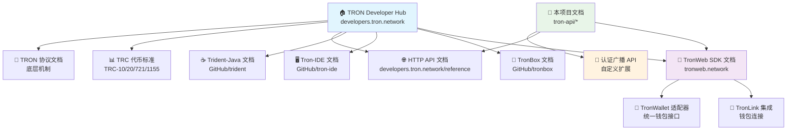
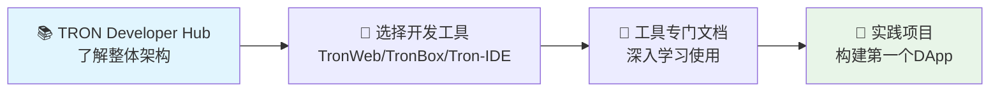
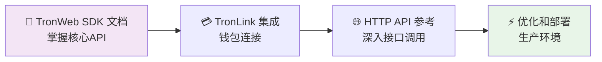
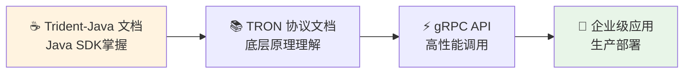
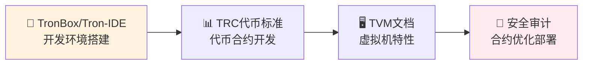
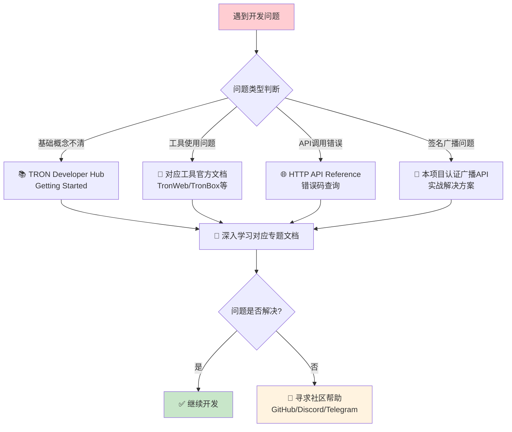

# 🚀 TRON 开发文档完整指南

> TRON 生态系统开发文档全景分析与使用指南

## 📋 目录

- [文档生态系统概览](#文档生态系统概览)
- [核心文档关系图](#核心文档关系图)  
- [官方文档详解](#官方文档详解)
- [开发工具文档](#开发工具文档)
- [API和网络文档](#api和网络文档)
- [钱包集成文档](#钱包集成文档)
- [学习路径推荐](#学习路径推荐)
- [快速查找指南](#快速查找指南)

## 🌐 文档生态系统概览

### 核心文档层级结构

```
TRON 开发文档生态系统
├── 📚 综合指南层
│   ├── TRON Developer Hub (官方总入口)
│   └── 项目定制文档 (本项目 tron-api 文档)
├── 🔧 工具专用层
│   ├── TronWeb SDK 文档
│   ├── TronBox CLI 文档  
│   ├── Tron-IDE 界面文档
│   └── Trident-Java SDK 文档
├── 🌐 网络接口层
│   ├── HTTP API 参考
│   ├── gRPC API 文档
│   └── TronGrid 服务文档
└── 🔗 集成服务层
    ├── 钱包集成文档
    ├── 代币标准文档
    └── 协议底层文档
```

## 📊 核心文档关系图



## 📚 官方文档详解

### 1. 🏠 TRON Developer Hub
**地址**: [https://developers.tron.network/](https://developers.tron.network/)

**定位**: TRON 生态系统的**官方总入口**和**综合开发指南**

**核心内容**:
- ✅ **Getting Started** - 新手入门指南
- ✅ **TRON Protocol** - 协议底层原理 (账户、资源模型、共识等)
- ✅ **Token Standards** - TRC代币标准 (TRC-10, TRC-20, TRC-721, TRC-1155)
- ✅ **Smart Contracts** - 智能合约开发完整流程
- ✅ **HTTP API** - **包含 API Signature and Broadcast Flow**
- ✅ **DApp Development Guide** - DApp开发工具箱
- ✅ **Build Node** - 节点部署和运维

**适用人群**: 
- 🆕 TRON 新手开发者
- 🏗️ 架构师和技术决策者
- 📖 需要全面了解 TRON 生态的开发者

### 2. 📖 TronWeb SDK 文档  
**地址**: [https://tronweb.network/docu/docs/intro](https://tronweb.network/docu/docs/intro)

**定位**: TronWeb JavaScript SDK 的**专门详细文档**

**核心内容**:
- ✅ **Installation & Setup** - 安装配置 (Node.js & Browser)
- ✅ **Instantiation** - 初始化和私钥设置
- ✅ **Core Concepts** - 核心概念和使用模式
- ✅ **Contract Interaction** - 智能合约交互
- ✅ **Sign and Verify Message** - **消息签名和验证**
- ✅ **API List** - 完整API接口列表
- ✅ **Migration Guide** - 版本升级指南

**版本信息**: 当前 v6.0.4 (支持 CommonJS 和 ES Modules)

**适用人群**:
- 💻 JavaScript/TypeScript 开发者
- 🌐 前端 DApp 开发者  
- 📱 Node.js 后端开发者

## 🔧 开发工具文档

### 3. 🔨 TronBox CLI 工具
**地址**: [https://github.com/tronprotocol/tronbox](https://github.com/tronprotocol/tronbox)

**定位**: 智能合约编译部署的 **命令行工具**

**功能特性**:
- ✅ 智能合约编译 (Solidity)
- ✅ 合约部署到各网络 (主网/测试网)
- ✅ 合约测试框架
- ✅ 网络配置管理

**类比**: 类似以太坊的 **Truffle** 框架

### 4. 🖥️ Tron-IDE 可视化工具
**地址**: [https://github.com/tronprotocol/tron-ide](https://github.com/tronprotocol/tron-ide)

**定位**: 基于 Web 的 **图形化智能合约开发环境**

**功能特性**:
- ✅ 在线代码编辑器
- ✅ 实时编译和部署
- ✅ 合约调试工具
- ✅ 可视化交互界面

**类比**: 类似以太坊的 **Remix IDE**

### 5. ☕ Trident-Java SDK
**地址**: [https://github.com/tronprotocol/trident](https://github.com/tronprotocol/trident)

**定位**: Java 开发者专用的 **轻量级 TRON SDK**

**功能特性**:
- ✅ Java 原生支持
- ✅ 系统合约和智能合约交互
- ✅ 完整的交易构建和签名
- ✅ 企业级应用开发支持

## 🌐 API和网络文档

### 6. 🔗 TRON HTTP API 参考
**地址**: [https://developers.tron.network/reference](https://developers.tron.network/reference)

**定位**: **完整的 REST API 接口文档**

**核心接口分类**:
- ✅ **Account API** - 账户查询和管理
- ✅ **Transaction API** - 交易创建、签名、广播
- ✅ **Smart Contract API** - 合约部署和调用
- ✅ **Resource API** - 能量和带宽管理  
- ✅ **Query API** - 区块链数据查询

### 7. 📡 TronGrid API 服务
**地址**: [https://developers.tron.network/docs/tron-grid-intro](https://developers.tron.network/docs/tron-grid-intro)

**定位**: TRON 官方提供的 **托管 API 服务**

**服务特性**:
- ✅ 免费配额: 100 次/秒，100,000 次/天
- ✅ 付费计划: 更高配额和专业支持
- ✅ 全球CDN加速
- ✅ 高可用性保障

### 8. ⚡ gRPC API 文档
**地址**: [https://developers.tron.network/docs/grpc-api](https://developers.tron.network/docs/grpc-api)

**定位**: **高性能 gRPC 接口**，适合高频调用场景

**使用场景**:
- 🏃‍♂️ 需要低延迟的实时应用
- 📊 高频交易或数据分析
- 🔄 需要流式数据的应用

## 🔗 钱包集成文档

### 9. 💳 TronLink 钱包集成
**地址**: [https://developers.tron.network/docs/dapp-integration-with-tronlink](https://developers.tron.network/docs/dapp-integration-with-tronlink)

**定位**: **最流行的 TRON 钱包**集成指南

**支持平台**:
- 🌐 Chrome/Firefox 浏览器扩展
- 📱 Android/iOS 移动应用
- 🔗 DApp 浏览器内置

### 10. 🔌 TronWallet 适配器
**地址**: [https://github.com/tronweb3/tronwallet-adapter](https://github.com/tronweb3/tronwallet-adapter)

**定位**: **统一钱包适配器库**，支持多种 TRON 钱包

**支持钱包**:
- ✅ TronLink (扩展和移动端)
- ✅ Ledger 硬件钱包
- ✅ WalletConnect 协议
- ✅ 其他主流 TRON 钱包

### 11. 🌉 WalletConnect-TRON
**地址**: [https://github.com/klaytn/wallet-connect-tron](https://github.com/klaytn/wallet-connect-tron)

**定位**: 通过 **WalletConnect 协议**连接 TRON 钱包

**优势**:
- 🔄 跨平台钱包连接
- 📱 移动端无缝连接
- 🔒 安全的端到端加密

## 📖 学习路径推荐

### 🆕 初学者路径



**详细步骤**:
1. **第1周**: 阅读 [TRON Developer Hub](https://developers.tron.network/) 的 Getting Started 部分
2. **第2周**: 根据技术栈选择工具并学习对应文档
3. **第3-4周**: 跟随官方教程完成第一个 DApp 项目

### 💻 JavaScript开发者路径



**技术重点**:
- ✅ TronWeb 初始化和配置
- ✅ 交易签名和广播流程
- ✅ 智能合约交互
- ✅ 错误处理和安全实践

### ☕ Java开发者路径



### 🔨 智能合约开发者路径



## 🔍 快速查找指南

### 按开发需求查找

| 开发需求 | 推荐文档 | 重点章节 |
|----------|----------|----------|
| **🔰 TRON入门** | [TRON Developer Hub](https://developers.tron.network/) | Getting Started |
| **💻 JavaScript开发** | [TronWeb文档](https://tronweb.network/docu/docs/intro) | Installation & Core Concepts |
| **☕ Java开发** | [Trident-Java](https://github.com/tronprotocol/trident) | Quick Start Guide |
| **🔨 智能合约开发** | [TronBox](https://github.com/tronprotocol/tronbox) | Contract Compilation |
| **🌐 API接口调用** | [HTTP API参考](https://developers.tron.network/reference) | API Reference |
| **💳 钱包集成** | [TronLink集成](https://developers.tron.network/docs/dapp-integration-with-tronlink) | Integration Guide |
| **⚡ 高性能调用** | [gRPC API](https://developers.tron.network/docs/grpc-api) | gRPC Implementation |
| **📊 代币开发** | [TRC标准文档](https://developers.tron.network/docs/trc10) | Token Standards |
| **🔒 安全实践** | [TRON安全指南](https://developers.tron.network/docs/security) | Security Best Practices |

### 按技术栈查找

| 技术栈 | 主要文档 | 补充资源 |
|--------|----------|----------|
| **Frontend (React/Vue)** | TronWeb + TronLink | TronWallet适配器 |
| **Backend (Node.js)** | TronWeb + HTTP API | TronGrid服务 |
| **Backend (Java)** | Trident-Java + gRPC | TRON协议文档 |
| **Smart Contracts** | TronBox/Tron-IDE | TVM文档 |
| **Mobile DApps** | TronWeb + WalletConnect | 移动钱包集成 |
| **Enterprise** | Trident-Java + 私有节点 | 节点部署指南 |

### 按问题类型查找

| 问题类型 | 查找路径 | 解决文档 |
|----------|----------|----------|
| **🔧 安装配置问题** | 工具官方文档 → Installation | TronWeb/TronBox文档 |
| **🔑 签名广播问题** | TronWeb文档 → Sign and Verify | 本项目认证广播API |
| **💰 交易失败问题** | HTTP API文档 → Error Codes | TRON Developer Hub |
| **⛽ 资源不足问题** | TRON协议文档 → Resource Model | 资源管理指南 |
| **🔒 安全漏洞问题** | 安全最佳实践文档 | 官方安全指南 |
| **🚀 性能优化问题** | gRPC API文档 | 高性能实践指南 |

## 📝 本项目文档补充

### 🎯 项目特色文档

我们的 `docs/tron-api/` 目录提供了以下**增值文档**:

| 文档名称 | 官方覆盖度 | 项目增值 |
|----------|------------|----------|
| **认证广播API** | 🔶 部分覆盖 | ✅ **完整中文详解 + 项目实战代码** |
| **账户资源API** | ✅ 完整覆盖 | ✅ **业务场景优化 + 错误处理** |
| **交易管理API** | ✅ 完整覆盖 | ✅ **能量租赁特定流程** |
| **安全最佳实践** | 🔶 部分覆盖 | ✅ **企业级安全配置指南** |

### 💡 使用建议

1. **📚 先读官方文档**: 获得全面的理论基础
2. **🔍 再看项目文档**: 获得实战经验和最佳实践  
3. **⚗️ 结合实际应用**: 在具体项目中验证和优化

## 🆘 遇到问题时的查找顺序



## 🔗 重要链接汇总

### 官方资源
- 🏠 **TRON Developer Hub**: [https://developers.tron.network/](https://developers.tron.network/)
- 📖 **TronWeb SDK**: [https://tronweb.network/docu/docs/intro](https://tronweb.network/docu/docs/intro)
- 🌐 **HTTP API**: [https://developers.tron.network/reference](https://developers.tron.network/reference)
- 📡 **TronGrid**: [https://developers.tron.network/docs/tron-grid-intro](https://developers.tron.network/docs/tron-grid-intro)

### 开发工具
- 🔨 **TronBox**: [https://github.com/tronprotocol/tronbox](https://github.com/tronprotocol/tronbox)
- 🖥️ **Tron-IDE**: [https://github.com/tronprotocol/tron-ide](https://github.com/tronprotocol/tron-ide)
- ☕ **Trident-Java**: [https://github.com/tronprotocol/trident](https://github.com/tronprotocol/trident)

### 钱包和集成
- 💳 **TronLink**: [https://developers.tron.network/docs/dapp-integration-with-tronlink](https://developers.tron.network/docs/dapp-integration-with-tronlink)
- 🔌 **TronWallet适配器**: [https://github.com/tronweb3/tronwallet-adapter](https://github.com/tronweb3/tronwallet-adapter)
- 🌉 **WalletConnect**: [https://github.com/klaytn/wallet-connect-tron](https://github.com/klaytn/wallet-connect-tron)

### 社区支持
- 💬 **Discord**: TRON官方Discord社区
- 📱 **Telegram**: TRON开发者电报群
- 🐛 **GitHub Issues**: 各项目的GitHub问题追踪

---

> 📝 **文档更新日期**: 2025年1月
> 
> 🔄 **更新频率**: 本文档会根据TRON生态系统的发展定期更新
> 
> 💡 **建议反馈**: 如发现文档有误或需要补充，请及时反馈

---

**Happy Coding! 🚀**

