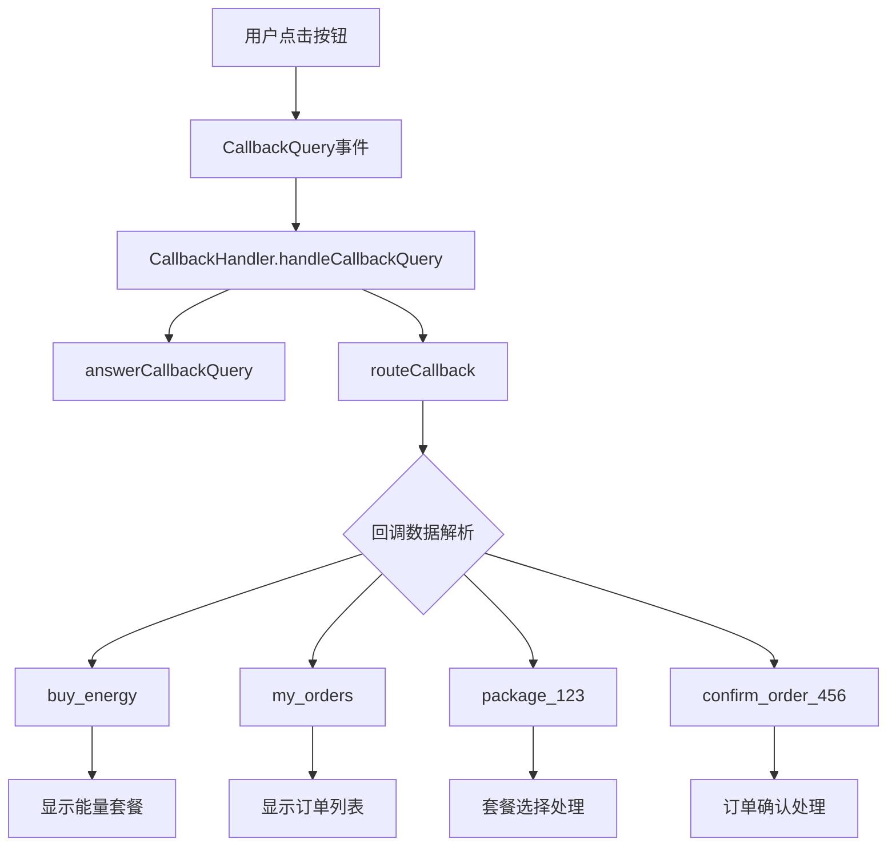

# 🔄 回调查询 API 详细文档

> Telegram Bot 回调查询（Callback Query）处理的完整指南和项目实际使用示例

## 📋 目录

- [回调查询概述](#回调查询概述)
- [核心 API 方法](#核心-api-方法)
- [回调数据设计](#回调数据设计)
- [项目中的回调处理](#项目中的回调处理)
- [状态管理](#状态管理)
- [错误处理](#错误处理)
- [性能优化](#性能优化)
- [最佳实践](#最佳实践)

## 🎯 回调查询概述

### 什么是回调查询？

回调查询（Callback Query）是用户点击内联键盘按钮时触发的事件。它允许机器人在不发送新消息的情况下响应用户的交互。

### 回调查询的特点

- **即时响应**: 用户点击按钮后立即触发
- **数据传递**: 可以携带自定义数据
- **状态更新**: 可以更新现有消息内容
- **用户反馈**: 可以显示临时提示或加载状态

### 项目中的回调查询架构



## 🔧 核心 API 方法

### answerCallbackQuery

回答回调查询，这是处理回调查询的必需步骤。

#### 接口定义

```typescript
async answerCallbackQuery(
  callbackQueryId: string, 
  options?: TelegramBot.AnswerCallbackQueryOptions
): Promise<boolean>
```

#### 参数说明

| 参数 | 类型 | 必需 | 说明 |
|------|------|------|------|
| `callbackQueryId` | `string` | ✅ | 回调查询的唯一标识符 |
| `options` | `AnswerCallbackQueryOptions` | ❌ | 回答选项配置 |

#### AnswerCallbackQueryOptions

```typescript
interface AnswerCallbackQueryOptions {
  text?: string;           // 显示给用户的文本（最多200字符）
  show_alert?: boolean;    // 是否显示警告框而非顶部通知
  url?: string;           // 要打开的URL
  cache_time?: number;    // 客户端缓存时间（秒）
}
```

#### 项目中的基础使用

```typescript
// 简单确认回答
await this.bot.answerCallbackQuery(callbackQuery.id);

// 带提示文本的回答
await this.bot.answerCallbackQuery(callbackQuery.id, {
  text: '✅ 操作成功！'
});

// 显示警告框
await this.bot.answerCallbackQuery(callbackQuery.id, {
  text: '⚠️ 请先设置TRON地址',
  show_alert: true
});

// 打开外部链接
await this.bot.answerCallbackQuery(callbackQuery.id, {
  url: 'https://tronscan.org/#/transaction/' + txHash
});
```

## 📊 回调数据设计

### 项目中的回调数据类型

```typescript
// 回调查询数据类型定义
export type CallbackData = 
  | 'buy_energy'                    // 购买能量主菜单
  | 'my_orders'                     // 我的订单
  | 'check_balance'                 // 查询余额
  | 'help_support'                  // 帮助支持
  | 'refresh_menu'                  // 刷新主菜单
  | `package_${string}`             // 选择套餐: package_1, package_2
  | `confirm_package_${string}`     // 确认套餐: confirm_package_1
  | `cancel_package_${string}`      // 取消套餐: cancel_package_1
  | `confirm_order_${string}`       // 确认订单: confirm_order_123
  | `cancel_order_${string}`        // 取消订单: cancel_order_123
  | `delegation_status_${string}`   // 委托状态: delegation_status_456
  | `refresh_balance`               // 刷新余额
  | `recharge`                      // 充值
  | `order_detail_${string}`;       // 订单详情: order_detail_123
```

### 回调数据解析工具

```typescript
class CallbackDataParser {
  // 解析回调数据
  static parse(data: string): {
    action: string;
    id?: string;
    params?: Record<string, string>;
  } {
    const parts = data.split('_');
    const action = parts[0];
    
    switch (action) {
      case 'package':
      case 'confirm':
      case 'cancel':
        return {
          action: parts.slice(0, -1).join('_'),
          id: parts[parts.length - 1]
        };
      
      case 'order':
        return {
          action: `${parts[0]}_${parts[1]}`,
          id: parts[2]
        };
      
      case 'delegation':
        return {
          action: `${parts[0]}_${parts[1]}`,
          id: parts[2]
        };
      
      default:
        return { action: data };
    }
  }

  // 构建回调数据
  static build(action: string, id?: string, params?: Record<string, string>): string {
    let data = action;
    if (id) data += `_${id}`;
    if (params) {
      const paramString = Object.entries(params)
        .map(([key, value]) => `${key}:${value}`)
        .join(',');
      data += `_${paramString}`;
    }
    return data;
  }

  // 验证回调数据格式
  static isValid(data: string): boolean {
    // Telegram 回调数据限制为 1-64 字符
    if (!data || data.length === 0 || data.length > 64) {
      return false;
    }
    
    // 只允许字母、数字、下划线和冒号
    return /^[a-zA-Z0-9_:,-]+$/.test(data);
  }
}
```

## 🏗️ 项目中的回调处理

### CallbackHandler 核心实现

```typescript
export class CallbackHandler {
  private bot: TelegramBot;
  private userService: UserService;
  private orderService: typeof orderService;

  constructor(bot: TelegramBot) {
    this.bot = bot;
    this.userService = new UserService();
    this.orderService = orderService;
  }

  /**
   * 处理主要的回调查询路由
   */
  async handleCallbackQuery(callbackQuery: TelegramBot.CallbackQuery): Promise<void> {
    const chatId = callbackQuery.message?.chat.id;
    const data = callbackQuery.data;
    
    if (!chatId || !data) return;

    try {
      // 回答回调查询（必须在30秒内调用）
      await this.bot.answerCallbackQuery(callbackQuery.id);

      // 路由到具体处理方法
      await this.routeCallback(chatId, data, callbackQuery);
    } catch (error) {
      console.error('Error handling callback query:', error);
      
      // 发送错误回答
      await this.bot.answerCallbackQuery(callbackQuery.id, {
        text: '❌ 处理请求时发生错误，请重试',
        show_alert: true
      });
      
      // 发送错误消息
      await this.bot.sendMessage(chatId, '❌ 处理请求时发生错误，请重试。');
    }
  }

  /**
   * 回调路由分发
   */
  private async routeCallback(
    chatId: number, 
    data: string, 
    callbackQuery: TelegramBot.CallbackQuery
  ): Promise<void> {
    const parsed = CallbackDataParser.parse(data);
    const userId = callbackQuery.from?.id;

    switch (parsed.action) {
      // 主菜单操作
      case 'buy_energy':
        await this.handleBuyEnergy(chatId, userId);
        break;
      case 'my_orders':
        await this.handleMyOrders(chatId, userId);
        break;
      case 'check_balance':
        await this.handleCheckBalance(chatId, userId);
        break;
      case 'help_support':
        await this.handleHelpSupport(chatId);
        break;
      case 'refresh_menu':
        await this.handleRefreshMenu(chatId);
        break;

      // 套餐相关操作
      case 'package':
        await this.handlePackageSelection(chatId, parsed.id!, userId);
        break;
      case 'confirm_package':
        await this.handlePackageConfirmation(chatId, parsed.id!, userId);
        break;
      case 'cancel_package':
        await this.handlePackageCancellation(chatId, parsed.id!);
        break;

      // 订单相关操作
      case 'confirm_order':
        await this.handleOrderConfirmation(chatId, parsed.id!);
        break;
      case 'cancel_order':
        await this.handleOrderCancellation(chatId, parsed.id!);
        break;
      case 'order_detail':
        await this.handleOrderDetail(chatId, parsed.id!, userId);
        break;

      // 委托相关操作
      case 'delegation_status':
        await this.handleDelegationStatus(chatId, parsed.id!);
        break;

      // 其他操作
      case 'refresh_balance':
        await this.handleRefreshBalance(chatId, userId);
        break;
      case 'recharge':
        await this.handleRecharge(chatId, userId);
        break;

      default:
        console.warn(`Unknown callback data: ${data}`);
        await this.bot.sendMessage(chatId, '❌ 未知的操作，请重试。');
        break;
    }
  }
}
```

### 具体回调处理方法

```typescript
// 购买能量处理
private async handleBuyEnergy(chatId: number, userId?: number): Promise<void> {
  if (!userId) {
    await this.bot.sendMessage(chatId, '❌ 无法获取用户信息');
    return;
  }

  try {
    // 检查用户是否设置了TRON地址
    const user = await UserService.getUserByTelegramId(userId);
    if (!user?.tron_address) {
      await this.bot.sendMessage(chatId, 
        '❌ 请先设置您的TRON地址\n\n' +
        '使用命令: /setaddress <您的TRON地址>',
        {
          reply_markup: {
            inline_keyboard: [
              [{ text: '🔙 返回主菜单', callback_data: 'refresh_menu' }]
            ]
          }
        }
      );
      return;
    }

    // 显示能量套餐（这里需要调用键盘构建器）
    // 在主服务中会被重写
    await this.bot.sendMessage(chatId, '⚡ 正在加载能量套餐...');
  } catch (error) {
    console.error('Failed to handle buy energy:', error);
    await this.bot.sendMessage(chatId, '❌ 加载套餐失败，请重试。');
  }
}

// 订单详情处理
private async handleOrderDetail(chatId: number, orderId: string, userId?: number): Promise<void> {
  if (!userId) {
    await this.bot.sendMessage(chatId, '❌ 无法获取用户信息');
    return;
  }

  try {
    const order = await this.orderService.getOrderById(parseInt(orderId));
    if (!order) {
      await this.bot.sendMessage(chatId, '❌ 订单不存在');
      return;
    }

    // 验证订单所有权
    const user = await UserService.getUserByTelegramId(userId);
    if (!user || order.user_id !== parseInt(user.id)) {
      await this.bot.sendMessage(chatId, '❌ 您无权查看此订单');
      return;
    }

    const orderDetails = `📋 <b>订单详情</b>

<b>订单号:</b> <code>#${order.id}</code>
<b>能量数量:</b> <code>${order.energy_amount.toLocaleString()}</code> Energy
<b>支付金额:</b> <code>${order.price_trx}</code> TRX
<b>接收地址:</b> <code>${order.recipient_address}</code>
<b>订单状态:</b> ${this.getOrderStatusEmoji(order.status)} ${order.status}
<b>创建时间:</b> ${new Date(order.created_at).toLocaleString('zh-CN')}
${order.completed_at ? `<b>完成时间:</b> ${new Date(order.completed_at).toLocaleString('zh-CN')}` : ''}
${order.tx_hash ? `<b>交易哈希:</b> <code>${order.tx_hash}</code>` : ''}

<b>套餐信息:</b>
• 套餐名称: ${order.package_name || '标准套餐'}
• 委托时长: ${order.duration_hours}小时
• 到期时间: ${order.expires_at ? new Date(order.expires_at).toLocaleString('zh-CN') : '计算中...'}`;

    const keyboard = {
      inline_keyboard: [
        ...(order.status === 'pending' ? [
          [
            { text: '✅ 确认支付', callback_data: `confirm_order_${order.id}` },
            { text: '❌ 取消订单', callback_data: `cancel_order_${order.id}` }
          ]
        ] : []),
        ...(order.delegation_id ? [
          [{ text: '📊 查看委托状态', callback_data: `delegation_status_${order.delegation_id}` }]
        ] : []),
        [
          { text: '🔄 刷新信息', callback_data: `order_detail_${order.id}` },
          { text: '🔙 返回订单列表', callback_data: 'my_orders' }
        ]
      ]
    };

    await this.bot.sendMessage(chatId, orderDetails, {
      parse_mode: 'HTML',
      reply_markup: keyboard,
      disable_web_page_preview: true
    });
  } catch (error) {
    console.error('Failed to show order detail:', error);
    await this.bot.sendMessage(chatId, '❌ 获取订单详情失败，请重试。');
  }
}

// 余额刷新处理
private async handleRefreshBalance(chatId: number, userId?: number): Promise<void> {
  if (!userId) {
    await this.bot.sendMessage(chatId, '❌ 无法获取用户信息');
    return;
  }

  try {
    // 显示加载状态
    const loadingMessage = await this.bot.sendMessage(chatId, '🔄 正在刷新余额信息...');

    // 获取最新余额信息
    const user = await UserService.getUserByTelegramId(userId);
    if (!user) {
      await this.bot.editMessageText('❌ 用户信息不存在', {
        chat_id: chatId,
        message_id: loadingMessage.message_id
      });
      return;
    }

    // 可能需要从区块链查询实时余额
    const realTimeBalance = await this.getRealTimeBalance(user.tron_address);
    
    const balanceMessage = `💰 <b>账户余额信息</b>

💵 <b>USDT余额:</b> <code>${user.usdt_balance || 0}</code> USDT
🔴 <b>TRX余额:</b> <code>${realTimeBalance.trx || user.trx_balance || 0}</code> TRX
⚡ <b>可用能量:</b> <code>${realTimeBalance.energy || 0}</code> Energy
🔥 <b>带宽:</b> <code>${realTimeBalance.bandwidth || 0}</code> Bandwidth

📊 <b>统计信息:</b>
• 总订单数: ${user.total_orders || 0}
• 总消费: ${user.total_spent || 0} USDT
• 总能量使用: ${user.total_energy_used || 0} Energy

🕐 <b>更新时间:</b> ${new Date().toLocaleString('zh-CN')}`;

    const keyboard = {
      inline_keyboard: [
        [
          { text: '🔄 再次刷新', callback_data: 'refresh_balance' },
          { text: '💰 充值', callback_data: 'recharge' }
        ],
        [
          { text: '🔙 返回主菜单', callback_data: 'refresh_menu' }
        ]
      ]
    };

    await this.bot.editMessageText(balanceMessage, {
      chat_id: chatId,
      message_id: loadingMessage.message_id,
      parse_mode: 'HTML',
      reply_markup: keyboard
    });
  } catch (error) {
    console.error('Failed to refresh balance:', error);
    await this.bot.sendMessage(chatId, '❌ 刷新余额失败，请重试。');
  }
}

// 获取实时余额（示例方法）
private async getRealTimeBalance(address?: string): Promise<{
  trx: number;
  energy: number;
  bandwidth: number;
}> {
  if (!address) {
    return { trx: 0, energy: 0, bandwidth: 0 };
  }

  try {
    // 这里应该调用 TRON 网络 API 获取实时余额
    // const tronWeb = new TronWeb(...);
    // const account = await tronWeb.trx.getAccount(address);
    // return {
    //   trx: account.balance / 1000000,
    //   energy: account.account_resource?.energy_limit || 0,
    //   bandwidth: account.bandwidth || 0
    // };
    
    // 模拟数据
    return { trx: 100, energy: 32000, bandwidth: 1500 };
  } catch (error) {
    console.error('Failed to get real-time balance:', error);
    return { trx: 0, energy: 0, bandwidth: 0 };
  }
}
```

## 🔄 状态管理

### 用户会话状态

```typescript
interface UserState {
  chatId: number;
  userId: number;
  currentAction?: string;
  step?: number;
  data?: Record<string, any>;
  lastActivity: Date;
}

class UserStateManager {
  private static states = new Map<number, UserState>();
  private static readonly STATE_TTL = 30 * 60 * 1000; // 30分钟

  // 设置用户状态
  static setState(userId: number, state: Partial<UserState>): void {
    const existing = this.states.get(userId) || {
      chatId: 0,
      userId,
      lastActivity: new Date()
    };

    this.states.set(userId, {
      ...existing,
      ...state,
      lastActivity: new Date()
    });
  }

  // 获取用户状态
  static getState(userId: number): UserState | undefined {
    const state = this.states.get(userId);
    if (!state) return undefined;

    // 检查是否过期
    if (Date.now() - state.lastActivity.getTime() > this.STATE_TTL) {
      this.states.delete(userId);
      return undefined;
    }

    return state;
  }

  // 清除用户状态
  static clearState(userId: number): void {
    this.states.delete(userId);
  }

  // 更新状态数据
  static updateStateData(userId: number, data: Record<string, any>): void {
    const state = this.getState(userId);
    if (state) {
      state.data = { ...state.data, ...data };
      state.lastActivity = new Date();
      this.states.set(userId, state);
    }
  }

  // 清理过期状态
  static cleanupExpiredStates(): void {
    const now = Date.now();
    for (const [userId, state] of this.states.entries()) {
      if (now - state.lastActivity.getTime() > this.STATE_TTL) {
        this.states.delete(userId);
      }
    }
  }
}

// 定期清理过期状态
setInterval(() => {
  UserStateManager.cleanupExpiredStates();
}, 5 * 60 * 1000); // 每5分钟清理一次
```

### 多步骤操作处理

```typescript
// 多步骤充值流程示例
private async handleRecharge(chatId: number, userId?: number): Promise<void> {
  if (!userId) return;

  // 设置用户状态为充值流程
  UserStateManager.setState(userId, {
    chatId,
    currentAction: 'recharge',
    step: 1
  });

  const rechargeMessage = `💰 <b>充值流程</b>

请选择充值金额：`;

  const keyboard = {
    inline_keyboard: [
      [
        { text: '💵 100 USDT', callback_data: 'recharge_amount_100' },
        { text: '💵 500 USDT', callback_data: 'recharge_amount_500' }
      ],
      [
        { text: '💵 1000 USDT', callback_data: 'recharge_amount_1000' },
        { text: '💵 自定义金额', callback_data: 'recharge_custom' }
      ],
      [
        { text: '❌ 取消', callback_data: 'refresh_menu' }
      ]
    ]
  };

  await this.bot.sendMessage(chatId, rechargeMessage, {
    parse_mode: 'HTML',
    reply_markup: keyboard
  });
}

// 处理充值金额选择
private async handleRechargeAmount(chatId: number, amount: string, userId: number): Promise<void> {
  const state = UserStateManager.getState(userId);
  if (!state || state.currentAction !== 'recharge') {
    await this.bot.sendMessage(chatId, '❌ 会话已过期，请重新开始');
    return;
  }

  const rechargeAmount = parseFloat(amount);
  if (isNaN(rechargeAmount) || rechargeAmount <= 0) {
    await this.bot.sendMessage(chatId, '❌ 无效的金额');
    return;
  }

  // 更新状态
  UserStateManager.updateStateData(userId, { 
    amount: rechargeAmount,
    step: 2 
  });

  // 生成支付信息
  const paymentAddress = process.env.USDT_PAYMENT_ADDRESS;
  const paymentMessage = `💳 <b>支付信息</b>

💰 <b>充值金额:</b> <code>${rechargeAmount}</code> USDT
📍 <b>支付地址:</b> <code>${paymentAddress}</code>

⚠️ <b>注意事项:</b>
• 请转账准确的USDT金额
• 支付网络: TRON (TRC20)
• 到账时间: 1-3个区块确认

💡 支付完成后点击"确认支付"按钮`;

  const keyboard = {
    inline_keyboard: [
      [
        { text: '✅ 我已支付', callback_data: `confirm_recharge_${rechargeAmount}` },
        { text: '📋 复制地址', callback_data: `copy_address_${paymentAddress}` }
      ],
      [
        { text: '❌ 取消充值', callback_data: 'refresh_menu' }
      ]
    ]
  };

  await this.bot.sendMessage(chatId, paymentMessage, {
    parse_mode: 'HTML',
    reply_markup: keyboard
  });
}
```

## ⚠️ 错误处理

### 回调查询错误处理

```typescript
class CallbackErrorHandler {
  static async handleError(
    bot: TelegramBot,
    callbackQuery: TelegramBot.CallbackQuery,
    error: any
  ): Promise<void> {
    const chatId = callbackQuery.message?.chat.id;
    
    try {
      // 回答回调查询以防止加载状态
      await bot.answerCallbackQuery(callbackQuery.id, {
        text: '❌ 处理失败，请重试',
        show_alert: false
      });

      // 根据错误类型处理
      let userMessage = '';
      
      if (error.code === 'USER_NOT_FOUND') {
        userMessage = '❌ 用户信息不存在，请使用 /start 重新注册';
      } else if (error.code === 'INVALID_ORDER') {
        userMessage = '❌ 订单不存在或已过期';
      } else if (error.code === 'INSUFFICIENT_BALANCE') {
        userMessage = '❌ 余额不足，请先充值';
      } else if (error.code === 'PERMISSION_DENIED') {
        userMessage = '❌ 您没有权限执行此操作';
      } else {
        userMessage = '❌ 处理请求时发生错误，请稍后重试';
      }

      if (chatId) {
        await bot.sendMessage(chatId, userMessage, {
          reply_markup: {
            inline_keyboard: [
              [{ text: '🔙 返回主菜单', callback_data: 'refresh_menu' }]
            ]
          }
        });
      }

      // 记录错误日志
      console.error('Callback error:', {
        userId: callbackQuery.from.id,
        data: callbackQuery.data,
        error: error.message,
        timestamp: new Date().toISOString()
      });
    } catch (handlerError) {
      console.error('Error in callback error handler:', handlerError);
    }
  }

  // 验证回调查询的有效性
  static validateCallback(callbackQuery: TelegramBot.CallbackQuery): {
    valid: boolean;
    error?: string;
  } {
    if (!callbackQuery.data) {
      return { valid: false, error: 'No callback data' };
    }

    if (!callbackQuery.message?.chat.id) {
      return { valid: false, error: 'No chat ID' };
    }

    if (!callbackQuery.from?.id) {
      return { valid: false, error: 'No user ID' };
    }

    if (!CallbackDataParser.isValid(callbackQuery.data)) {
      return { valid: false, error: 'Invalid callback data format' };
    }

    return { valid: true };
  }
}
```

### 超时处理

```typescript
class CallbackTimeoutManager {
  private static timeouts = new Map<string, NodeJS.Timeout>();

  // 设置回调查询超时
  static setCallbackTimeout(
    callbackQueryId: string,
    timeoutMs: number,
    onTimeout: () => void
  ): void {
    // 清除现有超时
    this.clearCallbackTimeout(callbackQueryId);

    // 设置新超时
    const timeout = setTimeout(() => {
      onTimeout();
      this.timeouts.delete(callbackQueryId);
    }, timeoutMs);

    this.timeouts.set(callbackQueryId, timeout);
  }

  // 清除回调查询超时
  static clearCallbackTimeout(callbackQueryId: string): void {
    const timeout = this.timeouts.get(callbackQueryId);
    if (timeout) {
      clearTimeout(timeout);
      this.timeouts.delete(callbackQueryId);
    }
  }

  // 清除所有超时
  static clearAllTimeouts(): void {
    for (const timeout of this.timeouts.values()) {
      clearTimeout(timeout);
    }
    this.timeouts.clear();
  }
}

// 在回调处理中使用超时管理
async handleCallbackQuery(callbackQuery: TelegramBot.CallbackQuery): Promise<void> {
  const chatId = callbackQuery.message?.chat.id;
  const data = callbackQuery.data;
  
  if (!chatId || !data) return;

  // 设置30秒超时
  CallbackTimeoutManager.setCallbackTimeout(
    callbackQuery.id,
    30000,
    async () => {
      try {
        await this.bot.answerCallbackQuery(callbackQuery.id, {
          text: '⏰ 操作超时，请重试',
          show_alert: true
        });
      } catch (error) {
        console.error('Timeout callback failed:', error);
      }
    }
  );

  try {
    // 处理回调查询
    await this.processCallbackQuery(callbackQuery);
    
    // 清除超时
    CallbackTimeoutManager.clearCallbackTimeout(callbackQuery.id);
  } catch (error) {
    // 清除超时
    CallbackTimeoutManager.clearCallbackTimeout(callbackQuery.id);
    
    // 处理错误
    await CallbackErrorHandler.handleError(this.bot, callbackQuery, error);
  }
}
```

## 🚀 性能优化

### 回调查询缓存

```typescript
class CallbackCache {
  private static cache = new Map<string, {
    data: any;
    timestamp: number;
    ttl: number;
  }>();

  // 设置缓存
  static set(key: string, data: any, ttlMs: number = 5 * 60 * 1000): void {
    this.cache.set(key, {
      data,
      timestamp: Date.now(),
      ttl: ttlMs
    });
  }

  // 获取缓存
  static get(key: string): any | null {
    const item = this.cache.get(key);
    if (!item) return null;

    // 检查是否过期
    if (Date.now() - item.timestamp > item.ttl) {
      this.cache.delete(key);
      return null;
    }

    return item.data;
  }

  // 清除缓存
  static clear(key?: string): void {
    if (key) {
      this.cache.delete(key);
    } else {
      this.cache.clear();
    }
  }

  // 清理过期缓存
  static cleanup(): void {
    const now = Date.now();
    for (const [key, item] of this.cache.entries()) {
      if (now - item.timestamp > item.ttl) {
        this.cache.delete(key);
      }
    }
  }
}

// 定期清理缓存
setInterval(() => {
  CallbackCache.cleanup();
}, 60 * 1000); // 每分钟清理一次

// 在回调处理中使用缓存
private async handlePackageSelection(chatId: number, packageId: string, userId?: number): Promise<void> {
  const cacheKey = `package_${packageId}`;
  let packageInfo = CallbackCache.get(cacheKey);

  if (!packageInfo) {
    packageInfo = await this.getPackageInfo(packageId);
    if (packageInfo) {
      CallbackCache.set(cacheKey, packageInfo, 10 * 60 * 1000); // 缓存10分钟
    }
  }

  if (!packageInfo) {
    await this.bot.sendMessage(chatId, '❌ 套餐不存在或已下架');
    return;
  }

  // 继续处理逻辑...
}
```

## 💡 最佳实践

### 1. 回调数据设计原则

```typescript
// ✅ 好的设计 - 简洁明确
const goodCallbacks = [
  'buy_energy',           // 购买能量
  'package_1',           // 选择套餐1
  'confirm_order_123',   // 确认订单123
  'cancel_123'           // 取消操作123
];

// ❌ 不好的设计 - 过长或复杂
const badCallbacks = [
  'buy_energy_package_with_confirmation_step_1',  // 太长
  'pkg:1|type:basic|price:100',                    // 太复杂
  'confirm订单123'                                  // 包含非ASCII字符
];
```

### 2. 用户体验优化

```typescript
// 提供即时反馈
await this.bot.answerCallbackQuery(callbackQuery.id, {
  text: '✅ 正在处理您的请求...'
});

// 更新按钮状态
const updatedKeyboard = {
  inline_keyboard: [
    [{ text: '⏳ 处理中...', callback_data: 'processing' }],
    [{ text: '❌ 取消', callback_data: 'cancel' }]
  ]
};

await this.bot.editMessageReplyMarkup(updatedKeyboard, {
  chat_id: chatId,
  message_id: messageId
});
```

### 3. 错误恢复机制

```typescript
// 提供恢复选项
const errorKeyboard = {
  inline_keyboard: [
    [
      { text: '🔄 重试', callback_data: callbackQuery.data },
      { text: '🔙 返回上级', callback_data: 'go_back' }
    ],
    [
      { text: '🏠 主菜单', callback_data: 'refresh_menu' }
    ]
  ]
};
```

## 🔗 相关文档

- [Messaging API](./01-messaging-api.md) - 消息发送功能
- [Commands API](./02-commands-api.md) - 命令处理
- [Keyboards API](./04-keyboards-api.md) - 键盘和按钮设计
- [Error Handling](./10-error-handling.md) - 详细错误处理指南

---

> 💡 **最佳实践提示**
> 1. 始终在30秒内回答回调查询
> 2. 提供清晰的用户反馈和状态更新
> 3. 设计简洁明确的回调数据格式
> 4. 实现适当的错误处理和恢复机制
> 5. 使用状态管理处理复杂的多步骤操作
