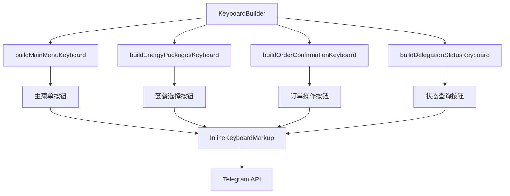

# ⌨️ 键盘和按钮 API 详细文档

> Telegram Bot 键盘系统的完整指南和项目实际使用示例

## 📋 目录

- [键盘系统概述](#键盘系统概述)
- [内联键盘 (InlineKeyboard)](#内联键盘-inlinekeyboard)
- [自定义键盘 (ReplyKeyboard)](#自定义键盘-replykeyboard)
- [项目中的键盘实现](#项目中的键盘实现)
- [按钮设计最佳实践](#按钮设计最佳实践)
- [响应式键盘设计](#响应式键盘设计)
- [键盘状态管理](#键盘状态管理)
- [性能优化](#性能优化)

## 🎯 键盘系统概述

### Telegram 键盘类型

Telegram Bot 支持两种主要的键盘类型：

1. **内联键盘 (Inline Keyboard)** - 显示在消息下方，点击后触发回调查询
2. **自定义键盘 (Reply Keyboard)** - 替换用户的默认键盘
3. **键盘移除 (Remove Keyboard)** - 隐藏自定义键盘
4. **强制回复 (Force Reply)** - 强制用户回复消息

### 项目中的键盘架构



## 🔘 内联键盘 (InlineKeyboard)

### 基础接口定义

```typescript
interface InlineKeyboardMarkup {
  inline_keyboard: InlineKeyboardButton[][];
}

interface InlineKeyboardButton {
  text: string;                    // 按钮显示文本
  callback_data?: string;          // 回调数据（1-64字符）
  url?: string;                    // 外部链接
  web_app?: WebAppInfo;           // Mini App
  login_url?: LoginUrl;           // 登录URL
  switch_inline_query?: string;    // 内联查询切换
  switch_inline_query_current_chat?: string;
  callback_game?: CallbackGame;    // 游戏回调
  pay?: boolean;                   // 支付按钮
}
```

### 项目中的内联键盘实现

```typescript
export class KeyboardBuilder {
  private bot: TelegramBot;

  constructor(bot: TelegramBot) {
    this.bot = bot;
  }

  /**
   * 构建主菜单键盘
   */
  buildMainMenuKeyboard(): InlineKeyboard {
    return {
      inline_keyboard: [
        [
          { text: '🔋 购买能量', callback_data: 'buy_energy' },
          { text: '📋 我的订单', callback_data: 'my_orders' }
        ],
        [
          { text: '💰 账户余额', callback_data: 'check_balance' },
          { text: '❓ 帮助支持', callback_data: 'help_support' }
        ],
        [
          { text: '🔄 刷新菜单', callback_data: 'refresh_menu' }
        ]
      ]
    };
  }

  /**
   * 构建能量套餐选择键盘
   */
  buildEnergyPackagesKeyboard(packages: EnergyPackage[]): InlineKeyboard {
    const keyboard = packages.map(pkg => [{
      text: `${pkg.name} - ${pkg.energy.toLocaleString()} 能量 - ${pkg.price} TRX`,
      callback_data: `package_${pkg.id}`
    }]);

    // 添加返回主菜单按钮
    keyboard.push([
      { text: '🔙 返回主菜单', callback_data: 'refresh_menu' }
    ]);

    return {
      inline_keyboard: keyboard
    };
  }

  /**
   * 构建套餐确认键盘
   */
  buildPackageConfirmationKeyboard(packageId: string): InlineKeyboard {
    return {
      inline_keyboard: [
        [
          { text: '✅ 确认订单', callback_data: `confirm_package_${packageId}` },
          { text: '❌ 取消订单', callback_data: `cancel_package_${packageId}` }
        ],
        [
          { text: '🔙 返回套餐选择', callback_data: 'buy_energy' }
        ]
      ]
    };
  }

  /**
   * 构建支付确认键盘
   */
  buildPaymentKeyboard(orderId: string, paymentAddress: string): InlineKeyboard {
    return {
      inline_keyboard: [
        [
          { text: '✅ 我已支付', callback_data: `confirm_payment_${orderId}` },
          { text: '📋 复制地址', callback_data: `copy_address_${paymentAddress}` }
        ],
        [
          { text: '🔍 查看交易', url: `https://tronscan.org/#/address/${paymentAddress}` },
          { text: '❌ 取消订单', callback_data: `cancel_order_${orderId}` }
        ],
        [
          { text: '🔙 返回主菜单', callback_data: 'refresh_menu' }
        ]
      ]
    };
  }

  /**
   * 构建订单详情键盘
   */
  buildOrderDetailsKeyboard(order: OrderInfo): InlineKeyboard {
    const keyboard: InlineKeyboardButton[][] = [];

    // 根据订单状态显示不同按钮
    switch (order.status) {
      case 'pending':
        keyboard.push([
          { text: '✅ 确认支付', callback_data: `confirm_payment_${order.id}` },
          { text: '❌ 取消订单', callback_data: `cancel_order_${order.id}` }
        ]);
        break;
      
      case 'paid':
      case 'processing':
        keyboard.push([
          { text: '🔄 刷新状态', callback_data: `refresh_order_${order.id}` }
        ]);
        break;
      
      case 'completed':
        if (order.tx_hash) {
          keyboard.push([
            { text: '🔍 查看交易', url: `https://tronscan.org/#/transaction/${order.tx_hash}` }
          ]);
        }
        if (order.delegation_id) {
          keyboard.push([
            { text: '📊 查看委托状态', callback_data: `delegation_status_${order.delegation_id}` }
          ]);
        }
        keyboard.push([
          { text: '🔄 再次购买', callback_data: 'buy_energy' }
        ]);
        break;
    }

    // 通用按钮
    keyboard.push([
      { text: '🔙 返回订单列表', callback_data: 'my_orders' },
      { text: '🏠 主菜单', callback_data: 'refresh_menu' }
    ]);

    return { inline_keyboard: keyboard };
  }

  /**
   * 构建分页键盘
   */
  buildPaginationKeyboard(
    currentPage: number,
    totalPages: number,
    baseCallback: string,
    itemsPerRow: number = 5
  ): InlineKeyboard {
    const keyboard: InlineKeyboardButton[][] = [];

    if (totalPages <= 1) {
      return { inline_keyboard: keyboard };
    }

    const buttons: InlineKeyboardButton[] = [];

    // 上一页按钮
    if (currentPage > 1) {
      buttons.push({
        text: '⬅️ 上一页',
        callback_data: `${baseCallback}_${currentPage - 1}`
      });
    }

    // 页码按钮
    const startPage = Math.max(1, currentPage - Math.floor(itemsPerRow / 2));
    const endPage = Math.min(totalPages, startPage + itemsPerRow - 1);

    for (let page = startPage; page <= endPage; page++) {
      const isCurrentPage = page === currentPage;
      buttons.push({
        text: isCurrentPage ? `[${page}]` : `${page}`,
        callback_data: isCurrentPage ? 'noop' : `${baseCallback}_${page}`
      });
    }

    // 下一页按钮
    if (currentPage < totalPages) {
      buttons.push({
        text: '下一页 ➡️',
        callback_data: `${baseCallback}_${currentPage + 1}`
      });
    }

    keyboard.push(buttons);

    return { inline_keyboard: keyboard };
  }
}
```

### 动态键盘生成

```typescript
class DynamicKeyboardBuilder {
  /**
   * 根据用户权限构建键盘
   */
  static buildUserSpecificKeyboard(user: User): InlineKeyboard {
    const keyboard: InlineKeyboardButton[][] = [];

    // 基础功能按钮
    keyboard.push([
      { text: '🔋 购买能量', callback_data: 'buy_energy' },
      { text: '💰 查询余额', callback_data: 'check_balance' }
    ]);

    // 根据用户等级添加特殊功能
    if (user.level >= 2) {
      keyboard.push([
        { text: '💎 VIP套餐', callback_data: 'vip_packages' },
        { text: '🎁 推荐奖励', callback_data: 'referral_rewards' }
      ]);
    }

    // 管理员功能
    if (user.role === 'admin') {
      keyboard.push([
        { text: '🔧 管理面板', callback_data: 'admin_panel' },
        { text: '📊 系统统计', callback_data: 'system_stats' }
      ]);
    }

    return { inline_keyboard: keyboard };
  }

  /**
   * 根据时间构建限时活动键盘
   */
  static buildTimeBasedKeyboard(): InlineKeyboard {
    const now = new Date();
    const hour = now.getHours();
    const keyboard: InlineKeyboardButton[][] = [];

    // 基础按钮
    keyboard.push([
      { text: '🔋 购买能量', callback_data: 'buy_energy' },
      { text: '📋 我的订单', callback_data: 'my_orders' }
    ]);

    // 限时活动（晚上8-10点）
    if (hour >= 20 && hour < 22) {
      keyboard.push([
        { text: '🎉 限时优惠 8折', callback_data: 'evening_discount' }
      ]);
    }

    // 周末特惠
    const dayOfWeek = now.getDay();
    if (dayOfWeek === 0 || dayOfWeek === 6) {
      keyboard.push([
        { text: '🌟 周末特惠', callback_data: 'weekend_special' }
      ]);
    }

    return { inline_keyboard: keyboard };
  }

  /**
   * 根据用户历史行为构建推荐键盘
   */
  static async buildRecommendationKeyboard(userId: number): Promise<InlineKeyboard> {
    const keyboard: InlineKeyboardButton[][] = [];
    
    try {
      // 获取用户历史订单
      const recentOrders = await OrderService.getRecentOrders(userId, 3);
      const frequentPackages = this.analyzeFrequentPackages(recentOrders);

      // 基础功能
      keyboard.push([
        { text: '🔋 购买能量', callback_data: 'buy_energy' },
        { text: '📋 我的订单', callback_data: 'my_orders' }
      ]);

      // 推荐套餐
      if (frequentPackages.length > 0) {
        const recommendedPackage = frequentPackages[0];
        keyboard.push([
          {
            text: `🎯 推荐: ${recommendedPackage.name}`,
            callback_data: `package_${recommendedPackage.id}`
          }
        ]);
      }

      // 快速重复购买
      if (recentOrders.length > 0) {
        const lastOrder = recentOrders[0];
        keyboard.push([
          {
            text: `🔄 重复上次购买 (${lastOrder.package_name})`,
            callback_data: `repeat_order_${lastOrder.package_id}`
          }
        ]);
      }

    } catch (error) {
      console.error('Failed to build recommendation keyboard:', error);
      // 回退到基础键盘
      keyboard.push([
        { text: '🔋 购买能量', callback_data: 'buy_energy' },
        { text: '📋 我的订单', callback_data: 'my_orders' }
      ]);
    }

    return { inline_keyboard: keyboard };
  }

  private static analyzeFrequentPackages(orders: Order[]): Package[] {
    const packageCount = new Map<string, number>();
    
    orders.forEach(order => {
      const count = packageCount.get(order.package_id) || 0;
      packageCount.set(order.package_id, count + 1);
    });

    // 返回按频率排序的套餐
    return Array.from(packageCount.entries())
      .sort(([, a], [, b]) => b - a)
      .map(([packageId]) => ({ id: packageId, name: `套餐${packageId}` }));
  }
}
```

## ⌨️ 自定义键盘 (ReplyKeyboard)

### 基础接口定义

```typescript
interface ReplyKeyboardMarkup {
  keyboard: KeyboardButton[][];
  resize_keyboard?: boolean;        // 自动调整键盘大小
  one_time_keyboard?: boolean;      // 单次使用后隐藏
  input_field_placeholder?: string; // 输入框占位符
  selective?: boolean;              // 选择性显示
}

interface KeyboardButton {
  text: string;
  request_contact?: boolean;        // 请求联系人
  request_location?: boolean;       // 请求位置
  request_poll?: KeyboardButtonPollType;
  web_app?: WebAppInfo;
}
```

### 项目中的自定义键盘实现

```typescript
class ReplyKeyboardBuilder {
  /**
   * 构建快速操作键盘
   */
  static buildQuickActionsKeyboard(): ReplyKeyboardMarkup {
    return {
      keyboard: [
        [
          { text: '🔋 购买能量' },
          { text: '📋 我的订单' }
        ],
        [
          { text: '💰 查询余额' },
          { text: '❓ 帮助支持' }
        ],
        [
          { text: '🏠 主菜单' }
        ]
      ],
      resize_keyboard: true,
      one_time_keyboard: false,
      input_field_placeholder: '选择操作或输入命令...'
    };
  }

  /**
   * 构建设置键盘（需要额外权限）
   */
  static buildSettingsKeyboard(): ReplyKeyboardMarkup {
    return {
      keyboard: [
        [
          { text: '📱 分享联系人', request_contact: true }
        ],
        [
          { text: '📍 分享位置', request_location: true }
        ],
        [
          { text: '❌ 取消' }
        ]
      ],
      resize_keyboard: true,
      one_time_keyboard: true,
      input_field_placeholder: '请选择要分享的信息...'
    };
  }

  /**
   * 移除键盘
   */
  static removeKeyboard(): ReplyKeyboardRemove {
    return {
      remove_keyboard: true,
      selective: false
    };
  }

  /**
   * 强制回复
   */
  static forceReply(placeholder?: string): ForceReply {
    return {
      force_reply: true,
      input_field_placeholder: placeholder,
      selective: false
    };
  }
}
```

### 自定义键盘使用示例

```typescript
// 发送带自定义键盘的消息
async showQuickActions(chatId: number): Promise<void> {
  const keyboard = ReplyKeyboardBuilder.buildQuickActionsKeyboard();
  
  await this.bot.sendMessage(chatId, 
    '🚀 快速操作面板\n\n' +
    '请选择您需要的操作，或直接输入命令：', 
    {
      reply_markup: keyboard
    }
  );
}

// 处理键盘按钮点击
this.bot.on('message', async (msg) => {
  if (!msg.text) return;
  
  const chatId = msg.chat.id;
  const text = msg.text;
  
  switch (text) {
    case '🔋 购买能量':
      await this.showEnergyPackages(chatId);
      break;
    case '📋 我的订单':
      await this.showMyOrders(chatId);
      break;
    case '💰 查询余额':
      await this.showBalance(chatId);
      break;
    case '🏠 主菜单':
      await this.showMainMenu(chatId);
      break;
    default:
      // 处理其他文本输入
      break;
  }
});

// 移除键盘
async hideKeyboard(chatId: number): Promise<void> {
  const removeKeyboard = ReplyKeyboardBuilder.removeKeyboard();
  
  await this.bot.sendMessage(chatId, 
    '✅ 键盘已隐藏', 
    {
      reply_markup: removeKeyboard
    }
  );
}
```

## 🎨 按钮设计最佳实践

### 1. 表情符号使用规范

```typescript
const EMOJI_GUIDELINES = {
  // 功能性表情符号
  actions: {
    buy: '🔋',           // 购买能量
    orders: '📋',        // 订单
    balance: '💰',       // 余额
    help: '❓',          // 帮助
    settings: '⚙️',      // 设置
    refresh: '🔄',       // 刷新
    back: '🔙',          // 返回
    home: '🏠',          // 主页
    cancel: '❌',        // 取消
    confirm: '✅',       // 确认
  },
  
  // 状态性表情符号
  status: {
    pending: '⏳',       // 待处理
    processing: '🔄',    // 处理中
    completed: '✅',     // 已完成
    failed: '❌',        // 失败
    warning: '⚠️',       // 警告
    info: 'ℹ️',          // 信息
  },
  
  // 业务相关表情符号
  business: {
    energy: '⚡',        // 能量
    payment: '💳',       // 支付
    wallet: '👛',        // 钱包
    reward: '🎁',        // 奖励
    vip: '💎',           // VIP
    discount: '🔥',      // 折扣
  }
};

// 按钮文本构建工具
class ButtonTextBuilder {
  static buildActionButton(action: string, emoji?: string): string {
    const defaultEmoji = EMOJI_GUIDELINES.actions[action] || '';
    return `${emoji || defaultEmoji} ${this.capitalizeFirst(action)}`;
  }

  static buildStatusButton(status: string, text: string): string {
    const emoji = EMOJI_GUIDELINES.status[status] || '';
    return `${emoji} ${text}`;
  }

  static buildBusinessButton(type: string, text: string, value?: string | number): string {
    const emoji = EMOJI_GUIDELINES.business[type] || '';
    return value ? `${emoji} ${text} ${value}` : `${emoji} ${text}`;
  }

  private static capitalizeFirst(str: string): string {
    return str.charAt(0).toUpperCase() + str.slice(1);
  }
}
```

### 2. 键盘布局设计原则

```typescript
class KeyboardLayoutDesigner {
  /**
   * 根据按钮数量自动布局
   */
  static autoLayout<T extends { text: string }>(
    buttons: T[], 
    maxButtonsPerRow: number = 3
  ): T[][] {
    const layout: T[][] = [];
    
    for (let i = 0; i < buttons.length; i += maxButtonsPerRow) {
      layout.push(buttons.slice(i, i + maxButtonsPerRow));
    }
    
    return layout;
  }

  /**
   * 智能布局 - 根据按钮文本长度优化布局
   */
  static smartLayout<T extends { text: string }>(buttons: T[]): T[][] {
    const layout: T[][] = [];
    let currentRow: T[] = [];
    let currentRowWidth = 0;
    const maxRowWidth = 40; // 近似字符宽度

    for (const button of buttons) {
      const buttonWidth = this.estimateButtonWidth(button.text);
      
      if (currentRowWidth + buttonWidth > maxRowWidth && currentRow.length > 0) {
        layout.push(currentRow);
        currentRow = [button];
        currentRowWidth = buttonWidth;
      } else {
        currentRow.push(button);
        currentRowWidth += buttonWidth;
      }
    }

    if (currentRow.length > 0) {
      layout.push(currentRow);
    }

    return layout;
  }

  /**
   * 优先级布局 - 重要按钮优先显示
   */
  static priorityLayout<T extends { text: string; priority?: number }>(
    buttons: T[], 
    maxRows: number = 4
  ): T[][] {
    // 按优先级排序
    const sortedButtons = buttons.sort((a, b) => (b.priority || 0) - (a.priority || 0));
    
    const layout: T[][] = [];
    let currentRow: T[] = [];
    
    for (const button of sortedButtons) {
      if (layout.length >= maxRows) break;
      
      if (currentRow.length >= 2) {
        layout.push(currentRow);
        currentRow = [button];
      } else {
        currentRow.push(button);
      }
    }
    
    if (currentRow.length > 0) {
      layout.push(currentRow);
    }
    
    return layout;
  }

  private static estimateButtonWidth(text: string): number {
    // 简单的按钮宽度估算（表情符号 + 文本长度）
    const emojiCount = (text.match(/[\u{1F600}-\u{1F64F}]|[\u{1F300}-\u{1F5FF}]|[\u{1F680}-\u{1F6FF}]|[\u{1F1E0}-\u{1F1FF}]/gu) || []).length;
    const textLength = text.length - emojiCount;
    return emojiCount * 2 + textLength;
  }
}
```

### 3. 响应式键盘设计

```typescript
class ResponsiveKeyboardBuilder {
  /**
   * 根据屏幕大小调整键盘布局
   */
  static buildResponsiveKeyboard(
    buttons: InlineKeyboardButton[],
    screenSize: 'mobile' | 'tablet' | 'desktop' = 'mobile'
  ): InlineKeyboard {
    let buttonsPerRow: number;
    
    switch (screenSize) {
      case 'mobile':
        buttonsPerRow = 2;
        break;
      case 'tablet':
        buttonsPerRow = 3;
        break;
      case 'desktop':
        buttonsPerRow = 4;
        break;
    }

    const layout = KeyboardLayoutDesigner.autoLayout(buttons, buttonsPerRow);
    return { inline_keyboard: layout };
  }

  /**
   * 自适应主菜单
   */
  static buildAdaptiveMainMenu(userLevel: number): InlineKeyboard {
    const buttons: InlineKeyboardButton[] = [
      { text: '🔋 购买能量', callback_data: 'buy_energy' },
      { text: '📋 我的订单', callback_data: 'my_orders' },
      { text: '💰 查询余额', callback_data: 'check_balance' }
    ];

    // 根据用户等级添加更多功能
    if (userLevel >= 2) {
      buttons.push(
        { text: '💎 VIP套餐', callback_data: 'vip_packages' },
        { text: '🎁 推荐奖励', callback_data: 'referral' }
      );
    }

    if (userLevel >= 5) {
      buttons.push(
        { text: '📊 数据分析', callback_data: 'analytics' },
        { text: '🔧 高级设置', callback_data: 'advanced_settings' }
      );
    }

    // 始终包含的按钮
    buttons.push(
      { text: '❓ 帮助支持', callback_data: 'help_support' },
      { text: '🔄 刷新菜单', callback_data: 'refresh_menu' }
    );

    // 智能布局
    const layout = KeyboardLayoutDesigner.smartLayout(buttons);
    return { inline_keyboard: layout };
  }
}
```

## 🔄 键盘状态管理

### 键盘状态缓存

```typescript
interface KeyboardState {
  chatId: number;
  messageId?: number;
  keyboardType: string;
  data: any;
  timestamp: Date;
}

class KeyboardStateManager {
  private static states = new Map<string, KeyboardState>();
  private static readonly TTL = 10 * 60 * 1000; // 10分钟

  // 保存键盘状态
  static saveState(chatId: number, keyboardType: string, data: any, messageId?: number): void {
    const key = `${chatId}_${keyboardType}`;
    this.states.set(key, {
      chatId,
      messageId,
      keyboardType,
      data,
      timestamp: new Date()
    });
  }

  // 获取键盘状态
  static getState(chatId: number, keyboardType: string): KeyboardState | null {
    const key = `${chatId}_${keyboardType}`;
    const state = this.states.get(key);
    
    if (!state) return null;
    
    // 检查是否过期
    if (Date.now() - state.timestamp.getTime() > this.TTL) {
      this.states.delete(key);
      return null;
    }
    
    return state;
  }

  // 更新键盘状态
  static updateState(chatId: number, keyboardType: string, data: Partial<any>): void {
    const key = `${chatId}_${keyboardType}`;
    const state = this.states.get(key);
    
    if (state) {
      state.data = { ...state.data, ...data };
      state.timestamp = new Date();
      this.states.set(key, state);
    }
  }

  // 清除键盘状态
  static clearState(chatId: number, keyboardType?: string): void {
    if (keyboardType) {
      const key = `${chatId}_${keyboardType}`;
      this.states.delete(key);
    } else {
      // 清除该聊天的所有键盘状态
      for (const key of this.states.keys()) {
        if (key.startsWith(`${chatId}_`)) {
          this.states.delete(key);
        }
      }
    }
  }
}
```

### 键盘更新和重绘

```typescript
class KeyboardUpdater {
  private bot: TelegramBot;

  constructor(bot: TelegramBot) {
    this.bot = bot;
  }

  /**
   * 更新内联键盘
   */
  async updateInlineKeyboard(
    chatId: number,
    messageId: number,
    newKeyboard: InlineKeyboard,
    newText?: string
  ): Promise<void> {
    try {
      if (newText) {
        // 同时更新文本和键盘
        await this.bot.editMessageText(newText, {
          chat_id: chatId,
          message_id: messageId,
          reply_markup: newKeyboard,
          parse_mode: 'HTML'
        });
      } else {
        // 只更新键盘
        await this.bot.editMessageReplyMarkup(newKeyboard, {
          chat_id: chatId,
          message_id: messageId
        });
      }
    } catch (error) {
      console.error('Failed to update keyboard:', error);
      throw error;
    }
  }

  /**
   * 替换整个键盘
   */
  async replaceKeyboard(
    chatId: number,
    originalMessageId: number,
    newText: string,
    newKeyboard: InlineKeyboard
  ): Promise<TelegramBot.Message> {
    try {
      // 删除原消息
      await this.bot.deleteMessage(chatId, originalMessageId);
      
      // 发送新消息
      return await this.bot.sendMessage(chatId, newText, {
        reply_markup: newKeyboard,
        parse_mode: 'HTML'
      });
    } catch (error) {
      console.error('Failed to replace keyboard:', error);
      // 如果删除失败，尝试编辑
      return await this.bot.editMessageText(newText, {
        chat_id: chatId,
        message_id: originalMessageId,
        reply_markup: newKeyboard,
        parse_mode: 'HTML'
      }) as TelegramBot.Message;
    }
  }

  /**
   * 禁用键盘（变为灰色不可点击）
   */
  async disableKeyboard(chatId: number, messageId: number): Promise<void> {
    const disabledKeyboard: InlineKeyboard = {
      inline_keyboard: [[
        { text: '⏳ 处理中...', callback_data: 'processing' }
      ]]
    };

    await this.updateInlineKeyboard(chatId, messageId, disabledKeyboard);
  }

  /**
   * 显示加载状态键盘
   */
  async showLoadingKeyboard(
    chatId: number, 
    messageId: number, 
    loadingText: string = '⏳ 正在处理...'
  ): Promise<void> {
    const loadingKeyboard: InlineKeyboard = {
      inline_keyboard: [[
        { text: loadingText, callback_data: 'loading' }
      ]]
    };

    await this.updateInlineKeyboard(chatId, messageId, loadingKeyboard);
  }
}
```

## 🚀 性能优化

### 键盘模板缓存

```typescript
class KeyboardTemplateCache {
  private static cache = new Map<string, InlineKeyboard>();
  private static readonly TTL = 30 * 60 * 1000; // 30分钟
  private static timestamps = new Map<string, number>();

  // 缓存键盘模板
  static set(key: string, keyboard: InlineKeyboard): void {
    this.cache.set(key, keyboard);
    this.timestamps.set(key, Date.now());
  }

  // 获取缓存的键盘模板
  static get(key: string): InlineKeyboard | null {
    const timestamp = this.timestamps.get(key);
    if (!timestamp || Date.now() - timestamp > this.TTL) {
      this.cache.delete(key);
      this.timestamps.delete(key);
      return null;
    }
    
    return this.cache.get(key) || null;
  }

  // 生成缓存键
  static generateKey(type: string, params: Record<string, any>): string {
    const sortedParams = Object.keys(params)
      .sort()
      .map(key => `${key}:${params[key]}`)
      .join('|');
    return `${type}_${sortedParams}`;
  }

  // 清理过期缓存
  static cleanup(): void {
    const now = Date.now();
    for (const [key, timestamp] of this.timestamps.entries()) {
      if (now - timestamp > this.TTL) {
        this.cache.delete(key);
        this.timestamps.delete(key);
      }
    }
  }
}

// 使用缓存的键盘构建器
class CachedKeyboardBuilder extends KeyboardBuilder {
  buildEnergyPackagesKeyboard(packages: EnergyPackage[]): InlineKeyboard {
    const cacheKey = KeyboardTemplateCache.generateKey('energy_packages', {
      packages: packages.map(p => p.id).join(','),
      count: packages.length
    });

    let keyboard = KeyboardTemplateCache.get(cacheKey);
    if (!keyboard) {
      keyboard = super.buildEnergyPackagesKeyboard(packages);
      KeyboardTemplateCache.set(cacheKey, keyboard);
    }

    return keyboard;
  }
}

// 定期清理缓存
setInterval(() => {
  KeyboardTemplateCache.cleanup();
}, 5 * 60 * 1000); // 每5分钟清理一次
```

### 批量键盘操作

```typescript
class BatchKeyboardOperations {
  private bot: TelegramBot;
  private operationQueue: Array<() => Promise<void>> = [];
  private isProcessing = false;

  constructor(bot: TelegramBot) {
    this.bot = bot;
  }

  // 添加键盘操作到队列
  queueOperation(operation: () => Promise<void>): void {
    this.operationQueue.push(operation);
    this.processQueue();
  }

  // 处理操作队列
  private async processQueue(): Promise<void> {
    if (this.isProcessing || this.operationQueue.length === 0) return;

    this.isProcessing = true;

    while (this.operationQueue.length > 0) {
      const operation = this.operationQueue.shift();
      if (operation) {
        try {
          await operation();
          // 添加小延迟以避免触发速率限制
          await new Promise(resolve => setTimeout(resolve, 50));
        } catch (error) {
          console.error('Batch keyboard operation failed:', error);
        }
      }
    }

    this.isProcessing = false;
  }

  // 批量更新多个聊天的键盘
  async batchUpdateKeyboards(
    updates: Array<{
      chatId: number;
      messageId: number;
      keyboard: InlineKeyboard;
      text?: string;
    }>
  ): Promise<void> {
    for (const update of updates) {
      this.queueOperation(async () => {
        if (update.text) {
          await this.bot.editMessageText(update.text, {
            chat_id: update.chatId,
            message_id: update.messageId,
            reply_markup: update.keyboard,
            parse_mode: 'HTML'
          });
        } else {
          await this.bot.editMessageReplyMarkup(update.keyboard, {
            chat_id: update.chatId,
            message_id: update.messageId
          });
        }
      });
    }
  }
}
```

## 💡 最佳实践总结

### 1. 键盘设计原则

```typescript
const KEYBOARD_DESIGN_PRINCIPLES = {
  // 文本规范
  text: {
    maxLength: 20,              // 按钮文本最大长度
    useEmojis: true,           // 使用表情符号
    consistentStyle: true,     // 保持风格一致
    clearActions: true         // 动作意图明确
  },

  // 布局规范
  layout: {
    maxButtonsPerRow: 3,       // 每行最多按钮数
    maxRows: 8,                // 最多行数
    logicalGrouping: true,     // 逻辑分组
    priorityOrdering: true     // 优先级排序
  },

  // 交互规范
  interaction: {
    immediateResponse: true,   // 立即响应
    visualFeedback: true,      // 视觉反馈
    errorRecovery: true,       // 错误恢复
    stateManagement: true      // 状态管理
  }
};
```

### 2. 常见错误避免

```typescript
// ❌ 错误示例
const badKeyboard = {
  inline_keyboard: [
    [
      // 文本过长
      { text: '这是一个非常长的按钮文本，会导致显示问题', callback_data: 'long_text' },
      // callback_data 过长
      { text: '确认', callback_data: 'confirm_order_with_very_long_identifier_that_exceeds_limit' }
    ],
    // 太多按钮在一行
    [
      { text: '1', callback_data: '1' },
      { text: '2', callback_data: '2' },
      { text: '3', callback_data: '3' },
      { text: '4', callback_data: '4' },
      { text: '5', callback_data: '5' }
    ]
  ]
};

// ✅ 正确示例
const goodKeyboard = {
  inline_keyboard: [
    [
      { text: '🔋 购买能量', callback_data: 'buy_energy' },
      { text: '📋 我的订单', callback_data: 'my_orders' }
    ],
    [
      { text: '💰 查询余额', callback_data: 'check_balance' },
      { text: '❓ 帮助支持', callback_data: 'help_support' }
    ],
    [
      { text: '🔄 刷新菜单', callback_data: 'refresh_menu' }
    ]
  ]
};
```

## 🔗 相关文档

- [Callbacks API](./03-callbacks-api.md) - 回调查询处理
- [Messaging API](./01-messaging-api.md) - 消息发送功能
- [Commands API](./02-commands-api.md) - 命令处理
- [User Management API](./06-user-management-api.md) - 用户管理

---

> 💡 **最佳实践提示**
> 1. 保持按钮文本简洁明确，使用表情符号增强视觉效果
> 2. 合理安排键盘布局，避免过于拥挤或过于稀疏
> 3. 实现键盘状态管理，提供良好的用户体验
> 4. 使用缓存优化性能，避免重复生成相同的键盘
> 5. 提供清晰的导航路径，让用户能够轻松返回或取消操作
