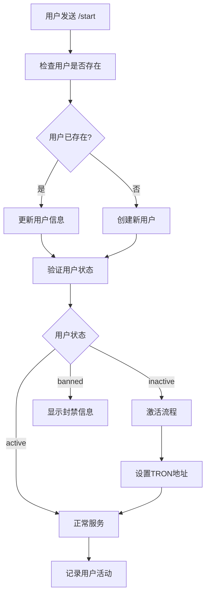

# 👥 用户管理 API 详细文档

> Telegram Bot 用户管理系统的完整指南和项目实际使用示例

## 📋 目录

- [用户管理概述](#用户管理概述)
- [用户注册和认证](#用户注册和认证)
- [用户数据管理](#用户数据管理)
- [权限和角色管理](#权限和角色管理)
- [用户状态管理](#用户状态管理)
- [会话和缓存管理](#会话和缓存管理)
- [用户行为分析](#用户行为分析)
- [数据安全和隐私](#数据安全和隐私)

## 🎯 用户管理概述

### 用户生命周期



### 项目中的用户数据结构

```typescript
interface User {
  id: string;
  telegram_id: number;
  username?: string;
  first_name?: string;
  last_name?: string;
  language_code?: string;
  
  // 业务相关字段
  tron_address?: string;
  usdt_balance: number;
  trx_balance: number;
  total_orders: number;
  total_spent: number;
  total_energy_used: number;
  
  // 状态管理
  status: 'active' | 'inactive' | 'banned';
  role: 'user' | 'vip' | 'admin';
  level: number;
  
  // 时间戳
  created_at: Date;
  updated_at: Date;
  last_activity: Date;
  
  // 设置和偏好
  notification_enabled: boolean;
  language: string;
  timezone?: string;
}
```

## 🔐 用户注册和认证

### 用户注册流程

```typescript
// services/user/UserService.ts
export class UserService {
  /**
   * 注册 Telegram 用户
   */
  static async registerTelegramUser(userData: {
    telegram_id: number;
    username?: string;
    first_name?: string;
    last_name?: string;
    language_code?: string;
  }): Promise<User> {
    try {
      // 检查用户是否已存在
      const existingUser = await this.getUserByTelegramId(userData.telegram_id);
      
      if (existingUser) {
        // 更新现有用户信息
        return await this.updateUserProfile(existingUser.id, {
          username: userData.username,
          first_name: userData.first_name,
          last_name: userData.last_name,
          language_code: userData.language_code,
          last_activity: new Date()
        });
      }

      // 创建新用户
      const newUser: Partial<User> = {
        telegram_id: userData.telegram_id,
        username: userData.username,
        first_name: userData.first_name,
        last_name: userData.last_name,
        language_code: userData.language_code,
        
        // 默认值
        usdt_balance: 0,
        trx_balance: 0,
        total_orders: 0,
        total_spent: 0,
        total_energy_used: 0,
        status: 'inactive', // 新用户需要设置TRON地址后激活
        role: 'user',
        level: 1,
        notification_enabled: true,
        language: userData.language_code || 'zh',
        
        // 时间戳
        created_at: new Date(),
        updated_at: new Date(),
        last_activity: new Date()
      };

      const user = await db.user.create(newUser);
      
      // 记录注册事件
      await this.logUserEvent(user.id, 'user_registered', {
        source: 'telegram',
        telegram_id: userData.telegram_id
      });

      // 发送欢迎通知
      await this.sendWelcomeNotification(user);

      return user;
    } catch (error) {
      console.error('User registration failed:', error);
      throw new Error('Failed to register user');
    }
  }

  /**
   * 根据 Telegram ID 获取用户
   */
  static async getUserByTelegramId(telegramId: number): Promise<User | null> {
    try {
      const user = await db.user.findUnique({
        where: { telegram_id: telegramId }
      });
      
      if (user) {
        // 更新最后活动时间
        await this.updateLastActivity(user.id);
      }
      
      return user;
    } catch (error) {
      console.error('Failed to get user by telegram ID:', error);
      return null;
    }
  }

  /**
   * 用户身份验证
   */
  static async authenticateUser(telegramId: number): Promise<{
    authenticated: boolean;
    user?: User;
    reason?: string;
  }> {
    try {
      const user = await this.getUserByTelegramId(telegramId);
      
      if (!user) {
        return {
          authenticated: false,
          reason: '用户不存在，请使用 /start 注册'
        };
      }

      // 检查用户状态
      if (user.status === 'banned') {
        return {
          authenticated: false,
          user,
          reason: '您的账户已被限制使用'
        };
      }

      if (user.status === 'inactive') {
        return {
          authenticated: false,
          user,
          reason: '请先完成账户设置'
        };
      }

      return {
        authenticated: true,
        user
      };
    } catch (error) {
      console.error('User authentication failed:', error);
      return {
        authenticated: false,
        reason: '认证失败，请重试'
      };
    }
  }
}
```

### 用户激活流程

```typescript
/**
 * 激活用户账户
 */
static async activateUser(userId: string, tronAddress: string): Promise<boolean> {
  try {
    // 验证TRON地址格式
    if (!this.isValidTronAddress(tronAddress)) {
      throw new Error('Invalid TRON address format');
    }

    // 检查地址是否已被使用
    const existingUser = await db.user.findFirst({
      where: { 
        tron_address: tronAddress,
        id: { not: userId }
      }
    });

    if (existingUser) {
      throw new Error('TRON address already in use');
    }

    // 更新用户信息
    await db.user.update({
      where: { id: userId },
      data: {
        tron_address: tronAddress,
        status: 'active',
        updated_at: new Date()
      }
    });

    // 记录激活事件
    await this.logUserEvent(userId, 'user_activated', {
      tron_address: tronAddress
    });

    // 发送激活成功通知
    await this.sendActivationNotification(userId);

    return true;
  } catch (error) {
    console.error('User activation failed:', error);
    throw error;
  }
}

/**
 * TRON地址验证
 */
private static isValidTronAddress(address: string): boolean {
  // TRON地址以T开头，长度为34位
  const tronAddressRegex = /^T[A-Za-z1-9]{33}$/;
  return tronAddressRegex.test(address);
}
```

## 📊 用户数据管理

### 用户资料管理

```typescript
export class UserProfileManager {
  /**
   * 更新用户资料
   */
  static async updateProfile(userId: string, updates: Partial<User>): Promise<User> {
    try {
      // 过滤允许更新的字段
      const allowedFields = [
        'username', 'first_name', 'last_name', 'language_code',
        'tron_address', 'notification_enabled', 'language', 'timezone'
      ];

      const filteredUpdates = Object.keys(updates)
        .filter(key => allowedFields.includes(key))
        .reduce((obj, key) => {
          obj[key] = updates[key];
          return obj;
        }, {} as any);

      filteredUpdates.updated_at = new Date();

      const user = await db.user.update({
        where: { id: userId },
        data: filteredUpdates
      });

      // 记录更新事件
      await UserService.logUserEvent(userId, 'profile_updated', {
        fields: Object.keys(filteredUpdates)
      });

      return user;
    } catch (error) {
      console.error('Profile update failed:', error);
      throw new Error('Failed to update profile');
    }
  }

  /**
   * 更新用户余额
   */
  static async updateBalance(
    userId: string, 
    type: 'usdt' | 'trx',
    amount: number,
    operation: 'add' | 'subtract' | 'set'
  ): Promise<User> {
    try {
      const user = await UserService.getUserById(userId);
      if (!user) throw new Error('User not found');

      let newBalance: number;
      const currentBalance = type === 'usdt' ? user.usdt_balance : user.trx_balance;

      switch (operation) {
        case 'add':
          newBalance = currentBalance + amount;
          break;
        case 'subtract':
          newBalance = Math.max(0, currentBalance - amount); // 不允许负余额
          break;
        case 'set':
          newBalance = amount;
          break;
      }

      const updateData = {
        [type === 'usdt' ? 'usdt_balance' : 'trx_balance']: newBalance,
        updated_at: new Date()
      };

      const updatedUser = await db.user.update({
        where: { id: userId },
        data: updateData
      });

      // 记录余额变动
      await this.logBalanceChange(userId, type, currentBalance, newBalance, operation);

      return updatedUser;
    } catch (error) {
      console.error('Balance update failed:', error);
      throw error;
    }
  }

  /**
   * 记录余额变动
   */
  private static async logBalanceChange(
    userId: string,
    type: 'usdt' | 'trx',
    oldBalance: number,
    newBalance: number,
    operation: string
  ): Promise<void> {
    await db.balanceHistory.create({
      data: {
        user_id: userId,
        currency_type: type.toUpperCase(),
        old_balance: oldBalance,
        new_balance: newBalance,
        change_amount: newBalance - oldBalance,
        operation_type: operation,
        created_at: new Date()
      }
    });
  }

  /**
   * 更新用户统计数据
   */
  static async updateUserStats(userId: string, stats: {
    totalOrders?: number;
    totalSpent?: number;
    totalEnergyUsed?: number;
  }): Promise<void> {
    try {
      const updateData = {
        ...stats,
        updated_at: new Date()
      };

      await db.user.update({
        where: { id: userId },
        data: updateData
      });

      // 检查用户等级升级
      await this.checkLevelUpgrade(userId);
    } catch (error) {
      console.error('User stats update failed:', error);
      throw error;
    }
  }

  /**
   * 检查用户等级升级
   */
  private static async checkLevelUpgrade(userId: string): Promise<void> {
    const user = await UserService.getUserById(userId);
    if (!user) return;

    const newLevel = this.calculateUserLevel(user);
    
    if (newLevel > user.level) {
      await db.user.update({
        where: { id: userId },
        data: { 
          level: newLevel,
          updated_at: new Date()
        }
      });

      // 发送升级通知
      await this.sendLevelUpgradeNotification(userId, user.level, newLevel);

      // 记录升级事件
      await UserService.logUserEvent(userId, 'level_upgraded', {
        old_level: user.level,
        new_level: newLevel
      });
    }
  }

  /**
   * 计算用户等级
   */
  private static calculateUserLevel(user: User): number {
    const totalSpent = user.total_spent || 0;
    const totalOrders = user.total_orders || 0;

    // 等级计算规则
    if (totalSpent >= 10000 || totalOrders >= 1000) return 10; // 白金
    if (totalSpent >= 5000 || totalOrders >= 500) return 8;    // 黄金
    if (totalSpent >= 1000 || totalOrders >= 100) return 5;    // 白银
    if (totalSpent >= 100 || totalOrders >= 10) return 3;      // 青铜
    
    return 1; // 新手
  }
}
```

## 🔑 权限和角色管理

### 角色权限系统

```typescript
// 权限定义
export const PERMISSIONS = {
  // 基础功能
  BUY_ENERGY: 'buy_energy',
  VIEW_ORDERS: 'view_orders',
  VIEW_BALANCE: 'view_balance',
  
  // VIP功能
  VIP_PACKAGES: 'vip_packages',
  PRIORITY_SUPPORT: 'priority_support',
  ADVANCED_ANALYTICS: 'advanced_analytics',
  
  // 管理员功能
  ADMIN_PANEL: 'admin_panel',
  USER_MANAGEMENT: 'user_management',
  SYSTEM_CONFIG: 'system_config',
  VIEW_STATISTICS: 'view_statistics',
  BROADCAST_MESSAGE: 'broadcast_message'
} as const;

// 角色权限映射
export const ROLE_PERMISSIONS = {
  user: [
    PERMISSIONS.BUY_ENERGY,
    PERMISSIONS.VIEW_ORDERS,
    PERMISSIONS.VIEW_BALANCE
  ],
  vip: [
    ...ROLE_PERMISSIONS.user,
    PERMISSIONS.VIP_PACKAGES,
    PERMISSIONS.PRIORITY_SUPPORT,
    PERMISSIONS.ADVANCED_ANALYTICS
  ],
  admin: [
    ...ROLE_PERMISSIONS.vip,
    PERMISSIONS.ADMIN_PANEL,
    PERMISSIONS.USER_MANAGEMENT,
    PERMISSIONS.SYSTEM_CONFIG,
    PERMISSIONS.VIEW_STATISTICS,
    PERMISSIONS.BROADCAST_MESSAGE
  ]
} as const;

export class UserPermissionManager {
  /**
   * 检查用户权限
   */
  static hasPermission(user: User, permission: string): boolean {
    const userPermissions = ROLE_PERMISSIONS[user.role] || [];
    return userPermissions.includes(permission);
  }

  /**
   * 检查多个权限
   */
  static hasAnyPermission(user: User, permissions: string[]): boolean {
    return permissions.some(permission => this.hasPermission(user, permission));
  }

  /**
   * 检查所有权限
   */
  static hasAllPermissions(user: User, permissions: string[]): boolean {
    return permissions.every(permission => this.hasPermission(user, permission));
  }

  /**
   * 获取用户所有权限
   */
  static getUserPermissions(user: User): string[] {
    return ROLE_PERMISSIONS[user.role] || [];
  }

  /**
   * 升级用户角色
   */
  static async upgradeUserRole(userId: string, newRole: 'user' | 'vip' | 'admin'): Promise<void> {
    try {
      const user = await UserService.getUserById(userId);
      if (!user) throw new Error('User not found');

      const oldRole = user.role;
      
      await db.user.update({
        where: { id: userId },
        data: {
          role: newRole,
          updated_at: new Date()
        }
      });

      // 记录角色变更
      await UserService.logUserEvent(userId, 'role_changed', {
        old_role: oldRole,
        new_role: newRole
      });

      // 发送角色升级通知
      await this.sendRoleUpgradeNotification(userId, oldRole, newRole);
    } catch (error) {
      console.error('Role upgrade failed:', error);
      throw error;
    }
  }

  /**
   * 权限中间件
   */
  static requirePermission(permission: string) {
    return async (req: any, res: any, next: any) => {
      try {
        const userId = req.user?.id;
        if (!userId) {
          return res.status(401).json({ error: 'Unauthorized' });
        }

        const user = await UserService.getUserById(userId);
        if (!user) {
          return res.status(401).json({ error: 'User not found' });
        }

        if (!this.hasPermission(user, permission)) {
          return res.status(403).json({ 
            error: 'Insufficient permissions',
            required_permission: permission 
          });
        }

        req.user = user;
        next();
      } catch (error) {
        console.error('Permission check failed:', error);
        res.status(500).json({ error: 'Permission check failed' });
      }
    };
  }
}
```

### 用户状态管理

```typescript
export class UserStateManager {
  private static states = new Map<number, UserSessionState>();
  private static readonly SESSION_TTL = 30 * 60 * 1000; // 30分钟

  /**
   * 设置用户状态
   */
  static setState(userId: number, state: Partial<UserSessionState>): void {
    const existing = this.states.get(userId) || {
      userId,
      chatId: 0,
      lastActivity: new Date(),
      data: {}
    };

    this.states.set(userId, {
      ...existing,
      ...state,
      lastActivity: new Date()
    });
  }

  /**
   * 获取用户状态
   */
  static getState(userId: number): UserSessionState | undefined {
    const state = this.states.get(userId);
    if (!state) return undefined;

    // 检查是否过期
    if (Date.now() - state.lastActivity.getTime() > this.SESSION_TTL) {
      this.states.delete(userId);
      return undefined;
    }

    return state;
  }

  /**
   * 清除用户状态
   */
  static clearState(userId: number): void {
    this.states.delete(userId);
  }

  /**
   * 设置用户操作上下文
   */
  static setOperationContext(userId: number, context: {
    action: string;
    step: number;
    data: Record<string, any>;
  }): void {
    this.setState(userId, {
      currentAction: context.action,
      step: context.step,
      data: { ...this.getState(userId)?.data, ...context.data }
    });
  }

  /**
   * 检查用户是否在特定操作中
   */
  static isInOperation(userId: number, action: string): boolean {
    const state = this.getState(userId);
    return state?.currentAction === action;
  }

  /**
   * 获取操作进度
   */
  static getOperationProgress(userId: number): {
    action?: string;
    step?: number;
    data?: Record<string, any>;
  } {
    const state = this.getState(userId);
    return {
      action: state?.currentAction,
      step: state?.step,
      data: state?.data
    };
  }
}

interface UserSessionState {
  userId: number;
  chatId: number;
  currentAction?: string;
  step?: number;
  data?: Record<string, any>;
  lastActivity: Date;
}
```

## 📈 用户行为分析

### 用户活动跟踪

```typescript
export class UserAnalytics {
  /**
   * 记录用户事件
   */
  static async trackEvent(userId: string, event: string, properties?: Record<string, any>): Promise<void> {
    try {
      await db.userEvent.create({
        data: {
          user_id: userId,
          event_type: event,
          properties: properties ? JSON.stringify(properties) : null,
          created_at: new Date()
        }
      });
    } catch (error) {
      console.error('Failed to track user event:', error);
    }
  }

  /**
   * 获取用户活动统计
   */
  static async getUserActivityStats(userId: string, days: number = 30): Promise<{
    totalEvents: number;
    eventsByType: Record<string, number>;
    dailyActivity: Array<{ date: string; count: number }>;
    mostActiveHours: Array<{ hour: number; count: number }>;
  }> {
    const startDate = new Date();
    startDate.setDate(startDate.getDate() - days);

    const events = await db.userEvent.findMany({
      where: {
        user_id: userId,
        created_at: { gte: startDate }
      },
      orderBy: { created_at: 'desc' }
    });

    // 统计事件类型
    const eventsByType = events.reduce((acc, event) => {
      acc[event.event_type] = (acc[event.event_type] || 0) + 1;
      return acc;
    }, {} as Record<string, number>);

    // 统计每日活动
    const dailyActivity = this.groupEventsByDay(events);

    // 统计活跃时段
    const mostActiveHours = this.groupEventsByHour(events);

    return {
      totalEvents: events.length,
      eventsByType,
      dailyActivity,
      mostActiveHours
    };
  }

  /**
   * 获取用户留存率
   */
  static async getUserRetentionRate(cohortDate: Date): Promise<{
    day1: number;
    day7: number;
    day30: number;
  }> {
    // 获取该日期注册的用户
    const cohortUsers = await db.user.findMany({
      where: {
        created_at: {
          gte: cohortDate,
          lt: new Date(cohortDate.getTime() + 24 * 60 * 60 * 1000)
        }
      }
    });

    const totalUsers = cohortUsers.length;
    if (totalUsers === 0) return { day1: 0, day7: 0, day30: 0 };

    // 计算各时期的活跃用户
    const day1Active = await this.getActiveUsersCount(cohortUsers, 1);
    const day7Active = await this.getActiveUsersCount(cohortUsers, 7);
    const day30Active = await this.getActiveUsersCount(cohortUsers, 30);

    return {
      day1: (day1Active / totalUsers) * 100,
      day7: (day7Active / totalUsers) * 100,
      day30: (day30Active / totalUsers) * 100
    };
  }

  /**
   * 用户分群分析
   */
  static async getUserSegments(): Promise<{
    newUsers: number;
    activeUsers: number;
    churningUsers: number;
    dormantUsers: number;
  }> {
    const now = new Date();
    const day7Ago = new Date(now.getTime() - 7 * 24 * 60 * 60 * 1000);
    const day30Ago = new Date(now.getTime() - 30 * 24 * 60 * 60 * 1000);

    const [newUsers, activeUsers, churningUsers, dormantUsers] = await Promise.all([
      // 新用户（7天内注册）
      db.user.count({
        where: { created_at: { gte: day7Ago } }
      }),
      
      // 活跃用户（7天内有活动）
      db.user.count({
        where: { last_activity: { gte: day7Ago } }
      }),
      
      // 流失用户（7-30天内有活动，但最近7天无活动）
      db.user.count({
        where: {
          last_activity: {
            gte: day30Ago,
            lt: day7Ago
          }
        }
      }),
      
      // 休眠用户（30天以上无活动）
      db.user.count({
        where: { last_activity: { lt: day30Ago } }
      })
    ]);

    return { newUsers, activeUsers, churningUsers, dormantUsers };
  }

  private static groupEventsByDay(events: any[]): Array<{ date: string; count: number }> {
    const dayGroups = events.reduce((acc, event) => {
      const date = event.created_at.toISOString().split('T')[0];
      acc[date] = (acc[date] || 0) + 1;
      return acc;
    }, {} as Record<string, number>);

    return Object.entries(dayGroups)
      .map(([date, count]) => ({ date, count }))
      .sort((a, b) => a.date.localeCompare(b.date));
  }

  private static groupEventsByHour(events: any[]): Array<{ hour: number; count: number }> {
    const hourGroups = events.reduce((acc, event) => {
      const hour = event.created_at.getHours();
      acc[hour] = (acc[hour] || 0) + 1;
      return acc;
    }, {} as Record<number, number>);

    return Object.entries(hourGroups)
      .map(([hour, count]) => ({ hour: parseInt(hour), count }))
      .sort((a, b) => b.count - a.count);
  }

  private static async getActiveUsersCount(users: User[], days: number): Promise<number> {
    const cutoffDate = new Date();
    cutoffDate.setDate(cutoffDate.getDate() - days);

    const activeUserIds = await db.userEvent.findMany({
      where: {
        user_id: { in: users.map(u => u.id) },
        created_at: { gte: cutoffDate }
      },
      select: { user_id: true },
      distinct: ['user_id']
    });

    return activeUserIds.length;
  }
}
```

## 🔒 数据安全和隐私

### 敏感数据处理

```typescript
export class UserDataSecurity {
  /**
   * 加密敏感字段
   */
  static encryptSensitiveData(data: string): string {
    const crypto = require('crypto');
    const algorithm = 'aes-256-gcm';
    const secretKey = process.env.ENCRYPTION_KEY;
    
    if (!secretKey) throw new Error('Encryption key not configured');
    
    const iv = crypto.randomBytes(16);
    const cipher = crypto.createCipher(algorithm, secretKey);
    cipher.setAAD(Buffer.from('user-data'));
    
    let encrypted = cipher.update(data, 'utf8', 'hex');
    encrypted += cipher.final('hex');
    
    const authTag = cipher.getAuthTag();
    
    return `${iv.toString('hex')}:${authTag.toString('hex')}:${encrypted}`;
  }

  /**
   * 解密敏感字段
   */
  static decryptSensitiveData(encryptedData: string): string {
    const crypto = require('crypto');
    const algorithm = 'aes-256-gcm';
    const secretKey = process.env.ENCRYPTION_KEY;
    
    if (!secretKey) throw new Error('Encryption key not configured');
    
    const [ivHex, authTagHex, encrypted] = encryptedData.split(':');
    const iv = Buffer.from(ivHex, 'hex');
    const authTag = Buffer.from(authTagHex, 'hex');
    
    const decipher = crypto.createDecipher(algorithm, secretKey);
    decipher.setAAD(Buffer.from('user-data'));
    decipher.setAuthTag(authTag);
    
    let decrypted = decipher.update(encrypted, 'hex', 'utf8');
    decrypted += decipher.final('utf8');
    
    return decrypted;
  }

  /**
   * 数据脱敏
   */
  static maskSensitiveData(user: User): Partial<User> {
    return {
      ...user,
      // 脱敏TRON地址（只显示前4位和后4位）
      tron_address: user.tron_address ? 
        `${user.tron_address.substring(0, 4)}****${user.tron_address.substring(user.tron_address.length - 4)}` : 
        undefined,
      // 脱敏用户名
      username: user.username ? 
        `${user.username.substring(0, 2)}***` : 
        undefined
    };
  }

  /**
   * GDPR 数据导出
   */
  static async exportUserData(userId: string): Promise<{
    profile: User;
    orders: any[];
    transactions: any[];
    events: any[];
  }> {
    try {
      const [profile, orders, transactions, events] = await Promise.all([
        db.user.findUnique({ where: { id: userId } }),
        db.order.findMany({ where: { user_id: userId } }),
        db.balanceHistory.findMany({ where: { user_id: userId } }),
        db.userEvent.findMany({ where: { user_id: userId } })
      ]);

      return {
        profile: profile!,
        orders,
        transactions,
        events
      };
    } catch (error) {
      console.error('Failed to export user data:', error);
      throw new Error('Data export failed');
    }
  }

  /**
   * GDPR 数据删除
   */
  static async deleteUserData(userId: string, keepTransactionHistory: boolean = true): Promise<void> {
    try {
      await db.$transaction(async (tx) => {
        // 删除用户事件
        await tx.userEvent.deleteMany({ where: { user_id: userId } });
        
        // 删除会话数据
        UserStateManager.clearState(parseInt(userId));
        
        if (!keepTransactionHistory) {
          // 删除订单历史
          await tx.order.deleteMany({ where: { user_id: userId } });
          
          // 删除余额历史
          await tx.balanceHistory.deleteMany({ where: { user_id: userId } });
        }
        
        // 匿名化用户资料
        await tx.user.update({
          where: { id: userId },
          data: {
            telegram_id: 0,
            username: null,
            first_name: 'Deleted',
            last_name: 'User',
            tron_address: null,
            status: 'banned',
            updated_at: new Date()
          }
        });
      });

      console.log(`User data deleted for user ${userId}`);
    } catch (error) {
      console.error('Failed to delete user data:', error);
      throw new Error('Data deletion failed');
    }
  }
}
```

### 用户隐私设置

```typescript
export class UserPrivacyManager {
  /**
   * 更新隐私设置
   */
  static async updatePrivacySettings(userId: string, settings: {
    dataCollection?: boolean;
    analyticsTracking?: boolean;
    marketingEmails?: boolean;
    thirdPartySharing?: boolean;
  }): Promise<void> {
    try {
      await db.userPrivacySettings.upsert({
        where: { user_id: userId },
        update: {
          ...settings,
          updated_at: new Date()
        },
        create: {
          user_id: userId,
          data_collection: settings.dataCollection ?? true,
          analytics_tracking: settings.analyticsTracking ?? true,
          marketing_emails: settings.marketingEmails ?? false,
          third_party_sharing: settings.thirdPartySharing ?? false,
          created_at: new Date(),
          updated_at: new Date()
        }
      });

      // 记录隐私设置变更
      await UserService.logUserEvent(userId, 'privacy_settings_updated', settings);
    } catch (error) {
      console.error('Failed to update privacy settings:', error);
      throw error;
    }
  }

  /**
   * 获取隐私设置
   */
  static async getPrivacySettings(userId: string): Promise<{
    dataCollection: boolean;
    analyticsTracking: boolean;
    marketingEmails: boolean;
    thirdPartySharing: boolean;
  }> {
    try {
      const settings = await db.userPrivacySettings.findUnique({
        where: { user_id: userId }
      });

      return {
        dataCollection: settings?.data_collection ?? true,
        analyticsTracking: settings?.analytics_tracking ?? true,
        marketingEmails: settings?.marketing_emails ?? false,
        thirdPartySharing: settings?.third_party_sharing ?? false
      };
    } catch (error) {
      console.error('Failed to get privacy settings:', error);
      return {
        dataCollection: true,
        analyticsTracking: true,
        marketingEmails: false,
        thirdPartySharing: false
      };
    }
  }

  /**
   * 检查是否允许数据收集
   */
  static async canCollectData(userId: string): Promise<boolean> {
    const settings = await this.getPrivacySettings(userId);
    return settings.dataCollection;
  }

  /**
   * 检查是否允许分析跟踪
   */
  static async canTrackAnalytics(userId: string): Promise<boolean> {
    const settings = await this.getPrivacySettings(userId);
    return settings.analyticsTracking;
  }
}
```

## 💡 最佳实践和使用示例

### Telegram Bot 中的用户管理集成

```typescript
// 在命令处理器中集成用户管理
export class CommandHandler {
  async handleStartCommand(msg: TelegramBot.Message): Promise<void> {
    const chatId = msg.chat.id;
    const telegramUser = msg.from;
    
    if (!telegramUser) {
      await this.bot.sendMessage(chatId, '❌ 无法获取用户信息，请重试。');
      return;
    }

    try {
      // 1. 注册或更新用户
      const user = await UserService.registerTelegramUser({
        telegram_id: telegramUser.id,
        username: telegramUser.username,
        first_name: telegramUser.first_name,
        last_name: telegramUser.last_name,
        language_code: telegramUser.language_code
      });

      // 2. 检查用户状态
      const auth = await UserService.authenticateUser(telegramUser.id);
      
      if (!auth.authenticated) {
        if (auth.user?.status === 'inactive') {
          // 引导用户完成设置
          await this.showAccountSetupGuide(chatId);
        } else {
          await this.bot.sendMessage(chatId, `❌ ${auth.reason}`);
        }
        return;
      }

      // 3. 记录用户活动
      await UserAnalytics.trackEvent(user.id, 'start_command_used', {
        chat_id: chatId,
        user_level: user.level,
        user_role: user.role
      });

      // 4. 发送个性化欢迎消息
      const welcomeMessage = await this.buildPersonalizedWelcomeMessage(user);
      await this.bot.sendMessage(chatId, welcomeMessage);

      // 5. 显示适合用户等级的菜单
      const keyboard = await this.buildUserSpecificKeyboard(user);
      await this.bot.sendMessage(chatId, '请选择您需要的服务：', {
        reply_markup: keyboard
      });

    } catch (error) {
      console.error('Error in handleStartCommand:', error);
      await this.bot.sendMessage(chatId, '❌ 服务暂时不可用，请稍后重试。');
    }
  }

  private async buildPersonalizedWelcomeMessage(user: User): Promise<string> {
    const levelName = this.getLevelName(user.level);
    const totalOrders = user.total_orders || 0;
    
    let message = `🎉 欢迎回来，${user.first_name}！\n\n`;
    message += `👑 您是我们的${levelName}用户\n`;
    
    if (totalOrders > 0) {
      message += `📊 您已完成 ${totalOrders} 笔订单\n`;
      message += `💰 累计消费 ${user.total_spent || 0} USDT\n\n`;
    }

    // 根据用户等级提供不同的功能介绍
    if (user.level >= 5) {
      message += `🎯 VIP专享功能已为您开启！\n`;
    }

    message += `🔋 继续享受我们的TRON能量租赁服务吧！`;
    
    return message;
  }

  private getLevelName(level: number): string {
    if (level >= 10) return '白金';
    if (level >= 8) return '黄金';
    if (level >= 5) return '白银';
    if (level >= 3) return '青铜';
    return '新手';
  }
}
```

### 用户权限检查中间件

```typescript
// 回调查询权限检查
export class CallbackHandler {
  async handleCallbackQuery(callbackQuery: TelegramBot.CallbackQuery): Promise<void> {
    const chatId = callbackQuery.message?.chat.id;
    const data = callbackQuery.data;
    const userId = callbackQuery.from?.id;
    
    if (!chatId || !data || !userId) return;

    try {
      // 1. 用户认证
      const auth = await UserService.authenticateUser(userId);
      if (!auth.authenticated) {
        await this.bot.answerCallbackQuery(callbackQuery.id, {
          text: auth.reason || '认证失败',
          show_alert: true
        });
        return;
      }

      const user = auth.user!;

      // 2. 权限检查
      const requiredPermission = this.getRequiredPermission(data);
      if (requiredPermission && !UserPermissionManager.hasPermission(user, requiredPermission)) {
        await this.bot.answerCallbackQuery(callbackQuery.id, {
          text: '您没有权限执行此操作',
          show_alert: true
        });
        return;
      }

      // 3. 记录用户活动
      await UserAnalytics.trackEvent(user.id, 'callback_query', {
        action: data,
        chat_id: chatId
      });

      // 4. 处理回调
      await this.processCallback(chatId, data, user, callbackQuery);

    } catch (error) {
      console.error('Callback query error:', error);
      await this.bot.answerCallbackQuery(callbackQuery.id, {
        text: '处理请求时发生错误',
        show_alert: true
      });
    }
  }

  private getRequiredPermission(callbackData: string): string | null {
    if (callbackData.startsWith('vip_')) {
      return PERMISSIONS.VIP_PACKAGES;
    }
    if (callbackData.startsWith('admin_')) {
      return PERMISSIONS.ADMIN_PANEL;
    }
    return null; // 基础功能不需要特殊权限
  }
}
```

## 🔗 相关文档

- [Commands API](./02-commands-api.md) - 命令处理系统
- [Callbacks API](./03-callbacks-api.md) - 回调查询处理
- [Payment Integration API](./07-payment-integration-api.md) - 支付和余额管理
- [Error Handling](./10-error-handling.md) - 错误处理指南

---

> 💡 **最佳实践提示**
> 1. 始终验证用户身份和权限
> 2. 保护用户敏感数据，遵循隐私法规
> 3. 记录用户行为用于分析和改进
> 4. 实现合理的用户等级和权限系统
> 5. 提供个性化的用户体验

