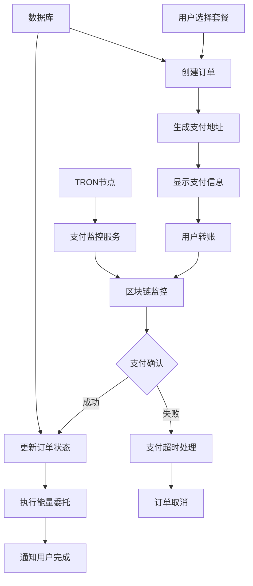

# 💳 支付集成 API 详细文档

> TRON 能量租赁项目支付系统的完整指南和实际使用示例

## 📋 目录

- [支付系统概述](#支付系统概述)
- [TRON 网络集成](#tron-网络集成)
- [支付流程管理](#支付流程管理)
- [支付监控和确认](#支付监控和确认)
- [余额管理系统](#余额管理系统)
- [订单状态管理](#订单状态管理)
- [支付安全性](#支付安全性)
- [错误处理和重试](#错误处理和重试)

## 🎯 支付系统概述

### 支付流程架构



### 支持的支付方式

| 支付方式 | 币种 | 网络 | 确认时间 | 手续费 |
|----------|------|------|----------|--------|
| **TRX 直接支付** | TRX | TRON MainNet | 3-6秒 | ~0.1 TRX |
| **USDT-TRC20** | USDT | TRON MainNet | 3-6秒 | ~1-3 TRX |
| **内部余额** | USDT/TRX | 系统内部 | 即时 | 无 |

### 项目中的支付数据结构

```typescript
interface PaymentOrder {
  id: string;
  user_id: string;
  package_id: string;
  
  // 金额信息
  amount_trx: number;
  amount_usdt?: number;
  currency_type: 'TRX' | 'USDT';
  
  // 支付信息
  payment_address: string;
  recipient_address: string; // 用户的TRON地址
  
  // 区块链信息
  tx_hash?: string;
  block_number?: number;
  confirmation_count: number;
  
  // 状态管理
  status: 'pending' | 'paid' | 'confirmed' | 'completed' | 'failed' | 'expired';
  expires_at: Date;
  
  // 时间戳
  created_at: Date;
  paid_at?: Date;
  confirmed_at?: Date;
  completed_at?: Date;
}

interface PaymentMonitor {
  id: string;
  order_id: string;
  payment_address: string;
  expected_amount: number;
  currency_type: string;
  
  // 监控状态
  is_active: boolean;
  last_check_at: Date;
  check_count: number;
  
  // 监控配置
  confirmation_required: number;
  timeout_minutes: number;
  
  created_at: Date;
  completed_at?: Date;
}
```

## ⚡ TRON 网络集成

### TronWeb 初始化和配置

```typescript
// services/tron/TronService.ts
import TronWeb from 'tronweb';

export class TronService {
  private static tronWeb: TronWeb;
  private static initialized = false;

  /**
   * 初始化 TronWeb 实例
   */
  static async initialize(): Promise<void> {
    try {
      const config = await this.getTronConfig();
      
      this.tronWeb = new TronWeb({
        fullHost: config.fullNode,
        headers: { "TRON-PRO-API-KEY": config.apiKey },
        privateKey: config.privateKey
      });

      // 验证连接
      const nodeInfo = await this.tronWeb.trx.getNodeInfo();
      console.log('✅ TRON节点连接成功:', nodeInfo.configNodeInfo?.codeVersion);
      
      this.initialized = true;
    } catch (error) {
      console.error('❌ TRON节点连接失败:', error);
      throw new Error('Failed to initialize TRON connection');
    }
  }

  /**
   * 获取 TRON 配置
   */
  private static async getTronConfig(): Promise<{
    fullNode: string;
    apiKey: string;
    privateKey: string;
  }> {
    // 从数据库或环境变量获取配置
    const config = await configService.getTronNetworkConfig();
    
    return {
      fullNode: config.rpcUrl || 'https://api.trongrid.io',
      apiKey: config.apiKey || process.env.TRON_API_KEY!,
      privateKey: config.privateKey || process.env.TRON_PRIVATE_KEY!
    };
  }

  /**
   * 获取 TronWeb 实例
   */
  static getInstance(): TronWeb {
    if (!this.initialized || !this.tronWeb) {
      throw new Error('TronWeb not initialized. Call initialize() first.');
    }
    return this.tronWeb;
  }

  /**
   * 验证 TRON 地址
   */
  static isValidAddress(address: string): boolean {
    try {
      return this.tronWeb.isAddress(address);
    } catch {
      return false;
    }
  }

  /**
   * 获取账户信息
   */
  static async getAccountInfo(address: string): Promise<{
    balance: number;
    energy: number;
    bandwidth: number;
    frozenBalance: number;
  }> {
    try {
      const account = await this.tronWeb.trx.getAccount(address);
      const accountResources = await this.tronWeb.trx.getAccountResources(address);
      
      return {
        balance: (account.balance || 0) / 1000000, // TRX
        energy: accountResources.EnergyLimit || 0,
        bandwidth: accountResources.NetLimit || 0,
        frozenBalance: (account.frozen?.[0]?.frozen_balance || 0) / 1000000
      };
    } catch (error) {
      console.error('Failed to get account info:', error);
      throw error;
    }
  }

  /**
   * 获取交易详情
   */
  static async getTransactionInfo(txHash: string): Promise<{
    success: boolean;
    block: number;
    energy_used: number;
    net_used: number;
    result: string;
  }> {
    try {
      const txInfo = await this.tronWeb.trx.getTransactionInfo(txHash);
      const tx = await this.tronWeb.trx.getTransaction(txHash);
      
      return {
        success: txInfo.result === 'SUCCESS',
        block: txInfo.blockNumber,
        energy_used: txInfo.receipt?.energy_usage || 0,
        net_used: txInfo.receipt?.net_usage || 0,
        result: txInfo.result || 'UNKNOWN'
      };
    } catch (error) {
      console.error('Failed to get transaction info:', error);
      throw error;
    }
  }
}
```

### USDT-TRC20 合约交互

```typescript
// services/tron/USDTService.ts
export class USDTService extends TronService {
  private static readonly USDT_CONTRACT = 'TR7NHqjeKQxGTCi8q8ZY4pL8otSzgjLj6t';
  private static usdtContract: any;

  /**
   * 初始化 USDT 合约
   */
  static async initializeContract(): Promise<void> {
    const tronWeb = this.getInstance();
    this.usdtContract = await tronWeb.contract().at(this.USDT_CONTRACT);
  }

  /**
   * 获取 USDT 余额
   */
  static async getUSDTBalance(address: string): Promise<number> {
    try {
      if (!this.usdtContract) await this.initializeContract();
      
      const balance = await this.usdtContract.balanceOf(address).call();
      return balance.toNumber() / 1000000; // USDT 6位小数
    } catch (error) {
      console.error('Failed to get USDT balance:', error);
      return 0;
    }
  }

  /**
   * 监控 USDT 转账
   */
  static async getUSDTTransfers(
    toAddress: string, 
    fromBlock: number,
    toBlock: number = 'latest'
  ): Promise<Array<{
    from: string;
    to: string;
    amount: number;
    txHash: string;
    blockNumber: number;
  }>> {
    try {
      if (!this.usdtContract) await this.initializeContract();
      
      const events = await this.usdtContract.Transfer().getEvents({
        sinceTimestamp: Date.now() - 24 * 60 * 60 * 1000, // 24小时内
        filters: { to: toAddress }
      });

      return events.map(event => ({
        from: event.result.from,
        to: event.result.to,
        amount: event.result.value / 1000000,
        txHash: event.transaction,
        blockNumber: event.block
      }));
    } catch (error) {
      console.error('Failed to get USDT transfers:', error);
      return [];
    }
  }

  /**
   * 转账 USDT
   */
  static async transferUSDT(
    toAddress: string, 
    amount: number,
    privateKey?: string
  ): Promise<string> {
    try {
      if (!this.usdtContract) await this.initializeContract();
      
      const tronWeb = this.getInstance();
      if (privateKey) {
        tronWeb.setPrivateKey(privateKey);
      }

      const amountSun = amount * 1000000; // 转换为最小单位
      const tx = await this.usdtContract.transfer(toAddress, amountSun).send();
      
      return tx;
    } catch (error) {
      console.error('USDT transfer failed:', error);
      throw error;
    }
  }
}
```

## 💰 支付流程管理

### 订单创建和支付地址生成

```typescript
// services/payment/PaymentService.ts
export class PaymentService {
  /**
   * 创建支付订单
   */
  static async createPaymentOrder(orderData: {
    userId: string;
    packageId: string;
    amount: number;
    currency: 'TRX' | 'USDT';
    recipientAddress: string;
  }): Promise<PaymentOrder> {
    try {
      // 生成唯一的支付地址（或使用固定地址）
      const paymentAddress = await this.generatePaymentAddress();
      
      // 计算订单过期时间（30分钟）
      const expiresAt = new Date(Date.now() + 30 * 60 * 1000);
      
      const paymentOrder: Partial<PaymentOrder> = {
        user_id: orderData.userId,
        package_id: orderData.packageId,
        amount_trx: orderData.currency === 'TRX' ? orderData.amount : 0,
        amount_usdt: orderData.currency === 'USDT' ? orderData.amount : 0,
        currency_type: orderData.currency,
        payment_address: paymentAddress,
        recipient_address: orderData.recipientAddress,
        status: 'pending',
        confirmation_count: 0,
        expires_at: expiresAt,
        created_at: new Date()
      };

      const order = await db.paymentOrder.create({ data: paymentOrder });
      
      // 启动支付监控
      await this.startPaymentMonitoring(order);
      
      // 记录支付订单创建事件
      await UserService.logUserEvent(orderData.userId, 'payment_order_created', {
        order_id: order.id,
        amount: orderData.amount,
        currency: orderData.currency
      });

      return order;
    } catch (error) {
      console.error('Failed to create payment order:', error);
      throw new Error('Payment order creation failed');
    }
  }

  /**
   * 生成支付地址
   */
  private static async generatePaymentAddress(): Promise<string> {
    // 方案1: 使用固定的收款地址
    const fixedAddress = process.env.TRON_PAYMENT_ADDRESS;
    if (fixedAddress && TronService.isValidAddress(fixedAddress)) {
      return fixedAddress;
    }

    // 方案2: 为每个订单生成唯一地址（需要更复杂的钱包管理）
    throw new Error('Payment address generation not configured');
  }

  /**
   * 启动支付监控
   */
  private static async startPaymentMonitoring(order: PaymentOrder): Promise<void> {
    const monitor: Partial<PaymentMonitor> = {
      order_id: order.id,
      payment_address: order.payment_address,
      expected_amount: order.currency_type === 'TRX' ? order.amount_trx : order.amount_usdt!,
      currency_type: order.currency_type,
      is_active: true,
      last_check_at: new Date(),
      check_count: 0,
      confirmation_required: 1, // TRX网络通常1个确认即可
      timeout_minutes: 30,
      created_at: new Date()
    };

    await db.paymentMonitor.create({ data: monitor });
    
    // 添加到监控队列
    await PaymentMonitorService.addToMonitorQueue(order.id);
  }

  /**
   * 处理支付确认
   */
  static async confirmPayment(orderId: string, txHash: string): Promise<boolean> {
    try {
      const order = await db.paymentOrder.findUnique({
        where: { id: orderId }
      });

      if (!order) {
        throw new Error('Order not found');
      }

      if (order.status !== 'pending') {
        throw new Error('Order is not in pending status');
      }

      // 验证交易
      const txInfo = await TronService.getTransactionInfo(txHash);
      if (!txInfo.success) {
        throw new Error('Transaction failed on blockchain');
      }

      // 验证交易金额（这里需要解析交易详情）
      const isValidAmount = await this.validateTransactionAmount(txHash, order);
      if (!isValidAmount) {
        throw new Error('Invalid transaction amount');
      }

      // 更新订单状态
      await db.paymentOrder.update({
        where: { id: orderId },
        data: {
          status: 'paid',
          tx_hash: txHash,
          block_number: txInfo.block,
          confirmation_count: 1,
          paid_at: new Date(),
          updated_at: new Date()
        }
      });

      // 停止监控
      await this.stopPaymentMonitoring(orderId);

      // 触发后续处理（能量委托）
      await this.triggerOrderProcessing(orderId);

      // 发送支付确认通知
      await this.sendPaymentConfirmationNotification(order.user_id, orderId);

      return true;
    } catch (error) {
      console.error('Payment confirmation failed:', error);
      return false;
    }
  }

  /**
   * 验证交易金额
   */
  private static async validateTransactionAmount(txHash: string, order: PaymentOrder): Promise<boolean> {
    try {
      // 获取交易详情并验证金额
      const tronWeb = TronService.getInstance();
      const tx = await tronWeb.trx.getTransaction(txHash);
      
      if (order.currency_type === 'TRX') {
        // TRX 转账验证
        const amount = tx.raw_data.contract[0].parameter.value.amount / 1000000;
        return Math.abs(amount - order.amount_trx) < 0.000001; // 允许微小误差
      } else {
        // USDT 转账验证（需要解析合约调用）
        return await this.validateUSDTTransaction(txHash, order);
      }
    } catch (error) {
      console.error('Transaction validation failed:', error);
      return false;
    }
  }

  /**
   * 验证 USDT 交易
   */
  private static async validateUSDTTransaction(txHash: string, order: PaymentOrder): Promise<boolean> {
    try {
      const transfers = await USDTService.getUSDTTransfers(
        order.payment_address,
        order.created_at.getTime()
      );

      const matchingTransfer = transfers.find(transfer => 
        transfer.txHash === txHash && 
        Math.abs(transfer.amount - order.amount_usdt!) < 0.000001
      );

      return !!matchingTransfer;
    } catch (error) {
      console.error('USDT transaction validation failed:', error);
      return false;
    }
  }
}
```

## 👁️ 支付监控和确认

### 自动支付监控服务

```typescript
// services/payment/PaymentMonitorService.ts
import { Queue, Worker } from 'bullmq';
import Redis from 'ioredis';

const redis = new Redis(process.env.REDIS_URL || 'redis://localhost:6379');

export class PaymentMonitorService {
  private static monitorQueue = new Queue('payment-monitor', { 
    connection: redis,
    defaultJobOptions: {
      removeOnComplete: 100,
      removeOnFail: 50,
      attempts: 3,
      backoff: {
        type: 'exponential',
        delay: 5000,
      }
    }
  });

  private static monitorWorker = new Worker('payment-monitor', async (job) => {
    const { orderId } = job.data;
    await this.checkPaymentStatus(orderId);
  }, { 
    connection: redis,
    concurrency: 5
  });

  /**
   * 添加订单到监控队列
   */
  static async addToMonitorQueue(orderId: string): Promise<void> {
    await this.monitorQueue.add(
      'check-payment',
      { orderId },
      {
        repeat: { every: 30000 }, // 每30秒检查一次
        jobId: `monitor_${orderId}` // 唯一ID，避免重复任务
      }
    );
  }

  /**
   * 从监控队列移除订单
   */
  static async removeFromMonitorQueue(orderId: string): Promise<void> {
    await this.monitorQueue.removeRepeatableByKey(`monitor_${orderId}`);
  }

  /**
   * 检查支付状态
   */
  static async checkPaymentStatus(orderId: string): Promise<void> {
    try {
      const order = await db.paymentOrder.findUnique({
        where: { id: orderId },
        include: { monitor: true }
      });

      if (!order || !order.monitor) {
        console.log(`Order ${orderId} not found or not being monitored`);
        return;
      }

      // 检查是否超时
      if (new Date() > order.expires_at) {
        await this.handlePaymentTimeout(order);
        return;
      }

      // 检查是否已支付
      if (order.status !== 'pending') {
        await this.removeFromMonitorQueue(orderId);
        return;
      }

      // 更新监控统计
      await db.paymentMonitor.update({
        where: { order_id: orderId },
        data: {
          last_check_at: new Date(),
          check_count: { increment: 1 }
        }
      });

      // 检查区块链上的交易
      const transactions = await this.scanForPayments(order);
      
      if (transactions.length > 0) {
        const validTx = await this.validateTransactions(transactions, order);
        if (validTx) {
          await PaymentService.confirmPayment(orderId, validTx.hash);
        }
      }

    } catch (error) {
      console.error(`Payment monitoring failed for order ${orderId}:`, error);
    }
  }

  /**
   * 扫描支付交易
   */
  private static async scanForPayments(order: PaymentOrder): Promise<Array<{
    hash: string;
    amount: number;
    from: string;
    timestamp: number;
  }>> {
    try {
      if (order.currency_type === 'TRX') {
        return await this.scanTRXPayments(order);
      } else {
        return await this.scanUSDTPayments(order);
      }
    } catch (error) {
      console.error('Payment scanning failed:', error);
      return [];
    }
  }

  /**
   * 扫描 TRX 支付
   */
  private static async scanTRXPayments(order: PaymentOrder): Promise<Array<{
    hash: string;
    amount: number;
    from: string;
    timestamp: number;
  }>> {
    const tronWeb = TronService.getInstance();
    const transactions = await tronWeb.trx.getTransactionsRelated(
      order.payment_address,
      'to',
      50
    );

    return transactions
      .filter(tx => tx.raw_data.timestamp > order.created_at.getTime())
      .map(tx => ({
        hash: tx.txID,
        amount: tx.raw_data.contract[0].parameter.value.amount / 1000000,
        from: tx.raw_data.contract[0].parameter.value.owner_address,
        timestamp: tx.raw_data.timestamp
      }));
  }

  /**
   * 扫描 USDT 支付
   */
  private static async scanUSDTPayments(order: PaymentOrder): Promise<Array<{
    hash: string;
    amount: number;
    from: string;
    timestamp: number;
  }>> {
    const transfers = await USDTService.getUSDTTransfers(
      order.payment_address,
      order.created_at.getTime()
    );

    return transfers.map(transfer => ({
      hash: transfer.txHash,
      amount: transfer.amount,
      from: transfer.from,
      timestamp: Date.now() // USDT transfer timestamp
    }));
  }

  /**
   * 验证交易
   */
  private static async validateTransactions(
    transactions: Array<{hash: string; amount: number; from: string; timestamp: number}>,
    order: PaymentOrder
  ): Promise<{hash: string; amount: number} | null> {
    const expectedAmount = order.currency_type === 'TRX' ? order.amount_trx : order.amount_usdt!;
    
    for (const tx of transactions) {
      // 检查金额是否匹配（允许1%的误差）
      const amountDiff = Math.abs(tx.amount - expectedAmount);
      const tolerance = expectedAmount * 0.01; // 1% 容差
      
      if (amountDiff <= tolerance) {
        // 验证交易是否成功
        const txInfo = await TronService.getTransactionInfo(tx.hash);
        if (txInfo.success) {
          return { hash: tx.hash, amount: tx.amount };
        }
      }
    }
    
    return null;
  }

  /**
   * 处理支付超时
   */
  private static async handlePaymentTimeout(order: PaymentOrder): Promise<void> {
    try {
      // 更新订单状态为过期
      await db.paymentOrder.update({
        where: { id: order.id },
        data: {
          status: 'expired',
          updated_at: new Date()
        }
      });

      // 停止监控
      await this.removeFromMonitorQueue(order.id);

      // 停用监控记录
      await db.paymentMonitor.update({
        where: { order_id: order.id },
        data: {
          is_active: false,
          completed_at: new Date()
        }
      });

      // 发送超时通知
      await this.sendTimeoutNotification(order.user_id, order.id);

      console.log(`Payment order ${order.id} expired`);
    } catch (error) {
      console.error('Failed to handle payment timeout:', error);
    }
  }

  /**
   * 发送超时通知
   */
  private static async sendTimeoutNotification(userId: string, orderId: string): Promise<void> {
    try {
      const user = await UserService.getUserById(userId);
      if (!user) return;

      const message = `⏰ 支付超时通知

订单 #${orderId} 已超时取消。

如果您已完成支付，请联系客服处理。
如需重新下单，请使用 /menu 命令。`;

      await telegramBotService.sendMessage(user.telegram_id, message, {
        reply_markup: {
          inline_keyboard: [
            [
              { text: '🔄 重新下单', callback_data: 'buy_energy' },
              { text: '📞 联系客服', callback_data: 'help_support' }
            ]
          ]
        }
      });
    } catch (error) {
      console.error('Failed to send timeout notification:', error);
    }
  }
}
```

## 💰 余额管理系统

### 内部余额系统

```typescript
// services/balance/BalanceService.ts
export class BalanceService {
  /**
   * 充值用户余额
   */
  static async rechargeBalance(
    userId: string,
    amount: number,
    currency: 'TRX' | 'USDT',
    source: 'deposit' | 'refund' | 'bonus' | 'admin',
    referenceId?: string
  ): Promise<void> {
    try {
      await db.$transaction(async (tx) => {
        // 获取当前余额
        const user = await tx.user.findUnique({
          where: { id: userId }
        });

        if (!user) throw new Error('User not found');

        const currentBalance = currency === 'TRX' ? user.trx_balance : user.usdt_balance;
        const newBalance = currentBalance + amount;

        // 更新用户余额
        const updateData = currency === 'TRX' 
          ? { trx_balance: newBalance }
          : { usdt_balance: newBalance };

        await tx.user.update({
          where: { id: userId },
          data: {
            ...updateData,
            updated_at: new Date()
          }
        });

        // 记录余额变动
        await tx.balanceTransaction.create({
          data: {
            user_id: userId,
            type: 'credit',
            amount: amount,
            currency: currency,
            balance_before: currentBalance,
            balance_after: newBalance,
            source: source,
            reference_id: referenceId,
            status: 'completed',
            created_at: new Date()
          }
        });

        // 记录用户事件
        await UserService.logUserEvent(userId, 'balance_recharged', {
          amount,
          currency,
          source,
          new_balance: newBalance
        });
      });

      // 发送充值成功通知
      await this.sendRechargeNotification(userId, amount, currency);

    } catch (error) {
      console.error('Balance recharge failed:', error);
      throw error;
    }
  }

  /**
   * 扣除用户余额
   */
  static async deductBalance(
    userId: string,
    amount: number,
    currency: 'TRX' | 'USDT',
    purpose: 'purchase' | 'withdrawal' | 'fee' | 'penalty',
    referenceId?: string
  ): Promise<boolean> {
    try {
      return await db.$transaction(async (tx) => {
        // 获取当前余额
        const user = await tx.user.findUnique({
          where: { id: userId }
        });

        if (!user) throw new Error('User not found');

        const currentBalance = currency === 'TRX' ? user.trx_balance : user.usdt_balance;
        
        // 检查余额是否足够
        if (currentBalance < amount) {
          throw new Error('Insufficient balance');
        }

        const newBalance = currentBalance - amount;

        // 更新用户余额
        const updateData = currency === 'TRX' 
          ? { trx_balance: newBalance }
          : { usdt_balance: newBalance };

        await tx.user.update({
          where: { id: userId },
          data: {
            ...updateData,
            updated_at: new Date()
          }
        });

        // 记录余额变动
        await tx.balanceTransaction.create({
          data: {
            user_id: userId,
            type: 'debit',
            amount: amount,
            currency: currency,
            balance_before: currentBalance,
            balance_after: newBalance,
            source: purpose,
            reference_id: referenceId,
            status: 'completed',
            created_at: new Date()
          }
        });

        return true;
      });
    } catch (error) {
      console.error('Balance deduction failed:', error);
      return false;
    }
  }

  /**
   * 冻结用户余额
   */
  static async freezeBalance(
    userId: string,
    amount: number,
    currency: 'TRX' | 'USDT',
    reason: string,
    duration?: number // 冻结时长（分钟）
  ): Promise<string> {
    try {
      const freezeId = `freeze_${Date.now()}_${Math.random().toString(36).substr(2, 9)}`;
      const expiresAt = duration ? new Date(Date.now() + duration * 60 * 1000) : null;

      await db.$transaction(async (tx) => {
        // 检查可用余额
        const user = await tx.user.findUnique({
          where: { id: userId }
        });

        if (!user) throw new Error('User not found');

        const availableBalance = currency === 'TRX' ? user.trx_balance : user.usdt_balance;
        
        if (availableBalance < amount) {
          throw new Error('Insufficient balance to freeze');
        }

        // 创建冻结记录
        await tx.balanceFreeze.create({
          data: {
            id: freezeId,
            user_id: userId,
            amount: amount,
            currency: currency,
            reason: reason,
            status: 'active',
            expires_at: expiresAt,
            created_at: new Date()
          }
        });

        // 扣除可用余额
        const updateData = currency === 'TRX' 
          ? { trx_balance: { decrement: amount } }
          : { usdt_balance: { decrement: amount } };

        await tx.user.update({
          where: { id: userId },
          data: updateData
        });
      });

      return freezeId;
    } catch (error) {
      console.error('Balance freeze failed:', error);
      throw error;
    }
  }

  /**
   * 解冻用户余额
   */
  static async unfreezeBalance(freezeId: string): Promise<void> {
    try {
      await db.$transaction(async (tx) => {
        const freeze = await tx.balanceFreeze.findUnique({
          where: { id: freezeId }
        });

        if (!freeze || freeze.status !== 'active') {
          throw new Error('Freeze record not found or not active');
        }

        // 更新冻结状态
        await tx.balanceFreeze.update({
          where: { id: freezeId },
          data: {
            status: 'released',
            released_at: new Date()
          }
        });

        // 恢复用户余额
        const updateData = freeze.currency === 'TRX' 
          ? { trx_balance: { increment: freeze.amount } }
          : { usdt_balance: { increment: freeze.amount } };

        await tx.user.update({
          where: { id: freeze.user_id },
          data: updateData
        });
      });
    } catch (error) {
      console.error('Balance unfreeze failed:', error);
      throw error;
    }
  }

  /**
   * 获取用户余额详情
   */
  static async getBalanceDetails(userId: string): Promise<{
    available: { trx: number; usdt: number };
    frozen: { trx: number; usdt: number };
    total: { trx: number; usdt: number };
    transactions: any[];
  }> {
    try {
      const [user, frozenBalances, recentTransactions] = await Promise.all([
        db.user.findUnique({ where: { id: userId } }),
        db.balanceFreeze.findMany({
          where: { 
            user_id: userId, 
            status: 'active' 
          }
        }),
        db.balanceTransaction.findMany({
          where: { user_id: userId },
          orderBy: { created_at: 'desc' },
          take: 10
        })
      ]);

      if (!user) throw new Error('User not found');

      // 计算冻结余额
      const frozenTRX = frozenBalances
        .filter(f => f.currency === 'TRX')
        .reduce((sum, f) => sum + f.amount, 0);
      
      const frozenUSDT = frozenBalances
        .filter(f => f.currency === 'USDT')
        .reduce((sum, f) => sum + f.amount, 0);

      return {
        available: {
          trx: user.trx_balance,
          usdt: user.usdt_balance
        },
        frozen: {
          trx: frozenTRX,
          usdt: frozenUSDT
        },
        total: {
          trx: user.trx_balance + frozenTRX,
          usdt: user.usdt_balance + frozenUSDT
        },
        transactions: recentTransactions
      };
    } catch (error) {
      console.error('Failed to get balance details:', error);
      throw error;
    }
  }
}
```

## 📋 订单状态管理

### 订单状态流转

```typescript
// services/order/OrderStatusManager.ts
export class OrderStatusManager {
  private static readonly STATUS_FLOW = {
    pending: ['paid', 'expired', 'cancelled'],
    paid: ['confirmed', 'failed'],
    confirmed: ['processing', 'failed'],
    processing: ['completed', 'failed'],
    completed: [],
    failed: ['pending'], // 可以重新尝试
    expired: ['pending'], // 可以重新下单
    cancelled: []
  };

  /**
   * 更新订单状态
   */
  static async updateOrderStatus(
    orderId: string,
    newStatus: string,
    reason?: string,
    metadata?: Record<string, any>
  ): Promise<void> {
    try {
      const order = await db.order.findUnique({
        where: { id: orderId }
      });

      if (!order) {
        throw new Error('Order not found');
      }

      // 验证状态转换是否合法
      if (!this.isValidStatusTransition(order.status, newStatus)) {
        throw new Error(`Invalid status transition from ${order.status} to ${newStatus}`);
      }

      // 更新订单状态
      await db.order.update({
        where: { id: orderId },
        data: {
          status: newStatus,
          updated_at: new Date(),
          ...(newStatus === 'completed' && { completed_at: new Date() }),
          ...(newStatus === 'failed' && { failed_at: new Date() })
        }
      });

      // 记录状态变更历史
      await db.orderStatusHistory.create({
        data: {
          order_id: orderId,
          from_status: order.status,
          to_status: newStatus,
          reason: reason,
          metadata: metadata ? JSON.stringify(metadata) : null,
          created_at: new Date()
        }
      });

      // 触发状态变更事件
      await this.handleStatusChange(order, newStatus, reason, metadata);

      console.log(`Order ${orderId} status updated: ${order.status} -> ${newStatus}`);
    } catch (error) {
      console.error('Order status update failed:', error);
      throw error;
    }
  }

  /**
   * 验证状态转换是否合法
   */
  private static isValidStatusTransition(currentStatus: string, newStatus: string): boolean {
    const allowedTransitions = this.STATUS_FLOW[currentStatus] || [];
    return allowedTransitions.includes(newStatus);
  }

  /**
   * 处理状态变更事件
   */
  private static async handleStatusChange(
    order: any,
    newStatus: string,
    reason?: string,
    metadata?: Record<string, any>
  ): Promise<void> {
    switch (newStatus) {
      case 'paid':
        await this.handleOrderPaid(order);
        break;
      case 'confirmed':
        await this.handleOrderConfirmed(order);
        break;
      case 'processing':
        await this.handleOrderProcessing(order);
        break;
      case 'completed':
        await this.handleOrderCompleted(order);
        break;
      case 'failed':
        await this.handleOrderFailed(order, reason);
        break;
      case 'expired':
        await this.handleOrderExpired(order);
        break;
    }
  }

  /**
   * 处理订单支付确认
   */
  private static async handleOrderPaid(order: any): Promise<void> {
    // 发送支付确认通知
    await this.sendStatusNotification(order.user_id, order.id, 'paid');
    
    // 自动确认订单（如果支付已验证）
    setTimeout(async () => {
      await this.updateOrderStatus(order.id, 'confirmed', 'Auto confirmed after payment verification');
    }, 30000); // 30秒后自动确认
  }

  /**
   * 处理订单确认
   */
  private static async handleOrderConfirmed(order: any): Promise<void> {
    // 发送确认通知
    await this.sendStatusNotification(order.user_id, order.id, 'confirmed');
    
    // 启动能量委托流程
    await this.triggerEnergyDelegation(order);
  }

  /**
   * 处理订单处理中
   */
  private static async handleOrderProcessing(order: any): Promise<void> {
    // 发送处理中通知
    await this.sendStatusNotification(order.user_id, order.id, 'processing');
  }

  /**
   * 处理订单完成
   */
  private static async handleOrderCompleted(order: any): Promise<void> {
    // 发送完成通知
    await this.sendStatusNotification(order.user_id, order.id, 'completed');
    
    // 更新用户统计
    await this.updateUserStats(order);
    
    // 检查用户等级升级
    await this.checkUserLevelUpgrade(order.user_id);
  }

  /**
   * 处理订单失败
   */
  private static async handleOrderFailed(order: any, reason?: string): Promise<void> {
    // 发送失败通知
    await this.sendStatusNotification(order.user_id, order.id, 'failed', reason);
    
    // 如果已支付，处理退款
    if (order.status === 'paid' || order.status === 'confirmed') {
      await this.processRefund(order);
    }
  }

  /**
   * 处理订单过期
   */
  private static async handleOrderExpired(order: any): Promise<void> {
    // 发送过期通知
    await this.sendStatusNotification(order.user_id, order.id, 'expired');
  }

  /**
   * 发送状态通知
   */
  private static async sendStatusNotification(
    userId: string,
    orderId: string,
    status: string,
    reason?: string
  ): Promise<void> {
    try {
      const user = await UserService.getUserById(userId);
      if (!user) return;

      const statusMessages = {
        paid: '✅ 支付确认成功！订单正在处理中...',
        confirmed: '🔄 订单已确认，正在执行能量委托...',
        processing: '⚡ 能量委托正在进行中，预计3-5分钟完成',
        completed: '🎉 订单已完成！能量已成功委托到您的地址',
        failed: `❌ 订单处理失败${reason ? ': ' + reason : ''}`,
        expired: '⏰ 订单已过期，请重新下单'
      };

      const message = `📋 订单状态更新

订单号: #${orderId}
状态: ${statusMessages[status] || status}

${status === 'completed' ? '感谢您的使用！' : '如有问题请联系客服。'}`;

      const keyboard = {
        inline_keyboard: [
          [
            { text: '📋 查看详情', callback_data: `order_detail_${orderId}` }
          ],
          ...(status === 'expired' || status === 'failed' ? [
            [{ text: '🔄 重新下单', callback_data: 'buy_energy' }]
          ] : []),
          [
            { text: '🏠 返回主菜单', callback_data: 'refresh_menu' }
          ]
        ]
      };

      await telegramBotService.sendMessage(user.telegram_id, message, {
        reply_markup: keyboard
      });
    } catch (error) {
      console.error('Failed to send status notification:', error);
    }
  }
}
```

## 🔗 相关文档

- [User Management API](./06-user-management-api.md) - 用户和余额管理
- [Callbacks API](./03-callbacks-api.md) - 支付确认回调处理
- [Error Handling](./10-error-handling.md) - 支付错误处理
- [Project Examples](./12-project-examples.md) - 完整支付流程示例

---

> 💡 **最佳实践提示**
> 1. 始终验证区块链交易的真实性和金额
> 2. 实现完善的支付监控和超时处理机制
> 3. 使用事务确保数据一致性
> 4. 提供清晰的支付状态反馈给用户
> 5. 实现安全的退款和余额管理系统
