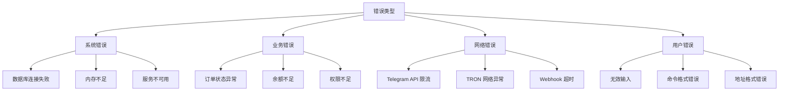

# ⚠️ 错误处理和最佳实践指南

> Telegram Bot 错误处理、故障排除和最佳实践的完整指南

## 📋 目录

- [错误处理概述](#错误处理概述)
- [常见错误类型](#常见错误类型)
- [错误处理策略](#错误处理策略)
- [重试机制](#重试机制)
- [日志记录和监控](#日志记录和监控)
- [故障排除指南](#故障排除指南)
- [性能最佳实践](#性能最佳实践)
- [安全最佳实践](#安全最佳实践)

## 🎯 错误处理概述

### 错误分类体系



### 项目中的错误代码体系

```typescript
// types/errors.ts
export enum ErrorCode {
  // 系统错误 (1000-1999)
  SYSTEM_ERROR = 1000,
  DATABASE_ERROR = 1001,
  REDIS_ERROR = 1002,
  CONFIG_ERROR = 1003,
  
  // API 错误 (2000-2999)
  TELEGRAM_API_ERROR = 2000,
  TRON_API_ERROR = 2001,
  RATE_LIMIT_ERROR = 2002,
  WEBHOOK_ERROR = 2003,
  
  // 业务错误 (3000-3999)
  USER_NOT_FOUND = 3000,
  INSUFFICIENT_BALANCE = 3001,
  INVALID_ORDER_STATUS = 3002,
  PAYMENT_FAILED = 3003,
  DELEGATION_FAILED = 3004,
  
  // 用户输入错误 (4000-4999)
  INVALID_INPUT = 4000,
  INVALID_TRON_ADDRESS = 4001,
  INVALID_AMOUNT = 4002,
  INVALID_COMMAND = 4003,
  
  // 权限错误 (5000-5999)
  UNAUTHORIZED = 5000,
  PERMISSION_DENIED = 5001,
  USER_BANNED = 5002,
}

export interface BotError extends Error {
  code: ErrorCode;
  details?: Record<string, any>;
  userMessage?: string;
  retryable?: boolean;
}

export class BotErrorFactory {
  static create(
    code: ErrorCode,
    message: string,
    details?: Record<string, any>,
    userMessage?: string
  ): BotError {
    const error = new Error(message) as BotError;
    error.code = code;
    error.details = details;
    error.userMessage = userMessage || this.getDefaultUserMessage(code);
    error.retryable = this.isRetryable(code);
    return error;
  }

  private static getDefaultUserMessage(code: ErrorCode): string {
    const messages = {
      [ErrorCode.SYSTEM_ERROR]: '🔧 系统维护中，请稍后重试',
      [ErrorCode.DATABASE_ERROR]: '📊 数据服务暂时不可用',
      [ErrorCode.TELEGRAM_API_ERROR]: '📱 Telegram 服务异常',
      [ErrorCode.TRON_API_ERROR]: '⚡ TRON 网络异常',
      [ErrorCode.RATE_LIMIT_ERROR]: '⏱️ 请求过于频繁，请稍后重试',
      [ErrorCode.USER_NOT_FOUND]: '👤 用户信息不存在',
      [ErrorCode.INSUFFICIENT_BALANCE]: '💰 余额不足',
      [ErrorCode.INVALID_TRON_ADDRESS]: '📍 TRON 地址格式错误',
      [ErrorCode.INVALID_AMOUNT]: '💱 金额格式错误',
      [ErrorCode.PERMISSION_DENIED]: '🔒 权限不足',
      [ErrorCode.USER_BANNED]: '🚫 账户已被限制',
    };
    return messages[code] || '❌ 操作失败，请重试';
  }

  private static isRetryable(code: ErrorCode): boolean {
    const retryableCodes = [
      ErrorCode.SYSTEM_ERROR,
      ErrorCode.DATABASE_ERROR,
      ErrorCode.REDIS_ERROR,
      ErrorCode.TELEGRAM_API_ERROR,
      ErrorCode.TRON_API_ERROR,
      ErrorCode.RATE_LIMIT_ERROR,
      ErrorCode.WEBHOOK_ERROR
    ];
    return retryableCodes.includes(code);
  }
}
```

## 🔍 常见错误类型

### Telegram API 错误

```typescript
// services/error/TelegramErrorHandler.ts
export class TelegramErrorHandler {
  /**
   * 处理 Telegram API 错误
   */
  static async handleTelegramError(error: any, context: {
    method: string;
    chatId?: number;
    userId?: number;
    data?: any;
  }): Promise<void> {
    const errorCode = error.response?.error_code;
    const description = error.response?.description || error.message;

    switch (errorCode) {
      case 400:
        await this.handleBadRequest(error, context);
        break;
      case 401:
        await this.handleUnauthorized(error, context);
        break;
      case 403:
        await this.handleForbidden(error, context);
        break;
      case 429:
        await this.handleRateLimit(error, context);
        break;
      case 500:
      case 502:
      case 503:
        await this.handleServerError(error, context);
        break;
      default:
        await this.handleUnknownError(error, context);
    }

    // 记录错误
    await this.logTelegramError(error, context);
  }

  private static async handleBadRequest(error: any, context: any): Promise<void> {
    const description = error.response?.description || '';
    
    if (description.includes('chat not found')) {
      console.warn(`Chat ${context.chatId} not found - user may have blocked bot`);
      await this.markUserAsInactive(context.userId);
    } else if (description.includes('message is too long')) {
      console.warn('Message too long, attempting to split');
      // 实现消息分割逻辑
    } else if (description.includes('invalid photo url')) {
      console.warn('Invalid photo URL:', context.data?.photo);
    }
    
    throw BotErrorFactory.create(
      ErrorCode.TELEGRAM_API_ERROR,
      `Telegram API bad request: ${description}`,
      { originalError: error, context },
      '❌ 请求格式错误，请重试'
    );
  }

  private static async handleForbidden(error: any, context: any): Promise<void> {
    const description = error.response?.description || '';
    
    if (description.includes('bot was blocked')) {
      console.log(`User ${context.userId} blocked the bot`);
      await this.markUserAsBlocked(context.userId);
    } else if (description.includes('user is deactivated')) {
      console.log(`User ${context.userId} account is deactivated`);
      await this.markUserAsDeactivated(context.userId);
    }
    
    // 不向用户显示错误，静默处理
  }

  private static async handleRateLimit(error: any, context: any): Promise<void> {
    const retryAfter = error.response?.parameters?.retry_after || 60;
    
    console.warn(`Rate limited, retry after ${retryAfter} seconds`);
    
    // 添加到延迟队列
    await this.addToRetryQueue(context, retryAfter * 1000);
    
    throw BotErrorFactory.create(
      ErrorCode.RATE_LIMIT_ERROR,
      `Rate limited, retry after ${retryAfter}s`,
      { retryAfter, context },
      '⏱️ 请求过于频繁，请稍后重试'
    );
  }

  private static async handleServerError(error: any, context: any): Promise<void> {
    console.error('Telegram server error:', error);
    
    // 添加到重试队列
    await this.addToRetryQueue(context, 5000); // 5秒后重试
    
    throw BotErrorFactory.create(
      ErrorCode.TELEGRAM_API_ERROR,
      'Telegram server error',
      { originalError: error, context },
      '📱 Telegram 服务暂时不可用，我们正在重试'
    );
  }

  private static async addToRetryQueue(context: any, delayMs: number): Promise<void> {
    // 使用 Redis 队列或内存队列实现重试逻辑
    console.log(`Adding to retry queue with ${delayMs}ms delay:`, context);
  }

  private static async markUserAsBlocked(userId: number): Promise<void> {
    try {
      await db.user.update({
        where: { telegram_id: userId },
        data: { 
          status: 'blocked',
          blocked_at: new Date()
        }
      });
    } catch (error) {
      console.error('Failed to mark user as blocked:', error);
    }
  }
}
```

### TRON 网络错误

```typescript
// services/error/TronErrorHandler.ts
export class TronErrorHandler {
  /**
   * 处理 TRON 网络错误
   */
  static async handleTronError(error: any, context: {
    operation: string;
    address?: string;
    txHash?: string;
    amount?: number;
  }): Promise<void> {
    const errorMessage = error.message || error.toString();

    if (errorMessage.includes('insufficient bandwidth')) {
      await this.handleInsufficientBandwidth(error, context);
    } else if (errorMessage.includes('insufficient energy')) {
      await this.handleInsufficientEnergy(error, context);
    } else if (errorMessage.includes('account not found')) {
      await this.handleAccountNotFound(error, context);
    } else if (errorMessage.includes('transaction expired')) {
      await this.handleTransactionExpired(error, context);
    } else if (errorMessage.includes('contract validate error')) {
      await this.handleContractError(error, context);
    } else {
      await this.handleUnknownTronError(error, context);
    }
  }

  private static async handleInsufficientBandwidth(error: any, context: any): Promise<void> {
    console.warn('Insufficient bandwidth for transaction:', context);
    
    throw BotErrorFactory.create(
      ErrorCode.TRON_API_ERROR,
      'Insufficient bandwidth for transaction',
      { originalError: error, context },
      '⚡ 带宽不足，请稍后重试或联系客服'
    );
  }

  private static async handleInsufficientEnergy(error: any, context: any): Promise<void> {
    console.warn('Insufficient energy for transaction:', context);
    
    throw BotErrorFactory.create(
      ErrorCode.TRON_API_ERROR,
      'Insufficient energy for transaction',
      { originalError: error, context },
      '🔋 能量不足，正在自动处理，请稍等'
    );
  }

  private static async handleAccountNotFound(error: any, context: any): Promise<void> {
    console.warn('TRON account not found:', context.address);
    
    throw BotErrorFactory.create(
      ErrorCode.TRON_API_ERROR,
      'TRON account not found',
      { originalError: error, context },
      '📍 TRON 地址无效或未激活'
    );
  }

  private static async handleTransactionExpired(error: any, context: any): Promise<void> {
    console.warn('Transaction expired:', context.txHash);
    
    // 可以重试的错误
    throw BotErrorFactory.create(
      ErrorCode.TRON_API_ERROR,
      'Transaction expired',
      { originalError: error, context },
      '⏰ 交易超时，正在重新尝试'
    );
  }
}
```

### 业务逻辑错误

```typescript
// services/error/BusinessErrorHandler.ts
export class BusinessErrorHandler {
  /**
   * 处理业务逻辑错误
   */
  static async handleBusinessError(error: BotError, context: {
    userId?: string;
    orderId?: string;
    operation: string;
  }): Promise<void> {
    switch (error.code) {
      case ErrorCode.INSUFFICIENT_BALANCE:
        await this.handleInsufficientBalance(error, context);
        break;
      case ErrorCode.INVALID_ORDER_STATUS:
        await this.handleInvalidOrderStatus(error, context);
        break;
      case ErrorCode.PAYMENT_FAILED:
        await this.handlePaymentFailed(error, context);
        break;
      case ErrorCode.DELEGATION_FAILED:
        await this.handleDelegationFailed(error, context);
        break;
      default:
        await this.handleGenericBusinessError(error, context);
    }

    // 记录业务错误
    await this.logBusinessError(error, context);
  }

  private static async handleInsufficientBalance(error: BotError, context: any): Promise<void> {
    if (context.userId) {
      // 发送余额不足通知
      await this.sendInsufficientBalanceNotification(context.userId);
    }
  }

  private static async handleInvalidOrderStatus(error: BotError, context: any): Promise<void> {
    if (context.orderId) {
      // 检查订单状态并尝试修复
      await this.attemptOrderStatusRecovery(context.orderId);
    }
  }

  private static async sendInsufficientBalanceNotification(userId: string): Promise<void> {
    try {
      const user = await UserService.getUserById(userId);
      if (!user) return;

      const message = `💰 余额不足提醒

您的账户余额不足以完成此操作。

💳 当前余额:
• USDT: ${user.usdt_balance}
• TRX: ${user.trx_balance}

💡 您可以:`;

      const keyboard = {
        inline_keyboard: [
          [
            { text: '💰 立即充值', callback_data: 'recharge' },
            { text: '💰 查看余额', callback_data: 'check_balance' }
          ],
          [
            { text: '🏠 返回主菜单', callback_data: 'refresh_menu' }
          ]
        ]
      };

      await telegramBotService.sendMessage(user.telegram_id, message, {
        reply_markup: keyboard
      });
    } catch (error) {
      console.error('Failed to send insufficient balance notification:', error);
    }
  }
}
```

## 🔄 重试机制

### 智能重试策略

```typescript
// services/retry/RetryManager.ts
export class RetryManager {
  /**
   * 执行带重试的操作
   */
  static async executeWithRetry<T>(
    operation: () => Promise<T>,
    options: {
      maxRetries?: number;
      baseDelay?: number;
      maxDelay?: number;
      exponentialBackoff?: boolean;
      retryCondition?: (error: any) => boolean;
      onRetry?: (attempt: number, error: any) => void;
    } = {}
  ): Promise<T> {
    const {
      maxRetries = 3,
      baseDelay = 1000,
      maxDelay = 30000,
      exponentialBackoff = true,
      retryCondition = (error) => this.isRetryableError(error),
      onRetry
    } = options;

    let lastError: any;

    for (let attempt = 0; attempt <= maxRetries; attempt++) {
      try {
        return await operation();
      } catch (error) {
        lastError = error;

        // 最后一次尝试，不再重试
        if (attempt === maxRetries) {
          break;
        }

        // 检查是否应该重试
        if (!retryCondition(error)) {
          break;
        }

        // 计算延迟时间
        const delay = exponentialBackoff
          ? Math.min(baseDelay * Math.pow(2, attempt), maxDelay)
          : baseDelay;

        // 添加随机抖动
        const jitteredDelay = delay + Math.random() * 1000;

        console.warn(`Operation failed, retrying in ${jitteredDelay}ms (attempt ${attempt + 1}/${maxRetries}):`, error.message);

        if (onRetry) {
          onRetry(attempt + 1, error);
        }

        await this.delay(jitteredDelay);
      }
    }

    throw lastError;
  }

  /**
   * 判断错误是否可重试
   */
  private static isRetryableError(error: any): boolean {
    // BotError 的重试标记
    if (error.retryable !== undefined) {
      return error.retryable;
    }

    // Telegram API 错误
    if (error.response?.error_code) {
      const retryableCodes = [429, 500, 502, 503, 504];
      return retryableCodes.includes(error.response.error_code);
    }

    // 网络错误
    if (error.code === 'ECONNRESET' || error.code === 'ETIMEDOUT') {
      return true;
    }

    // TRON 网络错误
    if (error.message?.includes('network') || error.message?.includes('timeout')) {
      return true;
    }

    return false;
  }

  private static delay(ms: number): Promise<void> {
    return new Promise(resolve => setTimeout(resolve, ms));
  }
}

// 使用示例
export class TelegramService {
  async sendMessageWithRetry(chatId: number, text: string): Promise<void> {
    await RetryManager.executeWithRetry(
      () => this.bot.sendMessage(chatId, text),
      {
        maxRetries: 3,
        baseDelay: 2000,
        exponentialBackoff: true,
        onRetry: (attempt, error) => {
          console.log(`Retrying sendMessage to ${chatId}, attempt ${attempt}:`, error.message);
        }
      }
    );
  }
}
```

### 队列重试系统

```typescript
// services/retry/RetryQueue.ts
import { Queue, Worker } from 'bullmq';

export class RetryQueue {
  private static retryQueue = new Queue('retry-operations', {
    connection: redis,
    defaultJobOptions: {
      removeOnComplete: 100,
      removeOnFail: 50,
      attempts: 5,
      backoff: {
        type: 'exponential',
        delay: 2000
      }
    }
  });

  private static retryWorker = new Worker('retry-operations', async (job) => {
    const { operation, context } = job.data;
    await this.executeRetryOperation(operation, context);
  }, {
    connection: redis,
    concurrency: 3
  });

  /**
   * 添加操作到重试队列
   */
  static async addToRetryQueue(
    operation: string,
    context: any,
    priority: number = 0,
    delay?: number
  ): Promise<void> {
    await this.retryQueue.add(
      operation,
      { operation, context },
      {
        priority,
        delay,
        removeOnComplete: 10,
        removeOnFail: 10
      }
    );
  }

  /**
   * 执行重试操作
   */
  private static async executeRetryOperation(operation: string, context: any): Promise<void> {
    switch (operation) {
      case 'send_message':
        await this.retrySendMessage(context);
        break;
      case 'process_payment':
        await this.retryProcessPayment(context);
        break;
      case 'energy_delegation':
        await this.retryEnergyDelegation(context);
        break;
      default:
        throw new Error(`Unknown retry operation: ${operation}`);
    }
  }

  private static async retryIpcMessage(context: {
    chatId: number;
    text: string;
    options?: any;
  }): Promise<void> {
    await telegramBotService.sendMessage(context.chatId, context.text, context.options);
  }

  private static async retryProcessPayment(context: {
    orderId: string;
    txHash: string;
  }): Promise<void> {
    await PaymentService.confirmPayment(context.orderId, context.txHash);
  }

  private static async retryEnergyDelegation(context: {
    orderId: string;
    recipientAddress: string;
    amount: number;
  }): Promise<void> {
    await EnergyDelegationService.delegateEnergy(
      context.recipientAddress,
      context.amount,
      context.orderId
    );
  }
}
```

## 📊 日志记录和监控

### 结构化日志系统

```typescript
// services/logging/Logger.ts
import winston from 'winston';

export enum LogLevel {
  ERROR = 'error',
  WARN = 'warn',
  INFO = 'info',
  DEBUG = 'debug'
}

export interface LogContext {
  userId?: string;
  chatId?: number;
  orderId?: string;
  operation?: string;
  duration?: number;
  [key: string]: any;
}

export class Logger {
  private static instance: winston.Logger;

  static getInstance(): winston.Logger {
    if (!this.instance) {
      this.instance = winston.createLogger({
        level: process.env.LOG_LEVEL || 'info',
        format: winston.format.combine(
          winston.format.timestamp(),
          winston.format.errors({ stack: true }),
          winston.format.json()
        ),
        transports: [
          new winston.transports.File({
            filename: 'logs/error.log',
            level: 'error',
            maxsize: 5242880, // 5MB
            maxFiles: 5
          }),
          new winston.transports.File({
            filename: 'logs/combined.log',
            maxsize: 5242880,
            maxFiles: 5
          }),
          new winston.transports.Console({
            format: winston.format.combine(
              winston.format.colorize(),
              winston.format.simple()
            )
          })
        ]
      });
    }
    return this.instance;
  }

  static error(message: string, context?: LogContext, error?: Error): void {
    this.getInstance().error(message, {
      context,
      error: error ? {
        message: error.message,
        stack: error.stack,
        name: error.name
      } : undefined
    });
  }

  static warn(message: string, context?: LogContext): void {
    this.getInstance().warn(message, { context });
  }

  static info(message: string, context?: LogContext): void {
    this.getInstance().info(message, { context });
  }

  static debug(message: string, context?: LogContext): void {
    this.getInstance().debug(message, { context });
  }

  /**
   * 记录 API 调用
   */
  static logApiCall(
    method: string,
    endpoint: string,
    duration: number,
    status: 'success' | 'error',
    context?: LogContext
  ): void {
    this.info(`API Call: ${method} ${endpoint}`, {
      ...context,
      duration,
      status,
      type: 'api_call'
    });
  }

  /**
   * 记录用户操作
   */
  static logUserAction(
    action: string,
    userId: string,
    chatId: number,
    success: boolean,
    context?: LogContext
  ): void {
    this.info(`User Action: ${action}`, {
      ...context,
      userId,
      chatId,
      success,
      type: 'user_action'
    });
  }

  /**
   * 记录业务事件
   */
  static logBusinessEvent(
    event: string,
    context: LogContext
  ): void {
    this.info(`Business Event: ${event}`, {
      ...context,
      type: 'business_event'
    });
  }
}
```

### 性能监控

```typescript
// services/monitoring/PerformanceMonitor.ts
export class PerformanceMonitor {
  private static metrics = new Map<string, {
    totalCalls: number;
    totalDuration: number;
    errors: number;
    lastCall: Date;
  }>();

  /**
   * 监控函数执行性能
   */
  static monitor<T>(name: string) {
    return function (target: any, propertyKey: string, descriptor: PropertyDescriptor) {
      const originalMethod = descriptor.value;

      descriptor.value = async function (...args: any[]): Promise<T> {
        const startTime = Date.now();
        const callId = `${name}_${Date.now()}_${Math.random()}`;

        try {
          const result = await originalMethod.apply(this, args);
          const duration = Date.now() - startTime;
          
          PerformanceMonitor.recordSuccess(name, duration);
          Logger.debug(`Performance: ${name} completed in ${duration}ms`, {
            operation: name,
            duration,
            callId
          });

          return result;
        } catch (error) {
          const duration = Date.now() - startTime;
          PerformanceMonitor.recordError(name, duration);
          
          Logger.error(`Performance: ${name} failed after ${duration}ms`, {
            operation: name,
            duration,
            callId
          }, error);

          throw error;
        }
      };

      return descriptor;
    };
  }

  private static recordSuccess(operation: string, duration: number): void {
    const metric = this.metrics.get(operation) || {
      totalCalls: 0,
      totalDuration: 0,
      errors: 0,
      lastCall: new Date()
    };

    metric.totalCalls++;
    metric.totalDuration += duration;
    metric.lastCall = new Date();

    this.metrics.set(operation, metric);
  }

  private static recordError(operation: string, duration: number): void {
    const metric = this.metrics.get(operation) || {
      totalCalls: 0,
      totalDuration: 0,
      errors: 0,
      lastCall: new Date()
    };

    metric.totalCalls++;
    metric.totalDuration += duration;
    metric.errors++;
    metric.lastCall = new Date();

    this.metrics.set(operation, metric);
  }

  /**
   * 获取性能统计
   */
  static getMetrics(): Record<string, {
    averageDuration: number;
    totalCalls: number;
    errorRate: number;
    lastCall: Date;
  }> {
    const result: any = {};

    for (const [operation, metric] of this.metrics.entries()) {
      result[operation] = {
        averageDuration: metric.totalCalls > 0 ? metric.totalDuration / metric.totalCalls : 0,
        totalCalls: metric.totalCalls,
        errorRate: metric.totalCalls > 0 ? (metric.errors / metric.totalCalls) * 100 : 0,
        lastCall: metric.lastCall
      };
    }

    return result;
  }

  /**
   * 重置统计数据
   */
  static resetMetrics(): void {
    this.metrics.clear();
  }
}

// 使用示例
export class PaymentService {
  @PerformanceMonitor.monitor('payment_confirmation')
  static async confirmPayment(orderId: string, txHash: string): Promise<boolean> {
    // 支付确认逻辑
    return true;
  }
}
```

## 🔧 故障排除指南

### 常见问题诊断

```typescript
// services/diagnostics/DiagnosticsService.ts
export class DiagnosticsService {
  /**
   * 系统健康检查
   */
  static async performHealthCheck(): Promise<{
    overall: 'healthy' | 'warning' | 'critical';
    services: Record<string, {
      status: 'up' | 'down' | 'degraded';
      responseTime?: number;
      lastCheck: Date;
      error?: string;
    }>;
  }> {
    const services: Record<string, any> = {};
    let criticalIssues = 0;
    let warnings = 0;

    // 检查数据库连接
    try {
      const start = Date.now();
      await db.$queryRaw`SELECT 1`;
      services.database = {
        status: 'up',
        responseTime: Date.now() - start,
        lastCheck: new Date()
      };
    } catch (error) {
      services.database = {
        status: 'down',
        lastCheck: new Date(),
        error: error.message
      };
      criticalIssues++;
    }

    // 检查 Redis 连接
    try {
      const start = Date.now();
      await redis.ping();
      services.redis = {
        status: 'up',
        responseTime: Date.now() - start,
        lastCheck: new Date()
      };
    } catch (error) {
      services.redis = {
        status: 'down',
        lastCheck: new Date(),
        error: error.message
      };
      warnings++;
    }

    // 检查 Telegram API
    try {
      const start = Date.now();
      await telegramBotService.getBotInfo();
      services.telegram = {
        status: 'up',
        responseTime: Date.now() - start,
        lastCheck: new Date()
      };
    } catch (error) {
      services.telegram = {
        status: 'down',
        lastCheck: new Date(),
        error: error.message
      };
      criticalIssues++;
    }

    // 检查 TRON 网络
    try {
      const start = Date.now();
      await TronService.getInstance().trx.getNodeInfo();
      services.tron = {
        status: 'up',
        responseTime: Date.now() - start,
        lastCheck: new Date()
      };
    } catch (error) {
      services.tron = {
        status: 'down',
        lastCheck: new Date(),
        error: error.message
      };
      warnings++;
    }

    // 确定整体状态
    let overall: 'healthy' | 'warning' | 'critical';
    if (criticalIssues > 0) {
      overall = 'critical';
    } else if (warnings > 0) {
      overall = 'warning';
    } else {
      overall = 'healthy';
    }

    return { overall, services };
  }

  /**
   * 诊断用户问题
   */
  static async diagnoseUserIssue(userId: string): Promise<{
    userStatus: string;
    recentErrors: any[];
    suggestions: string[];
  }> {
    try {
      const user = await UserService.getUserById(userId);
      if (!user) {
        return {
          userStatus: 'not_found',
          recentErrors: [],
          suggestions: ['用户不存在，请使用 /start 重新注册']
        };
      }

      // 获取最近的错误日志
      const recentErrors = await this.getUserRecentErrors(userId);
      
      // 生成建议
      const suggestions = this.generateUserSuggestions(user, recentErrors);

      return {
        userStatus: user.status,
        recentErrors,
        suggestions
      };
    } catch (error) {
      console.error('User diagnosis failed:', error);
      return {
        userStatus: 'unknown',
        recentErrors: [],
        suggestions: ['诊断失败，请联系技术支持']
      };
    }
  }

  private static async getUserRecentErrors(userId: string): Promise<any[]> {
    // 从日志系统获取用户最近的错误
    return [];
  }

  private static generateUserSuggestions(user: any, errors: any[]): string[] {
    const suggestions: string[] = [];

    if (user.status === 'inactive') {
      suggestions.push('请完成账户设置，设置您的TRON地址');
    }

    if (user.status === 'banned') {
      suggestions.push('您的账户已被限制，请联系客服');
    }

    if (!user.tron_address) {
      suggestions.push('请设置您的TRON地址以使用能量租赁服务');
    }

    if (user.usdt_balance === 0 && user.trx_balance === 0) {
      suggestions.push('请充值以购买能量套餐');
    }

    // 基于错误生成建议
    for (const error of errors) {
      if (error.code === ErrorCode.INVALID_TRON_ADDRESS) {
        suggestions.push('请检查您的TRON地址格式是否正确');
      }
    }

    return suggestions;
  }
}
```

### 自动恢复机制

```typescript
// services/recovery/AutoRecoveryService.ts
export class AutoRecoveryService {
  private static recoveryAttempts = new Map<string, number>();
  private static readonly MAX_RECOVERY_ATTEMPTS = 3;

  /**
   * 自动恢复系统错误
   */
  static async attemptRecovery(error: BotError, context: any): Promise<boolean> {
    const recoveryKey = this.generateRecoveryKey(error, context);
    const attempts = this.recoveryAttempts.get(recoveryKey) || 0;

    if (attempts >= this.MAX_RECOVERY_ATTEMPTS) {
      console.error(`Max recovery attempts reached for ${recoveryKey}`);
      return false;
    }

    this.recoveryAttempts.set(recoveryKey, attempts + 1);

    try {
      switch (error.code) {
        case ErrorCode.DATABASE_ERROR:
          return await this.recoverDatabaseConnection();
        case ErrorCode.REDIS_ERROR:
          return await this.recoverRedisConnection();
        case ErrorCode.TELEGRAM_API_ERROR:
          return await this.recoverTelegramConnection();
        case ErrorCode.TRON_API_ERROR:
          return await this.recoverTronConnection();
        default:
          return false;
      }
    } catch (recoveryError) {
      console.error('Recovery attempt failed:', recoveryError);
      return false;
    }
  }

  private static generateRecoveryKey(error: BotError, context: any): string {
    return `${error.code}_${context.operation || 'unknown'}_${Date.now()}`;
  }

  private static async recoverDatabaseConnection(): Promise<boolean> {
    try {
      await db.$disconnect();
      await new Promise(resolve => setTimeout(resolve, 2000));
      await db.$connect();
      
      // 测试连接
      await db.$queryRaw`SELECT 1`;
      
      console.log('✅ Database connection recovered');
      return true;
    } catch (error) {
      console.error('❌ Database recovery failed:', error);
      return false;
    }
  }

  private static async recoverRedisConnection(): Promise<boolean> {
    try {
      redis.disconnect();
      await new Promise(resolve => setTimeout(resolve, 2000));
      await redis.connect();
      
      // 测试连接
      await redis.ping();
      
      console.log('✅ Redis connection recovered');
      return true;
    } catch (error) {
      console.error('❌ Redis recovery failed:', error);
      return false;
    }
  }

  private static async recoverTelegramConnection(): Promise<boolean> {
    try {
      // 重新初始化 TelegramBotService
      await telegramBotService.reinitialize();
      
      // 测试连接
      await telegramBotService.getBotInfo();
      
      console.log('✅ Telegram connection recovered');
      return true;
    } catch (error) {
      console.error('❌ Telegram recovery failed:', error);
      return false;
    }
  }

  private static async recoverTronConnection(): Promise<boolean> {
    try {
      // 重新初始化 TronService
      await TronService.initialize();
      
      // 测试连接
      await TronService.getInstance().trx.getNodeInfo();
      
      console.log('✅ TRON connection recovered');
      return true;
    } catch (error) {
      console.error('❌ TRON recovery failed:', error);
      return false;
    }
  }

  /**
   * 清理恢复计数器
   */
  static clearRecoveryAttempts(): void {
    this.recoveryAttempts.clear();
  }
}
```

## 🚀 性能最佳实践

### 缓存策略

```typescript
// services/cache/CacheManager.ts
export class CacheManager {
  private static cache = new Map<string, {
    data: any;
    expiry: number;
    accessCount: number;
    lastAccess: number;
  }>();

  /**
   * 设置缓存
   */
  static set(key: string, data: any, ttlSeconds: number = 300): void {
    this.cache.set(key, {
      data,
      expiry: Date.now() + ttlSeconds * 1000,
      accessCount: 0,
      lastAccess: Date.now()
    });
  }

  /**
   * 获取缓存
   */
  static get(key: string): any | null {
    const item = this.cache.get(key);
    if (!item) return null;

    if (Date.now() > item.expiry) {
      this.cache.delete(key);
      return null;
    }

    item.accessCount++;
    item.lastAccess = Date.now();
    return item.data;
  }

  /**
   * 智能缓存（带回调）
   */
  static async getOrSet<T>(
    key: string,
    fetcher: () => Promise<T>,
    ttlSeconds: number = 300
  ): Promise<T> {
    const cached = this.get(key);
    if (cached !== null) {
      return cached;
    }

    const data = await fetcher();
    this.set(key, data, ttlSeconds);
    return data;
  }

  /**
   * 清理过期缓存
   */
  static cleanup(): void {
    const now = Date.now();
    for (const [key, item] of this.cache.entries()) {
      if (now > item.expiry) {
        this.cache.delete(key);
      }
    }
  }

  /**
   * 获取缓存统计
   */
  static getStats(): {
    totalItems: number;
    hitRate: number;
    memoryUsage: number;
  } {
    let totalAccesses = 0;
    let totalHits = 0;

    for (const item of this.cache.values()) {
      totalAccesses += item.accessCount;
      if (item.accessCount > 0) totalHits++;
    }

    return {
      totalItems: this.cache.size,
      hitRate: totalAccesses > 0 ? (totalHits / totalAccesses) * 100 : 0,
      memoryUsage: process.memoryUsage().heapUsed
    };
  }
}

// 定期清理缓存
setInterval(() => {
  CacheManager.cleanup();
}, 5 * 60 * 1000); // 每5分钟清理一次
```

### 数据库优化

```typescript
// services/database/DatabaseOptimizer.ts
export class DatabaseOptimizer {
  /**
   * 批量操作优化
   */
  static async batchInsert<T>(
    model: any,
    records: T[],
    batchSize: number = 100
  ): Promise<void> {
    for (let i = 0; i < records.length; i += batchSize) {
      const batch = records.slice(i, i + batchSize);
      await model.createMany({
        data: batch,
        skipDuplicates: true
      });
    }
  }

  /**
   * 分页查询优化
   */
  static async paginatedQuery<T>(
    model: any,
    where: any,
    page: number = 1,
    pageSize: number = 20,
    orderBy?: any
  ): Promise<{
    data: T[];
    pagination: {
      page: number;
      pageSize: number;
      total: number;
      totalPages: number;
    };
  }> {
    const skip = (page - 1) * pageSize;
    
    const [data, total] = await Promise.all([
      model.findMany({
        where,
        skip,
        take: pageSize,
        orderBy
      }),
      model.count({ where })
    ]);

    return {
      data,
      pagination: {
        page,
        pageSize,
        total,
        totalPages: Math.ceil(total / pageSize)
      }
    };
  }

  /**
   * 连接池监控
   */
  static async monitorConnections(): Promise<{
    active: number;
    idle: number;
    total: number;
  }> {
    // Prisma 连接监控
    const result = await db.$queryRaw<Array<{
      state: string;
      count: number;
    }>>`
      SELECT state, COUNT(*) as count 
      FROM pg_stat_activity 
      WHERE datname = current_database()
      GROUP BY state
    `;

    let active = 0;
    let idle = 0;

    for (const row of result) {
      if (row.state === 'active') {
        active = Number(row.count);
      } else if (row.state === 'idle') {
        idle = Number(row.count);
      }
    }

    return {
      active,
      idle,
      total: active + idle
    };
  }
}
```

## 🔒 安全最佳实践

### 输入验证和清理

```typescript
// services/security/InputValidator.ts
export class InputValidator {
  /**
   * 验证 TRON 地址
   */
  static validateTronAddress(address: string): boolean {
    const tronAddressRegex = /^T[A-Za-z1-9]{33}$/;
    return tronAddressRegex.test(address);
  }

  /**
   * 验证金额
   */
  static validateAmount(amount: any): { valid: boolean; value?: number; error?: string } {
    if (typeof amount === 'string') {
      amount = parseFloat(amount);
    }

    if (isNaN(amount)) {
      return { valid: false, error: 'Invalid number format' };
    }

    if (amount <= 0) {
      return { valid: false, error: 'Amount must be positive' };
    }

    if (amount > 1000000) {
      return { valid: false, error: 'Amount too large' };
    }

    return { valid: true, value: amount };
  }

  /**
   * 清理用户输入
   */
  static sanitizeInput(input: string): string {
    return input
      .trim()
      .replace(/[<>'"&]/g, '') // 移除潜在的 XSS 字符
      .substring(0, 1000); // 限制长度
  }

  /**
   * 验证命令格式
   */
  static validateCommand(command: string): boolean {
    const commandRegex = /^\/[a-zA-Z][a-zA-Z0-9_]*$/;
    return commandRegex.test(command);
  }

  /**
   * 验证回调数据
   */
  static validateCallbackData(data: string): boolean {
    if (!data || data.length > 64) return false;
    const validChars = /^[a-zA-Z0-9_:-]+$/;
    return validChars.test(data);
  }
}
```

### 访问控制

```typescript
// services/security/AccessControl.ts
export class AccessControl {
  private static attempts = new Map<string, {
    count: number;
    lastAttempt: number;
    blocked: boolean;
  }>();

  /**
   * 检查用户是否被限制
   */
  static isUserBlocked(userId: number): boolean {
    const key = `user_${userId}`;
    const record = this.attempts.get(key);
    
    if (!record || !record.blocked) return false;
    
    // 检查封禁是否过期（1小时）
    if (Date.now() - record.lastAttempt > 60 * 60 * 1000) {
      this.attempts.delete(key);
      return false;
    }
    
    return true;
  }

  /**
   * 记录失败尝试
   */
  static recordFailedAttempt(userId: number): void {
    const key = `user_${userId}`;
    const record = this.attempts.get(key) || { count: 0, lastAttempt: 0, blocked: false };
    
    record.count++;
    record.lastAttempt = Date.now();
    
    // 5次失败后封禁1小时
    if (record.count >= 5) {
      record.blocked = true;
      Logger.warn('User blocked due to too many failed attempts', { userId });
    }
    
    this.attempts.set(key, record);
  }

  /**
   * 重置用户尝试记录
   */
  static resetUserAttempts(userId: number): void {
    const key = `user_${userId}`;
    this.attempts.delete(key);
  }

  /**
   * 检查 IP 限制
   */
  static checkIPRateLimit(ip: string): boolean {
    // 实现 IP 级别的限流
    return true;
  }
}
```

## 💡 总结和建议

### 错误处理清单

- [ ] ✅ **分类错误类型** - 系统、业务、网络、用户错误
- [ ] ✅ **实现重试机制** - 指数退避、抖动、条件重试
- [ ] ✅ **结构化日志** - 统一格式、上下文信息、性能监控
- [ ] ✅ **用户友好提示** - 清晰的错误消息、恢复建议
- [ ] ✅ **自动恢复** - 连接重建、状态修复、队列处理
- [ ] ✅ **监控告警** - 健康检查、异常检测、实时通知
- [ ] ✅ **性能优化** - 缓存策略、数据库优化、连接复用
- [ ] ✅ **安全防护** - 输入验证、访问控制、限流保护

### 最佳实践建议

1. **预防胜于治疗** - 在设计阶段考虑可能的错误场景
2. **快速失败** - 尽早发现和报告错误
3. **优雅降级** - 核心功能故障时提供基础服务
4. **用户体验优先** - 提供清晰、有用的错误信息
5. **持续监控** - 实时跟踪系统健康状态
6. **定期测试** - 故障演练、压力测试、恢复验证

## 🔗 相关文档

- [Telegram Bot API 概览](./README.md) - 完整文档导航
- [User Management API](./06-user-management-api.md) - 用户管理和权限
- [Payment Integration API](./07-payment-integration-api.md) - 支付错误处理
- [Project Examples](./12-project-examples.md) - 实际使用示例

---

> 💡 **关键提醒**
> 错误处理是系统稳定性的基石。良好的错误处理不仅能提升用户体验，还能帮助开发团队快速定位和解决问题。建议在开发过程中始终遵循"防御性编程"的原则，为每个可能出错的地方准备相应的处理机制。

