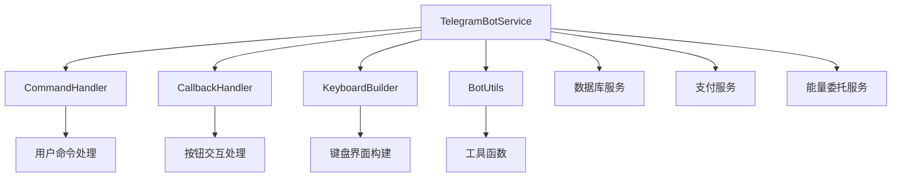

# 📱 TRON 能量租赁 Telegram Bot API 详细文档

> 基于 Telegram Bot API 官方文档和项目实际需求整理的完整 API 指南

## 📋 文档目录

### 🏗️ 核心架构
- [项目架构概览](#项目架构概览)
- [API 基础配置](#api-基础配置)
- [认证和安全](#认证和安全)

### 📨 消息处理
- [1. 消息发送 API](./01-messaging-api.md) - 发送各类消息的完整接口
- [2. 命令处理 API](./02-commands-api.md) - 机器人命令系统接口
- [3. 回调查询 API](./03-callbacks-api.md) - 按钮点击和交互处理

### 🎮 用户交互
- [4. 键盘和按钮 API](./04-keyboards-api.md) - 内联键盘和自定义键盘
- [5. Webhook 管理 API](./05-webhooks-api.md) - Webhook 配置和管理
- [6. 用户管理 API](./06-user-management-api.md) - 用户注册和数据管理

### 💰 业务功能
- [7. 支付集成 API](./07-payment-integration-api.md) - 支付流程和监控
- [8. 能量委托 API](./08-energy-delegation-api.md) - TRON 能量委托功能
- [9. 订单管理 API](./09-order-management-api.md) - 订单创建和状态管理

### 🛠️ 工具和最佳实践
- [10. 错误处理和调试](./10-error-handling.md) - 错误处理策略和调试技巧
- [11. 配置管理和部署](./11-configuration-deployment.md) - 配置管理、Docker 部署、CI/CD 自动化
- [12. 项目具体示例](./12-project-examples.md) - 实际业务场景示例代码

## 🎯 项目架构概览

### 核心组件



### 主要功能模块

| 模块 | 功能 | 相关 API |
|------|------|----------|
| **命令处理** | `/start`, `/menu`, `/help`, `/balance`, `/orders` | [Commands API](./02-commands-api.md) |
| **回调处理** | 按钮点击、套餐选择、订单确认 | [Callbacks API](./03-callbacks-api.md) |
| **键盘构建** | 主菜单、套餐选择、订单确认 | [Keyboards API](./04-keyboards-api.md) |
| **消息发送** | 文本、图片、文档发送 | [Messaging API](./01-messaging-api.md) |
| **用户管理** | 注册、余额查询、权限控制 | [User Management API](./06-user-management-api.md) |
| **支付集成** | 支付监控、订单确认 | [Payment Integration API](./07-payment-integration-api.md) |

## 🔧 API 基础配置

### 环境变量配置

```bash
# Telegram Bot 配置
TELEGRAM_BOT_TOKEN=your_bot_token_here

# Webhook 配置（可选）
TELEGRAM_WEBHOOK_URL=https://yourdomain.com/api/telegram/webhook
TELEGRAM_WEBHOOK_PORT=3001

# TRON 网络配置
TRON_PAYMENT_ADDRESS=TYour_Payment_Address_Here
TRON_PRIVATE_KEY=your_private_key_here
```

### 基础初始化

```typescript
import { TelegramBotService } from './services/telegram-bot/TelegramBotService';

// 创建机器人实例
const botService = new TelegramBotService({
  token: process.env.TELEGRAM_BOT_TOKEN,
  polling: true  // 或者使用 webhook
});

// 启动机器人
await botService.start();
```

## 🔐 认证和安全

### Bot Token 安全

```typescript
// ✅ 正确的 Token 管理
const token = process.env.TELEGRAM_BOT_TOKEN;
if (!token) {
  throw new Error('TELEGRAM_BOT_TOKEN is required');
}

// ❌ 错误的做法 - 不要硬编码 Token
const badToken = "123456:ABC-DEF1234ghIkl-zyx57W2v1u123ew11";
```

### 用户权限验证

```typescript
// 用户权限检查示例
async function checkUserPermission(userId: number, operation: string): Promise<boolean> {
  const user = await UserService.getUserByTelegramId(userId);
  if (!user) return false;
  
  // 根据业务逻辑检查权限
  return user.status === 'active' && user.permissions.includes(operation);
}
```

## 📊 使用的 Telegram Bot API 方法

### 核心 API 方法

| API 方法 | 用途 | 文档链接 |
|----------|------|----------|
| `getMe` | 获取机器人信息 | [Official Docs](https://core.telegram.org/bots/api#getme) |
| `sendMessage` | 发送文本消息 | [Messaging API](./01-messaging-api.md#sendMessage) |
| `sendPhoto` | 发送图片 | [Messaging API](./01-messaging-api.md#sendPhoto) |
| `sendDocument` | 发送文档 | [Messaging API](./01-messaging-api.md#sendDocument) |
| `editMessageText` | 编辑消息文本 | [Messaging API](./01-messaging-api.md#editMessageText) |
| `deleteMessage` | 删除消息 | [Messaging API](./01-messaging-api.md#deleteMessage) |
| `answerCallbackQuery` | 回答回调查询 | [Callbacks API](./03-callbacks-api.md#answerCallbackQuery) |
| `setMyCommands` | 设置机器人命令菜单 | [Commands API](./02-commands-api.md#setMyCommands) |
| `setWebHook` | 设置 Webhook | [Webhooks API](./05-webhooks-api.md#setWebHook) |
| `getWebHookInfo` | 获取 Webhook 信息 | [Webhooks API](./05-webhooks-api.md#getWebHookInfo) |

### 消息类型支持

- ✅ **文本消息** - 支持 Markdown 和 HTML 格式
- ✅ **内联键盘** - 按钮交互和菜单
- ✅ **图片消息** - 二维码、截图等
- ✅ **文档消息** - PDF、Excel 等文件
- ✅ **回调查询** - 按钮点击处理
- 🔄 **语音消息** - 计划支持
- 🔄 **位置消息** - 计划支持

## 🚀 快速开始

### 1. 基础消息发送

```typescript
// 发送欢迎消息
await botService.sendMessage(chatId, '🎉 欢迎使用TRON能量租赁机器人！');

// 发送带格式的消息
await botService.sendMessage(chatId, '*账户余额*: `1000 TRX`', {
  parse_mode: 'Markdown'
});
```

### 2. 创建内联键盘

```typescript
const keyboard = {
  inline_keyboard: [
    [
      { text: '🔋 购买能量', callback_data: 'buy_energy' },
      { text: '📋 我的订单', callback_data: 'my_orders' }
    ],
    [
      { text: '💰 账户余额', callback_data: 'check_balance' }
    ]
  ]
};

await botService.sendMessage(chatId, '请选择服务：', {
  reply_markup: keyboard
});
```

### 3. 处理回调查询

```typescript
bot.on('callback_query', async (callbackQuery) => {
  const data = callbackQuery.data;
  const chatId = callbackQuery.message?.chat.id;
  
  if (data === 'buy_energy') {
    await showEnergyPackages(chatId);
  }
  
  await bot.answerCallbackQuery(callbackQuery.id);
});
```

## 📈 性能指标

### API 调用限制

| 限制类型 | 限制值 | 说明 |
|----------|--------|------|
| **消息发送** | 30 消息/秒 | 同一聊天的限制 |
| **全局限制** | 500,000 消息/月 | 所有聊天总计 |
| **文件上传** | 50MB | 单个文件大小限制 |
| **回调查询** | 无限制 | 但需要在30秒内回答 |

### 优化建议

1. **批量处理** - 合并多个操作减少 API 调用
2. **错误重试** - 实现指数退避重试机制
3. **缓存机制** - 缓存用户状态和常用数据
4. **异步处理** - 使用队列处理耗时操作

## 🆘 故障排除

### 常见问题

1. **Token 无效**
   ```bash
   Error: 401 Unauthorized
   解决方案: 检查 TELEGRAM_BOT_TOKEN 环境变量
   ```

2. **消息发送失败**
   ```bash
   Error: 403 Forbidden
   解决方案: 确保用户已启动机器人对话
   ```

3. **Webhook 配置失败**
   ```bash
   Error: Bad Request: HTTPS URL must be provided
   解决方案: 确保 Webhook URL 使用 HTTPS
   ```

### 调试技巧

```typescript
// 启用详细日志
process.env.NODE_ENV = 'development';

// 错误处理
bot.on('polling_error', (error) => {
  console.error('Polling error:', error);
});

bot.on('error', (error) => {
  console.error('Bot error:', error);
});
```

## 📚 参考资料

### 官方文档
- [Telegram Bot API](https://core.telegram.org/bots/api) - 官方 API 文档
- [Bot Features](https://core.telegram.org/bots/features) - 机器人功能介绍
- [Bot Tutorial](https://core.telegram.org/bots/tutorial) - 官方教程

### 开发工具
- [BotFather](https://t.me/BotFather) - 机器人创建和管理
- [Bot API Updates](https://t.me/botnews) - API 更新通知
- [Developer Chat](https://t.me/bottalk) - 开发者讨论群

### 项目相关
- [Node.js Telegram Bot API](https://github.com/yagop/node-telegram-bot-api) - 项目使用的库
- [TRON Developer Hub](https://developers.tron.network/) - TRON 开发文档

---

> 💡 **提示**: 本文档会随着项目功能的增加和 Telegram Bot API 的更新而持续更新。建议收藏并定期查看。

> 🔔 **更新通知**: 关注 [@BotNews](https://t.me/botnews) 获取 Telegram Bot API 的最新更新。
