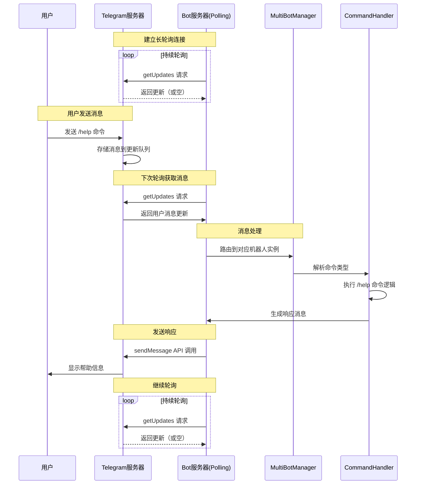
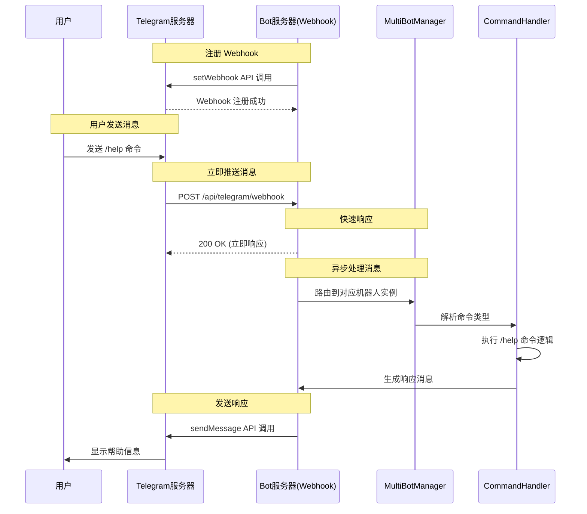
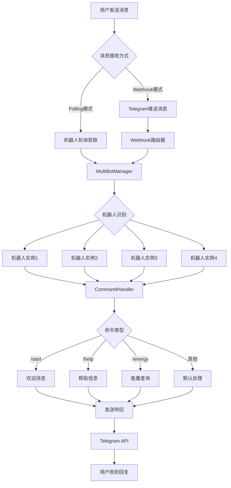

# Telegram Bot 模式对比：Polling vs Webhook

## 📖 概述

Telegram Bot 支持两种接收消息的模式：**Polling（轮询）** 和 **Webhook（回调）**。本文详细介绍两种模式的区别、优缺点以及用户交互的完整处理流程。

---

## 🔄 Polling 模式（轮询模式）

### 原理
Polling 模式下，机器人**主动向 Telegram 服务器发起请求**，询问是否有新消息。

### 特点
- **主动拉取**：机器人定期向 Telegram 发送 `getUpdates` 请求
- **简单部署**：无需公网 IP 和 HTTPS 证书
- **开发友好**：本地开发时很方便
- **资源消耗**：持续轮询会消耗网络和服务器资源

### 工作原理
```
Bot Server  <----[getUpdates]---->  Telegram API
     |                                     |
     |  1. 发起请求                        |
     |------------------------------------>|
     |                                     |
     |  2. 返回消息（如果有）              |
     |<------------------------------------|
     |                                     |
     |  3. 等待间隔后再次请求              |
     |------------------------------------>|
```

---

## 🔗 Webhook 模式（回调模式）

### 原理
Webhook 模式下，**Telegram 服务器主动推送消息**到机器人的指定 URL。

### 特点
- **被动接收**：Telegram 主动推送消息到指定的 HTTPS 端点
- **实时响应**：消息到达更及时，无轮询延迟
- **资源高效**：只在有消息时才处理，无无效请求
- **部署要求**：需要公网 IP 和有效的 HTTPS 证书

### 工作原理
```
Bot Server  <----[HTTP POST]----  Telegram API
     |                                   |
     |  1. 用户发送消息给机器人           |
     |                                   |<-- 用户消息
     |                                   |
     |  2. Telegram 立即推送到 Webhook   |
     |<----------------------------------|
     |                                   |
     |  3. 机器人处理并返回 200 OK       |
     |---------------------------------->|
```

---

## 🆚 详细对比

| 特性 | Polling 模式 | Webhook 模式 |
|------|-------------|-------------|
| **消息获取方式** | 主动轮询 | 被动接收 |
| **实时性** | 轮询间隔延迟 | 实时推送 |
| **网络要求** | 出站网络即可 | 需要公网 IP + HTTPS |
| **开发难度** | 简单 | 中等（需配置域名证书） |
| **服务器资源** | 持续占用 | 按需使用 |
| **并发处理** | 串行处理 | 天然并发 |
| **扩展性** | 有限 | 优秀 |
| **本地开发** | ✅ 完美支持 | ❌ 需要内网穿透 |
| **生产环境** | ⚠️ 资源浪费 | ✅ 推荐使用 |

---

## 🎯 用户交互完整流程

### Polling 模式流程图



### Webhook 模式流程图



---

## 🏗️ 多机器人架构中的处理流程

### 当前项目架构处理流程



---

## 🚀 实际代码实现分析

### Polling 模式实现

```typescript
// TelegramBotService.ts - Polling 模式
if (workMode === 'polling') {
  this.config.polling = true;
  this.config.webhook = false;
  
  // 创建轮询机器人
  this.bot = new TelegramBot(this.config.token, {
    polling: {
      interval: 1000,  // 1秒轮询一次
      autoStart: true,
      params: {
        timeout: 10
      }
    }
  });
  
  // 直接注册消息处理器
  this.setupMessageHandlers();
}
```

### Webhook 模式实现

```typescript
// TelegramBotService.ts - Webhook 模式
if (workMode === 'webhook') {
  this.config.polling = false;
  this.config.webhook = true;
  
  // 创建无轮询机器人
  this.bot = new TelegramBot(this.config.token, {
    polling: false
  });
  
  // 设置 Webhook URL
  const webhookUrl = `${process.env.WEBHOOK_DOMAIN}/api/telegram/webhook/${this.botId}`;
  await this.bot.setWebHook(webhookUrl);
  
  // 注册处理器但不启动轮询
  this.setupMessageHandlers();
}
```

### Webhook 消息路由处理

```typescript
// telegram.ts - Webhook 路由处理
router.post('/webhook/:botId?', async (req, res) => {
  try {
    const botId = req.params.botId;
    const update = req.body;
    
    // 快速响应 Telegram（重要！）
    res.status(200).json({ ok: true });
    
    // 异步处理消息
    setImmediate(async () => {
      if (botId) {
        // 特定机器人处理
        const botInstance = await multiBotManager.getBotInstance(botId);
        if (botInstance) {
          await botInstance.service.processWebhookUpdate(update);
        }
      } else {
        // 自动路由到第一个可用机器人
        await multiBotManager.routeWebhookUpdate(update);
      }
    });
    
  } catch (error) {
    console.error('Webhook处理失败:', error);
    res.status(500).json({ error: 'Internal server error' });
  }
});
```

---

## 🎯 性能对比分析

### Polling 模式性能特征

```
消息延迟 = 轮询间隔 / 2 (平均)
网络请求 = 86400 / 轮询间隔 (每天)
空请求率 = (总请求数 - 有消息请求数) / 总请求数

示例：1秒轮询间隔
- 平均延迟：500ms
- 每天请求：86,400 次
- 如果每小时只有10条消息：空请求率 > 97%
```

### Webhook 模式性能特征

```
消息延迟 ≈ 网络传输时间 (通常 < 100ms)
网络请求 = 实际消息数量
空请求率 = 0%
并发能力 = 服务器处理能力

示例：相同消息量
- 平均延迟：< 100ms
- 每天请求：240 次（每小时10条 × 24小时）
- 空请求率：0%
- 资源节省：> 99%
```

---

## 🔧 最佳实践建议

### 开发环境
```bash
# 使用 Polling 模式进行本地开发
export TELEGRAM_BOT_MODE=polling
npm run dev
```

### 生产环境
```bash
# 使用 Webhook 模式提高性能
export TELEGRAM_BOT_MODE=webhook
export WEBHOOK_DOMAIN=https://your-domain.com
npm start
```

### 混合模式部署
```typescript
// 根据环境自动选择模式
const workMode = process.env.NODE_ENV === 'production' ? 'webhook' : 'polling';
```

---

## 🛠️ 故障排查指南

### Polling 模式常见问题
1. **网络连接问题**：检查出站网络连接
2. **Token 无效**：验证机器人 Token
3. **轮询冲突**：确保只有一个实例在轮询

### Webhook 模式常见问题
1. **Webhook 设置失败**：检查 URL 和证书
2. **消息丢失**：确保快速响应 200 OK
3. **重复处理**：实现幂等性检查

### 调试命令
```bash
# 检查机器人状态
curl -s http://localhost:3001/api/multi-bot/status | jq .

# 测试特定机器人
curl -s -X POST http://localhost:3001/api/multi-bot/{botId}/test

# 查看实时日志
tail -f logs/backend.log | grep -E 'Telegram|Bot'
```

---

## 📊 总结

| 使用场景 | 推荐模式 | 原因 |
|---------|---------|-----|
| **本地开发** | Polling | 无需配置复杂网络 |
| **生产环境** | Webhook | 性能优秀，资源节省 |
| **高并发** | Webhook | 天然支持并发处理 |
| **简单部署** | Polling | 部署简单，无外部依赖 |
| **多机器人** | 混合模式 | 灵活配置，满足不同需求 |

当前项目的**多机器人架构**支持两种模式混合运行，可以根据具体需求为不同机器人配置不同的工作模式，实现最佳的性能和可维护性平衡。
