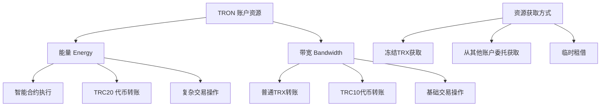
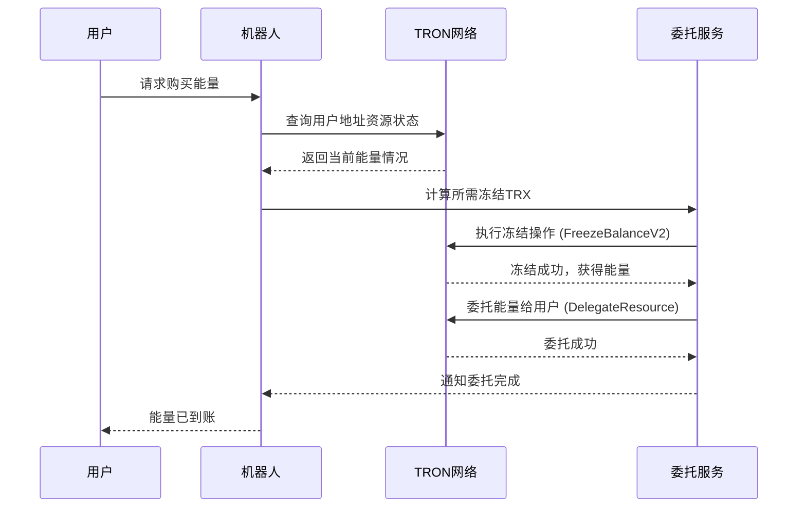

# ⚡ 账户资源管理 API 详细文档

> TRON 账户资源管理的核心 API，包括能量委托、冻结解冻等关键功能

## 📋 目录

- [资源管理概述](#资源管理概述)
- [能量和带宽基础](#能量和带宽基础)
- [账户资源查询](#账户资源查询)
- [资源冻结管理](#资源冻结管理)
- [能量委托系统](#能量委托系统)
- [资源解冻和回收](#资源解冻和回收)
- [委托状态监控](#委托状态监控)
- [项目实战应用](#项目实战应用)

## 🎯 资源管理概述

### TRON 资源类型



### 项目中的资源管理流程



## ⚡ 能量和带宽基础

### 资源消耗对照表

| 操作类型 | 能量消耗 | 带宽消耗 | 说明 |
|----------|----------|----------|------|
| **TRX 转账** | 0 | ~268 bytes | 基础转账操作 |
| **TRC10 转账** | 0 | ~345 bytes | 通过系统合约 |
| **USDT 转账** | ~13,000 | ~345 bytes | TRC20 智能合约 |
| **能量委托** | ~28,000 | ~345 bytes | 资源管理合约 |
| **多签交易** | 变动 | ~500+ bytes | 根据签名数量 |

### 资源价格机制

```typescript
// 实时获取资源价格
async function getResourcePrices(): Promise<{
  energyPrice: number;  // TRX per Energy
  bandwidthPrice: number; // TRX per Bandwidth
}> {
  try {
    const energyPrices = await tronWeb.trx.getEnergyPrices();
    const bandwidthPrices = await tronWeb.trx.getBandwidthPrices();
    
    return {
      energyPrice: energyPrices.prices / 1000000, // 转换为 TRX
      bandwidthPrice: bandwidthPrices.prices / 1000000
    };
  } catch (error) {
    console.error('Failed to get resource prices:', error);
    throw error;
  }
}

// 项目中的使用示例
const prices = await getResourcePrices();
console.log(`当前能量价格: ${prices.energyPrice} TRX/Energy`);
```

## 🔍 账户资源查询

### GetAccountResource - 查询账户资源

```typescript
/**
 * 查询账户资源详情
 * 官方文档: https://developers.tron.network/reference/getaccountresource
 */
async function getAccountResource(address: string): Promise<{
  energy: {
    total: number;
    used: number;
    available: number;
  };
  bandwidth: {
    total: number;
    used: number;
    available: number;
  };
  delegated: {
    energyFrom: Array<{address: string, amount: number}>;
    energyTo: Array<{address: string, amount: number}>;
  };
}> {
  try {
    console.log(`🔍 Querying resources for address: ${address}`);
    
    const resources = await tronWeb.trx.getAccountResources(address);
    
    // 解析资源信息
    const result = {
      energy: {
        total: resources.EnergyLimit || 0,
        used: resources.EnergyUsed || 0,
        available: (resources.EnergyLimit || 0) - (resources.EnergyUsed || 0)
      },
      bandwidth: {
        total: resources.NetLimit || 0,
        used: resources.NetUsed || 0,
        available: (resources.NetLimit || 0) - (resources.NetUsed || 0)
      },
      delegated: {
        energyFrom: [], // 从其他地址委托获得的能量
        energyTo: []    // 委托给其他地址的能量
      }
    };

    // 查询委托信息
    if (resources.delegatedFrozenBalanceForEnergy) {
      result.delegated.energyFrom = resources.delegatedFrozenBalanceForEnergy.map(item => ({
        address: item.from,
        amount: item.frozen_balance / 1000000 // 转换为 TRX
      }));
    }

    console.log(`✅ Resources queried successfully:`, result);
    return result;

  } catch (error) {
    console.error(`❌ Failed to get account resources:`, error);
    throw error;
  }
}

// 项目中的实际使用
export class ResourceService {
  /**
   * 检查用户能量是否足够
   */
  static async checkUserEnergyStatus(address: string): Promise<{
    hasEnoughEnergy: boolean;
    currentEnergy: number;
    recommendedAction: string;
  }> {
    const resources = await getAccountResource(address);
    const minRequiredEnergy = 32000; // 基础操作需要的能量
    
    return {
      hasEnoughEnergy: resources.energy.available >= minRequiredEnergy,
      currentEnergy: resources.energy.available,
      recommendedAction: resources.energy.available < minRequiredEnergy 
        ? `建议购买 ${minRequiredEnergy - resources.energy.available} Energy`
        : '能量充足'
    };
  }

  /**
   * 获取账户资源摘要
   */
  static async getResourceSummary(address: string): Promise<string> {
    const resources = await getAccountResource(address);
    
    return `📊 账户资源状态
💡 能量: ${resources.energy.available.toLocaleString()}/${resources.energy.total.toLocaleString()} (可用/总计)
🌐 带宽: ${resources.bandwidth.available.toLocaleString()}/${resources.bandwidth.total.toLocaleString()}
${resources.delegated.energyFrom.length > 0 ? 
  `⚡ 委托能量来源: ${resources.delegated.energyFrom.length} 个地址` : 
  '⚡ 无委托能量'}`;
  }
}
```

## 🧊 资源冻结管理

### FreezeBalanceV2 - 冻结 TRX 获取资源

```typescript
/**
 * 冻结 TRX 获取能量或带宽
 * 官方文档: https://developers.tron.network/reference/freezebalancev2
 */
async function freezeBalanceForResource(
  amount: number,  // TRX 数量
  resourceType: 'ENERGY' | 'BANDWIDTH' = 'ENERGY'
): Promise<{
  success: boolean;
  txId?: string;
  resourceGained?: number;
  error?: string;
}> {
  try {
    console.log(`🧊 Freezing ${amount} TRX for ${resourceType}...`);

    // 检查账户余额
    const balance = await tronWeb.trx.getBalance();
    const amountSun = amount * 1000000; // 转换为 Sun
    
    if (balance < amountSun) {
      throw new Error(`Insufficient balance: ${balance / 1000000} TRX`);
    }

    // 创建冻结交易
    const transaction = await tronWeb.transactionBuilder.freezeBalanceV2(
      amountSun,
      resourceType,
      tronWeb.defaultAddress.base58
    );

    // 签名并广播
    const signedTx = await tronWeb.trx.sign(transaction);
    const result = await tronWeb.trx.sendRawTransaction(signedTx);

    if (result.result) {
      console.log(`✅ Freeze successful, txId: ${result.txid}`);
      
      // 计算获得的资源数量
      const resourceGained = await calculateResourceGained(amount, resourceType);
      
      return {
        success: true,
        txId: result.txid,
        resourceGained
      };
    } else {
      throw new Error(result.message || 'Freeze transaction failed');
    }

  } catch (error) {
    console.error(`❌ Freeze balance failed:`, error);
    return {
      success: false,
      error: error.message
    };
  }
}

/**
 * 计算冻结指定 TRX 能获得多少资源
 */
async function calculateResourceGained(
  trxAmount: number,
  resourceType: 'ENERGY' | 'BANDWIDTH'
): Promise<number> {
  try {
    const prices = await getResourcePrices();
    const price = resourceType === 'ENERGY' ? prices.energyPrice : prices.bandwidthPrice;
    
    return Math.floor(trxAmount / price);
  } catch (error) {
    console.error('Failed to calculate resource gained:', error);
    return 0;
  }
}

// 项目中的实际应用
export class FreezeService {
  /**
   * 为能量租赁业务冻结 TRX
   */
  static async freezeForEnergyBusiness(
    requiredEnergy: number,
    buffer: number = 0.1 // 10% 缓冲
  ): Promise<{
    success: boolean;
    txId?: string;
    amountFrozen?: number;
    energyGained?: number;
    cost?: number;
  }> {
    try {
      // 计算需要冻结的 TRX 数量
      const prices = await getResourcePrices();
      const requiredTrx = requiredEnergy * prices.energyPrice;
      const amountToFreeze = requiredTrx * (1 + buffer); // 添加缓冲

      console.log(`📊 Energy business calculation:
🎯 Required Energy: ${requiredEnergy.toLocaleString()}
💰 Current Energy Price: ${prices.energyPrice.toFixed(8)} TRX/Energy  
🧊 Amount to freeze: ${amountToFreeze.toFixed(2)} TRX`);

      const result = await freezeBalanceForResource(amountToFreeze, 'ENERGY');
      
      if (result.success) {
        return {
          success: true,
          txId: result.txId,
          amountFrozen: amountToFreeze,
          energyGained: result.resourceGained,
          cost: amountToFreeze
        };
      } else {
        throw new Error(result.error);
      }

    } catch (error) {
      console.error('Energy business freeze failed:', error);
      return {
        success: false
      };
    }
  }

  /**
   * 批量冻结操作（为多个订单准备资源）
   */
  static async batchFreezeForOrders(orders: Array<{
    orderId: string;
    requiredEnergy: number;
  }>): Promise<Array<{
    orderId: string;
    success: boolean;
    txId?: string;
    error?: string;
  }>> {
    const results = [];
    
    for (const order of orders) {
      console.log(`🔄 Processing freeze for order: ${order.orderId}`);
      
      const result = await this.freezeForEnergyBusiness(order.requiredEnergy);
      
      results.push({
        orderId: order.orderId,
        success: result.success,
        txId: result.txId,
        error: result.success ? undefined : 'Freeze operation failed'
      });
      
      // 避免过于频繁的操作
      await new Promise(resolve => setTimeout(resolve, 1000));
    }
    
    return results;
  }
}
```

## ⚡ 能量委托系统

### DelegateResource - 委托资源给其他地址

```typescript
/**
 * 委托能量资源给指定地址
 * 官方文档: https://developers.tron.network/reference/delegateresource
 */
async function delegateEnergyToAddress(
  recipientAddress: string,
  energyAmount: number,
  lockTime: number = 0 // 0 表示不锁定，可随时取消
): Promise<{
  success: boolean;
  txId?: string;
  delegationId?: string;
  expiresAt?: Date;
  error?: string;
}> {
  try {
    console.log(`⚡ Delegating ${energyAmount} Energy to ${recipientAddress}`);

    // 验证接收地址
    const isValidAddress = tronWeb.isAddress(recipientAddress);
    if (!isValidAddress) {
      throw new Error(`Invalid recipient address: ${recipientAddress}`);
    }

    // 检查当前账户的可用能量
    const resources = await getAccountResource(tronWeb.defaultAddress.base58);
    if (resources.energy.available < energyAmount) {
      throw new Error(`Insufficient energy: ${resources.energy.available} < ${energyAmount}`);
    }

    // 创建委托交易
    const transaction = await tronWeb.transactionBuilder.delegateResource(
      energyAmount,
      recipientAddress,
      'ENERGY',
      tronWeb.defaultAddress.base58,
      lockTime > 0, // 是否锁定
      lockTime
    );

    // 签名并广播
    const signedTx = await tronWeb.trx.sign(transaction);
    const result = await tronWeb.trx.sendRawTransaction(signedTx);

    if (result.result) {
      const delegationId = `delegation_${Date.now()}_${result.txid.substring(0, 8)}`;
      const expiresAt = lockTime > 0 
        ? new Date(Date.now() + lockTime * 1000)
        : null;

      console.log(`✅ Energy delegation successful:
🆔 Transaction ID: ${result.txid}
🎯 Recipient: ${recipientAddress}
⚡ Energy Amount: ${energyAmount.toLocaleString()}
⏰ Expires: ${expiresAt ? expiresAt.toLocaleString() : 'No expiration'}`);

      return {
        success: true,
        txId: result.txid,
        delegationId,
        expiresAt
      };
    } else {
      throw new Error(result.message || 'Delegation transaction failed');
    }

  } catch (error) {
    console.error(`❌ Energy delegation failed:`, error);
    return {
      success: false,
      error: error.message
    };
  }
}

/**
 * 取消能量委托
 * 官方文档: https://developers.tron.network/reference/undelegateresource
 */
async function undelegateEnergyFromAddress(
  recipientAddress: string,
  energyAmount: number
): Promise<{
  success: boolean;
  txId?: string;
  error?: string;
}> {
  try {
    console.log(`🔄 Undelegating ${energyAmount} Energy from ${recipientAddress}`);

    // 创建取消委托交易
    const transaction = await tronWeb.transactionBuilder.undelegateResource(
      energyAmount,
      recipientAddress,
      'ENERGY',
      tronWeb.defaultAddress.base58
    );

    const signedTx = await tronWeb.trx.sign(transaction);
    const result = await tronWeb.trx.sendRawTransaction(signedTx);

    if (result.result) {
      console.log(`✅ Energy undelegation successful: ${result.txid}`);
      return {
        success: true,
        txId: result.txid
      };
    } else {
      throw new Error(result.message || 'Undelegation transaction failed');
    }

  } catch (error) {
    console.error(`❌ Energy undelegation failed:`, error);
    return {
      success: false,
      error: error.message
    };
  }
}

// 项目中的能量委托服务
export class EnergyDelegationService {
  private static activeDelegations = new Map<string, {
    recipientAddress: string;
    energyAmount: number;
    startTime: Date;
    duration: number;
    orderId: string;
  }>();

  /**
   * 为订单执行能量委托
   */
  static async processEnergyOrder(order: {
    id: string;
    recipientAddress: string;
    energyAmount: number;
    durationHours: number;
  }): Promise<{
    success: boolean;
    delegationId?: string;
    error?: string;
  }> {
    try {
      console.log(`🎯 Processing energy order: ${order.id}`);

      // 1. 检查是否需要先冻结更多 TRX
      await this.ensureSufficientEnergy(order.energyAmount);

      // 2. 执行能量委托
      const delegationResult = await delegateEnergyToAddress(
        order.recipientAddress,
        order.energyAmount,
        order.durationHours * 3600 // 转换为秒
      );

      if (delegationResult.success) {
        // 3. 记录委托信息
        this.activeDelegations.set(delegationResult.delegationId!, {
          recipientAddress: order.recipientAddress,
          energyAmount: order.energyAmount,
          startTime: new Date(),
          duration: order.durationHours * 3600,
          orderId: order.id
        });

        // 4. 设置自动回收定时器
        setTimeout(() => {
          this.reclaimExpiredDelegation(delegationResult.delegationId!);
        }, order.durationHours * 3600 * 1000);

        console.log(`✅ Energy order processed successfully: ${order.id}`);
        
        return {
          success: true,
          delegationId: delegationResult.delegationId
        };
      } else {
        throw new Error(delegationResult.error);
      }

    } catch (error) {
      console.error(`❌ Energy order processing failed:`, error);
      return {
        success: false,
        error: error.message
      };
    }
  }

  /**
   * 确保有足够的能量可供委托
   */
  private static async ensureSufficientEnergy(requiredEnergy: number): Promise<void> {
    const resources = await getAccountResource(tronWeb.defaultAddress.base58);
    
    if (resources.energy.available < requiredEnergy) {
      const deficit = requiredEnergy - resources.energy.available;
      console.log(`⚠️ Insufficient energy, need to freeze more TRX for ${deficit} Energy`);
      
      const freezeResult = await FreezeService.freezeForEnergyBusiness(deficit);
      if (!freezeResult.success) {
        throw new Error('Failed to freeze additional TRX for energy');
      }
      
      // 等待交易确认
      await new Promise(resolve => setTimeout(resolve, 3000));
    }
  }

  /**
   * 回收到期的能量委托
   */
  private static async reclaimExpiredDelegation(delegationId: string): Promise<void> {
    try {
      const delegation = this.activeDelegations.get(delegationId);
      if (!delegation) return;

      console.log(`🔄 Reclaiming expired delegation: ${delegationId}`);

      const result = await undelegateEnergyFromAddress(
        delegation.recipientAddress,
        delegation.energyAmount
      );

      if (result.success) {
        this.activeDelegations.delete(delegationId);
        console.log(`✅ Energy delegation reclaimed: ${delegationId}`);
      } else {
        console.error(`❌ Failed to reclaim delegation: ${result.error}`);
        // 重试机制
        setTimeout(() => {
          this.reclaimExpiredDelegation(delegationId);
        }, 60000); // 1分钟后重试
      }

    } catch (error) {
      console.error(`❌ Error reclaiming delegation:`, error);
    }
  }

  /**
   * 获取活跃委托统计
   */
  static getActiveDelegationStats(): {
    totalDelegations: number;
    totalEnergyDelegated: number;
    delegationsByRecipient: Map<string, number>;
  } {
    let totalEnergy = 0;
    const byRecipient = new Map<string, number>();

    for (const [id, delegation] of this.activeDelegations) {
      totalEnergy += delegation.energyAmount;
      
      const current = byRecipient.get(delegation.recipientAddress) || 0;
      byRecipient.set(delegation.recipientAddress, current + delegation.energyAmount);
    }

    return {
      totalDelegations: this.activeDelegations.size,
      totalEnergyDelegated: totalEnergy,
      delegationsByRecipient: byRecipient
    };
  }
}
```

## 🔓 资源解冻和回收

### UnfreezeBalanceV2 - 解冻资源回收 TRX

```typescript
/**
 * 解冻指定资源类型和数量
 * 官方文档: https://developers.tron.network/reference/unfreezebalancev2
 */
async function unfreezeResourceBalance(
  amount: number, // TRX 数量
  resourceType: 'ENERGY' | 'BANDWIDTH' = 'ENERGY'
): Promise<{
  success: boolean;
  txId?: string;
  amountUnfrozen?: number;
  error?: string;
}> {
  try {
    console.log(`🔓 Unfreezing ${amount} TRX worth of ${resourceType}...`);

    const amountSun = amount * 1000000;

    // 创建解冻交易
    const transaction = await tronWeb.transactionBuilder.unfreezeBalanceV2(
      amountSun,
      resourceType,
      tronWeb.defaultAddress.base58
    );

    const signedTx = await tronWeb.trx.sign(transaction);
    const result = await tronWeb.trx.sendRawTransaction(signedTx);

    if (result.result) {
      console.log(`✅ Unfreeze successful: ${result.txid}`);
      return {
        success: true,
        txId: result.txid,
        amountUnfrozen: amount
      };
    } else {
      throw new Error(result.message || 'Unfreeze transaction failed');
    }

  } catch (error) {
    console.error(`❌ Unfreeze failed:`, error);
    return {
      success: false,
      error: error.message
    };
  }
}

/**
 * 批量取消所有解冻操作
 * 官方文档: https://developers.tron.network/reference/cancelallunfreezev2
 */
async function cancelAllUnfreeze(): Promise<{
  success: boolean;
  txId?: string;
  cancelledCount?: number;
  error?: string;
}> {
  try {
    console.log(`🚫 Cancelling all pending unfreeze operations...`);

    const transaction = await tronWeb.transactionBuilder.cancelAllUnfreezeV2(
      tronWeb.defaultAddress.base58
    );

    const signedTx = await tronWeb.trx.sign(transaction);
    const result = await tronWeb.trx.sendRawTransaction(signedTx);

    if (result.result) {
      console.log(`✅ All unfreeze operations cancelled: ${result.txid}`);
      return {
        success: true,
        txId: result.txid
      };
    } else {
      throw new Error(result.message || 'Cancel unfreeze failed');
    }

  } catch (error) {
    console.error(`❌ Cancel unfreeze failed:`, error);
    return {
      success: false,
      error: error.message
    };
  }
}

/**
 * 提取已到期的解冻资产
 * 官方文档: https://developers.tron.network/reference/withdrawexpireunfreeze
 */
async function withdrawExpiredUnfreeze(): Promise<{
  success: boolean;
  txId?: string;
  withdrawnAmount?: number;
  error?: string;
}> {
  try {
    console.log(`💰 Withdrawing expired unfreeze assets...`);

    // 检查可提取金额
    const availableAmount = await tronWeb.trx.getCanWithdrawUnfreezeAmount(
      tronWeb.defaultAddress.base58
    );

    if (availableAmount <= 0) {
      return {
        success: false,
        error: 'No expired unfreeze assets available'
      };
    }

    const transaction = await tronWeb.transactionBuilder.withdrawExpireUnfreeze(
      tronWeb.defaultAddress.base58
    );

    const signedTx = await tronWeb.trx.sign(transaction);
    const result = await tronWeb.trx.sendRawTransaction(signedTx);

    if (result.result) {
      console.log(`✅ Withdrawal successful: ${result.txid}, amount: ${availableAmount / 1000000} TRX`);
      return {
        success: true,
        txId: result.txid,
        withdrawnAmount: availableAmount / 1000000
      };
    } else {
      throw new Error(result.message || 'Withdrawal failed');
    }

  } catch (error) {
    console.error(`❌ Withdrawal failed:`, error);
    return {
      success: false,
      error: error.message
    };
  }
}

// 项目中的资源回收服务
export class ResourceReclamationService {
  /**
   * 定期检查和回收过期资源
   */
  static async performRoutineMaintenance(): Promise<{
    unfrozen: number;
    withdrawn: number;
    errors: string[];
  }> {
    const errors: string[] = [];
    let totalUnfrozen = 0;
    let totalWithdrawn = 0;

    try {
      console.log('🔧 Starting routine resource maintenance...');

      // 1. 检查可提取的已解冻资产
      const withdrawResult = await withdrawExpiredUnfreeze();
      if (withdrawResult.success) {
        totalWithdrawn = withdrawResult.withdrawnAmount || 0;
        console.log(`💰 Withdrawn: ${totalWithdrawn} TRX`);
      } else if (withdrawResult.error !== 'No expired unfreeze assets available') {
        errors.push(`Withdrawal error: ${withdrawResult.error}`);
      }

      // 2. 检查是否需要解冻一些资源
      const shouldUnfreeze = await this.shouldUnfreezeResources();
      if (shouldUnfreeze.shouldUnfreeze) {
        const unfreezeResult = await unfreezeResourceBalance(
          shouldUnfreeze.recommendedAmount!,
          'ENERGY'
        );
        
        if (unfreezeResult.success) {
          totalUnfrozen = unfreezeResult.amountUnfrozen || 0;
          console.log(`🔓 Unfrozen: ${totalUnfrozen} TRX worth of energy`);
        } else {
          errors.push(`Unfreeze error: ${unfreezeResult.error}`);
        }
      }

      console.log(`✅ Maintenance completed. Errors: ${errors.length}`);

    } catch (error) {
      errors.push(`Maintenance error: ${error.message}`);
      console.error('❌ Maintenance failed:', error);
    }

    return {
      unfrozen: totalUnfrozen,
      withdrawn: totalWithdrawn,
      errors
    };
  }

  /**
   * 判断是否应该解冻一些资源
   */
  private static async shouldUnfreezeResources(): Promise<{
    shouldUnfreeze: boolean;
    recommendedAmount?: number;
    reason?: string;
  }> {
    try {
      const resources = await getAccountResource(tronWeb.defaultAddress.base58);
      const delegationStats = EnergyDelegationService.getActiveDelegationStats();
      
      // 如果总能量远超当前委托需求，考虑解冻一部分
      const excessEnergy = resources.energy.total - delegationStats.totalEnergyDelegated - 100000; // 保留10万能量缓冲
      
      if (excessEnergy > 200000) { // 超过20万能量才考虑解冻
        const prices = await getResourcePrices();
        const recommendedAmount = Math.floor((excessEnergy * prices.energyPrice) / 2); // 解冻一半多余部分
        
        return {
          shouldUnfreeze: true,
          recommendedAmount,
          reason: `Excess energy detected: ${excessEnergy.toLocaleString()}`
        };
      }

      return {
        shouldUnfreeze: false,
        reason: 'Energy utilization is optimal'
      };

    } catch (error) {
      console.error('Error checking unfreeze conditions:', error);
      return { shouldUnfreeze: false };
    }
  }

  /**
   * 紧急情况下的资源回收
   */
  static async emergencyResourceReclaim(): Promise<{
    success: boolean;
    actionsPerformed: string[];
    errors: string[];
  }> {
    const actionsPerformed: string[] = [];
    const errors: string[] = [];

    try {
      console.log('🚨 Starting emergency resource reclaim...');

      // 1. 取消所有待处理的解冻操作
      const cancelResult = await cancelAllUnfreeze();
      if (cancelResult.success) {
        actionsPerformed.push(`Cancelled all pending unfreeze operations`);
      } else {
        errors.push(`Cancel unfreeze error: ${cancelResult.error}`);
      }

      // 2. 立即提取所有可用的已解冻资产
      const withdrawResult = await withdrawExpiredUnfreeze();
      if (withdrawResult.success) {
        actionsPerformed.push(`Withdrawn ${withdrawResult.withdrawnAmount} TRX`);
      } else if (withdrawResult.error !== 'No expired unfreeze assets available') {
        errors.push(`Withdrawal error: ${withdrawResult.error}`);
      }

      // 3. 回收所有非关键的能量委托
      // (这里可以添加回收逻辑)

      console.log(`🚨 Emergency reclaim completed. Actions: ${actionsPerformed.length}, Errors: ${errors.length}`);

    } catch (error) {
      errors.push(`Emergency reclaim error: ${error.message}`);
    }

    return {
      success: errors.length === 0,
      actionsPerformed,
      errors
    };
  }
}
```

## 📊 委托状态监控

### GetDelegatedResourceV2 - 查询委托状态

```typescript
/**
 * 查询委托资源详情
 * 官方文档: https://developers.tron.network/reference/getdelegatedresourcev2
 */
async function getDelegatedResourceStatus(
  fromAddress: string,
  toAddress: string
): Promise<{
  energyDelegated: number;
  bandwidthDelegated: number;
  expireTime: Date | null;
  details: any;
}> {
  try {
    console.log(`📊 Querying delegation from ${fromAddress} to ${toAddress}`);

    const delegations = await tronWeb.trx.getDelegatedResourceV2(fromAddress, toAddress);
    
    let energyDelegated = 0;
    let bandwidthDelegated = 0;
    let expireTime: Date | null = null;

    if (delegations && delegations.delegatedResource) {
      for (const resource of delegations.delegatedResource) {
        if (resource.type === 'ENERGY') {
          energyDelegated += resource.amount || 0;
        } else if (resource.type === 'BANDWIDTH') {
          bandwidthDelegated += resource.amount || 0;
        }
        
        if (resource.expireTimeForEnergy) {
          expireTime = new Date(resource.expireTimeForEnergy);
        }
      }
    }

    return {
      energyDelegated,
      bandwidthDelegated,
      expireTime,
      details: delegations
    };

  } catch (error) {
    console.error('Failed to get delegation status:', error);
    throw error;
  }
}

/**
 * 监控服务 - 定期检查委托状态
 */
export class DelegationMonitorService {
  private static monitoringInterval: NodeJS.Timeout | null = null;
  private static monitoredDelegations = new Map<string, {
    fromAddress: string;
    toAddress: string;
    expectedEnergy: number;
    orderId: string;
    createdAt: Date;
  }>();

  /**
   * 开始监控委托状态
   */
  static startMonitoring(intervalMs: number = 60000): void {
    if (this.monitoringInterval) {
      clearInterval(this.monitoringInterval);
    }

    console.log(`👁️ Starting delegation monitoring (interval: ${intervalMs}ms)`);

    this.monitoringInterval = setInterval(async () => {
      await this.checkAllDelegations();
    }, intervalMs);
  }

  /**
   * 停止监控
   */
  static stopMonitoring(): void {
    if (this.monitoringInterval) {
      clearInterval(this.monitoringInterval);
      this.monitoringInterval = null;
      console.log('👁️ Delegation monitoring stopped');
    }
  }

  /**
   * 添加委托到监控列表
   */
  static addDelegationToMonitor(delegation: {
    fromAddress: string;
    toAddress: string;
    expectedEnergy: number;
    orderId: string;
  }): void {
    const key = `${delegation.fromAddress}_${delegation.toAddress}_${delegation.orderId}`;
    this.monitoredDelegations.set(key, {
      ...delegation,
      createdAt: new Date()
    });
    
    console.log(`📝 Added delegation to monitoring: ${key}`);
  }

  /**
   * 从监控列表移除委托
   */
  static removeDelegationFromMonitor(fromAddress: string, toAddress: string, orderId: string): void {
    const key = `${fromAddress}_${toAddress}_${orderId}`;
    this.monitoredDelegations.delete(key);
    console.log(`🗑️ Removed delegation from monitoring: ${key}`);
  }

  /**
   * 检查所有被监控的委托
   */
  private static async checkAllDelegations(): Promise<void> {
    console.log(`🔍 Checking ${this.monitoredDelegations.size} monitored delegations...`);

    for (const [key, delegation] of this.monitoredDelegations) {
      try {
        await this.checkSingleDelegation(key, delegation);
      } catch (error) {
        console.error(`❌ Error checking delegation ${key}:`, error);
      }
    }
  }

  /**
   * 检查单个委托状态
   */
  private static async checkSingleDelegation(key: string, delegation: {
    fromAddress: string;
    toAddress: string;
    expectedEnergy: number;
    orderId: string;
    createdAt: Date;
  }): Promise<void> {
    try {
      const status = await getDelegatedResourceStatus(
        delegation.fromAddress,
        delegation.toAddress
      );

      // 检查能量是否符合期望
      if (status.energyDelegated < delegation.expectedEnergy * 0.95) { // 允许5%误差
        console.warn(`⚠️ Energy delegation below expected:
📍 Key: ${key}
🎯 Expected: ${delegation.expectedEnergy.toLocaleString()}
📊 Actual: ${status.energyDelegated.toLocaleString()}`);
        
        // 发送告警
        await this.sendDelegationAlert({
          type: 'ENERGY_SHORTAGE',
          orderId: delegation.orderId,
          expected: delegation.expectedEnergy,
          actual: status.energyDelegated,
          shortage: delegation.expectedEnergy - status.energyDelegated
        });
      }

      // 检查是否即将过期
      if (status.expireTime && status.expireTime.getTime() - Date.now() < 3600000) { // 1小时内过期
        console.warn(`⏰ Delegation expiring soon: ${key}, expires at ${status.expireTime}`);
        
        await this.sendDelegationAlert({
          type: 'EXPIRING_SOON',
          orderId: delegation.orderId,
          expireTime: status.expireTime
        });
      }

    } catch (error) {
      console.error(`❌ Failed to check delegation ${key}:`, error);
    }
  }

  /**
   * 发送委托告警
   */
  private static async sendDelegationAlert(alert: {
    type: 'ENERGY_SHORTAGE' | 'EXPIRING_SOON' | 'DELEGATION_FAILED';
    orderId: string;
    expected?: number;
    actual?: number;
    shortage?: number;
    expireTime?: Date;
  }): Promise<void> {
    try {
      console.log(`🚨 Delegation alert:`, alert);
      
      // 这里可以集成告警系统
      // 例如发送到 Slack、邮件或数据库记录
      
    } catch (error) {
      console.error('Failed to send delegation alert:', error);
    }
  }

  /**
   * 获取监控统计
   */
  static getMonitoringStats(): {
    totalMonitored: number;
    averageAge: number; // 平均监控时长（毫秒）
    oldestDelegation: Date | null;
  } {
    if (this.monitoredDelegations.size === 0) {
      return {
        totalMonitored: 0,
        averageAge: 0,
        oldestDelegation: null
      };
    }

    let totalAge = 0;
    let oldestDate: Date | null = null;
    const now = Date.now();

    for (const delegation of this.monitoredDelegations.values()) {
      const age = now - delegation.createdAt.getTime();
      totalAge += age;
      
      if (!oldestDate || delegation.createdAt < oldestDate) {
        oldestDate = delegation.createdAt;
      }
    }

    return {
      totalMonitored: this.monitoredDelegations.size,
      averageAge: totalAge / this.monitoredDelegations.size,
      oldestDelegation: oldestDate
    };
  }
}
```

## 💡 项目实战应用

### 完整的能量租赁业务流程

```typescript
// 完整的能量租赁服务
export class ComprehensiveEnergyRentalService {
  /**
   * 处理用户能量租赁请求的完整流程
   */
  static async processEnergyRentalOrder(order: {
    orderId: string;
    userAddress: string;
    energyAmount: number;
    durationHours: number;
    maxCost: number; // 用户愿意支付的最大成本 (TRX)
  }): Promise<{
    success: boolean;
    delegationId?: string;
    actualCost?: number;
    expiresAt?: Date;
    error?: string;
  }> {
    try {
      console.log(`🚀 Processing energy rental order: ${order.orderId}`);

      // 1. 验证用户地址
      if (!tronWeb.isAddress(order.userAddress)) {
        throw new Error(`Invalid TRON address: ${order.userAddress}`);
      }

      // 2. 计算实际成本
      const costEstimation = await this.calculateRentalCost(
        order.energyAmount, 
        order.durationHours
      );
      
      if (costEstimation.totalCost > order.maxCost) {
        return {
          success: false,
          error: `Cost exceeded limit: ${costEstimation.totalCost} > ${order.maxCost} TRX`
        };
      }

      // 3. 检查并准备足够的资源
      await this.ensureResourceAvailability(order.energyAmount);

      // 4. 执行能量委托
      const delegationResult = await delegateEnergyToAddress(
        order.userAddress,
        order.energyAmount,
        order.durationHours * 3600
      );

      if (!delegationResult.success) {
        throw new Error(delegationResult.error);
      }

      // 5. 添加到监控系统
      DelegationMonitorService.addDelegationToMonitor({
        fromAddress: tronWeb.defaultAddress.base58,
        toAddress: order.userAddress,
        expectedEnergy: order.energyAmount,
        orderId: order.orderId
      });

      // 6. 记录到活跃委托
      EnergyDelegationService['activeDelegations'].set(delegationResult.delegationId!, {
        recipientAddress: order.userAddress,
        energyAmount: order.energyAmount,
        startTime: new Date(),
        duration: order.durationHours * 3600,
        orderId: order.orderId
      });

      // 7. 设置自动回收
      const expiresAt = new Date(Date.now() + order.durationHours * 3600 * 1000);
      setTimeout(() => {
        this.handleOrderExpiration(order.orderId, delegationResult.delegationId!);
      }, order.durationHours * 3600 * 1000);

      console.log(`✅ Energy rental order processed successfully: ${order.orderId}`);

      return {
        success: true,
        delegationId: delegationResult.delegationId,
        actualCost: costEstimation.totalCost,
        expiresAt
      };

    } catch (error) {
      console.error(`❌ Energy rental order failed: ${order.orderId}`, error);
      return {
        success: false,
        error: error.message
      };
    }
  }

  /**
   * 计算租赁成本
   */
  private static async calculateRentalCost(
    energyAmount: number,
    durationHours: number
  ): Promise<{
    energyCost: number;      // 能量本身的成本
    serviceFee: number;      // 服务费
    networkFee: number;      // 网络手续费
    totalCost: number;       // 总成本
  }> {
    try {
      const prices = await getResourcePrices();
      
      // 基础能量成本
      const energyCost = energyAmount * prices.energyPrice;
      
      // 服务费 (5% of energy cost)
      const serviceFee = energyCost * 0.05;
      
      // 网络手续费 (委托 + 取消委托的费用)
      const networkFee = 0.1; // 约 0.1 TRX
      
      const totalCost = energyCost + serviceFee + networkFee;

      console.log(`💰 Cost calculation:
⚡ Energy: ${energyAmount.toLocaleString()} x ${prices.energyPrice.toFixed(8)} = ${energyCost.toFixed(4)} TRX
🏷️ Service Fee (5%): ${serviceFee.toFixed(4)} TRX  
🌐 Network Fee: ${networkFee.toFixed(4)} TRX
💵 Total: ${totalCost.toFixed(4)} TRX`);

      return {
        energyCost,
        serviceFee,
        networkFee,
        totalCost
      };

    } catch (error) {
      console.error('Cost calculation failed:', error);
      throw error;
    }
  }

  /**
   * 确保有足够的资源可供委托
   */
  private static async ensureResourceAvailability(requiredEnergy: number): Promise<void> {
    const resources = await getAccountResource(tronWeb.defaultAddress.base58);
    const buffer = 50000; // 5万能量缓冲
    
    if (resources.energy.available < requiredEnergy + buffer) {
      const needToFreeze = requiredEnergy + buffer - resources.energy.available;
      console.log(`⚠️ Insufficient energy, freezing additional TRX for ${needToFreeze.toLocaleString()} Energy`);
      
      const freezeResult = await FreezeService.freezeForEnergyBusiness(needToFreeze);
      if (!freezeResult.success) {
        throw new Error('Failed to freeze additional TRX for energy');
      }
      
      // 等待区块确认
      await new Promise(resolve => setTimeout(resolve, 3000));
    }
  }

  /**
   * 处理订单到期
   */
  private static async handleOrderExpiration(orderId: string, delegationId: string): Promise<void> {
    try {
      console.log(`⏰ Handling order expiration: ${orderId}`);

      // 从监控中移除
      const delegation = EnergyDelegationService['activeDelegations'].get(delegationId);
      if (delegation) {
        DelegationMonitorService.removeDelegationFromMonitor(
          tronWeb.defaultAddress.base58,
          delegation.recipientAddress,
          orderId
        );

        // 回收能量
        const result = await undelegateEnergyFromAddress(
          delegation.recipientAddress,
          delegation.energyAmount
        );

        if (result.success) {
          EnergyDelegationService['activeDelegations'].delete(delegationId);
          console.log(`✅ Order ${orderId} expired and energy reclaimed`);
        } else {
          console.error(`❌ Failed to reclaim energy for order ${orderId}: ${result.error}`);
          // 安排重试
          setTimeout(() => {
            this.handleOrderExpiration(orderId, delegationId);
          }, 300000); // 5分钟后重试
        }
      }

    } catch (error) {
      console.error(`❌ Error handling order expiration: ${orderId}`, error);
    }
  }

  /**
   * 获取系统资源使用报告
   */
  static async generateResourceReport(): Promise<{
    systemResources: any;
    activeDelegations: any;
    monitoringStats: any;
    recommendations: string[];
  }> {
    try {
      const systemResources = await getAccountResource(tronWeb.defaultAddress.base58);
      const activeDelegations = EnergyDelegationService.getActiveDelegationStats();
      const monitoringStats = DelegationMonitorService.getMonitoringStats();

      const recommendations: string[] = [];

      // 分析和建议
      const utilizationRate = activeDelegations.totalEnergyDelegated / systemResources.energy.total;
      if (utilizationRate > 0.9) {
        recommendations.push('🔴 High energy utilization (>90%), consider freezing more TRX');
      } else if (utilizationRate < 0.3) {
        recommendations.push('🟡 Low energy utilization (<30%), consider unfreezing some TRX');
      } else {
        recommendations.push('🟢 Energy utilization is optimal');
      }

      if (monitoringStats.totalMonitored > 100) {
        recommendations.push('⚠️ High number of monitored delegations, consider cleanup');
      }

      return {
        systemResources,
        activeDelegations,
        monitoringStats,
        recommendations
      };

    } catch (error) {
      console.error('Failed to generate resource report:', error);
      throw error;
    }
  }
}
```

## 🔗 相关文档

- [TRON API 主文档](./README.md) - 完整 API 导航
- [账户管理 API](./02-accounts-api.md) - 账户查询和余额管理
- [交易管理 API](./04-transactions-api.md) - 交易处理流程
- [项目实战示例](./10-project-examples.md) - 完整业务流程示例

---

> 💡 **最佳实践提示**
> 
> 1. **监控优先** - 始终监控委托状态，及时发现异常
> 2. **资源缓冲** - 保留适量能量缓冲，避免委托失败
> 3. **成本控制** - 定期检查能量价格，优化冻结策略
> 4. **自动化管理** - 实现自动回收和维护，提高效率
> 5. **异常处理** - 完善的错误处理和重试机制
