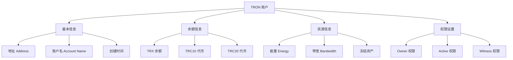
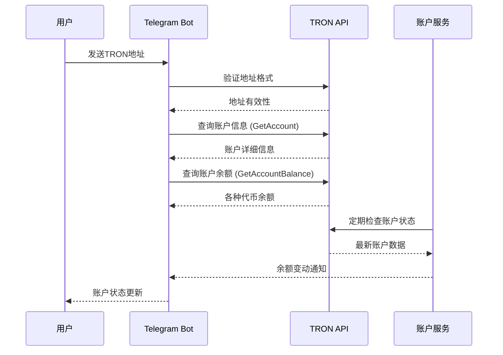

# 👤 账户管理 API 详细文档

> TRON 账户查询、余额管理和基础账户操作的完整指南

## 📋 目录

- [账户管理概述](#账户管理概述)
- [账户信息查询](#账户信息查询)
- [余额管理](#余额管理)
- [账户创建和更新](#账户创建和更新)
- [权限管理](#权限管理)
- [账户历史记录](#账户历史记录)
- [项目实战应用](#项目实战应用)

## 🎯 账户管理概述

### TRON 账户结构



### 项目中的账户管理流程



## 🔍 账户信息查询

### GetAccount - 获取账户基本信息

```typescript
/**
 * 获取账户详细信息
 * 官方文档: https://developers.tron.network/reference/getaccount
 */
async function getAccountInfo(address: string): Promise<{
  address: string;
  balance: number;
  createTime: Date | null;
  accountName?: string;
  accountType: 'Normal' | 'AssetIssue' | 'Contract';
  frozenBalance: Array<{
    amount: number;
    expireTime: Date;
  }>;
  votes: Array<{
    voteAddress: string;
    voteCount: number;
  }>;
  assetIssuedName?: string;
  assetIssuedID?: string;
  allowance: number;
  ownerPermission?: any;
  activePermission?: any[];
  witnessPermission?: any;
}> {
  try {
    console.log(`🔍 Querying account info for: ${address}`);
    
    // 验证地址格式
    if (!tronWeb.isAddress(address)) {
      throw new Error(`Invalid TRON address: ${address}`);
    }

    const account = await tronWeb.trx.getAccount(address);
    
    // 检查账户是否存在
    if (!account || Object.keys(account).length === 0) {
      return {
        address,
        balance: 0,
        createTime: null,
        accountType: 'Normal',
        frozenBalance: [],
        votes: [],
        allowance: 0
      };
    }

    // 解析账户数据
    const result = {
      address: tronWeb.address.fromHex(account.address),
      balance: (account.balance || 0) / 1000000, // 转换为 TRX
      createTime: account.create_time ? new Date(account.create_time) : null,
      accountName: account.account_name ? Buffer.from(account.account_name, 'hex').toString() : undefined,
      accountType: account.type === 1 ? 'AssetIssue' : account.type === 2 ? 'Contract' : 'Normal',
      frozenBalance: (account.frozen || []).map(item => ({
        amount: item.frozen_balance / 1000000,
        expireTime: new Date(item.expire_time)
      })),
      votes: (account.votes || []).map(vote => ({
        voteAddress: tronWeb.address.fromHex(vote.vote_address),
        voteCount: vote.vote_count
      })),
      assetIssuedName: account.asset_issued_name ? Buffer.from(account.asset_issued_name, 'hex').toString() : undefined,
      assetIssuedID: account.asset_issued_ID,
      allowance: (account.allowance || 0) / 1000000,
      ownerPermission: account.owner_permission,
      activePermission: account.active_permission,
      witnessPermission: account.witness_permission
    };

    console.log(`✅ Account info retrieved:`, {
      address: result.address,
      balance: result.balance,
      accountType: result.accountType,
      hasName: !!result.accountName
    });

    return result;

  } catch (error) {
    console.error(`❌ Failed to get account info:`, error);
    throw error;
  }
}

// 项目中的实际使用
export class AccountInfoService {
  /**
   * 获取用户账户摘要
   */
  static async getUserAccountSummary(address: string): Promise<{
    exists: boolean;
    summary: string;
    isActive: boolean;
    needsActivation: boolean;
  }> {
    try {
      const accountInfo = await getAccountInfo(address);
      
      const exists = accountInfo.balance > 0 || accountInfo.createTime !== null;
      const isActive = accountInfo.balance > 0 || accountInfo.frozenBalance.length > 0;
      const needsActivation = !exists;
      
      let summary = `📊 账户信息\n`;
      summary += `📍 地址: ${accountInfo.address}\n`;
      
      if (exists) {
        summary += `💰 TRX 余额: ${accountInfo.balance.toFixed(6)} TRX\n`;
        summary += `📅 创建时间: ${accountInfo.createTime?.toLocaleDateString() || '未知'}\n`;
        
        if (accountInfo.accountName) {
          summary += `📛 账户名: ${accountInfo.accountName}\n`;
        }
        
        if (accountInfo.frozenBalance.length > 0) {
          const totalFrozen = accountInfo.frozenBalance.reduce((sum, item) => sum + item.amount, 0);
          summary += `🧊 冻结余额: ${totalFrozen.toFixed(6)} TRX\n`;
        }
        
        if (accountInfo.votes.length > 0) {
          summary += `🗳️ 投票权: ${accountInfo.votes.length} 个超级代表\n`;
        }
      } else {
        summary += `❌ 账户未激活或余额为零\n`;
        summary += `💡 需要转入少量 TRX 激活账户\n`;
      }

      return {
        exists,
        summary,
        isActive,
        needsActivation
      };

    } catch (error) {
      console.error('Failed to get user account summary:', error);
      throw error;
    }
  }

  /**
   * 检查账户是否适合接收能量委托
   */
  static async checkAccountEligibility(address: string): Promise<{
    eligible: boolean;
    issues: string[];
    recommendations: string[];
  }> {
    try {
      const accountInfo = await getAccountInfo(address);
      const issues: string[] = [];
      const recommendations: string[] = [];

      // 检查账户是否存在
      if (!accountInfo.createTime && accountInfo.balance === 0) {
        issues.push('账户未激活');
        recommendations.push('向账户转入至少 0.1 TRX 以激活账户');
      }

      // 检查是否是合约账户
      if (accountInfo.accountType === 'Contract') {
        issues.push('这是一个智能合约地址');
        recommendations.push('确认合约是否支持接收能量委托');
      }

      // 检查权限设置
      if (accountInfo.activePermission && accountInfo.activePermission.length > 1) {
        recommendations.push('账户使用了多重签名，委托操作可能需要额外确认');
      }

      const eligible = issues.length === 0;

      return {
        eligible,
        issues,
        recommendations
      };

    } catch (error) {
      console.error('Failed to check account eligibility:', error);
      return {
        eligible: false,
        issues: ['检查账户时发生错误'],
        recommendations: ['请稍后重试或联系技术支持']
      };
    }
  }
}
```

### GetAccountBalance - 获取账户余额

```typescript
/**
 * 获取账户余额详情（包括TRC10代币）
 * 官方文档: https://developers.tron.network/reference/getaccountbalance
 */
async function getAccountBalance(address: string): Promise<{
  trxBalance: number;
  tokens: Array<{
    tokenId: string;
    tokenName: string;
    balance: number;
    decimals: number;
  }>;
  totalValue?: number; // 如果有价格数据
}> {
  try {
    console.log(`💰 Querying account balance for: ${address}`);

    // 获取基本账户信息（包含 TRX 余额）
    const account = await tronWeb.trx.getAccount(address);
    const trxBalance = (account.balance || 0) / 1000000;

    // 获取 TRC10 代币余额
    const tokens: Array<{
      tokenId: string;
      tokenName: string;
      balance: number;
      decimals: number;
    }> = [];

    if (account.assetV2) {
      for (const [tokenId, balance] of Object.entries(account.assetV2)) {
        try {
          // 获取代币信息
          const tokenInfo = await tronWeb.trx.getTokenByID(tokenId);
          
          tokens.push({
            tokenId,
            tokenName: tokenInfo.name ? Buffer.from(tokenInfo.name, 'hex').toString() : 'Unknown',
            balance: Number(balance) / Math.pow(10, tokenInfo.precision || 6),
            decimals: tokenInfo.precision || 6
          });
        } catch (error) {
          console.warn(`Failed to get token info for ${tokenId}:`, error);
        }
      }
    }

    console.log(`✅ Balance retrieved: ${trxBalance} TRX + ${tokens.length} tokens`);

    return {
      trxBalance,
      tokens
    };

  } catch (error) {
    console.error(`❌ Failed to get account balance:`, error);
    throw error;
  }
}

/**
 * 获取 TRC20 代币余额（如 USDT）
 */
async function getTRC20TokenBalance(
  address: string,
  contractAddress: string,
  decimals: number = 6
): Promise<number> {
  try {
    console.log(`🪙 Querying TRC20 balance: ${contractAddress} for ${address}`);

    const contract = await tronWeb.contract().at(contractAddress);
    const balance = await contract.balanceOf(address).call();
    
    const tokenBalance = balance.toNumber() / Math.pow(10, decimals);
    
    console.log(`✅ TRC20 balance: ${tokenBalance}`);
    return tokenBalance;

  } catch (error) {
    console.error(`❌ Failed to get TRC20 balance:`, error);
    return 0;
  }
}

// 项目中的余额管理服务
export class BalanceService {
  // 常用的代币合约地址
  private static readonly TOKEN_CONTRACTS = {
    USDT: 'TR7NHqjeKQxGTCi8q8ZY4pL8otSzgjLj6t',
    USDC: 'TEkxiTehnzSmSe2XqrBj4w32RUN966rdz8',
    TUSD: 'TUpMhErZL2fhh4sVNULAbNKLokS4GjC1F4'
  };

  /**
   * 获取完整的账户资产概览
   */
  static async getCompleteAssetOverview(address: string): Promise<{
    trx: number;
    usdt: number;
    usdc: number;
    trc10Tokens: Array<{
      name: string;
      balance: number;
      symbol?: string;
    }>;
    totalValueUSD?: number;
  }> {
    try {
      console.log(`📊 Getting complete asset overview for: ${address}`);

      // 并行查询各种余额
      const [accountBalance, usdtBalance, usdcBalance] = await Promise.all([
        getAccountBalance(address),
        getTRC20TokenBalance(address, this.TOKEN_CONTRACTS.USDT, 6),
        getTRC20TokenBalance(address, this.TOKEN_CONTRACTS.USDC, 6)
      ]);

      const overview = {
        trx: accountBalance.trxBalance,
        usdt: usdtBalance,
        usdc: usdcBalance,
        trc10Tokens: accountBalance.tokens.map(token => ({
          name: token.tokenName,
          balance: token.balance,
          symbol: token.tokenName // 可以根据需要映射符号
        }))
      };

      console.log(`✅ Asset overview completed:`, {
        trx: overview.trx,
        usdt: overview.usdt,
        usdc: overview.usdc,
        trc10Count: overview.trc10Tokens.length
      });

      return overview;

    } catch (error) {
      console.error('Failed to get asset overview:', error);
      throw error;
    }
  }

  /**
   * 监控用户余额变化
   */
  static async startBalanceMonitoring(
    addresses: string[],
    callback: (address: string, oldBalance: any, newBalance: any) => void,
    intervalMs: number = 30000
  ): Promise<() => void> {
    console.log(`👁️ Starting balance monitoring for ${addresses.length} addresses`);

    const lastBalances = new Map<string, any>();
    
    // 获取初始余额
    for (const address of addresses) {
      try {
        const balance = await this.getCompleteAssetOverview(address);
        lastBalances.set(address, balance);
      } catch (error) {
        console.error(`Failed to get initial balance for ${address}:`, error);
      }
    }

    const interval = setInterval(async () => {
      for (const address of addresses) {
        try {
          const currentBalance = await this.getCompleteAssetOverview(address);
          const lastBalance = lastBalances.get(address);

          if (lastBalance && this.hasBalanceChanged(lastBalance, currentBalance)) {
            console.log(`💰 Balance changed for ${address}`);
            callback(address, lastBalance, currentBalance);
          }

          lastBalances.set(address, currentBalance);

        } catch (error) {
          console.error(`Failed to check balance for ${address}:`, error);
        }
      }
    }, intervalMs);

    // 返回停止监控的函数
    return () => {
      clearInterval(interval);
      console.log(`👁️ Balance monitoring stopped`);
    };
  }

  /**
   * 检查余额是否发生变化
   */
  private static hasBalanceChanged(oldBalance: any, newBalance: any): boolean {
    return (
      Math.abs(oldBalance.trx - newBalance.trx) > 0.000001 ||
      Math.abs(oldBalance.usdt - newBalance.usdt) > 0.000001 ||
      Math.abs(oldBalance.usdc - newBalance.usdc) > 0.000001
    );
  }

  /**
   * 格式化余额显示
   */
  static formatBalanceDisplay(balance: {
    trx: number;
    usdt: number;
    usdc: number;
    trc10Tokens?: Array<{name: string, balance: number}>;
  }): string {
    let display = `💰 资产概览\n`;
    display += `• TRX: ${balance.trx.toFixed(6)}\n`;
    
    if (balance.usdt > 0) {
      display += `• USDT: ${balance.usdt.toFixed(6)}\n`;
    }
    
    if (balance.usdc > 0) {
      display += `• USDC: ${balance.usdc.toFixed(6)}\n`;
    }

    if (balance.trc10Tokens && balance.trc10Tokens.length > 0) {
      display += `• 其他代币: ${balance.trc10Tokens.length} 种\n`;
      
      // 显示余额最多的前3个代币
      const topTokens = balance.trc10Tokens
        .filter(token => token.balance > 0)
        .sort((a, b) => b.balance - a.balance)
        .slice(0, 3);
        
      for (const token of topTokens) {
        display += `  - ${token.name}: ${token.balance.toFixed(6)}\n`;
      }
    }

    return display;
  }
}
```

## 👥 账户创建和更新

### CreateAccount - 创建新账户

```typescript
/**
 * 创建新的 TRON 账户
 * 官方文档: https://developers.tron.network/reference/createaccount
 * 注意：这个 API 主要用于为其他人创建账户并支付创建费用
 */
async function createAccountForAddress(
  newAddress: string,
  ownerAddress?: string
): Promise<{
  success: boolean;
  txId?: string;
  cost?: number;
  error?: string;
}> {
  try {
    console.log(`👤 Creating account for address: ${newAddress}`);

    const fromAddress = ownerAddress || tronWeb.defaultAddress.base58;
    
    // 检查地址格式
    if (!tronWeb.isAddress(newAddress)) {
      throw new Error('Invalid new address format');
    }
    
    if (!tronWeb.isAddress(fromAddress)) {
      throw new Error('Invalid owner address format');
    }

    // 创建账户交易
    const transaction = await tronWeb.transactionBuilder.createAccount(
      newAddress,
      fromAddress
    );

    // 签名并广播
    const signedTx = await tronWeb.trx.sign(transaction);
    const result = await tronWeb.trx.sendRawTransaction(signedTx);

    if (result.result) {
      console.log(`✅ Account created successfully: ${result.txid}`);
      return {
        success: true,
        txId: result.txid,
        cost: 0.1 // 创建账户的费用通常是0.1 TRX
      };
    } else {
      throw new Error(result.message || 'Account creation failed');
    }

  } catch (error) {
    console.error(`❌ Failed to create account:`, error);
    return {
      success: false,
      error: error.message
    };
  }
}

/**
 * 更新账户信息
 * 官方文档: https://developers.tron.network/reference/updateaccount
 */
async function updateAccountName(
  accountName: string,
  ownerAddress?: string
): Promise<{
  success: boolean;
  txId?: string;
  error?: string;
}> {
  try {
    console.log(`📝 Updating account name to: ${accountName}`);

    const fromAddress = ownerAddress || tronWeb.defaultAddress.base58;
    
    // 创建更新账户交易
    const transaction = await tronWeb.transactionBuilder.updateAccount(
      accountName,
      fromAddress
    );

    const signedTx = await tronWeb.trx.sign(transaction);
    const result = await tronWeb.trx.sendRawTransaction(signedTx);

    if (result.result) {
      console.log(`✅ Account name updated: ${result.txid}`);
      return {
        success: true,
        txId: result.txid
      };
    } else {
      throw new Error(result.message || 'Account update failed');
    }

  } catch (error) {
    console.error(`❌ Failed to update account:`, error);
    return {
      success: false,
      error: error.message
    };
  }
}

// 项目中的账户管理服务
export class AccountManagementService {
  /**
   * 为新用户激活账户
   */
  static async activateUserAccount(userAddress: string): Promise<{
    activated: boolean;
    method: 'already_active' | 'balance_transfer' | 'account_creation';
    txId?: string;
    cost?: number;
  }> {
    try {
      console.log(`🔓 Activating account: ${userAddress}`);

      // 检查账户是否已激活
      const accountInfo = await getAccountInfo(userAddress);
      
      if (accountInfo.balance > 0 || accountInfo.createTime) {
        return {
          activated: true,
          method: 'already_active'
        };
      }

      // 方法1：直接转账激活（推荐）
      try {
        const transferResult = await this.transferToActivateAccount(userAddress);
        if (transferResult.success) {
          return {
            activated: true,
            method: 'balance_transfer',
            txId: transferResult.txId,
            cost: transferResult.amount
          };
        }
      } catch (error) {
        console.warn('Balance transfer activation failed, trying account creation:', error);
      }

      // 方法2：使用 CreateAccount API
      const createResult = await createAccountForAddress(userAddress);
      if (createResult.success) {
        return {
          activated: true,
          method: 'account_creation',
          txId: createResult.txId,
          cost: createResult.cost
        };
      } else {
        throw new Error(createResult.error);
      }

    } catch (error) {
      console.error('Failed to activate user account:', error);
      return {
        activated: false,
        method: 'balance_transfer' // 默认方法
      };
    }
  }

  /**
   * 通过转账激活账户
   */
  private static async transferToActivateAccount(userAddress: string): Promise<{
    success: boolean;
    txId?: string;
    amount?: number;
    error?: string;
  }> {
    try {
      const activationAmount = 0.1; // 0.1 TRX 足够激活账户
      const amountSun = activationAmount * 1000000;

      // 创建转账交易
      const transaction = await tronWeb.transactionBuilder.sendTrx(
        userAddress,
        amountSun,
        tronWeb.defaultAddress.base58
      );

      const signedTx = await tronWeb.trx.sign(transaction);
      const result = await tronWeb.trx.sendRawTransaction(signedTx);

      if (result.result) {
        console.log(`✅ Activation transfer sent: ${result.txid}`);
        return {
          success: true,
          txId: result.txid,
          amount: activationAmount
        };
      } else {
        throw new Error(result.message || 'Transfer failed');
      }

    } catch (error) {
      console.error('Activation transfer failed:', error);
      return {
        success: false,
        error: error.message
      };
    }
  }

  /**
   * 批量检查账户状态
   */
  static async batchCheckAccountStatus(addresses: string[]): Promise<Array<{
    address: string;
    exists: boolean;
    balance: number;
    needsActivation: boolean;
    error?: string;
  }>> {
    console.log(`📋 Batch checking ${addresses.length} accounts`);

    const results = [];
    
    for (const address of addresses) {
      try {
        const accountInfo = await getAccountInfo(address);
        
        results.push({
          address,
          exists: accountInfo.createTime !== null,
          balance: accountInfo.balance,
          needsActivation: accountInfo.balance === 0 && !accountInfo.createTime
        });

      } catch (error) {
        console.error(`Failed to check account ${address}:`, error);
        results.push({
          address,
          exists: false,
          balance: 0,
          needsActivation: true,
          error: error.message
        });
      }

      // 避免请求过于频繁
      await new Promise(resolve => setTimeout(resolve, 100));
    }

    console.log(`✅ Batch check completed: ${results.length} accounts`);
    return results;
  }
}
```

## 🔐 权限管理

### AccountPermissionUpdate - 更新账户权限

```typescript
/**
 * 更新账户权限设置
 * 官方文档: https://developers.tron.network/reference/accountpermissionupdate
 */
async function updateAccountPermissions(
  ownerAddress: string,
  ownerPermission: any,
  activePermissions: any[],
  witnessPermission?: any
): Promise<{
  success: boolean;
  txId?: string;
  error?: string;
}> {
  try {
    console.log(`🔐 Updating account permissions for: ${ownerAddress}`);

    const transaction = await tronWeb.transactionBuilder.updateAccountPermissions(
      ownerAddress,
      ownerPermission,
      witnessPermission,
      activePermissions
    );

    const signedTx = await tronWeb.trx.sign(transaction);
    const result = await tronWeb.trx.sendRawTransaction(signedTx);

    if (result.result) {
      console.log(`✅ Permissions updated: ${result.txid}`);
      return {
        success: true,
        txId: result.txid
      };
    } else {
      throw new Error(result.message || 'Permission update failed');
    }

  } catch (error) {
    console.error(`❌ Failed to update permissions:`, error);
    return {
      success: false,
      error: error.message
    };
  }
}

// 项目中的权限管理
export class PermissionService {
  /**
   * 创建多重签名权限配置
   */
  static createMultiSigPermission(
    addresses: string[],
    threshold: number,
    permissionName: string = 'active'
  ): any {
    if (addresses.length === 0 || threshold > addresses.length) {
      throw new Error('Invalid multisig configuration');
    }

    return {
      type: permissionName === 'owner' ? 0 : 2,
      id: permissionName === 'owner' ? 0 : 2,
      permission_name: permissionName,
      threshold: threshold,
      operations: permissionName === 'owner' ? 
        '7fff1fc0037e0000000000000000000000000000000000000000000000000000' : // Owner 权限
        '7fff1fc0033ec30f000000000000000000000000000000000000000000000000', // Active 权限
      keys: addresses.map(address => ({
        address: tronWeb.address.toHex(address),
        weight: 1
      }))
    };
  }

  /**
   * 为服务账户设置安全权限
   */
  static async setupServiceAccountPermissions(serviceAddress: string): Promise<{
    success: boolean;
    configuration: any;
    error?: string;
  }> {
    try {
      console.log(`🛡️ Setting up service account permissions: ${serviceAddress}`);

      // 创建受限的 Active 权限，只允许特定操作
      const restrictedActivePermission = {
        type: 2,
        id: 2,
        permission_name: 'restricted_active',
        threshold: 1,
        operations: '0000000000000000000000000000000000000000000000000000000000000000', // 非常受限
        keys: [{
          address: tronWeb.address.toHex(serviceAddress),
          weight: 1
        }]
      };

      // Owner 权限保持默认
      const ownerPermission = {
        type: 0,
        id: 0,
        permission_name: 'owner',
        threshold: 1,
        keys: [{
          address: tronWeb.address.toHex(serviceAddress),
          weight: 1
        }]
      };

      const result = await updateAccountPermissions(
        serviceAddress,
        ownerPermission,
        [restrictedActivePermission]
      );

      if (result.success) {
        return {
          success: true,
          configuration: {
            owner: ownerPermission,
            active: restrictedActivePermission
          }
        };
      } else {
        throw new Error(result.error);
      }

    } catch (error) {
      console.error('Failed to setup service account permissions:', error);
      return {
        success: false,
        configuration: null,
        error: error.message
      };
    }
  }

  /**
   * 检查账户权限配置
   */
  static async analyzeAccountPermissions(address: string): Promise<{
    hasCustomPermissions: boolean;
    isMultiSig: boolean;
    ownerThreshold: number;
    activeThreshold: number;
    totalKeys: number;
    securityScore: number;
    recommendations: string[];
  }> {
    try {
      const accountInfo = await getAccountInfo(address);
      const recommendations: string[] = [];

      const hasCustomPermissions = !!(accountInfo.ownerPermission || accountInfo.activePermission);
      
      let ownerThreshold = 1;
      let activeThreshold = 1;
      let totalKeys = 1;
      let isMultiSig = false;

      if (accountInfo.ownerPermission) {
        ownerThreshold = accountInfo.ownerPermission.threshold || 1;
        totalKeys = accountInfo.ownerPermission.keys?.length || 1;
        isMultiSig = ownerThreshold > 1 || totalKeys > 1;
      }

      if (accountInfo.activePermission && accountInfo.activePermission.length > 0) {
        const activePerms = accountInfo.activePermission[0];
        activeThreshold = activePerms.threshold || 1;
        if (activePerms.keys) {
          totalKeys = Math.max(totalKeys, activePerms.keys.length);
        }
        isMultiSig = isMultiSig || activeThreshold > 1;
      }

      // 安全评分
      let securityScore = 50; // 基础分
      
      if (isMultiSig) securityScore += 30;
      if (ownerThreshold > 1) securityScore += 20;
      if (hasCustomPermissions) securityScore += 10;
      
      // 建议
      if (!hasCustomPermissions) {
        recommendations.push('考虑设置自定义权限以提高安全性');
      }
      
      if (!isMultiSig && accountInfo.balance > 1000) {
        recommendations.push('余额较大，建议使用多重签名');
      }
      
      if (ownerThreshold === 1 && totalKeys > 1) {
        recommendations.push('考虑提高 Owner 权限阈值');
      }

      return {
        hasCustomPermissions,
        isMultiSig,
        ownerThreshold,
        activeThreshold,
        totalKeys,
        securityScore: Math.min(100, securityScore),
        recommendations
      };

    } catch (error) {
      console.error('Failed to analyze account permissions:', error);
      throw error;
    }
  }
}
```

## 📊 项目实战应用

### 完整的账户管理系统

```typescript
// 项目中的完整账户管理服务
export class ComprehensiveAccountService {
  private static accountCache = new Map<string, {
    data: any;
    timestamp: number;
    ttl: number;
  }>();

  /**
   * 智能账户信息获取（带缓存）
   */
  static async getSmartAccountInfo(address: string, useCache: boolean = true): Promise<{
    basicInfo: any;
    balanceInfo: any;
    resourceInfo: any;
    permissionAnalysis: any;
    recommendations: string[];
  }> {
    try {
      console.log(`🧠 Getting smart account info: ${address}`);

      // 检查缓存
      if (useCache) {
        const cached = this.accountCache.get(address);
        if (cached && Date.now() - cached.timestamp < cached.ttl) {
          console.log(`📦 Using cached data for ${address}`);
          return cached.data;
        }
      }

      // 并行获取各种信息
      const [basicInfo, balanceInfo, permissionAnalysis] = await Promise.all([
        getAccountInfo(address),
        BalanceService.getCompleteAssetOverview(address),
        PermissionService.analyzeAccountPermissions(address).catch(() => null)
      ]);

      // 获取资源信息（从账户资源 API）
      const resourceInfo = await this.getResourceInfo(address);

      // 生成建议
      const recommendations = this.generateSmartRecommendations(
        basicInfo,
        balanceInfo,
        resourceInfo,
        permissionAnalysis
      );

      const result = {
        basicInfo,
        balanceInfo,
        resourceInfo,
        permissionAnalysis,
        recommendations
      };

      // 缓存结果（5分钟TTL）
      if (useCache) {
        this.accountCache.set(address, {
          data: result,
          timestamp: Date.now(),
          ttl: 5 * 60 * 1000
        });
      }

      console.log(`✅ Smart account info retrieved for ${address}`);
      return result;

    } catch (error) {
      console.error(`❌ Failed to get smart account info:`, error);
      throw error;
    }
  }

  /**
   * 获取资源信息
   */
  private static async getResourceInfo(address: string): Promise<any> {
    try {
      // 这里会调用账户资源 API 中的方法
      // 为了避免循环依赖，这里用模拟数据
      const resources = await tronWeb.trx.getAccountResources(address);
      
      return {
        energy: {
          total: resources.EnergyLimit || 0,
          used: resources.EnergyUsed || 0,
          available: (resources.EnergyLimit || 0) - (resources.EnergyUsed || 0)
        },
        bandwidth: {
          total: resources.NetLimit || 0,
          used: resources.NetUsed || 0,
          available: (resources.NetLimit || 0) - (resources.NetUsed || 0)
        }
      };
    } catch (error) {
      console.error('Failed to get resource info:', error);
      return {
        energy: { total: 0, used: 0, available: 0 },
        bandwidth: { total: 0, used: 0, available: 0 }
      };
    }
  }

  /**
   * 生成智能建议
   */
  private static generateSmartRecommendations(
    basicInfo: any,
    balanceInfo: any,
    resourceInfo: any,
    permissionAnalysis: any
  ): string[] {
    const recommendations: string[] = [];

    // 账户激活建议
    if (!basicInfo.createTime && basicInfo.balance === 0) {
      recommendations.push('🔓 账户未激活，建议转入少量 TRX 激活账户');
    }

    // 余额建议
    if (balanceInfo.trx < 1) {
      recommendations.push('💰 TRX 余额较低，可能影响交易操作');
    }

    // 资源建议
    if (resourceInfo.energy.total === 0 && balanceInfo.trx > 10) {
      recommendations.push('⚡ 账户有余额但无能量，建议冻结部分 TRX 获取能量');
    }

    if (resourceInfo.bandwidth.available < 1000 && balanceInfo.trx > 1) {
      recommendations.push('🌐 带宽不足，建议冻结 TRX 获取带宽或使用能量');
    }

    // 安全建议
    if (permissionAnalysis && permissionAnalysis.securityScore < 70) {
      recommendations.push('🛡️ 账户安全性较低，建议优化权限设置');
    }

    if (balanceInfo.trx > 1000 && (!permissionAnalysis || !permissionAnalysis.isMultiSig)) {
      recommendations.push('🔐 余额较大，建议启用多重签名以提高安全性');
    }

    // USDT 建议
    if (balanceInfo.usdt > 0 && resourceInfo.energy.available < 13000) {
      recommendations.push('🪙 持有 USDT 但能量不足，USDT 转账需要约 13,000 能量');
    }

    return recommendations;
  }

  /**
   * 账户健康度评估
   */
  static async assessAccountHealth(address: string): Promise<{
    healthScore: number;
    healthGrade: 'A' | 'B' | 'C' | 'D' | 'F';
    issues: Array<{
      type: 'critical' | 'warning' | 'info';
      message: string;
      solution?: string;
    }>;
    summary: string;
  }> {
    try {
      console.log(`🏥 Assessing account health: ${address}`);

      const accountInfo = await this.getSmartAccountInfo(address);
      const issues: Array<{
        type: 'critical' | 'warning' | 'info';
        message: string;
        solution?: string;
      }> = [];

      let healthScore = 100;

      // 关键问题检查
      if (!accountInfo.basicInfo.createTime && accountInfo.basicInfo.balance === 0) {
        issues.push({
          type: 'critical',
          message: '账户未激活',
          solution: '转入至少 0.1 TRX 激活账户'
        });
        healthScore -= 50;
      }

      if (accountInfo.balanceInfo.trx < 0.1) {
        issues.push({
          type: 'warning',
          message: 'TRX 余额过低',
          solution: '增加 TRX 余额以支付交易费用'
        });
        healthScore -= 20;
      }

      if (accountInfo.resourceInfo.energy.total === 0 && accountInfo.balanceInfo.usdt > 0) {
        issues.push({
          type: 'warning',
          message: '持有 USDT 但无能量资源',
          solution: '冻结 TRX 获取能量或购买能量服务'
        });
        healthScore -= 15;
      }

      // 安全性检查
      if (accountInfo.permissionAnalysis && accountInfo.permissionAnalysis.securityScore < 50) {
        issues.push({
          type: 'warning',
          message: '账户安全性较低',
          solution: '优化权限设置，考虑使用多重签名'
        });
        healthScore -= 10;
      }

      // 确定健康等级
      let healthGrade: 'A' | 'B' | 'C' | 'D' | 'F';
      if (healthScore >= 90) healthGrade = 'A';
      else if (healthScore >= 80) healthGrade = 'B';
      else if (healthScore >= 70) healthGrade = 'C';
      else if (healthScore >= 60) healthGrade = 'D';
      else healthGrade = 'F';

      // 生成摘要
      const criticalCount = issues.filter(i => i.type === 'critical').length;
      const warningCount = issues.filter(i => i.type === 'warning').length;
      
      let summary = `账户健康评级: ${healthGrade} (${healthScore}/100分)`;
      if (criticalCount > 0) {
        summary += ` - ${criticalCount} 个关键问题`;
      }
      if (warningCount > 0) {
        summary += ` - ${warningCount} 个警告`;
      }

      console.log(`✅ Health assessment completed: ${healthGrade} (${healthScore}/100)`);

      return {
        healthScore,
        healthGrade,
        issues,
        summary
      };

    } catch (error) {
      console.error('Account health assessment failed:', error);
      return {
        healthScore: 0,
        healthGrade: 'F',
        issues: [{
          type: 'critical',
          message: '健康度评估失败',
          solution: '请稍后重试或联系技术支持'
        }],
        summary: '账户健康度评估失败'
      };
    }
  }

  /**
   * 清理账户缓存
   */
  static clearAccountCache(address?: string): void {
    if (address) {
      this.accountCache.delete(address);
      console.log(`🧹 Cleared cache for ${address}`);
    } else {
      this.accountCache.clear();
      console.log(`🧹 Cleared all account cache`);
    }
  }

  /**
   * 获取缓存统计
   */
  static getCacheStats(): {
    totalCached: number;
    cacheSize: number;
    oldestEntry?: Date;
  } {
    let oldestTimestamp = Date.now();
    
    for (const entry of this.accountCache.values()) {
      if (entry.timestamp < oldestTimestamp) {
        oldestTimestamp = entry.timestamp;
      }
    }

    return {
      totalCached: this.accountCache.size,
      cacheSize: JSON.stringify([...this.accountCache.entries()]).length,
      oldestEntry: this.accountCache.size > 0 ? new Date(oldestTimestamp) : undefined
    };
  }
}
```

## 🔗 相关文档

- [TRON API 主文档](./README.md) - 完整 API 导航
- [账户资源管理 API](./01-account-resources-api.md) - 能量和带宽管理
- [地址工具 API](./03-address-utilities-api.md) - 地址验证和转换
- [项目实战示例](./10-project-examples.md) - 账户管理实际应用

---

> 💡 **最佳实践提示**
> 
> 1. **缓存策略** - 合理使用缓存减少 API 调用
> 2. **批量操作** - 多个账户查询时使用批量方法
> 3. **健康监控** - 定期检查重要账户的健康状态
> 4. **权限安全** - 高价值账户使用多重签名
> 5. **资源规划** - 根据业务需求合理分配 TRX 和能量
