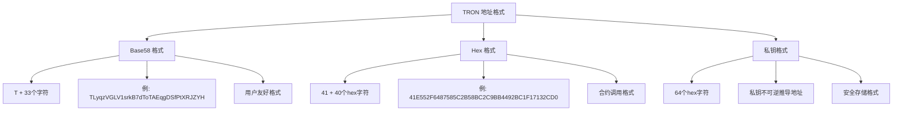

# 🏷️ 地址工具 API 详细文档

> TRON 地址验证、格式转换和地址工具的完整指南

## 📋 目录

- [地址系统概述](#地址系统概述)
- [地址验证](#地址验证)
- [地址格式转换](#地址格式转换)
- [地址生成](#地址生成)
- [地址安全检查](#地址安全检查)
- [项目实战应用](#项目实战应用)

## 🎯 地址系统概述

### TRON 地址格式



### 地址类型分类

| 地址类型 | 前缀 | 用途 | 示例 |
|----------|------|------|------|
| **普通地址** | T | 用户账户、转账操作 | `TLyqzVGLV1srkB7dToTAEqgDSfPtXRJZYH` |
| **合约地址** | T | 智能合约部署地址 | `TR7NHqjeKQxGTCi8q8ZY4pL8otSzgjLj6t` |
| **系统合约** | T | TRON 系统内置合约 | `TLsV52sRDL79HXGGm9yzwKibb6BeruhUzy` |

## ✅ 地址验证

### ValidateAddress - 验证地址格式

```typescript
/**
 * 验证 TRON 地址格式和有效性
 * 官方文档: https://developers.tron.network/reference/validateaddress
 */
async function validateAddress(address: string): Promise<{
  result: boolean;
  message?: string;
}> {
  try {
    console.log(`🔍 Validating TRON address: ${address}`);

    // 使用官方 API 验证
    const validation = await tronWeb.trx.validateAddress(address);
    
    console.log(`✅ Address validation result:`, validation);
    
    return {
      result: validation.result || false,
      message: validation.message
    };

  } catch (error) {
    console.error(`❌ Address validation failed:`, error);
    return {
      result: false,
      message: error.message
    };
  }
}

/**
 * 使用 TronWeb 的本地验证（更快）
 */
function validateAddressLocally(address: string): {
  isValid: boolean;
  isBase58: boolean;
  isHex: boolean;
  addressType: 'base58' | 'hex' | 'invalid';
  errors: string[];
} {
  const errors: string[] = [];
  let isValid = false;
  let isBase58 = false;
  let isHex = false;
  let addressType: 'base58' | 'hex' | 'invalid' = 'invalid';

  try {
    // 基本格式检查
    if (!address || typeof address !== 'string') {
      errors.push('地址不能为空');
      return { isValid, isBase58, isHex, addressType, errors };
    }

    // 检查 Base58 格式
    if (address.startsWith('T') && address.length === 34) {
      isBase58 = tronWeb.isAddress(address);
      if (isBase58) {
        isValid = true;
        addressType = 'base58';
      } else {
        errors.push('Base58 格式校验失败');
      }
    }
    // 检查 Hex 格式
    else if (address.startsWith('41') && address.length === 42) {
      try {
        const base58Address = tronWeb.address.fromHex(address);
        isHex = tronWeb.isAddress(base58Address);
        if (isHex) {
          isValid = true;
          addressType = 'hex';
        } else {
          errors.push('Hex 格式校验失败');
        }
      } catch {
        errors.push('无效的 Hex 格式');
      }
    }
    else {
      errors.push('地址格式不正确（应以T开头34位或41开头42位）');
    }

    console.log(`🔍 Local validation: ${address} -> ${isValid ? '✅' : '❌'}`);

    return { isValid, isBase58, isHex, addressType, errors };

  } catch (error) {
    errors.push(`验证过程出错: ${error.message}`);
    return { isValid, isBase58, isHex, addressType, errors };
  }
}

// 项目中的地址验证服务
export class AddressValidationService {
  /**
   * 增强的地址验证（结合本地和远程验证）
   */
  static async comprehensiveAddressValidation(address: string): Promise<{
    isValid: boolean;
    confidence: 'high' | 'medium' | 'low';
    details: {
      localValidation: any;
      remoteValidation?: any;
      normalizedAddress: string;
      addressType: string;
    };
    issues: string[];
    recommendations: string[];
  }> {
    try {
      console.log(`🔬 Comprehensive validation for: ${address}`);

      const issues: string[] = [];
      const recommendations: string[] = [];

      // 1. 本地验证
      const localValidation = validateAddressLocally(address);
      
      if (!localValidation.isValid) {
        return {
          isValid: false,
          confidence: 'low',
          details: {
            localValidation,
            normalizedAddress: address,
            addressType: 'invalid'
          },
          issues: localValidation.errors,
          recommendations: ['请检查地址格式是否正确']
        };
      }

      // 2. 标准化地址（统一转为 Base58 格式）
      let normalizedAddress = address;
      if (localValidation.addressType === 'hex') {
        normalizedAddress = tronWeb.address.fromHex(address);
        recommendations.push('建议使用 Base58 格式地址');
      }

      // 3. 远程验证（可选，用于最终确认）
      let remoteValidation;
      let confidence: 'high' | 'medium' | 'low' = 'medium';
      
      try {
        remoteValidation = await validateAddress(normalizedAddress);
        confidence = remoteValidation.result ? 'high' : 'low';
        
        if (!remoteValidation.result) {
          issues.push('远程验证失败');
        }
      } catch (error) {
        console.warn('Remote validation failed:', error);
        recommendations.push('无法连接到网络进行最终验证');
      }

      // 4. 安全检查
      const securityCheck = await this.performSecurityCheck(normalizedAddress);
      issues.push(...securityCheck.issues);
      recommendations.push(...securityCheck.recommendations);

      const isValid = localValidation.isValid && (!remoteValidation || remoteValidation.result);

      console.log(`✅ Comprehensive validation completed: ${isValid ? '通过' : '失败'}`);

      return {
        isValid,
        confidence,
        details: {
          localValidation,
          remoteValidation,
          normalizedAddress,
          addressType: localValidation.addressType
        },
        issues,
        recommendations
      };

    } catch (error) {
      console.error('Comprehensive validation failed:', error);
      return {
        isValid: false,
        confidence: 'low',
        details: {
          localValidation: { isValid: false, errors: [error.message] },
          normalizedAddress: address,
          addressType: 'error'
        },
        issues: [`验证过程出错: ${error.message}`],
        recommendations: ['请稍后重试或联系技术支持']
      };
    }
  }

  /**
   * 地址安全检查
   */
  private static async performSecurityCheck(address: string): Promise<{
    issues: string[];
    recommendations: string[];
    riskLevel: 'low' | 'medium' | 'high';
  }> {
    const issues: string[] = [];
    const recommendations: string[] = [];
    let riskLevel: 'low' | 'medium' | 'high' = 'low';

    try {
      // 检查是否是已知的风险地址（可以集成黑名单服务）
      const knownRiskyAddresses = [
        // 这里可以添加已知的风险地址
      ];

      if (knownRiskyAddresses.includes(address)) {
        issues.push('地址在风险地址黑名单中');
        riskLevel = 'high';
        recommendations.push('避免与此地址进行交易');
      }

      // 检查地址是否为零地址
      const zeroAddresses = [
        'T9yD14Nj9j7xAB4dbGeiX9h8unkKHxuWwb', // TRON 零地址
        'TNUC9Qb1rRpS5CbWLmNMxXBjyFoydXjWFR' // 另一个零地址
      ];

      if (zeroAddresses.includes(address)) {
        issues.push('这是一个零地址');
        riskLevel = 'medium';
        recommendations.push('零地址不能用于正常交易');
      }

      // 检查地址模式（简单的启发式检查）
      if (address.includes('000000') || address.includes('111111')) {
        recommendations.push('地址包含重复字符，请确认是否正确');
      }

    } catch (error) {
      console.warn('Security check failed:', error);
    }

    return { issues, recommendations, riskLevel };
  }

  /**
   * 批量验证地址
   */
  static async batchValidateAddresses(addresses: string[]): Promise<Array<{
    address: string;
    isValid: boolean;
    normalizedAddress?: string;
    error?: string;
  }>> {
    console.log(`📋 Batch validating ${addresses.length} addresses`);

    const results = [];
    
    for (let i = 0; i < addresses.length; i++) {
      const address = addresses[i];
      
      try {
        const validation = await this.comprehensiveAddressValidation(address);
        
        results.push({
          address,
          isValid: validation.isValid,
          normalizedAddress: validation.isValid ? validation.details.normalizedAddress : undefined,
          error: validation.isValid ? undefined : validation.issues.join('; ')
        });

      } catch (error) {
        results.push({
          address,
          isValid: false,
          error: error.message
        });
      }

      // 避免请求过于频繁
      if (i < addresses.length - 1) {
        await new Promise(resolve => setTimeout(resolve, 100));
      }
    }

    const validCount = results.filter(r => r.isValid).length;
    console.log(`✅ Batch validation completed: ${validCount}/${addresses.length} valid`);

    return results;
  }
}
```

## 🔄 地址格式转换

### 地址格式转换工具

```typescript
/**
 * TRON 地址格式转换工具集
 */
export class AddressConverter {
  /**
   * Base58 转 Hex 格式
   */
  static base58ToHex(base58Address: string): string {
    try {
      if (!tronWeb.isAddress(base58Address)) {
        throw new Error('Invalid Base58 address');
      }
      
      const hexAddress = tronWeb.address.toHex(base58Address);
      console.log(`🔄 Base58 -> Hex: ${base58Address} -> ${hexAddress}`);
      
      return hexAddress;
    } catch (error) {
      console.error('Base58 to Hex conversion failed:', error);
      throw error;
    }
  }

  /**
   * Hex 转 Base58 格式
   */
  static hexToBase58(hexAddress: string): string {
    try {
      if (!hexAddress.startsWith('41') || hexAddress.length !== 42) {
        throw new Error('Invalid Hex address format');
      }
      
      const base58Address = tronWeb.address.fromHex(hexAddress);
      
      if (!tronWeb.isAddress(base58Address)) {
        throw new Error('Converted address is invalid');
      }
      
      console.log(`🔄 Hex -> Base58: ${hexAddress} -> ${base58Address}`);
      
      return base58Address;
    } catch (error) {
      console.error('Hex to Base58 conversion failed:', error);
      throw error;
    }
  }

  /**
   * 智能地址转换（自动识别格式）
   */
  static smartConvert(address: string, targetFormat: 'base58' | 'hex'): {
    success: boolean;
    originalFormat: 'base58' | 'hex' | 'unknown';
    convertedAddress?: string;
    error?: string;
  } {
    try {
      console.log(`🧠 Smart converting ${address} to ${targetFormat}`);

      const validation = validateAddressLocally(address);
      
      if (!validation.isValid) {
        return {
          success: false,
          originalFormat: 'unknown',
          error: 'Invalid address format'
        };
      }

      const originalFormat = validation.addressType as 'base58' | 'hex';
      
      // 如果已经是目标格式，直接返回
      if (originalFormat === targetFormat) {
        return {
          success: true,
          originalFormat,
          convertedAddress: address
        };
      }

      // 执行转换
      let convertedAddress: string;
      if (targetFormat === 'hex') {
        convertedAddress = this.base58ToHex(address);
      } else {
        convertedAddress = this.hexToBase58(address);
      }

      console.log(`✅ Smart conversion successful: ${originalFormat} -> ${targetFormat}`);

      return {
        success: true,
        originalFormat,
        convertedAddress
      };

    } catch (error) {
      console.error('Smart conversion failed:', error);
      return {
        success: false,
        originalFormat: 'unknown',
        error: error.message
      };
    }
  }

  /**
   * 批量地址转换
   */
  static batchConvert(
    addresses: string[], 
    targetFormat: 'base58' | 'hex'
  ): Array<{
    originalAddress: string;
    convertedAddress?: string;
    success: boolean;
    error?: string;
  }> {
    console.log(`📋 Batch converting ${addresses.length} addresses to ${targetFormat}`);

    return addresses.map(address => {
      const result = this.smartConvert(address, targetFormat);
      
      return {
        originalAddress: address,
        convertedAddress: result.convertedAddress,
        success: result.success,
        error: result.error
      };
    });
  }

  /**
   * 地址格式标准化（统一转换为Base58）
   */
  static normalizeAddress(address: string): {
    normalized: string;
    wasConverted: boolean;
    originalFormat: string;
  } {
    const conversion = this.smartConvert(address, 'base58');
    
    return {
      normalized: conversion.convertedAddress || address,
      wasConverted: conversion.originalFormat !== 'base58',
      originalFormat: conversion.originalFormat
    };
  }

  /**
   * 获取地址校验码
   */
  static getAddressChecksum(address: string): string {
    try {
      const normalized = this.normalizeAddress(address);
      const hex = this.base58ToHex(normalized.normalized);
      
      // 简单的校验码计算（使用地址的最后8位）
      return hex.slice(-8).toUpperCase();
      
    } catch (error) {
      console.error('Failed to get address checksum:', error);
      return 'INVALID';
    }
  }
}
```

## 🎲 地址生成

### 私钥和地址生成

```typescript
/**
 * TRON 地址生成工具
 */
export class AddressGenerator {
  /**
   * 生成新的私钥和地址对
   */
  static generateKeyPair(): {
    privateKey: string;
    publicKey: string;
    address: {
      base58: string;
      hex: string;
    };
    mnemonic?: string;
  } {
    try {
      console.log('🎲 Generating new TRON key pair...');

      // 生成私钥
      const account = tronWeb.utils.accounts.generateAccount();
      
      const keyPair = {
        privateKey: account.privateKey,
        publicKey: account.publicKey,
        address: {
          base58: account.address.base58,
          hex: account.address.hex
        }
      };

      console.log(`✅ Key pair generated:`, {
        address: keyPair.address.base58,
        hasPrivateKey: !!keyPair.privateKey
      });

      return keyPair;

    } catch (error) {
      console.error('Key pair generation failed:', error);
      throw error;
    }
  }

  /**
   * 从私钥恢复地址
   */
  static recoverAddressFromPrivateKey(privateKey: string): {
    address: {
      base58: string;
      hex: string;
    };
    publicKey: string;
    isValid: boolean;
  } {
    try {
      console.log('🔑 Recovering address from private key...');

      // 验证私钥格式
      if (!privateKey || privateKey.length !== 64) {
        throw new Error('Invalid private key format');
      }

      const account = tronWeb.utils.accounts.generateAccount();
      // 这里应该用实际的私钥恢复方法
      // TronWeb 没有直接的 API，所以使用底层方法
      
      const publicKey = ''; // 从私钥计算公钥的方法
      const base58Address = ''; // 从公钥计算地址的方法
      const hexAddress = tronWeb.address.toHex(base58Address);

      return {
        address: {
          base58: base58Address,
          hex: hexAddress
        },
        publicKey,
        isValid: true
      };

    } catch (error) {
      console.error('Address recovery failed:', error);
      return {
        address: {
          base58: '',
          hex: ''
        },
        publicKey: '',
        isValid: false
      };
    }
  }

  /**
   * 生成批量地址（用于测试或临时账户）
   */
  static generateBatchAddresses(count: number): Array<{
    index: number;
    privateKey: string;
    address: string;
    purpose?: string;
  }> {
    console.log(`📦 Generating ${count} addresses...`);

    const addresses = [];
    
    for (let i = 0; i < count; i++) {
      try {
        const keyPair = this.generateKeyPair();
        
        addresses.push({
          index: i,
          privateKey: keyPair.privateKey,
          address: keyPair.address.base58,
          purpose: `test_account_${i}`
        });

      } catch (error) {
        console.error(`Failed to generate address ${i}:`, error);
      }
    }

    console.log(`✅ Generated ${addresses.length}/${count} addresses`);
    return addresses;
  }

  /**
   * 创建虚荣地址（包含特定字符的地址）
   */
  static generateVanityAddress(
    pattern: string, 
    maxAttempts: number = 10000,
    caseSensitive: boolean = false
  ): {
    found: boolean;
    address?: string;
    privateKey?: string;
    attempts: number;
    timeSpent: number;
  } {
    console.log(`✨ Generating vanity address with pattern: ${pattern}`);
    
    const startTime = Date.now();
    const searchPattern = caseSensitive ? pattern : pattern.toLowerCase();
    let attempts = 0;

    for (let i = 0; i < maxAttempts; i++) {
      attempts++;
      
      try {
        const keyPair = this.generateKeyPair();
        const addressToCheck = caseSensitive ? 
          keyPair.address.base58 : 
          keyPair.address.base58.toLowerCase();

        if (addressToCheck.includes(searchPattern)) {
          const timeSpent = Date.now() - startTime;
          
          console.log(`🎊 Vanity address found after ${attempts} attempts (${timeSpent}ms)!`);
          
          return {
            found: true,
            address: keyPair.address.base58,
            privateKey: keyPair.privateKey,
            attempts,
            timeSpent
          };
        }

        // 每1000次尝试输出一次进度
        if (i % 1000 === 0 && i > 0) {
          console.log(`🔍 Vanity address search: ${i}/${maxAttempts} attempts`);
        }

      } catch (error) {
        console.warn(`Vanity generation attempt ${i} failed:`, error);
      }
    }

    const timeSpent = Date.now() - startTime;
    console.log(`❌ Vanity address not found after ${attempts} attempts (${timeSpent}ms)`);

    return {
      found: false,
      attempts,
      timeSpent
    };
  }
}
```

## 🛡️ 地址安全检查

### 安全检查和风险评估

```typescript
/**
 * 地址安全检查服务
 */
export class AddressSecurityService {
  // 已知的高风险地址列表（示例）
  private static readonly RISKY_ADDRESSES = new Set([
    // 这里可以添加已知的诈骗地址、黑洞地址等
    'T9yD14Nj9j7xAB4dbGeiX9h8unkKHxuWwb', // 零地址
  ]);

  // 系统合约地址
  private static readonly SYSTEM_CONTRACTS = new Set([
    'TLsV52sRDL79HXGGm9yzwKibb6BeruhUzy', // 系统合约示例
  ]);

  /**
   * 综合安全检查
   */
  static async performSecurityCheck(address: string): Promise<{
    riskLevel: 'low' | 'medium' | 'high' | 'critical';
    riskScore: number; // 0-100
    checks: Array<{
      name: string;
      status: 'pass' | 'warn' | 'fail';
      message: string;
      impact: number; // 对风险分数的影响
    }>;
    recommendations: string[];
    safeToUse: boolean;
  }> {
    try {
      console.log(`🛡️ Performing security check for: ${address}`);

      const checks: Array<{
        name: string;
        status: 'pass' | 'warn' | 'fail';
        message: string;
        impact: number;
      }> = [];
      
      const recommendations: string[] = [];
      let riskScore = 0;

      // 1. 基础格式检查
      const formatCheck = validateAddressLocally(address);
      if (formatCheck.isValid) {
        checks.push({
          name: '地址格式检查',
          status: 'pass',
          message: '地址格式有效',
          impact: 0
        });
      } else {
        checks.push({
          name: '地址格式检查',
          status: 'fail',
          message: formatCheck.errors.join('; '),
          impact: 50
        });
        riskScore += 50;
      }

      // 2. 黑名单检查
      if (this.RISKY_ADDRESSES.has(address)) {
        checks.push({
          name: '黑名单检查',
          status: 'fail',
          message: '地址在风险黑名单中',
          impact: 40
        });
        riskScore += 40;
        recommendations.push('⚠️ 避免与此地址进行任何交易');
      } else {
        checks.push({
          name: '黑名单检查',
          status: 'pass',
          message: '地址不在已知风险列表中',
          impact: 0
        });
      }

      // 3. 零地址检查
      const zeroAddresses = [
        'T9yD14Nj9j7xAB4dbGeiX9h8unkKHxuWwb',
        'TNUC9Qb1rRpS5CbWLmNMxXBjyFoydXjWFR'
      ];
      
      if (zeroAddresses.includes(address)) {
        checks.push({
          name: '零地址检查',
          status: 'warn',
          message: '这是一个零地址',
          impact: 20
        });
        riskScore += 20;
        recommendations.push('💡 零地址通常用于销毁代币，请确认操作意图');
      } else {
        checks.push({
          name: '零地址检查',
          status: 'pass',
          message: '不是零地址',
          impact: 0
        });
      }

      // 4. 系统合约检查
      if (this.SYSTEM_CONTRACTS.has(address)) {
        checks.push({
          name: '系统合约检查',
          status: 'warn',
          message: '这是一个系统合约地址',
          impact: 10
        });
        riskScore += 10;
        recommendations.push('🔧 系统合约地址，请确认交互方式');
      } else {
        checks.push({
          name: '系统合约检查',
          status: 'pass',
          message: '不是系统合约地址',
          impact: 0
        });
      }

      // 5. 地址模式检查
      const patternCheck = this.checkAddressPattern(address);
      checks.push(patternCheck);
      riskScore += patternCheck.impact;
      
      if (patternCheck.status === 'warn') {
        recommendations.push('🔍 请仔细核对地址是否正确');
      }

      // 6. 账户活跃度检查（如果可能）
      try {
        const activityCheck = await this.checkAccountActivity(address);
        checks.push(activityCheck);
        riskScore += activityCheck.impact;
        
        if (activityCheck.status === 'warn') {
          recommendations.push('📊 账户活跃度异常，建议谨慎操作');
        }
      } catch (error) {
        console.warn('Activity check failed:', error);
      }

      // 确定风险级别
      let riskLevel: 'low' | 'medium' | 'high' | 'critical';
      if (riskScore >= 70) riskLevel = 'critical';
      else if (riskScore >= 50) riskLevel = 'high';
      else if (riskScore >= 30) riskLevel = 'medium';
      else riskLevel = 'low';

      const safeToUse = riskLevel === 'low' || riskLevel === 'medium';

      // 通用建议
      if (!safeToUse) {
        recommendations.push('🚫 不建议与此地址进行交易');
      }
      
      if (recommendations.length === 0) {
        recommendations.push('✅ 地址安全检查通过，可以正常使用');
      }

      console.log(`🛡️ Security check completed: ${riskLevel} risk (${riskScore}/100)`);

      return {
        riskLevel,
        riskScore,
        checks,
        recommendations,
        safeToUse
      };

    } catch (error) {
      console.error('Security check failed:', error);
      return {
        riskLevel: 'critical',
        riskScore: 100,
        checks: [{
          name: '安全检查',
          status: 'fail',
          message: `检查过程出错: ${error.message}`,
          impact: 100
        }],
        recommendations: ['❌ 安全检查失败，建议暂停操作'],
        safeToUse: false
      };
    }
  }

  /**
   * 地址模式检查
   */
  private static checkAddressPattern(address: string): {
    name: string;
    status: 'pass' | 'warn' | 'fail';
    message: string;
    impact: number;
  } {
    // 检查重复字符模式
    const hasRepeatingChars = /(.)\1{4,}/.test(address); // 5个或更多重复字符
    const hasSequentialChars = this.hasSequentialPattern(address);
    
    if (hasRepeatingChars || hasSequentialChars) {
      return {
        name: '地址模式检查',
        status: 'warn',
        message: '地址包含异常模式（重复或连续字符）',
        impact: 15
      };
    }

    return {
      name: '地址模式检查',
      status: 'pass',
      message: '地址模式正常',
      impact: 0
    };
  }

  /**
   * 检查连续字符模式
   */
  private static hasSequentialPattern(address: string): boolean {
    const sequences = ['0123456789', '9876543210', 'abcdefghij', 'zyxwvutsrq'];
    
    for (const seq of sequences) {
      for (let i = 0; i <= seq.length - 4; i++) {
        if (address.toLowerCase().includes(seq.slice(i, i + 4))) {
          return true;
        }
      }
    }
    
    return false;
  }

  /**
   * 账户活跃度检查
   */
  private static async checkAccountActivity(address: string): Promise<{
    name: string;
    status: 'pass' | 'warn' | 'fail';
    message: string;
    impact: number;
  }> {
    try {
      // 获取账户信息
      const account = await tronWeb.trx.getAccount(address);
      
      // 检查账户是否存在
      if (!account || Object.keys(account).length === 0) {
        return {
          name: '账户活跃度检查',
          status: 'warn',
          message: '账户未激活或无交易记录',
          impact: 5
        };
      }

      // 检查最近活跃情况（简化版本）
      const hasRecentActivity = account.latest_opration_time && 
        (Date.now() - account.latest_opration_time < 30 * 24 * 60 * 60 * 1000); // 30天内

      if (!hasRecentActivity) {
        return {
          name: '账户活跃度检查',
          status: 'warn',
          message: '账户长时间无活跃记录',
          impact: 3
        };
      }

      return {
        name: '账户活跃度检查',
        status: 'pass',
        message: '账户活跃度正常',
        impact: 0
      };

    } catch (error) {
      return {
        name: '账户活跃度检查',
        status: 'warn',
        message: '无法获取账户活跃度信息',
        impact: 2
      };
    }
  }

  /**
   * 批量安全检查
   */
  static async batchSecurityCheck(addresses: string[]): Promise<Array<{
    address: string;
    riskLevel: string;
    riskScore: number;
    safeToUse: boolean;
    summary: string;
  }>> {
    console.log(`🛡️ Batch security check for ${addresses.length} addresses`);

    const results = [];
    
    for (const address of addresses) {
      try {
        const check = await this.performSecurityCheck(address);
        
        results.push({
          address,
          riskLevel: check.riskLevel,
          riskScore: check.riskScore,
          safeToUse: check.safeToUse,
          summary: `${check.riskLevel.toUpperCase()} 风险 (${check.riskScore}/100分)`
        });

      } catch (error) {
        results.push({
          address,
          riskLevel: 'critical',
          riskScore: 100,
          safeToUse: false,
          summary: '检查失败'
        });
      }

      // 避免请求过于频繁
      await new Promise(resolve => setTimeout(resolve, 100));
    }

    const safeCount = results.filter(r => r.safeToUse).length;
    console.log(`🛡️ Batch security check completed: ${safeCount}/${addresses.length} safe`);

    return results;
  }
}
```

## 💡 项目实战应用

### 项目中的地址管理系统

```typescript
// 项目中的完整地址管理服务
export class ProjectAddressService {
  private static addressCache = new Map<string, {
    validation: any;
    security: any;
    timestamp: number;
  }>();

  /**
   * 用户输入地址的智能处理
   */
  static async processUserInputAddress(
    userInput: string,
    options: {
      requireSecurity: boolean;
      allowTestnet: boolean;
      preferredFormat: 'base58' | 'hex';
    } = {
      requireSecurity: true,
      allowTestnet: false,
      preferredFormat: 'base58'
    }
  ): Promise<{
    success: boolean;
    processedAddress?: string;
    originalInput: string;
    validationDetails: any;
    securityReport?: any;
    userMessage: string;
    actionRequired?: string;
  }> {
    try {
      console.log(`🔄 Processing user input address: ${userInput}`);

      // 1. 基础清理
      const cleanedInput = userInput.trim().replace(/\s+/g, '');
      
      if (!cleanedInput) {
        return {
          success: false,
          originalInput: userInput,
          validationDetails: null,
          userMessage: '❌ 地址不能为空，请输入有效的 TRON 地址'
        };
      }

      // 2. 格式验证和转换
      const validation = await AddressValidationService.comprehensiveAddressValidation(cleanedInput);
      
      if (!validation.isValid) {
        return {
          success: false,
          originalInput: userInput,
          validationDetails: validation,
          userMessage: `❌ 地址格式无效: ${validation.issues.join(', ')}\n\n💡 ${validation.recommendations.join('\n')}`
        };
      }

      // 3. 格式标准化
      const conversion = AddressConverter.smartConvert(
        validation.details.normalizedAddress, 
        options.preferredFormat
      );
      
      const processedAddress = conversion.convertedAddress || validation.details.normalizedAddress;

      // 4. 安全检查
      let securityReport;
      let userMessage = '✅ 地址验证通过';
      let actionRequired;

      if (options.requireSecurity) {
        securityReport = await AddressSecurityService.performSecurityCheck(processedAddress);
        
        if (!securityReport.safeToUse) {
          return {
            success: false,
            processedAddress,
            originalInput: userInput,
            validationDetails: validation,
            securityReport,
            userMessage: `⚠️ 安全检查未通过 (${securityReport.riskLevel.toUpperCase()} 风险)\n\n${securityReport.recommendations.join('\n')}`,
            actionRequired: 'SECURITY_CONFIRMATION'
          };
        }

        if (securityReport.riskLevel === 'medium') {
          userMessage = `⚠️ 地址验证通过，但存在中等风险\n\n${securityReport.recommendations.join('\n')}`;
          actionRequired = 'USER_CONFIRMATION';
        } else if (securityReport.riskLevel === 'low') {
          userMessage = '✅ 地址验证和安全检查均通过';
        }
      }

      // 5. 缓存结果
      this.addressCache.set(processedAddress, {
        validation,
        security: securityReport,
        timestamp: Date.now()
      });

      console.log(`✅ Address processing successful: ${processedAddress}`);

      return {
        success: true,
        processedAddress,
        originalInput: userInput,
        validationDetails: validation,
        securityReport,
        userMessage,
        actionRequired
      };

    } catch (error) {
      console.error('Address processing failed:', error);
      return {
        success: false,
        originalInput: userInput,
        validationDetails: null,
        userMessage: `❌ 处理地址时发生错误: ${error.message}\n\n💡 请检查地址格式或稍后重试`
      };
    }
  }

  /**
   * 为Telegram Bot格式化地址显示
   */
  static formatAddressForTelegram(
    address: string,
    options: {
      showChecksum: boolean;
      showQRCode: boolean;
      maxLength: number;
    } = {
      showChecksum: true,
      showQRCode: false,
      maxLength: 20
    }
  ): {
    formatted: string;
    displayText: string;
    qrCodeUrl?: string;
  } {
    try {
      // 地址截断显示
      const truncated = address.length > options.maxLength ? 
        `${address.slice(0, 6)}...${address.slice(-6)}` : 
        address;

      let displayText = `📍 地址: \`${truncated}\`\n`;
      
      if (options.showChecksum) {
        const checksum = AddressConverter.getAddressChecksum(address);
        displayText += `🔖 校验: \`${checksum}\`\n`;
      }

      // 生成二维码URL（如果需要）
      let qrCodeUrl;
      if (options.showQRCode) {
        qrCodeUrl = `https://api.qrserver.com/v1/create-qr-code/?size=200x200&data=${encodeURIComponent(address)}`;
        displayText += `📱 [查看二维码](${qrCodeUrl})\n`;
      }

      return {
        formatted: truncated,
        displayText: displayText.trim(),
        qrCodeUrl
      };

    } catch (error) {
      console.error('Address formatting failed:', error);
      return {
        formatted: address,
        displayText: `📍 地址: ${address}`,
      };
    }
  }

  /**
   * 获取地址的完整报告
   */
  static async generateAddressReport(address: string): Promise<string> {
    try {
      console.log(`📊 Generating address report for: ${address}`);

      const [validation, security] = await Promise.all([
        AddressValidationService.comprehensiveAddressValidation(address),
        AddressSecurityService.performSecurityCheck(address)
      ]);

      let report = `📋 地址分析报告\n\n`;
      
      // 基本信息
      report += `📍 地址: \`${address}\`\n`;
      report += `✅ 格式: ${validation.details.addressType.toUpperCase()}\n`;
      report += `🎯 标准化: \`${validation.details.normalizedAddress}\`\n\n`;

      // 验证状态
      report += `🔍 验证状态: ${validation.isValid ? '✅ 通过' : '❌ 失败'}\n`;
      report += `📊 可信度: ${validation.confidence.toUpperCase()}\n\n`;

      // 安全评估
      report += `🛡️ 安全评估\n`;
      report += `📈 风险等级: ${security.riskLevel.toUpperCase()}\n`;
      report += `💯 安全分数: ${100 - security.riskScore}/100\n`;
      report += `✨ 使用建议: ${security.safeToUse ? '可以使用' : '不建议使用'}\n\n`;

      // 检查详情
      const passedChecks = security.checks.filter(c => c.status === 'pass').length;
      const totalChecks = security.checks.length;
      report += `🔍 安全检查: ${passedChecks}/${totalChecks} 项通过\n\n`;

      // 建议
      if (security.recommendations.length > 0) {
        report += `💡 建议:\n`;
        security.recommendations.forEach((rec, index) => {
          report += `${index + 1}. ${rec}\n`;
        });
      }

      console.log(`📊 Address report generated successfully`);
      return report;

    } catch (error) {
      console.error('Address report generation failed:', error);
      return `❌ 生成地址报告失败: ${error.message}`;
    }
  }

  /**
   * 清理地址缓存
   */
  static clearAddressCache(): void {
    this.addressCache.clear();
    console.log('🧹 Address cache cleared');
  }

  /**
   * 获取缓存统计
   */
  static getCacheStats(): {
    size: number;
    memory: number;
    oldestEntry?: Date;
  } {
    let oldestTimestamp = Date.now();
    
    for (const entry of this.addressCache.values()) {
      if (entry.timestamp < oldestTimestamp) {
        oldestTimestamp = entry.timestamp;
      }
    }

    return {
      size: this.addressCache.size,
      memory: JSON.stringify([...this.addressCache.entries()]).length,
      oldestEntry: this.addressCache.size > 0 ? new Date(oldestTimestamp) : undefined
    };
  }
}
```

## 🔗 相关文档

- [TRON API 主文档](./README.md) - 完整 API 导航
- [账户管理 API](./02-accounts-api.md) - 账户信息查询
- [交易管理 API](./04-transactions-api.md) - 交易处理流程
- [项目实战示例](./10-project-examples.md) - 地址管理实际应用

---

> 💡 **最佳实践提示**
> 
> 1. **验证优先** - 在使用任何地址前都要进行验证
> 2. **安全检查** - 对高价值交易进行安全风险评估
> 3. **格式统一** - 项目内部统一使用 Base58 格式
> 4. **缓存机制** - 合理缓存验证结果提高性能
> 5. **用户友好** - 提供清晰的错误信息和修复建议
