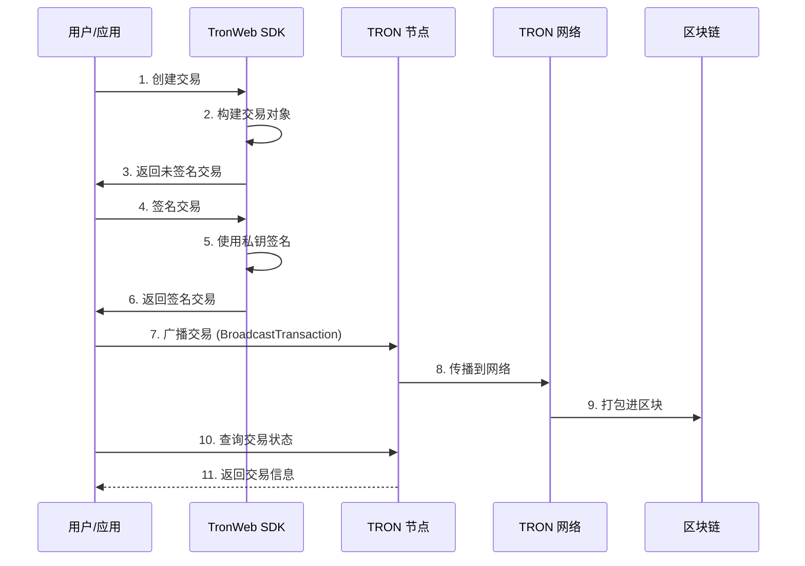

# 🔄 交易处理 API 详细文档

> TRON 网络交易创建、广播、查询和状态监控的完整指南

## 📋 目录

- [交易系统概述](#交易系统概述)
- [交易创建](#交易创建)
- [交易广播](#交易广播)
- [交易查询](#交易查询)
- [交易状态监控](#交易状态监控)
- [交易费用管理](#交易费用管理)
- [项目实战应用](#项目实战应用)

## 🎯 交易系统概述

### TRON 交易流程



### 交易类型分类

| 交易类型 | 说明 | 主要 API | 项目使用场景 |
|----------|------|----------|-------------|
| **TransferContract** | TRX转账 | `sendTrx` | 用户充值、激活账户 |
| **FreezeBalanceV2Contract** | 冻结获取资源 | `freezeBalanceV2` | 获取能量资源 |
| **DelegateResourceContract** | 委托资源 | `delegateResource` | 能量委托核心 |
| **TriggerSmartContract** | 智能合约调用 | `triggerSmartContract` | USDT转账 |
| **UnfreezeBalanceV2Contract** | 解冻回收资源 | `unfreezeBalanceV2` | 资源回收 |

## 🏗️ 交易创建

### CreateTransaction - 创建基础交易

```typescript
/**
 * 创建 TRX 转账交易
 * 官方文档: https://developers.tron.network/reference/createtransaction
 */
async function createTrxTransferTransaction(
  toAddress: string,
  amount: number, // TRX 数量
  fromAddress?: string
): Promise<{
  success: boolean;
  transaction?: any;
  error?: string;
}> {
  try {
    console.log(`🏗️ Creating TRX transfer transaction: ${amount} TRX to ${toAddress}`);

    const from = fromAddress || tronWeb.defaultAddress.base58;
    const amountSun = amount * 1000000; // 转换为 Sun

    // 验证地址
    if (!tronWeb.isAddress(toAddress) || !tronWeb.isAddress(from)) {
      throw new Error('Invalid address format');
    }

    // 检查余额
    const balance = await tronWeb.trx.getBalance(from);
    if (balance < amountSun) {
      throw new Error(`Insufficient balance: ${balance / 1000000} TRX < ${amount} TRX`);
    }

    // 创建交易
    const transaction = await tronWeb.transactionBuilder.sendTrx(
      toAddress,
      amountSun,
      from
    );

    console.log(`✅ TRX transfer transaction created:`, {
      txID: transaction.txID,
      from,
      to: toAddress,
      amount: `${amount} TRX`
    });

    return {
      success: true,
      transaction
    };

  } catch (error) {
    console.error(`❌ Failed to create TRX transfer transaction:`, error);
    return {
      success: false,
      error: error.message
    };
  }
}

/**
 * 创建智能合约调用交易
 */
async function createSmartContractTransaction(
  contractAddress: string,
  functionSelector: string,
  parameters: any[],
  feeLimit: number = 150000000, // 150 TRX
  callValue: number = 0,
  fromAddress?: string
): Promise<{
  success: boolean;
  transaction?: any;
  estimatedEnergy?: number;
  error?: string;
}> {
  try {
    console.log(`🏗️ Creating smart contract transaction: ${contractAddress}.${functionSelector}`);

    const from = fromAddress || tronWeb.defaultAddress.base58;

    // 验证合约地址
    if (!tronWeb.isAddress(contractAddress)) {
      throw new Error('Invalid contract address');
    }

    // 获取合约实例
    const contract = await tronWeb.contract().at(contractAddress);
    
    // 估算能量消耗
    let estimatedEnergy = 0;
    try {
      const energyEstimate = await tronWeb.transactionBuilder.estimateEnergy(
        contractAddress,
        functionSelector,
        {},
        parameters,
        from
      );
      estimatedEnergy = energyEstimate.energy_required || 0;
      
      console.log(`⚡ Estimated energy: ${estimatedEnergy.toLocaleString()}`);
    } catch (error) {
      console.warn('Energy estimation failed:', error);
    }

    // 创建交易
    const transaction = await tronWeb.transactionBuilder.triggerSmartContract(
      contractAddress,
      functionSelector,
      {
        feeLimit,
        callValue
      },
      parameters,
      from
    );

    if (!transaction.result || !transaction.result.result) {
      throw new Error(transaction.result?.message || 'Contract call failed');
    }

    console.log(`✅ Smart contract transaction created:`, {
      txID: transaction.transaction.txID,
      contract: contractAddress,
      function: functionSelector,
      estimatedEnergy
    });

    return {
      success: true,
      transaction: transaction.transaction,
      estimatedEnergy
    };

  } catch (error) {
    console.error(`❌ Failed to create smart contract transaction:`, error);
    return {
      success: false,
      error: error.message
    };
  }
}

// 项目中的交易创建服务
export class TransactionBuilder {
  /**
   * 创建能量委托交易
   */
  static async createEnergyDelegationTransaction(
    recipientAddress: string,
    energyAmount: number,
    lockTime: number = 0
  ): Promise<{
    success: boolean;
    transaction?: any;
    estimatedCost?: {
      bandwidth: number;
      energy: number;
    };
    error?: string;
  }> {
    try {
      console.log(`⚡ Creating energy delegation transaction: ${energyAmount.toLocaleString()} to ${recipientAddress}`);

      // 检查当前资源状态
      const resources = await tronWeb.trx.getAccountResources();
      const availableEnergy = (resources.EnergyLimit || 0) - (resources.EnergyUsed || 0);

      if (availableEnergy < energyAmount) {
        throw new Error(`Insufficient energy: ${availableEnergy} < ${energyAmount}`);
      }

      // 创建委托交易
      const transaction = await tronWeb.transactionBuilder.delegateResource(
        energyAmount,
        recipientAddress,
        'ENERGY',
        tronWeb.defaultAddress.base58,
        lockTime > 0,
        lockTime
      );

      // 估算费用
      const estimatedCost = {
        bandwidth: 345, // 委托操作大约需要345字节带宽
        energy: 28000   // 委托操作大约需要28000能量
      };

      console.log(`✅ Energy delegation transaction created: ${transaction.txID}`);

      return {
        success: true,
        transaction,
        estimatedCost
      };

    } catch (error) {
      console.error(`❌ Failed to create energy delegation transaction:`, error);
      return {
        success: false,
        error: error.message
      };
    }
  }

  /**
   * 创建 USDT 转账交易
   */
  static async createUSDTTransferTransaction(
    recipientAddress: string,
    amount: number,
    decimals: number = 6
  ): Promise<{
    success: boolean;
    transaction?: any;
    estimatedEnergy?: number;
    error?: string;
  }> {
    try {
      console.log(`💰 Creating USDT transfer transaction: ${amount} USDT to ${recipientAddress}`);

      const USDT_CONTRACT = 'TR7NHqjeKQxGTCi8q8ZY4pL8otSzgjLj6t';
      const transferAmount = amount * Math.pow(10, decimals);

      // 检查 USDT 余额
      const contract = await tronWeb.contract().at(USDT_CONTRACT);
      const balance = await contract.balanceOf(tronWeb.defaultAddress.base58).call();
      
      if (balance.toNumber() < transferAmount) {
        throw new Error(`Insufficient USDT balance: ${balance.toNumber() / Math.pow(10, decimals)} < ${amount}`);
      }

      // 创建转账交易
      const result = await createSmartContractTransaction(
        USDT_CONTRACT,
        'transfer(address,uint256)',
        [
          {type: 'address', value: recipientAddress},
          {type: 'uint256', value: transferAmount}
        ],
        150000000 // 150 TRX fee limit
      );

      if (result.success) {
        console.log(`✅ USDT transfer transaction created: ${result.transaction.txID}`);
      }

      return result;

    } catch (error) {
      console.error(`❌ Failed to create USDT transfer transaction:`, error);
      return {
        success: false,
        error: error.message
      };
    }
  }

  /**
   * 批量创建交易（用于批处理操作）
   */
  static async createBatchTransactions(operations: Array<{
    type: 'TRX_TRANSFER' | 'USDT_TRANSFER' | 'ENERGY_DELEGATE';
    params: any;
  }>): Promise<Array<{
    index: number;
    type: string;
    success: boolean;
    transaction?: any;
    error?: string;
  }>> {
    console.log(`📦 Creating batch of ${operations.length} transactions`);

    const results = [];

    for (let i = 0; i < operations.length; i++) {
      const operation = operations[i];
      
      try {
        let result;

        switch (operation.type) {
          case 'TRX_TRANSFER':
            result = await createTrxTransferTransaction(
              operation.params.to,
              operation.params.amount,
              operation.params.from
            );
            break;
            
          case 'USDT_TRANSFER':
            result = await this.createUSDTTransferTransaction(
              operation.params.to,
              operation.params.amount
            );
            break;
            
          case 'ENERGY_DELEGATE':
            result = await this.createEnergyDelegationTransaction(
              operation.params.to,
              operation.params.energy,
              operation.params.lockTime
            );
            break;
            
          default:
            throw new Error(`Unknown operation type: ${operation.type}`);
        }

        results.push({
          index: i,
          type: operation.type,
          success: result.success,
          transaction: result.transaction,
          error: result.error
        });

      } catch (error) {
        results.push({
          index: i,
          type: operation.type,
          success: false,
          error: error.message
        });
      }

      // 避免创建过于频繁
      if (i < operations.length - 1) {
        await new Promise(resolve => setTimeout(resolve, 100));
      }
    }

    const successCount = results.filter(r => r.success).length;
    console.log(`✅ Batch transaction creation completed: ${successCount}/${operations.length} successful`);

    return results;
  }
}
```

## 📡 交易广播

### BroadcastTransaction - 广播已签名交易

```typescript
/**
 * 广播已签名的交易
 * 官方文档: https://developers.tron.network/reference/broadcasttransaction
 */
async function broadcastSignedTransaction(signedTransaction: any): Promise<{
  success: boolean;
  txId?: string;
  result?: any;
  error?: string;
}> {
  try {
    console.log(`📡 Broadcasting signed transaction: ${signedTransaction.txID}`);

    const result = await tronWeb.trx.sendRawTransaction(signedTransaction);

    if (result.result) {
      console.log(`✅ Transaction broadcast successful: ${result.txid || signedTransaction.txID}`);
      
      return {
        success: true,
        txId: result.txid || signedTransaction.txID,
        result
      };
    } else {
      const errorMessage = result.message || result.code || 'Unknown broadcast error';
      throw new Error(errorMessage);
    }

  } catch (error) {
    console.error(`❌ Transaction broadcast failed:`, error);
    return {
      success: false,
      error: error.message
    };
  }
}

/**
 * 广播十六进制格式的交易
 * 官方文档: https://developers.tron.network/reference/broadcasthex
 */
async function broadcastHexTransaction(hexTransaction: string): Promise<{
  success: boolean;
  txId?: string;
  error?: string;
}> {
  try {
    console.log(`📡 Broadcasting hex transaction: ${hexTransaction.substring(0, 20)}...`);

    const result = await tronWeb.trx.broadcastHex(hexTransaction);

    if (result.result) {
      console.log(`✅ Hex transaction broadcast successful: ${result.txid}`);
      
      return {
        success: true,
        txId: result.txid
      };
    } else {
      throw new Error(result.message || 'Hex broadcast failed');
    }

  } catch (error) {
    console.error(`❌ Hex transaction broadcast failed:`, error);
    return {
      success: false,
      error: error.message
    };
  }
}

// 项目中的交易广播服务
export class TransactionBroadcaster {
  private static broadcastQueue: Array<{
    id: string;
    transaction: any;
    retryCount: number;
    maxRetries: number;
    callback?: (result: any) => void;
  }> = [];

  private static isProcessing = false;

  /**
   * 智能交易广播（带重试和队列管理）
   */
  static async smartBroadcast(
    signedTransaction: any,
    options: {
      maxRetries: number;
      retryDelay: number;
      priority: 'high' | 'normal' | 'low';
      onProgress?: (status: string, details?: any) => void;
    } = {
      maxRetries: 3,
      retryDelay: 2000,
      priority: 'normal'
    }
  ): Promise<{
    success: boolean;
    txId?: string;
    attempts: number;
    totalTime: number;
    error?: string;
  }> {
    const startTime = Date.now();
    let attempts = 0;
    let lastError: string = '';

    console.log(`🧠 Smart broadcasting transaction: ${signedTransaction.txID}`);

    for (let i = 0; i <= options.maxRetries; i++) {
      attempts++;
      
      try {
        if (options.onProgress) {
          options.onProgress(`尝试广播 (第 ${attempts} 次)`, {
            attempt: attempts,
            maxAttempts: options.maxRetries + 1
          });
        }

        const result = await broadcastSignedTransaction(signedTransaction);
        
        if (result.success) {
          const totalTime = Date.now() - startTime;
          
          console.log(`✅ Smart broadcast successful after ${attempts} attempts (${totalTime}ms)`);
          
          if (options.onProgress) {
            options.onProgress('广播成功', { txId: result.txId, attempts, totalTime });
          }

          return {
            success: true,
            txId: result.txId,
            attempts,
            totalTime
          };
        } else {
          lastError = result.error || 'Unknown error';
          
          // 某些错误不需要重试
          if (this.isNonRetryableError(lastError)) {
            break;
          }
        }

      } catch (error) {
        lastError = error.message;
        console.warn(`⚠️ Broadcast attempt ${attempts} failed:`, lastError);
      }

      // 如果不是最后一次尝试，等待后重试
      if (i < options.maxRetries) {
        if (options.onProgress) {
          options.onProgress(`等待重试 (${options.retryDelay}ms)`, { nextAttempt: attempts + 1 });
        }
        
        await new Promise(resolve => setTimeout(resolve, options.retryDelay));
        
        // 指数退避：每次重试延迟时间翻倍
        options.retryDelay *= 1.5;
      }
    }

    const totalTime = Date.now() - startTime;
    console.error(`❌ Smart broadcast failed after ${attempts} attempts (${totalTime}ms): ${lastError}`);

    return {
      success: false,
      attempts,
      totalTime,
      error: lastError
    };
  }

  /**
   * 判断是否为不可重试的错误
   */
  private static isNonRetryableError(error: string): boolean {
    const nonRetryableErrors = [
      'insufficient balance',
      'invalid signature',
      'transaction expired',
      'duplicate transaction',
      'invalid address'
    ];

    return nonRetryableErrors.some(err => 
      error.toLowerCase().includes(err.toLowerCase())
    );
  }

  /**
   * 添加交易到广播队列
   */
  static addToQueue(
    transaction: any,
    options: {
      priority: 'high' | 'normal' | 'low';
      maxRetries: number;
      callback?: (result: any) => void;
    } = {
      priority: 'normal',
      maxRetries: 3
    }
  ): string {
    const id = `tx_${Date.now()}_${Math.random().toString(36).substr(2, 9)}`;
    
    const queueItem = {
      id,
      transaction,
      retryCount: 0,
      maxRetries: options.maxRetries,
      callback: options.callback
    };

    // 根据优先级插入队列
    if (options.priority === 'high') {
      this.broadcastQueue.unshift(queueItem);
    } else {
      this.broadcastQueue.push(queueItem);
    }

    console.log(`📋 Added transaction to broadcast queue: ${id} (priority: ${options.priority})`);

    // 启动队列处理
    this.processQueue();

    return id;
  }

  /**
   * 处理广播队列
   */
  private static async processQueue(): Promise<void> {
    if (this.isProcessing || this.broadcastQueue.length === 0) {
      return;
    }

    this.isProcessing = true;
    console.log(`🔄 Processing broadcast queue (${this.broadcastQueue.length} items)`);

    while (this.broadcastQueue.length > 0) {
      const item = this.broadcastQueue.shift()!;
      
      try {
        console.log(`📡 Processing queue item: ${item.id} (attempt ${item.retryCount + 1})`);

        const result = await broadcastSignedTransaction(item.transaction);
        
        if (result.success) {
          console.log(`✅ Queue item broadcast successful: ${item.id}`);
          
          if (item.callback) {
            item.callback({
              success: true,
              txId: result.txId,
              id: item.id
            });
          }
        } else {
          // 重试逻辑
          item.retryCount++;
          
          if (item.retryCount <= item.maxRetries && 
              !this.isNonRetryableError(result.error || '')) {
            
            console.log(`🔄 Retrying queue item: ${item.id} (${item.retryCount}/${item.maxRetries})`);
            
            // 重新加入队列末尾
            this.broadcastQueue.push(item);
          } else {
            console.error(`❌ Queue item failed permanently: ${item.id}`);
            
            if (item.callback) {
              item.callback({
                success: false,
                error: result.error,
                id: item.id,
                finalAttempt: true
              });
            }
          }
        }

      } catch (error) {
        console.error(`❌ Queue processing error for ${item.id}:`, error);
        
        if (item.callback) {
          item.callback({
            success: false,
            error: error.message,
            id: item.id
          });
        }
      }

      // 避免处理过于频繁
      await new Promise(resolve => setTimeout(resolve, 500));
    }

    this.isProcessing = false;
    console.log(`✅ Broadcast queue processing completed`);
  }

  /**
   * 获取队列状态
   */
  static getQueueStatus(): {
    pending: number;
    processing: boolean;
    nextItem?: string;
  } {
    return {
      pending: this.broadcastQueue.length,
      processing: this.isProcessing,
      nextItem: this.broadcastQueue[0]?.id
    };
  }

  /**
   * 清空广播队列
   */
  static clearQueue(): void {
    const cleared = this.broadcastQueue.length;
    this.broadcastQueue = [];
    console.log(`🧹 Cleared broadcast queue (${cleared} items)`);
  }
}
```

## 🔍 交易查询

### GetTransactionById - 查询交易详情

```typescript
/**
 * 根据交易ID查询交易详情
 * 官方文档: https://developers.tron.network/reference/gettransactionbyid
 */
async function getTransactionById(txId: string): Promise<{
  success: boolean;
  transaction?: any;
  exists: boolean;
  error?: string;
}> {
  try {
    console.log(`🔍 Querying transaction by ID: ${txId}`);

    const transaction = await tronWeb.trx.getTransaction(txId);
    
    if (!transaction || Object.keys(transaction).length === 0) {
      console.log(`📭 Transaction not found: ${txId}`);
      return {
        success: true,
        exists: false
      };
    }

    console.log(`✅ Transaction found:`, {
      txId,
      type: transaction.raw_data?.contract?.[0]?.type,
      timestamp: transaction.raw_data?.timestamp
    });

    return {
      success: true,
      transaction,
      exists: true
    };

  } catch (error) {
    console.error(`❌ Failed to query transaction:`, error);
    return {
      success: false,
      exists: false,
      error: error.message
    };
  }
}

/**
 * 查询交易执行信息
 * 官方文档: https://developers.tron.network/reference/gettransactioninfobyid
 */
async function getTransactionInfoById(txId: string): Promise<{
  success: boolean;
  info?: any;
  confirmed: boolean;
  error?: string;
}> {
  try {
    console.log(`ℹ️ Querying transaction info: ${txId}`);

    const info = await tronWeb.trx.getTransactionInfo(txId);
    
    if (!info || Object.keys(info).length === 0) {
      console.log(`📭 Transaction info not found (may not be confirmed yet): ${txId}`);
      return {
        success: true,
        confirmed: false
      };
    }

    const confirmed = !!info.id;
    
    console.log(`✅ Transaction info retrieved:`, {
      txId,
      confirmed,
      result: info.result || 'SUCCESS',
      blockNumber: info.blockNumber
    });

    return {
      success: true,
      info,
      confirmed
    };

  } catch (error) {
    console.error(`❌ Failed to query transaction info:`, error);
    return {
      success: false,
      confirmed: false,
      error: error.message
    };
  }
}

// 项目中的交易查询服务
export class TransactionQueryService {
  private static queryCache = new Map<string, {
    data: any;
    timestamp: number;
    ttl: number;
  }>();

  /**
   * 智能交易查询（结合基础信息和执行信息）
   */
  static async getCompleteTransactionInfo(txId: string): Promise<{
    success: boolean;
    transaction?: any;
    info?: any;
    status: 'pending' | 'confirmed' | 'failed' | 'not_found';
    details: {
      type?: string;
      from?: string;
      to?: string;
      amount?: number;
      fee?: number;
      blockNumber?: number;
      timestamp?: Date;
      confirmations?: number;
    };
    error?: string;
  }> {
    try {
      console.log(`🧠 Getting complete transaction info: ${txId}`);

      // 检查缓存
      const cached = this.queryCache.get(txId);
      if (cached && Date.now() - cached.timestamp < cached.ttl) {
        console.log(`📦 Using cached transaction data: ${txId}`);
        return cached.data;
      }

      // 并行查询交易详情和执行信息
      const [transactionResult, infoResult] = await Promise.all([
        getTransactionById(txId),
        getTransactionInfoById(txId)
      ]);

      if (!transactionResult.success) {
        throw new Error(transactionResult.error);
      }

      if (!transactionResult.exists) {
        return {
          success: true,
          status: 'not_found',
          details: {}
        };
      }

      const transaction = transactionResult.transaction;
      const info = infoResult.info;
      
      // 确定交易状态
      let status: 'pending' | 'confirmed' | 'failed' | 'not_found';
      
      if (!infoResult.confirmed) {
        status = 'pending';
      } else if (info.result === 'SUCCESS' || !info.result) {
        status = 'confirmed';
      } else {
        status = 'failed';
      }

      // 解析交易详情
      const details = this.parseTransactionDetails(transaction, info);

      const result = {
        success: true,
        transaction,
        info,
        status,
        details
      };

      // 缓存已确认的交易（TTL 10分钟），待确认的交易（TTL 1分钟）
      const ttl = status === 'confirmed' ? 10 * 60 * 1000 : 1 * 60 * 1000;
      this.queryCache.set(txId, {
        data: result,
        timestamp: Date.now(),
        ttl
      });

      console.log(`✅ Complete transaction info retrieved: ${txId} (${status})`);

      return result;

    } catch (error) {
      console.error(`❌ Failed to get complete transaction info:`, error);
      return {
        success: false,
        status: 'not_found',
        details: {},
        error: error.message
      };
    }
  }

  /**
   * 解析交易详细信息
   */
  private static parseTransactionDetails(transaction: any, info?: any): {
    type?: string;
    from?: string;
    to?: string;
    amount?: number;
    fee?: number;
    blockNumber?: number;
    timestamp?: Date;
    confirmations?: number;
  } {
    try {
      const contract = transaction.raw_data?.contract?.[0];
      if (!contract) return {};

      const details: any = {
        type: contract.type,
        timestamp: new Date(transaction.raw_data.timestamp),
        blockNumber: info?.blockNumber,
        fee: info ? (info.fee || 0) / 1000000 : undefined // 转换为 TRX
      };

      // 根据交易类型解析具体信息
      switch (contract.type) {
        case 'TransferContract':
          details.from = tronWeb.address.fromHex(contract.parameter.value.owner_address);
          details.to = tronWeb.address.fromHex(contract.parameter.value.to_address);
          details.amount = contract.parameter.value.amount / 1000000; // TRX
          break;

        case 'TriggerSmartContract':
          details.from = tronWeb.address.fromHex(contract.parameter.value.owner_address);
          details.to = tronWeb.address.fromHex(contract.parameter.value.contract_address);
          details.amount = (contract.parameter.value.call_value || 0) / 1000000; // TRX
          break;

        case 'FreezeBalanceV2Contract':
          details.from = tronWeb.address.fromHex(contract.parameter.value.owner_address);
          details.amount = contract.parameter.value.frozen_balance / 1000000; // TRX
          break;

        case 'DelegateResourceContract':
          details.from = tronWeb.address.fromHex(contract.parameter.value.owner_address);
          details.to = tronWeb.address.fromHex(contract.parameter.value.receiver_address);
          details.amount = contract.parameter.value.balance / 1000000; // TRX
          break;
      }

      return details;

    } catch (error) {
      console.warn('Failed to parse transaction details:', error);
      return {};
    }
  }

  /**
   * 批量查询交易状态
   */
  static async batchQueryTransactions(txIds: string[]): Promise<Array<{
    txId: string;
    status: 'pending' | 'confirmed' | 'failed' | 'not_found';
    details?: any;
    error?: string;
  }>> {
    console.log(`📋 Batch querying ${txIds.length} transactions`);

    const results = [];

    // 分批处理，避免并发过高
    const batchSize = 5;
    for (let i = 0; i < txIds.length; i += batchSize) {
      const batch = txIds.slice(i, i + batchSize);
      
      const batchPromises = batch.map(async txId => {
        try {
          const result = await this.getCompleteTransactionInfo(txId);
          
          return {
            txId,
            status: result.status,
            details: result.details,
            error: result.error
          };
        } catch (error) {
          return {
            txId,
            status: 'not_found' as const,
            error: error.message
          };
        }
      });

      const batchResults = await Promise.all(batchPromises);
      results.push(...batchResults);

      // 批次间稍作延迟
      if (i + batchSize < txIds.length) {
        await new Promise(resolve => setTimeout(resolve, 200));
      }
    }

    const statusCounts = results.reduce((acc, r) => {
      acc[r.status] = (acc[r.status] || 0) + 1;
      return acc;
    }, {} as Record<string, number>);

    console.log(`✅ Batch query completed:`, statusCounts);

    return results;
  }

  /**
   * 等待交易确认
   */
  static async waitForConfirmation(
    txId: string,
    options: {
      maxWaitTime: number;
      checkInterval: number;
      onProgress?: (status: string, attempt: number) => void;
    } = {
      maxWaitTime: 60000, // 60秒
      checkInterval: 3000  // 3秒
    }
  ): Promise<{
    confirmed: boolean;
    transaction?: any;
    info?: any;
    waitTime: number;
    attempts: number;
    error?: string;
  }> {
    console.log(`⏳ Waiting for transaction confirmation: ${txId}`);

    const startTime = Date.now();
    let attempts = 0;

    while (Date.now() - startTime < options.maxWaitTime) {
      attempts++;

      try {
        if (options.onProgress) {
          options.onProgress(`检查确认状态 (第 ${attempts} 次)`, attempts);
        }

        const result = await this.getCompleteTransactionInfo(txId);
        
        if (result.status === 'confirmed' || result.status === 'failed') {
          const waitTime = Date.now() - startTime;
          
          console.log(`✅ Transaction ${result.status} after ${waitTime}ms (${attempts} attempts)`);
          
          return {
            confirmed: result.status === 'confirmed',
            transaction: result.transaction,
            info: result.info,
            waitTime,
            attempts
          };
        }

        if (result.status === 'not_found') {
          throw new Error('Transaction not found on network');
        }

        // 等待下次检查
        await new Promise(resolve => setTimeout(resolve, options.checkInterval));

      } catch (error) {
        console.error(`❌ Confirmation check failed:`, error);
        return {
          confirmed: false,
          waitTime: Date.now() - startTime,
          attempts,
          error: error.message
        };
      }
    }

    const waitTime = Date.now() - startTime;
    console.log(`⏰ Transaction confirmation timeout after ${waitTime}ms (${attempts} attempts)`);

    return {
      confirmed: false,
      waitTime,
      attempts,
      error: 'Confirmation timeout'
    };
  }

  /**
   * 清理查询缓存
   */
  static clearCache(): void {
    this.queryCache.clear();
    console.log('🧹 Transaction query cache cleared');
  }
}
```

## 💰 交易费用管理

### 费用估算和优化

```typescript
/**
 * 交易费用估算服务
 */
export class TransactionFeeService {
  /**
   * 估算交易总费用
   */
  static async estimateTransactionFee(
    transactionType: 'TRX_TRANSFER' | 'USDT_TRANSFER' | 'ENERGY_DELEGATE' | 'CONTRACT_CALL',
    params: any
  ): Promise<{
    estimatedFee: {
      bandwidth: number;    // 带宽费用 (TRX)
      energy: number;       // 能量费用 (TRX) 
      total: number;        // 总费用 (TRX)
    };
    resourceRequired: {
      bandwidth: number;    // 需要的带宽
      energy: number;       // 需要的能量
    };
    recommendations: string[];
  }> {
    try {
      console.log(`💰 Estimating fee for ${transactionType}:`, params);

      let estimatedFee = { bandwidth: 0, energy: 0, total: 0 };
      let resourceRequired = { bandwidth: 0, energy: 0 };
      const recommendations: string[] = [];

      // 获取当前资源价格
      const [energyPrices, bandwidthPrices] = await Promise.all([
        tronWeb.trx.getEnergyPrices().catch(() => ({ prices: 420 })), // 默认价格
        tronWeb.trx.getBandwidthPrices().catch(() => ({ prices: 1000 }))
      ]);

      const energyPrice = energyPrices.prices / 1000000; // 转换为 TRX per Energy
      const bandwidthPrice = bandwidthPrices.prices / 1000000; // 转换为 TRX per Bandwidth

      switch (transactionType) {
        case 'TRX_TRANSFER':
          resourceRequired = { bandwidth: 268, energy: 0 };
          estimatedFee.bandwidth = resourceRequired.bandwidth * bandwidthPrice;
          recommendations.push('TRX 转账只需要带宽，不需要能量');
          break;

        case 'USDT_TRANSFER':
          resourceRequired = { bandwidth: 345, energy: 13000 };
          estimatedFee.bandwidth = resourceRequired.bandwidth * bandwidthPrice;
          estimatedFee.energy = resourceRequired.energy * energyPrice;
          recommendations.push('USDT 转账需要较多能量，建议提前准备');
          break;

        case 'ENERGY_DELEGATE':
          resourceRequired = { bandwidth: 345, energy: 28000 };
          estimatedFee.bandwidth = resourceRequired.bandwidth * bandwidthPrice;
          estimatedFee.energy = resourceRequired.energy * energyPrice;
          recommendations.push('能量委托操作消耗较多能量');
          break;

        case 'CONTRACT_CALL':
          // 这里需要更具体的合约信息来估算
          resourceRequired = { bandwidth: 345, energy: params.estimatedEnergy || 50000 };
          estimatedFee.bandwidth = resourceRequired.bandwidth * bandwidthPrice;
          estimatedFee.energy = resourceRequired.energy * energyPrice;
          recommendations.push('智能合约调用费用取决于合约复杂度');
          break;
      }

      estimatedFee.total = estimatedFee.bandwidth + estimatedFee.energy;

      // 费用优化建议
      if (estimatedFee.energy > 10) { // 如果能量费用超过10 TRX
        recommendations.push('💡 建议冻结 TRX 获取能量以降低交易费用');
      }

      if (estimatedFee.bandwidth > 1) { // 如果带宽费用超过1 TRX
        recommendations.push('💡 建议冻结 TRX 获取带宽以降低交易费用');
      }

      console.log(`💰 Fee estimation completed:`, {
        type: transactionType,
        totalFee: estimatedFee.total.toFixed(4),
        energyFee: estimatedFee.energy.toFixed(4),
        bandwidthFee: estimatedFee.bandwidth.toFixed(4)
      });

      return {
        estimatedFee,
        resourceRequired,
        recommendations
      };

    } catch (error) {
      console.error('Fee estimation failed:', error);
      return {
        estimatedFee: { bandwidth: 0, energy: 0, total: 0 },
        resourceRequired: { bandwidth: 0, energy: 0 },
        recommendations: ['费用估算失败，建议预留足够的 TRX 作为手续费']
      };
    }
  }

  /**
   * 优化交易费用
   */
  static async optimizeTransactionFee(
    accountAddress: string,
    plannedTransactions: Array<{
      type: string;
      params: any;
    }>
  ): Promise<{
    currentCost: number;
    optimizedCost: number;
    savings: number;
    optimizationPlan: Array<{
      action: string;
      description: string;
      cost: number;
      benefit: number;
    }>;
  }> {
    try {
      console.log(`🔧 Optimizing transaction fees for ${plannedTransactions.length} transactions`);

      // 计算当前预期费用
      let currentCost = 0;
      const feeEstimations = [];

      for (const tx of plannedTransactions) {
        const estimation = await this.estimateTransactionFee(tx.type as any, tx.params);
        feeEstimations.push(estimation);
        currentCost += estimation.estimatedFee.total;
      }

      // 分析资源需求
      const totalResourceNeeded = feeEstimations.reduce(
        (acc, est) => ({
          bandwidth: acc.bandwidth + est.resourceRequired.bandwidth,
          energy: acc.energy + est.resourceRequired.energy
        }),
        { bandwidth: 0, energy: 0 }
      );

      // 获取当前账户资源状态
      const resources = await tronWeb.trx.getAccountResources(accountAddress);
      const currentResources = {
        bandwidth: (resources.NetLimit || 0) - (resources.NetUsed || 0),
        energy: (resources.EnergyLimit || 0) - (resources.EnergyUsed || 0)
      };

      const optimizationPlan = [];
      let optimizedCost = currentCost;

      // 能量优化建议
      if (totalResourceNeeded.energy > currentResources.energy) {
        const energyDeficit = totalResourceNeeded.energy - currentResources.energy;
        const energyPrice = 420 / 1000000; // 当前能量价格
        const freezeAmount = energyDeficit * energyPrice * 1.1; // 多冻结10%缓冲
        
        optimizationPlan.push({
          action: 'freeze_for_energy',
          description: `冻结 ${freezeAmount.toFixed(2)} TRX 获取 ${energyDeficit.toLocaleString()} 能量`,
          cost: freezeAmount,
          benefit: energyDeficit * energyPrice
        });

        optimizedCost -= energyDeficit * energyPrice;
        optimizedCost += 1; // 冻结交易的带宽费用
      }

      // 带宽优化建议
      if (totalResourceNeeded.bandwidth > currentResources.bandwidth) {
        const bandwidthDeficit = totalResourceNeeded.bandwidth - currentResources.bandwidth;
        const bandwidthPrice = 1000 / 1000000; // 当前带宽价格
        const freezeAmount = bandwidthDeficit * bandwidthPrice * 1.1;

        optimizationPlan.push({
          action: 'freeze_for_bandwidth',
          description: `冻结 ${freezeAmount.toFixed(2)} TRX 获取 ${bandwidthDeficit.toLocaleString()} 带宽`,
          cost: freezeAmount,
          benefit: bandwidthDeficit * bandwidthPrice
        });

        optimizedCost -= bandwidthDeficit * bandwidthPrice;
        optimizedCost += 1; // 冻结交易的带宽费用
      }

      const savings = currentCost - optimizedCost;

      console.log(`🔧 Fee optimization completed:`, {
        currentCost: currentCost.toFixed(4),
        optimizedCost: optimizedCost.toFixed(4),
        savings: savings.toFixed(4),
        optimizations: optimizationPlan.length
      });

      return {
        currentCost,
        optimizedCost: Math.max(0, optimizedCost),
        savings,
        optimizationPlan
      };

    } catch (error) {
      console.error('Fee optimization failed:', error);
      return {
        currentCost: 0,
        optimizedCost: 0,
        savings: 0,
        optimizationPlan: []
      };
    }
  }
}
```

## 💡 项目实战应用

### 完整的交易处理工作流

```typescript
// 项目中的完整交易处理服务
export class ComprehensiveTransactionService {
  /**
   * 执行完整的能量委托流程
   */
  static async executeEnergyDelegationWorkflow(order: {
    orderId: string;
    recipientAddress: string;
    energyAmount: number;
    durationHours: number;
    maxCost: number;
  }): Promise<{
    success: boolean;
    txId?: string;
    actualCost?: number;
    estimatedCompletion?: Date;
    workflow: Array<{
      step: string;
      status: 'completed' | 'failed' | 'skipped';
      details: any;
      timestamp: Date;
    }>;
    error?: string;
  }> {
    console.log(`🚀 Executing energy delegation workflow: ${order.orderId}`);

    const workflow = [];
    let currentStep = '';

    try {
      // 步骤1：费用估算
      currentStep = '费用估算';
      const feeEstimation = await TransactionFeeService.estimateTransactionFee(
        'ENERGY_DELEGATE',
        { energyAmount: order.energyAmount }
      );

      workflow.push({
        step: currentStep,
        status: 'completed' as const,
        details: {
          estimatedFee: feeEstimation.estimatedFee,
          recommendations: feeEstimation.recommendations
        },
        timestamp: new Date()
      });

      if (feeEstimation.estimatedFee.total > order.maxCost) {
        throw new Error(`费用超出预算: ${feeEstimation.estimatedFee.total} > ${order.maxCost} TRX`);
      }

      // 步骤2：资源检查和准备
      currentStep = '资源准备';
      const resourceCheck = await this.ensureSufficientResources(order.energyAmount);
      
      workflow.push({
        step: currentStep,
        status: resourceCheck.success ? 'completed' as const : 'failed' as const,
        details: resourceCheck,
        timestamp: new Date()
      });

      if (!resourceCheck.success) {
        throw new Error(resourceCheck.error);
      }

      // 步骤3：创建委托交易
      currentStep = '创建交易';
      const transactionResult = await TransactionBuilder.createEnergyDelegationTransaction(
        order.recipientAddress,
        order.energyAmount,
        order.durationHours * 3600
      );

      workflow.push({
        step: currentStep,
        status: transactionResult.success ? 'completed' as const : 'failed' as const,
        details: {
          transactionCreated: transactionResult.success,
          txId: transactionResult.transaction?.txID,
          estimatedCost: transactionResult.estimatedCost
        },
        timestamp: new Date()
      });

      if (!transactionResult.success) {
        throw new Error(transactionResult.error);
      }

      // 步骤4：签名交易
      currentStep = '签名交易';
      const signedTransaction = await tronWeb.trx.sign(transactionResult.transaction);
      
      workflow.push({
        step: currentStep,
        status: 'completed' as const,
        details: { signed: true },
        timestamp: new Date()
      });

      // 步骤5：广播交易
      currentStep = '广播交易';
      const broadcastResult = await TransactionBroadcaster.smartBroadcast(
        signedTransaction,
        {
          maxRetries: 3,
          retryDelay: 2000,
          priority: 'high'
        }
      );

      workflow.push({
        step: currentStep,
        status: broadcastResult.success ? 'completed' as const : 'failed' as const,
        details: {
          txId: broadcastResult.txId,
          attempts: broadcastResult.attempts,
          totalTime: broadcastResult.totalTime
        },
        timestamp: new Date()
      });

      if (!broadcastResult.success) {
        throw new Error(broadcastResult.error);
      }

      // 步骤6：等待确认
      currentStep = '等待确认';
      const confirmationResult = await TransactionQueryService.waitForConfirmation(
        broadcastResult.txId!,
        {
          maxWaitTime: 60000,
          checkInterval: 3000
        }
      );

      workflow.push({
        step: currentStep,
        status: confirmationResult.confirmed ? 'completed' as const : 'failed' as const,
        details: {
          confirmed: confirmationResult.confirmed,
          waitTime: confirmationResult.waitTime,
          attempts: confirmationResult.attempts
        },
        timestamp: new Date()
      });

      if (!confirmationResult.confirmed) {
        // 交易可能仍在处理中，不算完全失败
        console.warn(`⚠️ Transaction not confirmed within timeout, but may still succeed: ${broadcastResult.txId}`);
      }

      const estimatedCompletion = new Date(Date.now() + order.durationHours * 3600 * 1000);

      console.log(`✅ Energy delegation workflow completed: ${order.orderId}`);

      return {
        success: true,
        txId: broadcastResult.txId,
        actualCost: feeEstimation.estimatedFee.total,
        estimatedCompletion,
        workflow
      };

    } catch (error) {
      console.error(`❌ Energy delegation workflow failed at ${currentStep}:`, error);

      workflow.push({
        step: currentStep,
        status: 'failed' as const,
        details: { error: error.message },
        timestamp: new Date()
      });

      return {
        success: false,
        workflow,
        error: error.message
      };
    }
  }

  /**
   * 确保有足够的资源执行委托
   */
  private static async ensureSufficientResources(requiredEnergy: number): Promise<{
    success: boolean;
    actions?: string[];
    error?: string;
  }> {
    try {
      const resources = await tronWeb.trx.getAccountResources();
      const availableEnergy = (resources.EnergyLimit || 0) - (resources.EnergyUsed || 0);
      const buffer = 50000; // 5万能量缓冲

      if (availableEnergy >= requiredEnergy + buffer) {
        return { success: true };
      }

      // 需要获取更多能量
      const energyDeficit = requiredEnergy + buffer - availableEnergy;
      const energyPrice = 420 / 1000000; // 当前能量价格
      const trxNeeded = energyDeficit * energyPrice;

      console.log(`⚠️ Insufficient energy, need to freeze ${trxNeeded.toFixed(2)} TRX for ${energyDeficit.toLocaleString()} energy`);

      // 执行冻结操作
      const freezeTransaction = await tronWeb.transactionBuilder.freezeBalanceV2(
        Math.ceil(trxNeeded * 1000000), // 转换为 Sun 并向上取整
        'ENERGY'
      );

      const signedFreeze = await tronWeb.trx.sign(freezeTransaction);
      const freezeResult = await tronWeb.trx.sendRawTransaction(signedFreeze);

      if (!freezeResult.result) {
        throw new Error(freezeResult.message || 'Failed to freeze TRX for energy');
      }

      // 等待冻结交易确认
      await new Promise(resolve => setTimeout(resolve, 3000));

      return {
        success: true,
        actions: [`冻结了 ${trxNeeded.toFixed(2)} TRX 获取 ${energyDeficit.toLocaleString()} 能量`]
      };

    } catch (error) {
      return {
        success: false,
        error: error.message
      };
    }
  }

  /**
   * 批量处理能量委托订单
   */
  static async processBatchEnergyOrders(orders: Array<{
    orderId: string;
    recipientAddress: string;
    energyAmount: number;
    durationHours: number;
    maxCost: number;
  }>): Promise<{
    processed: number;
    successful: number;
    failed: number;
    results: Array<{
      orderId: string;
      success: boolean;
      txId?: string;
      error?: string;
    }>;
  }> {
    console.log(`📦 Processing batch of ${orders.length} energy orders`);

    const results = [];
    let successful = 0;
    let failed = 0;

    for (const order of orders) {
      try {
        console.log(`🔄 Processing order: ${order.orderId}`);

        const result = await this.executeEnergyDelegationWorkflow(order);
        
        results.push({
          orderId: order.orderId,
          success: result.success,
          txId: result.txId,
          error: result.error
        });

        if (result.success) {
          successful++;
          console.log(`✅ Order processed successfully: ${order.orderId}`);
        } else {
          failed++;
          console.log(`❌ Order processing failed: ${order.orderId} - ${result.error}`);
        }

      } catch (error) {
        failed++;
        results.push({
          orderId: order.orderId,
          success: false,
          error: error.message
        });
        console.log(`❌ Order processing error: ${order.orderId} - ${error.message}`);
      }

      // 批次间延迟，避免网络拥堵
      if (orders.indexOf(order) < orders.length - 1) {
        await new Promise(resolve => setTimeout(resolve, 2000));
      }
    }

    console.log(`📦 Batch processing completed: ${successful} successful, ${failed} failed`);

    return {
      processed: orders.length,
      successful,
      failed,
      results
    };
  }
}
```

## 🔗 相关文档

- [TRON API 主文档](./README.md) - 完整 API 导航
- [账户资源管理 API](./01-account-resources-api.md) - 能量委托相关交易
- [智能合约 API](./05-smart-contracts-api.md) - USDT 等合约交易
- [项目实战示例](./10-project-examples.md) - 交易处理完整流程

---

> 💡 **最佳实践提示**
> 
> 1. **交易重试** - 实现指数退避的重试机制
> 2. **费用优化** - 提前冻结 TRX 获取资源降低费用
> 3. **状态监控** - 持续监控交易确认状态
> 4. **批量处理** - 合理安排批量交易的时间间隔
> 5. **错误处理** - 区分可重试和不可重试的错误类型
