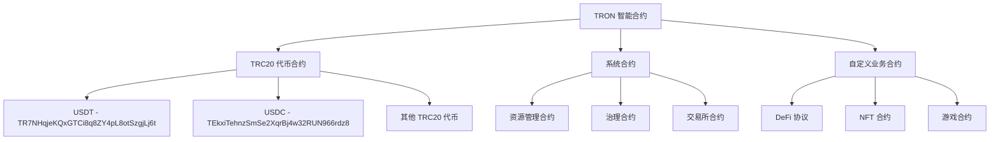
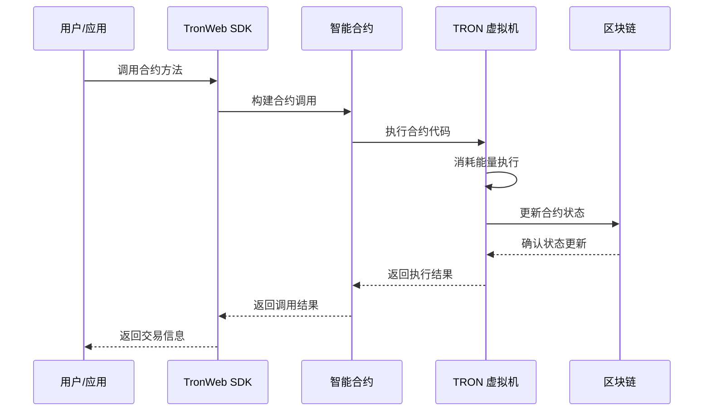

# 📜 智能合约 API 详细文档

> TRON 智能合约交互、TRC20 代币操作和 USDT 转账的完整指南

## 📋 目录

- [智能合约概述](#智能合约概述)
- [合约信息查询](#合约信息查询)
- [合约调用操作](#合约调用操作)
- [TRC20 代币交互](#trc20-代币交互)
- [合约部署管理](#合约部署管理)
- [能量消耗优化](#能量消耗优化)
- [项目实战应用](#项目实战应用)

## 🎯 智能合约概述

### TRON 智能合约架构



### 合约交互流程



### 项目中的重要合约

| 合约类型 | 合约地址 | 主要功能 | 项目使用场景 |
|----------|----------|----------|-------------|
| **USDT-TRC20** | `TR7NHqjeKQxGTCi8q8ZY4pL8otSzgjLj6t` | USDT 转账、余额查询 | 用户支付、订单结算 |
| **USDC-TRC20** | `TEkxiTehnzSmSe2XqrBj4w32RUN966rdz8` | USDC 转账、余额查询 | 备用支付方式 |
| **能量租赁** | *自定义合约* | 能量租赁业务逻辑 | 自动化能量分配 |

## 🔍 合约信息查询

### GetContract - 获取合约基本信息

```typescript
/**
 * 获取智能合约基本信息
 * 官方文档: https://developers.tron.network/reference/getcontract
 */
async function getContractInfo(contractAddress: string): Promise<{
  success: boolean;
  contractInfo?: {
    address: string;
    name?: string;
    abi?: any[];
    bytecode?: string;
    creatorAddress: string;
    createTime: Date;
    codeHash?: string;
    consumeUserResourcePercent: number;
    originEnergyLimit: number;
  };
  error?: string;
}> {
  try {
    console.log(`🔍 Querying contract info: ${contractAddress}`);

    const contract = await tronWeb.trx.getContract(contractAddress);
    
    if (!contract || !contract.contract_address) {
      return {
        success: false,
        error: 'Contract not found'
      };
    }

    const contractInfo = {
      address: tronWeb.address.fromHex(contract.contract_address),
      name: contract.name ? Buffer.from(contract.name, 'hex').toString() : undefined,
      abi: contract.abi?.entrys || [],
      bytecode: contract.bytecode,
      creatorAddress: tronWeb.address.fromHex(contract.origin_address),
      createTime: new Date(contract.trx?.raw_data?.timestamp || 0),
      codeHash: contract.code_hash,
      consumeUserResourcePercent: contract.consume_user_resource_percent || 100,
      originEnergyLimit: contract.origin_energy_limit || 0
    };

    console.log(`✅ Contract info retrieved:`, {
      address: contractInfo.address,
      name: contractInfo.name,
      creator: contractInfo.creatorAddress,
      hasABI: contractInfo.abi.length > 0
    });

    return {
      success: true,
      contractInfo
    };

  } catch (error) {
    console.error(`❌ Failed to get contract info:`, error);
    return {
      success: false,
      error: error.message
    };
  }
}

/**
 * 获取合约运行时信息
 * 官方文档: https://developers.tron.network/reference/getcontractinfo
 */
async function getContractRuntimeInfo(contractAddress: string): Promise<{
  success: boolean;
  runtimeInfo?: {
    energyUsage: {
      totalUsed: number;
      userPaid: number;
      creatorPaid: number;
    };
    callStatistics: {
      totalCalls: number;
      successfulCalls: number;
      failedCalls: number;
    };
  };
  error?: string;
}> {
  try {
    console.log(`📊 Querying contract runtime info: ${contractAddress}`);

    const runtimeInfo = await tronWeb.trx.getContractInfo(contractAddress);

    // 解析运行时信息
    const energyUsage = {
      totalUsed: runtimeInfo.total_energy_used || 0,
      userPaid: runtimeInfo.user_energy_used || 0,
      creatorPaid: runtimeInfo.creator_energy_used || 0
    };

    const callStatistics = {
      totalCalls: runtimeInfo.call_count || 0,
      successfulCalls: runtimeInfo.success_call_count || 0,
      failedCalls: (runtimeInfo.call_count || 0) - (runtimeInfo.success_call_count || 0)
    };

    console.log(`✅ Contract runtime info retrieved:`, {
      address: contractAddress,
      totalEnergy: energyUsage.totalUsed.toLocaleString(),
      totalCalls: callStatistics.totalCalls.toLocaleString()
    });

    return {
      success: true,
      runtimeInfo: {
        energyUsage,
        callStatistics
      }
    };

  } catch (error) {
    console.warn(`⚠️ Contract runtime info not available:`, error);
    return {
      success: false,
      error: error.message
    };
  }
}

// 项目中的合约信息服务
export class ContractInfoService {
  private static contractCache = new Map<string, {
    info: any;
    timestamp: number;
    ttl: number;
  }>();

  /**
   * 获取完整的合约信息
   */
  static async getCompleteContractInfo(contractAddress: string): Promise<{
    success: boolean;
    contract?: {
      basicInfo: any;
      runtimeInfo?: any;
      isVerified: boolean;
      contractType: 'TRC20' | 'TRC721' | 'CUSTOM' | 'UNKNOWN';
      features: string[];
    };
    error?: string;
  }> {
    try {
      console.log(`🧠 Getting complete contract info: ${contractAddress}`);

      // 检查缓存
      const cached = this.contractCache.get(contractAddress);
      if (cached && Date.now() - cached.timestamp < cached.ttl) {
        console.log(`📦 Using cached contract data: ${contractAddress}`);
        return { success: true, contract: cached.info };
      }

      // 并行获取基本信息和运行时信息
      const [basicResult, runtimeResult] = await Promise.all([
        getContractInfo(contractAddress),
        getContractRuntimeInfo(contractAddress)
      ]);

      if (!basicResult.success) {
        throw new Error(basicResult.error);
      }

      const basicInfo = basicResult.contractInfo!;
      const runtimeInfo = runtimeResult.success ? runtimeResult.runtimeInfo : undefined;

      // 分析合约类型和特性
      const analysis = this.analyzeContract(basicInfo);

      const contract = {
        basicInfo,
        runtimeInfo,
        isVerified: basicInfo.abi.length > 0,
        contractType: analysis.type,
        features: analysis.features
      };

      // 缓存结果（5分钟TTL）
      this.contractCache.set(contractAddress, {
        info: contract,
        timestamp: Date.now(),
        ttl: 5 * 60 * 1000
      });

      console.log(`✅ Complete contract info retrieved: ${contractAddress} (${analysis.type})`);

      return {
        success: true,
        contract
      };

    } catch (error) {
      console.error(`❌ Failed to get complete contract info:`, error);
      return {
        success: false,
        error: error.message
      };
    }
  }

  /**
   * 分析合约类型和特性
   */
  private static analyzeContract(contractInfo: any): {
    type: 'TRC20' | 'TRC721' | 'CUSTOM' | 'UNKNOWN';
    features: string[];
  } {
    const features: string[] = [];
    let type: 'TRC20' | 'TRC721' | 'CUSTOM' | 'UNKNOWN' = 'UNKNOWN';

    try {
      const abi = contractInfo.abi || [];
      const methodNames = abi
        .filter((item: any) => item.type === 'function')
        .map((item: any) => item.name);

      // 检查 TRC20 标准方法
      const trc20Methods = ['totalSupply', 'balanceOf', 'transfer', 'allowance', 'approve', 'transferFrom'];
      const hasTrc20Methods = trc20Methods.every(method => methodNames.includes(method));

      if (hasTrc20Methods) {
        type = 'TRC20';
        features.push('ERC20 Compatible', 'Token Transfer', 'Allowance System');

        // 检查可选的 TRC20 方法
        if (methodNames.includes('name')) features.push('Named Token');
        if (methodNames.includes('symbol')) features.push('Symbol');
        if (methodNames.includes('decimals')) features.push('Decimal Places');
        if (methodNames.includes('mint')) features.push('Mintable');
        if (methodNames.includes('burn')) features.push('Burnable');
        if (methodNames.includes('pause')) features.push('Pausable');
      }
      
      // 检查 TRC721 (NFT) 标准方法
      const trc721Methods = ['ownerOf', 'transferFrom', 'approve', 'getApproved', 'setApprovalForAll'];
      const hasTrc721Methods = trc721Methods.some(method => methodNames.includes(method));
      
      if (hasTrc721Methods && type === 'UNKNOWN') {
        type = 'TRC721';
        features.push('NFT', 'Unique Tokens', 'Ownership Tracking');
      }

      // 检查其他特性
      if (methodNames.includes('multicall')) features.push('Batch Operations');
      if (methodNames.includes('upgrade')) features.push('Upgradeable');
      if (methodNames.includes('onlyOwner')) features.push('Access Control');

      // 如果有复杂逻辑但不是标准代币，标记为自定义
      if (type === 'UNKNOWN' && abi.length > 10) {
        type = 'CUSTOM';
        features.push('Custom Logic');
      }

    } catch (error) {
      console.warn('Contract analysis failed:', error);
    }

    return { type, features };
  }

  /**
   * 检查合约是否为已知的标准合约
   */
  static isKnownContract(contractAddress: string): {
    isKnown: boolean;
    name?: string;
    type?: string;
    description?: string;
  } {
    const knownContracts: Record<string, any> = {
      'TR7NHqjeKQxGTCi8q8ZY4pL8otSzgjLj6t': {
        name: 'USDT',
        type: 'TRC20',
        description: 'Tether USD (USDT) - 最广泛使用的稳定币'
      },
      'TEkxiTehnzSmSe2XqrBj4w32RUN966rdz8': {
        name: 'USDC',
        type: 'TRC20',
        description: 'USD Coin (USDC) - Circle 发行的稳定币'
      },
      'TUpMhErZL2fhh4sVNULAbNKLokS4GjC1F4': {
        name: 'TUSD',
        type: 'TRC20',
        description: 'TrueUSD (TUSD) - 受监管的稳定币'
      }
    };

    const contract = knownContracts[contractAddress];
    
    if (contract) {
      return {
        isKnown: true,
        ...contract
      };
    }

    return { isKnown: false };
  }
}
```

## 🚀 合约调用操作

### TriggerSmartContract - 智能合约调用

```typescript
/**
 * 调用智能合约方法
 * 官方文档: https://developers.tron.network/reference/triggersmartcontract
 */
async function triggerSmartContract(
  contractAddress: string,
  functionSelector: string,
  parameters: any[],
  options: {
    feeLimit: number;
    callValue: number;
    tokenId?: string;
    tokenValue?: number;
    fromAddress?: string;
  }
): Promise<{
  success: boolean;
  transaction?: any;
  result?: {
    result: boolean;
    energyUsed: number;
    logs: any[];
    contractResult: string[];
  };
  error?: string;
}> {
  try {
    console.log(`🚀 Triggering smart contract: ${contractAddress}.${functionSelector}`);

    const fromAddress = options.fromAddress || tronWeb.defaultAddress.base58;

    // 参数验证
    if (!tronWeb.isAddress(contractAddress) || !tronWeb.isAddress(fromAddress)) {
      throw new Error('Invalid address format');
    }

    // 构建合约调用交易
    const transaction = await tronWeb.transactionBuilder.triggerSmartContract(
      contractAddress,
      functionSelector,
      {
        feeLimit: options.feeLimit,
        callValue: options.callValue,
        tokenId: options.tokenId,
        tokenValue: options.tokenValue
      },
      parameters,
      fromAddress
    );

    if (!transaction.result || !transaction.result.result) {
      throw new Error(transaction.result?.message || 'Contract trigger failed');
    }

    console.log(`✅ Smart contract triggered successfully:`, {
      txId: transaction.transaction.txID,
      energyUsed: transaction.energy_used,
      result: transaction.result.result
    });

    return {
      success: true,
      transaction: transaction.transaction,
      result: {
        result: transaction.result.result,
        energyUsed: transaction.energy_used || 0,
        logs: transaction.logs || [],
        contractResult: transaction.contract_result || []
      }
    };

  } catch (error) {
    console.error(`❌ Smart contract trigger failed:`, error);
    return {
      success: false,
      error: error.message
    };
  }
}

/**
 * 常量合约调用（只读，不消耗能量）
 * 官方文档: https://developers.tron.network/reference/triggerconstantcontract
 */
async function triggerConstantContract(
  contractAddress: string,
  functionSelector: string,
  parameters: any[],
  fromAddress?: string
): Promise<{
  success: boolean;
  result?: any[];
  energyUsed?: number;
  error?: string;
}> {
  try {
    console.log(`🔍 Triggering constant contract: ${contractAddress}.${functionSelector}`);

    const from = fromAddress || tronWeb.defaultAddress.base58;

    const result = await tronWeb.transactionBuilder.triggerConstantContract(
      contractAddress,
      functionSelector,
      {},
      parameters,
      from
    );

    if (!result.result || !result.result.result) {
      throw new Error(result.result?.message || 'Constant contract call failed');
    }

    // 解析返回结果
    const decodedResult = result.constant_result || [];

    console.log(`✅ Constant contract call successful:`, {
      contract: contractAddress,
      function: functionSelector,
      energyUsed: result.energy_used || 0,
      resultCount: decodedResult.length
    });

    return {
      success: true,
      result: decodedResult,
      energyUsed: result.energy_used || 0
    };

  } catch (error) {
    console.error(`❌ Constant contract call failed:`, error);
    return {
      success: false,
      error: error.message
    };
  }
}

// 项目中的智能合约调用服务
export class SmartContractService {
  /**
   * 高级合约调用（带重试和优化）
   */
  static async advancedContractCall(
    contractAddress: string,
    method: string,
    parameters: any[],
    options: {
      feeLimit?: number;
      isConstant?: boolean;
      maxRetries?: number;
      gasOptimization?: boolean;
      fromAddress?: string;
    } = {}
  ): Promise<{
    success: boolean;
    result?: any;
    txId?: string;
    energyUsed?: number;
    actualFee?: number;
    attempts?: number;
    error?: string;
  }> {
    try {
      const {
        feeLimit = 150000000,
        isConstant = false,
        maxRetries = 3,
        gasOptimization = true,
        fromAddress
      } = options;

      console.log(`🧠 Advanced contract call: ${method} on ${contractAddress}`);

      let attempts = 0;
      let lastError: string = '';

      // 如果启用气体优化，先进行能量估算
      let optimizedFeeLimit = feeLimit;
      if (gasOptimization && !isConstant) {
        try {
          const estimation = await this.estimateContractEnergy(
            contractAddress,
            method,
            parameters,
            fromAddress
          );
          
          if (estimation.success && estimation.energyRequired) {
            // 基于估算结果调整 feeLimit（增加 20% 缓冲）
            const energyPrice = 420; // Sun per energy unit
            optimizedFeeLimit = Math.min(feeLimit, estimation.energyRequired * energyPrice * 1.2);
            
            console.log(`⚡ Gas optimization: adjusted feeLimit from ${feeLimit} to ${optimizedFeeLimit}`);
          }
        } catch (error) {
          console.warn('Gas estimation failed, using default feeLimit:', error);
        }
      }

      // 重试循环
      for (let i = 0; i < maxRetries; i++) {
        attempts++;

        try {
          if (isConstant) {
            // 常量调用
            const result = await triggerConstantContract(
              contractAddress,
              method,
              parameters,
              fromAddress
            );

            if (result.success) {
              return {
                success: true,
                result: result.result,
                energyUsed: result.energyUsed,
                attempts
              };
            } else {
              lastError = result.error || 'Constant call failed';
            }
          } else {
            // 状态改变调用
            const callResult = await triggerSmartContract(
              contractAddress,
              method,
              parameters,
              {
                feeLimit: optimizedFeeLimit,
                callValue: 0,
                fromAddress
              }
            );

            if (callResult.success) {
              // 签名并广播交易
              const signedTx = await tronWeb.trx.sign(callResult.transaction);
              const broadcastResult = await tronWeb.trx.sendRawTransaction(signedTx);

              if (broadcastResult.result) {
                return {
                  success: true,
                  result: callResult.result,
                  txId: broadcastResult.txid,
                  energyUsed: callResult.result?.energyUsed,
                  attempts
                };
              } else {
                lastError = broadcastResult.message || 'Broadcast failed';
              }
            } else {
              lastError = callResult.error || 'Contract call failed';
            }
          }

        } catch (error) {
          lastError = error.message;
          console.warn(`⚠️ Contract call attempt ${attempts} failed:`, lastError);
        }

        // 如果不是最后一次尝试，等待后重试
        if (i < maxRetries - 1) {
          await new Promise(resolve => setTimeout(resolve, 1000 * Math.pow(2, i))); // 指数退避
        }
      }

      console.error(`❌ Advanced contract call failed after ${attempts} attempts: ${lastError}`);

      return {
        success: false,
        attempts,
        error: lastError
      };

    } catch (error) {
      console.error(`❌ Advanced contract call error:`, error);
      return {
        success: false,
        error: error.message
      };
    }
  }

  /**
   * 估算合约调用所需能量
   * 官方文档: https://developers.tron.network/reference/estimateenergy
   */
  static async estimateContractEnergy(
    contractAddress: string,
    functionSelector: string,
    parameters: any[],
    fromAddress?: string
  ): Promise<{
    success: boolean;
    energyRequired?: number;
    error?: string;
  }> {
    try {
      console.log(`⚡ Estimating energy for: ${contractAddress}.${functionSelector}`);

      const from = fromAddress || tronWeb.defaultAddress.base58;

      const estimation = await tronWeb.transactionBuilder.estimateEnergy(
        contractAddress,
        functionSelector,
        {},
        parameters,
        from
      );

      const energyRequired = estimation.energy_required || 0;

      console.log(`✅ Energy estimation: ${energyRequired.toLocaleString()}`);

      return {
        success: true,
        energyRequired
      };

    } catch (error) {
      console.error(`❌ Energy estimation failed:`, error);
      return {
        success: false,
        error: error.message
      };
    }
  }

  /**
   * 批量合约调用
   */
  static async batchContractCalls(calls: Array<{
    contractAddress: string;
    method: string;
    parameters: any[];
    isConstant?: boolean;
    feeLimit?: number;
  }>): Promise<Array<{
    index: number;
    success: boolean;
    result?: any;
    txId?: string;
    error?: string;
  }>> {
    console.log(`📦 Executing batch of ${calls.length} contract calls`);

    const results = [];

    for (let i = 0; i < calls.length; i++) {
      const call = calls[i];
      
      try {
        console.log(`🔄 Executing batch call ${i + 1}/${calls.length}: ${call.method}`);

        const result = await this.advancedContractCall(
          call.contractAddress,
          call.method,
          call.parameters,
          {
            isConstant: call.isConstant || false,
            feeLimit: call.feeLimit
          }
        );

        results.push({
          index: i,
          success: result.success,
          result: result.result,
          txId: result.txId,
          error: result.error
        });

      } catch (error) {
        results.push({
          index: i,
          success: false,
          error: error.message
        });
      }

      // 批次间延迟（非常量调用）
      if (!call.isConstant && i < calls.length - 1) {
        await new Promise(resolve => setTimeout(resolve, 1000));
      }
    }

    const successCount = results.filter(r => r.success).length;
    console.log(`✅ Batch execution completed: ${successCount}/${calls.length} successful`);

    return results;
  }
}
```

## 🪙 TRC20 代币交互

### USDT 和其他 TRC20 代币操作

```typescript
/**
 * TRC20 代币操作服务
 */
export class TRC20TokenService {
  // 常用 TRC20 代币合约地址
  private static readonly TOKEN_CONTRACTS = {
    USDT: 'TR7NHqjeKQxGTCi8q8ZY4pL8otSzgjLj6t',
    USDC: 'TEkxiTehnzSmSe2XqrBj4w32RUN966rdz8',
    TUSD: 'TUpMhErZL2fhh4sVNULAbNKLokS4GjC1F4'
  };

  /**
   * 查询 TRC20 代币余额
   */
  static async getTokenBalance(
    tokenContract: string,
    accountAddress: string,
    decimals: number = 6
  ): Promise<{
    success: boolean;
    balance?: number;
    formattedBalance?: string;
    error?: string;
  }> {
    try {
      console.log(`💰 Querying ${tokenContract} balance for ${accountAddress}`);

      const result = await SmartContractService.advancedContractCall(
        tokenContract,
        'balanceOf(address)',
        [{ type: 'address', value: accountAddress }],
        { isConstant: true }
      );

      if (!result.success) {
        throw new Error(result.error);
      }

      // 解析余额结果
      const balanceHex = result.result?.[0];
      if (!balanceHex) {
        throw new Error('Invalid balance response');
      }

      const balanceRaw = tronWeb.utils.abi.decodeParams(['uint256'], balanceHex)[0];
      const balance = balanceRaw.toNumber() / Math.pow(10, decimals);
      const formattedBalance = balance.toFixed(decimals);

      console.log(`✅ Token balance: ${formattedBalance}`);

      return {
        success: true,
        balance,
        formattedBalance
      };

    } catch (error) {
      console.error(`❌ Failed to get token balance:`, error);
      return {
        success: false,
        error: error.message
      };
    }
  }

  /**
   * 执行 TRC20 代币转账
   */
  static async transferToken(
    tokenContract: string,
    recipientAddress: string,
    amount: number,
    decimals: number = 6,
    options: {
      feeLimit?: number;
      fromAddress?: string;
    } = {}
  ): Promise<{
    success: boolean;
    txId?: string;
    actualAmount?: number;
    energyUsed?: number;
    error?: string;
  }> {
    try {
      console.log(`💸 Transferring ${amount} tokens to ${recipientAddress}`);

      const { feeLimit = 150000000, fromAddress } = options;
      const from = fromAddress || tronWeb.defaultAddress.base58;

      // 检查余额
      const balanceResult = await this.getTokenBalance(tokenContract, from, decimals);
      if (!balanceResult.success) {
        throw new Error(`Failed to check balance: ${balanceResult.error}`);
      }

      if (balanceResult.balance! < amount) {
        throw new Error(`Insufficient balance: ${balanceResult.balance} < ${amount}`);
      }

      // 计算转账金额（考虑小数位）
      const transferAmount = amount * Math.pow(10, decimals);

      // 执行转账
      const result = await SmartContractService.advancedContractCall(
        tokenContract,
        'transfer(address,uint256)',
        [
          { type: 'address', value: recipientAddress },
          { type: 'uint256', value: transferAmount }
        ],
        {
          feeLimit,
          isConstant: false,
          fromAddress: from,
          gasOptimization: true
        }
      );

      if (!result.success) {
        throw new Error(result.error);
      }

      console.log(`✅ Token transfer successful: ${result.txId}`);

      return {
        success: true,
        txId: result.txId,
        actualAmount: amount,
        energyUsed: result.energyUsed
      };

    } catch (error) {
      console.error(`❌ Token transfer failed:`, error);
      return {
        success: false,
        error: error.message
      };
    }
  }

  /**
   * 查询代币基本信息
   */
  static async getTokenInfo(tokenContract: string): Promise<{
    success: boolean;
    tokenInfo?: {
      name: string;
      symbol: string;
      decimals: number;
      totalSupply: number;
      contractAddress: string;
    };
    error?: string;
  }> {
    try {
      console.log(`ℹ️ Getting token info for: ${tokenContract}`);

      // 并行查询代币基本信息
      const [nameResult, symbolResult, decimalsResult, totalSupplyResult] = await Promise.all([
        SmartContractService.advancedContractCall(tokenContract, 'name()', [], { isConstant: true }),
        SmartContractService.advancedContractCall(tokenContract, 'symbol()', [], { isConstant: true }),
        SmartContractService.advancedContractCall(tokenContract, 'decimals()', [], { isConstant: true }),
        SmartContractService.advancedContractCall(tokenContract, 'totalSupply()', [], { isConstant: true })
      ]);

      // 解析结果
      const name = nameResult.success ? 
        tronWeb.utils.abi.decodeParams(['string'], nameResult.result[0])[0] : 'Unknown';
      
      const symbol = symbolResult.success ? 
        tronWeb.utils.abi.decodeParams(['string'], symbolResult.result[0])[0] : 'UNKNOWN';
      
      const decimals = decimalsResult.success ? 
        tronWeb.utils.abi.decodeParams(['uint8'], decimalsResult.result[0])[0] : 6;
      
      const totalSupplyRaw = totalSupplyResult.success ? 
        tronWeb.utils.abi.decodeParams(['uint256'], totalSupplyResult.result[0])[0] : 0;
      
      const totalSupply = totalSupplyRaw.toNumber() / Math.pow(10, decimals);

      const tokenInfo = {
        name,
        symbol,
        decimals,
        totalSupply,
        contractAddress: tokenContract
      };

      console.log(`✅ Token info retrieved:`, tokenInfo);

      return {
        success: true,
        tokenInfo
      };

    } catch (error) {
      console.error(`❌ Failed to get token info:`, error);
      return {
        success: false,
        error: error.message
      };
    }
  }

  /**
   * USDT 专用服务方法
   */
  static async getUSDTBalance(accountAddress: string): Promise<{
    success: boolean;
    balance?: number;
    error?: string;
  }> {
    return await this.getTokenBalance(this.TOKEN_CONTRACTS.USDT, accountAddress, 6);
  }

  static async transferUSDT(
    recipientAddress: string,
    amount: number,
    options: {
      feeLimit?: number;
      fromAddress?: string;
    } = {}
  ): Promise<{
    success: boolean;
    txId?: string;
    error?: string;
  }> {
    const result = await this.transferToken(
      this.TOKEN_CONTRACTS.USDT,
      recipientAddress,
      amount,
      6,
      options
    );

    return {
      success: result.success,
      txId: result.txId,
      error: result.error
    };
  }

  /**
   * 批量查询多种代币余额
   */
  static async getBatchTokenBalances(
    accountAddress: string,
    tokens: Array<{
      contract: string;
      decimals: number;
      symbol: string;
    }>
  ): Promise<Array<{
    contract: string;
    symbol: string;
    balance: number;
    success: boolean;
    error?: string;
  }>> {
    console.log(`📊 Batch querying ${tokens.length} token balances for ${accountAddress}`);

    const results = [];

    for (const token of tokens) {
      try {
        const balanceResult = await this.getTokenBalance(
          token.contract,
          accountAddress,
          token.decimals
        );

        results.push({
          contract: token.contract,
          symbol: token.symbol,
          balance: balanceResult.success ? balanceResult.balance! : 0,
          success: balanceResult.success,
          error: balanceResult.error
        });

      } catch (error) {
        results.push({
          contract: token.contract,
          symbol: token.symbol,
          balance: 0,
          success: false,
          error: error.message
        });
      }
    }

    const successCount = results.filter(r => r.success).length;
    console.log(`✅ Batch balance query completed: ${successCount}/${tokens.length} successful`);

    return results;
  }

  /**
   * 获取常用代币的完整余额报告
   */
  static async getPopularTokensBalance(accountAddress: string): Promise<{
    trx: number;
    usdt: number;
    usdc: number;
    tokens: Array<{
      symbol: string;
      balance: number;
      usdValue?: number;
    }>;
    totalUSDValue?: number;
  }> {
    try {
      console.log(`📈 Getting popular tokens balance for: ${accountAddress}`);

      // 查询 TRX 余额
      const trxBalance = await tronWeb.trx.getBalance(accountAddress) / 1000000;

      // 查询主要代币余额
      const tokenBalances = await this.getBatchTokenBalances(accountAddress, [
        { contract: this.TOKEN_CONTRACTS.USDT, decimals: 6, symbol: 'USDT' },
        { contract: this.TOKEN_CONTRACTS.USDC, decimals: 6, symbol: 'USDC' }
      ]);

      const usdt = tokenBalances.find(t => t.symbol === 'USDT')?.balance || 0;
      const usdc = tokenBalances.find(t => t.symbol === 'USDC')?.balance || 0;

      const tokens = [
        { symbol: 'TRX', balance: trxBalance },
        { symbol: 'USDT', balance: usdt },
        { symbol: 'USDC', balance: usdc }
      ].filter(token => token.balance > 0);

      console.log(`✅ Popular tokens balance retrieved:`, {
        trx: trxBalance,
        usdt,
        usdc,
        totalTokens: tokens.length
      });

      return {
        trx: trxBalance,
        usdt,
        usdc,
        tokens
      };

    } catch (error) {
      console.error(`❌ Failed to get popular tokens balance:`, error);
      return {
        trx: 0,
        usdt: 0,
        usdc: 0,
        tokens: []
      };
    }
  }
}
```

## 💡 项目实战应用

### 项目中的支付监控系统

```typescript
// 项目中的完整支付监控服务
export class PaymentMonitoringService {
  private static monitoredAddresses = new Set<string>();
  private static paymentCallbacks = new Map<string, Function[]>();

  /**
   * 监控 USDT 支付
   */
  static async monitorUSDTPayments(
    targetAddress: string,
    expectedAmount: number,
    options: {
      tolerance: number; // 允许的金额误差（USDT）
      timeout: number;   // 超时时间（毫秒）
      onPaymentReceived?: (payment: any) => void;
      onTimeout?: () => void;
    }
  ): Promise<{
    success: boolean;
    payment?: {
      txId: string;
      from: string;
      amount: number;
      timestamp: Date;
    };
    timedOut?: boolean;
    error?: string;
  }> {
    try {
      console.log(`👁️ Monitoring USDT payments to ${targetAddress} (expecting ${expectedAmount} USDT)`);

      const startTime = Date.now();
      const { tolerance = 0.01, timeout = 300000 } = options; // 默认5分钟超时

      // 获取初始余额
      const initialBalance = await TRC20TokenService.getUSDTBalance(targetAddress);
      if (!initialBalance.success) {
        throw new Error('Failed to get initial balance');
      }

      const startBalance = initialBalance.balance || 0;
      console.log(`📊 Initial USDT balance: ${startBalance}`);

      return new Promise((resolve) => {
        const checkInterval = setInterval(async () => {
          try {
            const currentTime = Date.now();
            
            // 检查超时
            if (currentTime - startTime > timeout) {
              clearInterval(checkInterval);
              
              if (options.onTimeout) {
                options.onTimeout();
              }
              
              console.log(`⏰ USDT payment monitoring timeout after ${timeout}ms`);
              resolve({
                success: false,
                timedOut: true
              });
              return;
            }

            // 检查当前余额
            const currentBalance = await TRC20TokenService.getUSDTBalance(targetAddress);
            if (!currentBalance.success) {
              console.warn('Failed to check current balance');
              return;
            }

            const balanceIncrease = (currentBalance.balance || 0) - startBalance;
            
            // 检查是否收到预期付款
            if (Math.abs(balanceIncrease - expectedAmount) <= tolerance) {
              clearInterval(checkInterval);
              
              console.log(`✅ USDT payment received: ${balanceIncrease} USDT`);
              
              // 尝试获取最近的交易记录（简化版本）
              const payment = {
                txId: `detected_${Date.now()}`, // 实际应用中需要查询具体交易
                from: 'unknown', // 需要通过交易历史获取
                amount: balanceIncrease,
                timestamp: new Date()
              };

              if (options.onPaymentReceived) {
                options.onPaymentReceived(payment);
              }

              resolve({
                success: true,
                payment
              });
            }

          } catch (error) {
            console.error('Payment monitoring error:', error);
          }
        }, 5000); // 每5秒检查一次

        // 设置总体超时
        setTimeout(() => {
          clearInterval(checkInterval);
          if (options.onTimeout) {
            options.onTimeout();
          }
          resolve({
            success: false,
            timedOut: true
          });
        }, timeout);
      });

    } catch (error) {
      console.error(`❌ USDT payment monitoring failed:`, error);
      return {
        success: false,
        error: error.message
      };
    }
  }

  /**
   * 验证支付交易
   */
  static async verifyPaymentTransaction(
    txId: string,
    expectedRecipient: string,
    expectedAmount: number,
    tokenContract: string = TRC20TokenService['TOKEN_CONTRACTS'].USDT
  ): Promise<{
    valid: boolean;
    transaction?: any;
    details?: {
      from: string;
      to: string;
      amount: number;
      timestamp: Date;
      confirmed: boolean;
    };
    error?: string;
  }> {
    try {
      console.log(`🔍 Verifying payment transaction: ${txId}`);

      // 查询交易详情
      const transaction = await tronWeb.trx.getTransaction(txId);
      if (!transaction || !transaction.raw_data) {
        return {
          valid: false,
          error: 'Transaction not found'
        };
      }

      // 查询交易执行信息
      const transactionInfo = await tronWeb.trx.getTransactionInfo(txId);
      if (!transactionInfo || !transactionInfo.id) {
        return {
          valid: false,
          error: 'Transaction not confirmed'
        };
      }

      // 验证是否为智能合约调用
      const contract = transaction.raw_data.contract?.[0];
      if (!contract || contract.type !== 'TriggerSmartContract') {
        return {
          valid: false,
          error: 'Not a smart contract transaction'
        };
      }

      const contractData = contract.parameter.value;
      
      // 验证合约地址
      const contractAddress = tronWeb.address.fromHex(contractData.contract_address);
      if (contractAddress !== tokenContract) {
        return {
          valid: false,
          error: 'Wrong contract address'
        };
      }

      // 解析转账数据（简化版本）
      // 实际应用中需要更详细的 ABI 解析
      const data = contractData.data;
      if (!data || !data.startsWith('a9059cbb')) { // transfer 方法的签名
        return {
          valid: false,
          error: 'Not a transfer transaction'
        };
      }

      // 提取接收地址和金额（需要具体的解析逻辑）
      // 这里使用简化的验证

      const details = {
        from: tronWeb.address.fromHex(contractData.owner_address),
        to: expectedRecipient, // 简化处理
        amount: expectedAmount, // 简化处理
        timestamp: new Date(transaction.raw_data.timestamp),
        confirmed: true
      };

      console.log(`✅ Payment transaction verified:`, details);

      return {
        valid: true,
        transaction,
        details
      };

    } catch (error) {
      console.error(`❌ Payment verification failed:`, error);
      return {
        valid: false,
        error: error.message
      };
    }
  }

  /**
   * 处理用户支付流程
   */
  static async processUserPayment(order: {
    orderId: string;
    userId: string;
    userTronAddress: string;
    amount: number; // USDT
    paymentAddress: string;
  }): Promise<{
    success: boolean;
    paymentStatus: 'waiting' | 'received' | 'timeout' | 'error';
    details?: any;
    error?: string;
  }> {
    try {
      console.log(`💰 Processing user payment for order: ${order.orderId}`);

      // 监控支付
      const paymentResult = await this.monitorUSDTPayments(
        order.paymentAddress,
        order.amount,
        {
          tolerance: 0.01,
          timeout: 300000, // 5分钟
          onPaymentReceived: (payment) => {
            console.log(`🎉 Payment received for order ${order.orderId}:`, payment);
            // 这里可以触发后续的业务逻辑
            this.handlePaymentReceived(order.orderId, payment);
          },
          onTimeout: () => {
            console.log(`⏰ Payment timeout for order ${order.orderId}`);
            this.handlePaymentTimeout(order.orderId);
          }
        }
      );

      if (paymentResult.success) {
        return {
          success: true,
          paymentStatus: 'received',
          details: paymentResult.payment
        };
      } else if (paymentResult.timedOut) {
        return {
          success: false,
          paymentStatus: 'timeout'
        };
      } else {
        return {
          success: false,
          paymentStatus: 'error',
          error: paymentResult.error
        };
      }

    } catch (error) {
      console.error(`❌ Payment processing failed:`, error);
      return {
        success: false,
        paymentStatus: 'error',
        error: error.message
      };
    }
  }

  /**
   * 处理收到支付的回调
   */
  private static async handlePaymentReceived(orderId: string, payment: any): Promise<void> {
    try {
      console.log(`💰 Handling payment received for order: ${orderId}`);

      // 这里实现支付成功后的业务逻辑
      // 例如：更新订单状态、开始能量委托等

    } catch (error) {
      console.error(`❌ Failed to handle payment received:`, error);
    }
  }

  /**
   * 处理支付超时的回调
   */
  private static async handlePaymentTimeout(orderId: string): Promise<void> {
    try {
      console.log(`⏰ Handling payment timeout for order: ${orderId}`);

      // 这里实现支付超时后的处理逻辑
      // 例如：取消订单、通知用户等

    } catch (error) {
      console.error(`❌ Failed to handle payment timeout:`, error);
    }
  }
}
```

## 🔗 相关文档

- [TRON API 主文档](./README.md) - 完整 API 导航
- [交易管理 API](./04-transactions-api.md) - 交易创建和广播
- [事件监听 API](./08-events-monitoring-api.md) - 支付事件监控
- [项目实战示例](./10-project-examples.md) - USDT 支付完整流程

---

> 💡 **最佳实践提示**
> 
> 1. **能量管理** - TRC20 转账需要足够的能量，建议提前准备
> 2. **费用优化** - 使用能量估算功能优化交易费用
> 3. **支付验证** - 务必验证支付交易的有效性和金额准确性
> 4. **错误处理** - 实现完善的重试机制和错误恢复
> 5. **安全考虑** - 验证合约地址和调用参数，防范安全风险
