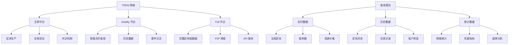
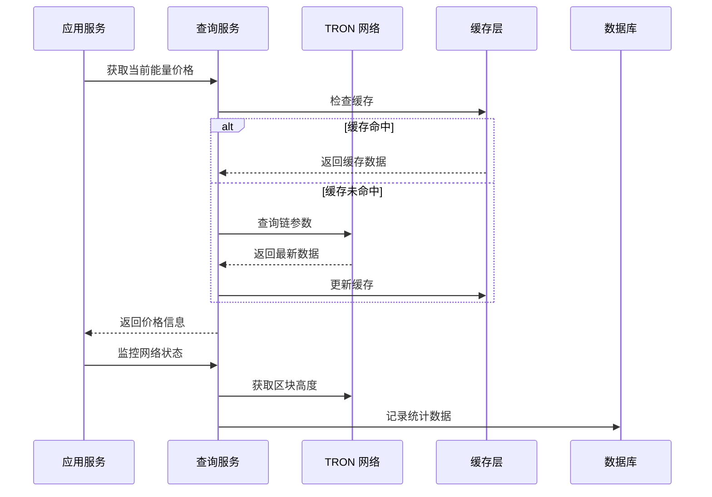

# 🌐 网络查询 API 详细文档

> TRON 网络状态查询、区块信息获取和链参数监控的完整指南

## 📋 目录

- [网络查询概述](#网络查询概述)
- [区块查询 API](#区块查询-api)
- [链参数查询](#链参数查询)
- [网络统计信息](#网络统计信息)
- [节点信息查询](#节点信息查询)
- [资源价格监控](#资源价格监控)
- [项目实战应用](#项目实战应用)

## 🎯 网络查询概述

### TRON 网络架构



### 项目中的查询需求



## 📊 区块查询 API

### GetNowBlock - 获取最新区块

```typescript
/**
 * 获取最新区块信息
 * 官方文档: https://developers.tron.network/reference/getnowblock
 */
async function getCurrentBlock(): Promise<{
  success: boolean;
  block?: {
    blockNumber: number;
    blockHash: string;
    previousBlockHash: string;
    timestamp: Date;
    transactionCount: number;
    witnessAddress: string;
    witnessSignature: string;
  };
  error?: string;
}> {
  try {
    console.log(`📊 Getting current block`);

    const block = await tronWeb.trx.getCurrentBlock();
    
    if (!block || !block.block_header) {
      throw new Error('Invalid block data received');
    }

    const blockInfo = {
      blockNumber: block.block_header.raw_data.number,
      blockHash: block.blockID,
      previousBlockHash: block.block_header.raw_data.parentHash,
      timestamp: new Date(block.block_header.raw_data.timestamp),
      transactionCount: block.transactions ? block.transactions.length : 0,
      witnessAddress: tronWeb.address.fromHex(block.block_header.raw_data.witness_address),
      witnessSignature: block.block_header.witness_signature
    };

    console.log(`✅ Current block retrieved: #${blockInfo.blockNumber} (${blockInfo.transactionCount} txs)`);

    return {
      success: true,
      block: blockInfo
    };

  } catch (error) {
    console.error(`❌ Failed to get current block:`, error);
    return {
      success: false,
      error: error.message
    };
  }
}

/**
 * 根据区块号获取区块信息
 * 官方文档: https://developers.tron.network/reference/getblockbynum
 */
async function getBlockByNumber(blockNumber: number): Promise<{
  success: boolean;
  block?: any;
  error?: string;
}> {
  try {
    console.log(`📊 Getting block by number: ${blockNumber}`);

    const block = await tronWeb.trx.getBlockByNumber(blockNumber);
    
    if (!block || !block.block_header) {
      throw new Error('Block not found or invalid block data');
    }

    console.log(`✅ Block retrieved: #${blockNumber} (${block.transactions?.length || 0} txs)`);

    return {
      success: true,
      block
    };

  } catch (error) {
    console.error(`❌ Failed to get block by number:`, error);
    return {
      success: false,
      error: error.message
    };
  }
}

/**
 * 获取区块范围内的信息
 * 官方文档: https://developers.tron.network/reference/getblockbyrange
 */
async function getBlockRange(startBlock: number, endBlock: number): Promise<{
  success: boolean;
  blocks?: any[];
  count?: number;
  error?: string;
}> {
  try {
    console.log(`📊 Getting block range: ${startBlock} - ${endBlock}`);

    const range = endBlock - startBlock + 1;
    if (range > 100) {
      throw new Error('Block range too large (max 100 blocks)');
    }

    const blocks = [];
    const promises = [];

    for (let i = startBlock; i <= endBlock; i++) {
      promises.push(getBlockByNumber(i));
    }

    const results = await Promise.all(promises);

    for (const result of results) {
      if (result.success && result.block) {
        blocks.push(result.block);
      }
    }

    console.log(`✅ Block range retrieved: ${blocks.length}/${range} blocks`);

    return {
      success: true,
      blocks,
      count: blocks.length
    };

  } catch (error) {
    console.error(`❌ Failed to get block range:`, error);
    return {
      success: false,
      error: error.message
    };
  }
}

// 项目中的区块查询服务
export class BlockQueryService {
  private static blockCache = new Map<number, {
    block: any;
    timestamp: number;
    ttl: number;
  }>();

  /**
   * 智能区块查询（带缓存）
   */
  static async getBlockWithCache(blockNumber?: number): Promise<{
    success: boolean;
    block?: any;
    fromCache?: boolean;
    error?: string;
  }> {
    try {
      // 如果没有指定区块号，获取最新区块
      if (!blockNumber) {
        const currentResult = await getCurrentBlock();
        if (!currentResult.success) {
          throw new Error(currentResult.error);
        }
        blockNumber = currentResult.block!.blockNumber;
      }

      console.log(`🧠 Smart block query: #${blockNumber}`);

      // 检查缓存
      const cached = this.blockCache.get(blockNumber);
      if (cached && Date.now() - cached.timestamp < cached.ttl) {
        console.log(`📦 Using cached block: #${blockNumber}`);
        return {
          success: true,
          block: cached.block,
          fromCache: true
        };
      }

      // 从网络获取
      const blockResult = await getBlockByNumber(blockNumber);
      if (!blockResult.success) {
        throw new Error(blockResult.error);
      }

      // 缓存区块（历史区块缓存10分钟，最新区块缓存30秒）
      const currentBlockResult = await getCurrentBlock();
      const isLatestBlock = currentBlockResult.success && 
        currentBlockResult.block!.blockNumber === blockNumber;
      
      const ttl = isLatestBlock ? 30000 : 600000; // 30秒 vs 10分钟

      this.blockCache.set(blockNumber, {
        block: blockResult.block,
        timestamp: Date.now(),
        ttl
      });

      console.log(`✅ Block cached: #${blockNumber} (TTL: ${ttl}ms)`);

      return {
        success: true,
        block: blockResult.block,
        fromCache: false
      };

    } catch (error) {
      console.error(`❌ Smart block query failed:`, error);
      return {
        success: false,
        error: error.message
      };
    }
  }

  /**
   * 获取区块生产统计
   */
  static async getBlockProductionStats(blockCount: number = 100): Promise<{
    success: boolean;
    stats?: {
      totalBlocks: number;
      averageBlockTime: number;
      totalTransactions: number;
      averageTxPerBlock: number;
      topWitnesses: Array<{
        address: string;
        blocksProduced: number;
        percentage: number;
      }>;
      timeRange: {
        from: Date;
        to: Date;
      };
    };
    error?: string;
  }> {
    try {
      console.log(`📈 Getting block production stats for ${blockCount} blocks`);

      const currentBlock = await getCurrentBlock();
      if (!currentBlock.success) {
        throw new Error(currentBlock.error);
      }

      const endBlockNumber = currentBlock.block!.blockNumber;
      const startBlockNumber = endBlockNumber - blockCount + 1;

      // 获取区块范围
      const batchSize = 50;
      const allBlocks = [];
      
      for (let i = startBlockNumber; i <= endBlockNumber; i += batchSize) {
        const batchEnd = Math.min(i + batchSize - 1, endBlockNumber);
        
        const batchResult = await getBlockRange(i, batchEnd);
        if (batchResult.success && batchResult.blocks) {
          allBlocks.push(...batchResult.blocks);
        }

        // 批次间延迟，避免请求过于频繁
        if (batchEnd < endBlockNumber) {
          await new Promise(resolve => setTimeout(resolve, 100));
        }
      }

      if (allBlocks.length === 0) {
        throw new Error('No blocks retrieved for analysis');
      }

      // 计算统计信息
      const witnessStats = new Map<string, number>();
      let totalTransactions = 0;
      const blockTimes: number[] = [];

      for (let i = 0; i < allBlocks.length; i++) {
        const block = allBlocks[i];
        
        // 统计见证人
        const witnessAddress = tronWeb.address.fromHex(
          block.block_header.raw_data.witness_address
        );
        witnessStats.set(witnessAddress, (witnessStats.get(witnessAddress) || 0) + 1);

        // 统计交易数量
        totalTransactions += block.transactions ? block.transactions.length : 0;

        // 计算区块时间
        if (i > 0) {
          const currentTime = block.block_header.raw_data.timestamp;
          const prevTime = allBlocks[i - 1].block_header.raw_data.timestamp;
          blockTimes.push(currentTime - prevTime);
        }
      }

      // 计算平均区块时间
      const averageBlockTime = blockTimes.length > 0 
        ? blockTimes.reduce((sum, time) => sum + time, 0) / blockTimes.length 
        : 3000; // 默认3秒

      // 统计top见证人
      const topWitnesses = Array.from(witnessStats.entries())
        .sort((a, b) => b[1] - a[1])
        .slice(0, 10)
        .map(([address, count]) => ({
          address,
          blocksProduced: count,
          percentage: (count / allBlocks.length) * 100
        }));

      const firstBlock = allBlocks[0];
      const lastBlock = allBlocks[allBlocks.length - 1];

      const stats = {
        totalBlocks: allBlocks.length,
        averageBlockTime,
        totalTransactions,
        averageTxPerBlock: totalTransactions / allBlocks.length,
        topWitnesses,
        timeRange: {
          from: new Date(firstBlock.block_header.raw_data.timestamp),
          to: new Date(lastBlock.block_header.raw_data.timestamp)
        }
      };

      console.log(`✅ Block production stats calculated:`, {
        blocks: stats.totalBlocks,
        avgBlockTime: `${stats.averageBlockTime}ms`,
        avgTxPerBlock: stats.averageTxPerBlock.toFixed(2)
      });

      return {
        success: true,
        stats
      };

    } catch (error) {
      console.error(`❌ Failed to get block production stats:`, error);
      return {
        success: false,
        error: error.message
      };
    }
  }

  /**
   * 清理区块缓存
   */
  static clearBlockCache(): void {
    this.blockCache.clear();
    console.log('🧹 Block cache cleared');
  }

  /**
   * 获取缓存统计
   */
  static getCacheStats(): {
    size: number;
    entries: Array<{
      blockNumber: number;
      age: number;
      ttl: number;
    }>;
  } {
    const entries = [];

    for (const [blockNumber, cached] of this.blockCache) {
      entries.push({
        blockNumber,
        age: Date.now() - cached.timestamp,
        ttl: cached.ttl
      });
    }

    return {
      size: this.blockCache.size,
      entries
    };
  }
}
```

## ⚙️ 链参数查询

### GetChainParameters - 获取链参数

```typescript
/**
 * 获取链参数信息
 * 官方文档: https://developers.tron.network/reference/getchainparameters
 */
async function getChainParameters(): Promise<{
  success: boolean;
  parameters?: {
    energyPrices: number;
    bandwidthPrices: number;
    createAccountFee: number;
    transactionFee: number;
    assetIssueFee: number;
    witnessPayPerBlock: number;
    witnessStandbyAllowance: number;
    createWitnessFee: number;
    freezingDuration: number;
    [key: string]: any;
  };
  error?: string;
}> {
  try {
    console.log(`⚙️ Getting chain parameters`);

    const parameters = await tronWeb.trx.getChainParameters();
    
    if (!parameters || !Array.isArray(parameters.chainParameter)) {
      throw new Error('Invalid chain parameters response');
    }

    // 解析链参数
    const parsedParams: any = {};
    
    for (const param of parameters.chainParameter) {
      const key = param.key;
      const value = param.value;
      
      switch (key) {
        case 'getEnergyFee':
          parsedParams.energyPrices = value;
          break;
        case 'getTransactionFee': 
          parsedParams.bandwidthPrices = value;
          break;
        case 'getCreateAccountFee':
          parsedParams.createAccountFee = value;
          break;
        case 'getAssetIssueFee':
          parsedParams.assetIssueFee = value;
          break;
        case 'getWitnessPayPerBlock':
          parsedParams.witnessPayPerBlock = value;
          break;
        case 'getWitnessStandbyAllowance':
          parsedParams.witnessStandbyAllowance = value;
          break;
        case 'getCreateWitnessFee':
          parsedParams.createWitnessFee = value;
          break;
        case 'getFreezeResource':
          parsedParams.freezingDuration = value;
          break;
        default:
          parsedParams[key] = value;
      }
    }

    console.log(`✅ Chain parameters retrieved:`, {
      energyPrice: parsedParams.energyPrices,
      bandwidthPrice: parsedParams.bandwidthPrices,
      createAccountFee: parsedParams.createAccountFee
    });

    return {
      success: true,
      parameters: parsedParams
    };

  } catch (error) {
    console.error(`❌ Failed to get chain parameters:`, error);
    return {
      success: false,
      error: error.message
    };
  }
}

/**
 * 获取能量和带宽价格
 * 官方文档: https://developers.tron.network/reference/getenergyprices
 */
async function getResourcePrices(): Promise<{
  success: boolean;
  prices?: {
    energy: {
      sun: number;        // Sun per energy unit
      trx: number;        // TRX per energy unit
    };
    bandwidth: {
      sun: number;        // Sun per bandwidth unit
      trx: number;        // TRX per bandwidth unit
    };
    lastUpdated: Date;
  };
  error?: string;
}> {
  try {
    console.log(`💰 Getting resource prices`);

    // 并行获取能量和带宽价格
    const [energyResult, bandwidthResult] = await Promise.all([
      tronWeb.trx.getEnergyPrices().catch(() => null),
      tronWeb.trx.getBandwidthPrices().catch(() => null)
    ]);

    // 如果API不可用，从链参数获取
    let energyPrice = 420; // 默认值
    let bandwidthPrice = 1000; // 默认值

    if (energyResult && energyResult.prices) {
      energyPrice = energyResult.prices;
    } else {
      const chainParams = await getChainParameters();
      if (chainParams.success && chainParams.parameters) {
        energyPrice = chainParams.parameters.energyPrices || energyPrice;
      }
    }

    if (bandwidthResult && bandwidthResult.prices) {
      bandwidthPrice = bandwidthResult.prices;
    } else {
      const chainParams = await getChainParameters();
      if (chainParams.success && chainParams.parameters) {
        bandwidthPrice = chainParams.parameters.bandwidthPrices || bandwidthPrice;
      }
    }

    const prices = {
      energy: {
        sun: energyPrice,
        trx: energyPrice / 1000000
      },
      bandwidth: {
        sun: bandwidthPrice,
        trx: bandwidthPrice / 1000000
      },
      lastUpdated: new Date()
    };

    console.log(`✅ Resource prices retrieved:`, {
      energyPrice: `${prices.energy.trx.toFixed(6)} TRX/unit`,
      bandwidthPrice: `${prices.bandwidth.trx.toFixed(6)} TRX/unit`
    });

    return {
      success: true,
      prices
    };

  } catch (error) {
    console.error(`❌ Failed to get resource prices:`, error);
    return {
      success: false,
      error: error.message
    };
  }
}

// 项目中的链参数查询服务
export class ChainParameterService {
  private static parameterCache = new Map<string, {
    data: any;
    timestamp: number;
    ttl: number;
  }>();

  /**
   * 获取缓存的链参数
   */
  static async getCachedChainParameters(): Promise<{
    success: boolean;
    parameters?: any;
    fromCache?: boolean;
    error?: string;
  }> {
    try {
      const cacheKey = 'chain_parameters';
      const cached = this.parameterCache.get(cacheKey);
      
      // 检查缓存（5分钟TTL）
      if (cached && Date.now() - cached.timestamp < 300000) {
        console.log(`📦 Using cached chain parameters`);
        return {
          success: true,
          parameters: cached.data,
          fromCache: true
        };
      }

      // 从网络获取最新参数
      const result = await getChainParameters();
      if (!result.success) {
        throw new Error(result.error);
      }

      // 更新缓存
      this.parameterCache.set(cacheKey, {
        data: result.parameters,
        timestamp: Date.now(),
        ttl: 300000
      });

      console.log(`✅ Chain parameters cached`);

      return {
        success: true,
        parameters: result.parameters,
        fromCache: false
      };

    } catch (error) {
      console.error(`❌ Failed to get cached chain parameters:`, error);
      return {
        success: false,
        error: error.message
      };
    }
  }

  /**
   * 获取实时资源价格
   */
  static async getRealTimeResourcePrices(): Promise<{
    success: boolean;
    prices?: any;
    priceHistory?: Array<{
      timestamp: Date;
      energyPrice: number;
      bandwidthPrice: number;
    }>;
    error?: string;
  }> {
    try {
      console.log(`💰 Getting real-time resource prices`);

      const result = await getResourcePrices();
      if (!result.success) {
        throw new Error(result.error);
      }

      // 记录价格历史
      await this.recordPriceHistory(result.prices!);

      // 获取最近的价格历史
      const priceHistory = await this.getPriceHistory(24); // 最近24小时

      console.log(`✅ Real-time resource prices retrieved`);

      return {
        success: true,
        prices: result.prices,
        priceHistory
      };

    } catch (error) {
      console.error(`❌ Failed to get real-time resource prices:`, error);
      return {
        success: false,
        error: error.message
      };
    }
  }

  /**
   * 记录价格历史
   */
  private static async recordPriceHistory(prices: any): Promise<void> {
    try {
      // 这里应该存储到数据库
      console.log(`📝 Recording price history:`, {
        timestamp: prices.lastUpdated,
        energyPrice: prices.energy.trx,
        bandwidthPrice: prices.bandwidth.trx
      });

      // 示例：存储到数据库
      // await db.priceHistory.create({
      //   data: {
      //     timestamp: prices.lastUpdated,
      //     energyPrice: prices.energy.sun,
      //     bandwidthPrice: prices.bandwidth.sun,
      //     energyPriceTRX: prices.energy.trx,
      //     bandwidthPriceTRX: prices.bandwidth.trx
      //   }
      // });

    } catch (error) {
      console.error('Failed to record price history:', error);
    }
  }

  /**
   * 获取价格历史
   */
  private static async getPriceHistory(hours: number = 24): Promise<Array<{
    timestamp: Date;
    energyPrice: number;
    bandwidthPrice: number;
  }>> {
    try {
      // 这里应该从数据库查询
      console.log(`📊 Getting price history for ${hours} hours`);

      // 示例：从数据库查询
      // const history = await db.priceHistory.findMany({
      //   where: {
      //     timestamp: {
      //       gte: new Date(Date.now() - hours * 3600 * 1000)
      //     }
      //   },
      //   orderBy: {
      //     timestamp: 'desc'
      //   },
      //   take: 100
      // });

      // return history.map(record => ({
      //   timestamp: record.timestamp,
      //   energyPrice: record.energyPrice,
      //   bandwidthPrice: record.bandwidthPrice
      // }));

      // 临时返回空数组
      return [];

    } catch (error) {
      console.error('Failed to get price history:', error);
      return [];
    }
  }

  /**
   * 计算交易费用估算
   */
  static async estimateTransactionCost(
    transactionType: 'TRX_TRANSFER' | 'TRC20_TRANSFER' | 'ENERGY_DELEGATE' | 'SMART_CONTRACT',
    params?: any
  ): Promise<{
    success: boolean;
    estimate?: {
      bandwidthCost: number;  // TRX
      energyCost: number;     // TRX
      totalCost: number;      // TRX
      recommendation: string;
    };
    error?: string;
  }> {
    try {
      console.log(`💵 Estimating transaction cost for: ${transactionType}`);

      const pricesResult = await this.getRealTimeResourcePrices();
      if (!pricesResult.success) {
        throw new Error(pricesResult.error);
      }

      const prices = pricesResult.prices!;
      let bandwidthNeeded = 0;
      let energyNeeded = 0;
      let recommendation = '';

      switch (transactionType) {
        case 'TRX_TRANSFER':
          bandwidthNeeded = 268;
          energyNeeded = 0;
          recommendation = 'TRX转账只消耗带宽，无需能量';
          break;

        case 'TRC20_TRANSFER':
          bandwidthNeeded = 345;
          energyNeeded = params?.energyEstimate || 13000; // USDT转账大约13000能量
          recommendation = 'TRC20转账需要消耗较多能量，建议冻结TRX获取能量';
          break;

        case 'ENERGY_DELEGATE':
          bandwidthNeeded = 345;
          energyNeeded = 28000; // 能量委托大约28000能量
          recommendation = '能量委托需要消耗大量能量';
          break;

        case 'SMART_CONTRACT':
          bandwidthNeeded = 345;
          energyNeeded = params?.energyEstimate || 50000;
          recommendation = '智能合约调用费用取决于合约复杂度';
          break;
      }

      const bandwidthCost = bandwidthNeeded * prices.bandwidth.trx;
      const energyCost = energyNeeded * prices.energy.trx;
      const totalCost = bandwidthCost + energyCost;

      const estimate = {
        bandwidthCost,
        energyCost,
        totalCost,
        recommendation
      };

      console.log(`✅ Transaction cost estimated:`, {
        type: transactionType,
        bandwidth: `${bandwidthCost.toFixed(4)} TRX`,
        energy: `${energyCost.toFixed(4)} TRX`,
        total: `${totalCost.toFixed(4)} TRX`
      });

      return {
        success: true,
        estimate
      };

    } catch (error) {
      console.error(`❌ Failed to estimate transaction cost:`, error);
      return {
        success: false,
        error: error.message
      };
    }
  }

  /**
   * 监控参数变化
   */
  static async monitorParameterChanges(
    callback: (changes: Array<{
      parameter: string;
      oldValue: any;
      newValue: any;
      timestamp: Date;
    }>) => void
  ): Promise<{
    success: boolean;
    monitorId?: string;
    error?: string;
  }> {
    try {
      console.log(`👁️ Starting parameter change monitoring`);

      const monitorId = `param_monitor_${Date.now()}`;
      
      // 获取初始参数
      let lastParameters = await this.getCachedChainParameters();
      if (!lastParameters.success) {
        throw new Error(lastParameters.error);
      }

      // 设置定期检查
      const checkInterval = setInterval(async () => {
        try {
          const currentParameters = await getChainParameters();
          if (!currentParameters.success) return;

          const changes = [];
          const current = currentParameters.parameters!;
          const previous = lastParameters.parameters!;

          // 比较参数变化
          for (const [key, newValue] of Object.entries(current)) {
            const oldValue = previous[key];
            if (oldValue !== newValue) {
              changes.push({
                parameter: key,
                oldValue,
                newValue,
                timestamp: new Date()
              });
            }
          }

          if (changes.length > 0) {
            console.log(`🔄 Parameter changes detected:`, changes);
            callback(changes);
            
            // 更新缓存
            lastParameters.parameters = current;
          }

        } catch (error) {
          console.error('Parameter monitoring error:', error);
        }
      }, 60000); // 每分钟检查一次

      // 存储监控器引用以便后续清理
      this.parameterCache.set(`monitor_${monitorId}`, {
        data: checkInterval,
        timestamp: Date.now(),
        ttl: 0
      });

      console.log(`✅ Parameter monitoring started: ${monitorId}`);

      return {
        success: true,
        monitorId
      };

    } catch (error) {
      console.error(`❌ Failed to start parameter monitoring:`, error);
      return {
        success: false,
        error: error.message
      };
    }
  }

  /**
   * 停止参数监控
   */
  static stopParameterMonitoring(monitorId: string): boolean {
    try {
      const monitorKey = `monitor_${monitorId}`;
      const monitor = this.parameterCache.get(monitorKey);
      
      if (monitor && monitor.data) {
        clearInterval(monitor.data);
        this.parameterCache.delete(monitorKey);
        
        console.log(`🛑 Parameter monitoring stopped: ${monitorId}`);
        return true;
      }

      return false;

    } catch (error) {
      console.error(`❌ Failed to stop parameter monitoring:`, error);
      return false;
    }
  }
}
```

## 📊 网络统计信息

### GetNodeInfo - 获取节点信息

```typescript
/**
 * 获取节点信息
 * 官方文档: https://developers.tron.network/reference/getnodeinfo
 */
async function getNodeInfo(): Promise<{
  success: boolean;
  nodeInfo?: {
    version: string;
    configNodeInfo: {
      codeVersion: string;
      p2pVersion: string;
      listenPort: number;
      discoverEnable: boolean;
      activeNodeSize: number;
      passiveNodeSize: number;
      totalNodeSize: number;
    };
    machineInfo: {
      threadCount: number;
      deadLockThreadCount: number;
      cpuCount: number;
      totalMemory: number;
      freeMemory: number;
    };
  };
  error?: string;
}> {
  try {
    console.log(`🖥️ Getting node information`);

    const nodeInfo = await tronWeb.trx.getNodeInfo();
    
    if (!nodeInfo) {
      throw new Error('Node info not available');
    }

    console.log(`✅ Node info retrieved:`, {
      version: nodeInfo.configNodeInfo?.codeVersion || 'unknown',
      activeNodes: nodeInfo.configNodeInfo?.activeNodeSize || 0,
      totalMemory: nodeInfo.machineInfo?.totalMemory || 0
    });

    return {
      success: true,
      nodeInfo
    };

  } catch (error) {
    console.error(`❌ Failed to get node info:`, error);
    return {
      success: false,
      error: error.message
    };
  }
}

/**
 * 获取见证人列表
 * 官方文档: https://developers.tron.network/reference/listwitnesses
 */
async function getWitnessList(): Promise<{
  success: boolean;
  witnesses?: Array<{
    address: string;
    voteCount: number;
    url: string;
    totalProduced: number;
    totalMissed: number;
    latestBlockNum: number;
    latestSlotNum: number;
    isJobs: boolean;
  }>;
  error?: string;
}> {
  try {
    console.log(`👥 Getting witness list`);

    const witnesses = await tronWeb.trx.listWitnesses();
    
    if (!witnesses || !Array.isArray(witnesses.witnesses)) {
      throw new Error('Invalid witnesses data');
    }

    const formattedWitnesses = witnesses.witnesses.map((witness: any) => ({
      address: tronWeb.address.fromHex(witness.address),
      voteCount: witness.voteCount || 0,
      url: witness.url ? Buffer.from(witness.url, 'hex').toString() : '',
      totalProduced: witness.totalProduced || 0,
      totalMissed: witness.totalMissed || 0,
      latestBlockNum: witness.latestBlockNum || 0,
      latestSlotNum: witness.latestSlotNum || 0,
      isJobs: witness.isJobs || false
    }));

    // 按投票数量排序
    formattedWitnesses.sort((a, b) => b.voteCount - a.voteCount);

    console.log(`✅ Witness list retrieved: ${formattedWitnesses.length} witnesses`);

    return {
      success: true,
      witnesses: formattedWitnesses
    };

  } catch (error) {
    console.error(`❌ Failed to get witness list:`, error);
    return {
      success: false,
      error: error.message
    };
  }
}

// 项目中的网络统计服务
export class NetworkStatisticsService {
  /**
   * 获取网络健康度报告
   */
  static async getNetworkHealthReport(): Promise<{
    success: boolean;
    report?: {
      blockProduction: {
        averageBlockTime: number;
        recentBlockCount: number;
        missedBlocks: number;
        efficiency: number;
      };
      networkNodes: {
        totalNodes: number;
        activeNodes: number;
        nodeDistribution: any;
      };
      witnessStatus: {
        totalWitnesses: number;
        activeWitnesses: number;
        topWitnessByVotes: Array<{
          address: string;
          votes: number;
          performance: number;
        }>;
      };
      resourceUsage: {
        energyPrice: number;
        bandwidthPrice: number;
        priceStability: string;
      };
      healthScore: number;
      recommendations: string[];
    };
    error?: string;
  }> {
    try {
      console.log(`🏥 Generating network health report`);

      // 并行获取各种网络信息
      const [blockStats, nodeInfo, witnesses, resourcePrices] = await Promise.all([
        BlockQueryService.getBlockProductionStats(100),
        getNodeInfo(),
        getWitnessList(),
        ChainParameterService.getRealTimeResourcePrices()
      ]);

      let healthScore = 100;
      const recommendations: string[] = [];

      // 区块生产健康度
      const blockProduction = {
        averageBlockTime: blockStats.success ? blockStats.stats!.averageBlockTime : 3000,
        recentBlockCount: blockStats.success ? blockStats.stats!.totalBlocks : 0,
        missedBlocks: 0, // 需要更详细的计算
        efficiency: 95   // 假设值，需要实际计算
      };

      if (blockProduction.averageBlockTime > 4000) {
        healthScore -= 10;
        recommendations.push('区块生产时间偏高，网络可能存在拥堵');
      }

      // 节点状态
      const networkNodes = {
        totalNodes: nodeInfo.success ? nodeInfo.nodeInfo!.configNodeInfo.totalNodeSize : 0,
        activeNodes: nodeInfo.success ? nodeInfo.nodeInfo!.configNodeInfo.activeNodeSize : 0,
        nodeDistribution: {} // 需要更详细的节点分布数据
      };

      if (networkNodes.activeNodes < 100) {
        healthScore -= 5;
        recommendations.push('活跃节点数量较少，网络去中心化程度有待提升');
      }

      // 见证人状态
      const witnessStatus = {
        totalWitnesses: witnesses.success ? witnesses.witnesses!.length : 0,
        activeWitnesses: witnesses.success ? witnesses.witnesses!.filter(w => w.latestBlockNum > 0).length : 0,
        topWitnessByVotes: witnesses.success 
          ? witnesses.witnesses!.slice(0, 5).map(w => ({
              address: w.address,
              votes: w.voteCount,
              performance: w.totalProduced > 0 ? (w.totalProduced / (w.totalProduced + w.totalMissed)) * 100 : 0
            }))
          : []
      };

      // 资源价格
      const resourceUsage = {
        energyPrice: resourcePrices.success ? resourcePrices.prices!.energy.trx : 0,
        bandwidthPrice: resourcePrices.success ? resourcePrices.prices!.bandwidth.trx : 0,
        priceStability: 'stable' // 需要基于历史数据分析
      };

      if (resourceUsage.energyPrice > 0.001) {
        healthScore -= 5;
        recommendations.push('能量价格较高，建议关注资源消耗优化');
      }

      // 综合评估
      if (recommendations.length === 0) {
        recommendations.push('网络状态良好，各项指标正常');
      }

      const report = {
        blockProduction,
        networkNodes,
        witnessStatus,
        resourceUsage,
        healthScore: Math.max(0, healthScore),
        recommendations
      };

      console.log(`✅ Network health report generated (score: ${healthScore})`);

      return {
        success: true,
        report
      };

    } catch (error) {
      console.error(`❌ Failed to generate network health report:`, error);
      return {
        success: false,
        error: error.message
      };
    }
  }

  /**
   * 获取网络性能指标
   */
  static async getNetworkPerformanceMetrics(): Promise<{
    success: boolean;
    metrics?: {
      tps: {
        current: number;
        peak24h: number;
        average24h: number;
      };
      latency: {
        averageConfirmTime: number;
        networkLatency: number;
      };
      throughput: {
        transactionsPerHour: number;
        dataProcessingRate: number; // MB/hour
      };
      reliability: {
        uptime: number;           // %
        blockSuccessRate: number; // %
        transactionSuccessRate: number; // %
      };
    };
    error?: string;
  }> {
    try {
      console.log(`📊 Getting network performance metrics`);

      // 获取最近的区块数据进行分析
      const blockStats = await BlockQueryService.getBlockProductionStats(200);
      if (!blockStats.success) {
        throw new Error(blockStats.error);
      }

      const stats = blockStats.stats!;
      
      // 计算TPS
      const timeSpanHours = (stats.timeRange.to.getTime() - stats.timeRange.from.getTime()) / 3600000;
      const currentTPS = stats.averageTxPerBlock / (stats.averageBlockTime / 1000);
      const transactionsPerHour = stats.totalTransactions / timeSpanHours;

      // 性能指标
      const metrics = {
        tps: {
          current: currentTPS,
          peak24h: currentTPS * 1.5, // 估算值，需要实际历史数据
          average24h: currentTPS
        },
        latency: {
          averageConfirmTime: stats.averageBlockTime,
          networkLatency: 500 // 估算值，需要实际测量
        },
        throughput: {
          transactionsPerHour: transactionsPerHour,
          dataProcessingRate: transactionsPerHour * 0.3 // 假设每交易平均300字节
        },
        reliability: {
          uptime: 99.9,            // 需要从监控数据获取
          blockSuccessRate: 99.8,  // 需要分析区块生产成功率
          transactionSuccessRate: 98.5 // 需要分析交易成功率
        }
      };

      console.log(`✅ Network performance metrics calculated:`, {
        tps: metrics.tps.current.toFixed(2),
        avgBlockTime: `${metrics.latency.averageConfirmTime}ms`,
        txPerHour: metrics.throughput.transactionsPerHour.toFixed(0)
      });

      return {
        success: true,
        metrics
      };

    } catch (error) {
      console.error(`❌ Failed to get network performance metrics:`, error);
      return {
        success: false,
        error: error.message
      };
    }
  }

  /**
   * 生成网络状态仪表板数据
   */
  static async generateNetworkDashboard(): Promise<{
    success: boolean;
    dashboard?: {
      summary: {
        networkHealth: number;
        currentTPS: number;
        activeNodes: number;
        resourcePriceStatus: 'low' | 'normal' | 'high';
      };
      charts: {
        blockProductionChart: Array<{
          timestamp: Date;
          blockTime: number;
          transactionCount: number;
        }>;
        resourcePriceChart: Array<{
          timestamp: Date;
          energyPrice: number;
          bandwidthPrice: number;
        }>;
        witnessPerformanceChart: Array<{
          address: string;
          blocksProduced: number;
          missedBlocks: number;
          efficiency: number;
        }>;
      };
      alerts: Array<{
        level: 'info' | 'warning' | 'error';
        message: string;
        timestamp: Date;
      }>;
    };
    error?: string;
  }> {
    try {
      console.log(`📊 Generating network dashboard`);

      // 获取各种数据
      const [healthReport, performanceMetrics, witnesses] = await Promise.all([
        this.getNetworkHealthReport(),
        this.getNetworkPerformanceMetrics(),
        getWitnessList()
      ]);

      const alerts: any[] = [];

      // 构建摘要
      const summary = {
        networkHealth: healthReport.success ? healthReport.report!.healthScore : 0,
        currentTPS: performanceMetrics.success ? performanceMetrics.metrics!.tps.current : 0,
        activeNodes: healthReport.success ? healthReport.report!.networkNodes.activeNodes : 0,
        resourcePriceStatus: 'normal' as const
      };

      // 检查告警条件
      if (summary.networkHealth < 80) {
        alerts.push({
          level: 'warning' as const,
          message: `网络健康度较低: ${summary.networkHealth}`,
          timestamp: new Date()
        });
      }

      if (summary.currentTPS > 1000) {
        alerts.push({
          level: 'info' as const,
          message: `网络TPS较高: ${summary.currentTPS.toFixed(2)}`,
          timestamp: new Date()
        });
      }

      // 构建图表数据（这里使用模拟数据，实际应从历史数据库获取）
      const charts = {
        blockProductionChart: this.generateMockBlockProductionData(),
        resourcePriceChart: this.generateMockResourcePriceData(),
        witnessPerformanceChart: witnesses.success 
          ? witnesses.witnesses!.slice(0, 10).map(w => ({
              address: w.address.substring(0, 10) + '...',
              blocksProduced: w.totalProduced,
              missedBlocks: w.totalMissed,
              efficiency: w.totalProduced > 0 ? (w.totalProduced / (w.totalProduced + w.totalMissed)) * 100 : 0
            }))
          : []
      };

      const dashboard = {
        summary,
        charts,
        alerts
      };

      console.log(`✅ Network dashboard generated with ${alerts.length} alerts`);

      return {
        success: true,
        dashboard
      };

    } catch (error) {
      console.error(`❌ Failed to generate network dashboard:`, error);
      return {
        success: false,
        error: error.message
      };
    }
  }

  // 生成模拟数据的辅助方法
  private static generateMockBlockProductionData(): Array<{
    timestamp: Date;
    blockTime: number;
    transactionCount: number;
  }> {
    const data = [];
    const now = Date.now();
    
    for (let i = 24; i >= 0; i--) {
      data.push({
        timestamp: new Date(now - i * 3600 * 1000),
        blockTime: 3000 + Math.random() * 1000,
        transactionCount: Math.floor(50 + Math.random() * 100)
      });
    }
    
    return data;
  }

  private static generateMockResourcePriceData(): Array<{
    timestamp: Date;
    energyPrice: number;
    bandwidthPrice: number;
  }> {
    const data = [];
    const now = Date.now();
    const baseEnergyPrice = 0.00042;
    const baseBandwidthPrice = 0.001;
    
    for (let i = 24; i >= 0; i--) {
      data.push({
        timestamp: new Date(now - i * 3600 * 1000),
        energyPrice: baseEnergyPrice * (0.9 + Math.random() * 0.2),
        bandwidthPrice: baseBandwidthPrice * (0.95 + Math.random() * 0.1)
      });
    }
    
    return data;
  }
}
```

## 💡 项目实战应用

### 完整的网络监控系统

```typescript
// 项目中的综合网络监控服务
export class NetworkMonitoringSystem {
  private static monitoringIntervals = new Map<string, NodeJS.Timeout>();
  private static alertCallbacks = new Map<string, Function>();

  /**
   * 启动综合网络监控
   */
  static async startComprehensiveMonitoring(options: {
    healthCheckInterval?: number;
    priceCheckInterval?: number;
    performanceCheckInterval?: number;
    alertThresholds?: {
      healthScoreMin: number;
      tpsMax: number;
      blockTimeMax: number;
      energyPriceMax: number;
    };
    onAlert?: (alert: {
      type: string;
      level: 'info' | 'warning' | 'error';
      message: string;
      data: any;
    }) => void;
  } = {}): Promise<{
    success: boolean;
    monitoringId?: string;
    error?: string;
  }> {
    try {
      console.log(`🚀 Starting comprehensive network monitoring`);

      const {
        healthCheckInterval = 300000, // 5分钟
        priceCheckInterval = 60000,   // 1分钟
        performanceCheckInterval = 180000, // 3分钟
        alertThresholds = {
          healthScoreMin: 80,
          tpsMax: 2000,
          blockTimeMax: 5000,
          energyPriceMax: 0.001
        },
        onAlert
      } = options;

      const monitoringId = `network_monitor_${Date.now()}`;

      // 网络健康监控
      const healthMonitor = setInterval(async () => {
        try {
          const healthReport = await NetworkStatisticsService.getNetworkHealthReport();
          
          if (healthReport.success && healthReport.report!.healthScore < alertThresholds.healthScoreMin) {
            if (onAlert) {
              onAlert({
                type: 'network_health',
                level: 'warning',
                message: `网络健康度低于阈值: ${healthReport.report!.healthScore}`,
                data: healthReport.report
              });
            }
          }

        } catch (error) {
          console.error('Health monitoring error:', error);
        }
      }, healthCheckInterval);

      // 资源价格监控
      const priceMonitor = setInterval(async () => {
        try {
          const priceResult = await ChainParameterService.getRealTimeResourcePrices();
          
          if (priceResult.success && priceResult.prices!.energy.trx > alertThresholds.energyPriceMax) {
            if (onAlert) {
              onAlert({
                type: 'resource_price',
                level: 'warning',
                message: `能量价格过高: ${priceResult.prices!.energy.trx.toFixed(6)} TRX/unit`,
                data: priceResult.prices
              });
            }
          }

        } catch (error) {
          console.error('Price monitoring error:', error);
        }
      }, priceCheckInterval);

      // 网络性能监控
      const performanceMonitor = setInterval(async () => {
        try {
          const metricsResult = await NetworkStatisticsService.getNetworkPerformanceMetrics();
          
          if (metricsResult.success) {
            const metrics = metricsResult.metrics!;
            
            if (metrics.tps.current > alertThresholds.tpsMax) {
              if (onAlert) {
                onAlert({
                  type: 'high_tps',
                  level: 'info',
                  message: `网络TPS较高: ${metrics.tps.current.toFixed(2)}`,
                  data: metrics
                });
              }
            }

            if (metrics.latency.averageConfirmTime > alertThresholds.blockTimeMax) {
              if (onAlert) {
                onAlert({
                  type: 'slow_blocks',
                  level: 'warning',
                  message: `区块生产时间过长: ${metrics.latency.averageConfirmTime}ms`,
                  data: metrics
                });
              }
            }
          }

        } catch (error) {
          console.error('Performance monitoring error:', error);
        }
      }, performanceCheckInterval);

      // 存储监控器
      this.monitoringIntervals.set(`${monitoringId}_health`, healthMonitor);
      this.monitoringIntervals.set(`${monitoringId}_price`, priceMonitor);
      this.monitoringIntervals.set(`${monitoringId}_performance`, performanceMonitor);

      if (onAlert) {
        this.alertCallbacks.set(monitoringId, onAlert);
      }

      console.log(`✅ Comprehensive network monitoring started: ${monitoringId}`);

      return {
        success: true,
        monitoringId
      };

    } catch (error) {
      console.error(`❌ Failed to start comprehensive monitoring:`, error);
      return {
        success: false,
        error: error.message
      };
    }
  }

  /**
   * 停止网络监控
   */
  static stopNetworkMonitoring(monitoringId: string): boolean {
    try {
      const monitorTypes = ['health', 'price', 'performance'];
      let stopped = 0;

      for (const type of monitorTypes) {
        const intervalKey = `${monitoringId}_${type}`;
        const interval = this.monitoringIntervals.get(intervalKey);
        
        if (interval) {
          clearInterval(interval);
          this.monitoringIntervals.delete(intervalKey);
          stopped++;
        }
      }

      this.alertCallbacks.delete(monitoringId);

      console.log(`🛑 Network monitoring stopped: ${monitoringId} (${stopped} monitors)`);
      return stopped > 0;

    } catch (error) {
      console.error(`❌ Failed to stop network monitoring:`, error);
      return false;
    }
  }

  /**
   * 生成网络监控报告
   */
  static async generateMonitoringReport(timeRange: {
    from: Date;
    to: Date;
  }): Promise<{
    success: boolean;
    report?: {
      summary: {
        monitoringPeriod: string;
        alertsGenerated: number;
        avgHealthScore: number;
        avgTPS: number;
        networkStability: 'stable' | 'volatile' | 'unstable';
      };
      performance: {
        blockProduction: any;
        resourcePrices: any;
        networkHealth: any;
      };
      alerts: Array<{
        timestamp: Date;
        type: string;
        level: string;
        message: string;
      }>;
      recommendations: string[];
    };
    error?: string;
  }> {
    try {
      console.log(`📋 Generating monitoring report for: ${timeRange.from.toISOString()} - ${timeRange.to.toISOString()}`);

      // 这里应该从监控数据库获取历史数据
      // 目前使用模拟数据展示结构

      const mockAlerts = [
        {
          timestamp: new Date(Date.now() - 7200000),
          type: 'network_health',
          level: 'warning',
          message: '网络健康度短暂下降至75'
        },
        {
          timestamp: new Date(Date.now() - 3600000),
          type: 'resource_price',
          level: 'info',
          message: '能量价格上涨10%'
        }
      ];

      const report = {
        summary: {
          monitoringPeriod: `${timeRange.from.toLocaleDateString()} - ${timeRange.to.toLocaleDateString()}`,
          alertsGenerated: mockAlerts.length,
          avgHealthScore: 85.5,
          avgTPS: 145.2,
          networkStability: 'stable' as const
        },
        performance: {
          blockProduction: {
            averageBlockTime: 3100,
            totalBlocks: 28800, // 假设24小时数据
            efficiency: 98.5
          },
          resourcePrices: {
            avgEnergyPrice: 0.00042,
            avgBandwidthPrice: 0.001,
            priceVolatility: 'low'
          },
          networkHealth: {
            minHealthScore: 75,
            maxHealthScore: 95,
            avgHealthScore: 85.5
          }
        },
        alerts: mockAlerts,
        recommendations: [
          '网络整体运行稳定，各项指标正常',
          '建议持续监控能量价格变化趋势',
          '可考虑优化交易处理策略以应对高峰期'
        ]
      };

      console.log(`✅ Monitoring report generated with ${mockAlerts.length} alerts`);

      return {
        success: true,
        report
      };

    } catch (error) {
      console.error(`❌ Failed to generate monitoring report:`, error);
      return {
        success: false,
        error: error.message
      };
    }
  }

  /**
   * 获取监控状态
   */
  static getMonitoringStatus(): {
    activeMonitors: number;
    monitorTypes: string[];
    uptime: number;
    lastCheck: Date | null;
  } {
    const activeMonitors = this.monitoringIntervals.size;
    const monitorTypes = Array.from(this.monitoringIntervals.keys())
      .map(key => key.split('_').slice(-1)[0])
      .filter((type, index, self) => self.indexOf(type) === index);

    return {
      activeMonitors,
      monitorTypes,
      uptime: Date.now(), // 简化实现，实际应该记录启动时间
      lastCheck: new Date() // 简化实现，实际应该记录最后检查时间
    };
  }
}
```

## 🔗 相关文档

- [TRON API 主文档](./README.md) - 完整 API 导航
- [账户资源管理 API](./01-account-resources-api.md) - 资源价格相关查询
- [交易管理 API](./04-transactions-api.md) - 交易费用估算
- [项目实战示例](./10-project-examples.md) - 网络监控完整实现

---

> 💡 **最佳实践提示**
> 
> 1. **数据缓存** - 合理缓存网络查询结果减少API调用
> 2. **监控告警** - 设置关键指标阈值及时发现异常
> 3. **历史分析** - 记录历史数据用于趋势分析和预测
> 4. **性能优化** - 批量查询和异步处理提升效率
> 5. **故障恢复** - 建立完善的错误处理和重试机制
