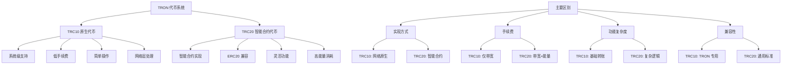
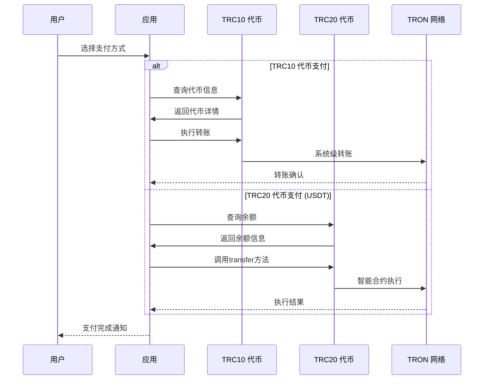

# 🪙 TRC10/TRC20 代币 API 详细文档

> TRON 代币系统操作、TRC10 原生代币和 TRC20 智能合约代币管理的完整指南

## 📋 目录

- [代币系统概述](#代币系统概述)
- [TRC10 原生代币 API](#trc10-原生代币-api)
- [TRC20 代币 API](#trc20-代币-api)
- [代币信息查询](#代币信息查询)
- [代币转账操作](#代币转账操作)
- [代币授权机制](#代币授权机制)
- [项目实战应用](#项目实战应用)

## 🎯 代币系统概述

### TRON 代币架构



### 项目中的代币使用场景



## 🏭 TRC10 原生代币 API

### GetAssetIssueList - 获取代币列表

```typescript
/**
 * 获取所有TRC10代币列表
 * 官方文档: https://developers.tron.network/reference/getassetissuelist
 */
async function getTRC10TokenList(): Promise<{
  success: boolean;
  tokens?: Array<{
    id: number;
    name: string;
    abbr: string;
    totalSupply: number;
    trxNum: number;
    precision: number;
    num: number;
    startTime: Date;
    endTime: Date;
    description: string;
    url: string;
    freeAssetNetLimit: number;
    freeAssetNetUsed: number;
    publicFreeAssetNetLimit: number;
    publicFreeAssetNetUsed: number;
    frozenSupply: Array<{
      frozenAmount: number;
      frozenDays: number;
    }>;
    ownerAddress: string;
  }>;
  error?: string;
}> {
  try {
    console.log(`🏭 Getting TRC10 token list`);

    const tokenList = await tronWeb.trx.getTokensIssued();
    
    if (!tokenList) {
      return {
        success: true,
        tokens: []
      };
    }

    // 解析代币信息
    const formattedTokens = Object.values(tokenList).map((token: any) => ({
      id: token.id,
      name: token.name ? tronWeb.toUtf8(token.name) : '',
      abbr: token.abbr ? tronWeb.toUtf8(token.abbr) : '',
      totalSupply: token.total_supply || 0,
      trxNum: token.trx_num || 1,
      precision: token.precision || 0,
      num: token.num || 1,
      startTime: new Date(token.start_time || 0),
      endTime: new Date(token.end_time || 0),
      description: token.description ? tronWeb.toUtf8(token.description) : '',
      url: token.url ? tronWeb.toUtf8(token.url) : '',
      freeAssetNetLimit: token.free_asset_net_limit || 0,
      freeAssetNetUsed: token.free_asset_net_used || 0,
      publicFreeAssetNetLimit: token.public_free_asset_net_limit || 0,
      publicFreeAssetNetUsed: token.public_free_asset_net_used || 0,
      frozenSupply: token.frozen_supply || [],
      ownerAddress: tronWeb.address.fromHex(token.owner_address)
    }));

    // 按总供应量排序
    formattedTokens.sort((a, b) => b.totalSupply - a.totalSupply);

    console.log(`✅ TRC10 token list retrieved: ${formattedTokens.length} tokens`);

    return {
      success: true,
      tokens: formattedTokens
    };

  } catch (error) {
    console.error(`❌ Failed to get TRC10 token list:`, error);
    return {
      success: false,
      error: error.message
    };
  }
}

/**
 * 根据ID获取TRC10代币信息
 * 官方文档: https://developers.tron.network/reference/getassetissuebyid
 */
async function getTRC10TokenById(tokenId: number): Promise<{
  success: boolean;
  token?: any;
  error?: string;
}> {
  try {
    console.log(`🔍 Getting TRC10 token by ID: ${tokenId}`);

    const token = await tronWeb.trx.getTokenByID(tokenId);
    
    if (!token || !token.name) {
      return {
        success: false,
        error: 'Token not found'
      };
    }

    const formattedToken = {
      id: token.id,
      name: tronWeb.toUtf8(token.name),
      abbr: tronWeb.toUtf8(token.abbr || ''),
      totalSupply: token.total_supply || 0,
      precision: token.precision || 0,
      description: token.description ? tronWeb.toUtf8(token.description) : '',
      url: token.url ? tronWeb.toUtf8(token.url) : '',
      ownerAddress: tronWeb.address.fromHex(token.owner_address),
      startTime: new Date(token.start_time || 0),
      endTime: new Date(token.end_time || 0)
    };

    console.log(`✅ TRC10 token retrieved: ${formattedToken.name} (${formattedToken.abbr})`);

    return {
      success: true,
      token: formattedToken
    };

  } catch (error) {
    console.error(`❌ Failed to get TRC10 token by ID:`, error);
    return {
      success: false,
      error: error.message
    };
  }
}

/**
 * 查询账户TRC10代币余额
 * 官方文档: https://developers.tron.network/reference/getaccountbalance
 */
async function getTRC10TokenBalance(
  accountAddress: string,
  tokenId: number
): Promise<{
  success: boolean;
  balance?: number;
  formattedBalance?: string;
  error?: string;
}> {
  try {
    console.log(`💰 Getting TRC10 token balance: ${accountAddress}, token ${tokenId}`);

    const account = await tronWeb.trx.getAccount(accountAddress);
    
    if (!account || !account.assetV2) {
      return {
        success: true,
        balance: 0,
        formattedBalance: '0'
      };
    }

    // 查找指定代币的余额
    const tokenBalance = account.assetV2.find((asset: any) => 
      parseInt(asset.key) === tokenId
    );

    const balance = tokenBalance ? tokenBalance.value : 0;

    // 获取代币精度信息
    const tokenInfo = await getTRC10TokenById(tokenId);
    const precision = tokenInfo.success ? (tokenInfo.token?.precision || 0) : 0;
    
    const formattedBalance = precision > 0 
      ? (balance / Math.pow(10, precision)).toFixed(precision)
      : balance.toString();

    console.log(`✅ TRC10 token balance: ${formattedBalance}`);

    return {
      success: true,
      balance,
      formattedBalance
    };

  } catch (error) {
    console.error(`❌ Failed to get TRC10 token balance:`, error);
    return {
      success: false,
      error: error.message
    };
  }
}

/**
 * TRC10代币转账
 * 官方文档: https://developers.tron.network/reference/transferasset
 */
async function transferTRC10Token(
  recipientAddress: string,
  amount: number,
  tokenId: number,
  fromAddress?: string
): Promise<{
  success: boolean;
  txId?: string;
  error?: string;
}> {
  try {
    console.log(`💸 Transferring TRC10 token: ${amount} units of token ${tokenId} to ${recipientAddress}`);

    const from = fromAddress || tronWeb.defaultAddress.base58;

    // 验证地址
    if (!tronWeb.isAddress(recipientAddress) || !tronWeb.isAddress(from)) {
      throw new Error('Invalid address format');
    }

    // 检查余额
    const balanceResult = await getTRC10TokenBalance(from, tokenId);
    if (!balanceResult.success) {
      throw new Error('Failed to check token balance');
    }

    if (balanceResult.balance! < amount) {
      throw new Error(`Insufficient token balance: ${balanceResult.balance} < ${amount}`);
    }

    // 创建转账交易
    const transaction = await tronWeb.transactionBuilder.sendAsset(
      recipientAddress,
      amount,
      tokenId,
      from
    );

    // 签名交易
    const signedTransaction = await tronWeb.trx.sign(transaction);

    // 广播交易
    const result = await tronWeb.trx.sendRawTransaction(signedTransaction);
    
    if (!result.result) {
      throw new Error(result.message || 'Transfer failed');
    }

    console.log(`✅ TRC10 token transfer successful: ${result.txid}`);

    return {
      success: true,
      txId: result.txid
    };

  } catch (error) {
    console.error(`❌ TRC10 token transfer failed:`, error);
    return {
      success: false,
      error: error.message
    };
  }
}

// 项目中的TRC10代币服务
export class TRC10TokenService {
  private static tokenCache = new Map<number, {
    token: any;
    timestamp: number;
    ttl: number;
  }>();

  /**
   * 获取热门TRC10代币列表
   */
  static async getPopularTRC10Tokens(): Promise<{
    success: boolean;
    tokens?: Array<{
      id: number;
      name: string;
      symbol: string;
      totalSupply: number;
      holderCount?: number;
      tradingVolume24h?: number;
      priceUSD?: number;
    }>;
    error?: string;
  }> {
    try {
      console.log(`🔥 Getting popular TRC10 tokens`);

      const tokenListResult = await getTRC10TokenList();
      if (!tokenListResult.success) {
        throw new Error(tokenListResult.error);
      }

      // 筛选热门代币（按总供应量和活跃度）
      const popularTokens = tokenListResult.tokens!
        .filter(token => 
          token.totalSupply > 1000000 && // 总供应量大于100万
          token.name.length > 0 &&       // 有名称
          token.abbr.length > 0           // 有缩写
        )
        .slice(0, 50) // 取前50个
        .map(token => ({
          id: token.id,
          name: token.name,
          symbol: token.abbr,
          totalSupply: token.totalSupply,
          holderCount: undefined, // 需要额外API获取
          tradingVolume24h: undefined, // 需要额外API获取
          priceUSD: undefined // 需要价格API获取
        }));

      console.log(`✅ Popular TRC10 tokens retrieved: ${popularTokens.length}`);

      return {
        success: true,
        tokens: popularTokens
      };

    } catch (error) {
      console.error(`❌ Failed to get popular TRC10 tokens:`, error);
      return {
        success: false,
        error: error.message
      };
    }
  }

  /**
   * 批量查询TRC10代币余额
   */
  static async getBatchTRC10Balances(
    accountAddress: string,
    tokenIds: number[]
  ): Promise<Array<{
    tokenId: number;
    balance: number;
    formattedBalance: string;
    success: boolean;
    error?: string;
  }>> {
    try {
      console.log(`📊 Batch querying TRC10 balances for ${tokenIds.length} tokens`);

      const results = [];

      for (const tokenId of tokenIds) {
        try {
          const balanceResult = await getTRC10TokenBalance(accountAddress, tokenId);
          
          results.push({
            tokenId,
            balance: balanceResult.success ? balanceResult.balance! : 0,
            formattedBalance: balanceResult.success ? balanceResult.formattedBalance! : '0',
            success: balanceResult.success,
            error: balanceResult.error
          });

        } catch (error) {
          results.push({
            tokenId,
            balance: 0,
            formattedBalance: '0',
            success: false,
            error: error.message
          });
        }

        // 批次间延迟
        if (tokenIds.indexOf(tokenId) < tokenIds.length - 1) {
          await new Promise(resolve => setTimeout(resolve, 100));
        }
      }

      const successCount = results.filter(r => r.success).length;
      console.log(`✅ Batch TRC10 balance query completed: ${successCount}/${tokenIds.length}`);

      return results;

    } catch (error) {
      console.error(`❌ Batch TRC10 balance query failed:`, error);
      return tokenIds.map(tokenId => ({
        tokenId,
        balance: 0,
        formattedBalance: '0',
        success: false,
        error: error.message
      }));
    }
  }

  /**
   * TRC10代币转账费用估算
   */
  static async estimateTRC10TransferFee(
    amount: number,
    tokenId: number
  ): Promise<{
    success: boolean;
    estimate?: {
      bandwidthCost: number; // TRX
      energyCost: number;    // TRX (always 0 for TRC10)
      totalCost: number;     // TRX
      recommendation: string;
    };
    error?: string;
  }> {
    try {
      console.log(`💵 Estimating TRC10 transfer fee for token ${tokenId}`);

      // TRC10转账只消耗带宽，不消耗能量
      const bandwidthNeeded = 268; // TRC10转账大约需要268字节带宽
      const bandwidthPrice = 0.001; // 假设带宽价格，实际应从链参数获取

      const bandwidthCost = bandwidthNeeded * bandwidthPrice;
      const energyCost = 0; // TRC10不需要能量
      const totalCost = bandwidthCost;

      const recommendation = 'TRC10代币转账只消耗带宽，费用较低，建议优先使用';

      const estimate = {
        bandwidthCost,
        energyCost,
        totalCost,
        recommendation
      };

      console.log(`✅ TRC10 transfer fee estimated: ${totalCost.toFixed(6)} TRX`);

      return {
        success: true,
        estimate
      };

    } catch (error) {
      console.error(`❌ TRC10 transfer fee estimation failed:`, error);
      return {
        success: false,
        error: error.message
      };
    }
  }
}
```

## 🔗 TRC20 代币 API

### TRC20 标准接口实现

```typescript
/**
 * TRC20代币标准接口
 */
interface TRC20Token {
  name(): Promise<string>;
  symbol(): Promise<string>;
  decimals(): Promise<number>;
  totalSupply(): Promise<number>;
  balanceOf(account: string): Promise<number>;
  transfer(to: string, amount: number): Promise<boolean>;
  allowance(owner: string, spender: string): Promise<number>;
  approve(spender: string, amount: number): Promise<boolean>;
  transferFrom(from: string, to: string, amount: number): Promise<boolean>;
}

/**
 * TRC20代币服务实现
 */
export class TRC20TokenService {
  private static readonly COMMON_TRC20_TOKENS = {
    USDT: 'TR7NHqjeKQxGTCi8q8ZY4pL8otSzgjLj6t',
    USDC: 'TEkxiTehnzSmSe2XqrBj4w32RUN966rdz8',
    TUSD: 'TUpMhErZL2fhh4sVNULAbNKLokS4GjC1F4',
    BTT: 'TAFjULxiVgT4qWk6UZwjqwZXTSaGaqnVp4',
    WIN: 'TLa2f6VPqDgRE67v1736s7bJ8Ray5wYjU7',
    SUN: 'TSSMHYeV2uE9qYH95DqyoCuNCzEL1NvU3S'
  };

  /**
   * 创建TRC20代币实例
   */
  static async createTokenInstance(contractAddress: string): Promise<{
    success: boolean;
    contract?: any;
    error?: string;
  }> {
    try {
      console.log(`🔗 Creating TRC20 token instance: ${contractAddress}`);

      // 验证合约地址
      if (!tronWeb.isAddress(contractAddress)) {
        throw new Error('Invalid contract address');
      }

      const contract = await tronWeb.contract().at(contractAddress);
      
      console.log(`✅ TRC20 token instance created`);

      return {
        success: true,
        contract
      };

    } catch (error) {
      console.error(`❌ Failed to create TRC20 token instance:`, error);
      return {
        success: false,
        error: error.message
      };
    }
  }

  /**
   * 获取TRC20代币基本信息
   */
  static async getTRC20TokenInfo(contractAddress: string): Promise<{
    success: boolean;
    tokenInfo?: {
      name: string;
      symbol: string;
      decimals: number;
      totalSupply: number;
      contractAddress: string;
    };
    error?: string;
  }> {
    try {
      console.log(`ℹ️ Getting TRC20 token info: ${contractAddress}`);

      const contractResult = await this.createTokenInstance(contractAddress);
      if (!contractResult.success) {
        throw new Error(contractResult.error);
      }

      const contract = contractResult.contract!;

      // 并行调用获取代币信息
      const [name, symbol, decimals, totalSupply] = await Promise.all([
        contract.name().call(),
        contract.symbol().call(),
        contract.decimals().call(),
        contract.totalSupply().call()
      ]);

      const tokenInfo = {
        name: name || 'Unknown',
        symbol: symbol || 'UNKNOWN',
        decimals: decimals.toNumber() || 0,
        totalSupply: totalSupply.toNumber() || 0,
        contractAddress
      };

      console.log(`✅ TRC20 token info retrieved: ${tokenInfo.name} (${tokenInfo.symbol})`);

      return {
        success: true,
        tokenInfo
      };

    } catch (error) {
      console.error(`❌ Failed to get TRC20 token info:`, error);
      return {
        success: false,
        error: error.message
      };
    }
  }

  /**
   * 查询TRC20代币余额
   */
  static async getTRC20TokenBalance(
    contractAddress: string,
    accountAddress: string
  ): Promise<{
    success: boolean;
    balance?: number;
    formattedBalance?: string;
    decimals?: number;
    error?: string;
  }> {
    try {
      console.log(`💰 Getting TRC20 token balance: ${contractAddress} for ${accountAddress}`);

      const contractResult = await this.createTokenInstance(contractAddress);
      if (!contractResult.success) {
        throw new Error(contractResult.error);
      }

      const contract = contractResult.contract!;

      // 并行获取余额和小数位数
      const [balance, decimals] = await Promise.all([
        contract.balanceOf(accountAddress).call(),
        contract.decimals().call()
      ]);

      const rawBalance = balance.toNumber();
      const tokenDecimals = decimals.toNumber();
      const formattedBalance = tokenDecimals > 0 
        ? (rawBalance / Math.pow(10, tokenDecimals)).toFixed(tokenDecimals)
        : rawBalance.toString();

      console.log(`✅ TRC20 token balance: ${formattedBalance}`);

      return {
        success: true,
        balance: rawBalance,
        formattedBalance,
        decimals: tokenDecimals
      };

    } catch (error) {
      console.error(`❌ Failed to get TRC20 token balance:`, error);
      return {
        success: false,
        error: error.message
      };
    }
  }

  /**
   * TRC20代币转账
   */
  static async transferTRC20Token(
    contractAddress: string,
    recipientAddress: string,
    amount: number,
    decimals: number = 6,
    options: {
      feeLimit?: number;
      fromAddress?: string;
    } = {}
  ): Promise<{
    success: boolean;
    txId?: string;
    energyUsed?: number;
    error?: string;
  }> {
    try {
      console.log(`💸 Transferring TRC20 token: ${amount} to ${recipientAddress}`);

      const { feeLimit = 150000000, fromAddress } = options;
      const from = fromAddress || tronWeb.defaultAddress.base58;

      // 验证地址
      if (!tronWeb.isAddress(contractAddress) || !tronWeb.isAddress(recipientAddress)) {
        throw new Error('Invalid address format');
      }

      // 检查余额
      const balanceResult = await this.getTRC20TokenBalance(contractAddress, from);
      if (!balanceResult.success) {
        throw new Error('Failed to check token balance');
      }

      const currentBalance = balanceResult.balance! / Math.pow(10, decimals);
      if (currentBalance < amount) {
        throw new Error(`Insufficient token balance: ${currentBalance} < ${amount}`);
      }

      // 转换金额为最小单位
      const transferAmount = amount * Math.pow(10, decimals);

      // 创建转账交易
      const transaction = await tronWeb.transactionBuilder.triggerSmartContract(
        contractAddress,
        'transfer(address,uint256)',
        {
          feeLimit,
          callValue: 0
        },
        [
          { type: 'address', value: recipientAddress },
          { type: 'uint256', value: transferAmount }
        ],
        from
      );

      if (!transaction.result || !transaction.result.result) {
        throw new Error(transaction.result?.message || 'Contract call failed');
      }

      // 签名并广播交易
      const signedTransaction = await tronWeb.trx.sign(transaction.transaction);
      const result = await tronWeb.trx.sendRawTransaction(signedTransaction);

      if (!result.result) {
        throw new Error(result.message || 'Transfer failed');
      }

      console.log(`✅ TRC20 token transfer successful: ${result.txid}`);

      return {
        success: true,
        txId: result.txid,
        energyUsed: transaction.energy_used
      };

    } catch (error) {
      console.error(`❌ TRC20 token transfer failed:`, error);
      return {
        success: false,
        error: error.message
      };
    }
  }

  /**
   * 查询TRC20代币授权额度
   */
  static async getTRC20Allowance(
    contractAddress: string,
    ownerAddress: string,
    spenderAddress: string
  ): Promise<{
    success: boolean;
    allowance?: number;
    formattedAllowance?: string;
    error?: string;
  }> {
    try {
      console.log(`🔍 Getting TRC20 allowance: ${ownerAddress} -> ${spenderAddress}`);

      const contractResult = await this.createTokenInstance(contractAddress);
      if (!contractResult.success) {
        throw new Error(contractResult.error);
      }

      const contract = contractResult.contract!;

      // 获取授权额度和小数位数
      const [allowance, decimals] = await Promise.all([
        contract.allowance(ownerAddress, spenderAddress).call(),
        contract.decimals().call()
      ]);

      const rawAllowance = allowance.toNumber();
      const tokenDecimals = decimals.toNumber();
      const formattedAllowance = tokenDecimals > 0 
        ? (rawAllowance / Math.pow(10, tokenDecimals)).toFixed(tokenDecimals)
        : rawAllowance.toString();

      console.log(`✅ TRC20 allowance: ${formattedAllowance}`);

      return {
        success: true,
        allowance: rawAllowance,
        formattedAllowance
      };

    } catch (error) {
      console.error(`❌ Failed to get TRC20 allowance:`, error);
      return {
        success: false,
        error: error.message
      };
    }
  }

  /**
   * 授权TRC20代币
   */
  static async approveTRC20Token(
    contractAddress: string,
    spenderAddress: string,
    amount: number,
    decimals: number = 6,
    options: {
      feeLimit?: number;
      fromAddress?: string;
    } = {}
  ): Promise<{
    success: boolean;
    txId?: string;
    error?: string;
  }> {
    try {
      console.log(`✅ Approving TRC20 token: ${amount} to ${spenderAddress}`);

      const { feeLimit = 100000000, fromAddress } = options;
      const from = fromAddress || tronWeb.defaultAddress.base58;

      // 转换金额为最小单位
      const approveAmount = amount * Math.pow(10, decimals);

      // 创建授权交易
      const transaction = await tronWeb.transactionBuilder.triggerSmartContract(
        contractAddress,
        'approve(address,uint256)',
        {
          feeLimit,
          callValue: 0
        },
        [
          { type: 'address', value: spenderAddress },
          { type: 'uint256', value: approveAmount }
        ],
        from
      );

      if (!transaction.result || !transaction.result.result) {
        throw new Error(transaction.result?.message || 'Approve failed');
      }

      // 签名并广播交易
      const signedTransaction = await tronWeb.trx.sign(transaction.transaction);
      const result = await tronWeb.trx.sendRawTransaction(signedTransaction);

      if (!result.result) {
        throw new Error(result.message || 'Approve failed');
      }

      console.log(`✅ TRC20 token approval successful: ${result.txid}`);

      return {
        success: true,
        txId: result.txid
      };

    } catch (error) {
      console.error(`❌ TRC20 token approval failed:`, error);
      return {
        success: false,
        error: error.message
      };
    }
  }

  /**
   * 获取常用TRC20代币列表
   */
  static getCommonTRC20Tokens(): Array<{
    name: string;
    symbol: string;
    contract: string;
    decimals: number;
    description: string;
  }> {
    return [
      {
        name: 'Tether USD',
        symbol: 'USDT',
        contract: this.COMMON_TRC20_TOKENS.USDT,
        decimals: 6,
        description: '最广泛使用的稳定币'
      },
      {
        name: 'USD Coin',
        symbol: 'USDC',
        contract: this.COMMON_TRC20_TOKENS.USDC,
        decimals: 6,
        description: 'Circle发行的稳定币'
      },
      {
        name: 'TrueUSD',
        symbol: 'TUSD',
        contract: this.COMMON_TRC20_TOKENS.TUSD,
        decimals: 18,
        description: '受监管的稳定币'
      },
      {
        name: 'BitTorrent Token',
        symbol: 'BTT',
        contract: this.COMMON_TRC20_TOKENS.BTT,
        decimals: 18,
        description: 'BitTorrent生态代币'
      },
      {
        name: 'WINk',
        symbol: 'WIN',
        contract: this.COMMON_TRC20_TOKENS.WIN,
        decimals: 6,
        description: '去中心化游戏平台代币'
      },
      {
        name: 'SUN Token',
        symbol: 'SUN',
        contract: this.COMMON_TRC20_TOKENS.SUN,
        decimals: 18,
        description: 'DeFi生态代币'
      }
    ];
  }

  /**
   * 批量查询TRC20代币余额
   */
  static async getBatchTRC20Balances(
    accountAddress: string,
    tokenContracts: Array<{
      contract: string;
      symbol: string;
      decimals: number;
    }>
  ): Promise<Array<{
    contract: string;
    symbol: string;
    balance: number;
    formattedBalance: string;
    success: boolean;
    error?: string;
  }>> {
    try {
      console.log(`📊 Batch querying TRC20 balances for ${tokenContracts.length} tokens`);

      const results = [];

      for (const token of tokenContracts) {
        try {
          const balanceResult = await this.getTRC20TokenBalance(
            token.contract,
            accountAddress
          );

          results.push({
            contract: token.contract,
            symbol: token.symbol,
            balance: balanceResult.success ? balanceResult.balance! : 0,
            formattedBalance: balanceResult.success ? balanceResult.formattedBalance! : '0',
            success: balanceResult.success,
            error: balanceResult.error
          });

        } catch (error) {
          results.push({
            contract: token.contract,
            symbol: token.symbol,
            balance: 0,
            formattedBalance: '0',
            success: false,
            error: error.message
          });
        }

        // 批次间延迟，避免请求过于频繁
        await new Promise(resolve => setTimeout(resolve, 200));
      }

      const successCount = results.filter(r => r.success).length;
      console.log(`✅ Batch TRC20 balance query completed: ${successCount}/${tokenContracts.length}`);

      return results;

    } catch (error) {
      console.error(`❌ Batch TRC20 balance query failed:`, error);
      return tokenContracts.map(token => ({
        contract: token.contract,
        symbol: token.symbol,
        balance: 0,
        formattedBalance: '0',
        success: false,
        error: error.message
      }));
    }
  }

  /**
   * USDT专用方法
   */
  static async getUSDTBalance(accountAddress: string): Promise<{
    success: boolean;
    balance?: number;
    formattedBalance?: string;
    error?: string;
  }> {
    return await this.getTRC20TokenBalance(
      this.COMMON_TRC20_TOKENS.USDT,
      accountAddress
    );
  }

  static async transferUSDT(
    recipientAddress: string,
    amount: number,
    options: {
      feeLimit?: number;
      fromAddress?: string;
    } = {}
  ): Promise<{
    success: boolean;
    txId?: string;
    error?: string;
  }> {
    const result = await this.transferTRC20Token(
      this.COMMON_TRC20_TOKENS.USDT,
      recipientAddress,
      amount,
      6, // USDT has 6 decimals
      options
    );

    return {
      success: result.success,
      txId: result.txId,
      error: result.error
    };
  }
}
```

## 💡 项目实战应用

### 统一代币管理系统

```typescript
/**
 * 统一代币管理服务
 */
export class UnifiedTokenService {
  /**
   * 获取账户所有代币余额
   */
  static async getAllTokenBalances(accountAddress: string): Promise<{
    success: boolean;
    balances?: {
      trx: number;
      trc10: Array<{
        tokenId: number;
        name: string;
        symbol: string;
        balance: number;
        formattedBalance: string;
      }>;
      trc20: Array<{
        contract: string;
        name: string;
        symbol: string;
        balance: number;
        formattedBalance: string;
        usdValue?: number;
      }>;
      totalUSDValue?: number;
    };
    error?: string;
  }> {
    try {
      console.log(`📊 Getting all token balances for: ${accountAddress}`);

      // 1. 获取TRX余额
      const trxBalance = await tronWeb.trx.getBalance(accountAddress) / 1000000;

      // 2. 获取常用TRC10代币余额
      const popularTRC10 = await TRC10TokenService.getPopularTRC10Tokens();
      const trc10TokenIds = popularTRC10.success 
        ? popularTRC10.tokens!.slice(0, 10).map(t => t.id) // 取前10个
        : [];

      const trc10Balances = await TRC10TokenService.getBatchTRC10Balances(
        accountAddress,
        trc10TokenIds
      );

      // 3. 获取常用TRC20代币余额
      const commonTRC20 = TRC20TokenService.getCommonTRC20Tokens();
      const trc20Contracts = commonTRC20.map(token => ({
        contract: token.contract,
        symbol: token.symbol,
        decimals: token.decimals
      }));

      const trc20Balances = await TRC20TokenService.getBatchTRC20Balances(
        accountAddress,
        trc20Contracts
      );

      // 4. 整理TRC10代币信息
      const trc10Results = [];
      for (const balance of trc10Balances) {
        if (balance.success && balance.balance > 0) {
          const tokenInfo = await getTRC10TokenById(balance.tokenId);
          trc10Results.push({
            tokenId: balance.tokenId,
            name: tokenInfo.success ? tokenInfo.token?.name || 'Unknown' : 'Unknown',
            symbol: tokenInfo.success ? tokenInfo.token?.abbr || 'UNKNOWN' : 'UNKNOWN',
            balance: balance.balance,
            formattedBalance: balance.formattedBalance
          });
        }
      }

      // 5. 整理TRC20代币信息
      const trc20Results = [];
      for (const balance of trc20Balances) {
        if (balance.success && parseFloat(balance.formattedBalance) > 0) {
          const tokenInfo = commonTRC20.find(t => t.contract === balance.contract);
          trc20Results.push({
            contract: balance.contract,
            name: tokenInfo?.name || 'Unknown',
            symbol: balance.symbol,
            balance: balance.balance,
            formattedBalance: balance.formattedBalance,
            usdValue: undefined // 需要价格API获取
          });
        }
      }

      const balances = {
        trx: trxBalance,
        trc10: trc10Results,
        trc20: trc20Results,
        totalUSDValue: undefined // 需要价格计算
      };

      console.log(`✅ All token balances retrieved:`, {
        trx: trxBalance,
        trc10Count: trc10Results.length,
        trc20Count: trc20Results.length
      });

      return {
        success: true,
        balances
      };

    } catch (error) {
      console.error(`❌ Failed to get all token balances:`, error);
      return {
        success: false,
        error: error.message
      };
    }
  }

  /**
   * 统一代币转账接口
   */
  static async transferToken(params: {
    tokenType: 'TRX' | 'TRC10' | 'TRC20';
    tokenId?: number;        // TRC10需要
    contractAddress?: string; // TRC20需要
    recipientAddress: string;
    amount: number;
    decimals?: number;
    fromAddress?: string;
    feeLimit?: number;
  }): Promise<{
    success: boolean;
    txId?: string;
    tokenType: string;
    estimatedFee?: number;
    error?: string;
  }> {
    try {
      console.log(`💸 Unified token transfer:`, {
        type: params.tokenType,
        amount: params.amount,
        to: params.recipientAddress
      });

      let result: any = {};

      switch (params.tokenType) {
        case 'TRX':
          // TRX转账
          const trxTx = await tronWeb.transactionBuilder.sendTrx(
            params.recipientAddress,
            params.amount * 1000000, // 转换为Sun
            params.fromAddress
          );
          const signedTrxTx = await tronWeb.trx.sign(trxTx);
          const trxResult = await tronWeb.trx.sendRawTransaction(signedTrxTx);
          
          result = {
            success: trxResult.result,
            txId: trxResult.txid,
            error: trxResult.message
          };
          break;

        case 'TRC10':
          if (!params.tokenId) {
            throw new Error('Token ID required for TRC10 transfer');
          }
          
          result = await transferTRC10Token(
            params.recipientAddress,
            params.amount,
            params.tokenId,
            params.fromAddress
          );
          break;

        case 'TRC20':
          if (!params.contractAddress) {
            throw new Error('Contract address required for TRC20 transfer');
          }
          
          result = await TRC20TokenService.transferTRC20Token(
            params.contractAddress,
            params.recipientAddress,
            params.amount,
            params.decimals || 6,
            {
              feeLimit: params.feeLimit,
              fromAddress: params.fromAddress
            }
          );
          break;

        default:
          throw new Error(`Unsupported token type: ${params.tokenType}`);
      }

      console.log(`✅ Unified token transfer completed:`, {
        type: params.tokenType,
        success: result.success,
        txId: result.txId
      });

      return {
        success: result.success,
        txId: result.txId,
        tokenType: params.tokenType,
        error: result.error
      };

    } catch (error) {
      console.error(`❌ Unified token transfer failed:`, error);
      return {
        success: false,
        tokenType: params.tokenType,
        error: error.message
      };
    }
  }

  /**
   * 代币转账费用估算
   */
  static async estimateTokenTransferFee(
    tokenType: 'TRX' | 'TRC10' | 'TRC20',
    amount: number,
    tokenId?: number,
    contractAddress?: string
  ): Promise<{
    success: boolean;
    estimate?: {
      bandwidthCost: number;
      energyCost: number;
      totalCost: number;
      recommendation: string;
    };
    error?: string;
  }> {
    try {
      console.log(`💵 Estimating ${tokenType} transfer fee`);

      let estimate: any = {};

      switch (tokenType) {
        case 'TRX':
          estimate = {
            bandwidthCost: 0.268, // TRX转账约268字节带宽
            energyCost: 0,
            totalCost: 0.268,
            recommendation: 'TRX转账只消耗带宽，费用最低'
          };
          break;

        case 'TRC10':
          const trc10Result = await TRC10TokenService.estimateTRC10TransferFee(
            amount,
            tokenId!
          );
          estimate = trc10Result.success ? trc10Result.estimate : {};
          break;

        case 'TRC20':
          // TRC20转账需要更多计算
          estimate = {
            bandwidthCost: 0.345,
            energyCost: 5.46, // 假设13000能量*0.00042TRX
            totalCost: 5.805,
            recommendation: 'TRC20转账需要消耗大量能量，建议预先冻结TRX'
          };
          break;

        default:
          throw new Error(`Unsupported token type: ${tokenType}`);
      }

      console.log(`✅ Transfer fee estimated: ${estimate.totalCost?.toFixed(6)} TRX`);

      return {
        success: true,
        estimate
      };

    } catch (error) {
      console.error(`❌ Transfer fee estimation failed:`, error);
      return {
        success: false,
        error: error.message
      };
    }
  }

  /**
   * 生成代币组合投资组合报告
   */
  static async generatePortfolioReport(accountAddress: string): Promise<{
    success: boolean;
    portfolio?: {
      summary: {
        totalAssetsUSD: number;
        totalTokens: number;
        diversificationScore: number;
      };
      breakdown: {
        trx: { amount: number; percentage: number; usdValue: number; };
        trc10: Array<{
          name: string;
          amount: number;
          percentage: number;
          usdValue: number;
        }>;
        trc20: Array<{
          name: string;
          amount: number;
          percentage: number;
          usdValue: number;
        }>;
      };
      recommendations: string[];
    };
    error?: string;
  }> {
    try {
      console.log(`📊 Generating portfolio report for: ${accountAddress}`);

      const balancesResult = await this.getAllTokenBalances(accountAddress);
      if (!balancesResult.success) {
        throw new Error(balancesResult.error);
      }

      const balances = balancesResult.balances!;

      // 这里应该集成价格API获取实时价格
      // 目前使用模拟数据
      const mockTRXPrice = 0.076; // USD per TRX
      const mockUSDTPrice = 1.0;   // USD per USDT

      const trxValue = balances.trx * mockTRXPrice;
      let totalValue = trxValue;

      // 计算TRC20价值（主要是稳定币）
      for (const token of balances.trc20) {
        if (token.symbol === 'USDT' || token.symbol === 'USDC') {
          const tokenValue = parseFloat(token.formattedBalance) * mockUSDTPrice;
          token.usdValue = tokenValue;
          totalValue += tokenValue;
        }
      }

      const portfolio = {
        summary: {
          totalAssetsUSD: totalValue,
          totalTokens: 1 + balances.trc10.length + balances.trc20.length,
          diversificationScore: Math.min(100, (balances.trc10.length + balances.trc20.length) * 10)
        },
        breakdown: {
          trx: {
            amount: balances.trx,
            percentage: (trxValue / totalValue) * 100,
            usdValue: trxValue
          },
          trc10: balances.trc10.map(token => ({
            name: token.name,
            amount: parseFloat(token.formattedBalance),
            percentage: 0, // 需要价格API计算
            usdValue: 0
          })),
          trc20: balances.trc20.map(token => ({
            name: token.name,
            amount: parseFloat(token.formattedBalance),
            percentage: token.usdValue ? (token.usdValue / totalValue) * 100 : 0,
            usdValue: token.usdValue || 0
          }))
        },
        recommendations: [
          totalValue > 1000 ? '资产规模较大，建议分散投资' : '可考虑增加资产配置',
          balances.trc20.length === 0 ? '建议持有一些稳定币作为避险资产' : '稳定币配置合理',
          '定期监控代币价格波动，及时调整投资组合'
        ]
      };

      console.log(`✅ Portfolio report generated:`, {
        totalValue: totalValue.toFixed(2),
        tokenCount: portfolio.summary.totalTokens
      });

      return {
        success: true,
        portfolio
      };

    } catch (error) {
      console.error(`❌ Failed to generate portfolio report:`, error);
      return {
        success: false,
        error: error.message
      };
    }
  }
}
```

## 🔗 相关文档

- [TRON API 主文档](./README.md) - 完整 API 导航
- [智能合约 API](./05-smart-contracts-api.md) - TRC20 合约详细实现
- [交易管理 API](./04-transactions-api.md) - 代币转账交易处理
- [项目实战示例](./10-project-examples.md) - 代币支付完整流程

---

> 💡 **代币选择建议**
> 
> **TRC10 代币:**
> - ✅ 手续费低（仅消耗带宽）
> - ✅ 系统级支持，操作简单
> - ❌ 功能有限，缺乏复杂逻辑
> - ❌ 生态支持较少
> 
> **TRC20 代币:**
> - ✅ 功能强大，支持复杂逻辑
> - ✅ 兼容性好，生态丰富
> - ✅ 标准化程度高
> - ❌ 手续费高（需要能量）
> - ❌ 操作复杂度高

> 🔧 **实战建议**
> 
> 1. **支付场景**: 小额支付优选TRC10，大额或复杂支付使用TRC20
> 2. **能量管理**: TRC20操作前确保有足够能量资源
> 3. **批量操作**: 合理安排批次间隔，避免网络拥堵
> 4. **安全考虑**: 验证合约地址，防范假币攻击
> 5. **用户体验**: 提供清晰的费用预估和转账状态反馈
