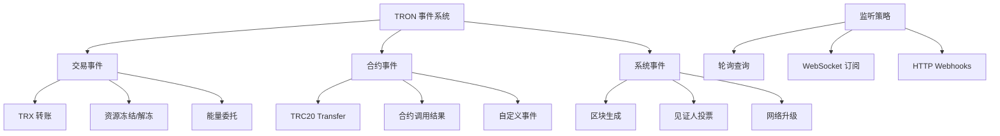
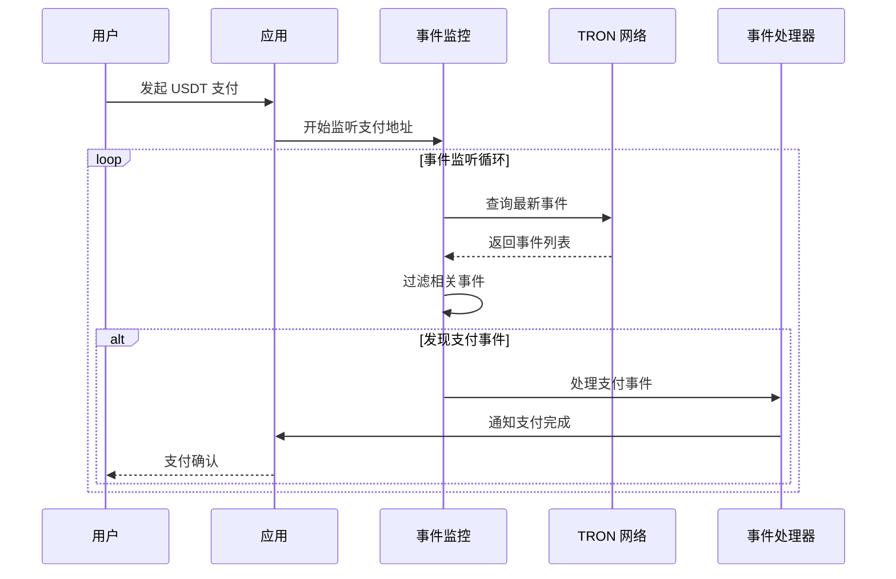

# 📡 事件监听 API 详细文档

> TRON 网络事件监听、支付监控和实时状态跟踪的完整指南

## 📋 目录

- [事件监听概述](#事件监听概述)
- [事件查询 API](#事件查询-api)
- [实时事件监听](#实时事件监听)
- [支付监控系统](#支付监控系统)
- [事件过滤和解析](#事件过滤和解析)
- [性能优化策略](#性能优化策略)
- [项目实战应用](#项目实战应用)

## 🎯 事件监听概述

### TRON 事件系统架构



### 项目中的事件监听场景



## 🔍 事件查询 API

### GetEventsByTransactionID - 根据交易ID查询事件

```typescript
/**
 * 根据交易ID查询相关事件
 * 官方文档: https://developers.tron.network/reference/geteventsbytransactionid
 */
async function getEventsByTransactionId(txId: string): Promise<{
  success: boolean;
  events?: Array<{
    blockNumber: number;
    blockTimestamp: number;
    transactionId: string;
    contractAddress: string;
    eventSignature: string;
    eventName: string;
    data: any;
    topics: string[];
  }>;
  error?: string;
}> {
  try {
    console.log(`📡 Querying events for transaction: ${txId}`);

    const events = await tronWeb.event.getEventsByTransactionID(txId);
    
    if (!events || events.length === 0) {
      console.log(`📭 No events found for transaction: ${txId}`);
      return {
        success: true,
        events: []
      };
    }

    // 解析和格式化事件
    const formattedEvents = events.map(event => ({
      blockNumber: event.blockNumber,
      blockTimestamp: event.blockTimestamp,
      transactionId: event.transactionId,
      contractAddress: event.contractAddress,
      eventSignature: event.eventSignature,
      eventName: event.eventName || 'Unknown',
      data: event.result || event.data,
      topics: event.topics || []
    }));

    console.log(`✅ Found ${formattedEvents.length} events for transaction: ${txId}`);

    return {
      success: true,
      events: formattedEvents
    };

  } catch (error) {
    console.error(`❌ Failed to get events by transaction ID:`, error);
    return {
      success: false,
      error: error.message
    };
  }
}

/**
 * 根据合约地址查询事件
 * 官方文档: https://developers.tron.network/reference/geteventsbycontractaddress
 */
async function getEventsByContractAddress(
  contractAddress: string,
  options: {
    eventName?: string;
    blockNumber?: number;
    minTimestamp?: number;
    maxTimestamp?: number;
    orderBy?: 'timestamp_desc' | 'timestamp_asc';
    limit?: number;
  } = {}
): Promise<{
  success: boolean;
  events?: any[];
  total?: number;
  error?: string;
}> {
  try {
    console.log(`📡 Querying events for contract: ${contractAddress}`);

    const queryOptions = {
      only_confirmed: true,
      event_name: options.eventName,
      block_number: options.blockNumber,
      min_timestamp: options.minTimestamp,
      max_timestamp: options.maxTimestamp,
      order_by: options.orderBy || 'timestamp_desc',
      limit: options.limit || 200
    };

    const result = await tronWeb.event.getEventsByContractAddress(
      contractAddress,
      queryOptions
    );

    if (!result) {
      return {
        success: true,
        events: [],
        total: 0
      };
    }

    const events = Array.isArray(result) ? result : result.data || [];
    const total = result.total || events.length;

    console.log(`✅ Found ${events.length} events for contract (total: ${total})`);

    return {
      success: true,
      events,
      total
    };

  } catch (error) {
    console.error(`❌ Failed to get events by contract address:`, error);
    return {
      success: false,
      error: error.message
    };
  }
}

// 项目中的事件查询服务
export class EventQueryService {
  /**
   * 智能事件查询（支持多种过滤条件）
   */
  static async smartEventQuery(params: {
    contractAddress?: string;
    transactionId?: string;
    eventName?: string;
    fromAddress?: string;
    toAddress?: string;
    timeRange?: {
      from: Date;
      to: Date;
    };
    amountRange?: {
      min: number;
      max: number;
    };
    limit?: number;
  }): Promise<{
    success: boolean;
    events?: Array<{
      transactionId: string;
      blockNumber: number;
      timestamp: Date;
      eventName: string;
      contractAddress: string;
      data: any;
      parsed?: {
        from?: string;
        to?: string;
        amount?: number;
        [key: string]: any;
      };
    }>;
    totalFound?: number;
    error?: string;
  }> {
    try {
      console.log(`🧠 Smart event query:`, params);

      let events: any[] = [];

      // 根据查询条件选择合适的API
      if (params.transactionId) {
        const result = await getEventsByTransactionId(params.transactionId);
        if (!result.success) {
          throw new Error(result.error);
        }
        events = result.events || [];
      } else if (params.contractAddress) {
        const options: any = {
          eventName: params.eventName,
          limit: params.limit || 200
        };

        if (params.timeRange) {
          options.minTimestamp = params.timeRange.from.getTime();
          options.maxTimestamp = params.timeRange.to.getTime();
        }

        const result = await getEventsByContractAddress(params.contractAddress, options);
        if (!result.success) {
          throw new Error(result.error);
        }
        events = result.events || [];
      }

      // 应用额外的过滤条件
      let filteredEvents = events;

      if (params.fromAddress || params.toAddress || params.amountRange) {
        filteredEvents = events.filter(event => {
          const parsed = this.parseEventData(event);
          
          // 地址过滤
          if (params.fromAddress && parsed.from !== params.fromAddress) {
            return false;
          }
          if (params.toAddress && parsed.to !== params.toAddress) {
            return false;
          }
          
          // 金额过滤
          if (params.amountRange && parsed.amount !== undefined) {
            if (parsed.amount < params.amountRange.min || 
                parsed.amount > params.amountRange.max) {
              return false;
            }
          }
          
          return true;
        });
      }

      // 格式化返回结果
      const formattedEvents = filteredEvents.map(event => ({
        transactionId: event.transactionId || event.transaction_id,
        blockNumber: event.blockNumber || event.block_number,
        timestamp: new Date((event.blockTimestamp || event.block_timestamp) * 1000),
        eventName: event.eventName || event.event_name || 'Unknown',
        contractAddress: event.contractAddress || event.contract_address,
        data: event.result || event.data,
        parsed: this.parseEventData(event)
      }));

      console.log(`✅ Smart event query completed: ${formattedEvents.length} events found`);

      return {
        success: true,
        events: formattedEvents,
        totalFound: formattedEvents.length
      };

    } catch (error) {
      console.error(`❌ Smart event query failed:`, error);
      return {
        success: false,
        error: error.message
      };
    }
  }

  /**
   * 解析事件数据
   */
  private static parseEventData(event: any): {
    from?: string;
    to?: string;
    amount?: number;
    [key: string]: any;
  } {
    try {
      const data = event.result || event.data || {};
      const parsed: any = {};

      // 标准 Transfer 事件解析
      if (event.eventName === 'Transfer' || event.event_name === 'Transfer') {
        parsed.from = data.from;
        parsed.to = data.to;
        parsed.amount = data.value ? parseFloat(data.value) / 1000000 : undefined; // 假设是USDT (6位小数)
      }

      // 能量委托事件解析
      if (event.eventName === 'ResourceDelegate') {
        parsed.from = data.owner;
        parsed.to = data.receiver;
        parsed.amount = data.balance ? parseFloat(data.balance) / 1000000 : undefined;
        parsed.resource = data.resource;
      }

      // 其他事件数据直接复制
      Object.keys(data).forEach(key => {
        if (!parsed[key]) {
          parsed[key] = data[key];
        }
      });

      return parsed;

    } catch (error) {
      console.warn('Failed to parse event data:', error);
      return {};
    }
  }

  /**
   * 查询特定时间范围内的所有相关事件
   */
  static async getEventsInTimeRange(
    contractAddress: string,
    timeRange: { from: Date; to: Date },
    eventTypes?: string[]
  ): Promise<{
    success: boolean;
    events?: any[];
    summary?: {
      totalEvents: number;
      eventTypeCount: Record<string, number>;
      timeSpan: number;
    };
    error?: string;
  }> {
    try {
      console.log(`📅 Querying events in time range: ${timeRange.from.toISOString()} - ${timeRange.to.toISOString()}`);

      const allEvents = [];
      const eventTypeCount: Record<string, number> = {};

      // 如果指定了事件类型，分别查询
      if (eventTypes && eventTypes.length > 0) {
        for (const eventType of eventTypes) {
          const result = await getEventsByContractAddress(contractAddress, {
            eventName: eventType,
            minTimestamp: timeRange.from.getTime(),
            maxTimestamp: timeRange.to.getTime(),
            limit: 1000
          });

          if (result.success && result.events) {
            allEvents.push(...result.events);
            eventTypeCount[eventType] = result.events.length;
          }
        }
      } else {
        // 查询所有事件
        const result = await getEventsByContractAddress(contractAddress, {
          minTimestamp: timeRange.from.getTime(),
          maxTimestamp: timeRange.to.getTime(),
          limit: 1000
        });

        if (result.success && result.events) {
          allEvents.push(...result.events);
          
          // 统计事件类型
          result.events.forEach(event => {
            const eventName = event.eventName || event.event_name || 'Unknown';
            eventTypeCount[eventName] = (eventTypeCount[eventName] || 0) + 1;
          });
        }
      }

      // 按时间戳排序
      allEvents.sort((a, b) => 
        (b.blockTimestamp || b.block_timestamp) - (a.blockTimestamp || a.block_timestamp)
      );

      const summary = {
        totalEvents: allEvents.length,
        eventTypeCount,
        timeSpan: timeRange.to.getTime() - timeRange.from.getTime()
      };

      console.log(`✅ Time range query completed:`, summary);

      return {
        success: true,
        events: allEvents,
        summary
      };

    } catch (error) {
      console.error(`❌ Time range event query failed:`, error);
      return {
        success: false,
        error: error.message
      };
    }
  }
}
```

## 🔄 实时事件监听

### WebSocket 事件订阅

```typescript
/**
 * 实时事件监听服务
 */
export class RealTimeEventService {
  private static eventListeners = new Map<string, {
    listener: any;
    callback: Function;
    options: any;
  }>();

  private static pollingIntervals = new Map<string, NodeJS.Timeout>();

  /**
   * 开始监听合约事件
   */
  static async startContractEventListener(
    contractAddress: string,
    eventName: string,
    callback: (event: any) => void,
    options: {
      pollInterval?: number;
      maxRetries?: number;
      filterConditions?: any;
    } = {}
  ): Promise<{
    success: boolean;
    listenerId?: string;
    error?: string;
  }> {
    try {
      console.log(`👂 Starting event listener for ${contractAddress}.${eventName}`);

      const {
        pollInterval = 5000,
        maxRetries = 3,
        filterConditions
      } = options;

      const listenerId = `${contractAddress}_${eventName}_${Date.now()}`;
      let lastCheckedBlock = await tronWeb.trx.getCurrentBlock();
      let retryCount = 0;

      // 设置轮询监听
      const pollingInterval = setInterval(async () => {
        try {
          const currentBlock = await tronWeb.trx.getCurrentBlock();
          const currentBlockNumber = currentBlock.block_header.raw_data.number;

          // 只查询新区块的事件
          if (currentBlockNumber > lastCheckedBlock.block_header.raw_data.number) {
            const events = await this.getNewEvents(
              contractAddress,
              eventName,
              lastCheckedBlock.block_header.raw_data.number + 1,
              currentBlockNumber,
              filterConditions
            );

            if (events.length > 0) {
              console.log(`📢 Found ${events.length} new ${eventName} events`);
              
              events.forEach(event => {
                try {
                  callback(event);
                } catch (error) {
                  console.error(`❌ Event callback error:`, error);
                }
              });
            }

            lastCheckedBlock = currentBlock;
            retryCount = 0; // 重置重试计数
          }

        } catch (error) {
          retryCount++;
          console.error(`❌ Event polling error (attempt ${retryCount}):`, error);

          if (retryCount >= maxRetries) {
            console.error(`❌ Max retries reached, stopping listener: ${listenerId}`);
            this.stopEventListener(listenerId);
          }
        }
      }, pollInterval);

      // 存储监听器信息
      this.pollingIntervals.set(listenerId, pollingInterval);
      this.eventListeners.set(listenerId, {
        listener: pollingInterval,
        callback,
        options
      });

      console.log(`✅ Event listener started: ${listenerId}`);

      return {
        success: true,
        listenerId
      };

    } catch (error) {
      console.error(`❌ Failed to start event listener:`, error);
      return {
        success: false,
        error: error.message
      };
    }
  }

  /**
   * 获取指定区块范围内的新事件
   */
  private static async getNewEvents(
    contractAddress: string,
    eventName: string,
    fromBlock: number,
    toBlock: number,
    filterConditions?: any
  ): Promise<any[]> {
    try {
      const events = [];

      // 分批查询区块范围（避免单次查询过大）
      const batchSize = 100;
      for (let block = fromBlock; block <= toBlock; block += batchSize) {
        const endBlock = Math.min(block + batchSize - 1, toBlock);

        const batchEvents = await getEventsByContractAddress(contractAddress, {
          eventName,
          orderBy: 'timestamp_asc',
          limit: 1000
        });

        if (batchEvents.success && batchEvents.events) {
          // 过滤指定区块范围
          const filteredEvents = batchEvents.events.filter(event => {
            const blockNumber = event.blockNumber || event.block_number;
            return blockNumber >= block && blockNumber <= endBlock;
          });

          // 应用自定义过滤条件
          let finalEvents = filteredEvents;
          if (filterConditions) {
            finalEvents = filteredEvents.filter(event => 
              this.matchesFilterConditions(event, filterConditions)
            );
          }

          events.push(...finalEvents);
        }
      }

      return events;

    } catch (error) {
      console.error('Failed to get new events:', error);
      return [];
    }
  }

  /**
   * 检查事件是否匹配过滤条件
   */
  private static matchesFilterConditions(event: any, filterConditions: any): boolean {
    try {
      const eventData = event.result || event.data || {};

      for (const [key, value] of Object.entries(filterConditions)) {
        if (eventData[key] !== value) {
          return false;
        }
      }

      return true;
    } catch {
      return false;
    }
  }

  /**
   * 停止事件监听
   */
  static stopEventListener(listenerId: string): boolean {
    try {
      const interval = this.pollingIntervals.get(listenerId);
      if (interval) {
        clearInterval(interval);
        this.pollingIntervals.delete(listenerId);
      }

      this.eventListeners.delete(listenerId);

      console.log(`🛑 Event listener stopped: ${listenerId}`);
      return true;

    } catch (error) {
      console.error(`❌ Failed to stop event listener:`, error);
      return false;
    }
  }

  /**
   * 停止所有事件监听
   */
  static stopAllEventListeners(): void {
    console.log(`🛑 Stopping all event listeners (${this.pollingIntervals.size})`);

    for (const [listenerId] of this.pollingIntervals) {
      this.stopEventListener(listenerId);
    }

    console.log(`✅ All event listeners stopped`);
  }

  /**
   * 获取活跃监听器状态
   */
  static getActiveListeners(): Array<{
    listenerId: string;
    options: any;
    startTime: Date;
  }> {
    const listeners = [];

    for (const [listenerId, listenerInfo] of this.eventListeners) {
      listeners.push({
        listenerId,
        options: listenerInfo.options,
        startTime: new Date(parseInt(listenerId.split('_').pop() || '0'))
      });
    }

    return listeners;
  }
}
```

## 💰 支付监控系统

### USDT 支付监控

```typescript
/**
 * 专门用于支付监控的服务
 */
export class PaymentEventMonitor {
  private static readonly USDT_CONTRACT = 'TR7NHqjeKQxGTCi8q8ZY4pL8otSzgjLj6t';
  private static readonly USDC_CONTRACT = 'TEkxiTehnzSmSe2XqrBj4w32RUN966rdz8';

  private static monitoringSessions = new Map<string, {
    sessionId: string;
    targetAddress: string;
    expectedAmount: number;
    tolerance: number;
    startTime: Date;
    timeout: number;
    callback: Function;
    listenerId?: string;
  }>();

  /**
   * 开始监控特定地址的 USDT 支付
   */
  static async startPaymentMonitoring(params: {
    targetAddress: string;
    expectedAmount: number;
    tolerance?: number;
    timeout?: number;
    tokenContract?: string;
    onPaymentDetected?: (payment: {
      transactionId: string;
      from: string;
      to: string;
      amount: number;
      timestamp: Date;
      blockNumber: number;
    }) => void;
    onTimeout?: () => void;
    onError?: (error: string) => void;
  }): Promise<{
    success: boolean;
    sessionId?: string;
    error?: string;
  }> {
    try {
      console.log(`💰 Starting payment monitoring for ${params.targetAddress}`);

      const sessionId = `payment_${Date.now()}_${Math.random().toString(36).substr(2, 9)}`;
      const {
        targetAddress,
        expectedAmount,
        tolerance = 0.01,
        timeout = 300000, // 5分钟默认超时
        tokenContract = this.USDT_CONTRACT,
        onPaymentDetected,
        onTimeout,
        onError
      } = params;

      // 获取初始余额作为基线
      const initialBalance = await this.getTokenBalance(tokenContract, targetAddress);

      // 创建监控会话
      const session = {
        sessionId,
        targetAddress,
        expectedAmount,
        tolerance,
        startTime: new Date(),
        timeout,
        callback: onPaymentDetected || (() => {})
      };

      this.monitoringSessions.set(sessionId, session);

      // 开始事件监听
      const listenerResult = await RealTimeEventService.startContractEventListener(
        tokenContract,
        'Transfer',
        (event) => this.handleTransferEvent(sessionId, event, initialBalance),
        {
          pollInterval: 3000, // 3秒轮询
          filterConditions: {
            to: targetAddress
          }
        }
      );

      if (!listenerResult.success) {
        throw new Error(listenerResult.error);
      }

      // 更新会话信息
      session.listenerId = listenerResult.listenerId;

      // 设置超时处理
      setTimeout(() => {
        if (this.monitoringSessions.has(sessionId)) {
          console.log(`⏰ Payment monitoring timeout: ${sessionId}`);
          
          if (onTimeout) {
            try {
              onTimeout();
            } catch (error) {
              console.error('Timeout callback error:', error);
            }
          }
          
          this.stopPaymentMonitoring(sessionId);
        }
      }, timeout);

      console.log(`✅ Payment monitoring started: ${sessionId}`);

      return {
        success: true,
        sessionId
      };

    } catch (error) {
      console.error(`❌ Failed to start payment monitoring:`, error);
      
      if (params.onError) {
        try {
          params.onError(error.message);
        } catch (callbackError) {
          console.error('Error callback error:', callbackError);
        }
      }

      return {
        success: false,
        error: error.message
      };
    }
  }

  /**
   * 处理转账事件
   */
  private static async handleTransferEvent(
    sessionId: string,
    event: any,
    initialBalance: number
  ): Promise<void> {
    try {
      const session = this.monitoringSessions.get(sessionId);
      if (!session) return;

      console.log(`🔍 Processing transfer event for session: ${sessionId}`);

      // 解析事件数据
      const eventData = event.result || event.data || {};
      const transferAmount = eventData.value ? parseFloat(eventData.value) / 1000000 : 0;
      const toAddress = eventData.to;

      // 检查是否是目标地址的转账
      if (toAddress !== session.targetAddress) {
        return;
      }

      // 检查金额是否匹配
      const amountDiff = Math.abs(transferAmount - session.expectedAmount);
      if (amountDiff <= session.tolerance) {
        console.log(`🎉 Payment detected! Amount: ${transferAmount} USDT`);

        // 构建支付信息
        const payment = {
          transactionId: event.transactionId || event.transaction_id,
          from: eventData.from,
          to: eventData.to,
          amount: transferAmount,
          timestamp: new Date((event.blockTimestamp || event.block_timestamp) * 1000),
          blockNumber: event.blockNumber || event.block_number
        };

        // 调用回调函数
        try {
          session.callback(payment);
        } catch (error) {
          console.error('Payment callback error:', error);
        }

        // 停止监控
        this.stopPaymentMonitoring(sessionId);
      } else {
        console.log(`💸 Transfer detected but amount mismatch: ${transferAmount} (expected: ${session.expectedAmount})`);
      }

    } catch (error) {
      console.error(`❌ Error handling transfer event:`, error);
    }
  }

  /**
   * 获取代币余额
   */
  private static async getTokenBalance(
    contractAddress: string,
    accountAddress: string
  ): Promise<number> {
    try {
      const result = await SmartContractService.advancedContractCall(
        contractAddress,
        'balanceOf(address)',
        [{ type: 'address', value: accountAddress }],
        { isConstant: true }
      );

      if (result.success && result.result) {
        const balanceHex = result.result[0];
        const balanceRaw = tronWeb.utils.abi.decodeParams(['uint256'], balanceHex)[0];
        return balanceRaw.toNumber() / 1000000; // 假设6位小数
      }

      return 0;
    } catch (error) {
      console.error('Failed to get token balance:', error);
      return 0;
    }
  }

  /**
   * 停止支付监控
   */
  static stopPaymentMonitoring(sessionId: string): boolean {
    try {
      const session = this.monitoringSessions.get(sessionId);
      if (!session) {
        return false;
      }

      // 停止事件监听
      if (session.listenerId) {
        RealTimeEventService.stopEventListener(session.listenerId);
      }

      // 移除会话
      this.monitoringSessions.delete(sessionId);

      console.log(`🛑 Payment monitoring stopped: ${sessionId}`);
      return true;

    } catch (error) {
      console.error(`❌ Failed to stop payment monitoring:`, error);
      return false;
    }
  }

  /**
   * 获取监控会话状态
   */
  static getMonitoringStatus(): Array<{
    sessionId: string;
    targetAddress: string;
    expectedAmount: number;
    elapsed: number;
    remaining: number;
  }> {
    const status = [];
    const now = Date.now();

    for (const session of this.monitoringSessions.values()) {
      const elapsed = now - session.startTime.getTime();
      const remaining = Math.max(0, session.timeout - elapsed);

      status.push({
        sessionId: session.sessionId,
        targetAddress: session.targetAddress,
        expectedAmount: session.expectedAmount,
        elapsed,
        remaining
      });
    }

    return status;
  }

  /**
   * 监控多种代币的支付
   */
  static async startMultiTokenPaymentMonitoring(params: {
    targetAddress: string;
    acceptedPayments: Array<{
      tokenContract: string;
      amount: number;
      tolerance?: number;
    }>;
    timeout?: number;
    onPaymentDetected?: (payment: any) => void;
    onTimeout?: () => void;
  }): Promise<{
    success: boolean;
    sessionIds?: string[];
    error?: string;
  }> {
    try {
      console.log(`💰 Starting multi-token payment monitoring for ${params.targetAddress}`);

      const sessionIds = [];
      const allSessionsPromises = params.acceptedPayments.map(payment => 
        this.startPaymentMonitoring({
          targetAddress: params.targetAddress,
          expectedAmount: payment.amount,
          tolerance: payment.tolerance,
          timeout: params.timeout,
          tokenContract: payment.tokenContract,
          onPaymentDetected: (detectedPayment) => {
            // 停止所有其他监控会话
            sessionIds.forEach(id => {
              if (id !== detectedPayment.sessionId) {
                this.stopPaymentMonitoring(id);
              }
            });
            
            if (params.onPaymentDetected) {
              params.onPaymentDetected(detectedPayment);
            }
          },
          onTimeout: params.onTimeout
        })
      );

      const results = await Promise.all(allSessionsPromises);
      
      for (const result of results) {
        if (result.success && result.sessionId) {
          sessionIds.push(result.sessionId);
        }
      }

      if (sessionIds.length === 0) {
        throw new Error('Failed to start any payment monitoring sessions');
      }

      console.log(`✅ Multi-token payment monitoring started: ${sessionIds.length} sessions`);

      return {
        success: true,
        sessionIds
      };

    } catch (error) {
      console.error(`❌ Failed to start multi-token payment monitoring:`, error);
      return {
        success: false,
        error: error.message
      };
    }
  }

  /**
   * 批量停止监控会话
   */
  static stopMultiplePaymentMonitoring(sessionIds: string[]): {
    stopped: number;
    failed: number;
  } {
    let stopped = 0;
    let failed = 0;

    for (const sessionId of sessionIds) {
      if (this.stopPaymentMonitoring(sessionId)) {
        stopped++;
      } else {
        failed++;
      }
    }

    console.log(`🛑 Bulk stop monitoring: ${stopped} stopped, ${failed} failed`);

    return { stopped, failed };
  }
}
```

## 💡 项目实战应用

### 完整的订单支付监控流程

```typescript
// 项目中的完整支付监控工作流
export class OrderPaymentWorkflow {
  /**
   * 处理用户订单支付流程
   */
  static async processOrderPayment(order: {
    orderId: string;
    userId: string;
    userTronAddress: string;
    paymentAddress: string;
    amount: number; // USDT
    timeoutMinutes: number;
  }): Promise<{
    success: boolean;
    paymentStatus: 'monitoring' | 'received' | 'timeout' | 'error';
    paymentDetails?: any;
    monitoringSessionId?: string;
    error?: string;
  }> {
    try {
      console.log(`💰 Processing payment for order: ${order.orderId}`);

      // 开始支付监控
      const monitoringResult = await PaymentEventMonitor.startPaymentMonitoring({
        targetAddress: order.paymentAddress,
        expectedAmount: order.amount,
        tolerance: 0.01, // 1分钱误差
        timeout: order.timeoutMinutes * 60 * 1000,
        
        onPaymentDetected: async (payment) => {
          console.log(`🎉 Payment detected for order ${order.orderId}:`, payment);
          await this.handlePaymentReceived(order, payment);
        },
        
        onTimeout: async () => {
          console.log(`⏰ Payment timeout for order: ${order.orderId}`);
          await this.handlePaymentTimeout(order);
        },
        
        onError: async (error) => {
          console.error(`❌ Payment monitoring error for order ${order.orderId}:`, error);
          await this.handlePaymentError(order, error);
        }
      });

      if (!monitoringResult.success) {
        throw new Error(monitoringResult.error);
      }

      console.log(`✅ Payment monitoring started for order: ${order.orderId}`);

      return {
        success: true,
        paymentStatus: 'monitoring',
        monitoringSessionId: monitoringResult.sessionId
      };

    } catch (error) {
      console.error(`❌ Failed to process order payment:`, error);
      return {
        success: false,
        paymentStatus: 'error',
        error: error.message
      };
    }
  }

  /**
   * 处理支付成功
   */
  private static async handlePaymentReceived(order: any, payment: any): Promise<void> {
    try {
      console.log(`💰 Handling payment received for order: ${order.orderId}`);

      // 1. 验证支付
      const isValidPayment = await this.validatePayment(payment, order);
      if (!isValidPayment) {
        console.warn(`⚠️ Invalid payment for order ${order.orderId}`);
        return;
      }

      // 2. 更新订单状态
      await this.updateOrderStatus(order.orderId, 'paid', {
        paymentTxId: payment.transactionId,
        paymentAmount: payment.amount,
        paymentTimestamp: payment.timestamp,
        paidBy: payment.from
      });

      // 3. 开始能量委托流程
      await this.initiateEnergyDelegation(order);

      // 4. 发送通知
      await this.sendPaymentConfirmation(order, payment);

      console.log(`✅ Payment processing completed for order: ${order.orderId}`);

    } catch (error) {
      console.error(`❌ Failed to handle payment received:`, error);
      await this.updateOrderStatus(order.orderId, 'payment_processing_failed', {
        error: error.message
      });
    }
  }

  /**
   * 处理支付超时
   */
  private static async handlePaymentTimeout(order: any): Promise<void> {
    try {
      console.log(`⏰ Handling payment timeout for order: ${order.orderId}`);

      // 更新订单状态
      await this.updateOrderStatus(order.orderId, 'payment_timeout', {
        timeoutAt: new Date()
      });

      // 发送超时通知
      await this.sendPaymentTimeoutNotification(order);

      console.log(`✅ Payment timeout handled for order: ${order.orderId}`);

    } catch (error) {
      console.error(`❌ Failed to handle payment timeout:`, error);
    }
  }

  /**
   * 处理支付监控错误
   */
  private static async handlePaymentError(order: any, error: string): Promise<void> {
    try {
      console.log(`❌ Handling payment error for order: ${order.orderId}`);

      // 更新订单状态
      await this.updateOrderStatus(order.orderId, 'payment_monitoring_error', {
        error,
        errorAt: new Date()
      });

      // 尝试重新启动监控
      await this.retryPaymentMonitoring(order);

    } catch (retryError) {
      console.error(`❌ Failed to handle payment error:`, retryError);
    }
  }

  /**
   * 验证支付
   */
  private static async validatePayment(payment: any, order: any): Promise<boolean> {
    try {
      // 检查金额
      const amountValid = Math.abs(payment.amount - order.amount) <= 0.01;
      
      // 检查接收地址
      const addressValid = payment.to.toLowerCase() === order.paymentAddress.toLowerCase();
      
      // 检查交易确认状态
      const txInfo = await tronWeb.trx.getTransactionInfo(payment.transactionId);
      const confirmed = !!txInfo.id;
      
      return amountValid && addressValid && confirmed;

    } catch (error) {
      console.error('Payment validation error:', error);
      return false;
    }
  }

  /**
   * 更新订单状态
   */
  private static async updateOrderStatus(
    orderId: string, 
    status: string, 
    details: any
  ): Promise<void> {
    try {
      // 这里应该调用数据库更新接口
      console.log(`📝 Updating order ${orderId} status to: ${status}`, details);
      
      // 实际的数据库更新逻辑
      // await orderService.updateOrderStatus(orderId, status, details);

    } catch (error) {
      console.error('Failed to update order status:', error);
      throw error;
    }
  }

  /**
   * 开始能量委托流程
   */
  private static async initiateEnergyDelegation(order: any): Promise<void> {
    try {
      console.log(`⚡ Initiating energy delegation for order: ${order.orderId}`);

      // 这里应该调用能量委托服务
      // const delegationResult = await energyDelegationService.delegateEnergy({
      //   recipientAddress: order.userTronAddress,
      //   energyAmount: order.energyAmount,
      //   duration: order.duration
      // });

      console.log(`✅ Energy delegation initiated for order: ${order.orderId}`);

    } catch (error) {
      console.error('Failed to initiate energy delegation:', error);
      throw error;
    }
  }

  /**
   * 发送支付确认通知
   */
  private static async sendPaymentConfirmation(order: any, payment: any): Promise<void> {
    try {
      console.log(`📧 Sending payment confirmation for order: ${order.orderId}`);

      // 发送给用户的通知
      const message = `💰 支付确认\n` +
        `订单号: ${order.orderId}\n` +
        `支付金额: ${payment.amount} USDT\n` +
        `交易ID: ${payment.transactionId}\n` +
        `能量将在几分钟内到账`;

      // 这里应该调用通知服务
      // await notificationService.sendToUser(order.userId, message);

      console.log(`✅ Payment confirmation sent for order: ${order.orderId}`);

    } catch (error) {
      console.error('Failed to send payment confirmation:', error);
    }
  }

  /**
   * 发送支付超时通知
   */
  private static async sendPaymentTimeoutNotification(order: any): Promise<void> {
    try {
      console.log(`📧 Sending payment timeout notification for order: ${order.orderId}`);

      const message = `⏰ 支付超时\n` +
        `订单号: ${order.orderId}\n` +
        `订单已超时，请重新下单或联系客服`;

      // 这里应该调用通知服务
      // await notificationService.sendToUser(order.userId, message);

      console.log(`✅ Payment timeout notification sent for order: ${order.orderId}`);

    } catch (error) {
      console.error('Failed to send payment timeout notification:', error);
    }
  }

  /**
   * 重试支付监控
   */
  private static async retryPaymentMonitoring(order: any): Promise<void> {
    try {
      console.log(`🔄 Retrying payment monitoring for order: ${order.orderId}`);

      // 稍作延迟后重试
      setTimeout(async () => {
        await this.processOrderPayment(order);
      }, 30000); // 30秒后重试

    } catch (error) {
      console.error('Failed to retry payment monitoring:', error);
    }
  }

  /**
   * 批量处理订单支付
   */
  static async processBatchOrderPayments(orders: any[]): Promise<{
    processed: number;
    monitoring: number;
    failed: number;
    results: Array<{
      orderId: string;
      status: string;
      sessionId?: string;
      error?: string;
    }>;
  }> {
    console.log(`📦 Processing batch payment monitoring for ${orders.length} orders`);

    const results = [];
    let monitoring = 0;
    let failed = 0;

    for (const order of orders) {
      try {
        const result = await this.processOrderPayment(order);
        
        results.push({
          orderId: order.orderId,
          status: result.paymentStatus,
          sessionId: result.monitoringSessionId,
          error: result.error
        });

        if (result.paymentStatus === 'monitoring') {
          monitoring++;
        } else {
          failed++;
        }

      } catch (error) {
        failed++;
        results.push({
          orderId: order.orderId,
          status: 'error',
          error: error.message
        });
      }

      // 批次间延迟，避免系统过载
      if (orders.indexOf(order) < orders.length - 1) {
        await new Promise(resolve => setTimeout(resolve, 1000));
      }
    }

    console.log(`📦 Batch payment processing completed: ${monitoring} monitoring, ${failed} failed`);

    return {
      processed: orders.length,
      monitoring,
      failed,
      results
    };
  }
}
```

## 🔗 相关文档

- [TRON API 主文档](./README.md) - 完整 API 导航
- [智能合约 API](./05-smart-contracts-api.md) - TRC20 合约交互
- [交易管理 API](./04-transactions-api.md) - 交易查询和确认
- [项目实战示例](./10-project-examples.md) - 支付监控完整流程

---

> 💡 **最佳实践提示**
> 
> 1. **轮询频率** - 合理设置事件查询间隔，平衡实时性和性能
> 2. **错误重试** - 实现健壮的错误处理和重试机制  
> 3. **资源管理** - 及时清理监听器避免内存泄漏
> 4. **事件过滤** - 精确过滤目标事件减少不必要的处理
> 5. **监控超时** - 设置合理的监控超时时间避免长时间占用资源
